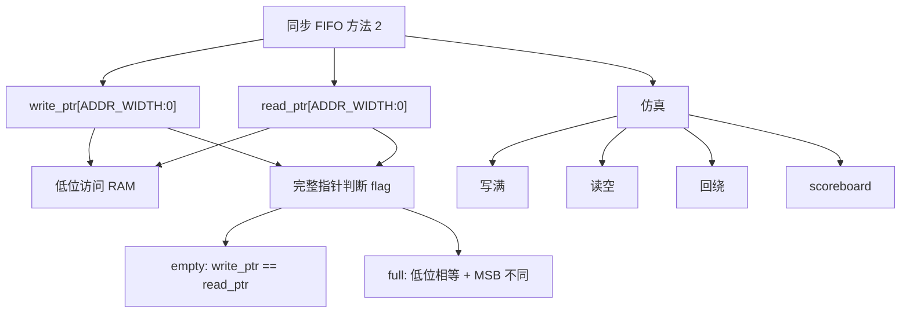

# 任务23：同步 FIFO 设计方法 2 介绍与仿真

## 本章知识全景图

### 一眼看懂这讲在讲什么

同步 FIFO 方法 2 的核心是：不再单独维护 occupancy counter，而是让读写指针多扩展 1 bit，用“低位地址相同、高位圈数不同”区分满，用“扩展指针完全相同”区分空。它解决的是 FIFO 里最经典的二义性：读写地址相等时，到底是空，还是满。

核心概念：扩展指针、地址低位、额外 MSB、指针回绕、empty、full、`write_allow`、`read_allow`、scoreboard、波形 debug。

逻辑主线：

1. 只比较 RAM 地址低位，读写指针相等既可能表示空，也可能表示满。
2. 给指针多加一位 MSB，记录指针绕圈信息。
3. 访问 RAM 只用低位，判断 full/empty 使用完整扩展指针。
4. 空：读写扩展指针完全相等。
5. 满：低位相等，但扩展 MSB 不同。
6. 仿真必须覆盖写满、读空、回绕和同拍读写。

### 概念地图



### 最短学习路径

1. 先理解低位地址相等的二义性。
2. 再把扩展 MSB 理解成“圈数奇偶”。
3. 明确访问 RAM 和判断 flag 用的指针位段不同。
4. 写 RTL 时所有指针推进基于 `write_allow/read_allow`。
5. 用波形同时看指针、flag、allow 和数据顺序。

## 1. 方法 2 从“空满二义性”开始

如果只看 RAM 地址，读指针等于写指针有两种可能：一种是刚复位或数据全读完，FIFO 为空；另一种是写指针绕了一圈追上读指针，FIFO 已满。方法 2 的目标就是消除这个二义性。

把 RAM 地址低位想成跑道上的格子，把扩展 MSB 想成“第几圈”的标记。同一个格子同一圈，是读写都站在同一起点，FIFO 为空；同一个格子差一圈，是写指针已经领先读指针整整一圈，FIFO 已满。写指针合法领先读指针的距离最多就是一个深度，超过这个距离就不是“更满”，而是覆盖未读数据。

视觉核对：01:10-01:35，画面引入 pointer method，重点看方法从 counter 切换到指针比较。


例子：深度 8 的 FIFO，地址低位范围是 0 到 7。

```text
复位：write_addr = 0, read_addr = 0  -> 空
写 8 次：write_addr 又回到 0, read_addr = 0 -> 满
```

如果没有额外信息，工具和人都无法只靠低位地址判断这是空还是满。

## 2. 读写指针记录下一次访问位置

读写指针不是“当前数据位置”的口头标签，而是 RTL 状态：写指针指向下一次写入地址，读指针指向下一次读出地址。只有真实读写发生时，它们才推进。

视觉核对：04:00-04:30，画面展示 read/write pointer 生成，重点看指针只在 allow 条件下更新。


典型写法：

```systemverilog
assign write_allow = write_enable && !full;
assign read_allow  = read_enable  && !empty;

always_ff @(posedge clk or negedge rst_n) begin
  if (!rst_n)
    write_ptr <= '0;
  else if (write_allow)
    write_ptr <= write_ptr + 1'b1;
end

always_ff @(posedge clk or negedge rst_n) begin
  if (!rst_n)
    read_ptr <= '0;
  else if (read_allow)
    read_ptr <= read_ptr + 1'b1;
end
```

如果指针跟着原始 enable 走，而不是跟着 allow 走，满写和空读都会破坏状态。

## 3. empty：扩展指针完全相等

FIFO 为空时，已经写入的数据数量等于已经读出的数据数量，所以写指针和读指针处在同一个“圈数 + 地址”状态。方法 2 直接用完整扩展指针相等判空。

视觉核对：07:20-07:50，画面展示 empty by pointer，重点看不是只比较低位地址，而是完整指针相等。


写法：

```systemverilog
assign empty = (write_ptr == read_ptr);
```

这条语句成立的前提是指针宽度比地址宽度多 1 位。例如深度 8：

```systemverilog
localparam int ADDR_WIDTH = 3;
logic [ADDR_WIDTH:0] write_ptr; // 4 bit
logic [ADDR_WIDTH:0] read_ptr;  // 4 bit
```

`write_ptr[2:0]` 是 RAM 地址，`write_ptr[3]` 是回绕圈数信息。

## 4. full：低位相等，但扩展 MSB 不同

FIFO 满时，写指针比读指针多走了整整一个深度。低位地址相同，说明回到了同一个 RAM 地址；扩展 MSB 不同，说明不是同一圈。

视觉核对：15:00-15:30，画面展示 full wrap-around；19:10-19:40，画面展示 extra MSB 判断 full/empty。


这两张图要连着读：第一张看低位地址回到同一格以后为什么产生空/满二义性，第二张看扩展 MSB 如何把“同格同圈”和“同格差一圈”拆开。只记 full 公式会忘，能手算“同格差一圈”才真正理解。

典型写法：

```systemverilog
assign full =
  (write_ptr[ADDR_WIDTH]     != read_ptr[ADDR_WIDTH]) &&
  (write_ptr[ADDR_WIDTH-1:0] == read_ptr[ADDR_WIDTH-1:0]);
```

直觉：

- 低位相等：访问的是同一个 RAM 地址。
- MSB 不同：写指针比读指针多绕了一圈。
- 因此 FIFO 已满，不是空。

这个思想会直接通向异步 FIFO 的 Gray 指针满空判断，只是异步场景中不能同步二进制指针。

## 5. 访问 RAM 用低位，判断 flag 用完整指针

初学者最容易把扩展指针整段拿去访问 RAM，或者只用低位判断 full/empty。正确拆法是：低位给 RAM 地址，完整指针给 full/empty 判断。

视觉核对：31:00-31:30，画面展示 FIFO code，重点看指针、地址和 flag 逻辑如何分开。


代码骨架：

```systemverilog
logic [ADDR_WIDTH:0] write_ptr;
logic [ADDR_WIDTH:0] read_ptr;

wire [ADDR_WIDTH-1:0] write_addr = write_ptr[ADDR_WIDTH-1:0];
wire [ADDR_WIDTH-1:0] read_addr  = read_ptr[ADDR_WIDTH-1:0];

always_ff @(posedge clk) begin
  if (write_allow)
    mem[write_addr] <= write_data;
end
```

判断规则：

```systemverilog
assign empty = (write_ptr == read_ptr);

assign full =
  (write_ptr[ADDR_WIDTH]     != read_ptr[ADDR_WIDTH]) &&
  (write_ptr[ADDR_WIDTH-1:0] == read_ptr[ADDR_WIDTH-1:0]);
```

一句话记忆：RAM 不认识圈数，flag 必须认识圈数。

## 6. testbench 必须把指针推过边界

方法 2 的价值只有在回绕处才真正暴露。testbench 如果只写两三个数据再读出，根本测不到扩展 MSB 的作用。

视觉核对：36:00-36:30，画面展示 testbench，重点看激励要覆盖写满、读空和回绕。


最小激励：

1. reset 后检查 `empty=1/full=0`。
2. 连续写 `DEPTH` 次，检查 full 拉高。
3. 满时继续写，检查写指针不推进。
4. 连续读 `DEPTH` 次，检查数据顺序和 empty。
5. 空时继续读，检查读指针不推进。
6. 再写读一轮，让指针跨过回绕边界。
7. 加同拍读写，确认策略一致。

如果按工程方式复跑，建议把入口固定成：

```bash
make clean
make sim
make wave
```

`make sim` 至少要完成四段断言：写满后 `full=1`，满时继续写 `write_ptr` 不推进；连续读空后 `empty=1`，空时继续读 `read_ptr` 不推进；指针回绕处扩展 MSB 翻转；scoreboard 读出顺序与写入顺序完全一致。`make wave` 打开的 FSDB/VCD 要包含 `write_ptr/read_ptr/write_allow/read_allow/full/empty/read_data/expected`，否则 debug 会少证据。

scoreboard 写法口径：

- 写入成功时，把 `write_data` push 到参考队列。
- 读出成功时，从参考队列 pop，和 `read_data` 比较。
- 如果 FIFO 是同步读，要按读延迟调整比较时间。

没有 scoreboard，只靠人工看 `full/empty`，不能证明数据顺序正确。

## 7. 波形 debug 要同时看指针、flag、allow 和数据

FIFO 波形不能只看 `read_data`。读出错误可能来自写指针、读指针、full/empty、allow、RAM 地址或 testbench 期望值。

视觉核对：47:10-47:40，画面展示 waveform debug；51:00-51:30，画面展示 debug method。


这两张图也有分工：波形图负责指出异常发生在哪个周期，debug 方法图负责给排查顺序。不要只盯 `read_data`，它是结果信号；真正的原因通常藏在 `allow` 是否放行、指针是否推进、MSB 是否在回绕处翻转。

推荐观察信号：

```text
clk, rst_n
write_enable, read_enable
write_allow, read_allow
write_ptr, read_ptr
write_addr, read_addr
full, empty
write_data, read_data
scoreboard_expected
```

debug 顺序：

1. 先看 allow 是否符合 full/empty。
2. 再看指针是否只在 allow 时推进。
3. 看回绕时 MSB 是否翻转。
4. 看 full/empty 是否在正确边界变化。
5. 最后看读出数据是否与 scoreboard 一致。

如果读出顺序错了，不要先怀疑 RAM。先看写指针和读指针有没有在错误周期推进。

## 8. 方法 1 和方法 2 的取舍

count 方法更直观，扩展指针方法更接近异步 FIFO 的思路。同步 FIFO 两者都能做，选择取决于设计规模、验证习惯和后续是否要过渡到异步 FIFO。

| 方案 | 状态 | 优点 | 风险 |
|---|---|---|---|
| 方法 1：count | `count` | full/empty 直观，适合教学和断言 | 同拍读写、边界 count 位宽要小心 |
| 方法 2：扩展指针 | `write_ptr/read_ptr` 多 1 位 | 直接解决空满二义性，便于理解异步 FIFO | 容易混淆 RAM 地址和完整指针 |

工程中还要写清同拍策略。特别是 `full && read_enable && write_enable` 时，本拍读出是否允许同拍写入？保守设计可能禁止写，高吞吐设计可能允许写。无论哪种，RTL、testbench、接口文档必须一致。

## 9. 方法 2 的验收表

| 场景 | 期望 |
|---|---|
| reset | `write_ptr=0/read_ptr=0/empty=1/full=0` |
| 写到满 | 低位相等，MSB 不同，`full=1` |
| 满时写 | `write_allow=0`，写指针不继续推进 |
| 读到空 | 两个扩展指针完全相等，`empty=1` |
| 空时读 | `read_allow=0`，读指针不继续推进 |
| 回绕 | 低位回到 0，扩展 MSB 翻转 |
| 同拍读写 | 指针推进与占用变化符合设计规格 |

通过标准不是“仿真没报错”，而是这些边界都有可解释的波形和自检结果。

### 扩展指针法的手算例子

以深度 8 为例，地址宽度 `ADDR_WIDTH=3`，扩展指针宽度为 4 bit。

| 动作 | `write_ptr` | `read_ptr` | 低位是否相等 | MSB 是否不同 | 状态 |
|---|---:|---:|---|---|---|
| reset | `0_000` | `0_000` | 是 | 否 | 空 |
| 写 1 次 | `0_001` | `0_000` | 否 | 否 | 非空非满 |
| 写 8 次 | `1_000` | `0_000` | 是 | 是 | 满 |
| 读 1 次 | `1_000` | `0_001` | 否 | 是 | 非空非满 |
| 读 8 次 | `1_000` | `1_000` | 是 | 否 | 空 |

这张表能防住两个常见误解：

- `write_addr == read_addr` 不等于一定空；要看扩展 MSB。
- `write_ptr == read_ptr` 才是空；低位相等且 MSB 不同才是满。

把这个表和波形对应起来：回绕那一拍低位会跳回 0，扩展 MSB 翻转；如果 full 没在这一拍附近出现，优先查 full 组合逻辑和指针位宽。

## 本章速记

- 低位地址相等有二义性：可能空，也可能满。
- 扩展 MSB 记录圈数，解决空满区分。
- empty：完整扩展指针相等。
- full：低位相等，MSB 不同。
- RAM 地址只用低位，full/empty 判断用完整指针。
- 方法 2 是学习异步 FIFO Gray 指针的前置台阶。

## 自测题与答案

1. **为什么只比较低位地址不能区分空和满？**  
   答：复位或读完时读写低位地址相等表示空；写满一圈后写低位地址也会回到读地址，低位仍相等但 FIFO 是满。

2. **扩展 MSB 起什么作用？**  
   答：记录指针回绕的圈数信息，用来区分“同地址同一圈”和“同地址不同圈”。

3. **为什么 `empty = (write_ptr == read_ptr)` 成立？**  
   答：完整扩展指针相等表示写入数量和读出数量相等，并且处于同一圈同一地址，没有未读数据。

4. **full 的判断条件是什么？**  
   答：读写指针低位地址相同，但扩展 MSB 不同，表示写指针比读指针多绕一圈。

5. **访问 RAM 为什么不能用完整扩展指针？**  
   答：RAM 深度只需要地址低位；扩展 MSB 是圈数信息，不属于 RAM 地址。

6. **方法 2 为什么对异步 FIFO 学习有帮助？**  
   答：它先建立“地址低位访问 RAM，额外位判断圈数”的思想；异步 FIFO 会把这个思想换成 Gray 指针并跨域同步。

