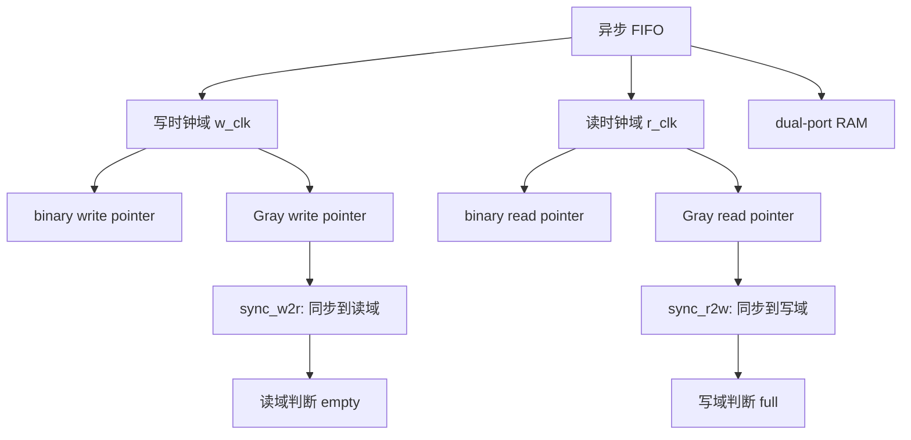

# 任务24：异步 FIFO 的设计

## 本章知识全景图

### 一眼看懂这讲在讲什么

异步 FIFO 不是“同步 FIFO 换两个时钟”这么简单。它的本质是用一块双端口存储器连接两个时钟域：写端在 `w_clk` 下推进写指针，读端在 `r_clk` 下推进读指针；为了判断 full/empty，每个时钟域都必须知道对方指针，但对方指针不能直接拿来比较，必须先转 Gray code，再用同步器跨域。

最有用的直觉是“本地账本 + 延迟复印件”：写域和读域各自维护一本本地账本，写域只能拿到读域账本的延迟复印件，读域也只能拿到写域账本的延迟复印件。复印件旧一点会让自己保守停一下，造成 false full 或 false empty；危险的是直接抢对方正在修改的原件来判断满空，那会把跨域采样错误变成数据覆盖或假读。

核心概念：异步 FIFO、CDC、双端口 RAM、binary pointer、Gray pointer、two-flop synchronizer、write domain、read domain、`w_full`、`r_empty`、false full/false empty、full/empty 保守性。

逻辑主线：

1. 写端和读端属于不同 clock domain，不能共享一个 count。
2. RAM 数据可以由双端口结构承载，但控制指针必须分域处理。
3. 二进制指针跨域有多 bit 同时变化风险，所以先转 Gray code。
4. 写域同步读指针，用来判断 full；读域同步写指针，用来判断 empty。
5. Gray 指针同步后可能带来保守延迟，但不能造成数据流错误。
6. 异步 FIFO 验证重点是跨域时钟比例、满空边界、回绕和 false full/false empty。

### 概念地图



### 最短学习路径

1. 先把异步 FIFO 拆成写域、读域、RAM 三部分。
2. 再理解为什么不能直接跨域比较二进制指针。
3. 学会二进制指针用于本地地址和加法，Gray 指针用于跨域同步。
4. 记住 empty 在读域判断，full 在写域判断。
5. 最后用快写慢读、慢写快读、回绕和边界波形验证。

## 1. 异步 FIFO 的结构边界是双时钟

异步 FIFO 用于两个异步时钟域之间传多 bit 数据。写端只受写时钟控制，读端只受读时钟控制；数据存入同一块双端口 RAM，但控制状态必须各自在本时钟域更新。

视觉核对：07:00-07:30，画面展示从 FIFO 工程目录/代码进入双时钟结构；30:00-30:30，画面展示包含 Write_control、Read_control、RAM、Bin_to_gray 和 SYN 的异步 FIFO 总结构。重点看写端、读端、RAM、Gray 转换和同步器分属不同职责。


第一张图只定位“双时钟入口”：写请求、写时钟、读请求、读时钟不是一个节拍系统。第二张才是结构主图：数据走中间 RAM，指针走上下两条 Gray 同步通道。读这张图时先找四个边界：写域、读域、RAM 边界、跨域同步边界。

模块划分口径：

| 模块 | 时钟域 | 作用 |
|---|---|---|
| RAM | 写端 `w_clk`，读端 `r_clk` | 保存数据，低位地址访问 |
| write pointer | `w_clk` | 写成功时推进，生成写地址和 `w_gray` |
| read pointer | `r_clk` | 读成功时推进，生成读地址和 `r_gray` |
| sync_r2w | `w_clk` | 把读 Gray 指针同步到写域 |
| sync_w2r | `r_clk` | 把写 Gray 指针同步到读域 |
| full logic | `w_clk` | 写域判断是否满 |
| empty logic | `r_clk` | 读域判断是否空 |

这张划分表比代码更重要：异步 FIFO 的 bug 多数来自“信号属于哪个时钟域”没分清。

## 2. 不能跨域同步二进制多 bit 指针

二进制计数器递增时可能多个 bit 同时变化，例如 `0111 -> 1000` 四个 bit 都变。目标时钟域如果正好在这些 bit 变化附近采样，可能采到源时钟域从未真实出现过的组合。

视觉核对：13:00-13:30，画面讲 pointer/signal synchronization 的问题；重点看课程用二进制变化解释中间态风险。


错误做法：

```systemverilog
// 错误：直接把读域二进制指针拿到写域比较
assign w_full = (w_bin_next == r_bin);
```

问题：

- `r_bin` 不属于写时钟域，直接比较会形成 CDC 风险。
- 多 bit 同时变化，写域可能采到错误中间值。
- full/empty 错误会阻塞读写，严重时覆盖未读数据或读出无效数据。

异步 FIFO 允许保守延迟：明明不满但暂时判断满，或明明不空但暂时判断空，会降低吞吐但不破坏数据；不允许乐观错误：实际满却判断不满，实际空却判断不空。

## 3. Gray code 让跨域指针每次只变 1 bit

Gray code 的价值是相邻计数值只有 1 bit 变化。异步 FIFO 仍保留本地二进制指针用于加法和 RAM 地址，同时把二进制指针转换成 Gray 指针跨域同步。

视觉核对：19:00-19:30，画面讲 Gray 编码，重点看“每次只有 1 bit 变化”。


二进制转 Gray：

```systemverilog
assign gray = (bin >> 1) ^ bin;
```

为什么还要保留 binary pointer：

- 二进制指针方便 `+1`。
- RAM 地址使用二进制低位。
- Gray 指针用于跨域，因为它每步只变一个 bit。

典型写域逻辑：

```systemverilog
wire [ADDR_WIDTH:0] w_bin_next  = w_bin + (w_req && !w_full);
wire [ADDR_WIDTH:0] w_gray_next = (w_bin_next >> 1) ^ w_bin_next;

always_ff @(posedge w_clk or negedge rst_n) begin
  if (!rst_n) begin
    w_bin  <= '0;
    w_gray <= '0;
  end else begin
    w_bin  <= w_bin_next;
    w_gray <= w_gray_next;
  end
end
```

读域同理生成 `r_bin/r_gray`。

## 4. 双触发器同步的是 Gray 指针，不是数据本身

跨域同步器用于把对方 Gray 指针送到本时钟域。写域同步读 Gray 指针，判断还能不能继续写；读域同步写 Gray 指针，判断有没有数据可读。FIFO 中真正的多 bit 数据通过 RAM 传递，不是把数据逐 bit 打两拍。

视觉核对：45:00-45:30，画面展示 `syn.v`，重点看 `syn_reg_1/syn_reg_2` 两级寄存器；这说明课程里的同步模块同步的是一组 Gray 指针信号，而不是 FIFO 数据本身。


同步器骨架：

```systemverilog
always_ff @(posedge w_clk or negedge rst_n) begin
  if (!rst_n) begin
    r_gray_wclk_d1 <= '0;
    r_gray_wclk_d2 <= '0;
  end else begin
    r_gray_wclk_d1 <= r_gray;
    r_gray_wclk_d2 <= r_gray_wclk_d1;
  end
end
```

读域也有对称结构：

```systemverilog
always_ff @(posedge r_clk or negedge rst_n) begin
  if (!rst_n) begin
    w_gray_rclk_d1 <= '0;
    w_gray_rclk_d2 <= '0;
  end else begin
    w_gray_rclk_d1 <= w_gray;
    w_gray_rclk_d2 <= w_gray_rclk_d1;
  end
end
```

两个重要后果：

- 同步后的对方指针可能滞后 1 到 2 拍，所以 full/empty 可能保守。
- 保守 flag 会暂停操作，但不应该破坏数据顺序。

## 5. empty 在读时钟域判断

读域要判断“是否还有数据可读”，需要比较本地读 Gray next 与同步过来的写 Gray 指针。如果二者相等，说明读指针追上写指针，FIFO 对读域来说为空。

视觉核对：31:00-31:30，画面展示 empty/full 关键点解释，重点看 Gray 编码和保守空判断。


常见写法：

```systemverilog
assign r_empty_next = (r_gray_next == w_gray_rclk_d2);

always_ff @(posedge r_clk or negedge rst_n) begin
  if (!rst_n)
    r_empty <= 1'b1;
  else
    r_empty <= r_empty_next;
end
```

为什么用 `r_gray_next`：如果本拍读成功，读指针会前进，empty 应尽早反映“读完以后是否为空”。注册 flag 可以让时序更稳定。

false empty 的含义：

- 实际已经有新数据写入，但写 Gray 指针还没同步到读域。
- 读域暂时认为 empty，读操作被暂停。
- 这只降低吞吐，不会读出假数据。

### Gray 转换代码要能从公式落到 RTL

视觉核对：50:00-50:30，画面展示 `bin_to_gray.v`，重点看高位直接保留，低位由相邻二进制位异或得到。


课程代码把转换拆成两层：

```systemverilog
assign h_b = bin_c[WIDTH_D-1];

always @(*) begin
  for (i = 0; i < WIDTH_D-1; i = i + 1)
    gray_c_d[i] = bin_c[i] ^ bin_c[i+1];
end

assign gray_c = {h_b, gray_c_d};
```

它和常见公式等价：

```systemverilog
assign gray = (bin >> 1) ^ bin;
```

手算一组：二进制 `0100` 转 Gray，最高位 `0` 保留，其余位相邻异或：

```text
gray[3] = bin[3] = 0
gray[2] = bin[3] ^ bin[2] = 0 ^ 1 = 1
gray[1] = bin[2] ^ bin[1] = 1 ^ 0 = 1
gray[0] = bin[1] ^ bin[0] = 0 ^ 0 = 0
结果：0110
```

这正对应课程表中十进制 4 的 Gray 码 `0110`。如果这一层没手算通，后面 full 的 Gray 比较会变成死记硬背。

## 6. full 在写时钟域判断

写域要判断“再写是否会追上未读数据”。同步 FIFO 方法 2 里，full 是低位相等、扩展 MSB 不同；Gray 指针下对应条件更特殊：写 Gray next 与同步读 Gray 指针相比，最高两位取反，低位相等。

视觉核对：37:00-37:30，画面展示 full 判断；44:00-44:30，画面进入异步 FIFO 代码；55:00-55:30，画面展示 `write_part.v` 中 `w_full` 的 Gray 比较逻辑。


这组三张图按“规则 -> 模块边界 -> 代码落点”读：第一张解释 full 的 Gray 比较规则，第二张说明 full 逻辑属于写控制模块，第三张把规则落到 `w_full_next` 代码。读者只要能把这三层对上，就不会把同步 FIFO 的“只翻一个 MSB”误套到异步 FIFO。

常见判断：

```systemverilog
assign w_full_next =
  (w_gray_next == {~r_gray_wclk_d2[ADDR_WIDTH:ADDR_WIDTH-1],
                   r_gray_wclk_d2[ADDR_WIDTH-2:0]});

always_ff @(posedge w_clk or negedge rst_n) begin
  if (!rst_n)
    w_full <= 1'b0;
  else
    w_full <= w_full_next;
end
```

为什么是最高两位取反：标准 reflected Gray code 中，FIFO 满表示写指针比读指针多一个深度；在 Gray 表示下，这个关系体现为高两位相反、其余位相同。只取反一个 MSB 是同步二进制扩展指针的直觉，不能直接套到 Gray full 判断上。

把深度 8 的 4 bit 指针拿来手算：

| 二进制 | Gray | 含义 |
|---|---|---|
| `0_000` | `0000` | 读指针在第 0 圈地址 0 |
| `1_000` | `1100` | 写指针比读指针多一圈，FIFO 满 |

`0000` 到 `1100` 的关系不是只翻最高位，而是最高两位都翻转。因此 full 公式要比较：

```systemverilog
{~r_gray_sync[ADDR_WIDTH:ADDR_WIDTH-1],
  r_gray_sync[ADDR_WIDTH-2:0]}
```

如果写成只翻最高位，某些回绕边界会漏判或误判 full。

false full 的含义：

- 实际读端已经读走数据，但读 Gray 指针还没同步到写域。
- 写域暂时认为 full，写操作暂停。
- 这只降低吞吐，不会覆盖未读数据。

## 7. RAM 地址仍然使用二进制低位

Gray 指针用于跨域比较，不适合直接访问 RAM。RAM 地址仍来自本地二进制指针低位。

```systemverilog
assign w_addr = w_bin[ADDR_WIDTH-1:0];
assign r_addr = r_bin[ADDR_WIDTH-1:0];
```

写端：

```systemverilog
always_ff @(posedge w_clk) begin
  if (w_req && !w_full)
    mem[w_addr] <= w_data;
end
```

读端是否同步输出取决于 RAM 类型和设计规格。testbench 必须知道读数据是同拍有效还是下一拍有效，否则会把正确硬件误判为错误。

一句话边界：binary 指针服务本地域的加法和地址，Gray 指针服务跨域同步和 flag 判断。

## 8. 异步 FIFO 验证要改变时钟比例

只用同频同相的两个 clock 跑异步 FIFO，几乎测不到 CDC 风险。testbench 至少要覆盖写快读慢、读快写慢、接近满、接近空、回绕和 reset。

视觉核对：52:00-52:30，画面展示 testbench/waveform；60:00-60:30，画面总结异步 FIFO 空满延迟和保守判断。


波形图用来查“延迟账本”是否按预期工作：写域看到的读指针会慢，读域看到的写指针也会慢；调试总结图用来归纳这种慢带来的保守空满。验收重点不是 flag 永远无延迟，而是延迟只会暂停读写，不会允许满写或空读。

验证矩阵：

| 场景 | 目的 |
|---|---|
| 写快读慢 | 推近 full，检查不覆盖 |
| 读快写慢 | 推近 empty，检查不读假数据 |
| 写满后读 | 检查 false full 是否能释放 |
| 读空后写 | 检查 false empty 是否能释放 |
| 指针多次回绕 | 检查 Gray pointer 和地址低位关系 |
| 两域 reset | 检查 reset 后指针和 flag 确定 |
| 随机读写 | 用 scoreboard 检查数据顺序 |

建议至少跑两组非整数倍时钟：

```systemverilog
always #3.5 w_clk = ~w_clk;  // 7 ns
always #5.5 r_clk = ~r_clk;  // 11 ns
```

再反过来跑 `w_clk=11ns/r_clk=7ns`。第一组把 FIFO 推向 full，第二组把 FIFO 推向 empty。reset 要分别覆盖两域同时释放和错相释放；释放后 `w_bin/r_bin/w_gray/r_gray` 回到 0，`r_empty=1`，`w_full=0`。

异步 FIFO 还应加两类断言：第一，Gray 指针每次成功推进只能变化 1 bit；第二，满时无读不得写、空时无写不得读。可以把后者写成自然语言验收：实际满却允许写是数据覆盖，实际空却允许读是假数据，这两类不能接受；false full/false empty 只会暂停读写，可以接受但要能在对方指针同步后释放。

scoreboard 仍然是核心：写成功时入队，读成功时出队比较。波形用于解释为什么某拍写被 full 阻塞，或某拍读被 empty 阻塞。

## 9. 异步 FIFO 的常见错误

| 错误 | 后果 | 修正 |
|---|---|---|
| 直接同步二进制指针 | 多 bit 中间态导致满空误判 | 转 Gray 后同步 |
| 同步数据而不是指针 | 多 bit 数据可能不一致 | 数据走 RAM，控制走 Gray 指针 |
| full 判断只取反一个 MSB | Gray full 条件错误 | 最高两位取反，低位相等 |
| 用 Gray 指针访问 RAM | 地址顺序错误 | RAM 地址用 binary 低位 |
| 没有 CDC timing 约束 | 物理实现后 Gray 多 bit 到达时间差过大 | 对跨域 Gray bus 加约束 |
| 只测同频时钟 | CDC 边界没被压力覆盖 | 改变读写时钟比例和相位 |

特别注意最后一项：Gray code 保证逻辑计数相邻状态只变 1 bit，但物理实现中如果各 bit 延迟差太大，到目标寄存器处仍可能表现为多 bit 分散到达。因此真实工程还需要 CDC 检查和时序约束。

### 最小 RTL 模块分工清单

异步 FIFO 不建议写成一个巨大的 always 块。更稳定的工程拆分是：

| 模块 | 输入 | 输出 | 本地域 |
|---|---|---|---|
| `dual_port_ram` | `w_clk/w_en/w_addr/w_data/r_addr` | `r_data` | 写读双端口 |
| `write_part` | `w_clk/w_req/r_gray_sync` | `w_bin/w_gray/w_addr/w_full` | 写域 |
| `read_part` | `r_clk/r_req/w_gray_sync` | `r_bin/r_gray/r_addr/r_empty` | 读域 |
| `bin_to_gray` | `bin` | `gray` | 组合逻辑 |
| `syn` | `syn_clk/data_in` | `syn_data` | 目标域 |

检查原则：

- `write_part` 里不能直接使用未同步的 `r_gray`。
- `read_part` 里不能直接使用未同步的 `w_gray`。
- `dual_port_ram` 的地址来自 binary 低位，不来自 Gray。
- `syn` 的输出必须在目标时钟域使用，不能再被源域组合逻辑拿回去。

## 本章速记

- 异步 FIFO 是多 bit CDC 的经典结构。
- 数据走双端口 RAM，跨域同步的是 Gray 指针。
- binary pointer 用于本地域加法和 RAM 地址。
- Gray pointer 用于跨域同步，因为相邻值只变 1 bit。
- empty 在读域判断，full 在写域判断。
- false empty/false full 可以接受，错误地不空/不满不可接受。

## 自测题与答案

1. **为什么异步 FIFO 不能用一个 count 判断 full/empty？**  
   答：读写属于不同 clock domain，一个 count 需要同时被两个异步时钟更新，会产生 CDC 和仲裁问题。

2. **为什么不能直接跨域同步二进制指针？**  
   答：二进制指针递增时可能多个 bit 同时变化，目标域可能采到错误中间值，还可能产生亚稳态。

3. **Gray 指针解决了什么问题？**  
   答：相邻计数值只变化 1 bit，降低跨域同步多 bit 指针时采到错误组合的风险。

4. **异步 FIFO 中同步器同步的是数据还是指针？**  
   答：同步的是对方时钟域的 Gray 指针；多 bit 数据通过双端口 RAM 存取。

5. **empty 在哪个时钟域判断？需要比较什么？**  
   答：empty 在读时钟域判断，比较本地读 Gray next 和同步到读域的写 Gray 指针。

6. **full 在哪个时钟域判断？Gray full 的典型条件是什么？**  
   答：full 在写时钟域判断；典型条件是写 Gray next 等于同步读 Gray 指针的最高两位取反、其余位相同。

7. **false empty / false full 为什么可以接受？**  
   答：它们只会让读写暂时暂停，降低吞吐；不会读出假数据或覆盖未读数据。真正危险的是实际空却允许读、实际满却允许写。

8. **为什么异步 FIFO 验证必须改变读写时钟比例？**  
   答：同频同相无法充分暴露跨域延迟、flag 保守性和边界问题；写快读慢、读快写慢才能推到 full/empty 压力场景。

