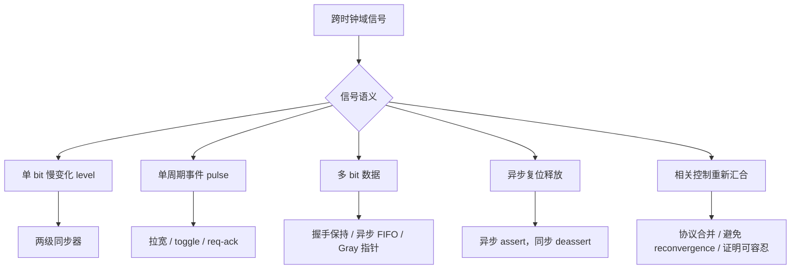

# 任务25：CDC / Metastability（亚稳态）

## 本章知识全景图

CDC 的核心不是“跨时钟域信号都加两拍”，而是先判断跨域对象的语义，再选择能保护该语义的结构。亚稳态解释的是异步采样为什么会失去确定性；CDC 设计要进一步保证事件不丢、数据不混版、复位释放不乱序、工具报告中的风险都有处理结论。

| 层级 | 本章核心概念 | 要解决的问题 | 工程输出 |
|---|---|---|---|
| 物理风险 | metastability、setup/hold | 接收触发器在变化窗口采样，输出恢复时间不可控 | 明确异步采样不是普通 RTL 语义问题 |
| 基本结构 | two-flop synchronizer | 降低单 bit level 信号的亚稳态传播概率 | 目的域只使用第二拍输出 |
| 事件语义 | fast-to-slow pulse、toggle、handshake | 快域短脉冲可能被慢域漏采 | 事件在目的域可计数、可确认 |
| 数据语义 | data hold、multi-bit CDC、Gray code、FIFO | 多 bit 数据可能被采成不同版本 | 数据保持到确认点，或用 FIFO/Gray 指针保护 |
| 结构风险 | reconvergence、reset deassert | 单独同步后的相关信号重新组合，或复位释放不一致 | CDC report 分类、修复或有边界 waiver |

最短学习路径：

```text
setup/hold 违例为什么会产生亚稳态
  -> 两级同步器能解决哪一类问题
  -> pulse / bus / reset / reconvergence 为什么不能机械套两拍
  -> 用 CDC report 和协议证据判断是否可交付
```



## 全视频地图

| 时间段 | 教学块 | 读者必须保留的知识动作 |
|---|---|---|
| 00:00-10:00 | 从 eFlash 设计问题引入 CDC 与亚稳态 | 明确 CDC 是 clock domain crossing，不是语法错误；风险来自接收域无法保证采样语义 |
| 10:00-18:00 | 解释亚稳态、setup/hold 窗口和传播 | 把触发器采样窗口、恢复时间、后级逻辑传播连成一条因果链 |
| 18:00-27:00 | 两级同步器与单 bit level 同步 | 记住两级同步器降低概率，但只适合慢变化单 bit level |
| 27:00-38:00 | 快到慢 pulse、data hold、reconvergence | 区分“采到稳定值”和“事件/数据语义正确” |
| 38:00-51:00 | 多 bit CDC、reset 同步和 CDC report | 用结构规则把 warning 分成必须修、可解释、需补约束三类 |
| 51:00-64:57 | 六类 CDC 图收束 | 能看到跨域路径后先分类，再选结构，最后给报告证据 |

## 1. CDC 的问题对象：不是信号跨线，而是语义跨域

CDC = Clock Domain Crossing，表示一个源时钟域产生的信号被另一个目的时钟域使用。危险不在“连线跨了两个模块”，而在目的域采样时，源域信号可能正处在变化窗口内。


截图核对：视频 01:30-03:00，画面应看到亚稳态引入页；读图时先找源域信号变化点，再找目的域采样边沿。

看到跨域信号时先问五个问题：

| 问题 | 影响 |
|---|---|
| 源时钟和目的时钟是否同频同相？ | 不同频、不同相、异步时钟都不能默认安全采样 |
| 信号是 level、pulse、bus 还是 reset？ | 信号语义决定同步结构 |
| 目的域是否必须看到每一次事件？ | pulse 需要 toggle、拉宽或握手 |
| 数据是否必须保持同一版本？ | 多 bit 数据需要保持协议或 FIFO |
| 同步后的信号是否重新组合？ | reconvergence 可能制造新的不一致状态 |

如果这五个问题答不出来，就不能直接说“加两拍就好了”。

## 2. 亚稳态：触发器短时间无法解析成稳定 0 或 1

亚稳态不是 RTL 里的第三种稳定逻辑值，而是触发器内部模拟电路在采样窗口被打扰后，需要不确定时间才能恢复到 0 或 1。真实硅片里，恢复时间可能侵入下一级采样窗口；普通 RTL 仿真通常看不到这个过程。


截图核对：视频 08:00-10:00，画面应能对应 setup/hold 窗口；重点看数据变化是否落在采样边沿前后禁区。

触发器的要求可以压成一句话：

```text
采样边沿前稳定足够久，采样边沿后继续稳定足够久。
```

一个更贴近直觉的比喻是：目的域触发器像只在整点按快门的相机，源域信号像正在移动的物体。物体在快门前后都静止，照片就清楚；物体正好在快门瞬间晃动，照片就可能模糊。两级同步器不是让物体不晃，而是给第一张可能模糊的照片一拍时间恢复清晰；但如果事件根本没被拍到，或者一组数据的每个 bit 被拍在不同瞬间，单纯加两拍仍然救不了语义。

违反 setup/hold 后，触发器可能：

- 恢复得足够快，系统没表现出错误。
- 恢复得较慢，后级逻辑在不确定期间采样。
- 恢复到与源域预期不同的值，造成偶发功能错误。

所以 CDC 不是“每次都会错”的问题，而是“概率很低但一旦发生很难复现”的硅上问题。

## 3. 亚稳态会传播，两级同步器只是隔离概率

亚稳态真正危险的地方是传播。第一级触发器如果没及时恢复，后面的组合逻辑或多个寄存器可能看到不同解释，功能错误就从一个采样事件扩散成状态机跳错、控制信号误触发或计数错误。


截图核对：视频 12:00-15:00，画面应显示亚稳态从寄存器输出传播到后级逻辑；读图重点是第一级输出不能直接扇出给功能逻辑。

单 bit 慢变化 level 信号常用两级同步器：

```systemverilog
always_ff @(posedge dst_clk or negedge rst_n) begin
    if (!rst_n) begin
        sync1 <= 1'b0;
        sync2 <= 1'b0;
    end else begin
        sync1 <= async_sig;
        sync2 <= sync1;
    end
end

assign safe_sig = sync2;
```


截图核对：视频 18:00-21:00，画面应出现两级同步结构；验收点是目的域逻辑只使用第二拍 `sync2`。

两级同步器的边界：

| 能做什么 | 不能做什么 |
|---|---|
| 给第一级输出更多恢复时间 | 不能保证短脉冲一定被慢时钟看到 |
| 降低亚稳态传播到功能逻辑的概率 | 不能保证多 bit 数据同一版本 |
| 适合单 bit 慢变化 level 控制 | 不能修复 reconvergence |
| 作为 CDC 工具可识别结构 | 不能替代功能协议验证 |

## 4. 快到慢 pulse：事件可能根本没被采到

快时钟域的单周期脉冲传到慢时钟域时，目的时钟可能完全错过这个脉冲。此时问题不只是亚稳态，而是事件语义丢失：目的域连“发生过一次”都不知道。


截图核对：视频 28:00-32:00，画面应展示 fast-to-slow pulse；重点看脉冲宽度是否覆盖目的域采样边沿。

常见处理：

| 方案 | 适用场景 | 验收口径 |
|---|---|---|
| 拉宽 pulse | 频率关系明确，目的域采样窗口可保证 | 脉冲宽度覆盖至少一个目的时钟边沿 |
| toggle synchronizer | 单次事件通知 | 源域每翻转一次，目的域边沿检测出一次事件 |
| req/ack 握手 | 事件必须可靠确认 | 源域保持请求直到目的域确认 |
| 异步 FIFO | 连续事件或数据流 | 写入顺序、读出顺序、full/empty 都正确 |

工程判断：如果事件不能丢，就不要只靠两级同步器同步一个短 pulse。

## 5. Data hold：数据必须保持到目的域采样完成

跨域数据不是“把 valid 同步过去就结束”。如果源域在目的域采样前改变 data，目的域可能在 valid 到达时读到新旧混合的数据。


截图核对：视频 40:00-43:00，画面应出现 data hold 相关结构；读图重点是 data 在接收域确认前是否保持稳定。

数据跨域至少要同时满足：

- 控制信号告诉目的域“可以采样”。
- 数据在目的域采样窗口前后保持稳定。
- 源域知道目的域已经接收，才能释放或更新数据。

这就是握手协议的意义：

```text
src_valid 拉起
  -> src_data 保持
  -> dst 同步 valid 并采样 data
  -> dst_ack 返回
  -> src 收到 ack 后才允许更新下一笔 data
```

没有保持协议的多 bit 数据，即使每个 bit 都各自同步，也可能被采成不同版本。

## 6. Reconvergence：同步后的相关信号不能随意重新组合

Reconvergence 指多个相关信号分别同步到目的域后，又在目的域组合到一起。每条同步路径的延迟可能相差一拍，目的域组合逻辑就可能看到源域从未出现过的非法组合。


截图核对：视频 16:00-19:00，画面应展示多路同步后重新汇合；重点看两个同步路径是否会在不同目的域周期到达。

常见修法不是“每根线都加两拍”，而是：

- 把相关控制编码成单一信号跨域。
- 使用 Gray code，让相邻状态只变化 1 bit。
- 使用握手或 FIFO，保证目的域只在协议允许点解释数据。
- 对确实可容忍的中间状态写清 waiver 边界。

CDC 工具报 reconvergence 时，不要先 waiver；先判断这些信号是否有协议关系。

## 7. 多 bit CDC：逐 bit 同步普通总线通常是错的

普通多 bit 数据总线不能逐 bit 加两级同步后直接使用。原因是每个 bit 的采样结果可能来自不同源域周期，目的域看到的是一个源域从未产生过的混合值。


截图核对：视频 50:00-53:00，画面应出现 multi-bit CDC；重点看数据一致性，而不是每个 bit 是否都有同步器。

可选结构：

| 数据类型 | 推荐结构 | 为什么 |
|---|---|---|
| 状态编码 | Gray code + 同步 | 相邻跳变只变 1 bit，减少混合编码风险 |
| 一次性数据包 | valid/ready 或 req/ack | data 保持到接收确认 |
| 连续数据流 | 异步 FIFO | 写读时钟独立，指针跨域用 Gray code |
| 多路控制 | 合并编码或协议互斥 | 避免同步后重新组合成非法控制 |

## 8. Reset release 也是 CDC 问题

异步复位可以异步拉低，但释放时如果不同寄存器在不同目的域周期退出复位，状态机可能进入非法组合。因此常见口径是：

```text
异步 assert，同步 deassert
```


截图核对：视频 60:00-64:00，画面应总结六类 CDC 问题；读者要能把 reset release 单独归类，不把它混成普通 data CDC。

这张总结图的职责是分类，不替代前面的机制推导。读者看到每一类 CDC 风险，都要能反查到三个问题：跨域对象是什么，语义要保护什么，哪种结构能保护它。`signal` 看 level 同步，`pulse` 看事件是否会丢，`data` 看版本是否一致，`reconvergence` 看同步后是否重新组合，`reset release` 看每个时钟域是否同步释放。

每个时钟域应有自己的 reset synchronizer。不要把一个异步释放的 reset 直接扇出到多个时钟域后当成安全复位。

## 9. CDC 报告的读法：先分类，再处理

CDC report 不是越短越好，而是每条风险都要有处理结论。正确读法：

```text
rule id
  -> source clock / destination clock
  -> signal type
  -> structural pattern
  -> true issue / constraint missing / acceptable waiver
  -> evidence
```

| 报告类别 | 典型根因 | 处理动作 |
|---|---|---|
| unsynchronized crossing | 源域信号直接进入目的域 | 增加同步结构或改协议 |
| synchronizer violation | 第一拍扇出、两拍间插组合逻辑、reset 不规范 | 修同步器结构 |
| fast-to-slow | 短 pulse 未保护 | 拉宽、toggle 或握手 |
| multi-bit bus | 普通数据逐 bit 同步 | 握手、FIFO、Gray code |
| reconvergence | 多路同步后重新组合 | 合并协议或证明中间态可容忍 |
| reset CDC/RDC | reset release 异步传播 | 每域同步释放 |

不能接受的交付话术是“仿真没看到问题”。CDC 风险的核心特点就是普通仿真不容易打到。

## 最小交付闭环：从跨域信号到报告结论

CDC 的最小闭环不是写出同步器代码，而是能把每条跨域路径变成可审查记录。记录里必须同时有信号语义、结构选择、工具结论和失败边界。

| 环节 | 要交付的证据 | 不通过信号 |
|---|---|---|
| 输入 | 源时钟、目的时钟、信号名、信号类型、期望语义 | 只写“跨域信号”但不区分 level/pulse/bus/reset |
| 结构 | 两级同步器、toggle、req/ack、FIFO、reset synchronizer 等选择理由 | 所有跨域都机械加两拍 |
| 约束 | clock/reset/domain 在 CDC 工具中可识别 | report 大量 setup/domain 问题仍直接看 violation |
| 报告 | rule、path、severity、source/destination clock、结构类型 | 只说 warning 数量，没有路径和规则 |
| 决策 | fix、补约束、补协议或 waiver | waiver 没有保护条件和失效边界 |
| 功能证据 | pulse 不丢、data 不混版、reset release 不乱序 | 只用“RTL 仿真没错”证明 CDC 安全 |

最小实操任务：任选一条跨域路径，写成下面六列。

```text
source clock -> destination clock -> signal type -> chosen structure -> CDC report rule/path -> final decision
```

如果 `signal type` 和 `chosen structure` 对不上，例如把 pulse 当 level、把 bus 当单 bit，同步器代码再漂亮也不能验收。

一个具体记录可以这样写：

| 字段 | 示例 |
|---|---|
| source clock | `cpu_clk` |
| destination clock | `npu_clk` |
| signal type | 单周期 `start_pulse`，源域事件，目的域必须看到每一次 |
| 错误结构 | 直接两级同步 pulse |
| 失败信号 | `cpu_clk` 快、`npu_clk` 慢时，目的域可能完全采不到这次 start |
| chosen structure | toggle synchronizer 或 req/ack 握手 |
| report 处理 | 如果工具报 fast-to-slow crossing，不能用“仿真没错”关闭；要补结构或写明协议证据 |
| 验收证据 | 随机相位仿真中每次源域事件都在目的域产生一次事件计数；CDC report 对应 path 已收敛 |

这张表比一句“已加同步器”更有价值，因为它把信号语义、结构选择、工具报告和功能验收放在同一个闭环里。

## 复习与自测

1. 为什么亚稳态不能被完全消除？
2. 两级同步器适合什么信号？不适合什么信号？
3. 快时钟域的单周期 pulse 为什么可能被慢时钟域漏采？
4. 多 bit 总线为什么不能逐 bit 两级同步后直接使用？
5. reset 为什么常说“异步 assert，同步 deassert”？
6. 看到一条 CDC warning，最小处理记录应该包含哪些字段？

参考答案：

1. 异步采样总可能落在 setup/hold 禁区内；同步器只能给恢复更多时间，降低传播概率，不能把概率变成绝对 0。
2. 适合单 bit 慢变化 level 信号；不适合短 pulse、多 bit 普通数据、相关控制 reconvergence、连续数据流和异步 reset release。
3. pulse 宽度可能没有覆盖目的域采样边沿；目的域没有采到，就不知道事件发生过。
4. 每个 bit 可能在不同目的域周期稳定，目的域看到的组合可能不是源域任何一个真实数据版本。
5. assert 要快速进入复位，deassert 要让同一时钟域内寄存器在确定边沿一起释放，避免非法状态。
6. 至少包含 rule、source/destination clock、信号类型、结构模式、根因、处理动作、证据和 waiver 边界。


