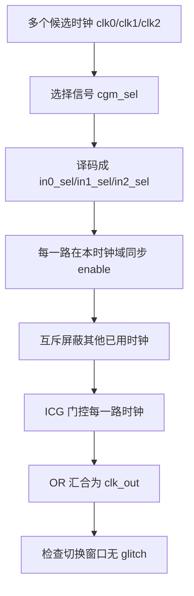

# 任务26：CDC 设计实例.ev4

## 本章知识全景图

本课真正解决的问题是：CPU 或 SoC 里需要在多个时钟源之间动态切换时，不能把时钟当普通数据用 mux 直接选，否则切换瞬间会产生窄脉冲，后级寄存器可能把这个窄脉冲当成真实时钟边沿。课程从 ICG 门控单元讲起，先解释 enable 与 clock 相位不对齐为什么会造成 glitch，再把这个思想扩展到三路时钟的 glitch-free clock switch，并用 RTL、testbench、Makefile/VCS/Verdi 形成可复现验证链。

| 层级 | 本课对象 | 一句话结论 | 工程输出 |
|---|---|---|---|
| 时钟门控 | ICG / clock gating cell | enable 不能直接闯进 clock 组合逻辑，必须在安全相位被锁存 | 可识别的 ICG 行为模型或库单元 |
| 错误结构 | simple clock mux | `select ? clk_b : clk_a` 会在 select 切换窗口制造毛刺 | 反例波形和禁止写法 |
| 应用场景 | SoC / CPU 动态时钟切换 | 多个候选时钟需要动态切换，并且输出时钟不能出现 glitch | 多路时钟选择、关闭旧路、打开新路 |
| RTL 机制 | 选择译码、同步链、互斥 enable、ICG 实例 | 每一路 clock 只在自己安全的相位打开，且任意时刻只允许一路有效 | `glitch_free` 顶层 RTL |
| 验证闭环 | testbench、Makefile、VCS、Verdi | 设计是否正确要看切换窗口，不只看最终选中了哪一路 | 可重跑仿真、波形和 debug 入口 |

最短学习路径：

```text
ICG 为什么要锁存 enable
  -> 普通 clock mux 为什么会产生 glitch
  -> SoC/CPU 为什么需要动态无毛刺切换
  -> glitch_free RTL 如何把选择信号变成互斥 enable
  -> testbench / Makefile / Verdi 如何证明切换窗口没有窄脉冲
```



## 全视频地图

| 时间段 | 教学块 | 必须学会的动作 |
|---|---|---|
| 00:00-02:30 | 主题引入和 mux sync | 先看到“时钟选择”不是普通数据选择，选择信号本身也有跨域问题 |
| 02:30-12:30 | ICG 原理 | 理解 latch 为什么要在 clock 安全相位锁住 enable |
| 14:00-16:40 | simple mux 反例 | 能从波形里指出 select 切换导致的 out_clk 窄脉冲 |
| 17:00-20:10 | SoC/CPU 应用场景 | 区分软件配置外设时钟和 CPU 动态时钟切换的要求 |
| 20:40-24:10 | testbench | 能看懂测试序列、时钟周期、FSDB dump 和待测模块例化 |
| 24:10-30:30 | RTL 代码 | 找到端口、扫描模式、选择译码、同步链和 ICG 例化 |
| 30:40-40:10 | Verdi/结构推导 | 用结构和波形解释为什么互斥 enable 可以消除毛刺 |
| 40:20-46:40 | Makefile/VCS/代码收束 | 把编译、仿真、debug 入口变成可复现流程 |

## 1. ICG 解决的是 enable 与 clock 相位不对齐

时钟切换的第一个危险是选择控制本身可能来自另一个时钟域。多路时钟选择不是把 `sel` 接到 mux 就结束；`sel` 如果没有在目标关系中同步，输出时钟会在选择变化处承受两个风险：选择路径的组合毛刺，以及不同 clock 边沿关系造成的假边沿。


这张图负责说明本课的入口问题：选择信号需要经过同步或受控流程后才能影响时钟路径。它不是在讲普通数据 CDC，而是在提醒读者：clock switch 里的控制信号一旦直接改变时钟汇合结构，错误会表现为时钟毛刺，而不是普通数据值短暂错误。

Clock gating 的目标是低功耗：模块不用工作时关掉它的时钟。但时钟不是普通数据，直接用 AND/OR 把 enable 和 clock 做组合逻辑，会把 enable 的任意变化带进时钟路径。


这张图的教学职责是给出 ICG 的问题定义：clock gating 功能上像 AND/OR 门，但 enable 的变化不一定与 clock 边沿对齐。一旦 enable 在 clock 高电平或低电平中间变化，输出时钟可能出现小于正常占空比的窄脉冲，或者某个正常周期被截断。

ICG 的关键不是“多放一个门”，而是让 enable 先被 latch 锁住，再去控制时钟门。这样 enable 只会在安全相位更新，clock 的有效边沿不会被中途切碎。


读这张图时看三件事：

- `CLK` 在翻转，`GATE/EN` 可能在任意时刻变化。
- 组合门输出 `CK2/GCLK` 会被 enable 的中途变化截成窄脉冲。
- 图中标出的 Tcycle 窗口说明：enable 不能在会改变时钟脉冲宽度的位置直接生效。

可以把 ICG 理解成时钟门前的“闸门管理员”。普通 AND/OR 像把闸门钥匙直接交给一个随时可能转动的人；ICG 像规定只能在安全时刻换钥匙，避免闸门在车已经通过一半时突然关上。

## 2. AND 型和 OR 型 ICG 的差别在有效相位和锁存极性

ICG 常见两类：高有效 enable 配 AND 型门控，低有效或反相语义可配 OR 型门控。两者都不是随便用组合门，而是用 latch 把 enable 对齐到 clock 安全相位。


左侧 AND 型 ICG 的读图顺序：

1. `EN` 进入负边沿触发或低电平透明的 latch。
2. latch 输出在安全相位稳定。
3. `GCLK` 只在 latch 输出为高时通过。
4. `EN` 为低时，`GCLK` 被保持为低，不再把 clock 送出去。

右侧 OR 型 ICG 的差别是极性相反：利用正边沿或高电平透明关系，把输入反相后进入 OR 结构。工程上不需要死背哪张图是 AND/OR，而要记住检查口径：enable 必须先被 latch 同步到安全相位，再影响 gated clock。

如果一个设计把 enable 直接连到 clock AND/OR 门，综合后即使功能仿真看起来能开关时钟，也不能直接认为可交付。真实门级延迟、占空比和时钟树都会放大这个风险。

## 3. 普通时钟 mux 的错误：select 变化会切出一个假边沿

普通数据 mux 的结构可以写成两路 AND 加一路 OR。把它套到时钟上，就是 `select` 控制 `clk_a` 或 `clk_b` 输出。但 `select` 不一定在两个时钟都处于安全电平时切换，输出就可能出现窄脉冲。


这张图给出反例证据：红框处 `out_clk` 出现了与正常时钟周期不同的短脉冲。这个脉冲不是“显示误差”，而是后级寄存器可能识别出的额外 clock edge。


读图步骤：

1. 先看底部 `select` 的变化位置。
2. 再对齐 `clk_a` 和 `clk_b` 在这个位置的电平。
3. 最后看 `out_clk` 是否被两路 AND/OR 的组合延迟拼出额外窄边沿。

错误结构可以抽象成：

```systemverilog
assign out_clk = select ? clk_b : clk_a;
```

这行代码的问题不在语法，而在语义：clock 不能被异步选择信号直接组合切换。只要切换窗口里两路时钟电平不同，或者 select 到两路门的延迟不一致，输出就可能短暂打开错误路径。

## 4. SoC 中的软件可配置时钟切换不等于 CPU 动态时钟切换

有些外设时钟可以由软件配置：先关模块时钟，改选择，再打开时钟。这样的流程适合 SPI、I2C 等外设，因为软件可以让外设停在安全状态。


这张图的关键是右侧流程：

```text
en = 0，SPI/I2C 的时钟关闭
sel 选择 clk1/clk2/clk3 之一
en = 1，把选中的稳定时钟送给 SPI/I2C
```

这个流程的安全性来自“先关掉，再切换，再打开”。它不适合 CPU 动态切换，因为 CPU 时钟往往不能随意长时间关闭，多个候选时钟还可能需要在运行过程中切换，而且切换期间不能出现 glitch。


CPU 场景的要求更强：

- 多个候选时钟：例如 `clk1(sel=0)`、`clk2(sel=1)`、`clk3(sel=2/3)`、`clk_scan(DFT)`。
- 每一路时钟进入自己的 ICG。
- 输出通过汇合逻辑形成 `clk_out`。
- 切换时既不能同时打开两路时钟，也不能在空窗中产生窄脉冲。

这就是本课 RTL 要做的事：把软件选择值变成每一路安全、互斥、同步后的 enable。

## 5. Testbench 要制造切换序列，并保存波形证据

没有 testbench，就无法证明切换窗口是否安全。这个设计的 testbench 不只是“给几个输入”，而是要让多路时钟以不同周期运行，并让 `cgm_sel` 在仿真中依次切换。


画面里能看到几类关键信息：

| 代码对象 | 作用 |
|---|---|
| `clk_in0`、`clk_in1`、`clk_in2`、`clk_scan` | 多个候选时钟 |
| `cgm_sel[1:0]` | 选择哪一路时钟输出 |
| `scan_dc_mode`、`icg_scan_mode` | DFT/test mode 相关控制 |
| `rst_clk_n` | 复位 |
| `repeat(...) @(posedge clk_in*)` | 等待若干时钟边沿后切换选择 |
| `$fsdbDumpfile`、`$fsdbDumpvars` | 生成 Verdi 可打开的波形证据 |

这类 testbench 的验收点不是“仿真结束了”，而是：切换动作覆盖到了不同选择值，波形中能看到切换前、切换中、切换后的 `clk_out`。

## 6. ICG 行为模型：TE 处理 DFT，E 控制功能门控

课程里的 `cell_clock_gating` 行为模型展示了 ICG 的基本端口：`TE`、`E`、`CP`、`Q`。


端口含义：

| 端口 | 含义 | 工程注意点 |
|---|---|---|
| `TE` | test enable，DFT/test mode 用 | 测试模式下要能强制打开时钟 |
| `E` | 功能 enable | 正常工作时由选择逻辑和同步链控制 |
| `CP` | 输入 clock | 不能被普通组合逻辑乱切 |
| `Q` | gated clock 输出 | 送往后级或汇合逻辑 |

图中还能看到 `E_or = E | TE` 和 latch 逻辑。它说明测试模式不能绕开时钟门控规则，而是作为 enable 的一个来源进入 ICG 模型：功能模式看 `E`，测试模式由 `TE` 保证 scan/DFT 可控性。

## 7. `glitch_free` 顶层端口把三路功能时钟和扫描时钟放进同一问题

`glitch_free` 顶层不是一个两路 mux，而是包含多路功能时钟、扫描时钟、选择信号、复位和 DFT 控制的完整时钟切换模块。


关键端口：

```systemverilog
output        clk_out;
input  [1:0] cgm_sel;
input        clk_in0;
input        clk_in1;
input        clk_in2;
input        rst_clk_n;
input        icg_scan_mode;
input        scan_dc_mode;
input        clk_scan;
```

其中 `cgm_sel` 决定选择哪一路功能时钟；`scan_dc_mode` 可以把内部时钟切到 `clk_scan`，用于 DFT 或 scan 场景；`icg_scan_mode` 进入 ICG 的 test enable。这个组合说明时钟切换设计必须同时照顾功能模式和测试模式，不能只看普通功能波形。

## 8. 每一路 enable 先同步，再进入 ICG

时钟切换的核心是把选择值转成每一路的 enable，并让 enable 在对应时钟域中安全变化。视频中每一路都有类似 `sync1/sync2/sync3` 的寄存器链。


画面中的关键逻辑是：

```systemverilog
assign ind_in0 = in0_en_sync2;

cell_clock_gating u_clk_gate_out0 (
    .TE(icg_scan_mode),
    .E (ind_in0),
    .CP(clk_in0),
    .Q (clk_out0)
);
```

这说明 `clk_in0` 这一路不是由 `cgm_sel` 直接打开，而是经过本路同步后的 enable 控制 ICG。同步链的作用不是解决所有 CDC 问题，而是让“开这一路时钟”这个控制动作在本路时钟安全相位上生效。

## 9. 互斥 enable：选中一路时必须确认其他路已经不用

glitch-free clock switch 的关键是 break-before-make：先断旧路，再接新路。代码里通过 `*_used` 和 `*_en` 组合出互斥关系。


可以按下面口径读：

```systemverilog
assign in0_sel = (cgm_sel[1:0] == 2'b00);
assign in1_sel = (cgm_sel[1:0] == 2'b01);
assign in2_sel = (cgm_sel[1:0] == 2'b10) || (cgm_sel[1:0] == 2'b11);

assign in0_used = in0_sel | in0_en_sync1 | in0_en_sync2 | in0_en_sync3;
assign in1_used = in1_sel | in1_en_sync1 | in1_en_sync2 | in1_en_sync3;
assign in2_used = in2_sel | in2_en_sync1 | in2_en_sync2 | in2_en_sync3;

assign in0_en = ~in1_used & ~in2_used;
assign in1_en = ~in0_used & ~in2_used;
assign in2_en = ~in0_used & ~in1_used;
```

这段逻辑的深层含义是：某一路不仅在“被选择”时算正在使用，它在同步链还没完全退干净时也算正在使用。只有其他路都不处于选择或同步残留状态，新路才允许打开。

这样做可以避免两个危险：

- 旧时钟还没完全关掉，新时钟已经打开，两路 clock 在 OR 汇合处叠加。
- 新旧 enable 在不同 clock domain 的同步延迟不同，导致短时间内出现非法组合。

## 10. 正确验收点在切换窗口，不在稳态输出

glitch-free 设计不能只看 `clk_out` 最后跟随了哪一路。稳态正确只能说明选择最终生效；真正危险发生在切换窗口。


这张图把 glitch 标在两路时钟交替附近。窄脉冲的危险在于它可能小于正常 high/low width，却仍然被后级寄存器当作一个边沿。设计验证时要把波形放大到 `cgm_sel` 改变前后，检查：

- 旧路 gated clock 是否先消失。
- 新路 gated clock 是否后出现。
- 两路 gated clock 是否有重叠。
- `clk_out` 是否有小于正常周期宽度的脉冲。
- 是否多出一个 posedge 或 negedge。


视频后段手绘了三路选择、门控和汇合结构。它的教学价值是把代码里的 `in0_sel/in1_sel/in2_sel`、各路 ICG、最终 `clk_out` 汇合关系画出来。读这张图时不要只看 OR 门，要追问每一路进入 OR 前是否已经被自己的 ICG 和互斥 enable 保护。

## 11. Makefile/VCS 把设计验证固定成可复现流程

工程交付不能只说“我在界面里跑过”。Makefile 把 compile、simulation、coverage、debug 固定成命令，别人才能重跑。


画面里的关键信息：

| Makefile 片段 | 作用 |
|---|---|
| `VCS = vcs +v2k ... -full64 -fsdb -debug_all -sverilog` | 编译 RTL/TB，并保留 debug 能力 |
| `$(VCS) -f file_list.f` | 用文件列表统一输入 RTL 和 testbench |
| `SIM = ./$(OUTPUT) ...` | 运行仿真 |
| `dve -vpd $(OUTPUT).vpd` | 打开 debug/波形 |
| `clean` | 清理中间产物，保证可从干净目录重跑 |

对这类实验，推荐验收命令链是：

```text
make clean
make com
make sim
make debug
```

如果 `make sim` 通过但没有波形，先查 dump 文件是否生成；如果波形有但内部信号缺失，查 VCS debug 选项和 dump 层次。

## 12. 完整 RTL 检查表：端口、译码、同步、门控、汇合

正式审查 `glitch_free` 这类模块时，不应从“代码行数”入手，而应按时钟切换链路检查。


检查表：

| 检查点 | 合格口径 |
|---|---|
| 端口 | 所有候选时钟、选择信号、复位、scan/test 控制都明确 |
| 选择译码 | `cgm_sel` 到 `in*_sel` 的映射无重叠，默认值有定义 |
| 同步链 | 每一路 enable 在对应时钟域内同步 |
| 互斥关系 | 新路 enable 必须等待其他路退出选择和同步残留 |
| ICG 例化 | 每一路 clock 通过 ICG，不直接组合切换 |
| 汇合逻辑 | 汇合前每一路都是安全 gated clock |
| test mode | scan/test mode 不破坏功能模式的安全假设 |
| 波形验证 | 切换窗口无重叠 enable、无窄脉冲、无额外边沿 |

## 13. 工程误用点

### 13.1 把 clock 当 data mux

这是最常见错误。数据 mux 的短暂毛刺可能被寄存器采样边界过滤；clock mux 的短暂毛刺本身就是采样边界。

### 13.2 只证明最终选路正确

`clk_out` 最终跟随 `clk1` 或 `clk2`，不代表切换过程安全。要证明无 glitch，必须看切换窗口。

### 13.3 忽略同步链残留状态

选择信号切到新路，不等于旧路立刻“没用了”。旧路 enable 经过同步链退出需要时间，因此 `*_used` 要把同步链中的残留位也算进去。

### 13.4 忽略 DFT/test mode

scan 模式下时钟可控性是硬性要求。ICG 的 `TE`、`icg_scan_mode`、`scan_dc_mode` 都要进入设计检查，不能只看普通功能模式。

## 14. 自测题与答案

1. 为什么不能直接写 `assign out_clk = sel ? clk1 : clk0;`？

   答：因为 `sel` 变化不一定与两路 clock 的安全相位对齐，组合门延迟会让输出在切换窗口出现窄脉冲或额外边沿。对时钟来说，这个窄脉冲可能被后级寄存器当成真实触发边沿。

2. ICG 相比普通 AND/OR 门控多解决了什么问题？

   答：ICG 用 latch 在安全相位锁存 enable，再控制时钟门，避免 enable 在 clock 高/低电平中间变化时直接截断或拼接时钟脉冲。

3. `TE` 在 `cell_clock_gating` 中是什么作用？

   答：`TE` 是 test enable，用于 DFT/scan 模式下强制或辅助打开时钟通路，保证测试可控性。它通常与功能 enable 合并后进入 ICG 控制逻辑。

4. 为什么 `in0_used` 不只等于 `in0_sel`，还要包含 `in0_en_sync1/2/3`？

   答：因为选择信号撤销后，本路 enable 在同步链中还可能残留几个周期。只要同步链还没完全退出，这一路就仍可能影响 gated clock，不能允许其他路立即打开。

5. 验证 glitch-free clock switch 时，波形里最重要的观察窗口是哪一段？

   答：`cgm_sel` 改变前后的切换窗口。要检查旧路 gated clock 是否先关，新路是否后开，两路是否重叠，以及 `clk_out` 是否出现窄脉冲或额外边沿。

6. `scan_dc_mode` 和 `icg_scan_mode` 为什么不能忽略？

   答：它们决定测试模式下时钟如何被选择和门控。时钟切换模块如果只在功能模式安全、但 scan/test 模式不可控或破坏门控假设，就不能作为工程可交付 RTL。

7. Makefile 在本课里的价值是什么？

   答：把 VCS 编译、仿真、覆盖和 debug 固定成可复现入口。别人可以从干净目录执行同一组命令，重现波形和验证结果，而不是依赖讲课时手动操作。

8. 如何判断一张时钟切换图是“可交付证据”而不是“看起来像对”？

   答：它必须能定位切换前、切换中、切换后的关键状态，并能说明没有重叠 enable、没有窄脉冲、没有额外边沿；如果只显示最终输出跟随某一路时钟，不足以证明 glitch-free。

## 15. 与前后课程的连接

任务25 讲 CDC 与亚稳态，核心是跨时钟域信号不能随意采样；任务27 讲 Verdi 调试与 Makefile，核心是把时钟切换问题放进可复现仿真和波形验证流程。任务26 正好连接这两端：它把“选择信号跨域/同步”的风险落到一个真实 clock switch 设计里，再把结构、代码和波形串成工程证据。

学完本课后，读者应该能做到三件事：

- 看到 clock mux 代码时立刻警惕 glitch。
- 读懂 ICG、同步链、互斥 enable 如何组成 glitch-free clock switch。
- 用 testbench、Makefile、VCS/Verdi 证明切换窗口没有错误时钟边沿。

