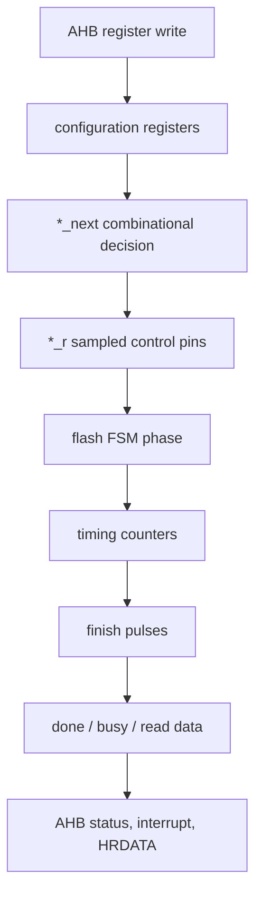

# 任务61：AHB eFlash 控制器设计15

## 本章知识全景图

**章节标题：任务61：AHB eFlash 控制器设计15。** 这一讲继续在 Verdi 中读 `flash_ctrl.v`，重点从“工程能打开”推进到“状态机、寄存器、计数器和波形能互相解释”。真正要掌握的不是某一行赋值，而是 eFlash 控制器的验证方法：AHB 写入配置寄存器后，`flash_ctrl` 如何把 `*_next` 计算结果寄存到 `*_r`，再通过 timing counter 产生 finish/done，最后把 read/program/page erase 的结果反馈到 AHB 侧。

| 层级 | 核心对象 | 本章要形成的判断 | 连接到工程能力 |
|---|---|---|---|
| 寄存器结构 | `flash0_*_r <= flash0_*_r_next`、`flash1_*_r <= ...` | `*_next` 是组合决策，`*_r` 是时钟边沿后的真实输出 | 两段式/三段式 FSM 阅读 |
| AHB 配置 | `ahb_wr_en`、`req_sel`、`haddr_r[7:0]`、`int_en_r`、`pe_num_r`、`pe_en_r` | AHB 写寄存器决定后续操作类型、目标页和中断使能 | 软件可配置硬件 |
| timing 判断 | `rcv_finish`、`tnvs_finish`、`pe_finish`、`prog_proc_finish`、`rd_finish_pre` | finish 信号是“计数达到配置值”的判据，不是随便拉高 | 时序控制器 |
| 完成反馈 | `flash_prog_done`、`flash_pe_done`、`flash_busy`、`flash_rdata` | done/ready/read data 要能回到 AHB interface | 总线可观测结果 |
| 波形调试 | 源码行、波形光标、状态编号、counter、done | RTL 解释必须能落到波形证据 | 数字前端 debug |
### 概念地图



最短学习路径：

```text
先看 flash_ctrl 的寄存器更新范式
  -> 再看 AHB 写寄存器如何改变 pe/program/read 配置
  -> 再看 timing counter 如何产生 finish
  -> 最后看 done、busy、read data 如何回到 slave interface
```

## 1. `*_next` 和 `*_r` 的区别，是读控制器 RTL 的第一把钥匙

`flash_ctrl.v` 里大量出现 `flash0_xe_r <= flash0_xe_r_next`、`flash0_nvstr_r <= flash0_nvstr_r_next`、`flash1_prog_r <= flash1_prog_r_next` 这类赋值。它们的意思不是重复命名，而是把组合逻辑和时序寄存器拆开：`*_next` 在当前状态和输入条件下算出下一拍应该是什么，`*_r` 在时钟边沿真正更新，成为驱动 eFlash 模型的稳定输出。


视觉核验：14:45-15:25，源码窗停在 `flash_ctrl.v` 的寄存器更新段，波形窗同时给出 `flash_busy`、`ahb_wr_en`、`req_sel`、`haddr_r[7:0]`、`int_en_r`、`pe_num_r`、`pe_en_r` 等触发条件。

- 教学职责：把“源码里的寄存器更新语句”和“波形里的真实硬件状态”放在同一张图里，训练读者不要只背 `*_next` / `*_r` 命名。
- 看图要点：左侧要盯住 `flash0_xe_r <= flash0_xe_r_next`、`flash0_prog_r <= flash0_prog_r_next`、`flash0_nvstr_r <= flash0_nvstr_r_next` 这类落拍语句；右侧要看 AHB 写使能、地址选择和 busy 是否解释了这些寄存器为什么变化。
- 漏看后果：如果只看源码不看波形，容易把 `*_next` 当成已经输出到 eFlash 的控制脚；如果只看波形不看落拍语句，遇到“晚一拍变化”会误判为 RTL bug。

一个准确的机制比喻是：`*_next` 像“下一拍的控制排程单”，`*_r` 像“已经下发到 eFlash 引脚的执行命令”。排程单可以在组合逻辑里提前改，但外设真正看到的是时钟沿后被寄存下来的命令。这个比喻只服务一个判断：调试时必须把“决策时间”和“生效时间”分开。

这类代码要按“决策和落拍”来读：

```text
组合逻辑：
  当前状态 + 命令 + timing finish + 地址/选择
  -> 计算 flash0_xe_r_next、flash0_prog_r_next、flash_next_st

时序逻辑：
  posedge flash_clk
  -> flash0_xe_r <= flash0_xe_r_next
  -> flash_current_st <= flash_next_st
```

如果波形中 `*_next` 已经变化，但 `*_r` 还没变，不一定是 bug；它可能只是在等待下一个时钟边沿。真正异常的是：`*_next` 条件已经满足却不变化，或 `*_r` 在时钟后没有跟随 `*_next`。

## 2. AHB 写寄存器是 eFlash 操作的起点

`flash_ctrl` 不会自己凭空擦写存储体。它的操作由 AHB interface 写入的寄存器触发：中断使能、page erase 目标、main/information 选择、program 地址、program 数据、read 地址、timing 配置等，都要先通过 `flash_ahb_slave_if` 进入寄存器，再送给 `flash_ctrl`。

波形里 `ahb_wr_en` 拉高，`req_sel` 有效，`haddr_r[7:0]` 命中不同地址，后续 `int_en_r`、`pe_num_r`、`pe_en_r` 等寄存器发生变化。这说明软件侧的一次 AHB 写，已经被硬件解释成一次配置动作。

| 信号 | 判断方式 | 工程意义 |
|---|---|---|
| `ahb_wr_en` | 当前是否为有效 AHB 写 | 没有它，后面的寄存器不应更新 |
| `req_sel` / `reg_sel` | 当前访问是否命中寄存器空间 | 防止 memory read/write 误写控制寄存器 |
| `haddr_r[7:0]` | 低地址位选择具体寄存器 | 决定写的是 timing、interrupt、PE number 还是 command |
| `int_en_r` | 哪类 done 能产生中断 | 影响 testbench 是否能 wait 到 `flash_ctrl_int` |
| `pe_num_r` | page erase 的目标页和片选 | 决定擦哪一页、擦 flash0 还是 flash1 |
| `pe_en_r` | 启动 page erase | 它是命令触发点，不是普通状态位 |

调试时不要只看 `pe_en_r=1`，还要看它之前的配置是否齐全：page number 是否正确、main/information 选择是否正确、当前是否 busy、是否已经清掉上一次 done/interrupt。
把这一段写进验证计划时，可以按“工单字段”拆开检查：AHB 地址决定写哪张单，`HWDATA` 决定单上内容，`ahb_wr_en && req_sel` 决定单是否被柜台收下，`busy` 决定当前柜台是否能接新单。这个比喻的边界很清楚：硬件里没有人工判断，所有“收单/拒单”都必须落成地址命中、写使能、busy 屏蔽和寄存器更新条件。

可写的最小断言口径：

```systemverilog
assert property (@(posedge hclk) flash_busy && ahb_wr_en |-> !pe_en_update);
assert property (@(posedge hclk) ahb_wr_en && req_sel && pe_cfg_addr |=> pe_num_r == $past(hwdata_pe_num));
assert property (@(posedge flash_clk) pe_en_r |-> ##[1:$] flash_pe_done or pe_timeout);
```

这些断言不是为了替代完整 testbench，而是防止三类低级错误：busy 时仍收新命令、寄存器写入地址译码错、启动后没有完成或超时出口。

## 3. finish 信号本质上是 counter 和 timing 的比较结果

eFlash 操作的时间不是一个固定状态名能表达完的。比如 program 需要 setup、process、hold、recover 等阶段；page erase 需要更长计数；read 也需要 access time。`flash_ctrl.v` 中的 finish 信号就是这些阶段结束的判据。


视觉核验：29:40-30:20，源码窗显示 `flash_prog_done = rcv_finish & prog_en`、`flash_pe_done = rcv_finish & pe_en`，以及 `rcv_finish`、`tnvs_finish`、`pe_finish`、`rd_finish_pre`、`prog_set_finish`、`prog_proc_finish`、`prog_addr_hold_finish` 等 finish 信号由计数器和 timing 寄存器比较得到；波形窗显示 `prog_proc_cnt` 与 `prog_proc_timing`、`rcv_finish` 等信号。

- 教学职责：证明 finish/done 不是“状态机走到某个名字”就自动出现，而是 timing counter 达到边界后再被操作类型门控。
- 看图要点：先在源码里找 `*_cnt == *_timing` 的比较，再到波形里确认 counter 从清零点开始累加，最后确认 `prog_en` 或 `pe_en` 决定 done 类型。
- 漏看后果：如果漏掉 counter/timing 的比较，会把 done 写成一个固定延迟或状态名输出，后续仿真可能在快慢 timing、第二次操作或恢复阶段暴露隐蔽错误。

这一段可以抽成一个通用模板：

```systemverilog
assign some_finish = (some_cnt == some_timing);
```

但真正难点不在这一行，而在三个边界：

1. `some_timing` 是默认值还是 AHB 写入后的配置值。
2. `some_cnt` 在哪个状态开始清零、递增、停止。
3. `some_finish` 触发后状态机进入下一阶段还是直接产生 done。

如果 `pe_timing` 配错，page erase 会提前结束或永远不结束；如果 counter 清零条件错，第二次操作会继承上一次计数；如果 done 只看 enable 不看 recover finish，AHB 侧可能过早认为 eFlash 已经可用。

可以把每个 finish 看成工艺流程里的“到时铃”，而不是“工人说我开始干活”。`prog_en` / `pe_en` 说明工艺类型，counter 说明这一步已经烧够时间，`rcv_finish` 说明收尾恢复完成。只有三者语义闭合，软件读到的 done 才可信。

## 4. `done` 不是状态机走到某处就够了，还要和操作类型相与

源码里 `flash_prog_done = rcv_finish & prog_en`，`flash_pe_done = rcv_finish & pe_en`。这说明 recover 完成只是“某次 eFlash 操作收尾完成”的通用条件；到底上报 program done 还是 page erase done，要看当前启动的是 program 还是 PE。

这种写法能避免两类错误：

| 错误 | 后果 |
|---|---|
| 只用 `rcv_finish` 作为所有 done | 软件不知道完成的是 program 还是 erase |
| 只用 `prog_en/pe_en` 作为 done | 命令刚启动就被误判为完成 |

正确关系是：

```text
操作类型 enable 决定“这是什么操作”
timing finish 决定“这次操作是否真的走完”
两者同时满足，才产生对应 done
```

这也解释了为什么 testbench 里经常先配置中断使能，再启动命令，再 wait interrupt：中断不是操作本身，而是完成状态被硬件上报给软件侧的方式。

工程上要把 finish 和 done 分成两层验证：

| 层 | 输入对象 | 输出对象 | 失败信号 |
|---|---|---|---|
| finish 层 | `*_cnt`、`*_timing`、当前 FSM phase | `*_finish` | counter 不清零、off-by-one、timing 写入未生效 |
| done 层 | `*_finish`、`prog_en/pe_en/read_en`、busy/interrupt 逻辑 | `flash_prog_done`、`flash_pe_done`、AHB status/interrupt | done 类型误报、busy 过早释放、中断等不到或清不掉 |

读代码时先证明 finish 层，再证明 done 层；不要用一个最终中断反推中间所有时序都正确。

## 5. read path 的关键是 `rd_finish_pre` 和数据锁存时刻

read 操作和 program/erase 不同：它的成功不仅要看 done，还要看返回数据是否在正确时刻被采样。`flash_ctrl.v` 中在 `rd_finish_pre` 条件下把 `rdata0` 或 `rdata1` 锁存到 `flash_rdata`，片选由 `flash0_cs_r`、`flash1_cs_r` 决定。


视觉核验：44:40-45:20，源码窗显示 `always @(posedge flash_clk or negedge flash_rest_n)` 中，当 `rd_finish_pre` 有效时，`flash_rdata <= ({32{flash0_cs_r}} & rdata0) | ({32{flash1_cs_r}} & rdata1)`；波形窗显示 `flash_busy`、`flash0_rd_cs`、`flash_rd_en`、`hsel`、`htrans`、`hwrite`、`flash_current_st`、`rd_finish_pre`、`addr_access_cnt`、`rdata0[31:0]` 等信号。

- 教学职责：把 read path 的三个关键点绑定起来：选哪片 flash、什么时候采样、怎样回到 AHB 读数据。
- 看图要点：源码里先看 `flash0_cs_r/flash1_cs_r` 如何选择 `rdata0/rdata1`，再看 `rd_finish_pre` 是唯一采样门，最后看波形中 AHB read 是否等到 `flash_rdata` 稳定。
- 漏看后果：如果只看到 `rdata0` 有值，就会忽略采样窗口；如果 `rd_finish_pre` 早一拍或片选错一拍，AHB 侧读到的可能是旧值、另一片 flash 的值或未知值。

这段代码的判断口径是：

```text
如果读 flash0：
  flash0_cs_r = 1，flash1_cs_r = 0
  -> flash_rdata 选择 rdata0

如果读 flash1：
  flash0_cs_r = 0，flash1_cs_r = 1
  -> flash_rdata 选择 rdata1

只有 rd_finish_pre 到达时：
  返回数据才被锁存为 AHB 侧可读数据
```

如果读数据错误，不要马上怀疑 memory model。先查：地址是否选中正确 chip；`rd_finish_pre` 是否早于模型数据稳定；`hready_out` 是否等到数据有效后才释放；`flash_rdata` 是否被下一次读或复位覆盖。

read path 的对象、输入输出和状态变化可以按下面的链路复现：

| 阶段 | 输入 | 状态变化 | 输出/成功信号 | 失败信号 |
|---|---|---|---|---|
| AHB read 请求 | `hsel/htrans/hwrite=0/haddr` | AHB interface 捕获地址并拉住等待 | `flash_rd_en`、目标地址/片选有效 | 读命中错误、未拉等待导致提前返回 |
| eFlash access | `flash_rd_en`、chip select、address | `addr_access_cnt` 计数到 access timing | `rd_finish_pre` 到达 | counter 不走、timing 错、片选错 |
| 数据锁存 | `rd_finish_pre`、`rdata0/rdata1`、`flash*_cs_r` | `flash_rdata` 在时钟沿锁存 | AHB `HRDATA` 可读，`hready_out` 释放 | 返回旧值、跨片 mux 错、ready 早放 |

这个链路像“取件窗口”：AHB 提交取件单，eFlash 后台按地址找数据，`rd_finish_pre` 是窗口叫号，`flash_rdata` 是交到窗口的包裹。没有叫号就抢读，拿到的不是本次访问的结果。

## 6. 用波形证明 eFlash 操作，要按“命令、状态、计数、反馈”四步查

这一讲的 Verdi 调试可以压成一套固定检查法：

| 步骤 | 看什么 | 通过标准 |
|---|---|---|
| 命令 | `ahb_wr_en`、`haddr_r[7:0]`、`pe_en_r/prog_en/read_en` | AHB 写命中正确寄存器，命令只在合法条件下启动 |
| 状态 | `flash_current_st`、`flash_next_st` | 状态按 read/program/erase 的路径推进，没有卡在 idle 或非法跳转 |
| 计数 | `*_cnt` 与 `*_timing` | counter 从 0 开始，达到配置值后产生 finish |
| 反馈 | `flash_busy`、`flash_prog_done`、`flash_pe_done`、`flash_rdata`、interrupt | 忙信号覆盖操作过程，done/read data 在正确收尾点出现 |

最容易误判的是 `flash_busy`。它为 1 只能说明控制器正在占用 eFlash，不等于这次操作已经正确完成；必须继续看 done、finish、counter 和读数据。反过来，`busy` 过早清零也危险，说明 AHB 可能在 eFlash 真实时序结束前开始下一次访问。
看这类 Verdi 图时要按“证据链”而不是“截图好像对”来读：源码窗证明 RTL 写了什么规则，波形窗证明这条规则在某个时钟边沿真实发生，光标位置证明事件顺序，左侧 signal list 证明没有只挑好看的信号。缺任一环，结论都容易变成猜测。合格截图至少能回答：哪个 AHB 写触发操作，哪个状态接管控制脚，哪个 counter 到达边界，哪个 done/readback 回到软件可见侧。

## 7. 最小闭环：page erase -> program -> read

把任务60和61合起来，一个最小验证闭环应包含三类操作：

```text
1. page erase：
   写 PE number / PE configure / interrupt enable
   -> 确认 `ahb_wr_en`、`req_sel/reg_sel`、`haddr_r[7:0]` 都命中配置寄存器
   -> 启动 PE
   -> 观察 `pe_en_r`、`flash_current_st`、`pe_finish/rcv_finish`
   -> 等待 `flash_pe_done` 或 interrupt
   -> 清除完成状态

2. program：
   写 program address / program data / interrupt enable
   -> 确认写入数据已进入 program buffer 或对应寄存器
   -> 启动 program
   -> 观察 setup/process/hold/recover counter
   -> 等待 `flash_prog_done` 或 interrupt
   -> 清除完成状态

3. read：
   发起 AHB read
   -> hready_out 拉低等待
   -> rd_finish_pre 到达后锁存 rdata
   -> hready_out 释放，HRDATA 可用
   -> 用读回值和 program data 比较
```

这个闭环比“只看某个状态机跳了几拍”更有价值，因为它同时覆盖擦、写、读和软件可见反馈。一个 eFlash controller 至少要能证明这条链路，才算具备基本功能验证。

## 自测题

1. `flash0_nvstr_r <= flash0_nvstr_r_next` 这类代码中，`_r` 和 `_next` 分别代表什么？
2. 为什么 `flash_prog_done` 不能只等于 `rcv_finish`？
3. AHB 写寄存器启动 page erase 前，至少要确认哪些配置信号？
4. `some_finish = (some_cnt == some_timing)` 这类写法可能在哪些边界出错？
5. read path 中为什么要用 `rd_finish_pre` 锁存 `rdata0/rdata1`？
6. 如果 `flash_rdata` 错误，按什么顺序排查？
7. 为什么 eFlash 验证不能只等最终 interrupt，而要同时看 command、state、counter 和 readback？

## 自测参考答案与判分点

1. `_next` 是组合逻辑计算出的下一拍值，`_r` 是时钟边沿后寄存下来的真实状态或输出。判断波形时要允许 `_next` 比 `_r` 早一拍变化。
2. `rcv_finish` 只说明 recover 阶段结束，不说明当前操作类型。`flash_prog_done` 必须同时满足 `rcv_finish` 和 `prog_en`，否则 page erase 或其他操作也可能误报 program done。
3. 至少确认 `ahb_wr_en/reg_sel` 有效、`haddr_r[7:0]` 命中目标寄存器、`pe_num_r` 正确、main/information 选择正确、当前不 busy、中断或完成状态已按需要配置。
4. counter 可能没有正确清零，timing 可能是默认值而不是软件写入值，比较条件可能 off-by-one，finish 可能没有被状态机正确消费。
5. eFlash read 需要等待 access time，`rd_finish_pre` 是数据即将可用的采样点。过早锁存会得到旧值或未知值，过晚可能错过 AHB ready 的配合时刻。
6. 先查地址和 chip select，再查 `rd_finish_pre` 时序，再查 `rdata0/rdata1` 是否来自模型稳定输出，再查 `flash_rdata` mux，最后查 AHB `hready_out/hrdata` 返回路径。
7. interrupt 只说明某个软件可见事件发生，不能单独证明命令配置正确、状态路径正确、counter 边界正确、读数据正确。合格波形要能从 AHB 写命令一路解释到 finish/done/readback；任何一层断开，都可能出现“中断到了但功能错”的假通过。

