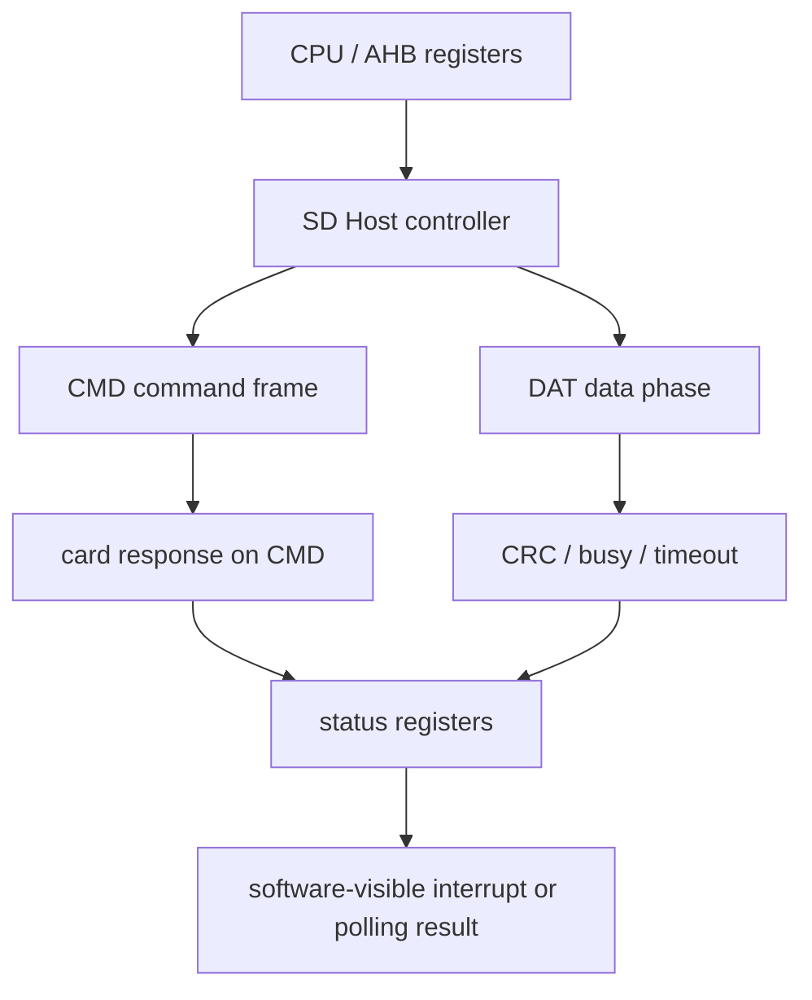

# 任务62：AHB SD Host 控制器设计1

## 本章知识全景图

**章节标题：任务62：AHB SD Host 控制器设计1。** 这一讲从 eFlash 控制器切换到 SD Host 控制器。eFlash 是片内非易失存储 IP，控制器主要把 AHB 访问翻译成 eFlash 时序；SD 卡是片外设备，SD Host 要把 AHB 寄存器访问翻译成 SD 协议上的 command、response、data、CRC、clock 和 DAT/CMD 线行为。学完这一讲，要先建立 SD Host 的系统位置：CPU 通过 AHB 配置 host，host 再按 SD 协议和卡通信。

| 层级 | 核心概念 | 本章要形成的判断 | 连接到 RTL 设计 |
|---|---|---|---|
| 系统角色 | AHB SD Host、SD card、CMD/DAT/CLK | Host 是协议控制器，不是普通存储数组 | AHB slave + SD protocol engine |
| 卡特性 | 容量、工作电压、默认/高速频率、读写属性 | 协议参数决定寄存器字段和 clock divider | capability/status 寄存器 |
| 总线概念 | command、response、data bit stream | SD 通信由 token 和 bit stream 组成 | command FSM、response parser、data FSM |
| 帧边界 | start bit、stop/end bit、CRC | SD 线上的一次事务必须能定位起止和校验 | bit counter、CRC、timeout |
| 操作类型 | no response、no data、read/write data | 不同命令需要不同等待路径 | 控制状态机分支 |
### 概念地图



最短学习路径：

```text
先把 SD Host 看成 AHB 到 SD 协议的翻译器
  -> 再记住卡的容量、电压、频率和数据线宽
  -> 再读 command/response/data 三种 token
  -> 最后把 start/end/CRC/timeout 映射到 RTL 状态机
```

## 1. SD Host 的任务是把软件访问翻译成片外协议

SD 卡不是 AHB 设备，它不会直接理解 `HADDR/HWRITE/HWDATA`。SoC 内部需要一个 SD Host controller：一侧作为 AHB slave，给 CPU 暴露寄存器；另一侧驱动 SD 卡的 `CLK`、`CMD`、`DAT[3:0]` 等引脚。CPU 写寄存器说明“发什么命令、读多少数据、用几位数据线、时钟多快”，SD Host 再把这些配置转成 SD 总线上的比特流。


视觉核验：00:50-01:15，课程从 SD 协议版本入口进入，画面标出 SD 1.1、SD 2.0、SD 3.0，并用手写标注把本控制器学习连接到 AHB/AMBA 侧。

- 教学职责：把 SD Host 放回 SoC 外设位置：它不是 SD 卡本身，而是 AHB 软件世界和 SD 片外协议世界之间的控制器。
- 看图要点：看版本号不是为了背规格历史，而是为了提醒 Host 能力边界；看 AHB/AMBA 标注，是为了把后续 command/response/data 都映射回寄存器可配置行为。
- 漏看后果：如果把 SD Host 当普通存储器接口，后面会把 CMD/DAT 上的 token、CRC、timeout 错看成“额外细节”，从而漏掉控制器最核心的协议引擎。

一个机制型比喻是：AHB 寄存器像软件交给 Host 的“工单”，SD CMD/DAT/CLK 像发往卡端的“线缆报文”。Host 的工作不是搬运一块数据，而是按工单组帧、等待回执、检查校验、处理超时，并把结果写回软件能读懂的状态寄存器。

从硬件角度看，SD Host 至少要包含这些模块：

| 模块 | 解决的问题 |
|---|---|
| AHB slave interface | CPU 怎样读写 host 寄存器 |
| command controller | 怎样在 CMD 线上发送命令 token |
| response receiver | 怎样接收卡返回的 response 并检查格式/CRC |
| data controller | 怎样通过 DAT0 或 DAT[3:0] 传输数据块 |
| clock divider | 识别阶段低速，传输阶段提速 |
| timeout/interrupt | 卡不响应或传输结束时怎样通知软件 |

这和 eFlash controller 的思路相通：CPU 侧仍然是 AHB，底层设备侧变成另一套协议。区别在于 SD 卡是片外串行/并行混合协议，状态更多，错误更多，必须显式处理 response、CRC 和 timeout。

## 2. SD 卡特性直接决定 Host 的配置寄存器

课程先讲 SD Memory Card 的系统特性：标准容量卡到 2GB，高容量卡大于 2GB，本协议版本范围里可到 32GB；高压卡工作在 2.7V 到 3.6V；默认模式时钟可到 25MHz，使用 4 条数据线时接口速度可到 12.5MB/s；高速模式可到 50MHz，4 线接口速度可到 25MB/s。


视觉核验：14:45-15:20，PPT 显示 Standard Capacity、High Capacity、2.7-3.6V、Default mode 0-25MHz、High-Speed mode 0-50MHz，以及 4 parallel data lines 下的 12.5MB/s 和 25MB/s。

- 教学职责：说明 SD 卡能力参数会变成 Host 的寄存器字段、时钟分频和初始化判断，而不是停留在协议介绍。
- 看图要点：容量影响地址解释，电压影响初始化条件，默认/高速频率影响 clock divider，4 条数据线影响 data path 和 CRC 结构。
- 漏看后果：如果只记“有 25MHz/50MHz”，设计时可能上电就跑高速；如果只记“有 4-bit”，会漏掉 4 条 lane 各自的采样、拼接和 CRC。

这些不是背景知识，而是设计约束：

| 特性 | 对 Host RTL 的影响 |
|---|---|
| 标准容量 / 高容量 | 地址解释可能不同，软件和 host 要知道卡类型 |
| 2.7-3.6V | 板级和 IO 约束需要匹配，RTL 中通常体现为初始化/能力判断 |
| 默认时钟 0-25MHz | 上电识别阶段不能直接跑高速 |
| 高速时钟 0-50MHz | 进入传输模式并完成能力确认后才可提高 clock |
| 1-bit / 4-bit DAT | data path、bit counter、CRC 个数和吞吐都不同 |

一个常见误解是把 SD 卡当成“慢一点的 SRAM”。它不是随机并行访问的存储阵列，而是协议设备：每次读写都要先发命令，等响应，再按数据包格式传输，最后检查 CRC 和 busy。
更深一层看，SD Host 是“协议型外设控制器”，不是“存储宏封装”。SRAM controller 的主要压力是地址、片选、字节使能和读写时序；SD Host 的主要压力是事务顺序、双向线换向、响应等待、数据块边界和错误恢复。把它们混成一种心智模型，会在 RTL 里漏掉 command/response/data 三条相互交握的状态机。

## 3. SD 总线通信由 command、response、data 三类流组成

SD bus 上的通信以 bit stream 形式出现，所有关键对象都有边界：start bit 开始，stop/end bit 结束。command 和 response 都走 CMD 线；data 走 DAT 线，可以是 DAT0，也可以是 DAT[3:0]。


视觉核验：34:45-35:25，PPT 标出 command、response、data 三类 token/bit stream；图中展示 “no response” 操作和 “no data” 操作，command 从 host 到 card，response 从 card 到 host，data 经 DAT 线传输。

- 教学职责：建立 SD Host 三条主链路：CMD 发命令、CMD 收响应、DAT 传数据；后续 FSM、CRC 和 timeout 都围绕这三条链路展开。
- 看图要点：command 永远由 host 发起；response 是 card 对上一条 command 的回执；data phase 只在命令要求传数据时出现，且方向由读/写命令决定。
- 漏看后果：如果把 response 和 data 混成一个“返回值”，会在 RTL 里把 response parser、data FSM、data FIFO 和错误状态揉在一起，导致 no-data 命令、读块命令、写块命令都不好区分。

三类流的职责如下：

| 流 | 方向 | 作用 | Host 需要做什么 |
|---|---|---|---|
| Command | host -> card | 启动一次操作，例如识别、读寄存器、读块、写块 | 组帧、发送、计算/附加 CRC、控制 CMD 输出 |
| Response | card -> host | 回答上一条命令是否接受、返回状态或寄存器片段 | 等待、采样、校验、解析、超时处理 |
| Data | host <-> card | 传输真正的数据块或状态数据 | 控制 DAT 方向、位宽、CRC、block length、busy |

“no response” 不等于命令无效，而是这类命令按协议不需要卡返回；“no data” 不等于没有结果，而是结果只在 response 中，不走 DAT 数据块。

## 4. start/end/CRC 是 RTL 必须显式处理的边界

SD 协议不是简单地把 32-bit 数据放到线口上。Host 发送 command 时要产生固定格式的 command token；接收 response 时要从 CMD 线上识别起始位、传输位、命令索引/状态字段、CRC 和结束位；传输 data 时还要处理数据块、CRC、busy 和 stop command。

因此 SD Host 的状态机至少要回答五个问题：

```text
1. 当前是在发送 command，还是等待 response？
2. 当前命令是否需要 response？
3. 当前命令是否带 data phase？
4. data phase 是读还是写，使用 1-bit 还是 4-bit？
5. CRC/timeout/busy 失败时怎样上报给软件？
```

这些问题决定 RTL 结构：command FSM 不能和 data FSM 完全混在一起，否则 read/write block、multi-block、no-data command 会难以区分；response parser 不能只等一个固定延迟，否则卡不响应时无法超时；data path 不能只按 32-bit AHB 数据理解，因为 SD 线上是按 bit 或 4-bit lane 传输。

可以把 start/end/CRC/timeout 看成 SD 报文的四道边界检查：

| 边界 | Host 的输入 | Host 的输出 | 失败信号 |
|---|---|---|---|
| start bit | CMD/DAT 线从空闲进入报文 | `frame_active` 或状态机离开 idle | 一直等不到 start，触发 timeout |
| body/payload | 命令索引、argument、response 字段或 data bit | shift register、response register、data FIFO | 位数不对、方向不对、FIFO under/overflow |
| CRC | 已采集的 body/payload bit | `crc_ok` / `crc_error` | response/data CRC error interrupt |
| end bit | 报文末尾采样值 | `cmd_done`、`response_valid`、`data_done` | end bit 非法，帧格式错误 |

这张表也是写 RTL 的分工线：command controller 负责“发起和组帧”，response parser 负责“等待和验收回执”，data controller 负责“搬运数据块”，timeout/interrupt 负责“把失败告诉软件”。
落到最小验证时，要给每条链路一个可观察出口：command 链路看 `cmd_done/cmd_timeout/response_index_error`，response 链路看 `resp_valid/resp_crc_error/card_status`，data 链路看 `data_done/data_crc_error/fifo_level`，软件链路看 `status/interrupt/clear`。没有这些出口，仿真只能看到线在跳，不能证明事务闭合。

## 5. 从 AHB 寄存器到 SD 线口的最小设计链路

最小 SD Host 访问链路可以这样理解：

```text
CPU/AHB 写命令寄存器：
  command index、argument、response type、data present、block length、read/write、start

SD Host command FSM：
  按 SD command token 格式在 CMD 线上发送 bit stream

SD Card：
  根据命令决定是否返回 response、是否进入 data phase

SD Host response/data FSM：
  采样 CMD/DAT，检查 start/end/CRC/timeout/busy

AHB/software 可见结果：
  status register、response register、data FIFO、interrupt
```

这个链路和 eFlash controller 的“寄存器 -> 状态机 -> IP 引脚 -> done/interrupt”很像，但 SD Host 多了片外协议解析。设计时不能只写一个 `start` 信号，还要定义 response 类型、数据方向、CRC 错误、timeout 错误和中断清除。

复现这条链路时，至少要把对象和状态变化写清楚：

| 阶段 | 软件/AHB 写入 | Host 内部状态 | SD 线口动作 | 软件可读结果 |
|---|---|---|---|---|
| 命令准备 | `cmd_idx`、`arg`、`resp_type`、`data_present` | command FSM 装载 token | CMD 仍保持空闲 | status 显示 busy 或 command_active |
| 命令发送 | `start=1` | bit counter 从 0 计到命令帧末尾 | CMD 输出 start/body/CRC/end | 仍不可读 response |
| 响应等待 | response type 非 none | CMD 方向切到输入，timeout counter 启动 | card 经 CMD 返回 response | timeout 或 response_valid |
| 数据阶段 | data_present=1 | data FSM 按读/写和位宽运行 | DAT0/DAT[3:0] 传 block、CRC、busy | data_done、data_crc_error、FIFO 状态 |
| 收尾上报 | clear/done 规则 | interrupt/status 置位 | 线口回到空闲或等待下一块 | CPU 读 response/data/status |

如果任何一列缺失，仿真就只能证明“某个信号动过”，不能证明 SD Host 真正完成了协议事务。

## 6. 最小闭环：发一条无数据命令并读 response

本讲学习后，最小实践不是立刻写完整 SD Host，而是先能设计或阅读一条无数据命令的闭环。建议用 `CMD8(SEND_IF_COND)` 做样例，因为它没有 DAT 数据阶段，却能同时覆盖 AHB 配置、CMD 发送、R7 响应、字段解析和错误上报。

`CMD8` 的输入输出链可以写成这样：

| 阶段 | 输入 | Host 状态变化 | 输出/通过标准 | 失败信号 |
|---|---|---|---|---|
| AHB 配置 | `cmd_idx=8`、`argument=voltage + check_pattern`、`resp_type=R7`、`start=1` | command FSM 装载 48-bit 命令帧 | `cmd_busy=1`，CMD 输出窗口打开 | command 寄存器没写入、start 被 busy 屏蔽 |
| CMD 发送 | command token、CRC7、end bit | bit counter 从 0 走到帧尾 | `cmd_oe` 在发送期为 1，帧尾释放 CMD | bit counter off-by-one、CRC7 窗口错 |
| 等 R7 | expected response type = R7 | response wait counter 启动 | 在 `NCR` 窗口内看到 response start | `cmd_timeout` |
| 解析 R7 | response shift register | 锁存 voltage accepted 和 echo pattern | `voltage_ok && pattern_ok && resp_crc_ok` | pattern 不匹配、CRC 错、end bit 错 |
| 软件可见 | status/response register | `cmd_done` 或 error 置位 | AHB 读到 response 和状态，中断可选 | done 不可清、错误位混在一起 |

这条链像一次“握手试灯”：Host 发出带电压和暗号的命令，卡必须把暗号回显。暗号一致，说明 CMD 通路、响应方向和基础接口条件可继续；暗号不一致，不能把后续读写失败归咎于数据路径。

```text
1. AHB 写 command index 和 argument。
2. AHB 写 response type，明确这条命令是 no response、短响应还是长响应。
3. AHB 写 control/start，启动 command FSM，同时置位 busy。
4. CMD 线输出 start bit、command body、CRC、end bit。
5. 如果该命令需要 response，Host 切换 CMD 方向并启动 timeout counter。
6. response 到达后，检查起始位、长度、CRC、结束位。
7. 把 response 字段写入 response register。
8. 置位 command_done；如果超时、CRC 错或 end bit 错，则置位 error interrupt。
9. 软件读 status/response，按写 1 清除或专用 clear 位清掉完成/错误状态。
```

通过标准：

| 检查项 | 通过标准 |
|---|---|
| command frame | bit 数、start/end、CRC 位置符合协议 |
| response wait | 需要 response 的命令能等待，不需要 response 的命令不误等 |
| timeout | 卡不返回时能退出并上报错误 |
| software visible | done/error/response register 能被 AHB 读到 |

## 自测题

1. 为什么 SD 卡不能像 SRAM 一样直接接到 AHB 总线上？
2. SD Host controller 至少需要哪两侧接口？
3. 默认模式和高速模式的频率差异对 RTL 有什么影响？
4. command、response、data 三者分别走哪条线，方向是什么？
5. “no response”和“no data”分别是什么意思？
6. 设计一条无数据命令闭环时，必须有哪些完成或错误反馈？
7. 为什么 command FSM、response parser 和 data FSM 不宜全部混成一个大状态机？

## 自测参考答案与判分点

1. SD 卡是片外协议设备，只理解 SD 总线上的 CMD/DAT/CLK 时序，不理解 AHB 地址、控制和数据阶段。必须由 SD Host 翻译。
2. 一侧是 AHB slave interface，给 CPU 读写寄存器；另一侧是 SD 协议线口，包括 CLK、CMD、DAT0 或 DAT[3:0]。
3. 识别阶段通常低速，进入传输模式并确认能力后才能提速；RTL 需要 clock divider、模式寄存器和状态机控制频率切换。
4. command 由 host 经 CMD 线发到 card；response 由 card 经 CMD 线回 host；data 通过 DAT 线在 host 和 card 之间双向传输。
5. no response 是该命令不需要卡返回 response；no data 是该操作没有 DAT 数据阶段，可能仍有 response。
6. 至少有 command_done、response_valid 或 response register、timeout_error、crc_error、interrupt/status，以及可清除机制。
7. 三者职责不同：command FSM 负责主动发起，response parser 负责被动等待和验收回执，data FSM 负责可能持续很多拍的数据块和 busy。强行混在一起会让 no-response、no-data、read data、write data、timeout、CRC error 的分支互相污染，验证覆盖也很难闭合。

