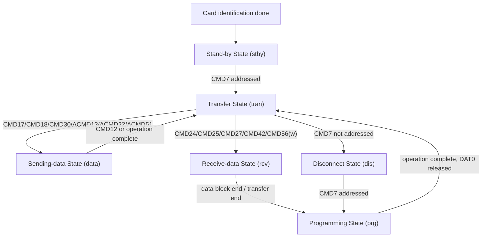

# 任务65：AHB sd host控制器设计4

## 本章知识全景图

这一讲把 SD 卡从“已经识别出来的一张卡”推进到“可以被 Host 读写的数据传输对象”：核心不是背命令号，而是把命令、状态、DAT 线动作和控制器 FSM 之间的对应关系建立起来。

核心概念：`data transfer mode`、`stby`、`tran`、`data`、`rcv`、`prg`、`dis`、`CMD7`、`CMD12`、`CMD17/CMD18`、`CMD24/CMD25`、`DAT0 busy`、`block read/write`、`CRC`、`block alignment`。

逻辑主线：
1. 卡识别阶段结束后，卡进入 `Stand-by State(stby)`，只有被 `CMD7` 选中的卡进入 `Transfer State(tran)`。
2. 读命令把卡推入 `Sending-data State(data)`，写命令把卡推入 `Receive-data State(rcv)`，真正写入介质还会经过 `Programming State(prg)`。
3. 多块传输不能靠“Host 想停就停”结束，必须用 `CMD12(STOP_TRANSMISSION)` 或协议定义的 `operation complete` 回到安全状态。
4. `AHB sd_host` 的 RTL 不能只实现一个串行 CMD 发送器，还要实现协议状态、忙等待、块边界、CRC 和异常停止。

### 概念地图



### 最短学习路径

1. 先记住 `stby -> tran -> data/rcv/prg -> tran` 这条主线。
2. 再把每个状态边上的命令号和 Host 控制器动作对应起来。
3. 最后用块读写规则校验 RTL：一次块传输以 512 Byte 为核心边界，以 CRC 和 stop/busy 作为闭环。

## 1. 数据传输模式的入口是选卡，不是读写命令本身

SD 卡进入数据传输模式后，`CMD7` 才是决定“哪张卡真正参与后续传输”的门。`CMD3` 生成 RCA 后，卡通常停在 `stby`；Host 用 `CMD7` 携带目标 RCA 选择它，目标卡进入 `tran`，非目标卡要么保持待机，要么在数据传输模式中被断开。


视觉核验：视频 03:00-08:00。教学职责：把“识别完成”和“可读写”拆开，说明 `CMD3` 只给卡一个 RCA，`CMD7` 才把目标卡接到当前传输会话。看图要点：沿箭头看 `CMD3 -> stby -> CMD7 -> tran`，不要直接从 identification mode 跳到读写命令。漏看后果：RTL 可能在未选卡时发 `CMD17/CMD24`，表现为无响应或状态错误，但根因是前置状态没建好。

`tran` 是后续读写命令的合法起点。控制器如果没有维护“当前是否已经选卡”的状态，就可能在卡仍处于 `stby` 或 `dis` 时发出数据命令；协议层看起来只是“没响应”，RTL 层实际是状态机前置条件缺失。

可以把 `CMD7` 理解成“把某个 RCA 的柜台窗口打开”：RCA 只是号码牌，`CMD7` 才让这张卡进入当前服务窗口。这个比喻只服务一个机制点：读写命令的合法性来自“已选中”，不是来自“已经被识别”。

## 2. 状态图是 SD Host 控制器的协议 FSM 规格

SD 状态图不是文档装饰，它规定了 Host 发某条命令后，卡内部状态应当如何改变，Host 又该在哪条线等待什么结果。`CMD13` 和 `CMD55` 在 data transfer mode 中不产生状态迁移，它们只查询状态或声明下一条是应用命令；读写类命令才改变数据通路的方向。


视觉核验：视频 33:00-38:00。教学职责：把 SD 规范里的 data transfer mode 状态图转成 `sd_host` 的协议 FSM 规格。看图要点：先看节点 `stby/tran/data/rcv/prg/dis`，再看边上的命令；`CMD17/18` 指向 `data`，`CMD24/25` 指向 `rcv`，写后还会进入 `prg`。漏看后果：容易把读、写、编程 busy 混成一个“data busy”状态，导致方向控制、busy 等待和错误处理全错位。

| 状态 | Host 看到的含义 | 典型进入条件 | Host 控制器动作 |
|---|---|---|---|
| `stby` | 卡有 RCA，但未被当前 Host 选中 | `CMD3` 后，或取消选择 | 等待 `CMD7` 选卡 |
| `tran` | 卡已选中，可接收常规读写命令 | `CMD7` 选中，或一次操作完成 | 允许发读写、状态、设置命令 |
| `data` | 卡正在向 Host 发送数据 | `CMD17/CMD18` 等读类命令 | 接收 DAT、计数、校验 CRC |
| `rcv` | 卡正在从 Host 接收数据 | `CMD24/CMD25` 等写类命令 | 发送 DAT、生成 CRC、等待写响应 |
| `prg` | 卡内部正在编程/擦除 | 写块结束、擦除/写保护操作 | 监测 busy，禁止抢发普通数据命令 |
| `dis` | 卡从传输模式断开 | `CMD7` 选择其他卡或取消选择 | 等待再次选中或保持旁路 |

`prg` 最容易被低估：Host 把数据推完不等于卡已经写完。控制器必须把“总线数据传输结束”和“卡内部操作完成”拆成两个事件，否则会在 DAT0 busy 期间提前启动下一次事务。

状态图对 RTL 的作用类似“协议路由表”：节点是卡当前所在工位，边是 Host 允许发出的命令。路由表不负责搬数据，但它决定下一步该打开 CMD 响应接收器、DAT 接收器、DAT 发送器，还是 busy 监测器。

## 3. 读路径和写路径的状态方向相反

读命令让卡驱动 DAT 线，写命令让 Host 驱动 DAT 线；这决定了 IO 三态控制、采样方向、CRC 方向和 FIFO 读写方向全部不同。

读路径：
1. Host 在 `tran` 发 `CMD17` 或 `CMD18`。
2. 卡先在 CMD 线上返回响应。
3. 卡在 DAT 线上发起数据块，Host 采样数据并校验每块 CRC。
4. 单块读完成后回到 `tran`；多块读持续输出块，直到 Host 发 `CMD12`。

写路径：
1. Host 在 `tran` 发 `CMD24` 或 `CMD25`。
2. 卡返回响应后，Host 在 DAT 线上发送数据块和 CRC。
3. 卡接收后给出 data response，并可能拉低 DAT0 表示 busy。
4. 卡处于 `prg` 时，Host 必须等待 `operation complete` 再把它当成可继续读写的 `tran`。

这一区分直接落到 RTL：读状态下 `sd_dat` 是输入，写状态下 `sd_dat` 是输出；如果方向切换晚一拍，轻则读到空闲上拉值，重则 Host 与卡同时驱动总线。

4-bit 模式下还要再加一层约束：`DAT[3:0]` 不是一根更宽的无校验数据线，而是四条并行 lane。数据按四条线同时推进，CRC 也要按每条 lane 独立形成和检查；如果先把四条线拼成字节再只算一个总 CRC，仿真模型可能没暴露问题，真实卡会在块尾 CRC 阶段拒绝或报错。

## 4. `CMD12` 是多块读写的协议刹车

多块传输的结束条件不是块计数器自然归零，而是 Host 明确发出 `CMD12(STOP_TRANSMISSION)`，卡在 stop 命令生效后停止后续数据块。课程反复强调 stop command 有串行传输延迟：命令本身也要在 CMD 线上完整发送，数据并不会在 Host 决定停止的那一拍马上消失。

控制器设计时要分清三类“停止”：

| 停止对象 | 触发 | RTL 需要等待 |
|---|---|---|
| 命令发送结束 | `CMD12` 的 end bit 发出 | CMD serializer 完成 |
| 数据流停止 | 卡接收 stop 后终止后续块 | DAT 上最后一个块或协议规定延迟 |
| 内部编程结束 | 写/擦除后卡释放 busy | DAT0 不再 busy，状态返回可操作 |

如果只根据 AHB 侧寄存器的 `stop` 位立即清空数据状态，控制器会丢掉 stop 命令之后仍可能出现的响应、CRC 或 busy 信息。

可复现的 `CMD12` 停止流程应写成事务，而不是写成单个脉冲：

```text
multi-block active
-> Host 内部 stop_request 置位
-> command scheduler 抢占/排队发送 CMD12
-> CMD 线上完整发出 48-bit stop command
-> response decoder 等待 R1b
-> data engine 处理可能残留的块尾/CRC/忙信息
-> DAT0 busy 释放，必要时用 CMD13 确认 current_state 回到可继续状态
-> 向 AHB 侧报告 stop_done
```

失败信号也要可观察：`CMD12` 无响应、R1 错误位被置位、DAT 上仍连续出现新块、DAT0 长时间 busy、`CMD13` 读回状态不在可继续读写的条件内，都不能报 stop pass。

## 5. 块读写以 512 Byte 为硬边界

SD 存储卡的数据传输是 block-oriented，课程强调最大块大小始终围绕 512 Byte；`CMD16` 用于设置块长度，但合法范围和容量类型有关，写路径尤其要避免把 1 KB 或 2 KB 的设备能力误解成 Host 可以任意发大块。


视觉核验：视频 42:00-42:50。教学职责：把 block read/write 从“命令名列表”压到 512 Byte、CRC、地址对齐、stop 的共同边界上。看图要点：`CMD17/18`、`CMD24/25` 旁边同时出现 `CMD12`、`block misalignment`、`ADDRESS_ERROR`，说明多块和错位都不是纯数据问题。漏看后果：Host 侧可能只按 AHB burst 计数，忘记 SD 侧的块尾 CRC、stop 命令和地址错误闭环。

块读核心规则：
- `CMD17(READ_SINGLE_BLOCK)` 读一个块，完成后卡回到 `tran`。
- `CMD18(READ_MULTIPLE_BLOCK)` 连续读多个块，直到 `CMD12` 停止。
- 每个数据块末尾附 CRC，Host 不能只数 512 Byte 数据而忽略 CRC 字段。
- 如果使用 partial block，起止地址必须落在合法块边界内；不允许 misalignment 时，卡会置 `ADDRESS_ERROR` 并等待 stop。

块写核心规则：
- `CMD24(WRITE_BLOCK)` 写单块，`CMD25(WRITE_MULTIPLE_BLOCK)` 写多块。
- Host 发送数据和 CRC，卡接收后给出写响应并可能进入 busy。
- 对 AHB 侧来说，写 FIFO 空了不代表 SD 事务结束；真正结束要看数据响应和 busy 释放。

可复现流程可以按下面检查：

| 事务 | 输入 | SD 侧动作 | 完成判定 | 失败信号 |
|---|---|---|---|---|
| 单块读 | 地址、块长、`CMD17` | R1 后接收 start、512 Byte 数据、每 lane CRC | 数据入 FIFO，CRC pass，回到 `tran` | response error、timeout、CRC error、FIFO overflow |
| 多块读 | 起始地址、块数、`CMD18` | 连续接收多个块，计数到目标后发 `CMD12` | stop 响应完成，最后块 CRC pass | 漏发 stop、stop 后仍收新块、块数多/少 |
| 单块写 | 地址、块长、`CMD24` | R1 后发送 start、512 Byte 数据、CRC | data response accepted，busy 释放 | CRC status fail、DAT0 busy 超时 |
| 多块写 | 起始地址、块数、`CMD25` | 连续发送块，结束时 stop，等待写入完成 | 每块响应正常，stop/busy 完成 | under-run、busy 长挂、写入块数不符 |

块像“带封条的固定箱子”：512 Byte 是箱体，CRC 是封条，`CMD12` 是多箱运输的停止单。控制器不能只数箱体里的货，还要检查封条、停止单和仓库是否已经解除 busy。

## 6. 从协议到 RTL：这一讲对应五个控制点

这一讲的协议内容至少要落成五类 RTL 控制信号，否则 `sd_host` 只能发送命令，不能可靠读写卡。

| 控制点 | 输入 | 输出/状态变化 | 失败信号 |
|---|---|---|---|
| 卡状态跟踪 | `CMD7/12/17/18/24/25` 响应、DAT0 busy | `stby/tran/data/rcv/prg/dis` 或等价事务状态 | 在非法状态发命令，无响应或错误响应 |
| 命令合法性 | 当前状态、命令类型、RCA、argument | 允许发送、拒绝发送或上报软件错误 | 状态图之外的跳转 |
| DAT 方向 | read/write 类型、总线宽度、busy 阶段 | read 输入、write 输出、busy 监测 DAT0 | 总线争用或采样上拉 |
| 块计数与边界 | 块长、块数、DAT lane、CRC 结果 | 数据/FIFO 计数、CRC pass/fail、block_done | 少收 CRC、块错位、计数提前结束 |
| stop/busy 闭环 | `CMD12`、operation complete、DAT0 busy | stop_done、card_ready、错误状态 | 多块停不住，写后提前继续 |

AHB 侧寄存器一般只表达“我要读/写哪个地址、多少块、是否启动”，SD 侧必须把它翻译成完整的命令和时序序列。控制器内部至少需要命令发送 FSM、响应解析 FSM、数据收发 FSM、CRC 单元、时钟/方向控制和错误状态寄存器。

## 7. 复习自测

1. `stby` 和 `tran` 的区别是什么？  
答案：`stby` 表示卡已有 RCA 但未被选中，`tran` 表示卡已由 `CMD7` 选中并可接收常规数据传输命令。读写命令应从 `tran` 发起。

2. 为什么多块读不能只靠 Host 的块计数器结束？  
答案：SD 协议要求多块读由 `CMD12(STOP_TRANSMISSION)` 终止。Host 内部块计数归零只是发 stop 的依据，卡必须接收到 stop 命令并经过协议延迟后才停止数据流。

3. `rcv` 和 `prg` 都出现在写路径里，它们有什么区别？  
答案：`rcv` 是卡正在从 DAT 线接收 Host 发送的数据块；`prg` 是卡接收完数据后进行内部编程/擦除，可能通过 DAT0 busy 表示不可继续普通事务。

4. 块读写为什么要特别关心 512 Byte？  
答案：课程中的 SD 存储传输以块为基本单位，最大块大小围绕 512 Byte；读写命令、CRC、地址对齐、Host FIFO 计数都要按块边界闭环，否则会触发 misalignment 或 `ADDRESS_ERROR`。

5. RTL 中最容易把“数据结束”误判成“事务结束”的位置在哪里？  
答案：写路径最危险。Host 发完数据和 CRC 后，卡还要返回 data response 并可能进入 busy；控制器必须等 busy 释放或状态回到可操作条件，不能只看 AHB/FIFO 数据发送完。

6. 4-bit 模式下 CRC 为什么不能只算一个“总 CRC”？  
答案：4-bit 模式是四条 DAT lane 并行传输，同一块数据在不同 lane 上各自形成 CRC 序列。控制器应按 lane 检查块尾 CRC；只把 `DAT[3:0]` 拼成字节再算一个总 CRC，会掩盖单 lane 翻转和 lane 对齐错误。

7. 一个多块写测试怎样判定真正完成？  
答案：至少要看到 `CMD25` 响应正常、每个数据块含正确 CRC、卡返回接受写入的 data response、`CMD12` 或协议停止序列完成、DAT0 busy 释放；只看到 Host FIFO 清空不能判定完成。

