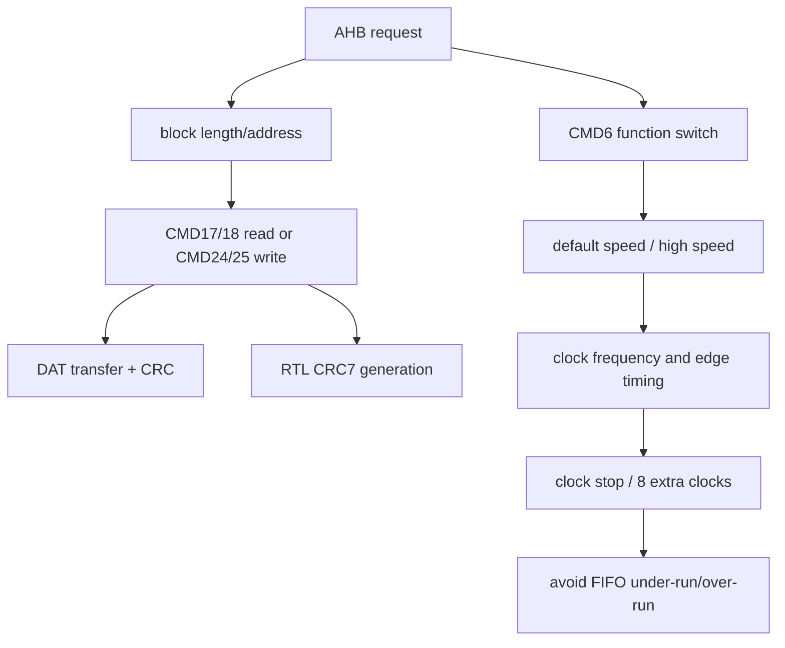

# 任务66：AHB sd host控制器设计5

## 本章知识全景图

这一讲把 SD 卡块传输规则继续推进到 Host 控制器实现：块长、速度切换、时钟控制、CRC 不是彼此独立的小知识，而是决定 `sd_host` 能否稳定跑在标准/高速模式下的四个约束。

核心概念：`Block Read`、`Block Write`、`CMD16`、`CMD17`、`CMD18`、`CMD24`、`CMD25`、`CMD6`、`high-speed mode`、`12.5 MB/s`、`25 MB/s`、`50 MHz`、`clock stop`、`8 clocks`、`CRC7`、`sd_cmd_pos/sd_cmd_neg`。

逻辑主线：
1. 块传输仍以 512 Byte 为中心，读写命令必须和块长、地址边界、CRC 同时考虑。
2. `CMD6` 用来切换或查询卡功能，高速模式不是简单把时钟调快，而是要先确认规格和能力。
3. SD 时钟既是传输节拍，也是流控手段；停钟可以节能或避免 FIFO under-run/over-run，但最后必须补足规定时钟。
4. 命令 CRC 在 RTL 中按发送 bit 串行更新，发送边沿还会随标准/高速时钟模式选择而改变。

### 概念地图



### 最短学习路径

1. 先把块读写和 512 Byte 边界稳定下来。
2. 再理解 `CMD6` 切高速的前提：版本、SCR 能力、时钟和 IO 时序。
3. 最后看 RTL：输出 CMD 的边沿选择、CRC7 递推、停钟/补钟都要由状态机统一调度。

## 1. 块传输的基本单位仍然是控制器计数的根

Block read/write 不是“任意长度流传输”，而是以块为单位组织数据和 CRC。课程在 66 开头继续强调：每个块后面都附 CRC，单块命令完成后回到 `tran`，多块命令要用 stop 命令终止。


视觉核验：视频 13:00-23:00。教学职责：把块传输的基本边界固定下来，避免把 SD DAT 线理解成任意长度流。看图要点：同时看 `block oriented`、`512 Bytes`、`CMD16`、`CMD17/18`、`CMD12` 和 `ADDRESS_ERROR`；这些关键词共同定义“发什么命令、收多少、何时停、错在哪里”。漏看后果：RTL 容易只按 AHB beat 计数，漏掉块尾 CRC、地址对齐和 stop 条件。

读路径要点：
- `CMD17`：读单块，响应后等待 DAT 上的数据块和 CRC。
- `CMD18`：读多块，卡连续输出数据块，Host 发 `CMD12` 后才停止。
- 如果使用 partial block，累计长度和地址边界必须合法；否则卡会置 `ADDRESS_ERROR` 并进入等待 stop 的状态。

写路径要点：
- `CMD24/CMD25`：Host 向卡发送一个或多个数据块。
- Host 必须为每块附加 CRC，不能只看 AHB 侧数据字节数。
- 支持块写的卡在 `CMD16` 设置块长时仍要求以 512 Byte 为有效边界；课程特别提示 1 KB/2 KB 的 `WRITE_BL_LEN` 不能被误读成 Host 可随意写大块。

控制器的块计数器应当以“数据字节 + CRC + 响应/busy”闭环，而不是只以 AHB burst beat 数闭环。AHB 侧可以是 32-bit 或 64-bit 数据宽度，SD 侧仍按 bit/byte/块串行化。

机制比喻：块传输像固定规格的快递箱，不是散装水管。512 Byte 是箱体容量，CRC 是每箱封条，`CMD12` 是多箱运输的停止单；AHB burst 只是仓库内部搬运节拍，不能替代 SD 侧箱体、封条和停止单。

## 2. `CMD6` 切换的是卡功能，不只是速度位

`CMD6(SWITCH_FUNCTION)` 用于切换或扩展 SD Memory Card 功能。课程这里重点讲两个功能组：卡访问速度和命令系统。速度组默认是 12.5 MB/s interface speed，高速模式是 25 MB/s interface speed；要实现 25 MB/s，时钟频率提高到 50 MHz，并且 CLK/CMD/DAT 的时序和电路条件都要按高规格处理。


视觉核验：视频 28:00-30:00。教学职责：说明高速模式是 Host 与卡共同完成的功能协商，不是单方面改分频器。看图要点：抓住 `CMD6`、`SD_SPEC`、`SCR register`、`12.5 MB/sec`、`25 MB/sec`、`50 MHz` 的因果链：先确认能力，再切功能，再改时钟/边沿。漏看后果：控制器可能在卡仍处于默认速度能力时直接跑 50 MHz，表现为命令 CRC 错、响应超时或 DAT 采样错位。

Host 切高速的安全顺序：
1. 初始化阶段先按默认低速/标准模式通信。
2. 读取 SCR 或相关能力字段，确认卡规格版本和高速支持。
3. 用 `CMD6` 查询或切换目标功能组。
4. 等响应和状态稳定后，再调整 Host 时钟到高频。
5. 同步更新采样/输出边沿、超时计数和约束。

常见误解：把 `CMD6` 当成“写一个寄存器让卡变快”。正确理解是 Host 和卡都要达成同一个模式：卡支持、命令切换成功、Host 时钟改变、IO 时序满足，四者缺一不可。

更准确地说，`CMD6` 的对象是“功能组选择”，输入是 mode 位和各 function group 的选择值，输出不是单个 ready 位，而是响应加上功能状态数据；Host 需要从状态数据里确认目标 function 是否被接受。工程上可把 `CMD6` 当成“换挡申请”：卡先告诉你能不能挂高速挡，接受后 Host 再真正改变 clock、输出相位和时序约束。

## 3. SD clock 是节拍，也是流控手段

SD 总线没有独立的 ready/valid 握手线，时钟本身可以被 Host 用来控制数据流。Host 允许降低时钟频率或停止时钟，以节能或避免 under-run/over-run。


视觉核验：视频 33:00-36:00。教学职责：把 SD clock 从“固定时钟源”改理解为 Host 可调度的传输节拍。看图要点：同时看 `energy saving`、512 Byte buffer 与 1 KB write block 的例子、最后事务后的 8 clock 要求。漏看后果：RTL 可能为了省电或防 under-run 直接关钟，却没有在协议允许窗口关停，也没有补足结束后的 8 个 clock。

课程给出的典型场景：Host 只有 512 Byte 内部 buffer，但卡侧写块可能按 1 KB 连续写理解。Host 可以在发完前 512 Byte 后停钟，填充内部 buffer，再重新供钟继续后半块。卡从自己的视角看不到数据流中断，因为它只在时钟边沿上推进。

这条规则对 `AHB sd_host` 很关键：
- AHB 写侧供数慢时，可以停 SD clock 防止 DAT 下溢。
- AHB 读侧取数慢时，也可以通过时钟调度避免内部 FIFO 溢出。
- 停钟不是随便拉低 clock enable；停前必须处于协议允许的窗口，恢复时还要保持 CMD/DAT 方向和状态一致。

最后事务后的 8 clock 规则要单独实现：

| 事务类型 | Host 关钟前必须继续给的时钟 |
|---|---|
| 无响应命令 | Host command end bit 后 8 个 clock |
| 有响应命令 | Card response end bit 后 8 个 clock |
| 读数据事务 | 最后一个 data block end bit 后 8 个 clock |
| 写数据事务 | CRC status token 后 8 个 clock |

这 8 个 clock 是卡内部完成边界动作的尾巴。若控制器为了省电立刻停钟，可能导致卡没有完成响应结束、CRC 状态或内部收尾。

机制比喻：SD clock 像传送带的电机，不是货物本身。Host 可以让传送带暂停，让 FIFO 补货或腾位置；但箱子已经到出口后还要让传送带多转几格，卡内部状态机才能把结束位、CRC status 或 data end 收干净。

## 4. CRC 保护 CMD、响应和数据块

SD 总线的 CRC 覆盖命令、响应和数据传输。课程此处特别强调：CMD 线上每条命令生成一个 CRC，每个响应要被检查；数据块则每传输一个块生成一个 CRC。


视觉核验：视频 38:00-40:00。教学职责：明确 CRC 是命令、响应和数据块的完整性边界。看图要点：区分 CMD 线上的 command/response CRC 与 DAT 线上的 data block CRC；“one CRC per transferred block”不是一次多块传输只算一个总 CRC。漏看后果：控制器可能只实现命令 CRC7，读写数据看起来能搬运，真实卡或规范模型会在块尾 CRC 阶段报错。

CRC 的实现含义：
- 命令发送：Host 根据发送的 40 bit 有效字段生成 `CRC7`，再把 7 bit CRC 和 end bit 拼到 48 bit 命令帧。
- 响应接收：除特殊响应类型外，Host 要检查响应 CRC，否则只能知道“有响应”，不能知道响应是否可靠。
- 数据读写：每个数据块都要单独 CRC，不是一次多块传输只算一个总 CRC。

如果 CRC 单元只和命令 FSM 绑定，后续数据块会缺完整性保护；如果 CRC 单元不按 bit 顺序递推，仿真中可能看似有值，真实卡却拒绝命令。

4-bit 总线要特别小心：数据块被拆到 `DAT0..DAT3` 四条 lane 上并行推进，每条 lane 都有自己的 CRC16 序列。验证时至少要覆盖“单 lane 翻转”“lane 顺序接反”“块尾 CRC 位数错”三类错误；否则只能证明 FIFO 字节数对了，不能证明 SD 总线传输完整。

## 5. 代码段：命令输出边沿和 CRC7 递推

课程末尾进入 `sd_host/rtl/ahb` 目录中的 Verilog 代码，画面展示了命令输出边沿选择和发送命令 CRC 生成逻辑。


视觉核验：视频 42:00-42:50。教学职责：把前面的 clock/CRC 规则落到 RTL 片段，说明命令输出相位和 CRC7 窗口必须由状态机精确控制。看图要点：先看 `sd_cmd_pos -> sd_cmd_neg -> out_sd_cmd` 的相位选择，再看 `CMD_STATE_SEND` 和 `in_has_send_bit < 6'd40` 对 CRC 更新窗口的限制。漏看后果：可能写出一个“能跑波形”的 CRC 寄存器，却把 start/end/CRC 字段也算进去，或在高速模式下让卡采样到不稳定 CMD。

可重建的核心逻辑是：

```verilog
always @(negedge in_sd_clk or negedge hrst_n) begin
  if (!hrst_n)
    sd_cmd_neg <= 1'b0;
  else
    sd_cmd_neg <= sd_cmd_pos;
end

assign out_sd_cmd = in_high_speed_clk ? sd_cmd_pos : sd_cmd_neg;
```

这段代码的设计意图是：高/低速模式对 CMD 输出相位要求不同，控制器用 `in_high_speed_clk` 选择直接输出 `sd_cmd_pos`，或输出在负边沿锁存后的 `sd_cmd_neg`。这不是简单的 mux，它关系到卡在时钟边沿采样 CMD 时能否看到稳定数据。

CRC7 递推逻辑可以从画面读出一个关键特征：`crc_reg[0]` 使用当前发送 bit 与 `crc_reg[6]` 异或，后续 bit 逐级移位，部分 tap 再异或反馈。这是典型串行 LFSR 写法。

```verilog
always @(posedge in_sd_clk or negedge hrst_n) begin
  if (!hrst_n)
    crc_reg <= 7'b0;
  else if (!in_soft_reset)
    crc_reg <= 7'b0;
  else if ((in_current_state == `CMD_STATE_SEND) &&
           (in_has_send_bit >= 6'd0) &&
           (in_has_send_bit < 6'd40)) begin
    crc_reg[0] <= cmd_for_send[in_has_send_bit[2:0]] ^ crc_reg[6];
    crc_reg[1] <= crc_reg[0];
    crc_reg[2] <= crc_reg[1];
    crc_reg[3] <= cmd_for_send[in_has_send_bit[2:0]] ^ crc_reg[6] ^ crc_reg[2];
    crc_reg[4] <= crc_reg[3];
    crc_reg[5] <= crc_reg[4];
    crc_reg[6] <= crc_reg[5];
  end else begin
    crc_reg <= 7'b0;
  end
end
```

这里真正要盯住的是条件窗口：CRC 只应覆盖命令帧中需要参与 CRC 的有效 bit，不应把 start bit、CRC 字段本身或 end bit 混进去。`in_has_send_bit < 6'd40` 就是这种窗口意识。

复现这段 RTL 时可以做一个小型 checker：给定 `cmd_index`、`cmd_arg` 和参考 CRC7，逐 bit 送入 `cmd_for_send`，检查 `crc_reg` 只在 index+argument 有效窗口变化；在 start bit、CRC 字段、end bit 和 idle 周期保持不参与递推。这个 checker 比只看最后 `out_sd_cmd` 波形更能定位 off-by-one。

## 6. 这一讲对控制器验证的要求

66 的内容可以直接转成测试点：

| 测试点 | 输入场景 | 通过标准 |
|---|---|---|
| 块长边界 | `CMD16` 设置 512 Byte，执行 `CMD17/CMD24` | 计数、CRC、响应均按一块闭环 |
| 多块停止 | `CMD18/CMD25` 后发 `CMD12` | stop 命令完整发送，数据流按协议停止 |
| 高速切换 | 初始化后发 `CMD6` 切 high-speed | 先能力确认，再切时钟，CMD 输出相位正确 |
| 停钟流控 | AHB FIFO 暂时无数据/无空间 | SD clock 在合法窗口停启，无 under-run/over-run |
| 8 clock 尾巴 | 命令/响应/读/写结束后关钟 | 关钟前补足对应 8 个 clock |
| CRC7 | 对命令字段逐 bit 递推 | CRC 与协议模型一致，窗口不多不少 |
| 4-bit 数据 CRC | `DAT[3:0]` 任一 lane 注入错误 | 对应 lane CRC16 fail，不误判成整块 pass |

验证时不要只看“仿真跑完无 X”。应当在波形上检查 `out_sd_cmd` 相对 `in_sd_clk` 的稳定窗口、`crc_reg` 的更新范围、clock enable 的停启窗口和最后 8 个 clock。

## 7. 复习自测

1. 为什么 `CMD6` 不能等同于“把时钟直接改到 50 MHz”？  
答案：`CMD6` 是功能切换命令，Host 必须先确认卡规格和高速能力，再发命令切换功能，最后调整 Host 时钟和 IO 时序。只改时钟会让卡和 Host 模式不一致。

2. SD clock 为什么可以用于流控？  
答案：SD 总线传输在时钟边沿推进，Host 停止或降低时钟后，卡侧不会继续消耗/输出新的串行位；因此可在协议允许窗口内避免 Host FIFO under-run 或 over-run。

3. 最后事务后为什么还要给 8 个 clock？  
答案：这是卡完成命令、响应、读数据或写 CRC 状态收尾的时钟要求。若立刻停钟，卡可能无法完成内部状态更新或结束位后的处理。

4. 命令 CRC7 的递推窗口为什么重要？  
答案：CRC 只覆盖命令中规定的有效字段。若把 start/end/CRC 字段或空闲位混入，Host 发送的 CRC 与卡计算结果不一致，卡会拒绝或报错。

5. `assign out_sd_cmd = in_high_speed_clk ? sd_cmd_pos : sd_cmd_neg;` 的设计含义是什么？  
答案：它根据高速模式选择 CMD 输出相位，保证卡在对应时钟边沿采样时 CMD 数据稳定；这是时序适配，不只是普通数据选择器。

6. `CMD6` 的输入输出分别是什么？  
答案：输入是 mode 位和各 function group 的选择值；输出是命令响应以及功能状态数据。Host 要用这些输出确认目标功能是否可用/已切换，再改变本地时钟和采样相位。

7. 4-bit lane CRC 的判定口径是什么？  
答案：每条 DAT lane 都要形成独立 CRC16。测试通过标准不是“FIFO 收到 512 Byte”，而是四条 lane 的数据顺序、块尾 CRC 位数和 CRC 值都与参考模型一致；任一 lane 翻转应触发 CRC fail。

