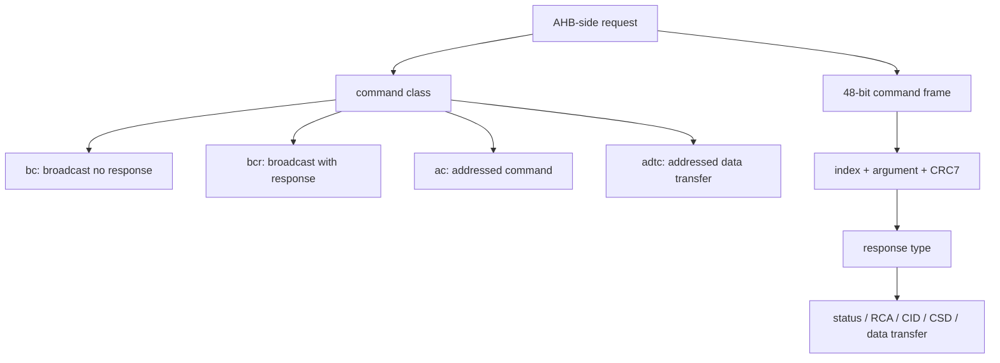

# 任务67：AHB sd host控制器设计6

## 本章知识全景图

这一讲进入 SD 协议的“命令-响应”层：Host 控制器发出的每一次操作，本质上都是一个 48-bit 命令帧，帧里包含命令号、参数、CRC 和结束位；卡的响应类型决定 Host 接下来该解析状态、CID/CSD、RCA，还是等待数据通路动作。

核心概念：`bc`、`bcr`、`ac`、`adtc`、48-bit command frame、`start bit`、`transmission bit`、`command index`、`argument`、`CRC7`、`end bit`、`CMD0`、`CMD2`、`CMD3`、`CMD7`、`CMD8`、`CMD12`、`CMD13`、`CMD16`、`CMD17`、`CMD24`、`ACMD6`、`ACMD13`、`ACMD22`、`ACMD23`。

逻辑主线：
1. SD 命令先按“是否广播、是否有响应、是否带数据”分成四类。
2. 所有普通命令帧长度固定为 48 bit，控制器必须按字段拼帧并串行发送。
3. 命令表不是背诵材料，而是初始化、选卡、状态查询、块读写、总线宽度设置的操作字典。
4. `CMD` 与 `ACMD` 的区别会影响状态机：应用命令必须先用 `CMD55` 声明。

### 概念地图



### 最短学习路径

1. 先把 48-bit 命令帧字段背熟到能手写。
2. 再按四类命令理解 Host 为什么有时等响应、有时等数据、有时只改变状态。
3. 最后按命令表建立控制器命令字典：初始化命令、状态命令、读写命令、应用命令分开处理。

## 1. 四类命令决定 Host 后续等待什么

SD 命令的第一层分类不是命令号大小，而是命令对总线和卡的作用方式。


视觉核验：视频 03:00-08:00。教学职责：把命令号背诵转成控制器等待路径选择：无响应、等响应、等响应加 DAT。看图要点：先看 `four kinds of commands`，再看同页的 48-bit command format；命令类型决定后续 FSM，命令格式决定 CMD 线怎么发。漏看后果：RTL 会把所有命令都走同一个 wait response 或 done 分支，导致 `CMD0` 假超时、`CMD17` 响应后提前结束、`ACMD` 扩展困难。

| 类型 | 全称 | 是否定址 | 是否有响应 | 是否有 DAT 数据 | 典型用途 |
|---|---|---|---|---|---|
| `bc` | broadcast command | 广播 | 无响应 | 无 | `CMD0` 复位所有卡 |
| `bcr` | broadcast command with response | 广播 | 有响应 | 无 | `CMD2` 请求 CID，`CMD3` 请求 RCA |
| `ac` | addressed command | 点对点 | 有响应 | 无 | `CMD7` 选卡，`CMD13` 查状态 |
| `adtc` | addressed data transfer command | 点对点 | 有响应 | 有 DAT | `CMD17/18` 读，`CMD24/25` 写 |

这四类直接决定 RTL 的等待路径：
- `bc`：发完命令即可按状态机进入下一步，不应等待响应超时。
- `bcr/ac`：必须打开响应接收窗口，解析 R 类型响应。
- `adtc`：响应只是第一段，后面还要进入 DAT 发送/接收状态。

如果控制器只按命令号写 case，而没有命令类型字段，后续扩展 ACMD 或调试超时会很痛苦。

机制比喻：命令类型像工单类型，不是工单编号。`bc` 是广播通知，发完不等回执；`bcr/ac` 是要回执的指令；`adtc` 是“回执后还要搬货”的指令。控制器先看工单类型，才知道接下来打开 response decoder、data engine 还是直接结束。

## 2. 所有命令帧都按 48 bit 固定格式发送

SD 命令帧固定 48 bit，课程表格给出字段：

| bit 位置 | 宽度 | 值/字段 | 含义 |
|---|---:|---|---|
| 47 | 1 | `0` | start bit |
| 46 | 1 | `1` | transmission bit，Host 发命令 |
| 45:40 | 6 | command index | 命令号，例如 `CMD17` 的 index 是 17 |
| 39:8 | 32 | argument | 命令参数，含地址、RCA、块长、模式字段等 |
| 7:1 | 7 | CRC7 | 命令 CRC |
| 0 | 1 | `1` | end bit |

课程还给出命令发送时间：48 bit 在 25 MHz 下约 1.92 us，在 50 MHz 下约 0.96 us。这个时间虽短，但在控制器中不能被忽略，因为响应等待窗口、命令 busy、CRC 更新都以这 48 个 bit 为边界。

命令拼帧的 RTL 结构通常是：

```verilog
cmd_frame = {1'b0, 1'b1, cmd_index[5:0], cmd_arg[31:0], crc7[6:0], 1'b1};
```

发送状态机要做三件事：
1. 按 bit 计数器从 MSB 到 LSB 串行输出。
2. 在 index 和 argument 字段发送期间更新 CRC7。
3. end bit 后根据命令类型进入响应、数据或完成状态。

从输入输出看，command builder 的输入是 `cmd_index`、`cmd_arg`、CRC seed/enable 和命令类型；输出是 48-bit 串行帧、CRC7 字段、`cmd_done` 以及下一状态建议。失败信号不是只有“没有响应”，还包括 CRC 窗口 off-by-one、argument 拼错、命令类型和 response 类型不匹配。

## 3. 初始化和选卡命令构成第一组命令字典

`CMD0` 到 `CMD7` 是从复位、识别到选卡的核心路径。


视觉核验：视频 13:00-18:00。教学职责：把初始化/选卡阶段的命令字典和前一讲的 `stby/tran` 状态连起来。看图要点：`CMD0` 是无响应复位，`CMD2/CMD3` 用于识别和 RCA，`CMD7` 用 `[31:16] RCA` 选择或取消选择卡。漏看后果：容易把 RCA 当成普通地址，或把 `CMD7 R1b` 当普通 R1，导致选卡 busy 没等完就发读写命令。

| 命令 | 类型 | 参数核心 | 响应 | 控制器意义 |
|---|---|---|---|---|
| `CMD0` | `bc` | stuff bits | 无 | 把所有卡复位到 idle，不等响应 |
| `CMD2` | `bcr` | stuff bits | `R2` | 请求任意卡发送 CID |
| `CMD3` | `bcr` | stuff bits | `R6` | 让卡发布新的 RCA |
| `CMD4` | `bc` | DSR + stuff | 无 | 设置 DSR，普通设计中较少用 |
| `CMD7` | `ac` | `[31:16] RCA` | `R1b` | 选中/取消选中卡，在 `stby/tran` 等状态间切换 |

`CMD7` 的响应是 `R1b`，这意味着它不仅返回状态，还可能伴随 busy。控制器不能把 `R1b` 当普通 `R1` 处理完就立即继续；必须有 busy 检测路径。

可复现选卡序列：

```text
CMD3 -> wait R6, latch RCA
CMD7({RCA, 16'h0000}) -> wait R1b
DAT0 busy released
card_state := tran
```

判定口径：RCA 必须来自 `CMD3/R6`，`CMD7` 参数高 16 bit 必须是目标 RCA；若 `CMD7` 返回错误或 DAT0 busy 超时，后续 `CMD17/CMD24` 不得发出。

## 4. 条件、状态和停止命令构成第二组命令字典

`CMD8` 到 `CMD13` 解决的是“卡是否兼容、卡是谁、卡现在怎样、如何停止传输”。


视觉核验：视频 23:00-28:00。教学职责：把兼容性检查、状态查询和停止命令分开，不把它们都当普通配置命令。看图要点：`CMD8` 是 `bcr/R7`，要看 check pattern；`CMD12` 是 `ac/R1b`，要看 stop 与 busy；`CMD13` 是 `ac/R1`，用于读卡状态。漏看后果：初始化可能忽略电压/版本不匹配，多块传输可能把 stop 当成一拍完成，调试时也缺少 `CMD13` 闭环。

| 命令 | 类型 | 响应 | 关键参数 | 用途 |
|---|---|---|---|---|
| `CMD8` | `bcr` | `R7` | VHS + check pattern | 发送接口条件，确认电压范围和检查模式回显 |
| `CMD9` | `ac` | `R2` | RCA | 读取 CSD |
| `CMD10` | `ac` | `R2` | RCA | 读取 CID |
| `CMD12` | `ac` | `R1b` | stuff bits | 强制停止当前传输 |
| `CMD13` | `ac` | `R1` | RCA | 读取卡状态寄存器 |

`CMD8` 是初始化兼容性检查的关键命令。Host 发出电压范围和 check pattern，卡在 `R7` 中回显；如果回显不匹配，后续不能假设卡支持当前电压/版本。

`CMD12` 是多块传输的停止命令。它的响应为 `R1b`，所以 stop 本身也可能包含 busy 语义；控制器需要把 stop 序列看成一个完整事务，而不是一个写 `stop` 位的瞬间动作。

`CMD13` 是调试和状态机闭环的常用命令。它不改变 data transfer mode 中的状态，但可以读出当前状态、错误位、ready 等信息。验证时 `CMD13` 常用于确认卡是否已经从 `prg` 回到可继续状态。

`CMD12` 的可复现停止链路：

```text
CMD18/CMD25 active
-> stop_request
-> send CMD12(stuff argument)
-> wait R1b
-> wait busy released if present
-> optional CMD13(RCA) confirm current_state/ready/error bits
```

失败判定：`CMD12` 响应超时、R1 错误位非零、busy 长时间不释放、`CMD13` 仍显示 data/rcv/prg 或错误状态，任一项都不能报告多块事务完成。

## 5. 块长和读写命令构成第三组命令字典

`CMD16` 以后进入真实数据传输。`CMD16` 设置块长，`CMD17/18` 读，`CMD24/25` 写，`CMD27` 写 CSD 可编程位。


视觉核验：视频 33:00-38:00。教学职责：说明 `CMD16` 和读命令的分工：前者定义块长约束，后者发起真正 DAT 接收。看图要点：`CMD16 SET_BLOCKLEN` 是 `ac/R1`，`CMD17 READ_SINGLE_BLOCK` 是 `adtc/R1`；`R1` 后还要等 DAT 数据块和 CRC。漏看后果：容易把 `CMD17` 的 R1 当读数据完成，或把块长配置和读事务混在同一个状态里。


视觉核验：视频 38:00-42:00。教学职责：说明写命令的输入输出和多块写停止边界。看图要点：`CMD24` 是单块写，`CMD25` 是多块写；两者都是 `adtc/R1`，响应后 Host 才在 DAT 线上发送数据和 CRC，写后还要看 data response/busy。漏看后果：RTL 可能在发送完 512 Byte 后立即回到 idle，漏掉 CRC status、DAT0 busy 和 `CMD12` 停止。

| 命令 | 类型 | 响应 | 参数 | 控制器动作 |
|---|---|---|---|---|
| `CMD16` | `ac` | `R1` | block length | 设置后续块命令的块长，超过 512 Byte 会置错误 |
| `CMD17` | `adtc` | `R1` | data address | 单块读，响应后接收一个数据块 |
| `CMD18` | `adtc` | `R1` | data address | 多块读，持续接收直到 `CMD12` |
| `CMD24` | `adtc` | `R1` | data address | 单块写，响应后发送一个数据块 |
| `CMD25` | `adtc` | `R1` | data address | 多块写，持续发送直到 stop |
| `CMD27` | `adtc` | `R1` | stuff bits | 写 CSD 可编程位 |

`adtc` 命令的关键是“响应不是结束”。例如 `CMD17` 的 `R1` 只说明卡接受了读请求，真正的数据还要等 DAT 线上的 start bit、data bits、CRC；`CMD24` 的 `R1` 也只说明卡准备接收，Host 还要发送数据并等待 data response/busy。

可复现块命令序列：

| 目标 | 命令序列 | 输入 | 输出/完成判定 |
|---|---|---|---|
| 单块读 | `CMD16(512)` 可选 -> `CMD17(addr)` | 地址、块长 | R1 pass，接收 512 Byte，DAT lane CRC pass |
| 多块读 | `CMD18(addr)` -> 若达到块数则 `CMD12` | 起始地址、目标块数 | 每块 CRC pass，stop R1b/busy 完成 |
| 单块写 | `CMD24(addr)` -> send data block + CRC | 地址、512 Byte 数据 | data response accepted，busy 释放 |
| 多块写 | `CMD25(addr)` -> repeated data blocks -> `CMD12` | 起始地址、块数、数据流 | 每块响应正常，stop/busy 完成，必要时 `ACMD22/CMD13` 核对 |

这里的工程用途是把 AHB 侧“读写地址、块数、FIFO 数据”翻译为 SD 侧“命令帧、响应、DAT 方向、CRC、busy”的完整事务。失败信号包括响应超时、R1 错误、CRC fail、FIFO under-run/over-run、DAT0 busy 超时和读写块数不符。

## 6. ACMD 要先经过 `CMD55` 声明

应用命令 `ACMD` 与普通 `CMD` 共享命令线，但协议上需要先发 `CMD55(APP_CMD)`，卡状态中会置位表示下一条命令按 ACMD 解释。课程画面中出现的典型 ACMD：


视觉核验：视频 42:00-42:50。教学职责：把 `ACMD` 理解成 `CMD55 + 下一条应用命令` 的二阶段协议，而不是另一套独立总线。看图要点：`ACMD6` 设置 1-bit/4-bit 总线宽度，`ACMD13/22` 后面还有 DAT 数据块，`ACMD23` 用于多块写预擦除。漏看后果：直接发 `ACMD6` 会被卡当成未声明命令，4-bit 总线可能没有真正切换；把 `ACMD13/22` 当无数据命令会漏接状态块。

| ACMD | 类型 | 响应 | 用途 |
|---|---|---|---|
| `ACMD6` | `ac` | `R1` | 设置 DAT 总线宽度，`00` 为 1-bit，`10` 为 4-bit |
| `ACMD13` | `adtc` | `R1` | 读取 512-bit SD Status |
| `ACMD22` | `adtc` | `R1` | 读取无错误写入的块数量，返回 32-bit CRC data block |
| `ACMD23` | `ac` | `R1` | 设置预擦除写块数，用于加速多块写 |

对 RTL 来说，ACMD 不是另一个独立总线，而是状态机中的“两步命令序列”：

```text
CMD55(RCA) -> wait R1 with APP_CMD accepted -> ACMDx(argument) -> wait corresponding response/data
```

如果 `CMD55` 失败或状态未置位，后续 `ACMD6` 不能当成有效总线宽度设置。验证时要覆盖“CMD55 成功/失败”和“ACMD 响应错误”两种分支。

可复现的 `CMD55 + ACMD` 序列：

```text
CMD55({RCA, 16'h0000}) -> wait R1 and check APP_CMD accepted
ACMD6(32'h0000_0002) -> wait R1
Host 本地 bus_width 从 1-bit 切到 4-bit
后续 DAT[3:0] 数据和每 lane CRC16 均按 4-bit 模式验证
```

`ACMD13/ACMD22` 属于带数据的应用命令：`CMD55` 成功只说明下一条按 ACMD 解释，`ACMD13/22` 的 R1 也不是最终数据；Host 还要接收对应状态/计数数据块并校验 CRC。

## 7. 从命令表到 `sd_host` 微架构

这一讲可以直接归纳成控制器命令层的微架构需求：

| 模块 | 职责 | 与本讲对应 |
|---|---|---|
| command builder | 拼 48-bit 帧 | start/transmission/index/argument/CRC/end |
| command scheduler | 根据 AHB 请求选命令序列 | `CMD16 -> CMD17/24`，`CMD55 -> ACMDx` |
| response decoder | 按 R 类型解析字段 | `R1/R1b/R2/R6/R7` |
| protocol FSM | 根据命令类型进入下一状态 | `bc/bcr/ac/adtc` |
| data engine | `adtc` 后接管 DAT | 读写块、CRC、busy |
| error/status register | 暴露卡状态和错误 | `CMD13`、R1 status、CRC error |

好的命令层设计不会把所有命令硬写成一个巨大 case 后直接拉信号，而是把“命令描述表”和“事务序列”拆开：命令描述表说明 index、argument、response、是否带 DAT；事务序列说明为了完成一次 AHB 操作要发哪些命令。

命令描述表至少应包含这些字段：`index`、`type`、`argument builder`、`response type`、`has_data`、`data_dir`、`needs_busy_wait`、`next_on_pass`、`error_mask`。事务序列再把它们串起来，例如 `CMD55 -> ACMD6 -> switch bus width` 或 `CMD18 -> receive N blocks -> CMD12 -> CMD13 optional`。这样写的好处是：命令格式错误由 builder 管，响应错误由 decoder 管，数据阶段错误由 data engine 管，不会把所有边界塞进一个不可维护的大状态。

## 8. 复习自测

1. `bc`、`bcr`、`ac`、`adtc` 的核心区别是什么？  
答案：`bc` 广播且无响应；`bcr` 广播且有响应；`ac` 是定址命令，有响应但无 DAT 数据；`adtc` 是定址数据传输命令，有响应且后续有 DAT 数据。

2. SD 命令帧为什么固定 48 bit？  
答案：协议规定命令帧由 start、transmission、6-bit index、32-bit argument、7-bit CRC 和 end bit 组成，固定长度便于卡在 CMD 线上按统一格式解析。

3. `CMD17` 收到 `R1` 后，事务是否结束？  
答案：没有。`R1` 只说明读命令被响应，后续还要在 DAT 线上等待数据块和 CRC。`CMD17` 属于 `adtc`。

4. `CMD12` 为什么需要特殊处理？  
答案：`CMD12` 用于停止多块传输，响应类型是 `R1b`，可能伴随 busy。控制器必须等待 stop 响应和 busy 释放，不能发完命令立即认为停止完成。

5. `ACMD6` 为什么不能直接发？  
答案：应用命令必须先发 `CMD55` 声明下一条按 ACMD 解释，并确认卡接受 APP_CMD。否则 `ACMD6` 不一定被卡当作设置总线宽度命令。

6. `CMD55 + ACMD6` 设置 4-bit 总线后，验证还要看什么？  
答案：要看 `CMD55` 的 R1 是否接受 APP_CMD，`ACMD6` 的 R1 是否成功，Host 本地 bus_width 是否同步切到 4-bit，后续 `DAT[3:0]` 四条 lane 的数据顺序和 CRC16 是否全部通过。

7. 为什么 `ACMD13/ACMD22` 的 R1 不是事务结束？  
答案：它们属于带数据的应用命令。R1 只说明命令被接受，后面还要在 DAT 线上接收 SD Status 或写块计数数据块，并检查块 CRC。

