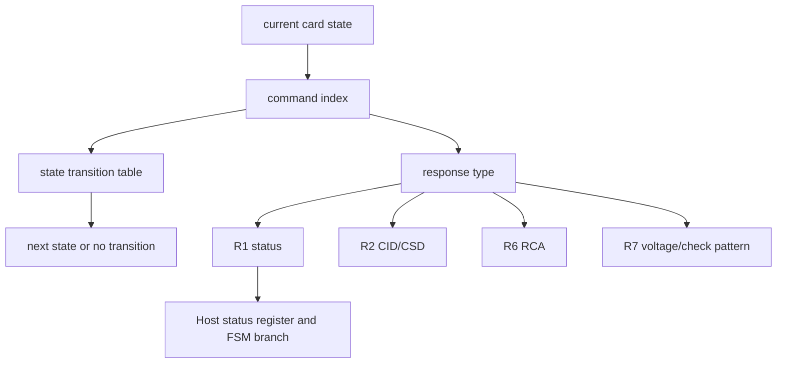

# 任务68：AHB sd host控制器设计7

## 本章知识全景图

这一讲把命令表变成两张控制器必须会读的表：一张是“当前状态 + 命令 -> 下一状态”的状态迁移表，另一张是“响应类型 -> 位字段含义”的响应格式表。前者决定能不能发命令，后者决定收到响应后该更新哪些寄存器和状态。

核心概念：`idle/ready/ident/stby/tran/data/rcv/prg/dis/ina`、`Operation Complete`、`CMD0/2/3/7/8/9/10/12/13/15/16/17/18/24/25/27`、`Response`、`R1`、`R1b`、`R2`、`R3`、`R6`、`R7`、`card status`、`command index`、`CRC7`、`busy`。

逻辑主线：
1. SD 状态迁移不是自由跳转，而是由“当前状态”和“命令”共同决定。
2. `CMD13/CMD55` 这类命令可能返回状态但不迁移，读写类命令才进入 `data/rcv/prg`。
3. 响应都走 CMD 线，除部分响应类型外包含 CRC；Host 必须按响应类型解析位域。
4. `R1` 是最常用的状态响应，`R6` 发布 RCA，`R7` 用于 `CMD8` 电压/模式回显。

### 概念地图



### 最短学习路径

1. 先把状态列名看成控制器状态枚举，而不是协议插图。
2. 再按常用命令读迁移：`CMD0/2/3/7/12/16/17/18/24/25`。
3. 最后把响应类型和状态寄存器字段连起来，形成 Host 接收响应后的更新规则。

## 1. 状态迁移表是命令合法性的判定矩阵

同一条命令在不同状态下结果不同，有些状态下甚至不合法。课程展示的表格以 current state 为列、trigger of state change 为行，表格单元给出 next state。


视觉核验：
- 教学职责：这张图负责把“协议状态”从抽象名词变成控制器查表依据，后续所有 CMD 合法性判断都从这里出发。
- 看图要点：横向看 current state，纵向看 command，交叉单元才是 next state；重点盯 `tran` 列下 `CMD16/17/18/24/25/27/12/13` 的差别。
- 漏看后果：如果只按 command index 更新 FSM，`CMD13` 会被误当成迁移命令，`CMD16` 会被误当成数据传输，读写状态会在真实卡上卡死。

对 Host 控制器来说，这张表至少有三层含义：

| 层次 | 要解决的问题 | RTL 对应 |
|---|---|---|
| 合法性 | 当前状态能不能发这条命令 | command issue guard |
| 下一状态 | 命令响应后应进入哪里 | protocol FSM update |
| 等待条件 | 是否需要等 operation complete/busy | timeout/busy monitor |

例如 `CMD17` 只能从 `tran` 进入 `data`，`CMD24/25/27` 从 `tran` 进入 `rcv`；`CMD12` 可把 `data` 或 `rcv` 的传输收束到 `tran/prg` 相关路径；`CMD13` 更多用于查询状态，不应让控制器误改状态。

更准确的心智模型是“门禁联锁”，不是“函数跳转”。命令号只是刷卡动作，current state 是当前门区；只有刷卡动作和门区都匹配，下一扇门才会打开。RTL 因此至少需要输入 `cmd_index`、`current_state`、`response_ok`、`operation_complete/busy_done`，输出 `next_state`、`illegal_cmd`、`start_dat_engine`、`wait_busy`。失败信号也对应这四类输入：状态不匹配、响应 CRC/索引错误、卡忙未释放、数据引擎被错误启动。

常用命令的工程分类：

| 命令 | 对象 | 输入 | 输出/状态变化 | 失败信号 | 工程用途 |
|---|---|---|---|---|---|
| `CMD0` | 所有卡 | 无参数或复位参数 | 回到 `idle` | 复位后仍有旧状态残留 | 初始化入口、错误恢复 |
| `CMD2` | 未分配 RCA 的卡 | 无 | `ready -> ident`，返回 CID 类长响应 | 长响应超时/CRC 错 | 建立卡身份 |
| `CMD3` | `ident` 中的卡 | 无或 RCA 相关参数 | `ident -> stby`，R6 发布 RCA | RCA 位域解析错 | 后续 addressed command 的地址基础 |
| `CMD7` | 指定 RCA 的卡 | argument 高 16 bit 为 RCA | `stby -> tran` 或取消选择 | RCA 不匹配、R1b busy 未等完 | 进入数据传输模式 |
| `CMD16` | 已选卡 | block length | 通常留在 `tran` | 块长非法、误开 DAT | 设置后续数据块边界 |
| `CMD17/CMD18` | `tran` 中的卡 | 起始地址 | `tran -> data`，卡驱动 DAT | 未等 `NAC`、数据 CRC 错 | 单块/多块读 |
| `CMD24/CMD25` | `tran` 中的卡 | 起始地址 | `tran -> rcv`，Host 驱动 DAT | CRC status 错、DAT0 busy 卡住 | 单块/多块写 |
| `CMD12` | 正在多块传输的卡 | stop 参数 | 收束到 `tran/prg` 相关路径 | stop 响应/忙信号处理错误 | 停止 `CMD18/CMD25` |
| `CMD13` | addressed card | RCA | 返回状态，不应随意迁移 | card status 错误位 | 查询 ready/current state |

## 2. 初始化、选卡、取消选择是三类不同迁移

状态迁移表中最容易混的是初始化相关命令：

| 命令 | 典型当前状态 | 下一状态/效果 | 控制器含义 |
|---|---|---|---|
| `CMD0` | 多数状态 | `idle` | 全局复位，重新初始化 |
| `CMD2` | `ready` | `ident` | 请求 CID，进入识别 |
| `CMD3` | `ident` | `stby` | 发布 RCA，卡待选 |
| `CMD7` addressed | `stby` | `tran` | 选中目标卡 |
| `CMD7` not addressed | `tran/data/rcv/prg` 等 | `stby/dis` 等 | 取消或切换选择 |
| `CMD15` | 多种可响应状态 | `ina` | 卡进入 inactive，不再普通响应 |


视觉核验：
- 教学职责：这张图负责区分初始化链、选卡链和 inactive 终态，防止把所有非数据命令都归成“普通控制命令”。
- 看图要点：看 `idle/ready/ident/stby/tran` 的推进顺序，再看 `CMD15 -> ina` 的不可逆性质；`CMD7` 要同时看是否 addressed。
- 漏看后果：初始化 FSM 会把 RCA 未发布的卡直接选中，或把 `ina` 当作可恢复状态，导致后续命令永远无响应。

`CMD15` 进入 `ina` 后不能按普通流程恢复，这是控制器中应当作为异常/终态处理的命令。普通读写控制器不应误触发 `CMD15`，除非上层明确要让卡 inactive。

初始化链的可复现检查：

```text
CMD0 -> current_state = idle
CMD8 -> R7 voltage/check pattern 通过，仍处于初始化路径
ACMD41/CMD2 -> ready/ident 相关路径完成
CMD3 -> 解析 R6，保存 RCA
CMD7(RCA) -> R1/R1b 正常，进入 tran
CMD13(RCA) -> 确认 CURRENT_STATE=tran 且 READY_FOR_DATA=1
```

如果 `CMD3` 的 R6 没有把 RCA 存下来，`CMD7` 发送的 argument 高 16 bit 就会错；如果 `CMD7` 的 busy 条件没等完，软件看到“选卡命令已返回”也不代表卡已经可做读写。

## 3. 数据类命令把 `tran` 分流到 `data/rcv/prg`

读写类命令都以 `tran` 为起点，但分流方向不同：

| 命令组 | 从 `tran` 到 | 含义 |
|---|---|---|
| `CMD16` | `tran` | 设置块长，本身不进入 DAT 数据传输 |
| `CMD17/CMD18` | `data` | 卡向 Host 发送数据 |
| `CMD24/CMD25/CMD27` | `rcv` | Host 向卡发送数据 |
| `CMD28/CMD29/CMD38` | `prg` | 写保护/擦除/编程类操作 |
| `CMD12` | `tran` 或 `prg` 相关收束 | 停止传输或结束写路径 |


视觉核验：
- 教学职责：这张图负责把 `CMD16`、读命令、写命令和 stop 命令分开，建立 DAT 引擎何时启动的边界。
- 看图要点：`CMD16` 是设置块长，`CMD17/18` 进入读数据路径，`CMD24/25/27` 进入写接收路径，`CMD12` 是收束点。
- 漏看后果：最常见 bug 是 `CMD16` 后误等 DAT，或 `CMD12` 一发出就把当前多块传输算成功。

控制器常见错误是把 `CMD16` 看成数据命令。它设置后续块长度，但不触发 DAT 线上数据块；`CMD17/18/24/25` 才进入真正的 DAT transfer。若状态机把 `CMD16` 后也打开 data engine，会等不到数据而超时。

读写迁移要按“数据方向”拆：

| 路径 | 命令 | CMD 响应后谁驱动 DAT | 结束条件 | 失败信号 |
|---|---|---|---|---|
| 单块读 | `CMD17` | Card | 收到一个完整 block、CRC 通过、end bit 正确 | `NAC` 超时、data CRC 错、块长不匹配 |
| 多块读 | `CMD18` + `CMD12` | Card | Host 发 `CMD12`，并等待 stop 响应/收尾延迟 | 块计数到但未发 stop、stop 后立即关接收 |
| 单块写 | `CMD24` | Host 先驱动，随后释放给 Card 返回 CRC status/busy | CRC status OK 且 DAT0 busy 释放 | `NWR` 抢跑、CRC status error、DAT0 长忙 |
| 多块写 | `CMD25` + `CMD12` | Host 分块驱动，Card 每块给接收反馈 | 当前块完整闭环后 stop | `CMD12` 落在 incomplete block 内 |

因此 `state_table_next` 只解决协议层迁移，不能替代数据层完成判定。真正的 done 要同时满足：状态迁移合法、响应正确、数据块边界完整、CRC 通过、busy 释放。

## 4. 响应都在 CMD 线返回，但格式由 R 类型决定

所有响应都经 CMD 线返回，响应从 start bit 开始，随后是 transmission bit。卡作为发送方时 transmission bit 为 `0`。响应长度和字段由响应类型决定，除 R3 等特殊类型外，响应通常带 CRC7，最后以 end bit `1` 结束。


视觉核验：
- 教学职责：这张图负责说明 response 是 CMD 线上的协议帧，不是软件寄存器随便读出的状态字。
- 看图要点：从 start bit、transmission bit、content、CRC7、end bit 的顺序看响应；再按 R 类型决定 content 位域。
- 漏看后果：Host 会把 R3 也强制做 CRC，或把 R2 长响应截成 48 bit，导致初始化和 CSD/CID 读取失败。

通用解析原则：
- Host 先检测 start bit 和 direction bit。
- 再根据本次命令期望的 R 类型决定总长度和字段切分。
- 对带 CRC 的响应检查 CRC7。
- 最后根据字段更新 Host 寄存器、协议状态或错误位。

响应解析不能只保存原始 48/136 bit 到一个寄存器里。为了让 AHB 软件可用，控制器应把 `card_status`、`published RCA`、`voltage accepted`、`check pattern echo` 等字段拆出来。

R 类型可以理解为“同一条 CMD 线上的不同报文模板”：

| 响应 | 常见命令 | 长度 | 关键字段 | CRC 要点 | Host 产物 |
|---|---|---|---|---|---|
| `R1` | `CMD7/13/16/17/18/24/25` | 48 bit | command index + 32-bit card status | 有 CRC7 | `card_status`、错误位、当前状态 |
| `R1b` | 可能带忙的选择/停止/编程类命令 | 48 bit + busy | R1 字段 + DAT0 busy | CMD 响应仍校验 CRC | `busy_wait` 和 done 条件 |
| `R2` | `CMD2/CMD9/CMD10` | 136 bit | CID/CSD 长字段 | 长响应路径 | 卡身份、CSD 参数 |
| `R3` | OCR/操作条件类响应 | 48 bit | OCR | 通常无 CRC7 保护 | 电压/ready 信息 |
| `R6` | `CMD3` | 48 bit | RCA + status bits | 有 CRC7 | `rca_reg` |
| `R7` | `CMD8` | 48 bit | voltage accepted + echo pattern | 有 CRC7 | 接口条件确认 |

## 5. `R1/R1b` 是状态响应，关键字段是 card status

`R1` 长度 48 bit，字段包括 start、transmission、command index、32-bit card status、CRC7、end bit。若涉及数据写入，卡可能在数据线给出 busy 信号，Host 要在数据块后检查 busy；`R1b` 可以理解为 R1 响应之后还要处理 busy。


视觉核验：
- 教学职责：这张图负责把 R1 拆成控制器可直接使用的字段，尤其是 `[39:8] card status`。
- 看图要点：`[45:40]` 必须匹配当前命令号，`[39:8]` 不是普通 payload，而是状态/错误集合，`[7:1]` 是响应 CRC7。
- 漏看后果：软件只能读到一坨原始位，无法区分“响应属于错误命令”“卡状态不允许继续”“CRC 本身坏了”这三类问题。

`R1` 的解析重点：

| 字段 | 含义 | 控制器动作 |
|---|---|---|
| `[45:40] command index` | 被响应的命令号 | 确认响应属于当前命令 |
| `[39:8] card status` | 错误位、当前状态、ready 等 | 更新状态寄存器，决定是否继续 |
| `[7:1] CRC7` | 响应 CRC | CRC error 置位或触发重试 |

`R1b` 的额外含义是 busy。Host 不能只在 CMD 线上收到 R1 就继续，而要看 DAT0 或协议规定的 busy 释放条件。`CMD7`、`CMD12`、写/擦除相关路径都可能触发这个问题。

R1 解析的可复现流程：

```text
shift 48-bit response
  -> check start=0, transmission=0, end=1
  -> check command_index == expected_cmd
  -> calculate/check CRC7 unless response type exempts it
  -> latch card_status[31:0]
  -> decode error bits / CURRENT_STATE / READY_FOR_DATA / APP_CMD
  -> if any fatal error: raise cmd_error and freeze data engine
  -> if R1b or status says busy path: enter busy wait
```

`card status` 像控制器的“仪表盘”，不是下一状态本身。状态迁移表告诉 Host 这条命令理论上会去哪里，R1 的 status 告诉 Host 卡实际报告了什么；二者不一致时，要优先进入错误/复核路径，而不是强行推进。
把状态表和响应表合起来验证时，要避免“表格背对了、RTL 仍然错”。推荐给 command 层加三类检查：第一类检查命令是否在当前 state 合法；第二类检查 response index/CRC/status 是否和期望一致；第三类检查 `start_dat_engine` 是否只在 `adtc` 且响应通过后拉起。这样表格图才真正变成硬件行为，而不是停在文档理解。

可写断言口径：

```systemverilog
assert property (@(posedge sd_clk) cmd_issue && !cmd_legal_in_state |-> illegal_cmd_error);
assert property (@(posedge sd_clk) resp_valid && resp_index != expected_cmd |-> response_index_error);
assert property (@(posedge sd_clk) start_dat_engine |-> adtc_cmd && resp_ok && card_status_ok);
assert property (@(posedge sd_clk) cmd16_done |-> !start_dat_engine);
```

这些断言分别卡住四个典型误用：非法状态发命令、响应窗口错位、无数据命令误开 DAT、`CMD16` 被误当成数据传输。

## 6. `R6` 发布 RCA，`R7` 校验电压和回显

`R6` 用在 `CMD3(SEND_RELATIVE_ADDR)`，它返回新发布的 RCA。画面说明 `[39:8] argument field` 被拆成 16-bit `new published RCA` 和 16-bit card status bits。


视觉核验：
- 教学职责：这张图负责说明 `CMD3` 的响应不是普通状态回包，而是把新 RCA 发给 Host。
- 看图要点：`[39:24]` 对应 published RCA，`[23:8]` 对应 status bits；RCA 后续要放到 addressed command 的 argument 高 16 bit。
- 漏看后果：RCA 位域错 16 bit，`CMD7/CMD13/CMD9/CMD10` 都会像“命令格式正确但卡不认人”一样失败。

`R6` 对初始化 FSM 的意义：Host 必须把 RCA 存入寄存器，后续 `CMD7/CMD9/CMD10/CMD13` 等 addressed command 都要携带这个 RCA。如果 RCA 没保存或位域取错，后续选卡会失败。

`R7` 用在 `CMD8(SEND_IF_COND)`，长度 48 bit。它返回卡接受的电压范围和 check pattern 回显，用于判断卡是否支持当前 Host 供电与接口条件。


视觉核验：
- 教学职责：这张图负责说明 `CMD8/R7` 是接口条件探测，不是普通初始化问候。
- 看图要点：只盯两个字段：`voltage accepted` 是否支持 Host 供电，`echo-back check pattern` 是否等于 Host 发出的低 8 bit。
- 漏看后果：Host 会把不支持当前电压/接口条件的卡继续当成兼容卡，后续 ACMD41、读写超时会变成难定位的初始化失败。

`R7` 的关键判断：
- `voltage accepted` 是否为 Host 期望范围，例如 `0001b` 对应 2.7-3.6V。
- `check pattern` 是否与 Host 在 `CMD8` 参数中发送的一致。
- 不一致时不能继续按支持该版本/电压的卡处理。

R6/R7 的工程解析口径：

```text
CMD3:
  expect R6
  rca_reg = response[39:24]
  r6_status = response[23:8]
  if rca_reg == 0 or status has error: initialization fails

CMD8:
  expect R7
  voltage_ok = response[19:16] matches host voltage window
  pattern_ok = response[15:8] == cmd8_argument[7:0]
  if !voltage_ok or !pattern_ok: do not enter normal SDHC/SDXC path
```

## 7. 状态表和响应表如何合成一条控制器路径

一次命令事务应当按下面的顺序闭环：

```text
当前协议状态
  -> 检查命令是否在状态表中合法
  -> 拼 48-bit 命令帧并发送
  -> 按命令期望响应类型打开接收窗口
  -> 解析 R 类型字段和 CRC
  -> 若 R1/R1b/status 指示 busy 或错误，进入等待/错误路径
  -> 根据状态迁移表和实际 status 更新协议状态
  -> 若 adtc，启动 DAT 数据引擎
```

这条路径是 `sd_host` 的命令层主干。任何一步省略都会在真实卡上表现成“偶发无响应、读写卡死、状态不一致、初始化只在某些卡上成功”。

把它落到 `CMD17/CMD18/CMD12` 上，就是一条可复现读路径：

```text
precondition: current_state=tran, READY_FOR_DATA=1, block length/address legal
CMD17:
  issue CMD17(address)
  expect R1, check command index/CRC/card status
  transition to data path
  wait NAC, receive one block, check data CRC, return tran

CMD18:
  issue CMD18(start_address)
  expect R1, enter repeated data path
  for each block: wait NAC, receive payload, check data CRC, increment counter
  when host wants stop: issue CMD12
  wait stop response and required busy/settle condition
  return tran only after data stream is really stopped
```

写路径的命令层也遵循同一规则，但 DAT 方向相反：`CMD24/CMD25` 合法响应后进入 `rcv`，Host 才能在写时序允许的窗口驱动 DAT；发送完数据后还要释放 DAT，等待 CRC status 和 DAT0 busy。命令状态迁移只负责“进入写路径”，不能替代写完成判定。

## 8. 复习自测

1. 为什么状态迁移表要同时看“当前状态”和“命令”？  
答案：同一命令在不同状态下可能非法、无迁移或迁移到不同状态。控制器只按命令号处理会在非法状态发命令或错误更新 FSM。

2. `CMD16` 和 `CMD17` 在状态迁移上的差异是什么？  
答案：`CMD16` 设置块长，通常保持在 `tran`；`CMD17` 是数据传输命令，从 `tran` 进入 `data`，后续要接收 DAT 数据块。

3. R1 响应里最重要的 32 bit 是什么？  
答案：`card status`。它包含错误和状态信息，Host 要用它更新状态寄存器、判断是否 ready、是否出现地址/块长/CRC 等错误。

4. `R6` 为什么必须解析 RCA？  
答案：`CMD3` 返回的 `R6` 包含新发布的 RCA，后续所有 addressed command 都要用该 RCA。若 RCA 解析错，选卡和状态查询都会失败。

5. `R7` 的 check pattern 有什么用？  
答案：Host 在 `CMD8` 发出 check pattern，卡在 `R7` 中回显。回显一致说明 CMD8 通路和电压/接口条件协商有效；不一致不能继续按兼容卡处理。

6. `R1` 的 command index 不匹配说明什么？  
答案：收到的响应不属于当前命令，可能是响应窗口错位、上一条响应残留、命令发送错误或卡模型行为异常。控制器不能只看 CRC 通过就继续，应置 `response_index_error` 并终止当前事务。

7. `CMD18` 多块读为什么不能只靠 block counter 自动结束？  
答案：`CMD18` 让卡连续输出块，协议停止点是 `CMD12(STOP_TRANSMISSION)`。block counter 只能决定 Host 何时发 stop，不能替代 stop 命令和 stop 后的响应/收尾等待。

8. 单块写中命令层成功是否等于写成功？  
答案：不等于。`CMD24` 的 R1 只说明写命令被响应；写成功还要看 DAT 数据完整发送、CRC status 接收且通过、DAT0 busy 释放。命令状态迁移和数据完成判定必须分层。

