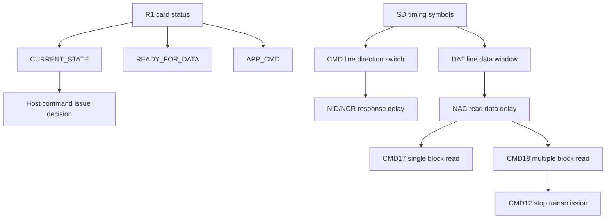

# 任务69：AHB sd host控制器设计8

## 本章知识全景图

这一讲把 SD 协议从“命令和响应字段”推进到“Host 必须按时钟周期等待什么”：卡状态告诉 Host 当前能不能继续发命令，时序图告诉 Host 在 CMD/DAT 两条线上何时换向、何时等响应、何时接收数据、何时用 `CMD12` 停止多块读。

核心概念：`Card Status`、`SD Status`、`CURRENT_STATE`、`READY_FOR_DATA`、`APP_CMD`、`SD Timing`、`S/T/P/E/Z/D/X/CRC`、`NID`、`NCR`、`NAC`、`CMD2`、`ACMD41`、`CMD3`、`CMD17`、`CMD18`、`CMD12`、single block read、multiple block read。

逻辑主线：
1. `Card Status` 是 32-bit 状态/错误信息，直接决定 Host 是否能继续推进事务。
2. SD 时序图里的 `Z/P/S/T/E/D/CRC` 不是符号游戏，而是 CMD/DAT 方向切换和等待窗口的规格。
3. 命令响应之间有 `NID/NCR` 等等待周期；读数据还多一个从命令到数据的 `NAC` 访问延迟。
4. 单块读靠一个数据块自然结束，多块读必须由 `CMD12` 停止，停止命令后数据还会按协议延迟收束。

### 概念地图



### 最短学习路径

1. 先从 `Card Status` 里抓住三类字段：错误、当前状态、是否 ready。
2. 再读懂时序图符号，尤其是 `Z` 高阻/上拉、`P` pull-up、`S/T/E` 帧边界。
3. 最后把 `CMD17/CMD18/CMD12` 串成真实读流程，明确 `NCR` 和 `NAC` 分别等什么。

## 1. `Card Status` 是 Host 的事务交通灯

SD 卡支持两类状态字段：`Card Status` 和 `SD Status`。`Card Status` 是命令响应中的错误和状态信息，`SD Status` 是 512-bit 扩展状态，用于 SD 卡特殊能力和应用相关功能。本讲先抓住 `Card Status`，因为它直接进入 `R1/R1b` 响应，是 Host 每次命令后最常读的状态来源。


视觉核验：
- 教学职责：这张图负责把 `Card Status` 和 `SD Status` 分家，说明本讲主线为什么先围绕 R1 里的 32-bit 状态字展开。
- 看图要点：`Card Status` 绑定“刚执行的命令是否成功、卡处于什么状态”，`SD Status` 是更大的 512-bit 扩展能力/应用状态。
- 漏看后果：控制器会把所有状态都当成软件后查的扩展信息，错过 R1 里能立即阻止下一条命令的错误位和 ready 位。

对 `AHB sd_host` 来说，`Card Status` 不应只是软件可读寄存器的原始 32 bit。控制器至少要自动解析会影响状态机推进的字段，例如当前状态、是否 ready、是否 APP_CMD、是否存在地址/块长/擦除/CRC 类错误。

可以把 `Card Status` 看成 SD Host 的“事务交通灯”：绿灯不是单独一个 bit，而是多个条件同时成立。`CURRENT_STATE=tran` 说明车在可通行车道，`READY_FOR_DATA=1` 说明前方路口未堵，错误位全清说明没有事故，`APP_CMD` 则说明下一条是不是应用命令通道。少看任一类字段，状态机会在错误时继续推进，或者在可推进时误等。

## 2. `CURRENT_STATE` 和 `READY_FOR_DATA` 决定能不能继续

`Card Status` 中最关键的字段之一是 `[12:9] CURRENT_STATE`，它以二进制编码返回卡接收命令时所处的状态。课程画面列出常见编码：`0=idle`、`1=ready`、`2=ident`、`3=stby`、`4=tran`、`5=data`、`6=rcv`、`7=prg`、`8=dis`，后续值保留。另一个关键位是 `READY_FOR_DATA`，用于说明卡是否准备好接收下一次数据相关操作。


视觉核验：
- 教学职责：这张图负责把 `Card Status` 中最影响 FSM 的字段挑出来，尤其是 `CURRENT_STATE`、`READY_FOR_DATA` 和 `APP_CMD`。
- 看图要点：先看 `[12:9] CURRENT_STATE` 编码，再看 `READY_FOR_DATA` 是否允许数据类操作，最后看错误位和 `APP_CMD` 是否改变下一条命令解释方式。
- 漏看后果：Host 会在 `prg` 或 `READY_FOR_DATA=0` 时抢发读写，也可能把 `CMD55` 后的 ACMD 序列误认为已经被卡接受。

关键字段的控制器含义：

| 字段 | 位域 | Host 应如何使用 |
|---|---|---|
| `CURRENT_STATE` | `[12:9]` | 判断卡在 `tran/data/rcv/prg` 等哪个状态，避免非法发命令 |
| `READY_FOR_DATA` | `8` | 判断卡是否准备好下一次数据操作，尤其写后不能抢跑 |
| `APP_CMD` | `5` | 判断 `CMD55` 后卡是否期待下一条 ACMD |
| 错误位 | 多个位 | 置 Host 错误寄存器，必要时中止当前事务 |

最实用的判断口径：
- 读写普通数据前，期待 `CURRENT_STATE = tran` 且 `READY_FOR_DATA = 1`。
- 写后若看到 `prg` 或 `READY_FOR_DATA = 0`，应继续等待或查询状态。
- 发完 `CMD55` 后，若 `APP_CMD` 没有置位，后续 `ACMD6/ACMD13` 不应当作成功序列继续执行。

状态字进入 RTL 时建议拆成三层寄存器：

| 层 | 保存什么 | 立即动作 | 软件可见意义 |
|---|---|---|---|
| 硬错误层 | 地址错、块长错、擦除参数错、CRC/illegal command 等 | 当前事务失败，禁止启动 DAT | 告诉驱动为什么失败 |
| 流控层 | `CURRENT_STATE`、`READY_FOR_DATA`、busy 相关条件 | 决定等待、重试或继续 | 告诉驱动卡是否可继续 |
| 序列层 | `APP_CMD`、AKE/安全序列提示 | 改变下一条命令解释 | 判断 ACMD 或特殊序列是否成立 |

复现检查：发 `CMD13(RCA)` 后解析 R1，若读写前不是 `CURRENT_STATE=tran && READY_FOR_DATA=1 && no_fatal_error`，testbench 应阻止 `CMD17/CMD24` 进入命令发送状态。

## 3. 时序符号说明了 CMD/DAT 线上的“谁在驱动”

进入 `SD Timing` 后，课程先给出时序图符号。它们是后续所有波形图的字母表。


视觉核验：
- 教学职责：这张图负责建立后续所有时序波形的字母表，把每个字母翻译成“谁驱动线、何时计数、何时校验”。
- 看图要点：`S/T/E` 是帧边界，`Z/P` 是方向切换和上拉等待，`D/CRC` 是有效负载和校验窗口，`X/*` 不能被当作有效数据。
- 漏看后果：波形看起来都是高低电平，RTL 却会混淆 output enable、payload shift 和等待计数，最终出现抢线或误采样。

| 符号 | 含义 | Host 控制器要点 |
|---|---|---|
| `S` | start bit，固定 `0` | 帧起点检测 |
| `T` | transmitter bit，Host=`1`，Card=`0` | 判断方向和响应来源 |
| `P` | one-cycle pull-up，值为 `1` | 总线释放/上拉过渡 |
| `E` | end bit，固定 `1` | 帧结束边界 |
| `Z` | 高阻态，被上拉为 `1` | CMD/DAT 方向切换窗口 |
| `D` | data bits | DAT 数据窗口 |
| `X` | don't care data from card | 不应当作有效数据 |
| `CRC` | 7-bit CRC 或数据 CRC | 校验窗口 |
| `*` | repetition | 等待周期重复 |

`Z` 是理解 SD 时序的关键。命令从 Host 发出后，CMD 线需要经过高阻/上拉窗口再由卡驱动响应；如果 Host 没有及时释放 CMD 输出使能，就会和卡响应发生总线争用。

一个实用比喻是“接力棒换手”：`D/CRC` 是正在跑的选手，`E` 是交棒动作结束，`Z/P` 是两个人都不能抢跑的交接区。协议允许外部线因为上拉保持为 1，但 RTL 关心的是 `cmd_oe/dat_oe` 是否释放；电平为 1 不等于本端还可以继续驱动。

## 4. 识别阶段和 RCA 分配阶段用 `NID/NCR` 定义响应延迟

`CMD2` 和 `ACMD41` 等识别/操作条件相关命令后，卡响应不会紧贴 Host 命令结束位立即出现。时序图中先出现两个 `Z` 位用于总线方向切换，再有 `P` 和重复等待，卡响应在 `NID` 个时钟周期后开始。`CMD3(SEND_RELATIVE_ADDR)` 分配 RCA 时，Host 命令与卡响应之间的最小延迟用 `NCR` 表示。


视觉核验：
- 教学职责：这张图负责说明识别阶段的响应延迟不是普通数据传输模式，`NID` 用在卡识别/操作条件这类更早阶段。
- 看图要点：Host command 结束后先有 `Z/P` 方向切换，再进入 `NID cycles`，卡的 CID/OCR 类响应不会紧贴命令 end bit。
- 漏看后果：初始化 FSM 会过早判 response timeout，表现为卡偶发识别失败，尤其在慢卡或仿真模型加入真实延迟时暴露。


视觉核验：
- 教学职责：这张图负责把 `CMD3` 这类普通响应等待归入 `NCR`，并和前一张的 `NID` 区分开。
- 看图要点：看 `NCR cycles` 从 Host command 结束后的方向切换窗口开始，到 Card response start 为止；这是响应等待计数器的主要对象。
- 漏看后果：一个计数器硬套所有初始化和数据命令，会导致 `CMD2/ACMD41/CMD3` 的 timeout 阈值与响应窗口全错。

两类等待不要混：

| 等待名 | 出现场景 | 等待对象 |
|---|---|---|
| `NID` | 识别/操作条件响应，如 `CMD2/ACMD41` | 卡开始返回 CID/OCR 等识别信息 |
| `NCR` | 普通命令响应，如 `CMD3` 和数据传输模式响应 | 卡开始返回 response |

RTL 实现上，命令结束后不能马上判定超时，也不能马上发下一条命令。控制器应启动一个响应等待计数器，允许最小等待窗口，也设置最大超时边界；在窗口内检测 CMD 线 start bit。

`NID/NCR` 的对象都是 CMD 线 response start，但适用阶段不同。工程上可以共用一套等待检测电路，却不能共用一组配置阈值和状态标签：`resp_wait_kind=NID` 用于识别/操作条件，`resp_wait_kind=NCR` 用于 RCA 分配和数据传输模式命令。调试日志也应打印是哪一种等待超时，否则只能看到笼统的 `cmd_timeout`。

## 5. 数据传输模式的命令响应也要等 `NCR`

卡发布 RCA 并进入 data transfer mode 后，大多数有响应的 Host 命令都遵循类似时序：Host command 结束后，CMD 线经历 `Z/Z/P/.../P` 的等待窗口，经过 `NCR` cycles 后卡返回 response。`ACMD41` 和 `CMD2` 是前面识别阶段的例外。


视觉核验：
- 教学职责：这张图负责把进入 data transfer mode 后的普通命令响应流程固定下来：发命令、释放 CMD、等 `NCR`、收 response。
- 看图要点：同时看两个间隔：command end 到 response start，以及 last response 到 next command；后一个间隔决定是否允许连续发命令。
- 漏看后果：仿真里宽松卡模型可能通过，真实卡上会因为下一条命令抢跑而出现偶发无响应或命令索引错位。

控制器必须同时保证两个间隔：
1. Host 命令结束到卡响应开始之间，不能误判响应缺失。
2. 卡响应结束到下一条 Host 命令开始之间，不能零间隔抢发。

后者经常在仿真中被忽略：如果测试模型宽松，连续命令可能通过；真实卡需要总线释放、响应结束和下一条命令启动之间的最小间隔。

可复现检查口径：

```text
cmd_end -> cmd_oe must be 0
wait NCR -> detect response start on cmd_in
receive R1/R6/R7 -> check CRC/index/fields
response_end -> wait minimum next-command interval
next_cmd_start allowed only after interval_done
```

这里的失败信号不只是一种：`response_timeout` 说明卡没在窗口内开始响应；`early_next_cmd` 说明 Host 自己违反了响应后间隔；`response_index_error` 说明窗口错位或命令序列错乱。

## 6. 单块读：`CMD17` 后等待响应，再等待 `NAC` 数据访问时间

单块读的流程不是 `CMD17` 后马上读 DAT。Host 先用 `CMD7` 选卡，并用 `CMD16` 设置合法块长；随后发 `CMD17`，命令参数给出起始地址。卡先在 CMD 线上返回 response，再经过 `NAC` cycles 的访问延迟后，才在 DAT 线上输出读数据块。


视觉核验：
- 教学职责：这张图负责把 `CMD17` 单块读拆成 CMD 链和 DAT 链两段，说明 response 结束不等于数据立即出现。
- 看图要点：先看 `CMD7/CMD16/CMD17` 的命令顺序，再看 `NCR` 在 CMD 线、`NAC` 在 DAT 线；`Read Data` 前的等待不能被采成数据。
- 漏看后果：接收状态机会把 DAT 上的等待/上拉周期当作 payload 起点，导致块首错位、CRC 错、偶发读出全 1 或垃圾数据。

单块读事务拆解：

```text
CMD17(address)
  -> wait NCR on CMD
  -> receive R1 response
  -> wait NAC on DAT
  -> receive data start bit + data payload
  -> receive data CRC
  -> check CRC and end bit
  -> transaction complete
```

`NCR` 和 `NAC` 的区别：
- `NCR` 是命令结束到响应开始的延迟，发生在 CMD 线。
- `NAC` 是读命令后到数据块开始的访问延迟，发生在 DAT 线。

若控制器把 `R1` 响应结束当成读数据立即有效，会把 DAT 线上的 `Z/P/*` 等等待周期误采成数据。

`CMD17` 的可复现状态机可以这样验：

| 阶段 | 输入 | 输出/动作 | 通过标准 |
|---|---|---|---|
| 预检查 | RCA、block length、address、`CURRENT_STATE` | 允许发 `CMD17` | `tran && READY_FOR_DATA` |
| 命令响应 | CMD 线 | 收 R1 | command index/CRC/card status 正确 |
| 数据等待 | DAT 线 | 等 `NAC` 和 data start | `dat_oe=0`，不误采等待周期 |
| 数据接收 | DAT 线 | shift payload + CRC | bit/block counter 准确，CRC 通过 |
| 完成 | CRC/end bit | 更新 done/interrupt | done 只在完整块后置位 |

## 7. 多块读：`CMD18` 连续出块，`CMD12` 才是停止点

多块读中，卡在初始 Host read command 后连续发送数据块。每个块都有自己的数据内容和 CRC，相邻块之间可能存在 `NAC` 访问间隔。数据流由 `CMD12(STOP_TRANSMISSION)` 终止，课程特别强调：数据传输在 stop command 的 end bit 之后两个 clock cycles 才停止。


视觉核验：
- 教学职责：这张图负责说明 `CMD18` 不是“读 N 次 CMD17”，而是一次命令打开连续数据流。
- 看图要点：观察多个 `NAC cycles` 和多个 `Read Data` 的循环，Host 每块都要重新做数据 CRC，但不重新发读命令。
- 漏看后果：控制器会在每块之间错误重发读命令，或把块间等待错当成传输结束。


视觉核验：
- 教学职责：这张图负责给出多块读的真正停止边界：`CMD12` 后数据流还要按协议收束。
- 看图要点：盯住 stop command 的 end bit 和后续两个 clock cycles 的停止延迟，DAT 接收状态机不能在 `CMD12` 发起瞬间关闭。
- 漏看后果：最后一个块的尾部、CRC 或 stop 延迟会被截断，表现为最后一块 CRC 偶发失败或软件块计数和实际数据不一致。

多块读控制器流程：

```text
CMD18(start_address)
  -> wait NCR and receive R1
  -> loop:
       wait NAC
       receive one data block
       receive/check data CRC
       increment block counter
       if target blocks reached: issue CMD12
  -> wait CMD12 response/busy as required
  -> allow data stream to stop after protocol delay
  -> return to transfer-ready path
```

两个容易出错的边界：
- Host 发出 `CMD12` 的同时，DAT 线上可能还有当前块尾部、CRC 或 stop 延迟；数据引擎不能立即关闭。
- 块计数到目标值时，应触发 stop 序列，而不是简单把接收状态机拉回 idle。

`CMD18/CMD12` 适合按“两台机器协同停机”理解：数据接收机负责把当前数据块和 CRC 收完整，命令机负责在目标块数达到后发 stop。两者用 `stop_requested`、`block_complete`、`cmd12_response_done`、`dat_stop_settled` 交握；任何一方单独宣布 done 都不可靠。

## 8. 从时序图到 RTL 状态机

这一讲对应 `sd_host` 中三个计数器和两类方向控制：

| 设计对象 | 用途 | 对应时序 |
|---|---|---|
| CMD bit counter | 发送/接收 48-bit 命令/响应 | `S/T/content/CRC/E` |
| response wait counter | 等待卡响应起始 | `NID/NCR` |
| data wait counter | 等待读数据块起始 | `NAC` |
| CMD output enable | Host 发命令后释放 CMD 线 | `Z/P` 方向切换 |
| DAT output enable | 写时 Host 驱动，读时卡驱动 | `D/CRC/busy` 窗口 |

验证重点不是只看“读到了 512 Byte”，而是看波形边界：
- CMD end bit 后，Host 是否释放 CMD。
- `NCR` 期间是否没有误采响应。
- `NAC` 期间是否没有误采 DAT。
- 数据 CRC 是否按每块校验。
- `CMD12` 后是否等待 stop 响应和数据停止延迟。

PAD 抢线检查要写进读路径 testbench：`wait_response` 时 `cmd_oe=0`，`wait_data/read_data/read_crc` 时 `dat_oe=0`。读路径理论上由卡驱动 DAT；如果 `dat_oe` 仍为 1，即使外部波形看起来稳定，也是在把 Host 输出和卡输出硬顶在一起。
可写断言口径：

```systemverilog
assert property (@(posedge sd_clk) wait_response |-> !cmd_oe);
assert property (@(posedge sd_clk) wait_nac || read_payload || read_crc |-> !dat_oe);
assert property (@(posedge sd_clk) cmd17_r1_done |-> ##[0:$] data_start_seen or nac_timeout);
assert property (@(posedge sd_clk) cmd18_stop_requested |-> block_complete && cmd12_done && dat_stop_settled);
```

这些断言把时序图里的 `Z/NCR/NAC/CMD12` 转成验证条件：该释放的线必须释放，该等待的窗口必须有 timeout，该停止的数据流必须等当前块、stop 响应和收束延迟都完成。

## 9. 复习自测

1. `Card Status` 和 `SD Status` 的区别是什么？  
答案：`Card Status` 是命令响应中的 32-bit 错误和状态信息，直接用于判断当前命令执行结果；`SD Status` 是 512-bit 扩展状态，用于 SD 特殊能力和应用相关功能。

2. `CURRENT_STATE` 和 `READY_FOR_DATA` 分别解决什么问题？  
答案：`CURRENT_STATE` 告诉 Host 卡当前处于 idle/ready/ident/stby/tran/data/rcv/prg/dis 等状态；`READY_FOR_DATA` 告诉 Host 卡是否准备好下一次数据操作。

3. 时序图中的 `Z` 为什么重要？  
答案：`Z` 表示高阻态，通常由上拉保持为 `1`，用于 Host 和 Card 在 CMD/DAT 线上切换驱动方向。没有正确释放总线会造成争用。

4. `NCR` 和 `NAC` 的区别是什么？  
答案：`NCR` 是 Host 命令结束到卡响应开始的等待周期，发生在 CMD 线上；`NAC` 是读命令后到 DAT 数据块开始的访问延迟，发生在数据线上。

5. 多块读为什么必须发 `CMD12`？  
答案：`CMD18` 会让卡连续输出数据块，数据流由 `CMD12(STOP_TRANSMISSION)` 终止。块计数归零只是 Host 触发 stop 的条件，不能替代协议 stop 命令。

6. `CMD12` 发出后数据是否立即停止？  
答案：不会。课程时序图强调数据传输在 stop command 的 end bit 之后两个 clock cycles 才停止，控制器要保留收尾窗口。

7. `CMD17` 单块读的最小可复现事件链是什么？  
答案：确认 `tran && READY_FOR_DATA`；发 `CMD17(address)`；等 `NCR` 并收 R1；检查 command index、CRC7、card status；释放 DAT 输出；等 `NAC`；收 data start、payload、data CRC、end bit；CRC 通过后置 done。

8. `CMD18` 多块读的 stop 条件应由哪些信号共同决定？  
答案：目标块数达到只产生 `stop_requested`；真正完成还要等当前块数据和 CRC 完整、`CMD12` 发出并收到 stop response、stop 后数据线收束延迟结束。缺任一条件都不能回到 idle/done。

9. 如何从波形上区分 `NCR` 超时和 `NAC` 超时？  
答案：`NCR` 超时发生在 CMD 线，现象是命令 end 后未在响应窗口看到卡的 response start；`NAC` 超时发生在 DAT 线，现象是 R1 已收完但未在数据访问窗口看到 data start。错误寄存器应分别上报。

