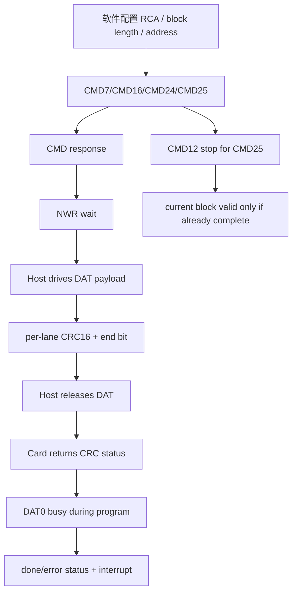

# 任务70：AHB sd host控制器设计9

## 本章知识全景图

这一讲解决一个具体问题：SD Host 写卡时，什么时候发命令、什么时候驱动 DAT、什么时候释放总线等卡反馈。写路径不能用“数据推出去了”判定完成；合格闭环必须依次看到命令响应、`NWR` 等待、数据块与 CRC16、卡返回 CRC status、DAT0 busy 释放。

核心概念：`CMD7`、`CMD16`、`CMD24`、`CMD25`、`CMD12`、`NCR`、`NRC`、`NCC`、`NAC`、`NWR`、`CRC16`、`CRC status`、`DAT0 busy`、`single block write`、`multiple block write`、`CMD/DAT pad direction`、`input/output delay`。

逻辑主线：
1. 波形符号先确定谁在驱动线：`P` 是上拉空闲，`Z` 是释放驱动权。
2. 写命令先走 CMD 链：Host 发 `CMD24/CMD25`，卡回 response。
3. 数据再走 DAT 链：response end 后满足 `NWR`，Host 才能驱动 DAT 发 block 和 CRC16。
4. 写完成还要等卡反馈：CRC status 判定这一块是否被接收，DAT0 busy 判定卡内部 program 是否结束。
5. 多块写的 `CMD12` 是停止边界，不是把未完成数据自动变有效。



最短学习路径：先记 CMD/DAT 的方向切换，再记 `NAC` 与 `NWR` 的区别，最后用 CRC status 和 DAT0 busy 判断写事务是否真正闭环。

## 全视频地图

| 时间段 | 知识块 | 读者要拿走的结论 |
|---|---|---|
| 00:00-10:50 | SD Timing 符号与 N 类等待 | 波形图里的 `P/Z/S/T/CRC` 会直接变成状态机条件和 PAD 方向 |
| 10:50-18:40 | 单块写命令、`CMD7/CMD16/CMD24`、`NWR` | 写数据起点是 response end 后的 `NWR`，不是 command end |
| 18:40-27:40 | CRC16、CRC status、DAT0 busy | Host 发完数据后必须释放 DAT，等卡给出接收判定和 program busy |
| 27:40-38:40 | 多块写和 `CMD12` | stop 到达时未完整结束的 block 可能被判 incomplete |
| 38:40-46:40 | timing 参数汇总 | 最小等待用于防提前驱动，最大等待用于 timeout |
| 46:40-52:14 | Bus timing 与 SD Bus PAD | RTL 先保证逻辑顺序和三态方向，板级延迟交给约束 |

## 1. 波形符号先决定 PAD 方向

SD Timing 图不是协议插图，而是 RTL 控制条件的压缩表。`S` 让接收器同步，`CRC` 决定校验窗口，`P/Z` 决定线由谁驱动。


视觉核验：
- 教学职责：这张图负责把写路径时序里的符号翻译成 RTL 条件，尤其是 `P/Z/S/T/CRC/E` 与 PAD 方向、计数器和校验窗口的关系。
- 看图要点：`P` 是上拉空闲，`Z` 是本端释放驱动权，`S/E` 标出帧边界，`CRC` 指明必须进入校验而不是继续当 payload。
- 漏看后果：状态机可能把外部线为 1 误判为“自己仍可驱动”，从而在 response、CRC status 或 busy 阶段抢线。

| 符号 | 协议含义 | RTL 落点 |
|---|---|---|
| `S` | start bit，通常为 0 | 接收状态机开始计数 |
| `T` | transmission bit | 区分 Host 发命令或卡发响应 |
| `P` | 上拉空闲高电平 | 本端可继续等待，不代表切换驱动权 |
| `Z` | high impedance | 本端释放 PAD，允许另一端接管 |
| `D` | payload data | shift register 的真实负载 |
| `CRC` | CRC7 或 CRC16 | 命令/响应用 CRC7，数据块用 CRC16 |
| `E` | end bit | 帧结束，下一状态才允许推进 |


视觉核验：
- 教学职责：这张图负责说明 CMD 命令发送和 response 接收之间必须换向，`cmd_oe` 不是可一直拉高的普通输出。
- 看图要点：Host command 结束后先释放 CMD，再由 Card 驱动 response start；验证时同时看 `cmd_out/cmd_oe/cmd_in`。
- 漏看后果：卡响应来的时候 Host 仍驱动 CMD，仿真可能出现 `x`，板上则会变成总线争用和偶发命令超时。

CMD 线方向切换的关键是 `Z` 周期。Host 发完 command 后不能继续开着 `cmd_oe` 等 response；正确行为是先释放 CMD，再等卡拉 start bit。仿真里要同时看 `cmd_out`、`cmd_oe`、`cmd_in`，不能只看外部线电平。


视觉核验：
- 教学职责：这张图负责用读路径反衬写路径，避免把 `NAC` 和 `NWR` 都写成“命令后等待若干拍”。
- 看图要点：`NAC` 的终点是 Card 在 DAT 上给出 read data start；写路径的 `NWR` 终点则是 Host 可以开始驱动 write data。
- 漏看后果：共用一个 data_wait 语义会让写路径从错误起点计数，`dat_oe` 可能早于允许窗口拉高。

这张读路径图用来和写路径对照：`NAC` 是 read command 之后等待 DAT data start 的窗口；写路径对应的是 `NWR`，它从 write response end 之后开始。二者都在 DAT 路径上，但方向相反，不能共用同一个“命令超时”概念。

可以把 `NAC/NWR` 看成同一条 DAT 路上的两个相反车道：读时卡出车，Host 只能等；写时 Host 出车，但必须等卡对写命令的 response 结束后再起步。两者都需要 timeout，但 timeout 的起点、终点、驱动者完全不同。

## 2. 单块写从 CMD 链切到 DAT 链

单块写的第一段仍是命令事务：选卡、设置块长、发写命令。`CMD7` 的参数携带 RCA；`CMD16` 设置 block length；`CMD24` 指明写单块地址。


视觉核验：
- 教学职责：这张图负责提醒读者写路径不是只发 `CMD24`，前置的选卡和参数位域必须正确。
- 看图要点：`CMD7` 的 RCA 放在 argument 高 16 bit，`CMD16` 的 block length 和 `CMD24/CMD25` 的 address 都依赖完整 32-bit argument。
- 漏看后果：命令 index 正确也没用；argument 截断或 RCA 错位会让卡不进入 `tran` 或把写地址解释错。

RTL 寄存器不能只保存 command index。`CMD7/CMD16/CMD24/CMD25` 都依赖 32-bit argument：RCA、块长、地址都在这里。若寄存器设计把 argument 截短，状态机再正确也只能发出错误命令。


视觉核验：
- 教学职责：这张图负责给出 `CMD24` 单块写的完整闭环，从命令响应到数据发送、CRC status、DAT0 busy。
- 看图要点：按顺序看 `CMD24 -> response -> NWR -> write data/CRC16 -> CRC status -> busy`，不要把 response 当成写完成。
- 漏看后果：软件会在数据还未被卡接受或内部 program 尚未结束时发下一事务，造成写丢失、顺序错乱或卡长忙。

单块写最小事件链：
1. Host 发 `CMD24`。
2. 卡在 CMD 线上返回 response。
3. response end 后进入 `NWR`。
4. `NWR` 满足后，Host 打开 DAT 输出使能。
5. Host 发送 start、payload、CRC16、end。
6. Host 释放 DAT，等待卡返回 CRC status。
7. 若卡拉低 DAT0，Host 等 program busy 结束。


视觉核验：
- 教学职责：这张图负责固定 `NWR` 的计数起点和终点，防止 Host 提前打开 DAT 输出。
- 看图要点：竖向标出 `response_end`、`NWR` 等待区和 `write data` 起点；`data_oe` 只能在 `nwr_done` 后上升。
- 漏看后果：Host 会在卡尚未准备接收写数据时抢跑，后续可能表现为 CRC status reject 或完全收不到 status。

`NWR` 的边界经常写错。它不是 command end 到 data start，也不是 response start 到 data start，而是 response end 到 write data start。验证时至少标三根竖线：`response_end`、`nwr_done`、`data_oe_rise`；如果 `data_oe_rise` 早于 `nwr_done`，就是 Host 抢跑。

`CMD24` 的 response 建议仍按 R1 处理：校验 command index、CRC7 和 `card_status`，确认没有 address/block length/illegal command 等错误，再进入 `NWR`。R1 通过只说明卡接受了“准备写这个块”的命令；它不证明后面的 payload、CRC16 和 program 已成功。

## 3. 四线模式下 CRC16 是每根 DAT 线各算一条

四线 SD 不是把 32-bit word 当成一个整体串出去，而是 DAT0-3 并行承载不同 bit lane；每根 lane 后面都有自己的 CRC16。


视觉核验：
- 教学职责：这张图负责说明四线模式的 CRC16 是 per-lane 规则，不是对 FIFO word 做一个整体校验。
- 看图要点：分别看 DAT0、DAT1、DAT2、DAT3 的 payload 串行顺序和各自后缀 CRC16；CRC 的输入顺序必须跟 lane 对齐。
- 漏看后果：四线交织顺序错、bit lane 反接或移位错误可能被一个整体 CRC 掩盖，真实卡会返回 CRC status error。

这条规则直接影响 data send shift register。实现可以用四个 CRC16 计算器，也可以用等效多路结构，但输入序列必须按 lane 对齐。只对 FIFO word 做一个整体 CRC，无法证明 DAT0、DAT1、DAT2、DAT3 的串行顺序正确。

实现时把 CRC16 看成每根 DAT 线的“随车封条”：DAT0 的封条只证明 DAT0 这一路的 bit 序列，不能替 DAT1-DAT3 背书。验证应注入单 lane bit 翻转，确认只有对应 lane 的 CRC/status 路径报错，而不是所有 lane 混成一个模糊错误。

## 4. CRC status 和 DAT0 busy 是写完成的两个不同反馈

写路径有两个反馈，含义不能合并：CRC status 回答“卡是否接受当前 block”，DAT0 busy 回答“卡是否还在内部 program”。


视觉核验：
- 教学职责：这张图负责强调写数据后必须等卡返回 CRC status，不能以 Host 发完 CRC16 作为成功。
- 看图要点：Host 发完 data 和 CRC16 后要释放 DAT，由 Card 返回 status token；状态寄存器至少区分“收到 status”和“status accepted”。
- 漏看后果：没有收到 status、收到 CRC reject、收到 write error 都可能被误报成 done，驱动层会认为数据已经落卡。

CRC status 出现在 Host 发送 data 和 CRC16 之后。此时 Host 必须释放 DAT，让卡在 DAT 线上返回编码。状态寄存器应拆成至少两层：`crc_status_received` 表示卡给了结论，`crc_status_ok` 表示结论为通过。没有收到 status 和收到错误 status 都不能报写成功。

常见 CRC status 判定口径：`010` 表示 data accepted，`101` 表示 rejected due to CRC error，`110` 表示 rejected due to write error。实现不应只做“有 token 就成功”，而要把接收超时、CRC reject、write reject 分开上报。


视觉核验：
- 教学职责：这张图负责把 CRC status 和 DAT0 busy 分成两个先后反馈：一个判定 block 是否接收，一个判定内部 program 是否结束。
- 看图要点：先看 status token，再看 DAT0 被卡拉低的 busy 区间；busy 期间 Host 不应启动会破坏顺序的下一次写。
- 漏看后果：把 busy 当成 CRC status，或把 CRC status OK 当成 program done，都会造成下一块写入提前开始。

DAT0 busy 出现在 CRC status 之后。卡拉低 DAT0 表示内部写入尚未完成，Host 不应启动下一次会破坏顺序的写事务。工程上要把 `crc_status_error` 与 `card_busy` 分开上报：前者是数据块被拒收，后者是卡还没空。

写完成判定要用两级门闩：第一道门是 `crc_status_ok`，证明这一块被卡接收；第二道门是 `!dat0_busy`，证明卡内部 program 窗口释放。只有两道门都打开，`write_done` 才能置位。

## 5. 多块写的停止边界必须保守

`CMD25` 多块写用 `CMD12` 停止，但 stop 不是“自动补完当前 block”。stop 生效时，如果当前 block 的 payload、CRC 或 end bit 尚未完整结束，卡可以把这一块视为 incomplete。


视觉核验：
- 教学职责：这张图负责说明多块写停止是命令层动作，但当前数据块是否有效由数据层完整性决定。
- 看图要点：看 `CMD25` 打开连续写流，`CMD12` 只负责 stop；当前 block 的 payload、CRC16、end bit 是否已完整要单独判断。
- 漏看后果：Host 可能把 stop 前未完整发送的 block 计入成功块数，文件系统层会出现最后一块损坏。


视觉核验：
- 教学职责：这张图负责给出 stop 过早的失败样例：没有完整结束的 block 会被卡判 incomplete。
- 看图要点：观察 stop 到达时 block 的 payload/CRC/end 是否已经闭合；未闭合的块不能进入 success counter。
- 漏看后果：testbench 只看 `cmd12_start` 会漏掉 incomplete block，RTL 上线后表现为多块写偶发少写或尾块坏。

推荐实现不要追求极限 stop 点。更稳的 RTL/驱动策略是：当前 block 完整发送、CRC status 返回、必要 busy 处理结束，再发 `CMD12`。这样牺牲少量周期，换来清晰的状态边界和可验证性。

多块写还要避免一个错误假设：不是每个 block 后都会立刻出现 DAT0 busy。卡可能先缓存若干 block，再统一 program；状态机不能把“没 busy”解释成“所有后续写都可无条件推进”。

## 6. N 类 timing 同时服务 timeout 和防抢跑

`NCR/NRC/NCC/NAC/NWR` 的共同点是等待，差异在起点、终点和路径。前端写 RTL 时，最小等待用于防止 Host 提前发，最大等待用于 timeout。


视觉核验：
- 教学职责：这张图负责把所有 N 类等待参数统一放进“起点、终点、用途”框架，避免用一个 timeout 覆盖全部场景。
- 看图要点：`NCR/NRC/NCC` 主要服务 CMD 链，`NAC/NWR` 服务 DAT 链；`NAC` 是卡开始读数据，`NWR` 是 Host 可以写数据。
- 漏看后果：等待计数器复用错误会同时造成命令抢发、读数据误采、写数据抢跑和 timeout 上报不清。

| 参数 | 起点到终点 | 控制器职责 |
|---|---|---|
| `NCR` | command end 到 response start | command response timeout |
| `NRC` | response end 到下一条 command | 下一条命令前的最小间隔 |
| `NCC` | 无响应 command 到下一条 command | 无 response 命令之间的最小间隔 |
| `NAC` | read command 到 data start | data receive timeout |
| `NWR` | write response end 到 Host data start | 写数据前防抢跑 |


视觉核验：
- 教学职责：这张图负责把 bus timing/IO delay 与协议状态机分层，防止用 STA 约束掩盖 RTL 方向错误。
- 看图要点：`set_input_delay/set_output_delay` 约束边沿采样和输出到达，不能决定 `cmd_oe/dat_oe` 何时释放。
- 漏看后果：约束再正确，也只会把错误驱动关系稳定实现出来；等 response 时仍驱动 CMD、等 CRC status 时仍驱动 DAT 都不会被约束自动修好。

Bus timing 图属于板级和 STA 视角。`set_input_delay`、`set_output_delay` 可以约束 IO 边沿，但不能修复错误状态机。如果 RTL 在等 response 时仍驱动 CMD，或者在等 CRC status 时仍驱动 DAT，后端约束只会把错误稳定化。

## 7. SD Bus PAD 拆分是避免抢线的底线

CMD/DAT 是双向线，RTL 内部应拆成输入、输出、输出使能，而不是在各个子模块里传 `inout`。


视觉核验：
- 教学职责：这张图负责把双向 PAD 拆成 `in/out/oe` 三类信号，是避免 CMD/DAT 抢线的实现底线。
- 看图要点：内部模块只看 `cmd_in/dat_in`、产生 `cmd_out/dat_out` 和 `cmd_oe/dat_oe`；真正的 `inout` 只留在顶层 PAD 包装。
- 漏看后果：多个模块直接驱动 `inout`，response、read、CRC status、DAT0 busy 阶段会出现隐蔽争用，仿真和板级行为都难定位。

典型写法：

```verilog
assign sd_cmd_pad = cmd_oe ? cmd_out : 1'bz;
assign cmd_in     = sd_cmd_pad;
```

DAT 线同理，只是四线模式要扩展为 4 bit。写数据阶段 Host 打开 `dat_oe`；读数据、CRC status、DAT0 busy 阶段 Host 必须释放。最危险的 bug 是状态机以为自己在等卡，PAD 上却仍开着 output enable。

写路径图最终要收束成一张事务检查单。检查顺序不能从“数据有没有发完”开始，而要从“谁有权驱动哪条线”开始：CMD 线先由 Host 驱动命令，再释放给卡回 response；DAT 线只在 payload/CRC16 阶段由 Host 驱动，CRC status 和 busy 阶段必须释放给卡。这个顺序像单车道会车：不是看路面有没有车，而是看当前通行权属于谁。
PAD output enable 检查清单：

| 阶段 | `cmd_oe` | `dat_oe` | 失败信号 |
|---|---:|---:|---|
| Host 发 command | 1 | 0 | command bit 数未满或 CRC7 错 |
| 等 response/R1/R1b | 0 | 0 | `cmd_oe` 未关导致 CMD 抢线 |
| 单块/多块读数据 | 0 | 0 | `dat_oe` 未关导致 DAT 抢线 |
| 写 payload/CRC16 | 0 | 1 | `dat_oe` 未开导致卡收不到数据 |
| 等 CRC status | 0 | 0 | `dat_oe` 未关导致 status 回不来 |
| DAT0 busy | 0 | 0 | Host 误驱动 DAT0，busy 判断失真 |

## RTL 落点与验证检查点

| 检查点 | 应观察的信号 | 通过标准 |
|---|---|---|
| `CMD24/CMD25` 发送 | `cmd_state/cmd_oe/cmd_out` | 48 bit 发完后释放 CMD |
| response 等待 | `cmd_in/response_valid/response_timeout` | 需要响应的命令在 `NCR` 内收到 start，超时置错 |
| `NWR` | `response_end/nwr_cnt/data_oe` | `data_oe` 只能在 `NWR` 满足后拉高 |
| block payload | `fifo_rd_en/dat_out/bit_cnt` | FIFO 读数与 DAT 输出 bit 数一致 |
| CRC status | `dat_oe/dat_in/crc_status_ok` | Host 释放 DAT 后接收卡返回 status |
| busy | `dat0_in/card_busy/done` | DAT0 低时不启动下一次写完成动作 |
| stop | `cmd12_start/block_complete` | `CMD12` 不应让未完成 block 被当成成功 |

更完整的事务级检查可以再加四条：

```systemverilog
assert property (@(posedge sd_clk) cmd24_resp_ok |-> ##[0:$] nwr_done);
assert property (@(posedge sd_clk) write_done |-> crc_status_ok && !card_busy);
assert property (@(posedge sd_clk) cmd12_start |-> block_payload_done && block_crc_done && block_end_done);
assert property (@(posedge sd_clk) wait_card_drive |-> !cmd_oe && !dat_oe);
```

它们的共同目标是防“假完成”：response 通过不是写完成，CRC status OK 不是 busy 释放，`CMD12` 发出不是当前块有效，外部线为 1 也不是 Host 可以继续驱动。

可写断言口径：

```systemverilog
assert property (@(posedge sd_clk) wait_response    |-> !cmd_oe);
assert property (@(posedge sd_clk) wait_crc_status  |-> !dat_oe);
assert property (@(posedge sd_clk) data_oe_rise     |-> nwr_done);
assert property (@(posedge sd_clk) card_busy        |-> !start_next_write);
```

## 工程练习

1. 写出 `CMD24` 单块写完成的最小事件链。

   答案：`CMD24` 发出；response 有效；`NWR` 满足；Host 发完整 data + 每 lane CRC16 + end；Host 释放 DAT；卡返回 CRC status 且 ok；DAT0 busy 结束；状态寄存器 done 置位，必要时 interrupt 拉起。

2. `NAC` 与 `NWR` 的区别是什么？

   答案：`NAC` 是读命令后等待卡开始在 DAT 上返回数据；`NWR` 是写命令 response 结束后等待 Host 可以开始驱动 DAT 写数据。二者都在 DAT 路径，但方向相反。

3. 为什么多块写建议当前 block 完整结束后再发 `CMD12`？

   答案：因为 stop 生效时未完整结束的 block 可能被卡判 incomplete。完整结束后再 stop，状态边界清楚，也便于验证。

4. 如何检测 PAD 抢线？

   答案：在 response、read data、CRC status、DAT0 busy 等卡驱动阶段检查 `cmd_oe/dat_oe` 必须为 0；仿真若出现 `x` 或 pad 电平与驱动方向矛盾，应优先查 output enable。

5. CRC status 的 `010/101/110` 分别如何处理？

   答案：`010` 可进入后续 DAT0 busy 等待或完成路径；`101` 表示数据因 CRC 被拒收，应置 `crc_status_error` 并中止本块；`110` 表示 write error，应置写错误并让软件决定重试或复位路径。三者不能只归成“收到 status”。

6. 多块写里什么时候允许发 `CMD12`？

   答案：保守实现应在当前 block 的 payload、每 lane CRC16、end bit 完整发送，并且已完成该块的 CRC status/必要 busy 处理后发 `CMD12`。如果为了性能提前 stop，也必须证明当前 block 不会被计入成功块数。

## 常见误区和失败信号

| 误区 | 后果 | 检查方法 |
|---|---|---|
| response 到达就报写完成 | 软件提前发下一事务 | 继续检查 CRC status 与 DAT0 busy |
| `NWR` 从 command end 开始算 | Host 提前驱动 DAT | 标出 `response_end/nwr_done/data_oe` |
| 四线只算一个 CRC16 | lane 顺序错误仍可能漏检 | 每根 DAT lane 独立校验 |
| 等 CRC status 时不释放 DAT | 卡无法返回 status，总线争用 | `wait_crc_status -> !dat_oe` |
| `CMD12` 到来就认为当前 block 成功 | incomplete block 被误计 | stop 前检查 payload/CRC/end 是否完整 |

## 复习与自测

1. `P` 和 `Z` 为什么不能都当高电平？

   答案：`P` 是上拉空闲，`Z` 是本端释放驱动权。外部电平可能都高，但 RTL 的 output enable 含义不同。

2. CRC status 与 DAT0 busy 谁先谁后？

   答案：Host 发完 data 和 CRC 后先接收 CRC status；之后卡可能拉低 DAT0 表示内部 program busy。

3. `CMD7` 为什么要求 argument 保持 32 bit？

   答案：RCA 在 argument 高 16 bit；块长、地址等也依赖完整 argument。只保存 command index 无法发出正确命令。

4. 一个合格 testbench 至少要对写路径注入哪些异常？

   答案：response timeout、`NWR` 不满足时抢跑、CRC status error、DAT0 busy 延长、多块写 stop 落在 block incomplete 边界。

5. `CRC status OK` 是否等于写事务完成？

   答案：不等于。CRC status OK 只说明当前 block 被卡接受；若随后 DAT0 busy 拉低，说明卡仍在内部 program。写事务完成必须等 busy 释放，状态机才能置 done 或允许下一次破坏顺序的写操作。

6. 写路径中哪些阶段必须释放 DAT output enable？

   答案：读数据阶段、等待 CRC status 阶段、DAT0 busy 阶段都必须 `dat_oe=0`；写 payload 和 CRC16 阶段才由 Host 打开 `dat_oe`。判断口径是“谁应驱动 DAT”，不是外部线当前是不是高电平。

