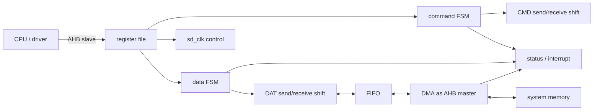

# 任务71：AHB sd host控制器设计10

## 本章知识全景图

这一讲把 SD Host 从“会发 SD 命令的模块”提升成 SoC 外设微架构：CPU 通过 AHB slave 配置寄存器，硬件用 command/data FSM 执行协议，FIFO 把串行 DAT 与 32-bit AHB 数据宽度解耦，DMA 作为 AHB master 搬运系统内存，状态寄存器和中断把结果交还软件。

核心概念：`AHB slave`、`AHB master DMA`、`register list`、`status/interrupt`、`FIFO`、`single/INCR`、`ping-pong FIFO`、`clock stop`、`sd_clk`、`command FSM`、`data FSM`、`send/receive shift register`。

逻辑主线：
1. feature list 不是宣传页，而是微架构需求清单。
2. 软件只做配置和决策，硬件负责 SD 时序、DMA 搬运、状态上报。
3. 架构要分三条路径：控制路径、数据路径、状态路径。
4. FIFO/停钟是流控策略：当前设计用“FIFO 满后停外部 SD clock”等 DMA，而不是用双 FIFO 无缝吞吐。



最短学习路径：先把 SD Host 看成 CPU、SD 卡、系统内存之间的桥；再按“控制、数据、状态”三条路径拆架构；最后用 FIFO 和停钟理解吞吐、面积、复杂度的取舍。

## 全视频地图

| 时间段 | 知识块 | 本讲要抓住的工程问题 |
|---|---|---|
| 00:00-07:40 | 功能列表 | 从 AHB、SD 2.0、DMA、块读写、时钟、中断反推模块边界 |
| 07:40-11:50 | 软硬件划分 | 软件写寄存器，硬件执行时序并反馈状态 |
| 11:50-18:50 | 顶层架构 | AHB slave、FIFO、DMA、CMD/DAT 模块如何连接 |
| 18:50-23:30 | FIFO 与 DMA | 32-bit AHB 和 SD 串行位流如何解耦 |
| 23:30-34:40 | 停钟与 `sd_clk` | FIFO 满时停卡侧 clock，但内部/DMA 仍要能运行 |
| 34:40-43:24 | command FSM 接口 | ready、response 类型、timeout、状态输出如何进入可实现状态图 |

## 1. Feature list 是微架构需求清单

SD Host 的功能列表决定模块边界。每一条需求都必须落成寄存器、状态机、FIFO、DMA 或中断中的一个可实现部件。


| 功能需求 | RTL 部件 | 验证重点 |
|---|---|---|
| AHB slave 配置接口 | register file / AHB slave wrapper | 地址、读写、ready、非法访问 |
| SD 2.0 命令和数据操作 | command FSM、data FSM、shift register | 时序、CRC、方向、timeout |
| DMA 搬运 | AHB master DMA、FIFO | single/INCR、grant 延迟、error response |
| 块读写和多块传输 | block counter、FIFO flow control | block 数、结束条件、提前停止 |
| clock control | `sd_clk` divider / stop mux | 分频、停钟、DFT |
| status/interrupt | status register、mask、irq | done/error 是否软件可见 |


课程明确说内置 DMA 支持 32-bit word、single 和 INCR，不支持 WRAP。这个限制要写进验证计划：DMA 地址生成覆盖线性递增即可，不应把 WRAP 当成本设计必须通过的功能；但 AHB slave 侧仍要能识别合法总线控制并给出合理响应。


中断只说明“有事件发生”，状态寄存器才说明发生了什么。一个可调试的 SD Host 至少要把 command done、response timeout、data done、read timeout、CRC error、DMA done/error 分开上报。只有一根 `irq` 而没有可读 status，软件无法恢复错误。

## 2. 软件负责配置，硬件负责精确定时

软件适合做慢速决策：选择命令、写 argument、设置块数、设置 DMA 地址、启动事务。硬件适合做精确定时：按 SD clock 发 bit、等 start、算 CRC、搬 FIFO、报状态。


一次典型事务：
1. 软件写 clock divider、block size、block count、DMA address。
2. 软件写 command index、argument、response 类型和 data direction。
3. 软件置 enable/ready。
4. command FSM 发送 CMD 并等待 response。
5. data FSM 与 shift register 收发 DAT。
6. FIFO 满/空触发 DMA 搬运。
7. 硬件写 status 并拉 interrupt。
8. 软件读 status，清中断，决定重试或下一步。

这个边界不要写反。若让软件轮询每一个 DAT bit，时序不可控；若让硬件决定文件系统层面的重试策略，设计复杂度会失控。

把这条链写成 RTL 视角，就是：

```text
AHB slave 写寄存器
  -> register file 锁存 command / argument / block / DMA 参数
  -> command_ready 触发 command FSM
  -> data_present 与 direction 触发 data FSM
  -> FIFO 在 SD bit 流和 32-bit AHB word 之间排队
  -> DMA master 用 AHB burst 把 FIFO 与 system memory 接起来
  -> status/irq 把 end、timeout、CRC、DMA finish 回送给软件
```

这像一条带检票、候车、月台、货运和广播的车站流水线：CPU 只负责把车票和目的地写进窗口，command/data FSM 负责按铁路时刻表放行，FIFO 是站台缓冲区，DMA 是货运车，status/irq 是广播牌。这个比喻的边界也要清楚：车站可以暂时拦住进站列车，但不能把站内清客和货运车也一并断电。

## 3. 控制路径、数据路径、状态路径必须分开看

架构图的价值不是记框图，而是把三条路径分开：控制路径发起事务，数据路径搬 payload，状态路径把结果送回软件。


| 路径 | 主要模块 | 作用 |
|---|---|---|
| 控制路径 | AHB slave、register file、command FSM、data FSM、`sd_clk` | 接收配置，产生 SD 协议动作 |
| 数据路径 | data shift register、FIFO、DMA master | 串并转换，跨宽度/时钟搬运 |
| 状态路径 | status register、interrupt logic | 报告 done、timeout、CRC、DMA error |

课程把 FSM 说成“大脑”，shift register 是“执行单元”。工程化表达是：FSM 只决定状态、使能、方向和计数边界；shift register 根据这些控制信号实际拼帧、移位、采样和 CRC。

三条路径的边界要在波形里同时盯住：

| 路径 | 入口 | 出口 | 关键握手 | 失败信号 |
|---|---|---|---|---|
| 控制路径 | AHB slave 写配置 | FSM start / ready | `HSEL/HREADY/HTRANS`、`command_ready`、`data_ready` | ready 丢失、非法配置无状态 |
| 数据路径 | DAT/CMD shift 或 DMA request | FIFO word / AHB transfer | `fifo_wr_en/fifo_rd_en`、`HBUSREQ/HGRANT/HREADY` | FIFO overflow/underflow、DMA error |
| 状态路径 | FSM/DMA/CRC 事件 | status bit / irq | status latch、mask、clear | 事件只打一拍、软件读不到 |

如果只看控制路径，容易误以为命令发出就是事务完成；只看数据路径，容易忘记软件还需要错误原因；只看状态路径，又会把一个 `irq` 当成黑盒结果。合格的 SD Host 调试必须三条路径交叉对表。


读卡时，SD 串行 bit 进入 receive shift，拼成 word 写 FIFO，DMA 再把 FIFO 数据写入系统内存。写卡时方向相反：DMA 从内存读 word 写 FIFO，send shift 从 FIFO 取 word 串行化到 DAT。FIFO 是串行 SD 总线和 32-bit AHB 总线之间的缓冲边界。

## 4. FIFO 流控解释了为什么要停外部 SD clock

当前课程设计不做乒乓 FIFO，所以当读路径 FIFO 满时，不能继续让 SD 卡吐数据；否则 receive shift 无处写入，数据会丢。


读路径流控闭环：
1. data receive 收满一个 block。
2. FIFO 达到满或接近满阈值。
3. clock control 拉 `stop clock`，让卡侧 SD clock 停止。
4. DMA 在 HCLK/AHB 域搬走 FIFO 数据。
5. FIFO 腾出空间后恢复外部 SD clock。

这套单 FIFO 方案的关键是“站外拦车，站内继续清客”。`stop_clk` 拦的是卡继续按 `out_sd_clk` 送新 bit，不是冻结 FIFO 和 DMA 的内部搬运。如果 stop 以后 FIFO/DMA 也不动，系统就像月台满员后把检票口、站台工作人员和疏散通道一起锁死，最终只能死锁。


乒乓 FIFO 可以让 SD 侧写 FIFO0 时 DMA 搬 FIFO1，吞吐更好，但面积、控制和验证复杂度更高。课程设计选择单 FIFO + 停钟，说明它优先降低实现复杂度，而不是追求最高连续带宽。


停钟的对象是卡侧输出 `out_sd_clk`，不是把 FIFO、DMA、AHB 或整个模块的内部时钟全关掉。如果停掉内部 FIFO/DMA 工作时钟，FIFO 满后 DMA 也无法搬走数据，流控会死锁。


实现上常把 `out_sd_clk` mux 到稳定低电平。验证不能只看 divider 分频是否正确，还要覆盖 `stop_clk=1`：外部 clock 稳定停止，内部搬运仍可继续，恢复后 SD 侧不丢 bit 边界。

## 5. `sd_clk` 接口来自分频、停钟和 DFT 三个需求

`sd_clk` 模块不是单纯除频器。它要支持配置分频、读路径停钟、输出给 FIFO 的时钟选择，以及测试模式绕过。


这张图要看 stop 对象：`stop clock` 应影响对卡输出的 `out_sd_clk`，不应冻结 FIFO/DMA 的内部搬运时钟。它和前面的停钟流控图合起来读，才能判断设计是在做“反压”，不是在做“全局暂停”。

| 信号 | 作用 |
|---|---|
| `hclk` | AHB/系统侧时钟来源 |
| `in_clk_divider` | 软件配置的分频系数 |
| `in_sd_clk_enable` | 功能 enable |
| `in_stop_clk` / `hw_stop_clk` | FIFO 流控触发的停卡侧 clock |
| `out_sd_clk` | 输出到 SD card 的 clock |
| `out_fifo_clk` 或内部时钟 | FIFO/内部逻辑需要的工作时钟 |
| `in_TestMode` | DFT/测试模式选择 |

判断 `sd_clk` 写得是否合格，不只看频率，还要看模式切换：disable、stop、test、normal 四类条件都要有确定输出。

## 6. command FSM 接口把架构推进到可写 RTL

command FSM 的接口回答五个问题：命令是否准备好、能否发送、是否需要响应、响应多长、等不到怎么办。


最小状态链：

```text
STATE_STOP
  -> command_ready
STATE_WAIT_SEND
  -> DAT0 not busy
STATE_SEND
  -> 48 command bits sent
STATE_WAIT_RECEIVE
  -> response start or timeout
STATE_RECEIVE
  -> response bits complete, CRC checked
```

`command_ready` 不应直接等同“马上发”。若 DAT0 busy，状态机要先保存 ready，再等卡释放；否则 ready 作为脉冲可能被丢掉。这个设计点在任务72会展开。

## RTL 落点与验证检查点

| 检查点 | 通过标准 |
|---|---|
| 寄存器合同 | 软件写入 command、argument、block、DMA 地址后，FSM/DMA 读到同一语义 |
| status/interrupt | 每类 done/error 都有状态位，mask enable 后 irq 行为可预测 |
| DMA 能力 | single 和 INCR 通过；WRAP 不作为本设计必需能力 |
| FIFO 读路径 | SD receive 写 FIFO，DMA 能在 HCLK 域搬走 |
| 停钟流控 | FIFO 满时外部 SD clock 停，内部 FIFO/DMA 不死锁 |
| command FSM | ready、busy、send、wait response、timeout、receive 都可在波形中定位 |

## 工程练习

1. 为什么 SD Host 需要同时有 AHB slave 和 AHB master DMA？

   答案：AHB slave 让 CPU 配置寄存器和读状态；AHB master DMA 让控制器主动访问系统内存搬数据。没有 slave，软件无法控制；没有 master，数据搬运只能靠 CPU 或外部 DMA。

2. 当前设计为什么可以不做乒乓 FIFO？

   答案：它选择在 FIFO 满时停外部 SD clock，等待 DMA 搬走数据。这降低面积和控制复杂度，但牺牲连续吞吐。

3. 停钟为什么不能停掉内部 FIFO/DMA 时钟？

   答案：停钟的目的正是给 DMA 时间清空 FIFO。如果把内部 FIFO/DMA 时钟也停了，FIFO 永远不能腾出空间，系统死锁。

4. 中断和状态寄存器的关系是什么？

   答案：中断通知 CPU 有事件；状态寄存器说明事件类型和结果。软件必须读 status 后才能判断 done、timeout、CRC error 或 DMA error。

## 常见误区和失败信号

| 误区 | 后果 | 检查方法 |
|---|---|---|
| 把 feature list 当描述文字 | 架构缺寄存器或状态位 | 每条 feature 是否落到模块/寄存器/验证点 |
| DMA 只做数据口，不暴露状态 | 软件不知道搬运失败 | DMA done/error 是否进入 status |
| FIFO 满后继续给卡 clock | receive 数据丢失 | FIFO full 时 `out_sd_clk` 是否停止 |
| stop clock 停掉整个模块 | DMA 无法清 FIFO | 停钟时 HCLK/DMA/FIFO 内部逻辑是否仍运行 |
| command FSM 直接拼所有 bit | 控制和执行混在一起 | FSM 与 shift register 是否职责分离 |

## 复习与自测

1. SD Host 的三条路径分别是什么？

   答案：控制路径是 AHB slave/register/FSM/clock；数据路径是 shift/FIFO/DMA；状态路径是 status/interrupt。

2. 为什么 DMA 只支持 single/INCR 是合理取舍？

   答案：SD block 数据天然线性搬运，WRAP 对这个控制器收益小，却增加地址生成和验证复杂度。

3. 读路径 FIFO 满时，正确流控顺序是什么？

   答案：data receive 检测 FIFO 满或 block end；停卡侧 SD clock；DMA 搬走 FIFO；空间恢复后恢复 SD clock。

4. `command_ready` 为什么不能只作为组合条件？

   答案：如果 ready 是脉冲，而卡 busy 阻止发送，组合条件会错过命令。状态机要进入等待发送状态，把命令待发送事实保存住。

