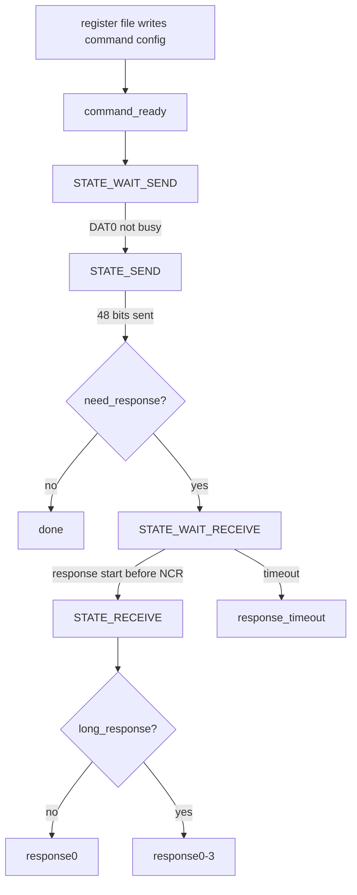

# 任务72：AHB sd host控制器设计11

## 本章知识全景图

这一讲把 SD Host 架构收窄到 `sd_clk` 和 `sd_cmd_fsm`。真正要学的是接口反推能力：从“分频、停钟、测试、发命令、等响应、收长响应、报 timeout”这些需求，推导出模块端口、状态转移、计数器和 shift register 分工。

核心概念：`sd_clk`、`divider`、`stop clock`、`TestMode`、`command_ready`、`DAT0 busy`、`need_response`、`long_response`、`STATE_STOP`、`STATE_WAIT_SEND`、`STATE_SEND`、`STATE_WAIT_RECEIVE`、`STATE_RECEIVE`、`send shift register`、`receive shift register`、`response_timeout`、`response0-3`。

逻辑主线：
1. `sd_clk` 先解决时钟：分频、停卡侧 clock、DFT mux 不能混成一个简单除频器。
2. command FSM 解决控制：保存 ready，等 DAT0 不忙，发 48 bit，按响应类型等待。
3. send shift register 解决输出：拼帧、CRC7、边沿选择、CMD 方向。
4. receive shift register 解决输入：采样响应、CRC 检查、把普通/长响应写进 response 寄存器。



最短学习路径：先看 `sd_clk` 的 mux 边界，再用 command FSM 状态表记住 ready/busy/timeout，最后把 bit 级工作交给 send/receive shift。

## 全视频地图

| 时间段 | 知识块 | 本讲要抓住的工程问题 |
|---|---|---|
| 00:00-07:20 | `sd_clk` 接口和结构 | 分频、停钟、DFT 如何同时存在 |
| 07:20-15:50 | `sd_cmd_fsm` 端口 | 从命令配置、response 类型、DAT0 busy 反推输入输出 |
| 15:50-27:40 | command FSM 状态图 | ready 不能丢，等响应要 timeout |
| 27:40-35:20 | send shift register | 48-bit command frame、CRC7、CMD 输出方向 |
| 35:20-42:26 | receive shift register | response 位宽、CRC error、response0-3 保存 |

## 1. `sd_clk` 不是简单分频器

`sd_clk` 同时服务功能时钟和系统测试。分频只解决速度；停钟解决读路径流控；DFT mux 解决测试模式可控性。


端口反推：
- `hclk`：系统侧原始时钟。
- `in_clk_divider`：软件配置 SD clock 频率。
- `in_sd_clk_enable`：功能 enable。
- `in_stop_clk` / `hw_stop_clk`：FIFO 满或流控触发停外部 clock。
- `out_sd_clk_dft` / `in_TestMode`：测试模式绕过功能控制。


结构顺序可以理解为：`hclk -> divider -> clock select -> stop mux -> card output`，旁边再接 DFT/test mux。停钟的对象是输出给卡的 `sd_clk`，不是 command FSM、FIFO 或 AHB 域全部停止。

## 2. command FSM 接口来自五个问题

`sd_cmd_fsm` 的端口不是随便列的。它至少要回答：命令是否准备好、卡是否忙、是否需要响应、响应是否长、等不到响应怎么办。


| 问题 | 典型信号 | 作用 |
|---|---|---|
| 配置是否有效 | `in_command_ready` | 启动一条命令事务 |
| 卡是否可接受新命令 | `in_sd_dat[0]` | DAT0 为 0 时常表示 busy，不能发 |
| 是否等 response | `in_need_response` | 决定 send 后是否进 wait receive |
| 是否长 response | `in_long_response` | 决定接收 48-bit 还是 136-bit 类响应 |
| 是否 timeout | `response_timeout` | 写状态寄存器并通知软件 |
| 当前状态和计数 | `current_state/has_send_bit/has_receive_bit` | 控制 shift register 和状态跳转 |

注意：端口给了 `in_sd_dat[3:0]`，但 command FSM 最关键通常是 DAT0 busy。读 RTL 时要确认是否只使用 DAT0；这不是错误，可能是接口统一或扩展余量。

## 3. `command_ready` 必须被状态机保存

`command_ready` 表示寄存器侧已经准备好 index、argument、response 类型。它可能只是一个脉冲；如果 DAT0 忙时直接用 `command_ready && dat0_idle` 组合触发发送，命令会丢。


合格状态骨架：

```text
STATE_STOP
  if command_ready:
      latch command config
      goto STATE_WAIT_SEND

STATE_WAIT_SEND
  if dat0_busy:
      stay
  else:
      goto STATE_SEND

STATE_SEND
  drive CMD, count 48 bits
  if has_send_bit:
      goto STATE_WAIT_RECEIVE or STATE_STOP

STATE_WAIT_RECEIVE
  release CMD
  if response_start:
      goto STATE_RECEIVE
  if ncr_timeout:
      response_timeout = 1; goto STATE_STOP

STATE_RECEIVE
  sample response bits, check CRC, write response registers
```

这个骨架的关键不是状态名，而是状态保存了两个事实：命令已经待发送，CMD 线当前该由谁驱动。

一拍级地看，丢脉冲通常发生在这里：

```text
cycle N:   command_ready=1，DAT0=0(busy)
错误组合逻辑：start_send = command_ready && DAT0_idle = 0
cycle N+1: command_ready 回到 0，DAT0 变 1
结果：start_send 仍为 0，本条命令从系统里蒸发
```

合格 FSM 要在 `STATE_STOP` 看到 `command_ready` 后进入 `STATE_WAIT_SEND`，把“有一条命令等待发送”这个事实保存住。`command_ready` 像单线铁路的发车令牌：令牌到站时如果前方线路被 DAT0 busy 占用，调度室必须把令牌挂在待发队列里，不能因为当拍不能发车就把令牌扔掉。

## 4. `STATE_SEND` 发 48 bit，`STATE_WAIT_RECEIVE` 只等 start 或 timeout

普通 SD command 是固定 48 bit。FSM 不需要知道每一 bit 的具体值，只需要保持发送状态，等 send shift 报告 48 bit 完成。


状态转移表：

| 当前状态 | 关键输入 | 下一状态 | 输出动作 |
|---|---|---|---|
| `STATE_STOP` | `command_ready=1` | `STATE_WAIT_SEND` | 锁存命令配置 |
| `STATE_WAIT_SEND` | DAT0 idle | `STATE_SEND` | 准备打开 `cmd_oe` |
| `STATE_SEND` | `has_send_bit=1` 且无 response | `STATE_STOP` | done |
| `STATE_SEND` | `has_send_bit=1` 且需 response | `STATE_WAIT_RECEIVE` | 释放 CMD |
| `STATE_WAIT_RECEIVE` | response start | `STATE_RECEIVE` | 启动接收计数 |
| `STATE_WAIT_RECEIVE` | `NCR` timeout | `STATE_STOP` | `response_timeout=1` |
| `STATE_RECEIVE` | response 完整 | `STATE_STOP` | 写 response 寄存器 |


命令响应分支可以压成三类：

| 命令类型 | send 后下一步 | 等待窗口 | 接收边界 | 完成信号 |
|---|---|---|---|---|
| 无响应命令 | 直接回 `STOP` | 不等待 response | 无 | `end_command_response` 可与 `end_command` 同拍成立 |
| 短响应命令 | 进入 `WAIT_RECEIVE` | `NCR`/64-cycle 类窗口 | 48-bit 类响应 | response0 更新，错误进 status |
| 长响应命令 | 进入 `WAIT_RECEIVE` | 同样先等 start bit | 136-bit 类响应 | response0-3 更新，需核对 bit 边界 |

这张表的用途是防止两个相反错误：把无响应命令拖进 timeout，或把长响应当短响应截断。

`response_timeout` 是软件可见错误，不是内部临时信号。它应进入状态寄存器和中断路径，让驱动知道这条命令没有拿到响应。


状态图没有写出的动作要补到 RTL：每个状态内谁驱动 CMD、计数器何时清零、timeout 何时开始、response 长度怎么选择。只照着箭头写代码，容易漏掉这些隐含动作。

## 5. send shift register 负责拼帧、CRC7 和 CMD 方向

send shift register 在 `STATE_SEND` 工作。它把 command index、argument、CRC7 和 end bit 拼成 48-bit 帧，并按 SD clock 输出到 CMD。


基本帧形：

```verilog
cmd_frame = {1'b0, 1'b1, cmd_index[5:0], cmd_argument[31:0], crc7[6:0], 1'b1};
```


`out_sd_cmd_dir` 或 `cmd_oe` 是 send shift/FSM 共同决定的关键输出。发送阶段 Host 驱动 CMD；等待 response 阶段 Host 必须释放 CMD。如果 direction 晚一拍释放，卡的 response start 可能和 Host 输出冲突。

FSM 和 shift register 的责任切线要硬分开：FSM 不关心当前 bit 是 0 还是 1，它只关心现在是发送、等待、接收还是超时；shift register 不决定事务是否合法，它只负责按 FSM 给的窗口拼帧、移位、计算/检查 CRC。把这两层混在一个大 always 里，短期能跑，长期会让 timeout、CRC、CMD 方向和 response 边界互相缠绕，像把交通灯和发动机塞进同一个开关。


高速模式下常要关注输出边沿选择。图中 pos/neg 两路寄存器说明一个实际问题：边沿选择会改变卡端采样裕量。RTL 逻辑正确但边沿选择错误，可能在低速仿真通过、高速板级失败。

这里要看的是采样裕量，不是 FSM 语义。posedge/negedge 选择像把发令枪提前或延后半拍：比赛路线没变，但运动员到达计时线的 setup/hold 余量变了。验证时应同时覆盖低速和高速边沿选择，不能只看功能状态机走完。

## 6. receive shift register 负责接收响应和保存软件可读结果

receive shift 在 `STATE_RECEIVE` 工作：采样 CMD 输入，计数 response bit，检查 CRC，把结果写入 response 寄存器。


普通响应通常存入 `response0`；长响应需要 `response0-3`。这些寄存器不是“调试缓存”，而是软件识别卡信息的出口：CID、CSD、OCR、RCA 等后续流程都依赖它们。`out_command_crc_error` 也必须软件可见，否则驱动无法区分“没响应”和“响应来了但 CRC 错”。

## RTL 落点与验证检查点

| 检查点 | 通过标准 |
|---|---|
| ready 保存 | `command_ready` 脉冲在 DAT0 busy 时不丢，busy 解除后仍能发命令 |
| CMD 方向 | send 阶段 `cmd_oe=1`，wait/receive 阶段 `cmd_oe=0` |
| send 计数 | 普通 command 精确发送 48 bit |
| no-response 命令 | send 完成后直接 done，不进入 response timeout |
| response timeout | 需响应命令在 `NCR` 内无 start，置 `response_timeout` |
| long response | 长响应写满 `response0-3`，普通响应只写对应寄存器 |
| CRC error | response CRC 错进入 status/interrupt |
| `sd_clk` stop | stop 只影响外部 SD clock，不破坏内部搬运 |

## 工程练习

1. 为什么需要 `STATE_WAIT_SEND`？

   答案：它保存“命令已经准备好但暂时不能发”的事实。若 DAT0 busy，直接用组合条件会丢掉 `command_ready` 脉冲。

2. command FSM 和 send shift register 的分工是什么？

   答案：FSM 决定状态、方向、等待和超时；send shift register 拼 48-bit 帧、计算/携带 CRC7，并按 clock 输出 bit。

3. `response_timeout` 应该什么时候置位？

   答案：需要 response 的命令发送完成后，进入 wait receive；若 `NCR` 窗口内没有检测到 response start bit，则置位。无响应命令不应触发它。

4. 长响应为什么需要 `response0-3`？

   答案：长响应位宽超过一个 32-bit 寄存器，需要多寄存器保存，供软件读取 CID/CSD 等卡信息。

## 常见误区和失败信号

| 误区 | 后果 | 检查方法 |
|---|---|---|
| `command_ready && dat0_idle` 直接发 | ready 脉冲在 busy 时丢失 | busy 延迟用例仍能发命令 |
| 等 response 时不释放 CMD | 卡 response 与 Host 抢线 | `STATE_WAIT_RECEIVE -> !cmd_oe` |
| 所有命令都等 response | 无响应命令误报 timeout | 根据 `need_response` 分支 |
| 长短响应共用同一完成计数 | response 截断或多收 | long/normal 分别测 |
| `sd_clk` stop 停掉内部逻辑 | FIFO/DMA 流控死锁 | stop 时内部搬运继续 |

## 复习与自测

1. `in_sd_dat[3:0]` 在 command FSM 中最关键看哪一位？

   答案：通常是 DAT0，因为 DAT0 低表示卡 busy，不能立即发新命令。

2. send shift register 输出的 `cmd_dir/cmd_oe` 为什么重要？

   答案：它决定 Host 是否驱动 CMD。发送命令时要驱动，等待响应时必须释放，否则会总线争用。

3. 高速模式为什么可能需要关注输出边沿？

   答案：边沿选择影响卡端采样裕量。低速下可能看不出问题，高速下 setup/hold 窗口被压缩，错误边沿会导致板级失败。

4. response CRC error 和 response timeout 的区别是什么？

   答案：timeout 是没有等到响应 start；CRC error 是响应收到了，但校验失败。二者对应不同故障定位。

