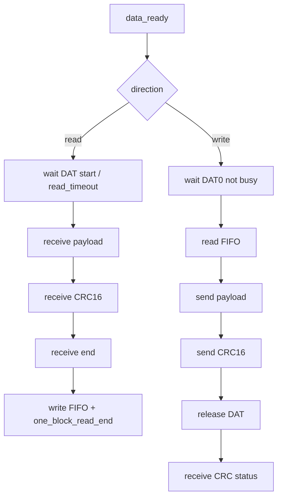

# 任务73：AHB sd host控制器设计12

## 本章知识全景图

这一讲进入 `sd_data_fsm`。data FSM 比 command FSM 难，因为它同时管读写两个方向、DAT0 busy、数据块计数、CRC16、CRC status、FIFO 读写、byte swap 和 PAD 方向。读路径的终点不是 payload 收满，而是 data、CRC、end、FIFO 写入都闭环；写路径的终点不是 payload 发完，而是 CRC status 和可能的 busy 都闭环。

核心概念：`data_ready`、`data_direction`、`need_receive_block`、`need_send_block`、`read_timeout`、`one_block_read_end`、`has_send_bit`、`has_receive_bit`、`has_send_crc_bit`、`has_receive_crc_bit`、`CRC status`、`DAT0 busy`、`FIFO read/write`、`byte swap`、`data_crc_error`、`crc_status_error`。

逻辑主线：
1. data FSM 的接口围绕 block 传输，不围绕单个 bit。
2. read path：等 DAT start，收 payload，收 CRC16，收 end，写 FIFO，报 block done。
3. write path：等 DAT0 不忙，从 FIFO 取数据，发 payload，发 CRC16，释放 DAT，收 CRC status。
4. data shift register 把 FIFO word 和 DAT lane 翻译起来，byte swap 和 CRC error 都不能省。



最短学习路径：先用读写对照表记方向和等待条件，再把 CRC/FIFO/PAD 方向补到每条边上，最后用非对称数据模式验证 byte swap。

## 全视频地图

| 时间段 | 知识块 | 本讲要抓住的工程问题 |
|---|---|---|
| 00:00-06:40 | data FSM 接口、块数和 bit 数 | data path 的输入输出为什么比 command path 多 |
| 06:40-13:40 | read timeout、CRC 计数、block end | 数据路径错误要和 command response 错误分开 |
| 13:40-28:20 | receive/send 状态图 | 读写方向分支、DAT0 busy 修正、CRC status |
| 28:20-37:50 | 状态跳转文字说明 | ready、direction、block count、提前结束 |
| 37:50-48:17 | send/receive shift register | FIFO、PAD 方向、byte swap、CRC error |

## 1. data FSM 的端口来自 block 传输需求

DAT 线虽然按 bit 传输，但 data FSM 的控制目标是 block：一个 block 多长、总共几个 block、当前方向、FIFO 能不能读写、错误如何上报。


| 端口/状态 | 作用 | 漏掉后的后果 |
|---|---|---|
| `in_data_ready` | 寄存器侧配置好后启动事务 | 数据状态机无法和软件握手 |
| `data_direction` | 选择 read 或 write | DAT 方向和 FIFO 方向可能反 |
| `need_receive_block` / `need_send_block` | 总 block 数 | 多块传输无法结束或提前结束 |
| `read_timeout` | 等 DAT start 的超时 | response 正常但 data 不来时无法报错 |
| `one_block_read_end` | 一个读 block 闭环完成 | clock stop/DMA 流控没有触发点 |
| FIFO 状态 | 判断能否读写 | FIFO underflow/overflow |
| CRC error/status error | 软件可见错误 | testbench 看到错，驱动看不到错 |

`read_timeout` 属于 DAT receive path，不属于 command response path。读命令可能已经正常响应，但卡迟迟不发数据；这时应报 data timeout，而不是 command timeout。

## 2. 读路径必须经过 data、CRC、end 三段

read path 的完成条件不能停在 payload 收满。SD 卡返回数据后还会返回 CRC16 和 end bit，Host 要本地比较 CRC，再把数据安全写入 FIFO。


读路径最小状态：
1. `STATE_RECEIVE_WAIT`：等待 DAT start，超时置 `read_timeout`。
2. `STATE_RECEIVE`：接收 payload，计 `has_receive_bit`。
3. `STATE_RECEIVE_CRC`：接收 CRC16，和本地 CRC 比较。
4. `STATE_RECEIVE_END`：检查 end bit。
5. FIFO write：把完整 block 写入 FIFO，置 `one_block_read_end`。

严格判定式可以写成：

```text
read_block_done =
  payload_bit_count_done &&
  receive_crc16_done &&
  crc16_match &&
  end_bit_valid &&
  fifo_write_accept
```

少任一项都不能叫 block done。读路径像验货入库：货物本体到达只是第一步，还要核对封条、签收单、入库位置，最后仓库系统确认写入成功，才算这一箱真正入库。若 payload 收满就推进 block count，CRC 错或 FIFO 写失败会被盖过去，软件看到的是“完成”，内存里却是坏数据。


receive shift 的 `out_receive_data_crc_err` 必须进入状态寄存器/中断路径。否则内部已经知道 CRC 错，软件却仍可能把 FIFO 中的数据当成有效块。

## 3. 写路径第一关是 DAT0 busy，最后一关是 CRC status

write path 不是 FIFO 有数据就立刻发。先要确认 DAT0 不忙，再从 FIFO 取数据，发 payload 和 CRC16，最后释放 DAT 接收卡返回的 CRC status。


课程明确修正：DAT0 为 0 表示 busy，不能写反。RTL review 时要专门查这一句逻辑：`dat0 == 1'b0` 应进入等待或禁止发送，而不是启动 send。这个点价值很高，因为一旦写反，状态机会在卡忙时继续推数据。


写路径最小状态：
1. `STATE_WAIT_SEND`：等待 DAT0 不 busy，且 FIFO 有数据。
2. `STATE_SEND`：从 FIFO 读 word，串行输出 payload。
3. `STATE_SEND_CRC`：输出每条 DAT lane 的 CRC16。
4. `STATE_RECEIVE_CRC_STATUS`：释放 DAT，接收卡返回 status。
5. `STATE_SEND_BUSY/STOP`：按 CRC status 和 DAT0 busy 决定完成、重试或错误。

写路径尾部比读路径更容易漏，因为发完 payload 后 Host 还不能立刻宣布胜利：

```text
payload sent
  -> send CRC16 on DAT lanes
  -> release DAT output enable
  -> receive card CRC status
  -> if status ok, wait DAT0 busy release if required
  -> then block write done
```

这更像出库发货：把货装上车不等于客户签收，CRC16 是随车发出的校验单，CRC status 是客户回执，DAT0 busy 是对方仓库还在处理。只看“货车离站”会漏掉签收失败。


`data_ready` 只是事务入口，不代表可以立即读 FIFO 或驱动 DAT。它后面还要经过 direction、DAT0 busy、FIFO empty/full、block count 等条件。

## 4. 状态循环必须同时维护 block count 和提前结束

多块传输的难点不是多一个循环，而是每个 block 的完成条件必须完整。读路径必须 data/CRC/end/FIFO 写入都完成；写路径必须 payload/CRC/status/busy 都处理完。


读写对照：

| 维度 | Read path | Write path |
|---|---|---|
| 起点 | command 后等待 DAT start | response 后等待 DAT0 不 busy、FIFO 有数据 |
| PAD 方向 | Host 释放 DAT，卡驱动 | Host 驱动 DAT，status/busy 阶段释放 |
| CRC | Host 接收并本地比较 CRC16 | Host 发送 CRC16，再接收卡 CRC status |
| FIFO | receive 后写 FIFO | send 前读 FIFO |
| block done | end bit + CRC ok + FIFO 写成功 | CRC status ok + busy 结束 |
| timeout | `read_timeout` | 等 busy/FIFO/status 的设计相关 timeout |

提前结束必须显式设计。不能只靠 block count 自减到 0；`CMD12`、FIFO 错误、CRC 错误、timeout 都可能中断正常循环。

优先级建议按“错误先截断、停止命令次之、正常计数最后”理解：

| 事件 | 对 block count 的影响 | 原因 |
|---|---|---|
| CRC error / FIFO error / timeout | 立即停止正常推进并置错误状态 | 数据可信性已经破坏 |
| 软件或协议要求 `CMD12` stop | 停止后等待命令/数据尾部闭合 | 多块提前终止是合法控制流 |
| 当前 block 完整 done | block count 递减或递增统计 | 只有完整闭环才推进 |
| block count 到终点 | 置 transfer complete | 正常完成路径 |

验证时要刻意把 CRC 错、timeout 和最后一块同时打在边界附近，看 RTL 是先报错还是先误报 complete。

## 5. data send shift register 是 FIFO 与 PAD 的翻译器

send shift 不只是移位器。它要处理 FIFO word、bus width、high-speed 边沿、当前状态、CRC 计数、DAT 输出和 output enable。


验证时不要只看 `dat_out`。应同时看：
- `fifo_rd_en` 是否只在需要新 word 时拉起。
- `fifo_rd_data` 是否在被消费前稳定。
- `has_send_bit` 是否与 DAT 输出 bit 计数一致。
- `out_data_dir/dat_oe` 是否只在 Host 该驱动时打开。

## 6. byte swap 和 receive CRC error 都是软件可见正确性的前置条件

FIFO 按 32-bit word 存储，SD DAT lane 按串行顺序输出或接收；两者字节顺序可能不同。`swap` 的任务是把软件视角的数据顺序和 SD 线上的传输顺序对齐。


验证 `swap` 必须使用非对称数据，例如 `32'h01_23_45_67`、`32'h89_ab_cd_ef`。全 0、全 1 或重复字节无法暴露字节顺序错误。

以 `32'h01_23_45_67` 为例，软件视角的字节顺序是 `01,23,45,67`。如果 DAT 线发送顺序要求先出最高字节，波形上应先看到 `01` 对应的 bit 片段；如果 RTL 直接按小端 FIFO 低字节先出，卡端看到的就会变成 `67,45,23,01`。这个错误不会改变总 bit 数，也不一定触发 CRC 错，因为 CRC 是按错误顺序一起算的；它只会让文件内容在软件层“每 4 字节翻转”。

## RTL 落点与验证检查点

| 检查点 | 通过标准 |
|---|---|
| read timeout | 等 DAT start 超出窗口置 `read_timeout`，不误报 command timeout |
| read block | payload、CRC、end 都完成后才写 FIFO |
| data CRC error | CRC 错进入状态寄存器和 interrupt |
| DAT0 busy 修正 | `dat0=0` 时不进入 send |
| write CRC status | Host 发完 CRC 后释放 DAT 并接收 status |
| FIFO read | `fifo_rd_en` 与 word 消费边界一致 |
| PAD 方向 | read/status/busy 阶段 `dat_oe=0`，write payload/CRC 阶段 `dat_oe=1` |
| byte swap | 非对称数据写读回顺序一致 |
| block count | 每个 block 完整闭环后才递增/递减 |

## 工程练习

1. 为什么 data FSM 比 command FSM 更复杂？

   答案：data FSM 同时处理 read/write 两个方向、多个 block、CRC16、CRC status、DAT0 busy、FIFO 读写、byte swap 和 PAD 方向；command FSM 主要处理 CMD 帧和 response。

2. `one_block_read_end` 应在什么时候置位？

   答案：一个 read block 的 payload、CRC、end 都处理完成，并且数据可安全写入 FIFO 后置位。它可用于触发 clock stop 或 DMA 搬运。

3. 写路径中 CRC16 与 CRC status 的区别是什么？

   答案：CRC16 是 Host 随数据发送给卡的校验；CRC status 是卡校验后返回给 Host 的接收结果。

4. 如何验证 byte swap？

   答案：使用非对称 word 序列写入 FIFO，观察 DAT lane 输出顺序或读回软件数据；如果使用全 0/全 1，顺序错误会被掩盖。

## 常见误区和失败信号

| 误区 | 后果 | 检查方法 |
|---|---|---|
| payload 收满就报 read done | CRC/end 未校验 | 读路径是否进入 CRC/end |
| DAT0 busy 判断写反 | 卡忙时继续发数据 | `dat0=0` 用例是否停在 wait |
| 发完 CRC16 就报 write done | 卡可能返回 CRC error | 是否接收 CRC status |
| `data_ready` 直接驱动 FIFO | underflow/overflow | ready 后是否还判断 direction/FIFO |
| 忽略 byte swap | 软件读写顺序错 | 非对称数据模式验证 |
| CRC error 只留内部信号 | 软件不可见失败 | status/interrupt 是否置位 |

## 复习与自测

1. read timeout 和 response timeout 的区别是什么？

   答案：response timeout 属于 CMD path，表示命令响应没有来；read timeout 属于 DAT path，表示读命令后数据 start 没有来。

2. 写路径为什么要接收 CRC status？

   答案：Host 发出数据和 CRC16 后，必须知道卡是否正确接收当前 block。CRC status 是卡给 Host 的接收判定。

3. `dat_oe` 在写路径什么时候应关闭？

   答案：发送 payload 和 CRC16 时打开；等待卡返回 CRC status、DAT0 busy 或读数据时关闭。

4. 如果 FIFO 写失败但 block count 仍推进，会发生什么？

   答案：状态机认为 block 已完成，但数据实际丢失。后续 DMA/软件读到的数据和状态不一致，属于严重一致性错误。

