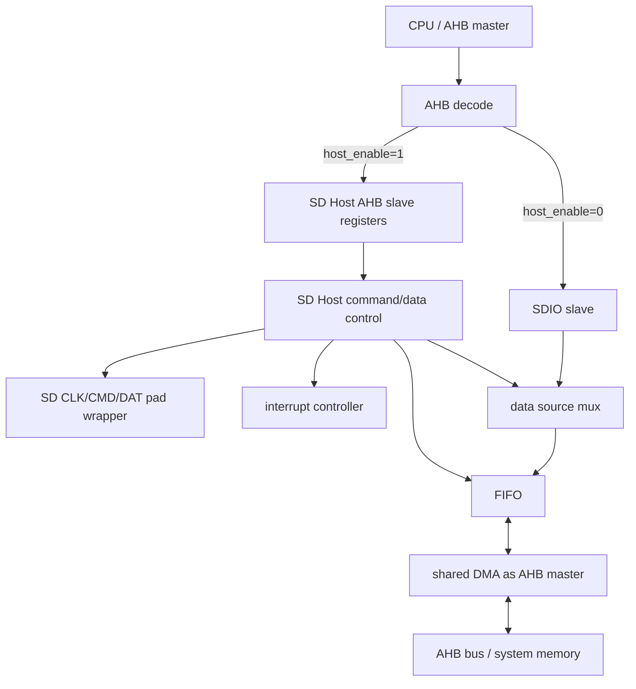

# 任务74：AHB sd host控制器设计13

## 本章知识全景图

这一讲把 SD Host 放回 SoC 顶层。系统集成的关键不是“把线连上”，而是确认 SD Host 同时扮演两个 AHB 身份：slave 端口让 CPU 配置寄存器，master DMA 端口主动访问系统内存；同时还要接 SD CMD/DAT/CLK pad、中断控制器，以及与 SDIO 在入口和数据源两处做 mux。

核心概念：`AHB slave`、`AHB master`、`HSEL`、`HWRITE`、`HTRANS`、`HBURST`、`HSIZE`、`HREADYIN/HREADYOUT`、`HRESP`、`HBUSREQ/HGRANT/HLOCK`、`SD pad split`、`cmd_oe/cmd_out/cmd_in`、`dat_oe/dat_out/dat_in`、`interrupt controller`、`host_enable`、`SDIO/SD Host mux`、`shared FIFO/DMA`。

逻辑主线：
1. SD Host 的 AHB slave 和 AHB master 是两个角色，不能少连或接反。
2. slave 访问要按 AHB ready/response 规则采样，不能只看 `HSEL`。
3. DMA master 要经过 request/grant/ready/response，grant 下降后还要处理尾部数据阶段。
4. CMD/DAT 内部必须拆成 in/out/oe，interrupt 要接中断控制器。
5. SDIO 与 SD Host 的 mux 不只在 slave 入口，还在 FIFO/DMA 数据源。



最短学习路径：先画出 slave/master 两个 AHB 身份，再检查 PAD 方向和 interrupt/status，最后用 `host_enable` 证明 SDIO/Host mux 没有只切入口、不切数据源。

## 全视频地图

| 时间段 | 知识块 | 本讲要抓住的工程问题 |
|---|---|---|
| 00:00-02:30 | 控制器系统位置 | SD Host 与 SDIO 二选一，且 SD Host 多了 DMA master |
| 02:30-11:00 | AHB slave 端口 | CPU 如何合法访问寄存器，ready/response 怎么处理 |
| 11:00-22:30 | DMA master 端口 | DMA 如何申请总线、发地址、处理 grant 和 ready |
| 22:30-25:20 | SD Bus PAD | CMD/DAT 双向线如何拆成 in/out/oe |
| 25:20-30:00 | interrupt 与 mux | 中断接控制器，`host_enable` 选择 Host 或 SDIO |
| 30:00-37:14 | 框架图和共享 DMA/FIFO | slave 入口分开，DMA/FIFO 可共享但数据源要 mux |

## 1. 系统集成先分清两个 AHB 身份

SD Host 既是 AHB slave，也是 AHB master。slave 身份服务 CPU 配置；master 身份来自内置 DMA，用于搬运系统内存和 FIFO。


若只连 slave，软件能写寄存器，但数据无法自动进出内存。若只连 master，DMA 可能能搬数据，但 CPU 无法启动、配置或读状态。集成检查的第一步就是在顶层 netlist/RTL 中确认这两组接口都接到了正确总线位置。

## 2. AHB slave 访问不是只看 `HSEL`

AHB slave 端口服务寄存器访问。`HSEL` 表示地址译码选中，`HTRANS/HWRITE/HSIZE/HBURST/HADDR/HWDATA` 描述传输，`HRDATA/HRESP/HREADYOUT` 返回结果。


`HTRANS` 与 `HBURST` 最容易混：`HTRANS` 描述当前这一拍是 IDLE、BUSY、NONSEQ 还是 SEQ；`HBURST` 描述整个 burst 类型，如 SINGLE、INCR、WRAP。`NONSEQ` 只说明这是一次传输或 burst 的第一拍，不能替代 burst 类型判断。


有效采样条件至少包括：`HSEL=1`、`HREADYIN=1`、当前传输为有效 `HTRANS`、地址落在寄存器空间。若其他 slave 正在拉低 ready，当前地址阶段还没有推进，SD Host 不能提前锁存下一次访问。

最小时序感可以这样建立：

```text
cycle N:   地址阶段，CPU 给 HADDR/HWRITE/HTRANS，HREADYIN=1 才表示本阶段被接受
cycle N+1: 写数据阶段，HWDATA 对应 cycle N 的地址；读传输则 HRDATA 返回上一拍地址选择的寄存器
```

如果 `HREADYIN=0`，cycle N 的地址阶段被延长，后面的地址和数据都不能当作新事务消费。AHB 像传送带上的托盘：`HREADYIN` 是托盘前进信号，托盘没前进时，工人不能提前拿下一格的标签去贴当前货物。


`HRESP/HRDATA/HREADYOUT` 是软件看到的结果边界。非法地址、busy 时禁止写配置、寄存器只读写错，都应有可定义的响应或状态表现。内部静默丢弃访问，会让驱动无法定位失败。

## 3. DMA master 不需要独立 slave 口，但必须完整接 master 握手

DMA 是 SD Host 的 AHB master。它从 FIFO 读数据写入内存，或从内存读数据写入 FIFO，所以要能请求总线、拿授权、发地址控制、收 ready/response。


DMA 没有独立 slave 配置口，是因为 SD Host 的 AHB slave 寄存器已经承载 DMA 配置：源/目标地址、长度、方向、启动、done/error。这个设计减少一个配置入口，但要求寄存器到 DMA 内部控制的连接必须完整。


DMA 不能一有 FIFO 数据就直接驱动总线。它应先拉 `HBUSREQ`，等 arbiter 给 `HGRANT`，再发地址和控制，并用 `HREADY/HRESP` 判断每拍是否完成。验证必须模拟 grant 延迟和 slave wait state。


AHB 有地址阶段和数据阶段。`HGRANT` 下降不代表所有尾部数据阶段立刻消失；最后一拍可能还要按 ready/response 完成。不能用 `grant==0` 简单断言 master 没有任何有效数据阶段。

DMA master 的完整握手至少要覆盖两类反例：

| 场景 | 正确行为 | 容易写错的行为 |
|---|---|---|
| grant 延迟 | request 保持，未授权前不驱动有效 transfer | FIFO 有数据就发地址 |
| grant 尾拍 | 最后一拍数据阶段继续等待 `HREADY/HRESP` | grant 拉低就丢掉尾部响应 |

图里要看的不是“DMA 有 master 端口”这个静态事实，而是 DMA 先拿 grant 再发地址，真正完成由 `HREADY/HRESP` 定义。FIFO 有数据只说明“有货可发”，不说明“总线已经给了车道”。

## 4. SD Bus PAD 与 interrupt 都是顶层边界

SD clock 通常由 Host 输出；CMD/DAT 是双向线。RTL 内部不要到处传 `inout`，应在 PAD wrapper 处合成双向行为。


CMD 拆成 `cmd_out/cmd_oe/cmd_in`；DAT 拆成 `dat_out[3:0]/dat_oe[3:0]/dat_in[3:0]`。发送 command 或写数据时 Host 驱动；等待 response、读数据、CRC status、DAT0 busy 时 Host 释放。


SD Host 的 `irq` 通常接中断控制器，不是直接等同 CPU 行为。SD Host 本身要做的是事件置 status、mask enable 后拉 irq、软件清 status 后释放 irq。中断控制器再处理屏蔽、优先级和汇总。

## 5. SDIO 与 SD Host 的 mux 有两个边界

课程图里 SDIO 与 SD Host 是二选一。`host_enable` 不能只切 AHB slave 入口，还要切共享 FIFO/DMA 的数据源和状态路径。


入口 mux 解决 CPU 当前访问谁的寄存器：`host_enable=1` 进入 SD Host，`host_enable=0` 进入 SDIO。若两边同时响应，AHB 读数据和 ready/response 会冲突；若选中一边却读到另一边状态，软件会配置错模块。

这两张图分别看“寄存器入口切换”和“Host/SDIO slave 选择”。它们不是同一层 mux：前者决定 CPU 这次访问落到哪个寄存器 bank，后者决定系统当前启用哪条控制器路径。


共享 DMA/FIFO 解决数据从谁来。SD Host 和 SDIO 同一时间只启用一个，所以 DMA master 可以共用；真正要 mux 的是 FIFO 写读控制、数据输入输出、done/error 状态和 interrupt 来源。

如果只切寄存器入口而不切共享数据源，会出现很隐蔽的灾难：CPU 以为自己在配置 SD Host，status 也读到 SD Host bank，但 DMA/FIFO 仍接在 SDIO 数据通路上。结果是控制面和数据面错配，像司机拿着 A 站的调度单，却把货送进 B 站的仓库。

## RTL 落点与系统级 smoke test

系统集成验证的目标是证明角色、方向、ready 和 mux 没接反。最小 smoke test：

```text
1. host_enable=1，CPU 写 SD Host 寄存器，读回确认。
2. 人为拉低 HREADYIN，确认 SD Host 不提前采样地址阶段。
3. 触发一次单块读，DMA 拉 HBUSREQ；grant 延迟后才发有效 master transfer。
4. 模拟 slave wait state，确认 DMA 用 HREADY/HRESP 完成尾拍。
5. 检查 CMD/DAT 在 command、response、data、busy 阶段的 oe。
6. 注入 command done / timeout / CRC error，确认 status 和 irq 闭环。
7. host_enable=0，确认同一入口进入 SDIO，且 FIFO/DMA 数据源切到 SDIO。
```

一次单块读的模块穿越图可以更具体：

```text
CPU write Host registers
  -> AHB slave decode and register bank
  -> command FSM sends CMD17 and receives response
  -> data FSM receives one block from DAT
  -> FIFO accumulates word data
  -> DMA master requests AHB and writes memory
  -> transfer/status/irq returns to CPU
```

这条链能把本讲所有顶层接口串起来：slave 负责配置，PAD 负责卡侧物理线，FIFO/DMA 负责内存搬运，interrupt 负责软件可见完成证据。

| 集成点 | 通过标准 | 失败信号 |
|---|---|---|
| AHB slave decode | 选中 SD Host 时寄存器可写可读 | `HSEL` 未命中或两边同时响应 |
| ready 采样 | `HREADYIN=0` 时不锁存新访问 | 地址提前消费 |
| HRESP/HRDATA | 读写错误有软件可见结果 | 内部丢弃无反馈 |
| DMA request/grant | 未授权不发 transfer，授权后正确发 | 未 grant 驱动总线 |
| grant 尾拍 | grant 下降后合法完成最后数据阶段 | 尾拍丢失或重复 |
| PAD 方向 | 各协议阶段 `cmd_oe/dat_oe` 正确 | 等卡阶段仍驱动 |
| interrupt | status/mask/irq/clear 闭环 | irq 有但 status 不可读 |
| host/sdio mux | 入口和数据源同步切换 | 配置 Host 却搬 SDIO 数据 |

## 工程练习

1. SD Host 顶层必须连接哪四类接口？

   答案：AHB slave 寄存器接口、AHB master DMA 接口、SD Bus PAD 接口、interrupt 输出接口。若支持 SDIO/Host 复用，还要连接 `host_enable` 和共享 FIFO/DMA mux。

2. 一次 AHB slave 写寄存器何时有效？

   答案：`HSEL=1`、`HREADYIN=1`、`HTRANS` 为有效传输、`HWRITE=1`、地址命中寄存器，并在正确地址/数据阶段锁存。

3. 为什么 DMA master 不需要单独 slave 配置口？

   答案：DMA 配置寄存器已经放在 SD Host AHB slave 里。CPU 通过 SD Host slave 写配置，DMA 内部读取这些寄存器后作为 master 发起搬运。

4. SDIO/Host mux 为什么不能只切 slave 入口？

   答案：slave 入口只决定 CPU 访问谁；共享 FIFO/DMA 的数据源、控制和状态也必须切换。否则可能 CPU 配置 Host，DMA 却搬 SDIO 数据。

## 常见误区和失败信号

| 误区 | 后果 | 检查方法 |
|---|---|---|
| 只连 AHB slave | 软件能配置但数据搬不动 | 是否有 DMA master 接 arbiter |
| `HSEL=1` 就采样访问 | ready 低时误锁存地址 | `HREADYIN=0` 用例 |
| 混淆 `HTRANS/HBURST` | burst 控制错误 | 当前拍类型和 burst 类型分开判断 |
| grant 下降就丢尾拍 | AHB 数据阶段不完整 | 地址/数据阶段分开检查 |
| 内部使用大量 `inout` | 综合和验证困难 | 内部是否拆成 in/out/oe |
| interrupt 当结果 | 软件无法定位错误 | status 是否说明事件类型 |
| 只 mux slave 不 mux FIFO/DMA | 数据源错乱 | host/sdio 两模式各跑搬运 |

## 复习与自测

1. SD Host 的 AHB slave 和 AHB master 分别做什么？

   答案：slave 让 CPU 配置和读状态；master 是 DMA，用于主动访问系统内存搬运 SD 数据。

2. `HREADYIN` 对 slave 访问有什么影响？

   答案：它表示当前总线阶段是否可推进。`HREADYIN=0` 时，slave 不应提前采样新的地址/控制。

3. CMD/DAT 为什么要拆成 in/out/oe？

   答案：外部是双向线，内部保持单向信号便于综合和验证；`oe` 明确当前由 Host 还是卡驱动。

4. grant 延迟测试能发现什么问题？

   答案：能发现 DMA 未获授权就驱动总线、request 保持错误、grant 后不启动或尾拍处理错误。

