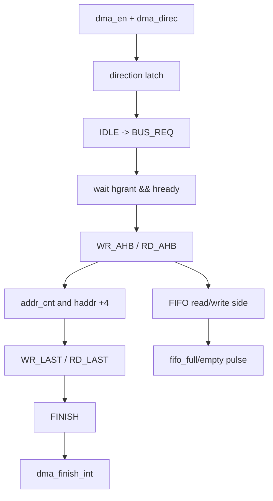

# 任务91：AHB sd host控制器设计28

## 本章知识全景图

这一讲把 `sd_dma.v` 从“能发起一次 DMA”推进到“在 AHB 仲裁、FIFO 边界和读写方向切换下仍然不丢数”。核心对象是一个 AHB master DMA 控制器：它从 SD Host 的数据路径接收 `dma_en/dma_addr/transfer_size/dma_direc`，向 AHB 发出 `hbusreq/haddr/htrans/hwrite/hwdata`，再用 FIFO、完成中断和错误状态把一次块传输闭合。

核心概念：DMA 方向锁存、AHB 仲裁、`hready/hgrant`、读写状态机、`rd_data_valid` 修复、地址计数、FIFO 满空脉冲、DMA 完成中断。

逻辑主线：DMA 不是“寄存器一写就搬完数据”，而是一个跨总线的事务状态机；只要 `hgrant` 被撤销、`hready` 拉低或 FIFO 边界脉冲误判，数据就可能错位。设计必须把“请求总线、获得授权、连续地址、最后一拍、完成清中断”拆成可验证的控制点。

### 概念地图



### 最短学习路径

1. 先看状态机：`IDLE/BUS_REQ/WR_AHB/WR_LAST/RD_AHB/RD_LAST/FINISH` 规定 DMA 的骨架。
2. 再看 AHB 条件：`hgrant && hready` 才能从请求进入真正传输，`!hgrant` 会把传输打回 `BUS_REQ`。
3. 最后看边界修复：`rd_data_valid`、`grant_to_low`、`fifo_full_pulse`、`dma_finish_int` 决定“异常仲裁和最后一拍”是否安全。

## 全视频地图

| 时间 | 画面锚点 | 学习任务 |
|---|---|---|
| 03:00-04:00 | 任务91：DMA 方向锁存与状态机入口 | 围绕截图中的代码、波形或课件结论核对本节主线 |
| 08:00-09:00 | 任务91：BUS_REQ 到读写状态的 AHB 条件 | 围绕截图中的代码、波形或课件结论核对本节主线 |
| 13:00-14:00 | 任务91：grant_to_low 与仲裁撤销保护 | 围绕截图中的代码、波形或课件结论核对本节主线 |
| 18:00-19:00 | 任务91：rd_data_valid 修复逻辑 | 围绕截图中的代码、波形或课件结论核对本节主线 |
| 23:00-24:00 | 任务91：读写状态和最后一拍 | 围绕截图中的代码、波形或课件结论核对本节主线 |
| 33:00-34:00 | 任务91：地址初始化、保持和递增 | 围绕截图中的代码、波形或课件结论核对本节主线 |
| 52:00-53:00 | 任务91：FIFO 脉冲和 DMA 完成中断 | 围绕截图中的代码、波形或课件结论核对本节主线 |
| 38:00-39:00 | 任务91：状态编码和关键控制信号总览 | 围绕截图中的代码、波形或课件结论核对本节主线 |


## 截图证据链

| 截图 | 视频核对 | 证据职责 | 阅读时要核对什么 |
|---|---|---|---|
| task91_03m00s.jpg | 03:00-04:00 | 任务91：DMA 方向锁存与状态机入口 | 用作正文对应段落的视觉证据，重点核对信号名、状态名、波形边界或公式变量 |
| task91_08m00s.jpg | 08:00-09:00 | 任务91：BUS_REQ 到读写状态的 AHB 条件 | 用作正文对应段落的视觉证据，重点核对信号名、状态名、波形边界或公式变量 |
| task91_13m00s.jpg | 13:00-14:00 | 任务91：grant_to_low 与仲裁撤销保护 | 用作正文对应段落的视觉证据，重点核对信号名、状态名、波形边界或公式变量 |
| task91_18m00s.jpg | 18:00-19:00 | 任务91：rd_data_valid 修复逻辑 | 用作正文对应段落的视觉证据，重点核对信号名、状态名、波形边界或公式变量 |
| task91_23m00s.jpg | 23:00-24:00 | 任务91：读写状态和最后一拍 | 用作正文对应段落的视觉证据，重点核对信号名、状态名、波形边界或公式变量 |
| task91_33m00s.jpg | 33:00-34:00 | 任务91：地址初始化、保持和递增 | 用作正文对应段落的视觉证据，重点核对信号名、状态名、波形边界或公式变量 |
| task91_52m00s.jpg | 52:00-53:00 | 任务91：FIFO 脉冲和 DMA 完成中断 | 用作正文对应段落的视觉证据，重点核对信号名、状态名、波形边界或公式变量 |
| task91_38m00s.jpg | 38:00-39:00 | 任务91：状态编码和关键控制信号总览 | 用作正文对应段落的视觉证据，重点核对信号名、状态名、波形边界或公式变量 |


## 1. DMA 方向必须在启动点锁存

`dma_direc` 是软件配置的传输方向，但 DMA 一旦开始，方向就不能被后续寄存器写入随意改变。截图中 `direct` 在复位或软复位时清零，只在 `dma_en` 时装载 `dma_direc`；状态机后续根据 `direct` 选择 `WR_AHB` 或 `RD_AHB`。

视觉核对：03:00-08:00，画面显示 `direct <= dma_direc`，并在 `BUS_REQ` 之后用 `direct` 分支到写 AHB 或读 AHB。


视频核对：03:00-04:00，这张图用于核对“任务91：DMA 方向锁存与状态机入口”对应的代码、波形或课件证据。

代码意图可以压缩成：

```verilog
if (!hrst_n || ahb_soft_rst)
    direct <= 1'b0;
else if (dma_en)
    direct <= dma_direc;
```

常见误区是把方向信号一直直接接到状态机分支。这样在 DMA 运行期间如果软件误写寄存器，控制器可能在同一笔搬运中改变方向，FIFO 读写侧和 AHB 读写侧会立即错位。

## 2. `BUS_REQ` 是 AHB master 的安全门

DMA 进入 `BUS_REQ` 后不是立刻传输，而是等待 `hgrant && hready`。`hgrant` 表示总线仲裁器授权当前 master，`hready` 表示上一拍 AHB 传输已经完成；两者缺任一个，都不能把地址和控制看作有效传输。

视觉核对：08:00-13:00，状态机突出显示 `dma_load && hready` 进入 `BUS_REQ`，再由 `hgrant && hready` 进入读写分支。


视频核对：08:00-09:00，这张图用于核对“任务91：BUS_REQ 到读写状态的 AHB 条件”对应的代码、波形或课件证据。

关键跳转关系：

| 当前状态 | 条件 | 下一状态 | 设计含义 |
|---|---|---|---|
| `IDLE` | `dma_load && hready` | `BUS_REQ` | 软件装载 DMA 请求，且 AHB 可接受新事务 |
| `BUS_REQ` | `hgrant && hready && !direct` | `WR_AHB` | 获得总线，进入写 AHB 数据阶段 |
| `BUS_REQ` | `hgrant && hready && direct` | `RD_AHB` | 获得总线，进入读 AHB 数据阶段 |
| `WR_AHB/RD_AHB` | `!hgrant` | `BUS_REQ` | 仲裁被撤销，必须重新请求 |

对验证来说，不能只看 `hbusreq` 是否拉高，还要看 `hgrant` 掉下来后地址、计数和 FIFO 使能是否被正确冻结或重入。

## 3. `grant_to_low` 是为“仲裁中断后继续搬运”补的保护

课程画面中的注释写到：`used to write or read data after hgrant==0`。这说明原设计遇到 `hgrant` 被撤销时，最后一个有效数据或读返回数据可能没有被安全消费。`grant_to_low` 由 `grant_low_again`、`grant_low_cnt==0`、`!hgrant && hready` 共同生成，用来识别授权刚掉低但仍需要处理的数据窗口。

视觉核对：13:00-18:00，画面显示 `grant_to_low`、`grant_low_cnt`、`grant_low_again` 的生成逻辑。


视频核对：13:00-14:00，这张图用于核对“任务91：grant_to_low 与仲裁撤销保护”对应的代码、波形或课件证据。

这段逻辑的工程价值在于：AHB 仲裁不是“传输边界永远整齐”。如果总线授权在突发或连续访问中断开，DMA 要知道自己是在第一次掉授权、已经重入，还是已经重新获得授权。否则 `haddr` 可能提前加 4，FIFO 也可能多读或少写一拍。

## 4. `rd_data_valid` 修复的是读数据最后一拍和断点数据

截图中保留了旧写法：

```verilog
// assign rd_data_valid = (hready && (addr_cnt>16'h4) && (rd_ahb_bit || rd_last_bit || grant_to_low));
```

随后出现修复注释：`When DMA transfer break, data error.` 新逻辑先用 `!hready` 屏蔽无效周期，再根据 `htrans==2'h3 && rd_ahb_bit`、`rd_last_bit`、`grant_to_low && !dma_direc` 判定读数据有效。

视觉核对：18:00-23:00，画面显示 `rd_data_valid` 的旧逻辑、修复注释和新条件表达式。


视频核对：18:00-19:00，这张图用于核对“任务91：rd_data_valid 修复逻辑”对应的代码、波形或课件证据。

这个修复的要点不是“条件写得更复杂”，而是把有效数据绑定到 AHB 真实握手和状态边界：

| 条件 | 含义 |
|---|---|
| `!hready` | AHB 传输未完成，读数据不能采样 |
| `htrans==2'h3 && rd_ahb_bit` | 处在有效连续读传输阶段 |
| `rd_last_bit` | 读事务最后一拍仍要接收 |
| `grant_to_low && !dma_direc` | 仲裁掉低边界仍有需要补收的数据 |

如果读数据有效条件只依赖地址计数，会在 AHB wait state、仲裁撤销或最后一拍时把数据错配到 FIFO。

## 5. 地址与最后一拍要和状态机一起看

写 AHB 和读 AHB 都用 `addr_finish` 判断是否达到 `dma_cnt`。达到后不是直接 `FINISH`，而是先进入 `WR_LAST` 或 `RD_LAST`，等待 `hready` 后再结束。这个最后一拍状态是 AHB 数据相位和地址相位错开的必要补偿。

视觉核对：23:00-28:00，画面显示 `WR_AHB -> WR_LAST -> FINISH` 与 `RD_AHB -> RD_LAST -> FINISH`。


视频核对：23:00-24:00，这张图用于核对“任务91：读写状态和最后一拍”对应的代码、波形或课件证据。

最小事务模型：

```text
BUS_REQ
  -> WR_AHB / RD_AHB
       if addr_finish: WR_LAST / RD_LAST
       else if !hgrant: BUS_REQ
       else stay transferring
  -> wait hready
  -> FINISH
  -> IDLE
```

`WR_LAST/RD_LAST` 的存在提醒一个 RTL 习惯：总线控制器不能只按“地址发完”结束事务，还要等数据相位完成。尤其 AHB 这类流水式总线，地址相位和数据相位天然错一拍。

## 6. `haddr` 递增必须避开重入和授权丢失

截图中 `hlock` 固定为 0，说明本设计没有使用 locked transfer；`haddr` 在 `go_init` 时装入 `dma_addr`，在 `addr_valid` 时加 4。特殊点是：如果 `grant_low_again` 为真，`go_init` 不重新装入 `dma_addr`，而是保持当前地址，避免仲裁恢复后从起始地址重传。

视觉核对：33:00-38:00，画面显示 `hlock` 恒 0、`haddr <= dma_addr`、`haddr <= haddr + 32'h4` 以及 `grant_low_again` 分支。


视频核对：33:00-34:00，这张图用于核对“任务91：地址初始化、保持和递增”对应的代码、波形或课件证据。

地址控制的判定口径：

- 第一次启动：`go_init` 装入软件配置的 `dma_addr`。
- 正常传输：每个有效 word 传输后 `haddr += 4`。
- 授权中断后重入：保留当前 `haddr`，不能回到起始地址。
- 软复位或 idle：地址清零，避免旧事务残留。

## 7. FIFO 脉冲和完成中断把 DMA 结果交给软件

DMA 控制器不是只把数据搬完，还要告诉软件“什么时候可以处理下一步”。截图中 `fifo_full_pulse = !fifo_full_tp && fifo_full`、`fifo_empty_pulse = !fifo_empty_tp && fifo_empty` 把 FIFO 电平变成单周期事件；`dma_finish_int` 在 `dma_finish_int_gen && dma_finish` 时置位，由 `clr_dma_finish_int` 清零。

视觉核对：48:00-52:00，画面显示 FIFO 满空脉冲和 DMA 完成中断寄存逻辑。


视频核对：52:00-53:00，这张图用于核对“任务91：FIFO 脉冲和 DMA 完成中断”对应的代码、波形或课件证据。

这类中断必须区分“状态”和“事件”：

| 信号 | 类型 | 用法 |
|---|---|---|
| `fifo_full` / `fifo_empty` | 状态电平 | 描述 FIFO 当前是否满/空 |
| `fifo_full_pulse` / `fifo_empty_pulse` | 事件脉冲 | 触发一次中断或一次处理动作 |
| `dma_finish` | 内部完成点 | 状态机到达 `FINISH` |
| `dma_finish_int` | 软件可见中断 | 保持到软件清除 |

如果把 FIFO 电平直接当中断，软件可能在同一个满状态下反复进入中断；如果完成中断不保持，软件又可能错过短脉冲。

## 8. RTL 验证检查口径

验证 `sd_dma.v` 时至少要构造四类波形：

1. 正常写 AHB：`dma_en -> BUS_REQ -> WR_AHB -> WR_LAST -> FINISH`，`haddr` 每 word 加 4，`fifo_rd` 与 AHB 写数据对齐。
2. 正常读 AHB：`RD_AHB -> RD_LAST`，`rd_data_valid` 只在 `hready` 和有效读相位采样。
3. 仲裁撤销：传输中途拉低 `hgrant`，检查 `grant_to_low/grant_low_again/haddr` 不导致重读或跳地址。
4. FIFO 与中断：满/空脉冲只触发一次，`dma_finish_int` 置位后能被清除。

这四类波形覆盖的是 DMA 最容易出错的边界：总线授权、最后一拍、读数据有效、软件中断握手。

## 9. 全视频结构地图：这讲实际在修一条 DMA 断点链

这讲不是均匀介绍 `sd_dma.v`，而是在围绕一个具体问题推进：DMA 在 AHB 授权变化、读数据返回和 FIFO 边界之间可能断拍，断拍后如果状态、地址和数据有效信号不同步，就会出现数据错位。

| 视频段落 | 画面证据 | 真正解决的问题 |
|---|---|---|
| 03:00-08:00 | `direct` 锁存、`IDLE/BUS_REQ` 分支 | DMA 启动后方向不能漂移 |
| 13:00-18:00 | `grant_to_low/grant_low_again` | AHB 授权撤销后的边界数据不能丢 |
| 18:00-23:00 | `rd_data_valid` bug fix | 读返回数据必须绑定 `hready/htrans/last/grant_to_low` |
| 23:00-28:00 | `WR_LAST/RD_LAST` | 地址发完不等于数据相位完成 |
| 33:00-38:00 | `haddr` 初始化、保持、加 4 | 重入不能回到起始地址，也不能跳地址 |
| 48:00-52:00 | FIFO 脉冲、DMA finish interrupt | 软件要接收“事件”，不是短暂内部状态 |


视频核对：38:00-39:00，这张图用于核对“任务91：状态编码和关键控制信号总览”对应的代码、波形或课件证据。

从验证角度看，`rd_data_valid` 是本讲最关键的修复点，但它依赖前后所有条件：没有 `direct`，不知道读写方向；没有 `grant_to_low`，授权掉低边界会漏采；没有 `RD_LAST`，最后一拍会提前结束；没有 `haddr` 保持，重入后地址会错。因此这讲应当按“断点恢复链”学习，而不是按代码行顺序背。

## 10. 读写方向、FIFO 方向和 AHB 方向必须三者一致

课程注释中把 `dma_direc==0` 和 `dma_direc==1` 分别关联到 FIFO 写/读语义。学习时不要只记这个注释，要把三种方向同时对齐：

| 事务视角 | 写卡路径 | 读卡路径 |
|---|---|---|
| SD 协议 | Host 往 DAT 线送数据 | Card 往 DAT 线送数据 |
| FIFO | AHB/DMA 向 FIFO 填数据，SD 侧读出 | SD 侧写 FIFO，AHB/DMA 读出 |
| AHB master | 可能从内存读数据供 SD 写卡 | 可能向内存写入从 SD 读出的数据 |
| 风险点 | FIFO 空导致 DAT 发送断流 | FIFO 满或 `rd_data_valid` 错导致内存数据错 |

`fifo_rd = (hready && wr_ahb_bit)` 这类赋值容易让初学者困惑，因为名字是 FIFO 读，但处在 AHB 写状态。正确理解是：当前 RTL 的命名围绕模块内部数据方向，不一定和“写卡/读卡”的软件命令同名。验证时要看数据实际从哪里来、到哪里去。

## 11. 本讲最小波形清单

要证明 `sd_dma.v` 这一版可靠，波形里至少加入：

| 类别 | 信号 |
|---|---|
| 状态 | `cur_state`、`nxt_state`、`idle_bit`、`bus_req_bit`、`wr_ahb_bit`、`rd_ahb_bit`、`rd_last_bit` |
| AHB | `hbusreq`、`hgrant`、`hready`、`htrans`、`haddr`、`hwrite`、`hwdata`、`hrdata` |
| 地址与计数 | `dma_addr`、`transfer_size`、`addr_cnt`、`addr_finish`、`go_init`、`addr_valid` |
| 断点保护 | `grant_to_low`、`grant_low_cnt`、`grant_low_again`、`rd_data_valid` |
| FIFO/中断 | `fifo_rd`、`fifo_we`、`fifo_full_pulse`、`fifo_empty_pulse`、`dma_finish`、`dma_finish_int` |

波形判定标准是：`hgrant` 掉低时地址不乱跳，`hready=0` 时数据不被采，最后一拍仍能被接收，FIFO 事件只触发一次，DMA 完成中断保持到软件清除。

## 截图证据链与重读结论

这一讲的截图不是装饰图，而是一条 RTL 修改链：先锁定 DMA 启动条件，再处理 AHB 授权撤销，最后修正读数据有效、地址递增和中断交付。读图时要把每张图放回“状态机是否会在边界条件下错拍”这个问题里。

| 截图 | 证据职责 | 重读结论 | 不能推出什么 |
|---|---|---|---|
| `task91_03m00s.jpg` | `direct <= dma_direc` 与 `IDLE -> BUS_REQ` | DMA 方向只在启动点锁存，后续状态机使用稳定方向。 | 不能证明读写数据已经正确搬运。 |
| `task91_08m00s.jpg` | `BUS_REQ` 等待 `hgrant && hready` | AHB master 只有同时获得授权和 ready 才能进入传输态。 | 不能只看 `hgrant` 就判定地址相位有效。 |
| `task91_13m00s.jpg` | `grant_to_low/grant_low_again` | 授权撤销是本讲核心边界；恢复后不能从起始地址重跑，也不能跳过当前拍。 | 不能把它当成普通状态变量，必须结合 `haddr/addr_cnt` 验证。 |
| `task91_18m00s.jpg` | `rd_data_valid` 修复 | 读数据有效必须绑定 AHB 有效传输、ready、最后一拍和授权边界。 | 不能用“状态在 RD_AHB”单独证明 `hrdata` 可采样。 |
| `task91_23m00s.jpg` | `WR_LAST/RD_LAST` | 最后一拍用于补齐 AHB 地址相位和数据相位错位。 | 不能在 `addr_finish` 当拍立即宣告 DMA 完成。 |
| `task91_33m00s.jpg` | `go_init/addr_valid/haddr+4` | 地址初始化、保持、递增必须避开授权撤销后的重入。 | 不能只检查地址递增次数，还要看断点恢复位置。 |
| `task91_38m00s.jpg` | 状态编码与控制信号总览 | 验证波形应按状态 bit、AHB、地址、FIFO、中断分组。 | 不能用一张总览替代边界 testcase。 |
| `task91_52m00s.jpg` | FIFO 脉冲和 `dma_finish_int` | FIFO 满空是事件，完成中断是软件可见结果；二者都需要清除路径。 | 不能把持续电平直接当作一次性中断。 |

工程闭环：本讲合格验证至少要有一个 `hgrant` 中途拉低 testcase。若只跑顺滑总线，`grant_to_low`、`rd_data_valid` 和地址保持逻辑的价值都没有被验证到。

## 深层理解：DMA 状态机像列车调度

这讲的核心不是“又改了几个 if 条件”，而是让 DMA 状态机在断点处仍然知道自己开到哪一站。可以把一次 DMA 看成一列货运列车：`BUS_REQ` 是进站申请，`WR_AHB/RD_AHB` 是占用轨道，`WR_LAST/RD_LAST` 是最后一节车厢还没完全出站，`grant_to_low` 则是调度员记下“通行权刚刚被收回”的事故记录。

如果没有这份事故记录，状态机会在授权恢复时犯三类错：

| 边界 | 错误表现 | 正确理解 |
|---|---|---|
| 授权掉低 | 地址继续加，像列车失去通行权还往前冲 | `hgrant` 失效期间必须冻结关键推进条件 |
| 重新授权 | 从头重跑或跳过当前 word | `grant_to_low` 帮助恢复到正确断点 |
| 最后一拍 | `addr_finish` 后立刻完成 | AHB 数据相位还要补完最后一节车厢 |

`rd_data_valid` 的修复尤其重要：AHB 读数据不是状态机一进入 `RD_AHB` 就天然有效，它必须同时满足有效传输、ready、授权连续性和最后一拍处理。这里的深层经验是，总线状态机不能只用“我现在在哪个 state”判断事实，还要用“总线是否允许这一拍成立”判断事实。

## 自测题

1. 为什么 `dma_direc` 要锁存到 `direct`？
2. `BUS_REQ` 进入 `WR_AHB/RD_AHB` 为什么同时需要 `hgrant` 和 `hready`？
3. `WR_LAST/RD_LAST` 解决什么问题？
4. 旧的 `rd_data_valid` 为什么容易在 DMA break 时出错？
5. FIFO 满空为什么要做脉冲检测？

## 自测参考答案与判分点

1. 答：因为 DMA 运行期间方向必须稳定。若状态机直接使用可写寄存器 `dma_direc`，软件误写会让同一笔传输中途改变读写方向，导致 AHB 读写和 FIFO 读写侧错位。
   判分点：能指出关键条件、边界和失败后果；只写名词或只说现象不得满分。

2. 答：`hgrant` 代表仲裁授权，`hready` 代表上一传输完成并允许下一传输推进。只有两者同时满足，地址和控制信号才可以进入有效传输阶段。
   判分点：能指出关键条件、边界和失败后果；只写名词或只说现象不得满分。

3. 答：解决 AHB 地址相位和数据相位错拍的问题。地址计数到终点后，仍要等待最后一拍数据相位完成，不能立即宣布 DMA 结束。
   判分点：能指出关键条件、边界和失败后果；只写名词或只说现象不得满分。

4. 答：旧逻辑主要依赖 `addr_cnt` 和状态，没有充分绑定 `hready`、`htrans`、最后一拍和仲裁掉低边界。AHB wait state 或授权撤销时，可能把无效周期当成有效读数据。
   判分点：能指出关键条件、边界和失败后果；只写名词或只说现象不得满分。

5. 答：FIFO 满/空是持续状态，直接作为中断会重复触发；边沿脉冲只表示“刚刚进入满/空”，适合触发一次软件处理或 DMA 调度动作。
   判分点：能指出关键条件、边界和失败后果；只写名词或只说现象不得满分。

## 工程核对口径

验证本讲时，不要只跑一条无等待、无抢占的“晴天道路”。真正要做的是故意制造一次 `hgrant` 掉低、一次 `HREADY` wait、一次最后读数据边界，然后看状态机是否像有纪律的列车一样停、等、续行。

合格波形应满足：

1. `dma_direc` 只在启动点锁存，事务中途软件改寄存器不能改变当前方向。
2. `BUS_REQ` 必须等到 `hgrant && hready` 才进入有效 AHB 传输。
3. 授权丢失期间 `haddr/addr_cnt/fifo_rd/fifo_we` 不应假推进。
4. `rd_data_valid` 只能在真实可采数据周期拉起，不能把断点或 wait 周期当数据。
5. FIFO 满/空事件是脉冲，中断是锁存结果，两者不能混用。

这五项像调试时的轨道尺：尺子不贴到边界 testcase 上，就量不出状态机是否真的直。

