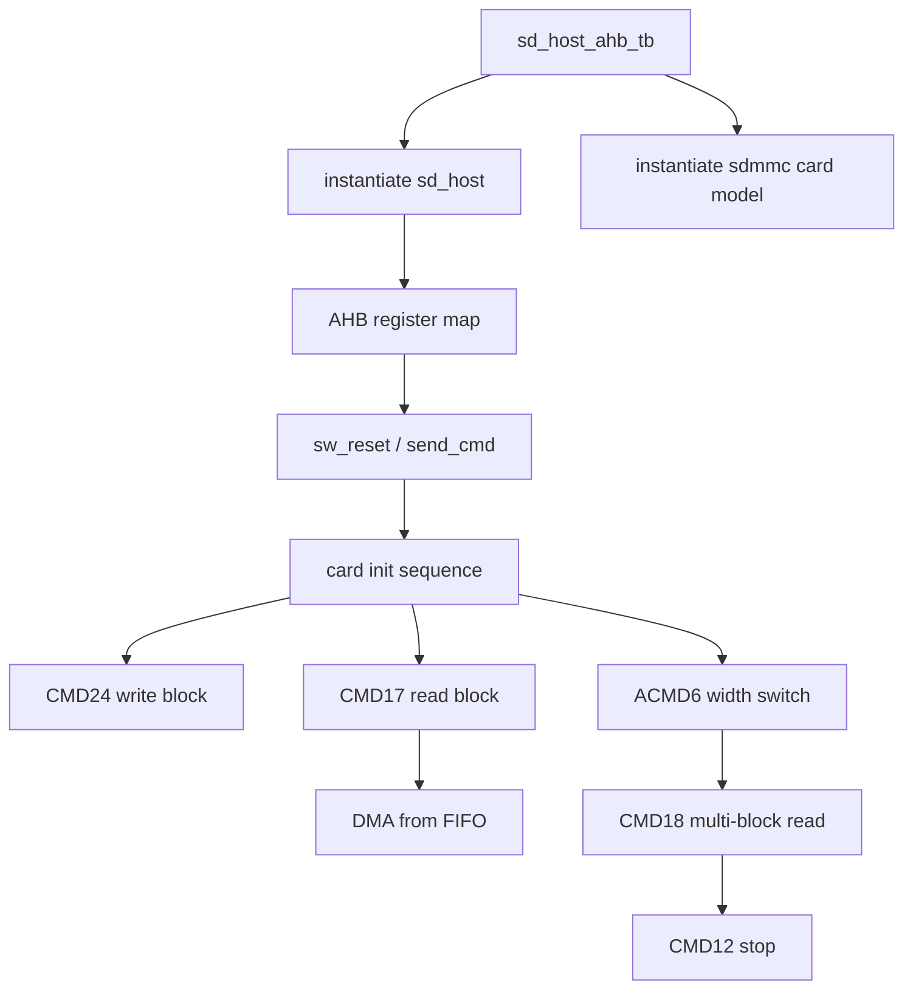

# 任务92：AHB sd host控制器设计29

## 本章知识全景图

这一讲把 SD Host 的 RTL 放进 `sd_host_ahb_tb.v` 里跑完整事务：testbench 先搭 AHB slave 访问环境和 SD card 模型，再用一组 `task` 封装寄存器读写、软复位、发命令，最后串起卡初始化、单块写、单块读、总线宽度切换和多块读。重点不是背寄存器地址，而是理解“软件如何通过 AHB 寄存器驱动 SD 协议和 DMA 数据搬运”。

核心概念：AHB testbench、SD 上拉、寄存器映射、`send_cmd`、`send_cmd_high`、`CMD55/ACMD41/CMD2/CMD3/CMD7`、`CMD24`、`CMD17`、`ACMD6`、`CMD18`、`CMD12`、DMA 地址和控制寄存器、中断等待与清除。

逻辑主线：AHB SD Host 的验证不是孤立检查某个模块，而是从软件视角写寄存器、发命令、等待中断、触发 DMA、观察数据线和完成标志；只有这个闭环成立，RTL 才接近真实驱动的使用方式。

### 概念地图



### 最短学习路径

1. 先把 testbench 的两端看清：一端模拟 AHB master 写寄存器，另一端接真实 SD card 模型。
2. 再把寄存器地址背后的功能归类：时钟、命令、块参数、传输模式、响应、中断、FIFO、DMA。
3. 最后按事务走：初始化命令序列 -> 数据命令 -> 等中断 -> DMA -> 清中断 -> 检查完成。

## 全视频地图

| 时间 | 画面锚点 | 学习任务 |
|---|---|---|
| 03:00-04:00 | 任务92：testbench 顶层和 SD 总线上拉 | 围绕截图中的代码、波形或课件结论核对本节主线 |
| 08:00-09:00 | 任务92：AHB SD Host 寄存器地址表 | 围绕截图中的代码、波形或课件结论核对本节主线 |
| 18:00-19:00 | 任务92：send_cmd 封装命令发送流程 | 围绕截图中的代码、波形或课件结论核对本节主线 |
| 33:00-34:00 | 任务92：初始化和数据事务主流程 | 围绕截图中的代码、波形或课件结论核对本节主线 |
| 33:00-34:00 | 任务92：CMD24 单块写和 DMA 完成等待 | 围绕截图中的代码、波形或课件结论核对本节主线 |
| 43:00-44:00 | 任务92：CMD17 单块读等待 FIFO 满后 DMA | 围绕截图中的代码、波形或课件结论核对本节主线 |
| 43:00-44:00 | 任务92：ACMD6 和 CMD18 多块读流程 | 围绕截图中的代码、波形或课件结论核对本节主线 |
| 28:00-29:00 | 任务92：初始化和 CMD24 前后代码细节 | 围绕截图中的代码、波形或课件结论核对本节主线 |


## 截图证据链

| 截图 | 视频核对 | 证据职责 | 阅读时要核对什么 |
|---|---|---|---|
| task92_03m00s.jpg | 03:00-04:00 | 任务92：testbench 顶层和 SD 总线上拉 | 用作正文对应段落的视觉证据，重点核对信号名、状态名、波形边界或公式变量 |
| task92_08m00s.jpg | 08:00-09:00 | 任务92：AHB SD Host 寄存器地址表 | 用作正文对应段落的视觉证据，重点核对信号名、状态名、波形边界或公式变量 |
| task92_18m00s.jpg | 18:00-19:00 | 任务92：send_cmd 封装命令发送流程 | 用作正文对应段落的视觉证据，重点核对信号名、状态名、波形边界或公式变量 |
| task92_33m00s.jpg | 33:00-34:00 | 任务92：初始化和数据事务主流程 | 用作正文对应段落的视觉证据，重点核对信号名、状态名、波形边界或公式变量 |
| task92_33m00s.jpg | 33:00-34:00 | 任务92：CMD24 单块写和 DMA 完成等待 | 用作正文对应段落的视觉证据，重点核对信号名、状态名、波形边界或公式变量 |
| task92_43m00s.jpg | 43:00-44:00 | 任务92：CMD17 单块读等待 FIFO 满后 DMA | 用作正文对应段落的视觉证据，重点核对信号名、状态名、波形边界或公式变量 |
| task92_43m00s.jpg | 43:00-44:00 | 任务92：ACMD6 和 CMD18 多块读流程 | 用作正文对应段落的视觉证据，重点核对信号名、状态名、波形边界或公式变量 |
| task92_28m00s.jpg | 28:00-29:00 | 任务92：初始化和 CMD24 前后代码细节 | 用作正文对应段落的视觉证据，重点核对信号名、状态名、波形边界或公式变量 |


## 1. testbench 同时搭了 AHB 侧和 SD 卡侧

`sd_host_ahb_tb.v` 的顶层不是只例化 DUT，还把 SD 命令线和数据线建成带上拉的双向总线。截图中 `sd_cmd`、`sd_dat0` 到 `sd_dat7` 都通过 `pullup` 拉高，DUT `sd_host` 和 `sdmmc_device` 共享这些线。

视觉核对：03:00-08:00，画面显示 `pullup pu1(sd_cmd)`、`pullup pu2(sd_dat0)` 到 `pu9(sd_dat7)`，以及 `sd_host U_sd_host_h` 的端口连接。


视频核对：03:00-04:00，这张图用于核对“任务92：testbench 顶层和 SD 总线上拉”对应的代码、波形或课件证据。

SD 的 CMD/DAT 线不是普通单向线。Host 发命令时驱动 CMD，卡响应时驱动 CMD；读数据时卡驱动 DAT，写数据时 Host 驱动 DAT。testbench 如果不用 `inout + pullup` 建模，会把总线释放、上拉空闲、方向切换这些协议边界掩盖掉。

## 2. 寄存器映射把“软件动作”变成 RTL 输入

课程列出一组 8-bit offset 常量：时钟控制、软件复位、命令参数、命令寄存器、块大小、块数量、传输模式、响应寄存器、中断状态和 mask、RX/TX FIFO、DMA 地址、DMA 控制、清中断等。testbench 后续所有动作都通过这些地址完成。

视觉核对：08:00-13:00，画面显示 `CLOCK_CONTROL_REGISTER_ADDR = 8'h00` 到 `CLK_EN_SPEED_UP_ADDR = 8'h50` 的寄存器地址定义。


视频核对：08:00-09:00，这张图用于核对“任务92：AHB SD Host 寄存器地址表”对应的代码、波形或课件证据。

常用寄存器分组：

| 分组 | 代表寄存器 | 验证作用 |
|---|---|---|
| 时钟/复位 | `CLOCK_CONTROL_REGISTER_ADDR`、`SOFTWARE_RESET_REGISTER_ADDR` | 控制 SDCLK 和清空内部状态 |
| 命令 | `ARGUMENT_REGISTER_ADDR`、`COMMAND_REGISTER_ADDR` | 触发 CMD 发送、指定响应类型和数据阶段 |
| 数据参数 | `BLOCK_SIZE_REGISTER_ADDR`、`BLOCK_COUNT_REGISTER_ADDR`、`TRANSFER_MODE_REGISTER_ADDR` | 描述块长度、块数、读写方向和位宽 |
| 中断 | `INTERRUPT_STATUS_REGISTER_ADDR`、`INT_GEN_REG_ADDR`、`CLR_INT_REG_ADDR` | 等待命令完成、FIFO 满空、DMA 完成 |
| DMA/FIFO | `RX_FIFO_ADDR`、`TX_FIFO_ADDR`、`DMA_ADDR_ADDR`、`DMA_CTRL_ADDR` | 在 SD 数据路径和 AHB 存储空间之间搬运数据 |

## 3. `send_cmd` 是命令事务的最小驱动模型

`send_cmd` 把一次命令发送封装成固定步骤：先关 SD 时钟，重新配置并打开时钟；再打开中断 mask；随后写 `COMMAND_REGISTER_ADDR` 配置命令字段，最后写 `ARGUMENT_REGISTER_ADDR` 触发发送，等待 `irq` 后读取中断状态。

视觉核对：18:00-23:00，画面显示 `send_cmd(input [5:0] cmd_index, input [31:0] argument, input [1:0] resp_type, input data_present)` 的实现。


视频核对：18:00-19:00，这张图用于核对“任务92：send_cmd 封装命令发送流程”对应的代码、波形或课件证据。

最小命令流程：

```text
ahb_write(CLOCK_CONTROL, 0x0000)   // 关 clock
ahb_write(CLOCK_CONTROL, 0x4004)   // 分频并开 clock
ahb_write(INTERRUPT_STATUS_MASK, 0x2ffe)
ahb_write(COMMAND_REGISTER, {cmd_index, data_present, resp_type})
ahb_write(ARGUMENT_REGISTER, argument)  // 触发命令
wait(irq)
ahb_read(INTERRUPT_STATUS, rdata)
```

这个封装暴露了 SD Host 的软件模型：命令本体和参数不是同一拍写完后自然生效，而是由寄存器写入顺序定义触发点。若 RTL 把 `COMMAND_REGISTER` 写入当作触发，后续 `ARGUMENT_REGISTER` 还没更新时就会发送旧参数。

## 4. 初始化序列把 SD 卡带到可传输状态

testbench 中的初始化先走 `CMD55/ACMD41`，再读 CID、分配 RCA、选卡：`CMD2` 获取 CID，`CMD3` 分配相对地址，`CMD7` 选中卡进入 transfer state。代码里每个命令后都插入一定延迟，模拟真实卡状态转换。

视觉核对：33:00 左右的主流程里可以看到 `send_cmd(6'd55...)`、`send_cmd(6'd41...)`、`send_cmd(6'd2...)`、`send_cmd(6'd3...)`、`send_cmd(6'd7...)`。


视频核对：33:00-34:00，这张图用于核对“任务92：初始化和数据事务主流程”对应的代码、波形或课件证据。

初始化链路的控制含义：

| 命令 | 作用 | 结果检查 |
|---|---|---|
| `CMD55` | 声明下一条是应用命令 | 后续 ACMD 才合法 |
| `ACMD41` | 查询/设置卡工作条件 | 卡从 idle 进入 ready 条件 |
| `CMD2` | 获取 CID | 长响应路径要正确 |
| `CMD3` | 获取/分配 RCA | 后续选卡使用 RCA |
| `CMD7` | 选中卡 | 卡进入可数据传输路径 |

如果初始化没有闭合，后面的 `CMD24/CMD17/CMD18` 即使 testbench 写了寄存器，也不应当被当成有效数据传输。

## 5. 单块写 `CMD24`：先配置数据参数，再启动 DMA

`CMD24` 写单块前，testbench 配置 `BLOCK_SIZE=0x200`、`BLOCK_COUNT=1`、`TRANSFER_MODE=2`，打开 `INT_GEN_REG=0x111` 使能 FIFO 满/空和 DMA finish 中断，然后用 `send_cmd_high(6'd24, ..., data_present=1)` 发带数据阶段的命令。命令发出后，再写 `DMA_ADDR_ADDR=0` 和 `DMA_CTRL_ADDR=0x2000001` 启动 DMA，等待 `dma_finish_int`，清中断，再等 `transfer_complete`。

视觉核对：33:00，画面高亮 `send_cmd_high(6'd24...)` 和后续 `DMA_ADDR/DMA_CTRL/dma_finish_int/transfer_complete`。


视频核对：33:00-34:00，这张图用于核对“任务92：CMD24 单块写和 DMA 完成等待”对应的代码、波形或课件证据。

写单块的关键顺序：

```text
set block_size = 512
set block_count = 1
set transfer_mode = write path configuration
enable fifo/dma interrupts
send CMD24 with data_present=1
write DMA_ADDR
write DMA_CTRL to start DMA
wait dma_finish_int
clear dma finish interrupt
wait transfer_complete
```

这里不能先启动 DMA 再发 `CMD24`。写数据路径需要 SD 数据 FSM、FIFO、DMA 和命令响应共同进入正确窗口，提前 DMA 可能把 FIFO 填入了一个没有被卡接收的数据阶段。

## 6. 单块读 `CMD17`：FIFO 满中断是 DMA 读出的触发点

单块读的寄存器配置同样使用 `BLOCK_SIZE=0x200`、`BLOCK_COUNT=1`，但 `TRANSFER_MODE` 改为读方向配置。发 `CMD17` 后，testbench 不是马上写 DMA 控制，而是先等待 `fifo_full_int`，表示 SD 接收侧已经把一个块或足够数据推入 FIFO，再启动 DMA 把 FIFO 数据搬到 AHB 地址空间。

视觉核对：33:00-43:00，画面显示 `send_cmd_high(6'd17...)`、等待 `fifo_full_int`、写 `DMA_ADDR_ADDR` 和 `DMA_CTRL_ADDR=32'h2000011`。


视频核对：43:00-44:00，这张图用于核对“任务92：CMD17 单块读等待 FIFO 满后 DMA”对应的代码、波形或课件证据。

读方向的核心差别：

| 写块 `CMD24` | 读块 `CMD17` |
|---|---|
| DMA 先把内存数据送入 TX/FIFO，供 SD 数据发送 | SD 数据先进入 RX/FIFO，再由 DMA 搬到内存 |
| 主要等 DMA finish 和 transfer complete | 先等 FIFO full，再启动 DMA，再等 DMA finish |
| 出错常见在写数据窗口对不上 | 出错常见在读数据有效、FIFO 满、DMA 方向配置 |

## 7. 多块读 `CMD18` 要循环 DMA，并用 `CMD12` 停止

多块读前，testbench 通过 `CMD55 + ACMD6` 切到 4-bit 总线宽度；随后配置 `BLOCK_SIZE=0x200`、`BLOCK_COUNT=2`、`TRANSFER_MODE=1`，发 `CMD18`。因为有两个块，代码用 `for(block_index=0; block_index<2; block_index++)` 循环：每次等 `fifo_full_int`，写 DMA 地址和控制，等 `dma_finish_int`，清中断。数据流结束后发 `CMD12` 停止传输。

视觉核对：43:00，画面显示 `send_cmd(6'd55)`、`send_cmd(6'd6, 32'h2)`、`send_cmd_high(6'd18...)` 和循环 DMA 结构。


视频核对：43:00-44:00，这张图用于核对“任务92：ACMD6 和 CMD18 多块读流程”对应的代码、波形或课件证据。

多块读的验证点：

1. `ACMD6` 后数据线应按 4-bit 路径工作，不能仍只看 `DAT0`。
2. 每个块都要有自己的 FIFO 满事件和 DMA 完成事件。
3. `block_index` 必须随块递增，避免只验证第一块。
4. `CMD12` 是协议 stop，不是 testbench 结束语句；未发 stop 就不能认为 `CMD18` 自然结束。

## 8. 从 testbench 到驱动模型

这一讲的真正产物是一套可迁移的软件驱动流程。未来写裸机驱动或 SoC 验证时，可以把 testbench 的 `ahb_write/ahb_read/send_cmd` 对应到 CPU MMIO 访问：

```text
mmio_write(clock_ctrl)
mmio_write(interrupt_mask)
mmio_write(command_cfg)
mmio_write(argument)      // trigger
wait_irq()
status = mmio_read(int_status)
if data command:
    wait fifo event or start DMA
    wait dma finish
    clear interrupt
```

RTL 验证的完成标准不是“代码跑到 `$finish`”，而是每个软件可见状态都能解释：命令完成中断为什么来、FIFO 为什么满、DMA 为什么结束、清中断后为什么不会重复触发。

## 9. 全视频结构地图：从寄存器驱动到真实 SD 事务

这讲的教学顺序是“先建驱动工具，再用工具跑协议”。`ahb_write/ahb_read` 是最底层动作，`send_cmd` 是命令级动作，`CMD24/CMD17/CMD18` 是数据级动作，DMA 和中断把数据搬运结果反馈给软件。

| 视频段落 | 画面证据 | 学习重点 |
|---|---|---|
| 03:00-08:00 | DUT、card model、pullup | SD 总线要按双向上拉建模 |
| 08:00-13:00 | 寄存器地址表 | 软件通过 MMIO 控制 Host |
| 18:00-23:00 | `send_cmd` task | 命令配置与 argument 触发顺序 |
| 28:00-33:00 | 初始化与 `CMD24` 代码 | 卡状态从 init 到 data transfer |
| 33:00-38:00 | `CMD24/CMD17` | 写路径和读路径的 DMA 触发不同 |
| 43:00 | `ACMD6/CMD18/CMD12` | 多块读需要循环服务和 stop 命令 |


视频核对：28:00-29:00，这张图用于核对“任务92：初始化和 CMD24 前后代码细节”对应的代码、波形或课件证据。

这张图补充了一个重要细节：初始化并不是直接 `ACMD41` 一次结束，而是先 `CMD0`、`CMD55/ACMD41`，等待卡初始化，再重复应用命令并继续 `CMD2/CMD3/CMD7`。真实驱动也常采用轮询方式等待卡 ready，testbench 用延迟和重复命令模拟这个过程。

## 10. `send_cmd` 与 `send_cmd_high` 的区别要从数据阶段理解

截图里同时出现 `send_cmd` 和 `send_cmd_high`。从使用方式看，普通初始化命令多用 `send_cmd`，带数据阶段的 `CMD24/CMD17/CMD18` 使用 `send_cmd_high`。学习时不要把它们理解成两个随意命名的 task，而要看它们承担的协议层级：

| task | 典型命令 | 数据阶段 | 主要检查 |
|---|---|---|---|
| `send_cmd` | `CMD55`、`ACMD41`、`CMD2`、`CMD3`、`CMD7`、`ACMD6` | 无或只关注响应 | `irq`、响应寄存器、卡状态 |
| `send_cmd_high` | `CMD24`、`CMD17`、`CMD18` | 有 | 命令响应、DAT 窗口、FIFO、DMA、完成中断 |

如果数据命令仍按普通命令思路验证，只会确认 CMD 线响应，看不到 DAT 线、FIFO 和 DMA 是否真正完成。

## 11. 寄存器配置值要按“场景”解释

`TRANSFER_MODE_REGISTER` 和 `DMA_CTRL` 的数值不要孤立背。它们在 testbench 里始终和命令场景绑定：

| 场景 | 命令 | 块参数 | 传输模式 | 等待事件 | DMA 行为 |
|---|---|---|---|---|---|
| 单块写 | `CMD24` | size=`0x200`，count=`1` | 写方向 | `dma_finish_int`、`transfer_complete` | DMA 供数给写卡路径 |
| 单块读 | `CMD17` | size=`0x200`，count=`1` | 读方向 | `fifo_full_int` 后 `dma_finish_int` | DMA 从读 FIFO 搬出 |
| 多块读 | `CMD18` | size=`0x200`，count=`2` | 读方向/多块 | 每块 `fifo_full_int`，最后 `CMD12` | 每块循环 DMA |

这样读代码时不会把 `0x2000001`、`0x2000011` 这类值当作魔数。它们是“本场景启动 DMA 的控制字”，真正要核对的是方向、长度、启动位和完成中断是否与场景一致。

## 12. 本讲最小可复现实验

后续重跑这个 testbench，最低限度要保留三组实验：

1. 初始化实验：观察 `CMD55/ACMD41/CMD2/CMD3/CMD7` 后卡能进入 transfer state。
2. 单块读写实验：分别跑 `CMD24` 和 `CMD17`，确认写路径等 `transfer_complete`，读路径先等 `fifo_full_int`。
3. 多块读实验：`ACMD6` 切 4-bit，`CMD18` 连续读两块，循环 DMA，最后 `CMD12` 停止。

每组实验都要读回中断状态并清中断。只靠 `wait(signal)` 不读寄存器，会让 testbench 脱离真实软件驱动模型。

## 截图证据链与重读结论

这一讲的截图要按“软件驱动模型”重读：testbench 不是随便写几个寄存器，而是在模拟 CPU 通过 AHB MMIO 驱动 SD Host。每张图都应回答一个问题：这一步把 SD 协议、寄存器配置、DMA 或中断闭合到了哪里。

| 截图 | 证据职责 | 重读结论 | 不能推出什么 |
|---|---|---|---|
| `task92_03m00s.jpg` | DUT、SD card model、CMD/DAT pullup | testbench 同时建了 Host 侧和 Card 侧，双向线必须有空闲上拉。 | 不能证明协议序列已经正确，只证明环境边界成立。 |
| `task92_08m00s.jpg` | AHB 寄存器地址表 | 软件动作最终都落到 MMIO 地址和字段配置。 | 不能孤立背地址，必须和事务场景绑定。 |
| `task92_18m00s.jpg` | `send_cmd` task | 命令配置先稳定，写 argument 触发发送。 | 不能把 `send_cmd` 当成真实驱动全部；数据事务还要 DMA 和中断等待。 |
| `task92_28m00s.jpg` | 初始化和 CMD24 前后代码 | 卡初始化、单块写开始形成可执行序列。 | 不能只看命令名，必须看每个命令前后的寄存器配置。 |
| `task92_33m00s.jpg` | CMD24/CMD17 数据事务 | 单块写和单块读共享块参数，但等待事件不同。 | 不能用 `dma_finish_int` 替代 `transfer_complete`。 |
| `task92_38m00s.jpg` | 后续数据事务片段 | 多个命令被组织成连续驱动流程。 | 不能证明多块读完整结束，还要看 `CMD12` 和块循环。 |
| `task92_43m00s.jpg` | CMD17/CMD18 等待和 DMA | 读路径先等 FIFO 数据，再启动 DMA；多块读需要循环服务。 | 不能把 FIFO 满理解成最终完成，它只是服务触发点。 |

工程闭环：后续把 testbench 迁移成裸机驱动时，保留的不是 Verilog task 语法，而是 `写配置 -> 写 argument 触发 -> 等中断 -> 读状态 -> 清中断 -> DMA 服务` 这条软件协议。

## 深层理解：testbench 是软件驱动的排练场

本讲的 testbench 不只是“为了仿真写的一段脚本”，它更像一个还没有 CPU 的软件驱动排练场。每一次 `ahb_write` 都是在模拟 CPU 通过 MMIO 写寄存器；每一次 `wait(fifo_full_int)` 或 `wait(dma_finish_int)` 都是在模拟驱动等待硬件事件；`send_cmd` 则是把命令寄存器配置、argument 触发和响应等待包装成一个可复用动作。

这层理解能防止三个误读：

| 误读 | 为什么错 | 正确口径 |
|---|---|---|
| `send_cmd` 发完就等于事务完成 | 只有命令阶段完成，数据阶段还要 DMA/FIFO/transfer complete | 命令、数据、搬运、中断要分层看 |
| FIFO 满就是读完成 | FIFO 满只说明 Host 收到一批可搬数据 | 后续还要 DMA 搬出、清中断、可能继续下一块 |
| 多块读靠 block count 自然结束 | `CMD18` 需要 `CMD12` 停止传输 | 块循环和停止命令必须一起验证 |

可以把 SD Host testbench 想成舞台排练：寄存器写入是演员走位，CMD/DAT 波形是正式台词，DMA 是后台搬景，中断是场务打铃。只看某一个动作都不能证明整场戏闭合，必须看它们是否按顺序接上。

## 自测题

1. `sd_cmd` 和 `sd_dat` 为什么要在 testbench 里加 `pullup`？
2. `send_cmd` 为什么最后写 `ARGUMENT_REGISTER_ADDR`？
3. `CMD24` 单块写为什么要等待 `dma_finish_int` 后再等 `transfer_complete`？
4. `CMD17` 单块读为什么先等 `fifo_full_int`？
5. 多块读为什么需要 `CMD12`？

## 自测参考答案与判分点

1. 答：SD CMD/DAT 是双向总线，空闲和释放时依靠上拉保持高电平。加 `pullup` 才能验证 Host/Card 方向切换和高阻释放行为。
   判分点：能指出关键条件、边界和失败后果；只写名词或只说现象不得满分。

2. 答：本设计把写 argument 当作命令发送触发点。这样命令配置先稳定，参数最后写入并触发，避免发送旧参数或未完整配置的命令。
   判分点：能指出关键条件、边界和失败后果；只写名词或只说现象不得满分。

3. 答：`dma_finish_int` 表示 DMA 搬运完成，`transfer_complete` 表示 SD 数据传输事务完成。两者分别覆盖总线搬运和 SD 协议数据阶段，不能互相替代。
   判分点：能指出关键条件、边界和失败后果；只写名词或只说现象不得满分。

4. 答：读数据先从卡进入 RX FIFO。只有 FIFO 里已有可搬运数据时，启动 DMA 才能把有效数据搬到 AHB 地址空间。
   判分点：能指出关键条件、边界和失败后果；只写名词或只说现象不得满分。

5. 答：`CMD18` 会让卡连续输出多个数据块，停止条件由 `CMD12(STOP_TRANSMISSION)` 给出。块计数只帮助 Host 决定何时发 stop，不能代替协议命令。
   判分点：能指出关键条件、边界和失败后果；只写名词或只说现象不得满分。

## 工程核对口径

把本讲 testbench 改成真实驱动思维时，应能写出三条最小事务链：

1. 初始化链：`CMD0/CMD8/CMD55/ACMD41/CMD2/CMD3/CMD7` 让卡进入可传输状态。
2. 单块写链：配置块参数和写方向，`CMD24` 后由 DMA 供数，再等 SD 侧 `transfer_complete`。
3. 多块读链：配置 4-bit 和读方向，`CMD18` 后每块等 FIFO 事件并服务 DMA，最后 `CMD12` 停止。

失败定位按“前级先成立，后级再追”的顺序走：命令没响应先查 CMD 配置和 argument 触发；响应正确但没数据先查 `TRANSFER_MODE` 和 DAT FSM；FIFO 有数据但内存没变再查 DMA；DMA 完成但协议没结束再查 `transfer_complete/CMD12`。这条顺序像查水管漏点，从水源、阀门、管道到水桶逐段排查，不能一上来就怀疑最后一个桶。

