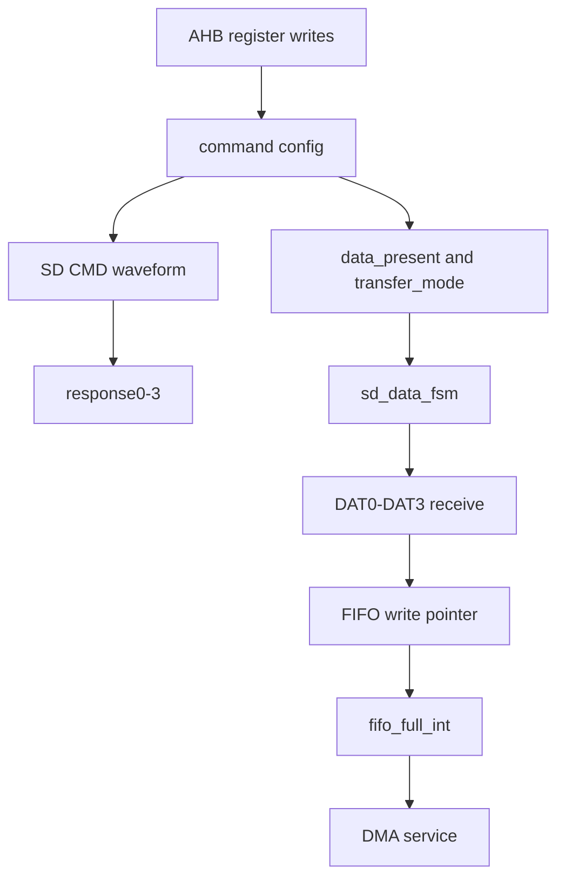

# 任务93：AHB sd host控制器设计30

## 本章知识全景图

这一讲进入 Verdi 波形调试：把 `sd_host_ahb_tb.v` 的寄存器写入、`sd_if.v` 的中断汇总、命令响应寄存器、SD CMD/DAT 波形、数据状态机和 FIFO 满信号放到同一条验证链里看。重点不是单看某个信号跳变，而是确认软件寄存器配置能真实驱动 SD 协议、数据状态机和 DMA/FIFO 事件。

核心概念：Verdi 层次定位、AHB 寄存器写入波形、`irq` 汇总、`response0-3`、SD 命令线、`DATA_STATE_*`、4-bit 数据接收、FIFO gray pointer、`fifo_full_int`、`dma_finish_int`。

逻辑主线：SD Host 的验证必须跨层观察。AHB 写寄存器只是起点；正确结果要同时反映在命令响应寄存器、SD 线上真实帧、数据状态机计数、FIFO 满事件和 DMA 完成事件上。

### 概念地图



### 最短学习路径

1. 先在 Verdi 层次树里定位 `ahb_sd_tb -> U_sd_host_h -> U_sd_top`，把 testbench、DUT 和 card model 串起来。
2. 再用 AHB 写寄存器波形确认命令配置是否按预期进入 DUT。
3. 最后用 SD CMD/DAT、`response0-3`、数据 FSM、FIFO 满和 DMA 完成信号闭合结果。

## 全视频地图

| 时间 | 画面锚点 | 学习任务 |
|---|---|---|
| 03:00-04:00 | 任务93：Verdi 层次和编译结果 | 围绕截图中的代码、波形或课件结论核对本节主线 |
| 08:00-09:00 | 任务93：irq 汇总逻辑和 AHB 寄存器波形 | 围绕截图中的代码、波形或课件结论核对本节主线 |
| 23:00-24:00 | 任务93：命令响应寄存器和 SD CMD 波形 | 围绕截图中的代码、波形或课件结论核对本节主线 |
| 38:00-39:00 | 任务93：数据状态机状态编码和波形 | 围绕截图中的代码、波形或课件结论核对本节主线 |
| 43:00-44:00 | 任务93：接收位数计数和数据状态切换 | 围绕截图中的代码、波形或课件结论核对本节主线 |
| 47:00-48:00 | 任务93：FIFO 满判断和 DMA 事件 | 围绕截图中的代码、波形或课件结论核对本节主线 |
| 13:00-14:00 | 任务93：AHB 长时间轴与 IRQ 关系 | 围绕截图中的代码、波形或课件结论核对本节主线 |
| 33:00-34:00 | 任务93：TRANSFER_MODE 方向和位宽回到波形解释 | 围绕截图中的代码、波形或课件结论核对本节主线 |


## 截图证据链

| 截图 | 视频核对 | 证据职责 | 阅读时要核对什么 |
|---|---|---|---|
| task93_03m00s.jpg | 03:00-04:00 | 任务93：Verdi 层次和编译结果 | 用作正文对应段落的视觉证据，重点核对信号名、状态名、波形边界或公式变量 |
| task93_08m00s.jpg | 08:00-09:00 | 任务93：irq 汇总逻辑和 AHB 寄存器波形 | 用作正文对应段落的视觉证据，重点核对信号名、状态名、波形边界或公式变量 |
| task93_23m00s.jpg | 23:00-24:00 | 任务93：命令响应寄存器和 SD CMD 波形 | 用作正文对应段落的视觉证据，重点核对信号名、状态名、波形边界或公式变量 |
| task93_38m00s.jpg | 38:00-39:00 | 任务93：数据状态机状态编码和波形 | 用作正文对应段落的视觉证据，重点核对信号名、状态名、波形边界或公式变量 |
| task93_43m00s.jpg | 43:00-44:00 | 任务93：接收位数计数和数据状态切换 | 用作正文对应段落的视觉证据，重点核对信号名、状态名、波形边界或公式变量 |
| task93_47m00s.jpg | 47:00-48:00 | 任务93：FIFO 满判断和 DMA 事件 | 用作正文对应段落的视觉证据，重点核对信号名、状态名、波形边界或公式变量 |
| task93_13m00s.jpg | 13:00-14:00 | 任务93：AHB 长时间轴与 IRQ 关系 | 用作正文对应段落的视觉证据，重点核对信号名、状态名、波形边界或公式变量 |
| task93_33m00s.jpg | 33:00-34:00 | 任务93：TRANSFER_MODE 方向和位宽回到波形解释 | 用作正文对应段落的视觉证据，重点核对信号名、状态名、波形边界或公式变量 |


## 1. Verdi 调试从层次和编译清单开始

画面中 Verdi 加载 `ahb_sd_tb`，左侧能看到 `ahb_read/ahb_write/send_cmd/send_cmd_high/sw_reset` 这些 testbench task，也能看到 `U_sd_card` 和 `U_sd_host_h` 两个关键实例。消息窗口显示多个 RTL 文件被 source，最后 compile/link 均为 0 error、0 warning。

视觉核对：03:00，画面显示 Verdi 层次树和编译日志，包含 `sd_cmd_receive_shift_register.v`、`sd_data_fsm.v`、`sd_dma.v`、`sd_if.v`、`sd_top.v`、`fifo` 等文件。


视频核对：03:00-04:00，这张图用于核对“任务93：Verdi 层次和编译结果”对应的代码、波形或课件证据。

这一步的验证意义很直接：如果层次树里没有 card model，CMD/DAT 波形只能说明 Host 自己在动；如果没有 FIFO/DMA 子模块，数据闭环不完整。Verdi 调试的第一件事是确认“观察对象齐全”。

## 2. `irq` 是多个事件的或逻辑，不是单一完成信号

`sd_if.v` 中的 `irq` 由多个中断源和 mask 组合而成，包括 `dma_finish_int`、命令响应结束、FIFO empty/full、命令完成、传输完成、CRC error、response timeout、read timeout 等。波形中同时放了 AHB 寄存器写入和 `irq`，用于确认命令发送后中断是否按软件期望出现。

视觉核对：08:00-13:00，画面显示 `assign irq = (...)` 的多项或逻辑，下方波形显示 `hwrite/htrans/haddr/hwdata/hrdata/irq`。


视频核对：08:00-09:00，这张图用于核对“任务93：irq 汇总逻辑和 AHB 寄存器波形”对应的代码、波形或课件证据。

关键判断口径：

| 信号 | 验证问题 |
|---|---|
| `haddr` | 软件写到了哪个寄存器 |
| `hwdata` | 写入值是否对应命令、参数、mask 或 DMA 控制 |
| `irq` | 有无事件到达软件可见层 |
| `hrdata` | 读响应或中断状态是否与波形一致 |
| interrupt mask | 中断未出现时先检查是否被 mask |

不能把 `irq=1` 直接解释为“命令成功”。它只说明至少一个未屏蔽事件发生；真正原因要继续看中断状态和对应内部事件。

## 3. `response0-3` 把 CMD 响应从串行线变成软件可读寄存器

`sd_cmd_receive_shift_register` 的端口包括 `in_serial_cmd`、`in_longresponse`、`out_cmd_receive_crc_error` 和 `response0-3`。波形中 `sd_cmd` 串行跳变后，`response0-3` 出现 CID/RCA/状态等响应内容，说明命令响应接收链路已经从物理串行线进入寄存器层。

视觉核对：23:00，画面显示 `sd_cmd_receive_shift_register` 模块端口和 `response0[31:0]` 到 `response3[31:0]` 的波形。


视频核对：23:00-24:00，这张图用于核对“任务93：命令响应寄存器和 SD CMD 波形”对应的代码、波形或课件证据。

响应验证要分三层：

1. SD CMD 线上是否出现卡返回的响应帧。
2. 接收移位寄存器是否按位计数并完成 CRC 检查。
3. `response0-3` 是否能被 AHB 读出，供软件判断卡状态。

如果只看 `irq` 或只看 `response0`，无法区分“卡没响应”“接收位数错”“CRC 错”“寄存器映射错”这几类问题。

## 4. 数据 FSM 的状态编码对应真实 DAT 线窗口

`sd_define.v` 中列出命令和数据状态：`DATA_STATE_IDLE`、`WAIT_RECEIVE`、`RECEIVE`、`RECEIVE_CRC`、`RECEIVE_END_BIT`、`WAIT_SEND`、`SEND`、`SEND_CRC`、`SEND_END_BIT`、`RECEIVE_CRC_STATUS`、`SEND_BUSY`。波形里 `current_state[3:0]` 跟 SD DAT 线同步变化，用于定位数据接收或发送阶段。

视觉核对：38:00，画面显示 `DATA_STATE_*` 宏定义和 `current_state[3:0]` 波形。


视频核对：38:00-39:00，这张图用于核对“任务93：数据状态机状态编码和波形”对应的代码、波形或课件证据。

数据状态机的核心价值是把 SD 数据帧拆成可验证窗口：

| 状态 | 作用 |
|---|---|
| `WAIT_RECEIVE` | 等待卡开始输出读数据 |
| `RECEIVE` | 接收 payload 数据位 |
| `RECEIVE_CRC` | 接收并校验数据 CRC |
| `RECEIVE_END_BIT` | 检查结束位 |
| `SEND/SEND_CRC` | 写数据时 Host 输出 payload 和 CRC |
| `SEND_BUSY` | 写后等待卡 busy 释放 |

数据错误通常不在“有没有 DAT 波形”本身，而在状态边界：起始位早采、payload 计数错、CRC 窗口错、结束位或 busy 处理不完整。

## 5. `need_to_receive_bit` 决定块接收长度

`sd_data_fsm.v` 中使用 `has_receive_bit` 和 `need_to_receive_bit` 判断何时从 `DATA_STATE_RECEIVE` 进入 `DATA_STATE_RECEIVE_CRC`。波形里可以看到 `sd_dat0-3` 的连续数据和接收计数推进。

视觉核对：43:00，代码高亮 `has_receive_bit == need_to_receive_bit - 1`，下方波形显示 SD 数据线长时间活动。


视频核对：43:00-44:00，这张图用于核对“任务93：接收位数计数和数据状态切换”对应的代码、波形或课件证据。

这里最容易犯的错误是忽略总线宽度。1-bit 模式下每个 SDCLK 只接收 1 bit；4-bit 模式下每个 SDCLK 接收 4 bit。`need_to_receive_bit` 必须和块大小、数据宽度匹配，否则状态机会提前进入 CRC 或多采 payload。

## 6. FIFO 满事件把 SD 数据接收和 DMA 服务连接起来

最后画面定位到 `wr_full.v`，显示异步 FIFO 写满判断：写指针转 gray 后与同步过来的读指针高位取反比较，生成 `full_val`，再寄存为 `wr_full`。波形中 `fifo_full`、`fifo_full_pulse`、`fifo_full_int`、`dma_finish_int` 与 `block_index` 同时出现，说明 SD 数据进入 FIFO 后触发 DMA 服务。

视觉核对：47:00，画面显示 `wptr_gray_nxt`、`full_val`、`wr_full` 逻辑和 FIFO/DMA 相关波形。


视频核对：47:00-48:00，这张图用于核对“任务93：FIFO 满判断和 DMA 事件”对应的代码、波形或课件证据。

FIFO 满判断的设计含义：

```verilog
full_val = (wptr_gray_temp_nxt == {~rptr_s2_reg[ADDRSIZE:ADDRSIZE-1],
                                   rptr_s2_reg[ADDRSIZE-2:0]});
```

异步 FIFO 不能直接用二进制读写指针跨时钟域比较。写时钟域用同步后的读指针 gray 码判断满，能降低跨域多 bit 同时变化带来的错误风险。这里连接到前面的视频主线：SDCLK 域把数据写 FIFO，AHB/HCLK 域通过 DMA 读出，跨域 FIFO 是两边速度和时钟差异的缓冲层。

## 7. 波形调试的最小闭环

这一讲给出一个可复用的 SD Host 调试顺序：

```text
AHB write command registers
  -> observe irq and interrupt source
  -> inspect SD CMD response waveform
  -> check response0-3
  -> inspect DATA_STATE transition
  -> check DAT payload and CRC window
  -> observe FIFO full/empty event
  -> trigger DMA and check dma_finish_int
```

只要其中一个环节断开，就不要直接改最后一个模块。比如 DMA 没完成，可能是 DMA 本身错，也可能是 FIFO 没满；FIFO 没满，可能是数据状态机没进入 RECEIVE；数据状态机没进入 RECEIVE，又可能是命令响应或 `data_present` 配置不对。

## 8. 全视频结构地图：Verdi 不是看波形，是做因果定位

这讲的画面在 testbench、`sd_if`、命令接收、数据 FSM、FIFO 之间切换，真正训练的是调试路径。调试时必须先问“当前失败属于哪一层”，再决定看哪个波形。

| 视频段落 | 画面证据 | 调试问题 |
|---|---|---|
| 03:00 | Verdi 层次树和编译日志 | 设计和模型是否完整加载 |
| 08:00-13:00 | AHB 写寄存器 + `irq` 汇总 | 软件写入是否触发了事件 |
| 18:00 | 长时间轴 AHB/IRQ | 命令之间的时间间隔是否合理 |
| 23:00 | `response0-3` + SD CMD | 响应是否从串行线进入寄存器 |
| 28:00 | testbench 中 `CMD24` 主流程 | 当前波形对应哪条命令 |
| 33:00 | `TRANSFER_MODE` 课件 | 方向和位宽如何解释数据波形 |
| 38:00-43:00 | `DATA_STATE_*` 和接收计数 | DAT payload、CRC 和 end bit 边界 |
| 47:00 | FIFO full gray pointer | SDCLK 域到 AHB 域的服务点 |


视频核对：13:00-14:00，这张图用于核对“任务93：AHB 长时间轴与 IRQ 关系”对应的代码、波形或课件证据。

长时间轴的价值是看事务之间的相对位置：AHB 写命令配置、`irq` 出现、`hrdata` 返回、中断清除是否在合理顺序中。如果只放大到一个 SDCLK 周期，反而会丢掉软件驱动层的因果关系。

## 9. 波形分组要按“问题域”组织

Verdi 调试时不建议把所有信号平铺。按问题域分组，才能从失败现象快速回溯：

| 分组 | 信号 | 说明 |
|---|---|---|
| AHB 软件层 | `hsel/hwrite/htrans/haddr/hwdata/hrdata/irq` | 判断寄存器访问和中断 |
| CMD 协议层 | `sd_clk/sd_cmd/response0-3/out_cmd_receive_crc_error` | 判断命令帧、响应、CRC |
| DAT 协议层 | `sd_dat0-3/current_state/has_receive_bit/need_to_receive_bit` | 判断数据块和 CRC 边界 |
| FIFO 层 | `wptr_gray_temp_nxt/rptr_s2_reg/fifo_full/fifo_full_int` | 判断跨时钟缓冲状态 |
| DMA 层 | `dma_finish_int/block_index` | 判断软件服务是否完成 |


视频核对：33:00-34:00，这张图用于核对“任务93：TRANSFER_MODE 方向和位宽回到波形解释”对应的代码、波形或课件证据。

`TRANSFER_MODE` 课件帧在这一讲中不是理论回顾，而是波形解释钥匙。看到 DAT0-DAT3 同时活动时，要回到 `data_width=1` 的配置；看到读写方向不符合预期时，要回到 `data_direction`。

## 10. 命令响应和数据响应不能混成一个“收到数据”

SD 事务至少有两种“收到”：

| 类型 | 线 | RTL 位置 | 软件可见结果 |
|---|---|---|---|
| 命令响应 | CMD | `sd_cmd_receive_shift_register` | `response0-3`、命令完成/错误中断 |
| 数据块 | DAT | `sd_data_fsm`、data receive shift register | FIFO 满、DMA 完成、transfer complete |

如果 `response0-3` 正确但 FIFO 不满，说明命令路径大概率通了，问题在数据阶段。反过来，如果 DAT 线有活动但 `response0-3` 不可信，可能是 testbench 时间轴已经错位，不能贸然相信数据块。

## 11. 从截图得到的调试优先级

本讲应按以下优先级定位失败：

1. `irq` 不来：先查 mask、命令触发顺序、argument 是否写入。
2. `irq` 来但响应寄存器不对：查 CMD 线、响应长度、CRC、移位计数。
3. 响应对但无数据：查 `data_present`、`TRANSFER_MODE`、数据 FSM 是否进入 `WAIT_RECEIVE/RECEIVE`。
4. 有数据但 FIFO 不满：查总线宽度、`need_to_receive_bit`、FIFO 写侧。
5. FIFO 满但 DMA 不完成：查 DMA 控制字、AHB master 授权、读写方向和中断清除。

这个顺序比随机加信号有效，因为每一步都基于上一层已经成立。

## 截图证据链与重读结论

这一讲的画面核心是 Verdi 因果定位。不要把截图当成“波形漂亮地跑起来了”，而要问：当前失败如果发生，应该从软件寄存器、CMD 协议、DAT 协议、FIFO 还是 DMA 哪一层回溯。

| 截图 | 证据职责 | 重读结论 | 不能推出什么 |
|---|---|---|---|
| `task93_03m00s.jpg` | Verdi 层次、编译结果、testbench task | 调试第一步是确认 DUT、card model 和 task 都在同一个可观察层次里。 | 不能证明功能正确，只证明仿真装载和层次可见。 |
| `task93_08m00s.jpg` | `irq` 汇总与寄存器波形 | `irq` 是多个事件的或逻辑，必须继续读状态源。 | 不能看到 `irq=1` 就说命令成功。 |
| `task93_13m00s.jpg` | AHB 长时间轴与 IRQ 关系 | 命令之间的间隔、触发顺序和中断清除要一起看。 | 不能只在局部放大窗口里判断完整事务。 |
| `task93_23m00s.jpg` | `response0-3` 与 CMD 波形 | CMD 串行响应被转换成软件可读寄存器，这是命令链闭合证据。 | 不能证明 DAT 数据阶段也正确。 |
| `task93_33m00s.jpg` | `TRANSFER_MODE` 方向和位宽 | 数据方向、1-bit/4-bit 位宽会改变 DAT 接收解释。 | 不能把 4-bit 数据窗口按 1-bit 计数理解。 |
| `task93_38m00s.jpg` | 数据 FSM 状态编码 | 数据阶段必须区分等待、接收 payload、接收 CRC、完成。 | 不能把“有波形”直接等价为“FIFO 内容正确”。 |
| `task93_43m00s.jpg` | `need_to_receive_bit` 与状态切换 | 接收位数是判断块边界和 CRC 边界的核心变量。 | 不能只用时间长度猜测块是否结束。 |
| `task93_47m00s.jpg` | FIFO 满判断和 DMA 事件 | SD 数据进入 FIFO 后，DMA 服务才有有效触发条件。 | 不能用 FIFO 满替代 DMA 完成。 |

工程闭环：调试顺序应固定为 `AHB 触发 -> irq 来源 -> response 寄存器 -> DAT 状态机 -> FIFO 事件 -> DMA 完成`。顺序反了，容易把后级无数据误判成前级命令失败。

## 深层理解：Verdi 调试是因果取证

Verdi 不是用来“看波形漂不漂亮”的，它更像一次数字电路现场取证：每个信号都是证词，但单个证词不能直接定案。`irq=1` 只是有人按响了门铃，必须继续查是谁按的；`response0-3` 说明 CMD 线的回信被收进寄存器，但不能证明 DAT 线已经搬完数据；FIFO 满说明水箱到达水位，不说明 DMA 已经把水抽走。

因此本讲应建立一条证据链，而不是堆信号：

| 证据层 | 要回答的问题 | 常见误判 |
|---|---|---|
| AHB 寄存器 | 软件是否真的触发命令/数据事务 | 只看 testbench task 名称 |
| IRQ 来源 | 哪个事件触发中断 | 把 `irq` 当成命令成功 |
| CMD 响应 | 响应长度、CRC、寄存器写回是否正确 | 响应对就认为数据也对 |
| DAT FSM | payload、CRC、busy 边界是否分清 | 把 CRC 当数据或漏收最后 bit |
| FIFO/DMA | 数据是否进入缓冲并被搬走 | FIFO 满替代 DMA 完成 |

好的波形调试像顺着脚印走雪地：每一步都要接在上一步后面。如果从 DMA 失败直接跳回命令失败，就会把后级 backpressure、FIFO 满判断或 `need_to_receive_bit` 边界错误误判成协议命令错误。

## 自测题

1. 为什么 `irq=1` 不能直接说明命令成功？
2. `response0-3` 的验证价值是什么？
3. 数据 FSM 为什么必须区分 `RECEIVE` 和 `RECEIVE_CRC`？
4. 4-bit 模式下 `need_to_receive_bit` 应怎样理解？
5. 异步 FIFO 满判断为什么使用 gray 指针？

## 自测参考答案与判分点

1. 答：`irq` 是多个未屏蔽中断源的或逻辑，可能来自命令响应、传输完成、FIFO 满空、DMA 完成或错误事件。必须读中断状态并对照内部信号确认来源。
   判分点：能指出关键条件、边界和失败后果；只写名词或只说现象不得满分。

2. 答：它证明 SD CMD 串行响应已经被接收、移位、校验并写入软件可读寄存器，是命令线到 AHB 软件层之间的闭环证据。
   判分点：能指出关键条件、边界和失败后果；只写名词或只说现象不得满分。

3. 答：payload 和 CRC 的含义不同。若状态边界错，控制器会把 CRC 当数据或把数据当 CRC，导致 FIFO 内容或错误标志不可信。
   判分点：能指出关键条件、边界和失败后果；只写名词或只说现象不得满分。

4. 答：它要和块大小、总线宽度共同匹配。4-bit 模式每个 SDCLK 接收 4 bit，同样 512 Byte 数据需要的时钟数比 1-bit 模式少。
   判分点：能指出关键条件、边界和失败后果；只写名词或只说现象不得满分。

5. 答：gray 码相邻值只有一位变化，适合跨时钟域同步后比较；直接跨域比较二进制指针可能在多 bit 同时变化时产生错误满/空判断。
   判分点：能指出关键条件、边界和失败后果；只写名词或只说现象不得满分。

## 工程核对口径

调试 SD Host 时，建议固定保存五组波形视图：

1. 软件视图：AHB 写寄存器、argument 触发、中断状态和清中断。
2. CMD 视图：`sd_cmd`、命令 FSM、响应移位、CRC 和 `response0-3`。
3. DAT 视图：`sd_dat`、数据 FSM、`need_to_receive_bit`、payload/CRC 边界。
4. FIFO 视图：写侧指针、读侧指针、gray 同步、满空事件。
5. DMA 视图：请求授权、地址、方向、计数、完成中断。

这五组视图像五层筛网：上一层筛不干净，下一层看到的异常就不可信。最终能说“问题在 DAT FSM”或“问题在 DMA 服务”之前，必须先说明前面哪些层已经用波形证明成立。

