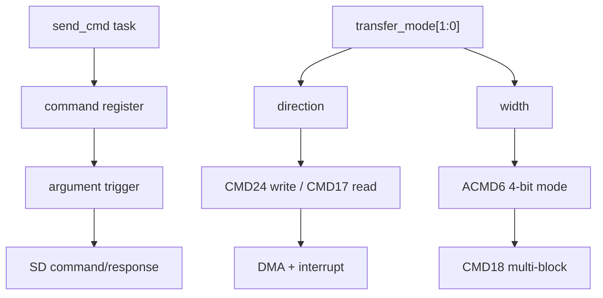

# 任务94：AHB sd host控制器设计31

## 本章知识全景图

这一讲继续用 testbench 和 Verdi 波形验证 SD Host 的数据事务，重点放在 `send_cmd` 封装、`TRANSFER_MODE_REGISTER` 位义、单块写 `CMD24`、单块读 `CMD17`、多块读 `CMD18`、AHB master DMA 波形和 SDCLK 频率观察。它把“寄存器配置值”与“真实 SD 线和 AHB 总线行为”对齐。

核心概念：`send_cmd` 触发顺序、`TRANSFER_MODE` 的 `data_direction/data_width`、`CMD24/CMD17/CMD18`、`fifo_full_int`、`dma_finish_int`、`transfer_complete`、AHB master 信号、SDCLK transition frequency。

逻辑主线：数据事务验证要同时检查两条总线：AHB 侧是否按寄存器配置和 DMA 控制发起访问，SD 侧是否按命令和传输模式产生 CMD/DAT 时序。

### 概念地图



### 最短学习路径

1. 确认 `send_cmd` 的寄存器写顺序：时钟、mask、命令配置、参数触发、等待中断。
2. 读懂 `TRANSFER_MODE_REGISTER` 两个低位：方向和位宽决定后续数据路径。
3. 用波形验证 `CMD24/CMD17/CMD18` 是否分别对应写块、读块和多块读。

## 全视频地图

| 时间 | 画面锚点 | 学习任务 |
|---|---|---|
| 03:00-04:00 | 任务94：send_cmd 命令封装 | 围绕截图中的代码、波形或课件结论核对本节主线 |
| 08:00-09:00 | 任务94：TRANSFER_MODE 寄存器位义 | 围绕截图中的代码、波形或课件结论核对本节主线 |
| 13:00-14:00 | 任务94：CMD24/CMD17 数据事务配置 | 围绕截图中的代码、波形或课件结论核对本节主线 |
| 18:00-19:00 | 任务94：AHB master DMA 波形 | 围绕截图中的代码、波形或课件结论核对本节主线 |
| 23:00-24:00 | 任务94：SDCLK 事件频率统计 | 围绕截图中的代码、波形或课件结论核对本节主线 |
| 38:00-39:00 | 任务94：CMD17 读路径的 FIFO 满事件 | 围绕截图中的代码、波形或课件结论核对本节主线 |
| 43:00-44:00 | 任务94：CMD18 多块读和 block_index 波形 | 围绕截图中的代码、波形或课件结论核对本节主线 |
| 28:00-29:00 | 任务94：sd_host 三类接口边界 | 围绕截图中的代码、波形或课件结论核对本节主线 |
| 33:00-34:00 | 任务94：CMD25 注释块和当前验证范围 | 围绕截图中的代码、波形或课件结论核对本节主线 |


## 截图证据链

| 截图 | 视频核对 | 证据职责 | 阅读时要核对什么 |
|---|---|---|---|
| task94_03m00s.jpg | 03:00-04:00 | 任务94：send_cmd 命令封装 | 用作正文对应段落的视觉证据，重点核对信号名、状态名、波形边界或公式变量 |
| task94_08m00s.jpg | 08:00-09:00 | 任务94：TRANSFER_MODE 寄存器位义 | 用作正文对应段落的视觉证据，重点核对信号名、状态名、波形边界或公式变量 |
| task94_13m00s.jpg | 13:00-14:00 | 任务94：CMD24/CMD17 数据事务配置 | 用作正文对应段落的视觉证据，重点核对信号名、状态名、波形边界或公式变量 |
| task94_18m00s.jpg | 18:00-19:00 | 任务94：AHB master DMA 波形 | 用作正文对应段落的视觉证据，重点核对信号名、状态名、波形边界或公式变量 |
| task94_23m00s.jpg | 23:00-24:00 | 任务94：SDCLK 事件频率统计 | 用作正文对应段落的视觉证据，重点核对信号名、状态名、波形边界或公式变量 |
| task94_38m00s.jpg | 38:00-39:00 | 任务94：CMD17 读路径的 FIFO 满事件 | 用作正文对应段落的视觉证据，重点核对信号名、状态名、波形边界或公式变量 |
| task94_43m00s.jpg | 43:00-44:00 | 任务94：CMD18 多块读和 block_index 波形 | 用作正文对应段落的视觉证据，重点核对信号名、状态名、波形边界或公式变量 |
| task94_28m00s.jpg | 28:00-29:00 | 任务94：sd_host 三类接口边界 | 用作正文对应段落的视觉证据，重点核对信号名、状态名、波形边界或公式变量 |
| task94_33m00s.jpg | 33:00-34:00 | 任务94：CMD25 注释块和当前验证范围 | 用作正文对应段落的视觉证据，重点核对信号名、状态名、波形边界或公式变量 |


## 1. `send_cmd` 封装的是软件驱动的命令模型

`send_cmd` 的输入是 `cmd_index`、`argument`、`resp_type`、`data_present`。内部先配置时钟和中断 mask，再写命令寄存器，最后写参数寄存器触发命令，等待 `irq` 后读中断状态。

视觉核对：03:00，画面显示 `task send_cmd` 的完整形参和寄存器写入顺序。


视频核对：03:00-04:00，这张图用于核对“任务94：send_cmd 命令封装”对应的代码、波形或课件证据。

这个封装的验证价值是稳定触发点：命令字段先写好，argument 最后写入触发发送。若触发点设计不清，testbench 和真实驱动很容易出现“命令使用旧参数”的错误。

## 2. `TRANSFER_MODE_REGISTER` 低位决定数据方向和位宽

课件中 `TRANSFER_MODE_REGISTER_ADDR` 的地址偏移是 `0x18`，低两位含义明确：`[0] data_direction`，`1=send`、`0=receive`；`[1] data_width`，`1=4 bit`、`0=1 bit`；`[31:2]` 保留。

视觉核对：08:00，画面显示 `TRANSFER_MODE_REGISTER_ADDR` 字段图和表格。


视频核对：08:00-09:00，这张图用于核对“任务94：TRANSFER_MODE 寄存器位义”对应的代码、波形或课件证据。

这两个 bit 会同时影响两个模块：

| 位 | 影响对象 | 设计后果 |
|---|---|---|
| `data_direction` | 数据 FSM、FIFO 读写方向、DMA 方向 | 写卡时 Host 送 DAT，读卡时 Card 送 DAT |
| `data_width` | DAT 线采样/发送宽度、计数器步进 | 4-bit 模式每拍处理 4 bit，计数和 CRC 窗口都要匹配 |

## 3. `CMD24` 单块写要闭合 DMA 和 SD transfer complete

testbench 对 `CMD24` 的配置是：块大小 `0x200`，块数 `1`，传输模式 `0x2`，中断生成 `0x111`，然后 `send_cmd_high(6'd24, ..., data_present=1)`。随后写 DMA 地址和控制寄存器，等待 `dma_finish_int`，清中断，再等待 `transfer_complete`。

视觉核对：13:00-18:00，画面显示 `CMD24` 和 `CMD17` 两段 testbench 代码，`CMD24` 处高亮 `TRANSFER_MODE_REGISTER_ADDR,32'h2`。


视频核对：13:00-14:00，这张图用于核对“任务94：CMD24/CMD17 数据事务配置”对应的代码、波形或课件证据。

`dma_finish_int` 和 `transfer_complete` 不是同一个信号。前者说明 AHB/FIFO 侧搬运完成，后者说明 SD 协议侧本次数据事务完成。写卡时必须两个都闭合，否则可能出现内存搬运结束但卡仍处于 busy 或 CRC status 阶段。

## 4. AHB master 波形证明 DMA 真的访问了总线

波形中展开 `sd_host` 顶层的 master 侧端口：`m_hready`、`m_hgrant`、`m_hbusreq`、`m_hresp`、`m_hrdata`、`m_haddr`、`m_htrans`、`m_hwrite`、`m_hsize`、`m_hburst`、`m_hwdata`。可以看到 `m_hbusreq` 拉高后，AHB 地址、传输类型和数据出现有效窗口。

视觉核对：18:00-23:00，画面显示 master AHB 信号和 `m_hrdata/m_haddr/m_htrans/m_hwdata` 波形。


视频核对：18:00-19:00，这张图用于核对“任务94：AHB master DMA 波形”对应的代码、波形或课件证据。

AHB DMA 验证至少要看：

| 信号 | 通过条件 |
|---|---|
| `m_hbusreq` | DMA 期间请求总线 |
| `m_hgrant` | 被授权后才进入有效传输 |
| `m_htrans` | 有效周期应为 NONSEQ/SEQ |
| `m_haddr` | 地址按 word 或 burst 规则推进 |
| `m_hwdata/m_hrdata` | 写/读数据与方向匹配 |
| `m_hready` | wait state 下控制不能误推进 |

## 5. SDCLK 频率要从波形事件统计确认

Verdi 的 Signal Event Report 对 `sd_clk` 统计 rising/falling 和 transition frequency，画面中平均频率约为 25.2 MHz。这个检查能确认 `CLOCK_CONTROL_REGISTER` 和分频逻辑没有只在寄存器层看起来正确。

视觉核对：23:00，画面显示 Signal Event Report，`sd_clk` 的 Average Transition Frequency 为约 25.2 MHz。


视频核对：23:00-24:00，这张图用于核对“任务94：SDCLK 事件频率统计”对应的代码、波形或课件证据。

频率检查的价值在于发现两类隐蔽问题：

- 寄存器写入成功，但 `sd_clk_enable` 或分频器没有真正生效。
- SDCLK 频率过快，卡模型或真实卡的数据/响应窗口不满足协议时序。

## 6. 单块读以 `fifo_full_int` 作为 DMA 触发条件

`CMD17` 读单块时，testbench 先发命令并等待 `fifo_full_int`，再写 DMA 地址和 DMA 控制。波形中 `fifo_full_int` 出现后，SD 数据线活动和 DMA 事件继续推进。

视觉核对：38:00，代码高亮 `wait(...fifo_full_int)`，下方波形显示 SDCLK、SDCMD、DAT 线和 FIFO 满事件。


视频核对：38:00-39:00，这张图用于核对“任务94：CMD17 读路径的 FIFO 满事件”对应的代码、波形或课件证据。

这个顺序说明读路径的主控节奏来自 SD 接收侧：卡先把数据送进 FIFO，Host 再用 DMA 搬到 AHB。若读路径提前启动 DMA，可能在 FIFO 数据未准备好时读到空值或旧值。

## 7. 多块读以块循环和 `CMD12` 停止收束

多块读配置 `BLOCK_COUNT=2`、`TRANSFER_MODE=1`，发 `CMD18` 后进入 `for(block_index=0; block_index<2; block_index++)` 循环。每一轮等待 FIFO 满、启动 DMA、等待 DMA 完成并清中断。最后通过 `CMD12` 停止传输。

视觉核对：43:00，画面显示 `CMD18` 代码、`block_index` 波形、连续 DAT 数据和 `fifo_full_int`。


视频核对：43:00-44:00，这张图用于核对“任务94：CMD18 多块读和 block_index 波形”对应的代码、波形或课件证据。

多块读的关键是“每块都验证”，不能只看总的 `transfer_complete`。至少要检查 `block_index` 是否递增、每块 FIFO 满是否出现、每块 DMA 完成是否清除，最后 `CMD12` 是否在目标块数后发出。

## 8. 本讲验证闭环

本讲形成的验证闭环：

```text
send_cmd/write transfer_mode
  -> SD command and response
  -> DAT data window
  -> fifo_full_int or DMA start
  -> AHB master transfer
  -> dma_finish_int
  -> clear interrupt
  -> transfer_complete / CMD12
```

这个闭环适合后续所有 SD Host bug 定位：先看软件寄存器，再看协议线，再看内部状态机，最后看 DMA/AHB 和中断。

## 9. 全视频结构地图：这一讲是在校准“寄存器语义”和“波形现实”

如果只看 testbench 代码，容易以为验证已经完成；如果只看波形，又不知道当前波形来自哪组寄存器配置。本讲的真正价值是把二者一一对齐。

| 视频段落 | 截图证据 | 校准对象 |
|---|---|---|
| 03:00 | `send_cmd` task | 命令触发顺序是否可复用 |
| 08:00 | `TRANSFER_MODE_REGISTER` 课件 | `data_direction/data_width` 的软件语义 |
| 13:00 | `CMD24/CMD17` 代码 | 读写命令如何配置同一组块寄存器 |
| 18:00 | AHB master 波形 | DMA 是否真的发起 AHB 访问 |
| 23:00 | SDCLK Event Report | 分频/使能是否真实作用 |
| 28:00 | `sd_host` 端口列表 | slave/master/SD bus 三接口边界 |
| 33:00 | `CMD25` 注释块 | 多块写被保留但暂未作为主验证路径 |
| 38:00-43:00 | `fifo_full_int/block_index` | 多块读每块是否独立服务 |


视频核对：28:00-29:00，这张图用于核对“任务94：sd_host 三类接口边界”对应的代码、波形或课件证据。

`sd_host` 顶层同时暴露 SD bus、AHB slave 和 AHB master 三类接口。AHB slave 接收软件寄存器访问，AHB master 给 DMA 访问系统内存，SD bus 连接卡。很多 bug 是因为只验证了其中一侧：寄存器能写不代表 SD bus 正确，SD bus 有数据不代表 DMA 已经把数据搬到内存。

## 10. `CMD25` 注释块说明测试范围是有选择的

截图中 `CMD25` 多块写代码被注释，`CMD18` 多块读是本讲实际推进的重点。这个细节很重要：testbench 中出现的代码不等于本次视频已经验证通过。正式笔记要区分“当前讲解覆盖”和“代码中预留路径”。

视觉核对：33:00，画面显示 `//send cmd25` 及多块写配置被注释。


视频核对：33:00-34:00，这张图用于核对“任务94：CMD25 注释块和当前验证范围”对应的代码、波形或课件证据。

测试范围判断：

| 路径 | 本讲状态 | 后续验证要求 |
|---|---|---|
| `CMD24` 单块写 | 已作为主流程 | 检查 DMA finish 和 transfer complete |
| `CMD17` 单块读 | 已作为主流程 | 检查 FIFO full 后 DMA |
| `CMD18` 多块读 | 已作为主流程 | 检查 block loop 和 CMD12 |
| `CMD25` 多块写 | 代码预留/注释 | 不能算本讲已验证，需要单独打开后看 DAT 写、多块 CRC 和 busy |

## 11. 读路径验证要从 `fifo_full_int` 回推到 DAT 线

在 38:00 波形中，testbench 等待 `fifo_full_int`，下方可以看到 SDCLK、SDCMD、DAT0-DAT7 相关信号。这个画面说明读路径不是“DMA 主动读卡”，而是卡先把数据通过 DAT 线推入 FIFO，然后 Host/DMA 服务 FIFO。

更严格的波形判定：

1. `CMD17/CMD18` 已经发出，且命令响应没有错误。
2. DAT 线出现读数据窗口。
3. 数据 FSM 完成足够 bit 计数。
4. FIFO 写入达到阈值或满。
5. `fifo_full_int` 被锁存。
6. 软件或 testbench 启动 DMA。

如果第 5 步缺失，不能直接改 DMA。应先检查数据位宽、接收计数、FIFO 写使能和满判断。

## 12. SDCLK 频率检查要纳入回归

`sd_clk` 的 25.2 MHz 事件统计看似只是工具操作，实际是低层时序前提。SD Host 的响应等待、数据采样、FIFO 速率都依赖 SDCLK。如果分频器配置错误，协议可能在仿真模型里偶然通过，但真实卡上失败。

回归建议把 SDCLK 检查写成三类场景：

| 场景 | 期望 |
|---|---|
| 初始化低速 | SDCLK 较低，保证卡初始化时序 |
| 数据传输高速 | SDCLK 按配置升高 |
| 硬件/软件停钟 | 需要停止时没有残余脉冲 |

这也解释为什么后续 95 会继续讲 `in_sd_clk_enable/hw_stop_clk`：SDCLK 不是背景信号，而是 SD Host 的核心控制对象。

## 截图证据链与重读结论

这一讲的截图要按“寄存器语义和波形现实互相校准”来读。testbench 代码说明软件想让 Host 做什么；Verdi 波形说明 RTL 实际做到了哪里；二者不一致时，不能用代码意图替代验证结论。

| 截图 | 证据职责 | 重读结论 | 不能推出什么 |
|---|---|---|---|
| `task94_03m00s.jpg` | `send_cmd` 封装 | 命令触发顺序是可复用的软件驱动模型。 | 不能证明带数据命令的数据阶段已经闭合。 |
| `task94_08m00s.jpg` | `TRANSFER_MODE_REGISTER` 位义 | 方向和位宽是后续 DAT 路径解释的前提。 | 不能只看命令号判断读写路径。 |
| `task94_13m00s.jpg` | CMD24/CMD17 配置 | 单块写和单块读共享块参数，但传输模式和等待事件不同。 | 不能把两个流程合并成一个模板。 |
| `task94_18m00s.jpg` | AHB master DMA 波形 | DMA 确实访问 AHB，总线侧有可观察事务。 | 不能单独证明 SD 侧 transfer complete。 |
| `task94_23m00s.jpg` | SDCLK 事件频率统计 | SDCLK 分频和使能必须进入回归检查。 | 不能用寄存器配置值替代真实时钟频率。 |
| `task94_28m00s.jpg` | `sd_host` 三类接口边界 | Host 同时跨 AHB、SD 物理线和中断/DMA 软件接口。 | 不能把它当成单一协议模块。 |
| `task94_33m00s.jpg` | CMD25 注释块 | 多块写在本讲不是已验证路径，正式结论要降级。 | 不能因为代码存在就宣称支持已验证。 |
| `task94_38m00s.jpg` | CMD17 FIFO 满事件 | 读路径先由 DAT 进 FIFO，再由 DMA 服务。 | 不能把 FIFO 满当作最终传输完成。 |
| `task94_43m00s.jpg` | CMD18 和 `block_index` | 多块读要看块循环和停止条件。 | 不能只验证第一块就宣称多块读通过。 |

工程闭环：本讲最应保留的验证习惯是“代码旁边放波形”。每看到一个 `send_cmd` 或寄存器写值，都要在波形中找到对应的 CMD/DAT、AHB、IRQ 或 DMA 证据。

## 深层理解：寄存器写入是合同条款，波形是签字

SD Host 验证里，每一次寄存器写入都像合同条款：`TRANSFER_MODE_REGISTER` 写方向和位宽，块大小寄存器写数据规模，argument 写命令参数，command 寄存器写事务类型。但合同写得漂亮不代表对方履约，真正的签字在波形里：CMD 线上有没有发出正确帧，DAT 线上有没有按位宽传输，AHB master 有没有真的搬运，IRQ 是否来自正确事件。

因此本讲的验证要避免“配置即证明”的陷阱：

| 合同条款 | 波形签字 | 失败信号 |
|---|---|---|
| `CMD24` 单块写 | DMA 写卡数据，SD 侧产生传输完成 | 只有 `dma_finish_int`，没有 SD `transfer_complete` |
| `CMD17` 单块读 | DAT 收到数据，FIFO 满后 DMA 搬出 | FIFO 满被当成最终完成 |
| `CMD18` 多块读 | `block_index` 推进，最后 `CMD12` 收束 | 只验证第一块，后续块没服务 |
| SDCLK 配置 | 事件统计显示真实频率和停启 | 寄存器值正确但输出频率错误 |
| `CMD25` 代码片段 | 有独立 testcase 和波形闭环 | 代码存在但未验证 |

深层经验是：硬件验证不是检查“我写了什么”，而是检查“电路实际做了什么”。寄存器配置像发出命令的军令，波形才是前线回报。

## 自测题

1. `TRANSFER_MODE_REGISTER[0]` 和 `[1]` 分别表示什么？
2. 为什么 `CMD24` 不能只等 `dma_finish_int`？
3. `CMD17` 读路径为什么等待 `fifo_full_int`？
4. Signal Event Report 检查 `sd_clk` 有什么意义？
5. 多块读为什么要检查 `block_index`？

## 自测参考答案与判分点

1. 答：`[0]` 是数据方向，`1=send`、`0=receive`；`[1]` 是数据位宽，`1=4 bit`、`0=1 bit`。
   判分点：能指出关键条件、边界和失败后果；只写名词或只说现象不得满分。

2. 答：`dma_finish_int` 只说明 AHB/FIFO 搬运完成，SD 协议侧还可能处于 CRC status 或 busy 阶段，必须结合 `transfer_complete` 判断事务完成。
   判分点：能指出关键条件、边界和失败后果；只写名词或只说现象不得满分。

3. 答：读数据先由卡进入 FIFO，FIFO 满或达到阈值后 DMA 才有有效数据可搬。
   判分点：能指出关键条件、边界和失败后果；只写名词或只说现象不得满分。

4. 答：它验证时钟分频和使能是否真实作用到 SDCLK，而不是只看寄存器配置值。
   判分点：能指出关键条件、边界和失败后果；只写名词或只说现象不得满分。

5. 答：它证明每个块都被单独接收和服务，避免只验证第一块或遗漏后续块 DMA。
   判分点：能指出关键条件、边界和失败后果；只写名词或只说现象不得满分。

## 工程核对口径

本讲回归表至少要把单块写、单块读、多块读拆成三条 testcase，不要用一条“大流程跑完了”覆盖所有路径。每条 testcase 都要同时填四列：软件配置、SD 协议事件、AHB/DMA 事件、软件可见中断。

特别注意三条降级规则：

1. `CMD25` 若只有注释代码，没有独立波形和结果检查，只能写“未纳入本讲验证范围”。
2. `dma_finish_int` 只能证明搬运完成，不能单独证明 SD 协议事务完成。
3. SDCLK 频率必须从实际输出事件或周期量测确认，不能只看 clock divider 寄存器。

这三条规则能把“看起来支持”压回“真正验证过”，防止验证报告像没有签字的合同。

