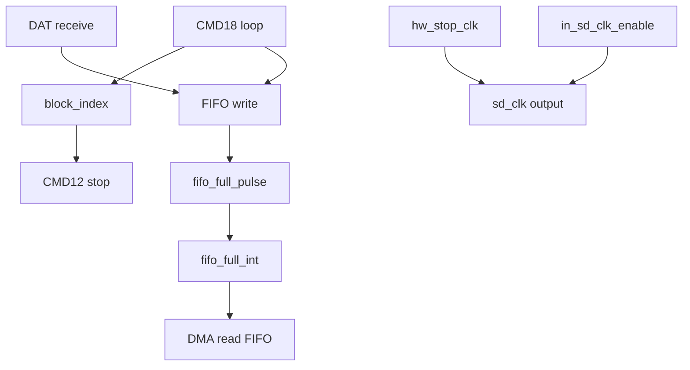

# 任务95：AHB sd host控制器设计3

## 本章知识全景图

这一讲虽然标题编号像早期设计，但内容实际延续 SD Host 的仿真调试：围绕 FIFO 满中断、异步 FIFO 指针、SDCLK 停止/恢复、`CMD18` 多块读、`CMD12` 停止和仿真日志收束。它把前几讲的寄存器配置、DMA、FIFO、时钟控制和波形验证合成一个完整调试样例。

核心概念：`fifo_full_pulse`、`fifo_full_int`、gray 指针满判断、`in_sd_clk_enable`、`hw_stop_clk`、`clk_ena_stop`、`CLK_EN_SPEED_UP_ADDR`、`force transfer_complete`、`CMD18`、`CMD12`、VCS simulation report。

逻辑主线：数据传输验证不能只盯 DAT 线是否有波形，还要确认 FIFO 事件是否被正确锁存、SDCLK 是否按硬件条件停启、多块读是否按块循环服务，以及仿真是否在预期状态下正常结束。

### 概念地图



### 最短学习路径

1. 先看 FIFO 满事件：满电平、满脉冲、中断锁存分别解决不同问题。
2. 再看 SDCLK 控制：软件 enable 和硬件 stop 都会影响输出时钟。
3. 最后看多块读闭环：`CMD18` 产生连续块，DMA 每块服务，`CMD12` 停止，仿真日志确认结束。

## 全视频地图

| 时间 | 画面锚点 | 学习任务 |
|---|---|---|
| 03:00-04:00 | 任务95：FIFO 满脉冲和中断锁存 | 围绕截图中的代码、波形或课件结论核对本节主线 |
| 08:00-09:00 | 任务95：异步 FIFO 满判断和 gray 指针 | 围绕截图中的代码、波形或课件结论核对本节主线 |
| 13:00-14:00 | 任务95：SDCLK 使能和硬件停钟 | 围绕截图中的代码、波形或课件结论核对本节主线 |
| 23:00-24:00 | 任务95：CMD18 多块读 testbench 流程 | 围绕截图中的代码、波形或课件结论核对本节主线 |
| 38:00-39:00 | 任务95：force transfer_complete 调试点 | 围绕截图中的代码、波形或课件结论核对本节主线 |
| 43:00-44:00 | 任务95：多块读波形和 block_index | 围绕截图中的代码、波形或课件结论核对本节主线 |
| 28:00-29:00 | 任务95：VCS 仿真结束和输出文件 | 围绕截图中的代码、波形或课件结论核对本节主线 |
| 33:00-34:00 | 任务95：配置寄存器复位和 SDCLK 控制波形 | 围绕截图中的代码、波形或课件结论核对本节主线 |
| 48:00-49:00 | 任务95：多块传输中的硬件停钟窗口 | 围绕截图中的代码、波形或课件结论核对本节主线 |
| 52:00-53:00 | 任务95：多块传输后续窗口 | 围绕截图中的代码、波形或课件结论核对本节主线 |


## 截图证据链

| 截图 | 视频核对 | 证据职责 | 阅读时要核对什么 |
|---|---|---|---|
| task95_03m00s.jpg | 03:00-04:00 | 任务95：FIFO 满脉冲和中断锁存 | 用作正文对应段落的视觉证据，重点核对信号名、状态名、波形边界或公式变量 |
| task95_08m00s.jpg | 08:00-09:00 | 任务95：异步 FIFO 满判断和 gray 指针 | 用作正文对应段落的视觉证据，重点核对信号名、状态名、波形边界或公式变量 |
| task95_13m00s.jpg | 13:00-14:00 | 任务95：SDCLK 使能和硬件停钟 | 用作正文对应段落的视觉证据，重点核对信号名、状态名、波形边界或公式变量 |
| task95_23m00s.jpg | 23:00-24:00 | 任务95：CMD18 多块读 testbench 流程 | 用作正文对应段落的视觉证据，重点核对信号名、状态名、波形边界或公式变量 |
| task95_38m00s.jpg | 38:00-39:00 | 任务95：force transfer_complete 调试点 | 用作正文对应段落的视觉证据，重点核对信号名、状态名、波形边界或公式变量 |
| task95_43m00s.jpg | 43:00-44:00 | 任务95：多块读波形和 block_index | 用作正文对应段落的视觉证据，重点核对信号名、状态名、波形边界或公式变量 |
| task95_28m00s.jpg | 28:00-29:00 | 任务95：VCS 仿真结束和输出文件 | 用作正文对应段落的视觉证据，重点核对信号名、状态名、波形边界或公式变量 |
| task95_33m00s.jpg | 33:00-34:00 | 任务95：配置寄存器复位和 SDCLK 控制波形 | 用作正文对应段落的视觉证据，重点核对信号名、状态名、波形边界或公式变量 |
| task95_48m00s.jpg | 48:00-49:00 | 任务95：多块传输中的硬件停钟窗口 | 用作正文对应段落的视觉证据，重点核对信号名、状态名、波形边界或公式变量 |
| task95_52m00s.jpg | 52:00-53:00 | 任务95：多块传输后续窗口 | 用作正文对应段落的视觉证据，重点核对信号名、状态名、波形边界或公式变量 |


## 1. FIFO 满中断来自满脉冲，而不是直接来自满电平

`sd_dma.v` 中 `fifo_full_int` 的置位条件是 `fifo_full_int_gen && fifo_full_pulse`，清除条件是 `clr_fifo_full_int`。波形中 `fifo_full_pulse` 短暂出现，随后 `fifo_full_int` 保持到软件清除。

视觉核对：03:00，代码显示 `fifo_full_int <= 1'b1` 的条件，下方波形显示 `fifo_full_pulse/fifo_full_int/dma_finish_int/block_index`。


视频核对：03:00-04:00，这张图用于核对“任务95：FIFO 满脉冲和中断锁存”对应的代码、波形或课件证据。

这类设计要分清三层：

| 信号 | 类型 | 作用 |
|---|---|---|
| `fifo_full` | 状态 | FIFO 当前满 |
| `fifo_full_pulse` | 边沿事件 | 刚进入满状态 |
| `fifo_full_int` | 软件可见中断 | 保持到软件清除 |

如果直接用 `fifo_full` 触发中断，软件可能在 FIFO 持续满时反复响应；如果只用脉冲不锁存，软件又可能错过一个很短的事件。

## 2. 异步 FIFO 满判断依赖 gray 指针比较

波形定位到 `wr_full.v`，`wptr_gray_temp_nxt` 与同步后的读指针 `rptr_s2_reg` 比较生成 `full_val`，再寄存成 `wr_full`。下方波形显示写指针、读指针同步值、`fifo_full` 和 `fifo_full_int` 的关系。

视觉核对：08:00，画面显示 `full_val = (wptr_gray_temp_nxt == {~rptr_s2_reg[...] ...})` 和 FIFO 指针波形。


视频核对：08:00-09:00，这张图用于核对“任务95：异步 FIFO 满判断和 gray 指针”对应的代码、波形或课件证据。

异步 FIFO 的满判断不是“写指针等于读指针”。满条件通常是写指针下一值追上读指针并翻转高位，使用 gray 码是为了跨时钟同步时减少多 bit 同时变化带来的误判。SDCLK 写入域和 AHB/DMA 读出域不同步，因此这个逻辑是数据完整性的关键保护。

## 3. SDCLK 由软件使能和硬件停止共同控制

`sd_clk.v` 中 `clk_ena_stop = (!in_sd_clk_enable) || hw_stop_clk`。这意味着软件关闭 SDCLK 或硬件要求停钟，都会让输出时钟停止。波形里 `in_sd_clk_enable`、`hw_stop_clk`、`clk_ena_stop` 与 SDCLK 活动窗口对齐。

视觉核对：13:00，画面显示 `sd_clk.v` 中 `in_sd_clk_enable` 和 `hw_stop_clk`，下方波形显示时钟启停。


视频核对：13:00-14:00，这张图用于核对“任务95：SDCLK 使能和硬件停钟”对应的代码、波形或课件证据。

这段逻辑说明 SD Host 里的时钟控制不只是省功耗，也服务协议时序。某些阶段需要暂停或拉长间隔，硬件 stop 可以避免软件过早继续推进；软件 enable 则控制初始化、低速/高速切换和测试节奏。

## 4. `CMD18` 多块读在 testbench 中按块循环服务

testbench 中 `CMD18` 配置 `BLOCK_SIZE=0x200`、`BLOCK_COUNT=2`、`TRANSFER_MODE=1`，并写 `CLK_EN_SPEED_UP_ADDR` 加速时钟。随后 `send_cmd_high(6'd18, ..., data_present=1)`，进入 `for(block_index=0; block_index<2; block_index++)` 循环：等待 `fifo_full_int`，延迟模拟软件响应，写 DMA 地址和控制，等 `dma_finish_int`，清中断。

视觉核对：23:00，画面显示 `CMD18` 配置、`CLK_EN_SPEED_UP_ADDR`、循环等待 `fifo_full_int` 和 DMA 控制。


视频核对：23:00-24:00，这张图用于核对“任务95：CMD18 多块读 testbench 流程”对应的代码、波形或课件证据。

多块读的可复现流程：

```text
CMD55
ACMD6(width=4-bit)
configure block_size=512, block_count=2, transfer_mode=receive
enable faster SD clock
send CMD18
for each block:
    wait fifo_full_int
    start DMA
    wait dma_finish_int
    clear fifo/dma interrupt
wait transfer_complete
send CMD12
```

这里的 `#50000 // software` 用来模拟软件中断响应延迟。验证时保留这种延迟很有价值，因为它能暴露 FIFO 满后 Host 没有立刻服务时的数据保持能力。

## 5. `force transfer_complete` 是调试手段，不是最终设计行为

截图中 testbench 插入 `force U_sd_host_h.U_sd_top.U_sd_if.transfer_complete`，用于人为制造停止条件或推进调试流程。这个写法适合定位波形和缩短调试，但不能当作真实验证通过条件。

视觉核对：38:00，画面显示 `force ... transfer_complete` 插入在 `CMD18` 代码附近。


视频核对：38:00-39:00，这张图用于核对“任务95：force transfer_complete 调试点”对应的代码、波形或课件证据。

判断口径：

- 临时 `force` 可以帮助确认 `CMD12`、时钟停止或后续清理逻辑是否工作。
- 正式回归必须去掉 `force`，让 `transfer_complete` 由 RTL 自己产生。
- 若必须依赖 `force` 才能结束，说明数据 FSM、块计数、stop 命令或中断清除链路仍有缺口。

## 6. 波形里的 `block_index` 验证多块服务是否推进

波形中 `block_index` 从 0 到 1 递增，SD DAT 线出现连续数据块，`clk_ena_stop/hw_stop_clk` 在块间或停止阶段产生窗口。这个组合说明多块读不是单块读的重复截图，而是 testbench 真的进入了按块循环。

视觉核对：43:00-52:00，画面显示连续 SDCLK/DAT 活动、`block_index` 变化和 `hw_stop_clk` 窗口。


视频核对：43:00-44:00，这张图用于核对“任务95：多块读波形和 block_index”对应的代码、波形或课件证据。

多块读波形至少看四个点：

1. `block_index` 是否按目标块数递增。
2. 每块是否有独立的数据窗口。
3. 每块是否触发 FIFO 满和 DMA 完成。
4. 最后是否有 `CMD12` 或等效停止序列收束。

## 7. 仿真日志是最后的结果证据

终端显示卡状态在 `Data` 和 `Tran` 之间变化，最后 `$finish called from file "../model/sdmmc_device.v"`，VCS 报告 simulation time，目录中存在 `ahb_sdhost.fsdb`、`simv`、`sim.log`、`rtl.list`、`tb.list`、`novas.conf` 等文件。

视觉核对：28:00，画面显示 VCS Simulation Report 和仿真目录文件。


视频核对：28:00-29:00，这张图用于核对“任务95：VCS 仿真结束和输出文件”对应的代码、波形或课件证据。

日志通过不等于功能完全正确，但它是最小完成证据：仿真没有卡死，card model 进入预期状态切换，FSDB 可用于回看波形。正式交付还要用断言或 scoreboard 检查数据内容。

## 8. 本讲调试闭环

本讲的调试闭环可以固化为：

```text
configure multi-block read
  -> observe SDCLK enable/stop
  -> receive DAT into FIFO
  -> fifo_full_pulse sets fifo_full_int
  -> DMA drains FIFO
  -> block_index increments
  -> CMD12 stops stream
  -> simulation exits with FSDB
```

如果后续改 RTL，优先用这个闭环做回归：它同时覆盖跨时钟 FIFO、软件中断延迟、时钟控制、多块数据和停止命令。

## 9. 全视频结构地图：这一讲是 SD Host 回归收尾

这一讲不是重新讲“设计3”，而是在完成 SD Host 项目的关键回归收尾：FIFO 中断、时钟门控、软件延迟、多块读、停止命令、仿真结束都被放进同一个可运行场景。

| 视频段落 | 截图证据 | 收尾意义 |
|---|---|---|
| 03:00 | `fifo_full_int` 锁存 | 软件能看到 FIFO 满事件 |
| 08:00 | gray pointer full 判断 | 跨时钟 FIFO 满判断可信 |
| 13:00 | `sd_clk.v` 停钟条件 | SDCLK 可被软件和硬件控制 |
| 18:00 | `CMD18` 代码起点 | 多块读测试场景搭建 |
| 23:00 | `CLK_EN_SPEED_UP_ADDR` | 数据阶段切高速或加速仿真 |
| 28:00 | VCS simulation report | 仿真没有卡死，FSDB 生成 |
| 33:00 | `sd_if` 配置寄存器复位 | 软件寄存器默认值可追溯 |
| 38:00 | `force transfer_complete` | 临时调试和真实完成要区分 |
| 43:00-52:00 | 多块 DAT 波形和 `block_index` | 多块服务真实推进 |


视频核对：33:00-34:00，这张图用于核对“任务95：配置寄存器复位和 SDCLK 控制波形”对应的代码、波形或课件证据。

`sd_if` 中配置寄存器的复位值说明 testbench 每次启动前应有确定初始状态：`sd_clk_enable=0`、`sd_clk_divider=0`、`sd_soft_reset=1`、`command_argument=0`、`command_index=0`、`data_present=0`、`response_type=0`、`block_size=0x200` 等。没有这些默认值，后续命令配置可能继承上一次仿真的残留。

## 10. SDCLK 停止不是可选优化，而是协议控制点

95 的 `sd_clk.v` 画面把 `clk_ena_stop` 写成 `!in_sd_clk_enable || hw_stop_clk`。这说明时钟停止有两个来源：软件关时钟，或者硬件根据状态自动停钟。波形中 `hw_stop_clk` 与数据块窗口、`block_index` 变化相关，说明硬件停钟参与事务边界控制。


视频核对：48:00-49:00，这张图用于核对“任务95：多块传输中的硬件停钟窗口”对应的代码、波形或课件证据。

判断 SDCLK 控制是否正确，不只看有没有时钟，还要看：

| 检查点 | 错误后果 |
|---|---|
| 命令/响应期间时钟连续 | 卡无法正常返回响应 |
| 数据窗口期间时钟连续 | DAT payload 采样不完整 |
| 停止阶段允许硬件停钟 | 防止状态机越过 stop/busy 边界 |
| 重新启钟后状态一致 | 避免 block index、FIFO 状态和命令状态错位 |

## 11. `force` 出现时要把验证结论降级

38:00 的 `force transfer_complete` 是本讲最需要谨慎的截图。它说明当时正在调试或人为推进流程，而不是完整证明 RTL 自发闭合。高质量笔记必须把这个限制写清楚。

正式验证分级：

| 等级 | 条件 | 结论 |
|---|---|---|
| 调试通过 | 使用 `force` 推进到后续波形 | 只能说明后续逻辑可观察 |
| 场景通过 | 去掉 `force` 后 RTL 自发产生 `transfer_complete` | 可作为功能回归证据 |
| 数据通过 | 加 scoreboard 比对块数据内容 | 才能证明读写数据正确 |

如果项目继续完善，下一步应去掉 `force` 并加入数据内容检查。否则“波形看起来完整”仍可能掩盖最后一拍、CRC 或 FIFO 读写顺序错误。

## 12. 多块波形要看“块间关系”，不是只看单块形状

43:00、48:00、52:00 三张图都显示多块 DAT 数据和 `block_index`。这些图应连续理解：第一块、第二块以及 stop 前后的时钟控制共同构成多块读证据。


视频核对：52:00-53:00，这张图用于核对“任务95：多块传输后续窗口”对应的代码、波形或课件证据。

多块关系检查：

1. `block_index=0` 时出现第一块数据窗口。
2. 第一块 FIFO 服务完成后，`block_index` 进入 1。
3. 第二块同样触发 FIFO/DMA 服务。
4. 目标块数完成后发 `CMD12`，不再继续接收第三块。
5. `hw_stop_clk` 或 stop 序列不破坏最后一块尾部。

这比“DAT 线有大量跳变”严格得多，因为多块读最常见错误是块边界错，而不是完全没有数据。

## 截图证据链与重读结论

这一讲的截图要按“回归收尾”来读：前面几讲已经讲过寄存器、DMA、FIFO 和 SDCLK，本讲把这些点放进多块读和仿真结束场景里。重点不是看到很多绿色波形，而是确认每个完成条件有没有被真实 RTL 或 testbench 合理触发。

| 截图 | 证据职责 | 重读结论 | 不能推出什么 |
|---|---|---|---|
| `task95_03m00s.jpg` | FIFO 满脉冲和中断锁存 | 软件看到的是锁存中断，硬件边界来自短脉冲。 | 不能直接用满电平当一次性事件。 |
| `task95_08m00s.jpg` | 异步 FIFO gray 指针满判断 | SDCLK 与 HCLK 跨域时，满判断必须用可同步的指针逻辑。 | 不能用普通二进制指针跨域直接比较。 |
| `task95_13m00s.jpg` | SDCLK 使能与硬件停钟 | `clk_ena_stop` 同时受软件 enable 和硬件 stop 控制。 | 不能把停钟理解成单纯软件关时钟。 |
| `task95_23m00s.jpg` | CMD18 多块读 testbench | 多块读要靠循环服务 FIFO/DMA，而不是一条命令后自然完成。 | 不能证明停止条件已经自发闭合。 |
| `task95_28m00s.jpg` | VCS 仿真日志 | 仿真结束是结果证据之一，能证明流程跑到终点。 | 不能替代中间波形的因果验证。 |
| `task95_33m00s.jpg` | 配置寄存器复位与 SDCLK 控制 | 复位和时钟控制影响后续所有事务状态。 | 不能只在事务末尾检查时钟。 |
| `task95_38m00s.jpg` | `force transfer_complete` | 这是调试推进手段，正式验证结论必须降级。 | 不能作为 RTL 自发产生完成信号的证据。 |
| `task95_43m00s.jpg` | `block_index` 和多块波形 | 多块读至少进入了按块推进的可观察状态。 | 不能只看一块的形状推断所有块正确。 |
| `task95_48m00s.jpg` | 块间硬件停钟窗口 | SDCLK 停启参与块间边界控制。 | 不能把停钟只当低功耗优化。 |
| `task95_52m00s.jpg` | 多块传输后续窗口 | 多块关系要看连续窗口，而不是孤立帧。 | 不能绕过 `CMD12/transfer_complete` 的最终收束检查。 |

工程闭环：出现 `force` 时，验证报告必须写明“调试通过”和“RTL 自闭合通过”不是同一级别。正式回归要删除 `force`，重新观察 `transfer_complete`、`CMD12`、FIFO/DMA 和仿真结束是否仍然成立。

## 深层理解：`force` 是拐杖，不是行走能力

本讲最容易被误读的地方是 `force transfer_complete`。`force` 像调试时临时塞进电路的一根拐杖：它能帮流程继续往后走，方便观察后级逻辑，但不能证明电路自己会站起来。若验证报告把 `force` 下跑通写成“功能通过”，就等于把别人扶着走过终点当成运动员自己跑完全程。

SDCLK 停止也要用同样严谨的眼光看。它不是简单低功耗开关，而是 backpressure 刹车：当 FIFO 或 buffer 接不住卡继续吐出的数据时，Host 必须让卡暂时停下。但刹车不能踩得太早，否则协议尾部、CRC、busy 或最后数据拍还没走完；也不能踩得太晚，否则 FIFO 溢出。

| 机制 | 正确直觉 | 验证失败信号 |
|---|---|---|
| FIFO 满脉冲 | 水位第一次到满线的事件 | 把满电平反复当中断 |
| gray 指针 | 跨时钟域的安全里程牌 | 二进制指针跨域误判满空 |
| SDCLK stop | 防溢出的刹车 | 停太早丢尾拍，停太晚溢出 |
| `block_index` | 多块事务的块号里程表 | 第一块对，后续块没服务 |
| `force` | 临时调试拐杖 | RTL 自发完成信号缺失 |

深层经验是：收尾课最该警惕“结果看起来到了”。硬件验证要问的是结果如何到达、有没有外力推着到达、边界上还能不能自己到达。

## 自测题

1. `fifo_full_pulse` 和 `fifo_full_int` 的区别是什么？
2. 异步 FIFO 为什么用 gray 指针判断满？
3. `clk_ena_stop = !in_sd_clk_enable || hw_stop_clk` 说明什么？
4. `force transfer_complete` 可以作为最终验证依据吗？
5. 多块读为什么要检查 `block_index`？

## 自测参考答案与判分点

1. 答：`fifo_full_pulse` 是满状态出现的短事件，`fifo_full_int` 是软件可见的锁存中断，保持到软件清除。
   判分点：能指出关键条件、边界和失败后果；只写名词或只说现象不得满分。

2. 答：SDCLK 和 AHB/HCLK 不同步，gray 码跨域同步时相邻值只变一位，能降低指针比较误判。
   判分点：能指出关键条件、边界和失败后果；只写名词或只说现象不得满分。

3. 答：SDCLK 同时受软件使能和硬件停钟控制。任一条件要求停钟，输出时钟都应停止。
   判分点：能指出关键条件、边界和失败后果；只写名词或只说现象不得满分。

4. 答：不可以。它只能作为临时调试手段；正式验证必须由 RTL 自己产生 `transfer_complete`。
   判分点：能指出关键条件、边界和失败后果；只写名词或只说现象不得满分。

5. 答：它证明 testbench 按块循环服务 FIFO/DMA，不是只完成第一块后误判整个多块事务完成。
   判分点：能指出关键条件、边界和失败后果；只写名词或只说现象不得满分。

## 工程核对口径

正式关闭 SD Host 回归前，至少做一次“无 `force` 多块读”检查：

1. 删除或屏蔽 testbench 中强行拉高 `transfer_complete` 的语句。
2. 跑 `CMD18` 两块或更多块读，观察 `block_index` 是否按块推进。
3. 每块 FIFO 满后是否有一次 DMA 服务，且不会重复服务同一块。
4. 目标块完成后是否发 `CMD12`，并由 RTL 自己收束传输。
5. 停 SDCLK 前是否保留必要尾部时钟，不破坏 CRC/busy/最后数据拍。

这套检查像把脚手架撤掉后再看房子是否站得住。撤掉后仍能通过，才说明 RTL 自闭合成立。

