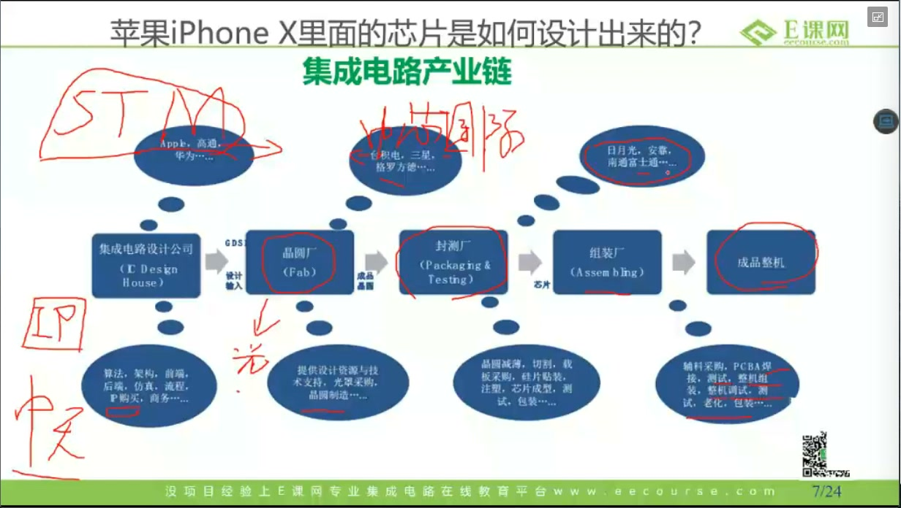
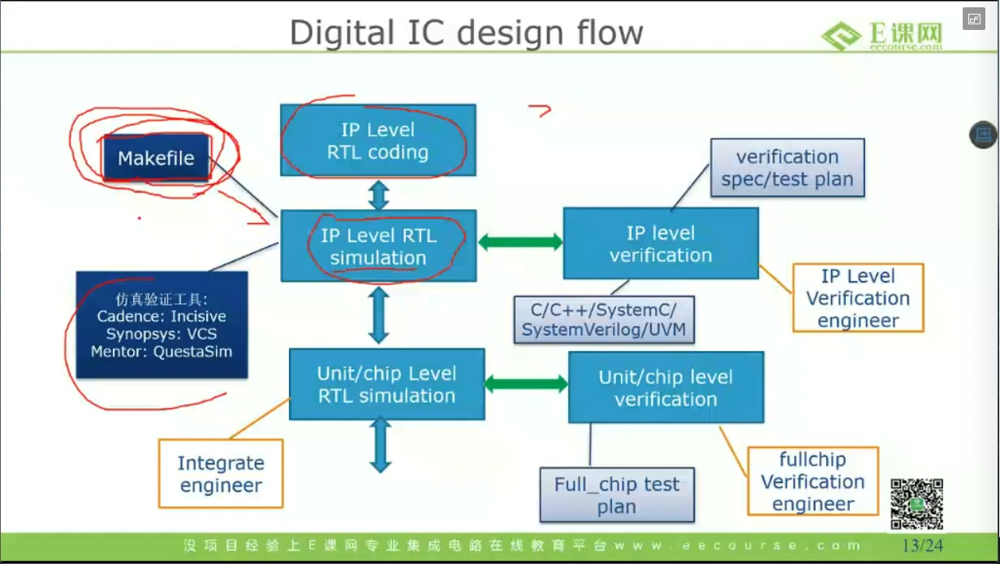
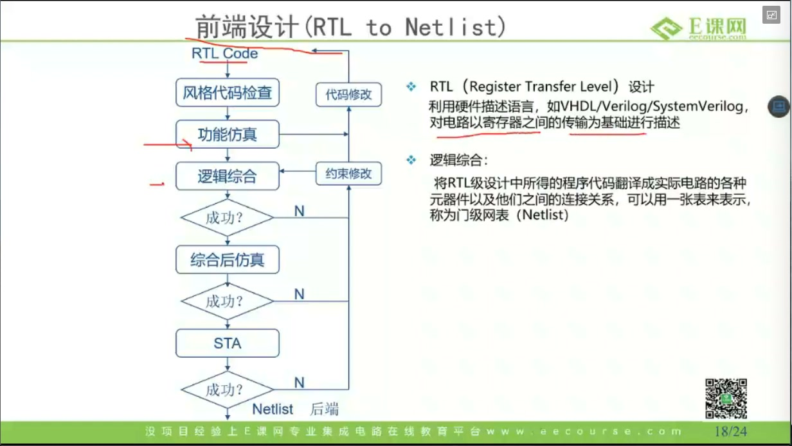

# 任务01：数字IC设计流程

## 本章知识全景图

### 1. 一眼看懂这讲在讲什么

- 本章主题：建立数字 IC 从需求到 Netlist 的主流程视角，并划清前端、验证、DFT、后端的职责边界。
- 核心概念：产业链位置、需求与指标、架构、RTL、功能仿真、验证、逻辑综合、STA、形式验证、DFT、前后端分工。
- 逻辑主线：先看芯片设计在产业链中交付什么，再看数字 IC 流程从哪里起步，最后看前端工程师真正做到哪一步。
- 最小主线：
  - 设计公司交付的是设计结果，不是成品整机。
  - 数字 IC 流程从需求与指标开始，不从 RTL 开始。
  - 架构决定模块、接口、数据流，RTL 只是把架构落成可综合描述。
  - 仿真保证功能正确，综合把 RTL 变成门级网表，STA 保证时序，形式验证保证前后等价，DFT 保证可测。
  - 前端通常做到可交付 Netlist，后端接着把 Netlist 落成版图。

### 2. 概念地图

| 概念层级 | 核心概念 | 前置知识 | 延伸应用 |
| :---: | :--- | :--- | :--- |
| 一级概念 | 产业链位置 | 芯片、制造、封测 | 理解设计公司的交付物 |
| 一级概念 | 需求与指标 | 性能、功耗、面积 | 约束架构和 RTL |
| 一级概念 | 架构与 RTL | SoC、模块、接口 | 模块划分、数据流设计 |
| 一级概念 | 仿真与验证 | testbench、用例 | 功能确认与覆盖扩展 |
| 一级概念 | 综合与时序 | 工艺库、网表、约束 | Netlist 交付与时序收敛 |
| 一级概念 | 形式验证与 DFT | 等价性、可测试性 | 保证综合前后功能一致并支持制造测试 |
| 一级概念 | 前后端边界 | Netlist、版图 | 明确岗位学习重点 |

### 3. 阅读顺序 / 处理顺序

- 先抓住一句判断：数字 IC 设计的核心不是工具列表，而是“指标驱动实现”。
- 再拆流程：需求、架构、RTL、仿真、验证、综合、STA、形式验证、DFT 各解决什么问题。
- 最后记住边界：前端把设计收敛到 Netlist，后端把 Netlist 落成可制造版图。

## 1. 设计公司真正交付的是什么

把芯片设计理解成“把芯片制造出来”是最常见的误解。设计、制造、封测、组装是不同环节；数字前端工程师站在最上游，交付的是设计结果、约束、验证结论和可交付实现，而不是晶圆、封装件或整机。

这条产业链里，设计公司负责定义功能、完成实现并输出设计数据；晶圆厂把设计数据落成晶圆；封测厂完成封装和测试；组装厂把芯片装进系统，最后进入终端产品。前端虽然不直接做制造动作，但前面的架构、时序、功耗、DFT 决策都会在后面的制造与测试里兑现成成本、良率和可测性问题。

> 图1 产业链位置图：设计输入从设计公司流向制造、封测、组装，最后进入成品整机。

`🔍 视觉验证：视频 11:00-11:05（产业链示意图：应看到“集成电路设计公司 -> 晶圆厂 Fab -> 封测厂 Packaging & Testing -> 组装厂 -> 成品整机”的串联关系）`

这一页真正要记住的不是厂名，而是交付边界：前端负责把想法收敛成可制造的设计结果，不负责把产品做完。

## 2. 数字 IC 流程为什么从指标开始

数字 IC 设计的起点不是 RTL，而是需求与指标。所谓“需求”，不是一句“我要做个控制器”，而是性能、功耗、面积、应用场景这组约束。指标不立住，后面的 RTL 只是无目标实现。

这一点之所以关键，是因为架构选择从一开始就被这些约束推着走。速度要求高，往往意味着更深的流水线、更激进的并行或更宽的数据通路；功耗要求紧，就必须提前考虑时钟策略、使能方式、存储组织以及低功耗技术；面积受限时，模块拆分、资源共享和实现复杂度都会被重新权衡。也就是说，指标不是验收阶段才看的结果，而是架构阶段就已经开始约束实现的东西。

如果把需求写成工程语言，它至少要回答五件事：做什么功能、速度大概要到哪里、功耗和面积大概落在哪个预算内、它在系统里和谁交互、失败时最可能先卡在哪个指标上。只要这五件事没定稳，架构就不稳，RTL 必然反复推翻。

## 3. 架构和 RTL 不是一回事

把架构当成空话、把 RTL 当成“真正的工作”，也是一种典型误解。架构决定的是模块、接口、数据流和时序关系；RTL 只是把这些定义写成可综合的寄存器传输级描述。RTL 写得再快，也不能替代架构阶段该做的判断。

架构阶段至少要定四类东西：模块怎么划分，哪些功能独立成块、哪些功能共享资源；接口怎么交互，信号和握手关系是什么；数据怎么流，数据从哪里来、到哪里去、在哪里缓存或仲裁；系统瓶颈在哪里，性能和功耗的风险点集中在哪些位置。RTL 阶段才把这些判断翻译成寄存器、组合逻辑、状态机、时序块和接口逻辑。

所以 RTL 的“可综合”和“可验证”不是附加要求，而是本体要求。写出来的代码最终必须能映射到标准单元库，也必须能被 testbench 稳定驱动和检查。这也是为什么 RTL 编码风格不是审美问题，而是实现质量问题。风格一差，最常见的后果就是仿真能跑、综合有坑、时序难收、约束难写、后续 debug 成本高。

## 4. 仿真、验证、综合、STA、形式验证、DFT，各自解决什么问题

### 4.1 仿真和验证的分界线

“仿真”和“验证”相关，但不是同一个词。前端工程师最基本的工作是做 RTL 功能仿真：写 testbench，组织输入激励和预期结果，跑 testcase，看模块在给定场景下功能是否正确。验证工程则继续往前走到验证计划、覆盖率、方法学、IP 级和全芯片级验证，它解决的是“验证空间有没有被系统性覆盖”，而不是“这几个场景跑没跑通”。

> 图2 仿真与验证分工图：左侧是 RTL coding 与 RTL simulation，右侧是 verification plan、IP level verification 与 full chip verification。

`🔍 视觉验证：视频 26:00-26:05（仿真与验证流程图：应看到左边是 RTL coding / RTL simulation，右边是 verification spec/test plan 与 IP/full-chip verification engineer）`

这张图的作用不是展示框图有多复杂，而是把左边的“实现与仿真”同右边的“验证体系”切开。对前端来说，至少要具备四种动作能力：搭 testbench，组织 testcase，用脚本自动跑仿真，以及从失败波形或日志回溯到 RTL、接口或约束问题。如果这些能力没有建立，后面的综合和 STA 往往只是在带着 bug 往后推。

### 4.2 逻辑综合在做什么

逻辑综合不是把代码“翻译一下”，而是把 RTL 映射到特定工艺库，输出门级网表 Netlist。因为它依赖工艺库和标准单元库，所以同一套 RTL，在不同工艺条件下，面积、时序和功耗都可能完全不同。综合的输入不是 RTL 一项，而是 RTL、约束和工艺库三者一起决定结果。

### 4.3 综合后仿真和 STA 为什么都需要

综合后仿真关心的是：综合后的实现有没有保持原来的功能。STA 关心的是：在目标时钟和约束下，设计能不能满足 setup/hold 等时序要求。两者不能互相替代。功能仿真通过，不代表时序一定满足；时序满足，也不代表综合前后的功能一定完全一致。

STA 的核心价值可以压成一句话：它回答的不是“逻辑对不对”，而是“这个设计在目标时钟下能不能稳定工作”。

### 4.4 形式验证和 DFT 解决的是后面的两个问题

形式验证用来确认综合前后的设计在功能上等价。它不是靠枚举输入去试几个 testcase，而是检查 RTL 和综合后的网表是不是同一个设计。DFT 则面向制造测试，目的是提升流片回片后的可测性，例如通过 scan chain 让制造缺陷更容易暴露出来。把 DFT 当成“功能设计的一部分”会把问题看浅；它真正关心的是后续量产测试怎么做得出来、测得出来。

### 4.5 前端真正要走通的是一个闭环

前端不是把 RTL 写完就结束，而是要把 RTL 一路收敛到可交付 Netlist。下面这张图的价值就在这里：它不是把名词排一排，而是把前端闭环画成了可以执行的流程。

> 图3 前端闭环图：RTL Code 经过风格代码检查、功能仿真、逻辑综合、综合后仿真、STA，收敛后得到 Netlist。

`🔍 视觉验证：视频 34:30-34:36（前端 RTL to Netlist 流程图：应看到“风格代码检查 -> 功能仿真 -> 逻辑综合 -> 综合后仿真 -> STA -> Netlist”的顺序，以及右侧“代码修改/约束修改”的回退路径）`

这张图真正要记住的是回退关系。功能错了，回 RTL；约束不合理，回约束；STA 不过，不一定先怪代码，也可能先怪时钟、IO 延迟、面积或功耗约束。也就是说，前端流程不是直线，而是一个持续收敛的闭环。

`🔍 视觉验证：视频 29:58-30:20（STA/DFT 页：应看到 STA 旁边连着 PrimeTime/Tempus，DFT 旁边连着 scan chain，这说明 STA 是时序分析动作，DFT 是面向测试的结构插入动作）`

## 5. 前端做到哪里，后端从哪里接手

前端和后端的分界线，通常就画在 Netlist 上。前端把功能与时序意图收敛成可交付逻辑实现；后端从 Netlist 出发，把它落成可制造的物理版图。

前端设计工程师通常要做到这些事：理解需求和指标，做架构与模块划分，写 RTL，做功能仿真，做基础综合，写和调时序约束，完成 STA，并输出可交付 Netlist。验证工程师的主线则是验证计划、完整验证环境、更系统的覆盖和更大范围的 bug 搜索。DFT 工程师负责插入可测试结构、提高制造测试效率、支撑量产测试链路。后端工程师拿到 Netlist 后，继续做布局布线、时钟树插入、RC 提取、DRC/LVS 与版图一致性检查，以及后布局时序分析。

这节课最后真正想建立的，就是这个岗位地图：前端不是“会写 RTL 的人”，而是“能把设计从需求一路收敛到 Netlist 的人”。

## 6. 这节课最该留下的流程意识

这节课的价值不在于工具名，而在于流程地图。真正该留下的是下面五个判断：

- 芯片设计在产业链上游，交付的是设计结果。
- 数字 IC 流程从需求与指标开始，不从 RTL 开始。
- 架构决定模块、接口和数据流，RTL 负责把它们落成可综合逻辑。
- 仿真、验证、综合、STA、形式验证、DFT 各自解决不同问题。
- 前端学习目标不是“会写代码”，而是“把 RTL 收敛到 Netlist”。

## 7. 最后速记

### 7.1 本章最该记住的结论

- 数字 IC 设计主线是：需求与指标 -> 架构 -> RTL -> 功能仿真/验证 -> 逻辑综合 -> STA/形式验证/DFT -> Netlist -> 后端。
- 前端的核心价值不是写 RTL 本身，而是把 RTL 收敛成满足功能和时序要求的可交付实现。
- 功能仿真解决功能对不对，STA 解决时序过不过，形式验证解决综合前后等不等价，DFT 解决回片后测不测得出来。

### 7.2 复现 / 复习清单

- 不看视频，你能不能一句话说清数字 IC 流程为什么不从 RTL 开始。
- 你能不能区分架构、RTL、仿真、验证、综合、STA、形式验证、DFT 各自的工作对象。
- 你能不能口述前端从 RTL 到 Netlist 的闭环，以及失败后该回代码还是回约束。
- 你能不能说明前端与后端的交界面为什么是 Netlist，而不是“代码写完”。
