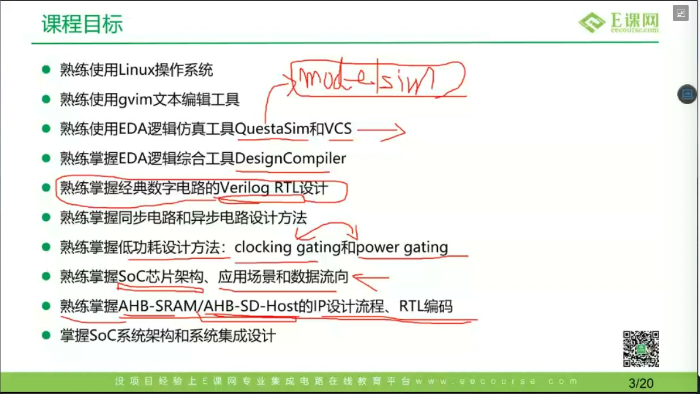
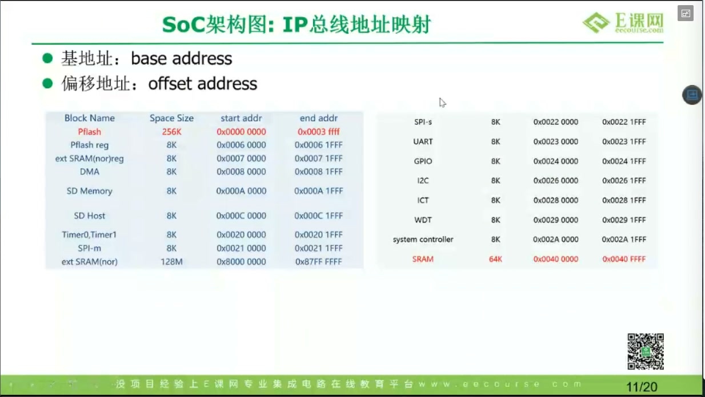
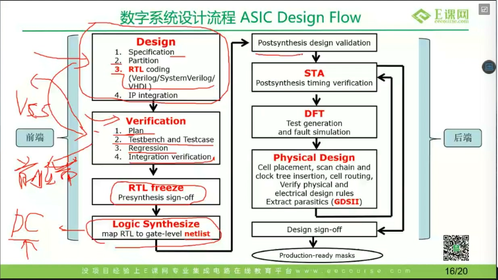

# 任务02：数字前端设计工程师就业班概述

## 本章知识全景图

### 1. 一眼看懂这讲在讲什么

- 本章主题：定义这门就业班训练的工程边界，说明课程如何把“工具学习”推进成“前端项目能力”。
- 核心概念：岗位入口、工具链、RTL 与电路基础、项目实践、SoC 系统视角、ASIC 设计流程、能力出口。
- 逻辑主线：先回答“这门课到底要把人带到哪一步”，再回答“它靠什么训练”，最后回答“这些训练为什么能映射到真实前端流程”。
- 最小主线：
  - 这门课不是普通 Verilog 课，而是前端岗位入口训练。
  - Linux、编辑器、仿真、综合只是工作平台，不是最终目标。
  - 项目实践是课程核心，因为它把工具、RTL、系统结构和公司流程串成工程经历。
  - 课程真正对应的是 ASIC 设计流程里的前端一侧：spec、RTL、验证、综合和基础时序/约束意识。

### 2. 概念地图

| 概念层级 | 核心概念 | 前置知识 | 延伸应用 |
| :---: | :--- | :--- | :--- |
| 一级概念 | 课程定位 | 数字 IC 行业、岗位认知 | 判断课程是“岗位训练”还是“单点补课” |
| 一级概念 | 工作平台 | Linux、gvim、仿真、综合 | 建立前端工程环境 |
| 一级概念 | 设计能力 | RTL、同步/异步、低功耗 | 从工具熟练走向实现能力 |
| 一级概念 | 项目训练 | AHB-SRAM、AHB-SD-Host、SoC 项目 | 形成可讲述的工程经历 |
| 一级概念 | 系统视角 | SoC 架构、总线、数据流 | 理解 IP 在系统中的位置 |
| 一级概念 | 流程映射 | Spec、RTL、验证、综合、STA、后端 | 把课程训练映射到真实公司流程 |
| 一级概念 | 能力出口 | IP 开发、调试、求职准备 | 对接面试和项目交付 |

### 3. 阅读顺序 / 处理顺序

- 先看课程到底训练什么能力。
- 再看这套能力是靠哪些工具和项目练出来的。
- 最后看它怎样接到真实 ASIC 前端流程和面试要求上。

## 1. 这门课的目标不是“讲完知识点”，而是把人推到前端岗位入口

这节课最关键的判断是：它不是把若干知识点排成一张课表，而是在定义一个岗位入口。课程想交付的不是“我学过 Linux、学过 Verilog、学过仿真”的经历，而是“我知道前端工程师在公司里要做什么，并且已经走过一条缩小版真实流程”的能力。

因此，这门课的中心任务可以压成一句话：把学员从“知道一些数字电路概念”推进到“能沿着数字前端工程流工作”的起点。这里的“工作”不是就业包装词，而是指你能进入 Linux 环境、写 RTL、做基本仿真、理解综合、理解项目上下文，并把这些东西在面试里讲清楚。

课程里反复提“四个月”“就业班”“项目实践”，真正有价值的不是时长，而是这四个月被组织成了一条前端训练链：先建工具平台，再补 RTL 与电路基础，再做项目，再把项目翻译成岗位能力。

## 2. 为什么工具链被放在最前面

Linux、gvim、仿真工具、综合工具被放在课程前面，不是因为它们最“基础”，而是因为它们构成了前端工程的工作平台。没有这层平台，后面的 RTL、仿真、综合、项目训练都会停留在“看懂概念，但不能动手”。

这节课对工具链的划分非常清楚：

- Linux 是工作环境。进入公司后，大多数 EDA 工具和项目环境都落在这里。
- gvim 这类编辑器是高频生产工具，因为前端不是只点图形界面，而是要持续修改代码和脚本。
- 仿真工具用来验证 RTL 功能，综合工具用来把 RTL 映射到工艺库和门级网表。
- 规则检查工具的作用是把一部分可避免的问题提前暴露出来，而不是等到综合或项目后期才踩雷。

> 图1 课程目标页：Linux、gvim、仿真工具、综合工具、Verilog RTL、同步/异步设计、低功耗、SoC 架构、AHB-SRAM/AHB-SD-Host 流程被统一放进一张能力图里。

`🔍 视觉验证：视频 11:55-12:05（课程目标页：应看到 Linux、gvim、EDA 仿真工具 QuestaSim/VCS、DesignCompiler、Verilog RTL、同步/异步设计、低功耗、SoC 架构、AHB-SRAM/AHB-SD-Host 等条目）`

这一页最重要的不是内容多，而是它把能力分成了三层：

- 平台层：Linux、编辑器、仿真、综合。
- 设计层：RTL、同步/异步、低功耗、SoC 架构。
- 交付层：具体 IP 设计流程和项目实践。

也就是说，课程不是在教“多个不相关的模块”，而是在搭一条前端工程栈。

## 3. 这门课真正重的是项目实践，而不是课程包装

如果把这节课所有内容按工程价值排序，项目实践显然是 `P0/P1`，课程包装和就业话术最多只是 `P2`。真正值得保留的核心信息是：课程不是拿几个零散作业练手，而是拿接近公司任务形态的 IP 和 SoC 项目，把工具使用、RTL 实现、系统理解和流程意识绑在一起训练。

课程里点名的项目抓手包括 AHB-SRAM、AHB-SD-Host，以及围绕 SoC 架构、应用场景和数据流向展开的训练。这些内容的重要性不在于它们“听起来像项目”，而在于它们满足三个工程条件：

- 它们足够像真实公司里会分给前端工程师的任务。
- 它们要求你不只会写模块，还要理解接口、总线、数据路径和系统角色。
- 它们可以被翻译成面试里的项目表达，而不是停留在“我做过课堂作业”。

因此，项目实践至少承担四个功能：

- 把工具链训练变成工作流训练。
- 把 RTL 训练放进系统和协议上下文。
- 逼你理解“一个 IP 在系统里是怎么活的”。
- 给求职提供真正能讲的工程经历。

这也是为什么课程会不断把“应用场景”“数据流”“SoC 架构”“公司流程”这些词和项目绑在一起讲。对前端来说，真正值钱的不是“写过状态机”，而是“能说清这个状态机为什么存在、挂在哪、和谁交互、结果交给谁”。

## 4. 课程时间安排的工程含义

这门课的时间安排看起来像课程规划，实际上反映的是训练顺序：

- 前两个月压 Linux、编辑器、仿真、综合，说明先搭工作平台。
- 接近一个月补 RTL 基础和数字电路实现，说明平台之后要补实现能力。
- 六周重点做项目，说明真正的课程重心是项目化训练，而不是理论讲解。
- 后面补 SoC 集成和低功耗，说明课程最后还要把能力从“会做一个 IP”抬到“理解系统和工程约束”。
- 最后接测试、模拟面试、简历和推荐就业，说明课程想把训练结果直接翻译成求职成果。

这里最值得记住的不是“四个月”这个数字，而是这条能力曲线：先能工作，再能实现，再能做项目，再能把项目说出来。

## 5. 为什么 SoC 架构和应用场景在这门课里这么重要

如果一门课只想教 RTL，它没必要花这么多时间讲 SoC 架构图、应用场景和数据流。这里之所以讲得重，是因为前端岗位真正开发的对象从来不是“孤立模块”，而是系统中的模块。

SoC 架构图在这节课里的作用有两层：

- 第一层是工程理解：让你知道 CPU、DMA、存储控制器、总线、低速外设之间是什么关系。
- 第二层是表达能力：以后在面试或项目复盘时，你能说清一个模块为什么放在这个系统位置，为什么走这条总线，为什么有主从关系和地址映射。

> 图2 SoC 架构图：CPU、DMA、存储控制器、AHB/APB、System Controller 和一组外设被放进同一张系统结构图中。

`🔍 视觉验证：视频 23:59-24:15（SoC 架构图：应看到 CPU、DMA、Ext SRAM Controller、SD Memory、SD Host、AHB SRAM、APB 外设和 System Controller 处在一张总线层次图里）`

真正该看的不是单个模块名，而是系统关系：

- CPU 和 DMA 为什么位于主控侧。
- 高速路径为什么走 AHB。
- 低速外设为什么落到 APB 或外围控制链上。
- 为什么一个 IP 写完以后，还必须知道它在系统里服务谁。

这也是项目训练和单纯写代码之间最大的差别：项目训练要求系统感。

## 6. 课程怎样映射到真实 ASIC 前端流程

这节课最重要的工程页，是后半段的 ASIC Design Flow。它把课程训练直接钉在真实芯片流程里：Design、Verification、RTL freeze、Logic Synthesize 属于前端侧；STA、DFT、Physical Design、sign-off 属于后续环节。

> 图3 ASIC 设计流程图：左侧是前端侧的 design、verification、RTL freeze、logic synthesis，右侧是 STA、DFT、physical design 等后续环节。

`🔍 视觉验证：视频 53:00-53:10（ASIC Design Flow：应看到左侧前端包含 Design、Verification、RTL freeze、Logic Synthesize，右侧后续包含 STA、DFT、Physical Design）`

这页图把课程价值说得很明白：

- 课程训练的不是抽象 Verilog，而是 specification、partition、RTL coding、IP integration、testbench、regression、logic synthesis 这一整侧前端工作流。
- 它要求你理解 STA、DFT、Physical Design 在后面怎么接，但不把一开始的目标定成后端实现。
- 它强调 RTL freeze 和 logic synthesis，说明课程终点不是“代码能跑”，而是“代码可冻结、可综合、可交接”。

换句话说，这门课真正把前端岗位的工作边界画出来了：从规格和架构开始，到 RTL、验证、综合结束，再把结果交给后续流程继续收敛。

## 7. 最后能力出口为什么会落到“项目可讲、面试可用”

这节课最后把能力出口说得非常直接：要能理解规格，能写 RTL，能做基本仿真和调试，能理解协议和常见 IP，能围绕一个真实项目说清自己的工作路径，最后能把这些东西转译成简历、模拟面试和求职表达。

这说明课程并不满足于“把知识讲完”。它真正追求的是一种可交付能力组合：

- 能在 Linux 工程环境下工作。
- 能使用编辑器、仿真工具、综合工具和基础脚本。
- 能写并调试 Verilog RTL。
- 能理解同步/异步、低功耗、SoC 架构这些前端常见主题。
- 能围绕一个真实 IP 或 SoC 项目组织自己的工程叙述。
- 能把训练结果带进面试，而不是停在“我学过”。

所以，这门课真正想交付的不是课程笔记，而是一种更像前端新人的能力轮廓。

## 8. 最后速记

### 8.1 本章最该记住的结论

- 这门课不是普通 Verilog 课，而是数字前端岗位入口训练。
- Linux、编辑器、仿真、综合只是工作平台，真正目标是形成前端工作流。
- 项目实践是课程核心，因为它把工具、RTL、系统视角和公司流程串成工程经历。
- 课程明确对应 ASIC 设计流程里的前端一侧：spec、RTL、验证、综合和基础约束/时序意识。
- 最终能力出口不是“知道概念”，而是“能在项目和面试里使用这些概念”。

### 8.2 复现 / 复习清单

- 你能不能一句话说清这门课为什么不是普通的 Verilog 课。
- 你能不能解释课程为什么把 Linux 和编辑工具放在最前面。
- 你能不能说明项目实践为什么比零散作业更接近前端岗位要求。
- 你能不能把这门课训练的内容映射到 ASIC 设计流程里的前端部分。
- 你能不能说清课程最终希望你具备哪些可面试、可交付的能力。
