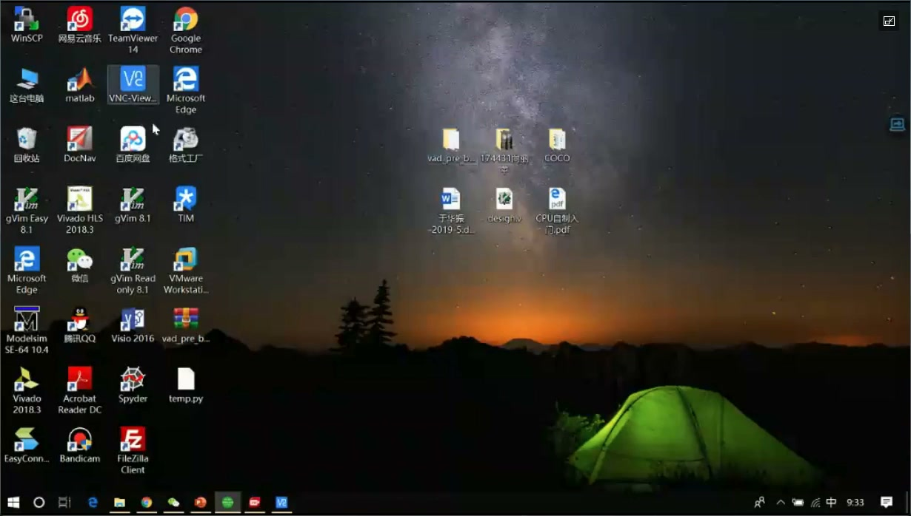
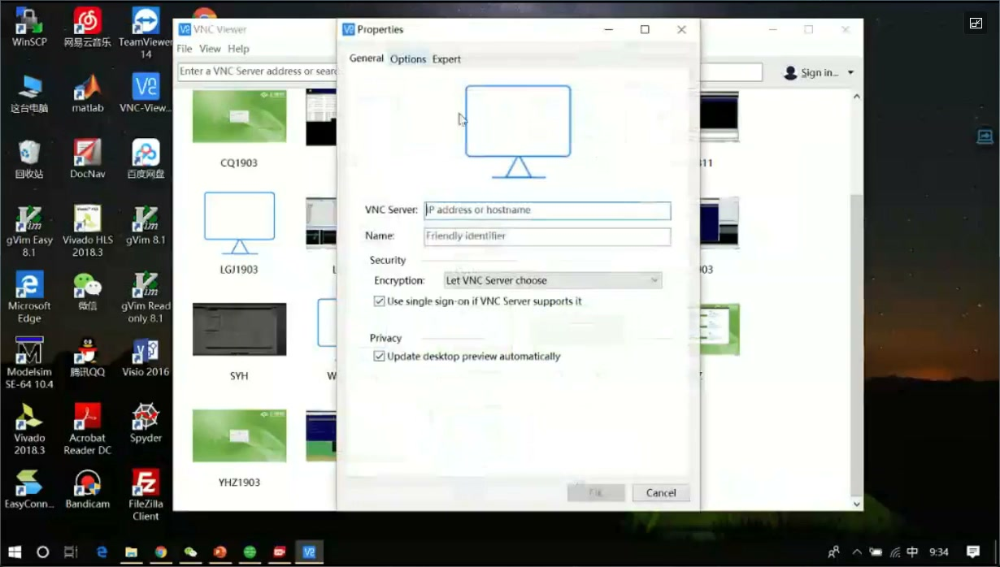
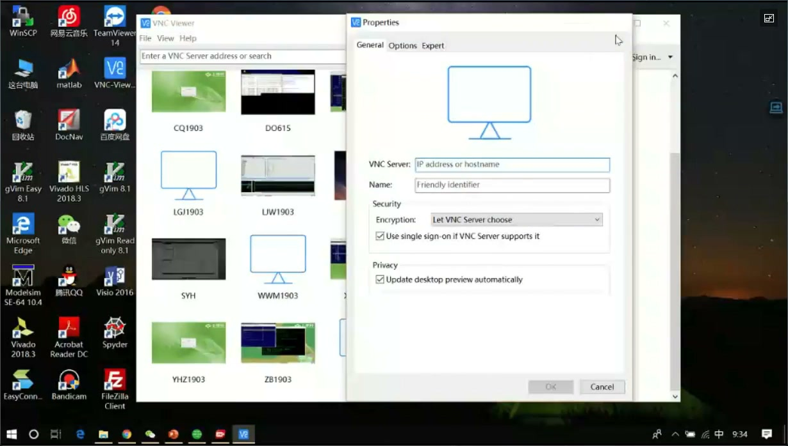
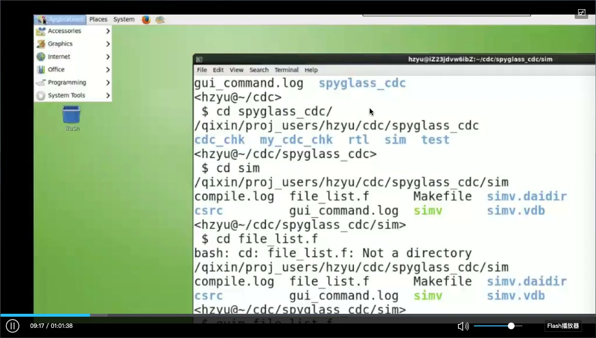
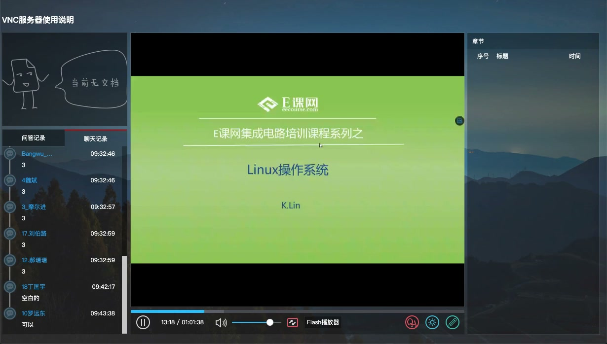

# 任务03：VNC服务器使用说明

## 本章知识全景图

### 1. 一眼看懂这讲在讲什么

- 本章主题：把“如何通过 VNC 连接课程服务器并进入远程 Linux 桌面”这条操作链讲清楚。
- 核心概念：VNC Viewer、服务器 IP/端口、连接配置、密码登录、远程桌面、终端入口、重连方式。
- 逻辑主线：先准备 VNC 客户端，再创建连接并填写服务器信息，接着完成登录进入桌面，最后说明后续如何重连和如何在远程桌面里打开终端。
- 最小主线：
  - 先装好或直接打开 VNC Viewer。
  - 通过 `New Connection` 创建一个服务器连接。
  - 把服务器 IP 和端口填进 `VNC Server` 字段，名字可自定义。
  - 输入密码后进入远程桌面。
  - 后续使用时直接双击已保存的连接即可。

### 2. 概念地图

| 概念层级 | 核心概念 | 前置知识 | 延伸应用 |
| :---: | :--- | :--- | :--- |
| 一级概念 | 客户端准备 | Windows 基本操作 | 安装或直接运行 VNC Viewer |
| 一级概念 | 连接建立 | 服务器地址、端口 | 创建并保存远程连接配置 |
| 一级概念 | 身份验证 | 密码输入 | 登录远程课程服务器 |
| 一级概念 | 远程桌面使用 | Linux 桌面、终端 | 后续课程中的命令行操作 |
| 一级概念 | 重连与复用 | 已保存连接 | 下次快速登录服务器 |

### 3. 阅读顺序 / 处理顺序

- 先把第一次连接的完整步骤走通。
- 再记住哪些信息必须填、哪些只是便于识别。
- 最后记住进入桌面后的两个动作：重连和打开终端。

## 1. 这节课真正要解决的不是 VNC 原理，而是“第一次怎么连上”

这节视频的核心是一条很短但必须走通的操作链：准备 VNC Viewer，创建连接，填服务器地址和端口，输入密码，进入远程桌面。只要这条链没走通，后面的 Linux 课程就没法开始。

因此，这节课不需要记很多概念，重点是把第一次登录的路径记准：

1. 拿到自己的 VNC 端口信息。
2. 打开 VNC Viewer。
3. 新建连接。
4. 在 `VNC Server` 里填服务器地址和端口。
5. 输入密码进入远程桌面。
6. 以后直接复用这条连接。

## 2. 第一步：把客户端准备好

视频一开始先处理的是客户端准备问题。老师提到两种情况：一种是已经安装了 VNC；另一种是直接使用免安装版。这里真正有用的信息只有一条：**如果你拿到的是免安装版，下载后直接双击即可，不需要额外安装流程。**

这一步的目标不是研究版本差异，而是确保桌面上已经有可以启动的 VNC Viewer。只要工具能正常打开，后面步骤都一样。

`🔍 视觉验证：视频 01:20-01:50（客户端准备：应听到并确认“免安装版可以直接双击打开，不需要安装”这一结论）`

## 3. 第二步：创建一条新的 VNC 连接

真正的第一条关键操作链，从打开 VNC Viewer 开始。进入软件后，老师给了三种创建新连接的方法：

- 直接点 `File -> New Connection`
- 使用快捷键 `Ctrl + N`
- 在空白区域右键，选择 `New Connection`

这三种方法的结果是一样的，都会打开连接属性窗口。实际使用时，记住一种最顺手的即可；第一次跟着视频做时，最稳的是直接点菜单里的 `New Connection`。

下面这组图适合连续看，因为它们对应的是一条完整操作链，而不是一张静态状态图。

这一组图只解决一件事：从 Windows 桌面进入 VNC 连接配置窗口。

这里不能只看最终结果，因为第一次最容易卡住的不是“软件有没有打开”，而是“到底从哪里新建连接”。

> 图1 起始态：先确认 Windows 桌面里已经有 `VNC Viewer` 图标，后续操作都从这里开始。

> 图2 动作点：打开 VNC Viewer 后进入 `Properties` 窗口，这说明新建连接动作已经成功触发。

这一组图的结果很明确：只要你看到了连接属性窗口，说明“创建连接”这一步已经完成，接下来就不是找菜单，而是填连接信息。

`🔍 视觉验证：视频 03:08-03:35（VNC Viewer 新建连接：应看到老师提到 File -> New Connection、Ctrl+N、空白处右键新建三种入口，并最终进入 Properties 窗口）`

## 4. 第三步：`VNC Server` 填服务器地址和端口，`Name` 只是标签

连接属性窗口里最重要的字段是 `VNC Server`。这里填的不是随便起的名字，而是服务器 IP 和端口号，也就是你真正要连接的服务器地址。

`Name` 则只是一个本地标识，用来方便你以后识别这条连接。它可以写自己的名字、服务器编号或者班级编号，本质上不影响连接本身。

这一步最容易犯的错有两个：

- 把 `Name` 当成必须按某种规则填写的字段，其实它只是标签。
- 把端口漏掉，或者只记住端口、忘了服务器地址。

所以正确理解是：

- `VNC Server` 决定你连到哪里。
- `Name` 决定你以后怎么认出这条连接。

> 图3 决策点：`VNC Server` 字段用于填写服务器地址与端口，`Name` 字段用于给这条连接起一个本地可识别的名字。

`🔍 视觉验证：视频 04:55-05:10（连接属性窗口：应看到老师说明 `VNC Server` 填服务器 IP+端口，`Name` 可以随便填）`

## 5. 第四步：输入密码，进入远程桌面

连接建立之后，真正决定你能不能进桌面的，是密码校验。视频里给出的规则很简单：密码通常就是你在易课网登记的手机号，并且可以勾选 `Remember Password` 让后续重复登录更省事。

这一步的关键不是记住“密码输入过一次就结束”，而是注意视频里实际上出现了两次密码输入：第一次是连接认证，第二次是进入远程桌面后的再次输入。对第一次接触远程桌面的同学来说，这很容易误判成“是不是我前面输错了”，其实只是登录流程本身有两次校验。

因此，这里真正要记住的是：

- 出现密码框是正常现象。
- 如果提示记住密码，可以按需勾选。
- 后续再出现一次密码输入，不代表前面失败，而是继续走进桌面的流程。

> 图4 结果态：连接建立后出现密码输入流程，完成后即可继续进入远程桌面。

> 图5 最终结果：进入远程 Linux 桌面后，后面的命令行和课程练习都在这个桌面里进行。

`🔍 视觉验证：视频 05:35-07:20（登录过程：应看到密码输入、可选的 Remember Password，以及进入远程桌面的结果）`

## 6. 下次怎么进：直接双击保存好的连接

这节课里另一个很实用的信息是：第一次把连接建好后，下次再进，不需要重新配置。直接在 VNC Viewer 里双击已保存的连接即可。只有在连接失效、服务器变化或缓存过期时，才可能需要重新输入密码。

这一步看起来简单，但对日常使用很重要，因为它决定了你以后每次进服务器的时间成本。第一次麻烦一点没关系，只要这条连接保存住，后面就会稳定很多。

`🔍 视觉验证：视频 10:14-11:01（重连方式：应听到并确认“下次直接双击已保存连接即可，必要时再补输密码”）`

## 7. 进入桌面后，最重要的动作是会打开终端

对这门课来说，VNC 只是入口。真正进入 Linux 学习和后续 RTL/EDA 训练后，你最常用的仍然是终端。

视频在后面明确给了两种打开终端的方法：

- 正常 Linux 桌面里，右键快捷菜单可以直接找到 `Open Terminal`
- 这台课程服务器的桌面配置有点特殊，因此老师实际推荐走 `Applications -> System Tools -> Terminal`

这里要注意的一点是：不是所有远程桌面都长得一模一样，所以你不能死记“右键一定有终端”。正确记法是：如果右键菜单没有，就走上方应用菜单，按 `Applications -> System Tools -> Terminal` 去找。

`🔍 视觉验证：视频 16:15-16:37（打开终端路径：应听到老师说明本课程服务器应通过 `Applications -> System Tools -> Terminal` 打开终端，而不是依赖默认右键菜单）`

## 8. 这节视频后半段为什么开始讲 Linux

从大约 12 分钟以后，视频逐渐从“VNC 连接说明”切到 Linux 入门，包括多用户系统、终端、目录结构、补全、`pwd` 等内容。对当前这篇笔记来说，这些内容不是重点，因为它们会在后续 Linux 命令课程里系统展开。

但它们在这里仍然说明了一件事：VNC 并不是课程重点，它只是把你送进 Linux 工程环境的门。真正的训练对象，是进入远程桌面之后的 Linux 操作、终端命令和工程目录。

所以把这节课压成一句话，真正的结构是：

- 前 10 分钟：解决“怎么连上服务器”
- 后面：开始引入“连上以后怎么工作”

## 9. 最后速记

### 9.1 本章最该记住的结论

- VNC 的核心任务只有一件事：把你送进课程服务器的远程 Linux 桌面。
- 第一次连接的关键链路是：打开 VNC Viewer -> 新建连接 -> 填服务器 IP/端口 -> 输入密码 -> 进入桌面。
- `VNC Server` 决定连到哪里，`Name` 只是本地标签。
- 连接建好后，下次通常直接双击已保存连接即可。
- 进入远程桌面后，后续最重要的动作是会打开终端，因为真正的 Linux/EDA 训练都从终端展开。

### 9.2 复现 / 复习清单

- 你能不能不看视频，自己完成一次 VNC 连接新建与登录。
- 你能不能说清 `VNC Server` 和 `Name` 两个字段各自起什么作用。
- 你能不能解释为什么可能会出现两次密码输入。
- 你能不能在课程服务器桌面里找到打开终端的菜单路径。
