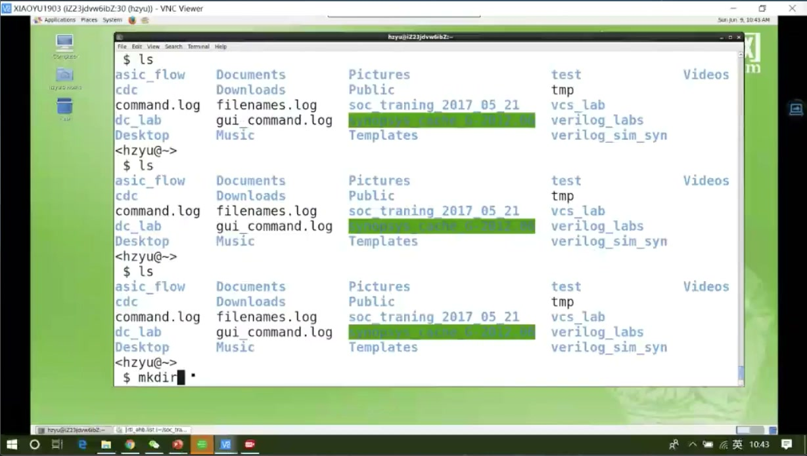
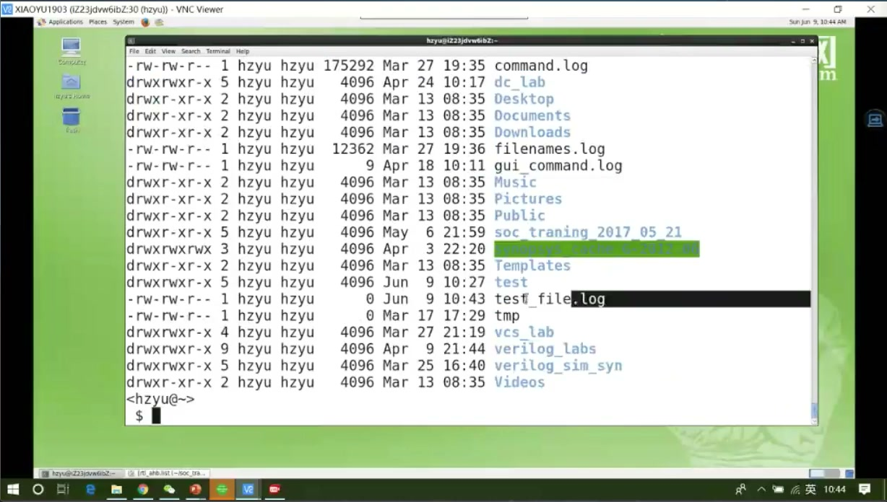
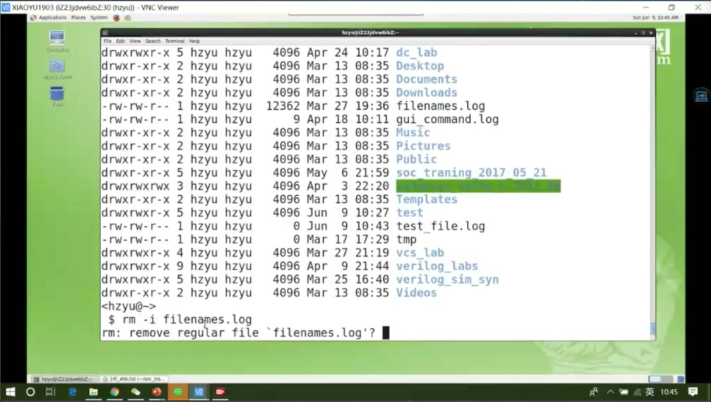
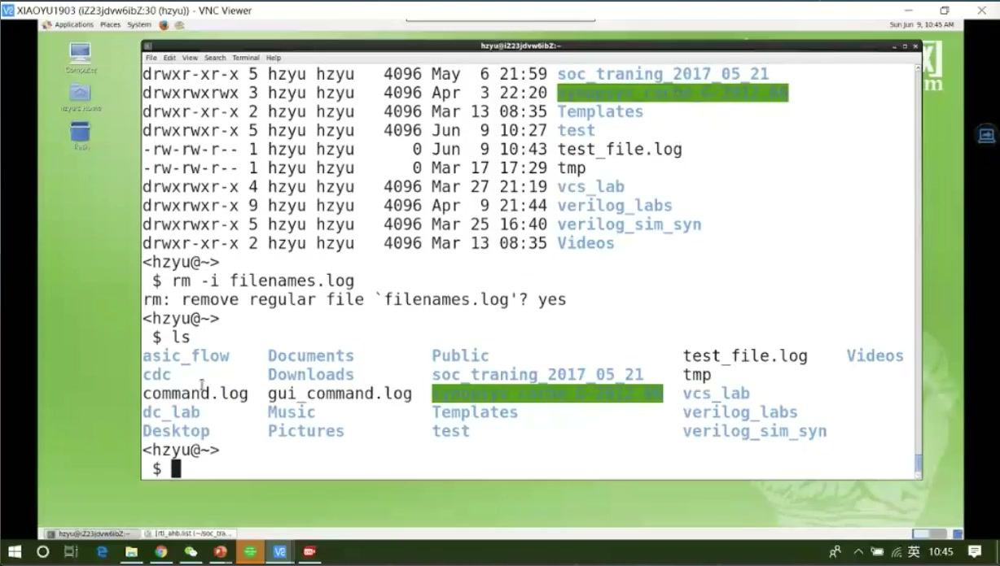

# 任务04：linux操作系统常用命令

## 本章知识全景图

### 1. 一眼看懂这讲在讲什么

- 本章主题：把 Linux 常用命令按工程使用场景重组，建立“目录导航、文件操作、查找过滤、权限与进程”四条主线。
- 核心概念：touch/mkdir/rm/cp/mv、who/whoami/w、pwd/cd/相对路径/绝对路径、find/grep/管道/重定向、which/whereis、chmod、前后台进程控制。
- 逻辑主线：先掌握最基本的文件与目录操作，再掌握路径与查找，接着理解文本过滤和重定向，最后补上权限和前后台控制这些工程中常见的实用命令。
- 最小主线：
  - 文件系统操作最先要会：创建、查看、删除、复制、移动。
  - 路径意识决定你能不能在工程目录里走得对。
  - `find + grep + 管道 + 重定向` 决定你能不能从大量文件里快速找东西。
  - 权限和进程控制决定你能不能在共享服务器环境里正常协作。

### 2. 概念地图

| 概念层级 | 核心概念 | 前置知识 | 延伸应用 |
| :---: | :--- | :--- | :--- |
| 一级概念 | 文件与目录操作 | shell 基础 | 创建、删除、复制、移动工程文件 |
| 一级概念 | 路径与导航 | 根目录、用户目录 | 在工程目录树中切换位置 |
| 一级概念 | 用户与会话 | 多用户 Linux | 判断当前用户与在线用户 |
| 一级概念 | 查找与过滤 | 文件树、文本流 | 生成 file list、定位文件与内容 |
| 一级概念 | 权限控制 | 用户/组/其他用户 | 共享目录与文件访问 |
| 一级概念 | 进程与前后台 | 终端进程 | 挂起、恢复、终止工具 |

### 3. 阅读顺序 / 处理顺序

- 先掌握最常用的文件、目录和路径命令。
- 再掌握工程里最常见的查找、过滤和重定向组合。
- 最后补上权限和前后台控制，因为这些通常在多人服务器环境里最容易踩坑。

## 1. 这节课真正要建立的不是“记命令表”，而是命令分工意识

Linux 命令课最容易学坏的一点，就是把它当成命令清单去背。这样一来，命令一多就散，真正进工程目录时还是不知道先用哪个。更有效的学法是先按功能分组，再在每组里记住代表命令和结果判断。

这节课可以压成四组：

- 文件与目录操作：`touch`、`mkdir`、`rm`、`cp`、`mv`
- 用户与环境：`whoami`、`who`、`w`、`clear`
- 路径与导航：`pwd`、`cd`、`.`、`..`、`~`、Tab 补全
- 查找与权限：`find`、`grep`、管道、重定向、`which`、`whereis`、`chmod`

这样重组以后，你面对工程环境时思路会清楚很多：我现在是在创建文件、找文件、切路径、看权限，还是在处理前后台工具。

## 2. 文件和目录操作：最先要会的是创建、确认、删除

### 2.1 `touch` 的作用是创建文件，不是创建目录

`touch` 用来创建文件，和前面学过的 `mkdir` 形成最基本的一组对照：

- `mkdir` 创建目录
- `touch` 创建文件

这节课一上来就讲 `touch`，其实是在补一条很基础但非常实用的分工：目录和文件不是一回事，所以命令也不是一回事。你在工程目录里如果要先造一个日志文件、占位文件、空脚本文件，`touch` 是最直接的入口。

下面这组图正好能完整演示“建文件 -> 确认文件出现 -> 交互删除 -> 确认文件消失”这条最基础的命令链。

这一组图只解决一件事：让你把 `touch` 和 `rm -i` 的效果真正看成屏幕状态变化，而不是背几个命令名。

这里不能只看最终结果，因为第一次练命令时，真正容易混的不是命令怎么拼，而是“执行后到底应该看到什么变化”。

> 图1 起始态：终端已进入当前目录，开始输入创建文件的命令。

> 图2 结果态：执行后再查看目录，能看到新文件已经出现在列表中。

> 图3 决策点：`rm -i` 删除文件时会先询问是否确认，这一步体现了交互式删除和强制删除的区别。

> 图4 最终结果：确认删除后再次查看目录，目标文件已经不在列表中。

`🔍 视觉验证：视频 01:14-03:24（终端命令链：应看到 `touch` 创建文件、`ll/ls` 查看文件、`rm -i` 提示确认以及文件删除后的列表变化）`

### 2.2 `rm` 最重要的不是“能删”，而是不同选项的风险级别

`rm` 的危险性在于它会真实修改文件系统，所以必须把几个常见选项的语义分清：

- `-i`：删除前询问确认
- `-f`：强制删除，不再确认
- `-r`：递归删除目录及其内容
- `-v`：输出删除过程

工程上最重要的不是把这几个选项背下来，而是知道什么时候风险上升：

- 删除单个普通文件时，`rm -i` 比较安全。
- 删除目录时，往往需要 `-r`。
- 一旦写成 `rm -rf`，就进入“默认不确认、递归全删”的高风险状态。

所以 `rm -rf` 不是“高级用法”，而是“危险但常见”的工程用法。用之前必须知道自己站在哪个目录、删的目标是谁。

`🔍 视觉验证：视频 02:14-04:53（rm 选项说明：应看到 `-r / -i / -f / -v` 的解释，以及老师强调递归删除与强制删除的差别）`

### 2.3 `cp` 和 `mv` 的差别是“复制”还是“搬走”

`cp` 保留源文件，额外生成一份副本；`mv` 把文件或目录从一个位置移动到另一个位置，本质上是改位置或改名。它们都会遇到目标存在时的覆盖问题，所以也会出现 `-i`、`-f` 这类“是否确认 / 是否强制”的选择。

工程上可以这样记：

- 想保留原件，用 `cp`
- 想改位置或改名字，用 `mv`

## 3. 用户与环境：先知道自己是谁、还有谁在线

在共享服务器环境里，用户信息不是背景知识，而是操作上下文的一部分。

- `whoami`：看当前 shell 里你是谁
- `who`：看有哪些用户登录到了系统
- `w`：看有哪些用户在线，并附带当前工作状态
- `clear`：清屏，让终端输出重新变干净

这些命令本身不复杂，但在服务器环境里非常常用。尤其是 `who` 和 `w`，它们让你知道系统是不是多用户共享状态，也帮助你理解为什么服务器环境和你本机不一样。

视频里讲这部分时，其实是在把“Linux 是多用户、多任务系统”这件事变成可观察现象，而不是一句概念定义。

## 4. 路径与导航：这是工程目录里最容易卡人的部分

### 4.1 `pwd` 解决的是“我现在到底在哪里”

只要一进入多层目录树，最容易丢的不是命令，而是当前位置。`pwd` 的作用就是把你当前所在的绝对路径完整打印出来。它不是装饰命令，而是定位命令。

当你在工程目录里走了很多层以后，`pwd` 最值钱的地方不是“能显示路径”，而是能帮你判断：

- 你现在是不是还在目标工程里
- 你当前路径是绝对路径还是你脑中记错了
- 你接下来输入的 `rm / cp / mv / find` 会作用在哪里

### 4.2 `cd`、`.`、`..`、`~` 是导航系统，不是零散符号

这几组符号必须当成一套导航语言来记：

- `cd 目录名`：进入指定目录
- `cd ..`：回到上一级目录
- `.`：当前目录
- `..`：父目录
- `~`：当前用户家目录

视频后半段反复强调相对路径和绝对路径，就是因为工程里很多错误并不是命令本身错，而是路径错了。比如：

- 命令没问题，但你当前不在那个目录下
- 子目录还没建好，却直接想往里创建更深一层目录
- 以为自己在工程目录里，实际上已经退回了用户目录

这也是为什么 `cd` 不能只会“进目录”，还必须会“回退、确认、补全”。

## 5. 查找、过滤、重定向：Linux 命令真正开始像工程工具的地方

### 5.1 `find` 的价值在于递归搜索

当目录树开始变深，人工一级一级进去找文件就变得低效。`find` 的价值就在于它会递归遍历目录树，把满足条件的文件路径找出来。

这节课里最典型的例子是：在一个工程目录里递归查找所有 `.v` 文件，并把路径输出成列表文件。这个例子非常像真实工程里的 filelist 生成动作，所以它比单纯的“找某个文件”更有代表性。

> 图5 递归查找示例：使用 `find -name "*.v" -print` 之后，终端按路径列出了当前工程目录下的 Verilog 文件。

`🔍 视觉验证：视频 07:47-10:03（find 示例：应看到 `find -name "*.v" -print` 递归列出多个 `.v` 文件路径，并被讲成生成 filelist 的基础手段）`

`find` 最重要的不是语法本身，而是三件事：

- 它会递归找
- 它既能找文件名，也能配合其他条件
- 它的输出可以继续送给别的命令处理

### 5.2 `grep` 和管道让“找东西”升级成“筛东西”

`grep` 负责按内容或模式筛选结果；管道 `|` 负责把前一个命令的输出送给后一个命令。它们一起用时，Linux 命令才真正开始像“数据流工具”。

典型理解方式是：

- `find` 负责把候选对象找出来
- `grep` 负责从候选对象里筛掉不需要的
- `|` 负责把两者接起来

所以 `ls -a | grep /bin` 这种写法，真正表达的不是两个命令并排放，而是“先列出，再过滤”。

### 5.3 重定向把屏幕输出变成文件

如果只在终端里显示结果，很多工程输出都留不住。重定向的价值，就是把原本准备打印到屏幕上的内容送进文件，便于后续复查、提交、脚本化处理。

这和 `find` 特别搭：你既可以在屏幕上看结果，也可以直接把查找结果写进 filelist。

## 6. `which`、`whereis`、Tab 补全、前后台控制、`chmod`：这些命令解决的是工程使用效率

### 6.1 `which` 和 `whereis`

这两个命令解决的是“工具到底在哪里”：

- `whereis` 更偏安装位置和相关目录
- `which` 更偏当前 shell 真正执行到的启动路径

工程上更常用的是 `which`，因为你最关心的是：我现在敲这个命令，系统到底从哪个路径调用了它。

### 6.2 Tab 补全

Tab 不是输入法捷径，而是高频效率工具。命令、路径、文件名敲到一半时，它能自动补全；如果有多个候选，还会提示你当前有哪些可能选项。目录越深、文件越多，Tab 的价值越大。

### 6.3 前后台与 `Ctrl+Z` / `fg` / `Ctrl+C`

这组操作要分清：

- `Ctrl+Z`：挂起前台程序，不是退出
- `fg`：把挂起程序恢复到前台
- `Ctrl+C`：真正中断当前前台程序

这里最容易错的地方是把挂起误以为退出。视频里专门拿 GUI 工具做演示，就是为了把“挂起来”和“关掉了”这两个状态分开。

### 6.4 `chmod`

`chmod` 解决的是权限问题。单用户本机里这件事不突出，但共享服务器环境里非常关键，因为文件和目录是否可读、可写、可执行，直接决定别人能不能进你的目录、能不能读你的文件、能不能跑你的脚本。

视频后段花很多时间讲 `u/g/o` 和 `r/w/x`，本质上是在教你理解三层对象：

- `u`：当前用户本人
- `g`：同组用户
- `o`：其他用户

以及三类权限：

- `r`：可读
- `w`：可写
- `x`：可执行 / 可进入目录

最容易忽略的一点是：目录权限没开，就算文件权限开了，别人也未必能进去。所以权限判断必须一层一层看。

## 7. 这节课最该留下的不是命令表，而是操作判断

如果把这节课压成工程判断，可以只留下这几条：

- 创建文件用 `touch`，创建目录用 `mkdir`
- 删除前先判断对象是文件还是目录，再判断是否需要确认
- 一切路径问题先用 `pwd` 确认当前位置
- 目录深了以后，优先用 `find` 递归找，不靠肉眼翻
- 过滤和组合输出时，用 `grep`、管道和重定向
- 共享服务器里，权限和前后台控制都是高频问题，不是边角料

## 8. 最后速记

### 8.1 本章最该记住的结论

- Linux 常用命令最有效的学法不是背列表，而是按“文件/路径/查找/权限/进程”分组记。
- `touch`/`mkdir` 解决创建，`rm`/`cp`/`mv` 解决文件系统修改，`pwd`/`cd`/Tab 解决导航，`find`/`grep`/管道/重定向` 解决工程级查找与过滤。
- `Ctrl+Z` 是挂起，`fg` 是恢复，`Ctrl+C` 才是中断。
- `chmod` 的关键不是语法，而是理解 `u/g/o` 与 `r/w/x` 在共享服务器环境里的实际含义。

### 8.2 复现 / 复习清单

- 你能不能自己完成一次“创建文件 -> 查看文件 -> 交互式删除 -> 确认删除结果”的命令链。
- 你能不能解释相对路径和绝对路径为什么会导致同一条命令在不同目录下结果不同。
- 你能不能用 `find` 找出工程目录下所有 `.v` 文件，并说明为什么它适合生成 filelist。
- 你能不能说清 `Ctrl+Z`、`fg`、`Ctrl+C` 的差别。
- 你能不能解释为什么目录权限不开，别人就算知道文件名也可能进不来。
