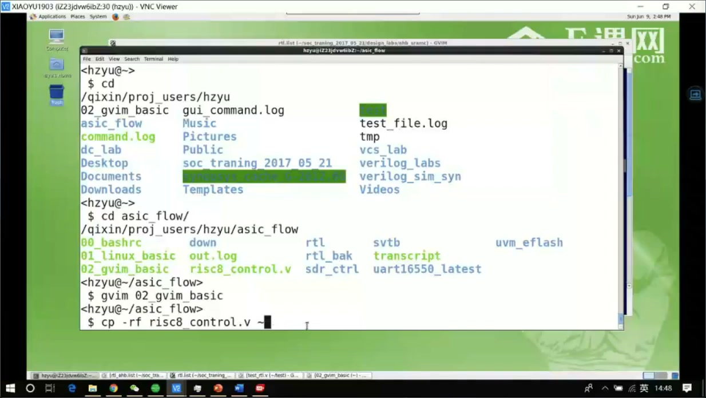
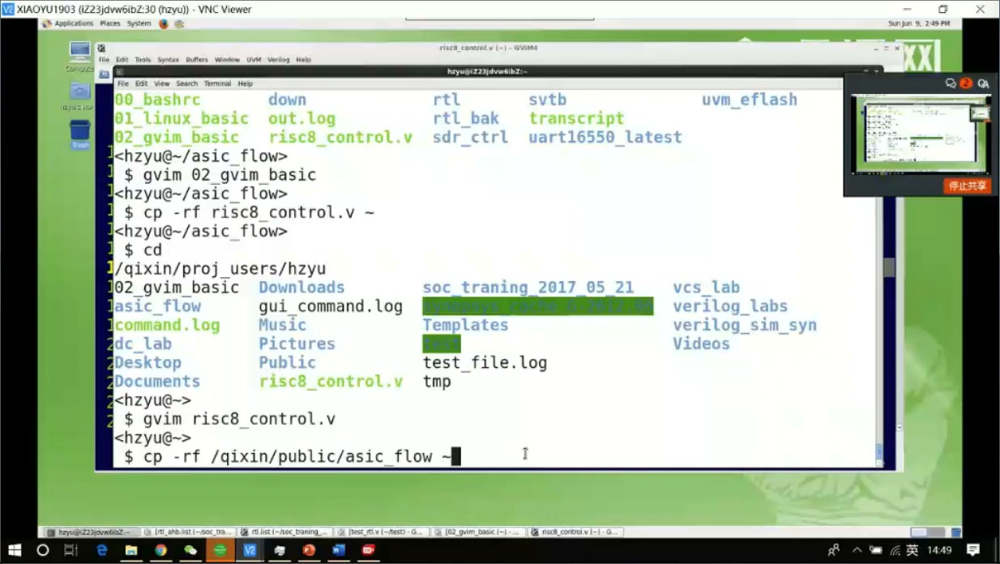
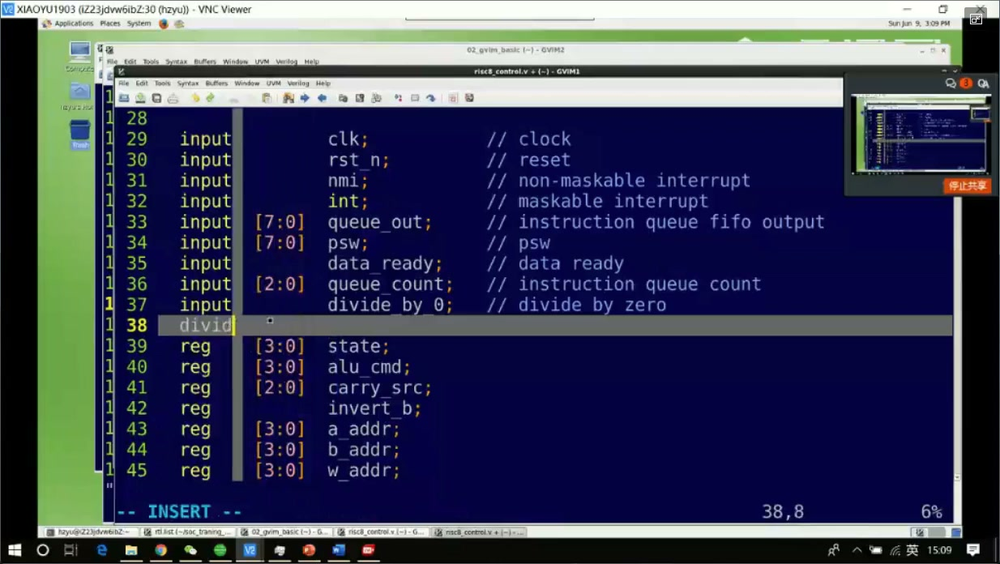
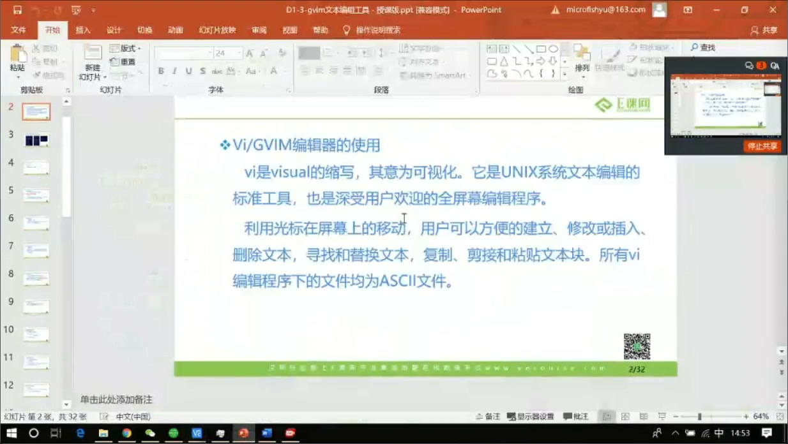
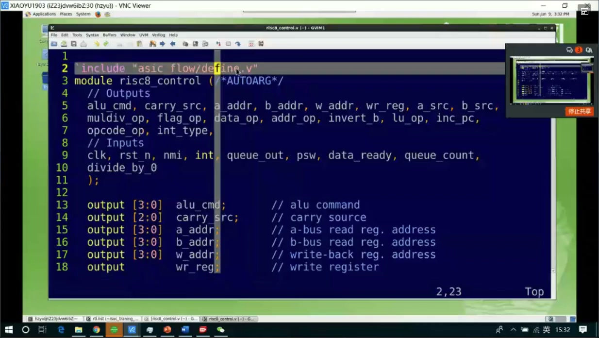

# 任务05：linux 与 gvim 文本编辑工具操作实践

## 本章知识全景图

这一讲不是新概念课，而是一次“把 Linux 和 gvim 用起来”的操作课。它的核心目标很明确：先把课程公共目录里的练习工程复制到自己的工作目录，再单独拷出一个 Verilog 文件做编辑练习，最后把前面学过的 gvim 命令真实敲一遍。

最小主线：

- 用 `cp -rf` 把公共工程复制到自己的目录。
- 用 `ls`、`cd`、Tab 补全确认路径和文件是否存在。
- 从工程里单独拷出 `risk_control.v` 这类练习文件，避免破坏原始作业材料。
- 用 gvim 打开文件，练习插入、删除、列编辑、复制粘贴和跳转。
- 用 `Ctrl-n`、`gf`、`Ctrl-o` 这类命令提高代码编辑效率。

## 1. 为什么先复制工程，而不是直接改公共文件

课程一开始让大家先删掉当前目录下旧的 `asicflow`，再从公共目录重新复制一份。这个动作不是形式主义，而是在建立工程操作的底线：公共目录或原始工程只作为来源，不直接在里面做个人实验。

典型命令结构可以理解成：

```bash
rm -rf asicflow
cp -rf <public_path>/asicflow .
ls
cd asicflow
```

这里最重要的是 `cp -rf` 的含义：

- `cp` 是复制。
- `-r` 递归复制目录。
- `-f` 遇到已有目标时强制覆盖。
- 最后的 `.` 表示复制到当前目录。



> 图1 复制工程到目标目录：教师强调把 `asicflow` 复制到个人目录，不要直接改公共来源。

真正要养成的习惯是：**先复制，再练习；先确认路径，再编辑文件。**

## 2. 单独拷出练习文件，保护原始工程

复制完整工程以后，课程又要求把 `risk_control.v` 单独拷出来。原因很直接：后续作业还会依赖原始工程，如果直接在工程内部乱改，后面很难判断错误来自作业要求还是自己练习留下的修改。

推荐动作：

```bash
cd asicflow
ls
cp -rf risk_control.v ~/
cd ~
ls
gvim risk_control.v
```



> 图2 复制 Verilog 练习文件：把工程里的 `risk_control.v` 单独拷到外层目录，用于 gvim 操作练习。

这个过程同时训练了三个基本能力：找文件、复制文件、确认复制结果。以后做 RTL 项目时，这三件事会非常高频。

## 3. Tab 补全是减少路径错误的第一道保险

课中反复提醒使用 Tab 补全。它不是偷懒工具，而是工程环境里的安全工具。长路径、长文件名、模块名、端口名都很容易敲错，Tab 补全能直接用文件系统或编辑器当前上下文帮你确认候选。

在 shell 里：

```bash
cd asi<Tab>
cp -rf ris<Tab> ~/
```

在 gvim 插入模式里，`Ctrl-n` 可以根据当前文件内容补全变量名、端口名或已有单词。例如你已经写过 `DIV_CLK`，后面只输入 `DIV` 再按 `Ctrl-n`，编辑器会列出可能候选。



> 图3 文件名与端口名补全：`Ctrl-n` 可根据上下文补全已有标识符，减少端口名写错。

对于 RTL 来说，补全的价值尤其高：端口名写错通常不会只是“拼写问题”，它会变成仿真连线错误、综合警告或难查的功能 bug。

## 4. gvim 练习不是背命令，而是建立编辑动作

这一讲安排了半小时让学员自己操作，原因是 gvim 的核心不在“知道命令”，而在形成手感。比如 `i` 进入插入模式、`Esc` 回命令模式、`dd` 删除行、`yy` 复制行、`p` 粘贴、`u` 撤销，这些命令只有在真实文件里反复敲，才会变成可用能力。



> 图4 打开 Verilog 文件后进入编辑状态：这一阶段的任务是把前面学过的 gvim 命令逐个试出来。

可以按下面顺序自测：

1. 打开一个练习 `.v` 文件。
2. 用 `i` 插入几行注释。
3. 用 `Esc` 回到命令模式。
4. 用 `x` 删除字符，用 `dd` 删除行。
5. 用 `u` 撤销。
6. 用 `yy`、`p` 复制粘贴一行。
7. 用 `Ctrl-v` 进入列选择，尝试改一列端口方向。

## 5. `gf` 和 `Ctrl-o` 是代码跳转的雏形

讲到 include 文件时，课程展示了一个很重要的 gvim 能力：当光标落在文件路径上时，`gf` 可以跳到该文件；跳过去以后，`Ctrl-o` 可以回到原来的位置。

这对 RTL 阅读非常关键。真实项目里经常会遇到：

```verilog
`include "define.v"
```

如果路径存在，`gf` 能直接打开 `define.v`；如果文件不存在，gvim 会提示无法找到。于是你不仅在编辑文本，也在验证 include 路径是否真实可达。



> 图5 include 文件跳转：先用 `touch` 创建 `define.v`，再用 `gf` 从 include 路径跳入文件。

这个动作背后的工程意义是：代码不是孤立文件，而是一棵互相 include、互相实例化、互相依赖的工程树。编辑器跳转能力越熟，读工程越快。

## 6. 本章最该留下的操作清单

| 场景 | 命令 / 动作 | 要解决的问题 |
| --- | --- | --- |
| 复制练习工程 | `cp -rf <src> .` | 把公共材料复制到个人目录 |
| 清理旧目录 | `rm -rf asicflow` | 避免旧文件干扰新练习 |
| 确认目录内容 | `ls` | 检查文件是否存在 |
| 进入目录 | `cd asicflow` | 切换工作位置 |
| 打开文件 | `gvim risk_control.v` | 进入编辑器 |
| 补全路径 | `Tab` | 减少路径拼写错误 |
| 补全单词 | `Ctrl-n` | 减少代码标识符拼写错误 |
| 跳到文件 | `gf` | 跟踪 include 文件 |
| 返回原位置 | `Ctrl-o` | 从跳转位置回到上下文 |

## 7. 复习自测

- 你能不能解释为什么不能直接改公共目录里的工程？
- 你能不能独立完成“复制工程 -> 找到文件 -> 单独拷出文件 -> 用 gvim 打开”的流程？
- `Tab` 和 `Ctrl-n` 分别解决什么补全问题？
- `gf` 跳转失败时，最可能说明什么问题？
- 为什么 RTL 练习里要保护原始 `.v` 文件？
