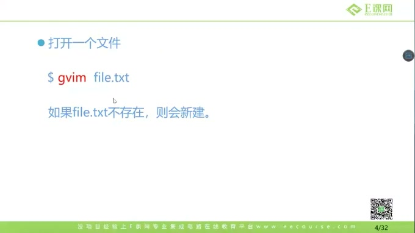
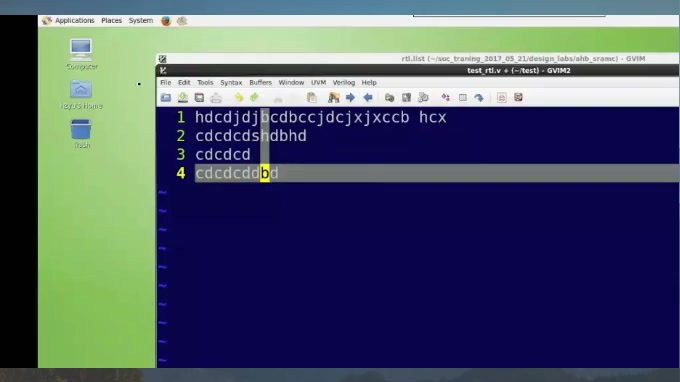
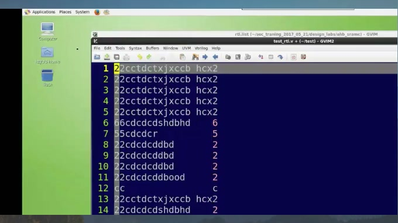
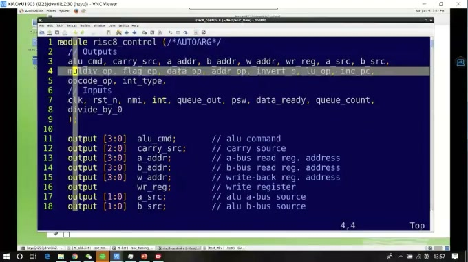
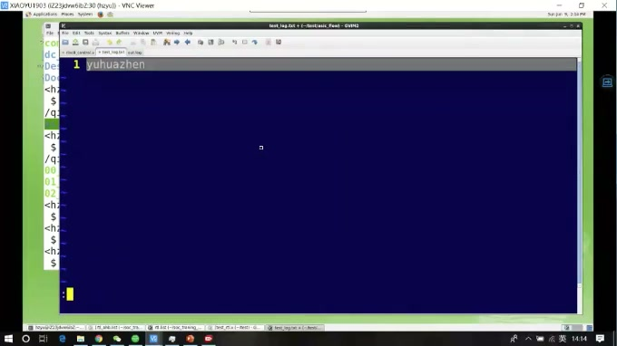
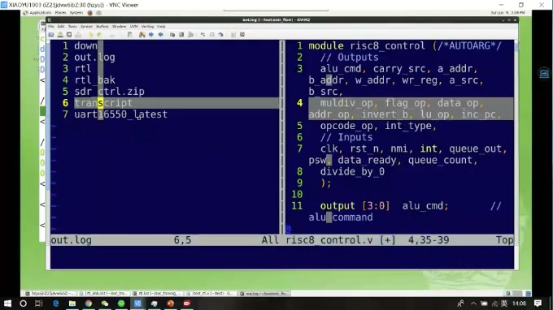
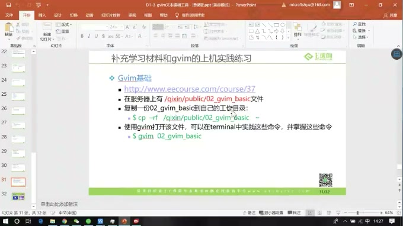

# 任务06：gvim 文本编辑工具

## 本章知识全景图

这一讲系统讲 gvim 的编辑模型。它的重点不是“记住很多命令”，而是理解 gvim 为什么能高效编辑代码：它把编辑动作分成模式，把常见文本操作压缩成短命令，并提供列编辑、分屏、跳转、文件比较等工程能力。

最小主线：

- gvim 有三种核心模式：命令模式、插入模式、底行命令模式。
- 插入模式负责输入文本；命令模式负责移动、删除、复制、粘贴和修改；底行命令模式负责保存、退出、跳转和替换。
- `Ctrl-v` 列编辑非常适合批量修改端口方向、缩进和对齐。
- `:vsp` / `:sp` 分屏适合对照多个文件。
- `gvimdiff` 适合比较两个文件差异。

## 1. 三种模式是理解 gvim 的钥匙

gvim 和普通文本编辑器最大的差别，是它不是一直处在“输入文字”的状态。刚打开文件时，默认是命令模式；按 `i`、`a`、`o` 等才进入插入模式；按 `Esc` 回到命令模式；输入 `:` 进入底行命令模式。



> 图1 gvim 三种模式概览：命令模式、输入模式、底行模式分别承担不同任务。

三个模式的分工：

| 模式 | 进入方式 | 主要用途 |
| --- | --- | --- |
| 命令模式 | 打开文件默认进入，或按 `Esc` | 移动、删除、复制、粘贴、撤销、进入其他模式 |
| 插入模式 | `i`、`a`、`o`、`I`、`A`、`O` | 真正输入代码或文字 |
| 底行模式 | 命令模式下输入 `:` | 保存、退出、查找替换、跳转行号、分屏 |

这也是初学者最容易卡住的地方：如果你在命令模式直接敲字母，它不会把字母写进文件，而会执行命令。

## 2. 插入、移动、删除和撤销构成最小编辑闭环

课程先用一个新建文件演示：`gvim test_rtl.v` 如果文件不存在，gvim 会打开一个空文件，保存后才真正落盘。进入插入模式后，键盘输入才会变成文件内容。

常用动作：

```vim
i      " 在当前光标前插入
a      " 在当前光标后追加
o      " 在下一行新开一行并插入
Esc    " 回到命令模式
h/j/k/l 或方向键  " 左/下/上/右移动
x      " 删除当前字符
dw     " 删除一个单词
dd     " 删除当前行
u      " 撤销上一步
```



> 图2 插入与删除状态：在插入模式写入文本，回到命令模式后用移动、删除和撤销命令编辑。

对写 RTL 来说，`u` 尤其重要。练习命令时不用怕试错，只要知道如何撤销，学习速度会快很多。

## 3. 复制粘贴与列编辑：面向代码的真正高频操作

普通复制粘贴解决“行级重复”，列编辑解决“批量同列修改”。RTL 里大量端口、信号、例化连接都呈列状排列，所以 `Ctrl-v` 是 gvim 对代码编辑最有价值的功能之一。

基本流程：

```vim
Ctrl-v  " 进入可视块模式
j/k/h/l " 扩展选择区域
y       " 复制选择块
p       " 粘贴
d       " 删除选择块
I       " 在块前批量插入
```



> 图3 列选择复制粘贴：只选中一列内容，然后复制到其他列位置。

列编辑适合这些场景：

- 把多行 `output` 改成 `input`。
- 给多行信号统一加前缀。
- 批量插入缩进。
- 复制端口列表中的一列信号名。



> 图4 可视块列选择：`Ctrl-v` 后移动光标，颜色变化的区域就是当前选中的块。

## 4. 大小写转换也是批量编辑能力

在可视块或可视选择状态下，`U` 可以把选中内容转成大写，`u` 可以转成小写。这个命令看似小，但在端口名、宏名、参数名规范化时很有用。



> 图5 大小写转换：先用可视块选中内容，再用 `U` 或 `u` 做批量大小写转换。

注意：这里的 `u` 有两种含义。普通命令模式下的 `u` 是撤销；可视选择状态下的 `u` 是把选中内容转小写。要先看自己处在哪个模式。

## 5. 分屏让你同时看多个文件

gvim 支持在一个窗口里打开多个文件。课程中演示了 `:vsp` 打开垂直分屏，一边看当前文件，一边打开另一个文件。真实项目里，这个功能很适合对照模块定义和例化、头文件和使用处、旧版本和新版本。

常用命令：

```vim
:vsp other_file.v   " 垂直分屏打开文件
:sp other_file.v    " 水平分屏打开文件
Ctrl-w h/j/k/l      " 在窗口之间移动
:q                  " 关闭当前窗口
```



> 图6 分屏查看文件：左、右两栏同时打开不同文件，适合对照阅读。

分屏的价值不是“看起来高级”，而是减少来回关闭/打开文件造成的上下文丢失。

## 6. gvimdiff 用来比较两个文件的差异

`gvimdiff` 可以直接比较两个文件，差异位置会用颜色标出。它适合检查自己修改了什么，也适合对比模板文件和作业文件。

```bash
gvimdiff file_a.v file_b.v
```



> 图7 gvimdiff 比较结果：不同内容被高亮标出，方便快速定位改动。

在工程里，文件比较是非常重要的习惯。不要只凭记忆说“我改了一点点”，要让工具告诉你具体改了哪几行。

## 7. 本章速记

| 目标 | 命令 |
| --- | --- |
| 进入插入模式 | `i`、`a`、`o` |
| 回命令模式 | `Esc` |
| 删除字符 / 单词 / 行 | `x`、`dw`、`dd` |
| 复制 / 粘贴 | `yy`、`p` |
| 撤销 | `u` |
| 列编辑 | `Ctrl-v` |
| 批量转大写 / 小写 | 可视选择后 `U` / `u` |
| 保存退出 | `:wq` |
| 不保存退出 | `:q!` |
| 垂直分屏 | `:vsp file` |
| 文件比较 | `gvimdiff a b` |

## 8. 复习自测

- 你能不能解释命令模式和插入模式的区别？
- 为什么 `Ctrl-v` 对 RTL 端口列表特别有用？
- `u` 在普通命令模式和可视选择模式下分别是什么意思？
- 什么时候用 `:vsp`，什么时候用 `gvimdiff`？
- 你能不能不用鼠标完成“打开文件、写几行、删除一行、撤销、保存退出”？
