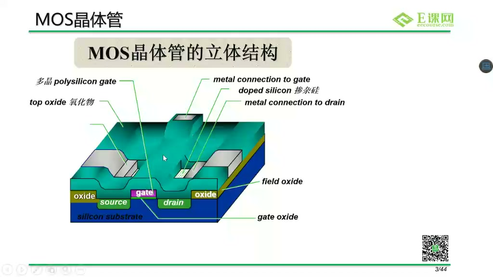
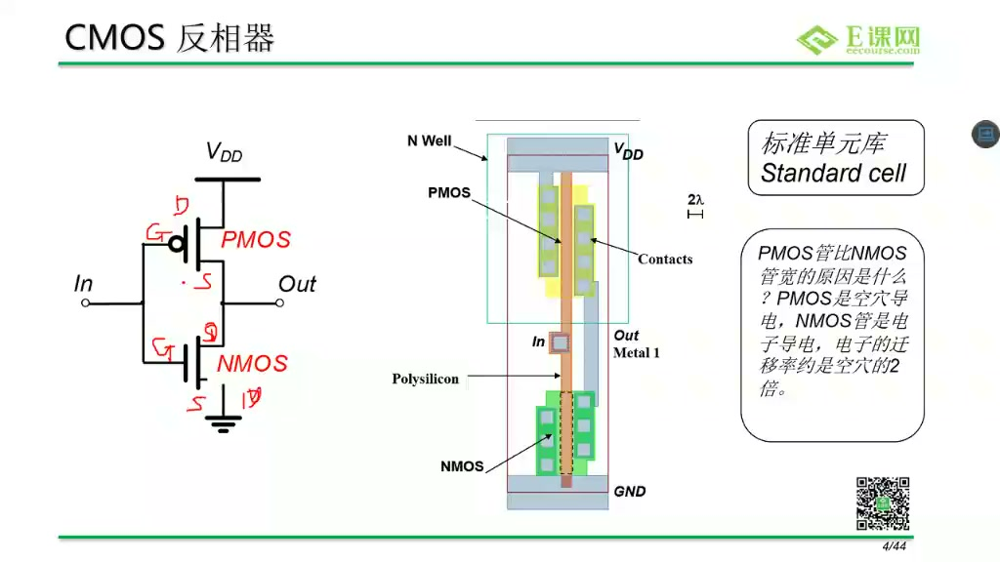
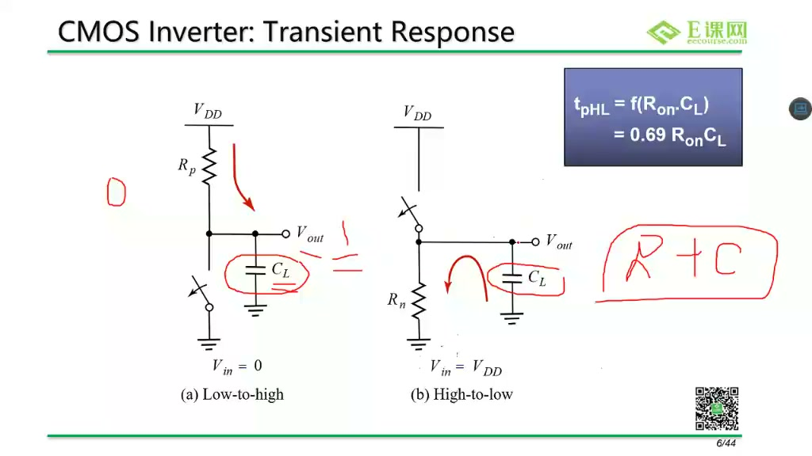
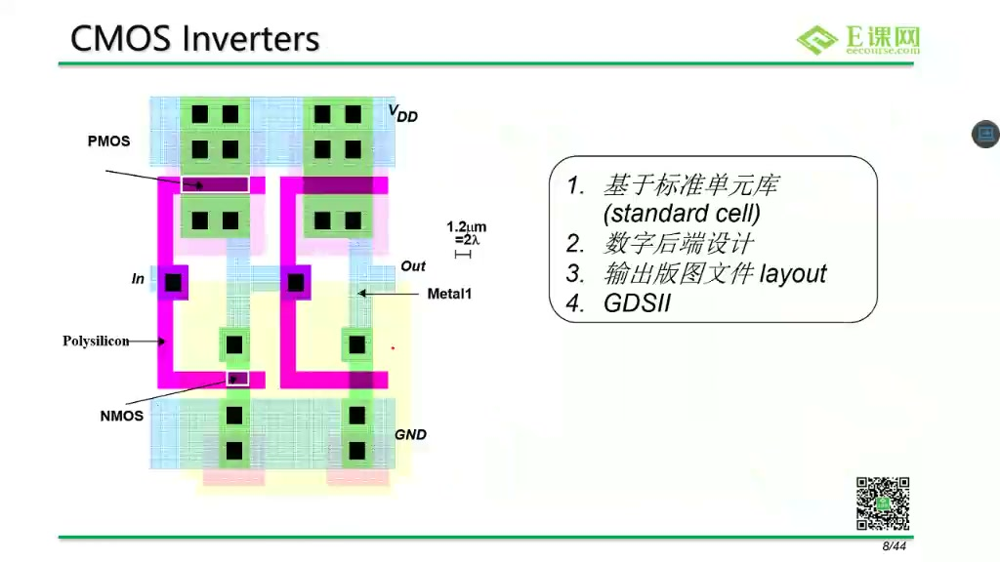
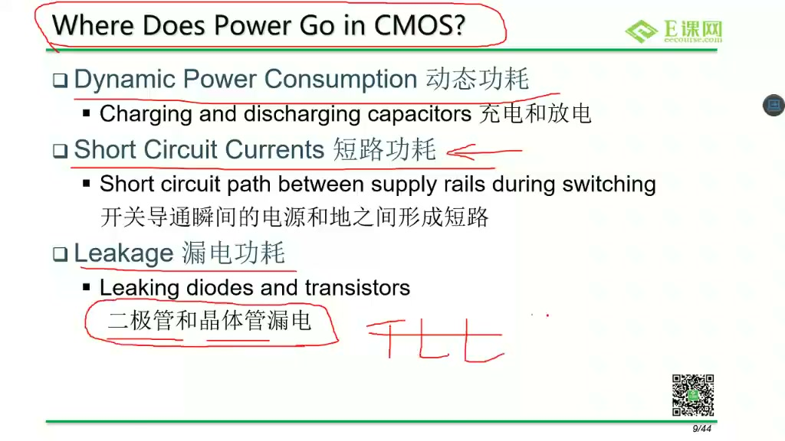
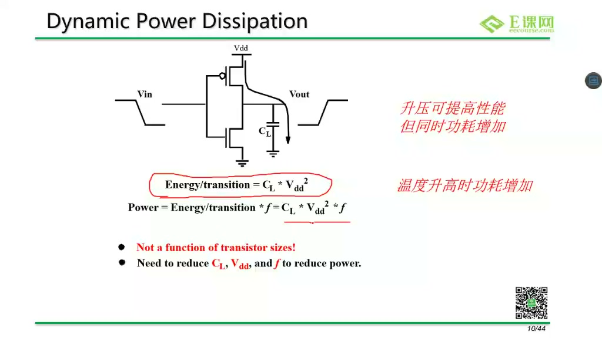
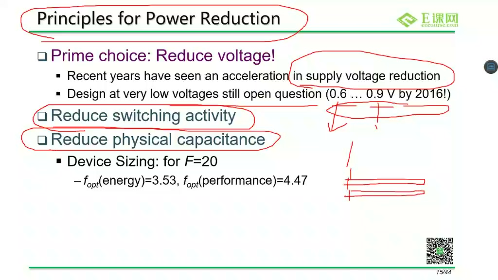
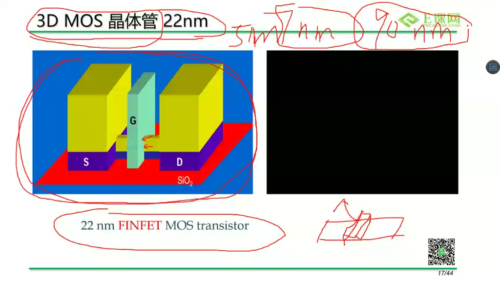
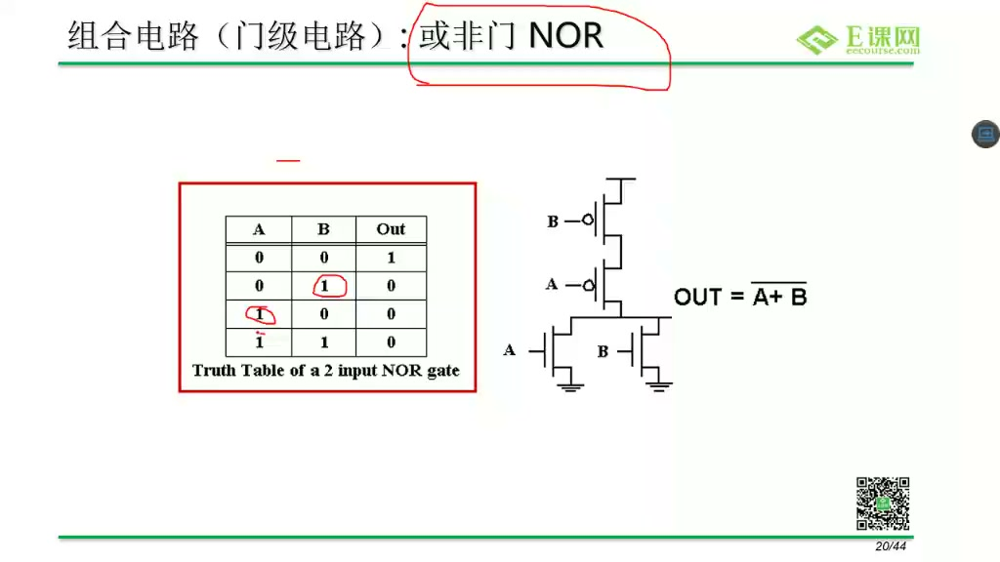

# 任务07：数字电路基础

## 本章知识全景图

这一讲把后续 RTL、仿真和综合需要的电路背景先补起来。老师明确说，如果不知道数字电路是什么，直接讲仿真工具和综合工具会变成空中楼阁。数字前端虽然主要写 RTL，但 RTL 最终要落到 CMOS 门电路，所以必须理解 MOS 管、CMOS 反相器、功耗、噪声容限、工艺缩放和基本门结构。

最小主线：

- MOS 管可以先理解成受 gate 控制的开关。
- CMOS 反相器由 PMOS 上拉和 NMOS 下拉组成。
- 输出电平变化本质上是在给负载电容充电或放电。
- 功耗至少要分清动态功耗、短路功耗和漏电功耗。
- 工艺缩放会影响速度、功耗、面积和漏电。
- NAND / NOR 这类门可以用 PMOS / NMOS 串并联关系解释。

## 1. MOS 管先按“受控开关”理解

课程从 MOS 管结构讲起：源极、漏极、栅极。对于初学者，第一层理解不需要立刻陷入物理细节，可以先把它看成一个由 gate 电压控制的开关。



> 图1 MOS 管结构：gate 控制 source 与 drain 之间是否形成导电通路。

最小记忆：

- NMOS：gate 为高电平时导通。
- PMOS：gate 为低电平时导通。
- 导通不是“输出一个值”，而是让某条电气通路闭合。

这个区别很重要。数字逻辑里的 0/1 是抽象结果，电路层真正发生的是开关通断、充放电和电压变化。

## 2. CMOS 反相器为什么能实现取反

CMOS 反相器由上方 PMOS 和下方 NMOS 组成。输入为低时，PMOS 导通、NMOS 关断，输出被接到 VDD，得到高电平；输入为高时，NMOS 导通、PMOS 关断，输出被接到地，得到低电平。



> 图2 CMOS 反相器原理图与版图：上拉 PMOS 和下拉 NMOS 共同实现输入取反。

可以把它压成一张表：

| 输入 Vin | PMOS | NMOS | 输出 Vout |
| --- | --- | --- | --- |
| 0 | 导通 | 关断 | 1 |
| 1 | 关断 | 导通 | 0 |

这里的“输出高”不是凭空产生，而是 VDD 到输出节点之间形成通路；“输出低”也不是抽象赋值，而是输出节点到 GND 之间形成通路。

## 3. 电平转换背后是负载电容充放电

课程继续把 CMOS 反相器和负载电容联系起来。输出节点通常带有负载电容 `CL`。当 PMOS 导通时，VDD 通过 PMOS 给 `CL` 充电，输出升高；当 NMOS 导通时，`CL` 通过 NMOS 向地放电，输出降低。



> 图3 CMOS 瞬态响应：输出电平变化可以理解为负载电容的充电与放电过程。

这件事直接连接到数字前端的三个重要概念：

- 延迟：充放电需要时间，所以门不是零延迟。
- 功耗：充放电消耗能量，所以翻转越频繁，动态功耗越高。
- 驱动能力：管子越强、负载越小，电平转换越快。

所以“组合逻辑延迟”背后不是公式游戏，而是很多晶体管和电容在不断充放电。

## 4. VTC 曲线和噪声容限：为什么 0/1 不是一个点

真实电路里的 0 和 1 不是单个电压点，而是范围。输入低电平不能高过某个边界，输入高电平不能低过某个边界，否则反相器可能误判。



> 图4 CMOS VTC 曲线：输入电压跨过阈值区域后，输出会从高电平翻转到低电平。

要记住：

- `VIL`：仍能被识别为低电平的最高输入电压。
- `VIH`：能被识别为高电平的最低输入电压。
- 中间区域是不确定或过渡区域，不适合作为稳定逻辑输入。

数字电路看似只有 0/1，但硬件实现必须保证电压范围和噪声容限，否则逻辑抽象会失效。

## 5. 功耗不能只说“电路耗电”，要拆来源

课程把功耗拆成动态功耗、短路功耗和漏电功耗。对数字前端来说，最常见、最需要形成直觉的是动态功耗：节点翻转时给负载电容充放电，能量大致和 `CL`、`VDD^2`、翻转活动、频率相关。



> 图5 功耗组成：动态功耗、短路功耗和漏电功耗需要分开理解。

动态功耗常用近似：

```text
P_dynamic ≈ α · C_L · V_DD^2 · f
```

含义：

- `α` 是翻转活动因子。
- `C_L` 是负载电容。
- `V_DD` 是供电电压。
- `f` 是时钟频率。



> 图6 翻转活动与功耗公式：输出节点充放电次数越多，动态功耗越高。

这条公式对前端很有启发：降低功耗不只是后端问题。前端写 RTL 时的无效翻转、时钟使能、状态机编码、数据通路活动都会影响功耗。

## 6. 工艺缩放改变的不只是面积

课程讲到从平面 CMOS 到更先进结构时，重点不是背工艺名，而是理解缩放带来的综合影响。尺寸变小通常带来面积收益和速度潜力，但也会引入漏电、阈值、电容、电源电压和制造复杂度问题。



> 图7 FinFET 与工艺缩放：降低电压、减少翻转、降低物理电容都是功耗优化方向。

前端要建立的意识是：工艺不是后端和制造才关心的背景。目标频率、功耗预算、面积预算、库单元选择、时序约束，最终都会受到工艺条件影响。

## 7. NAND / NOR 可以从串并联看懂

基本 CMOS 门电路可以用 PMOS 网络和 NMOS 网络的互补关系来解释。NAND、NOR 的逻辑功能不是死记真值表，而是看“什么时候上拉导通，什么时候下拉导通”。



> 图8 NAND CMOS 结构：NMOS 串联、PMOS 并联时，只有输入同时满足条件才形成下拉通路。



> 图9 NOR CMOS 结构：串并联结构决定上拉和下拉网络的导通条件。

学习方法：

- 先判断 NMOS 网络什么时候能把输出拉到 0。
- 再判断 PMOS 网络什么时候能把输出拉到 1。
- 最后把导通条件翻译成布尔表达式。

这样学门电路比只背符号更可靠，后面看标准单元、综合结果和门级网表时也更容易理解。

## 8. 本章速记

- MOS 管先看成 gate 控制的开关。
- CMOS 反相器靠 PMOS 上拉、NMOS 下拉实现取反。
- 输出变化是负载电容充放电，不是抽象赋值。
- 0/1 是电压范围，VTC 和噪声容限决定范围边界。
- 动态功耗近似和 `α · C_L · V_DD^2 · f` 相关。
- 工艺缩放同时影响速度、功耗、面积、漏电和制造复杂度。
- NAND / NOR 要从 PMOS / NMOS 串并联结构理解。

## 9. 复习自测

- 为什么 NMOS 导通通常对应 gate 高电平，PMOS 导通对应 gate 低电平？
- CMOS 反相器输入为 0 时，输出为什么是 1？
- 动态功耗里的 `V_DD^2` 为什么说明降电压很有效？
- `VIL` 和 `VIH` 分别约束什么？
- NAND 门和 NOR 门的 PMOS / NMOS 串并联关系有什么区别？
