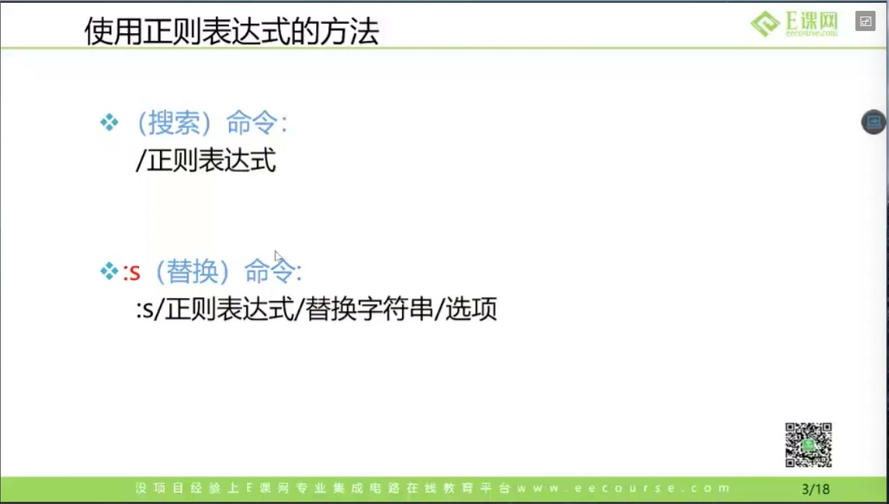
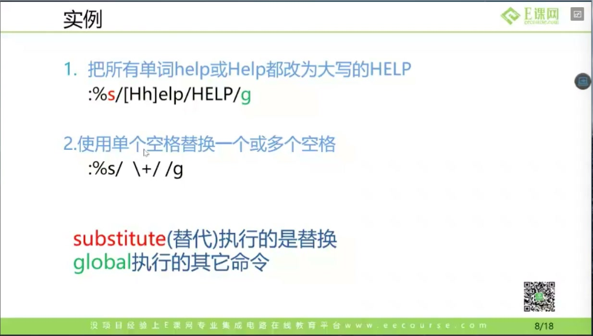
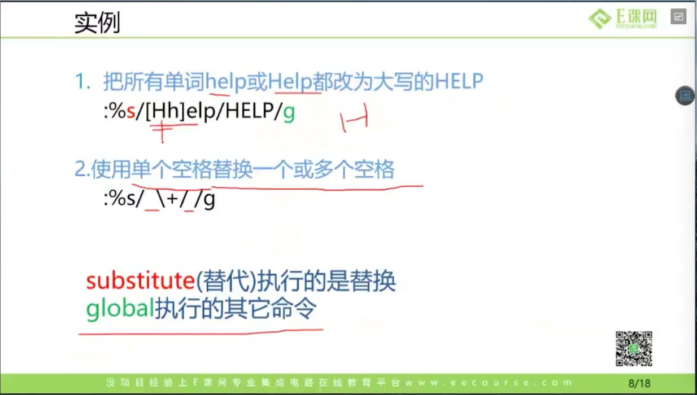
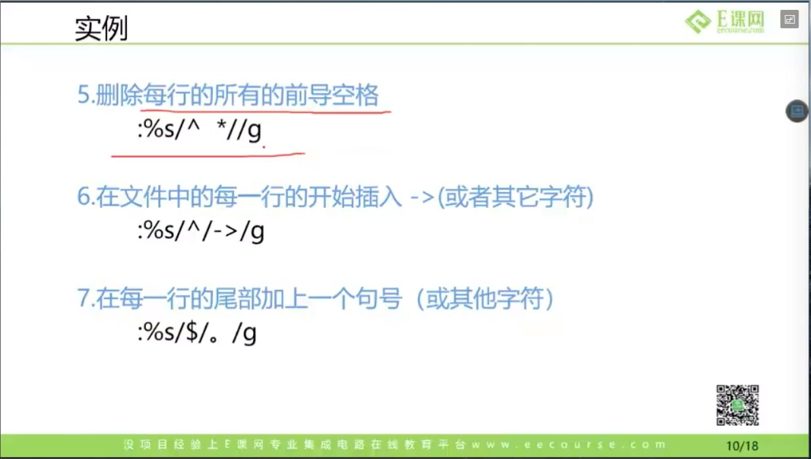
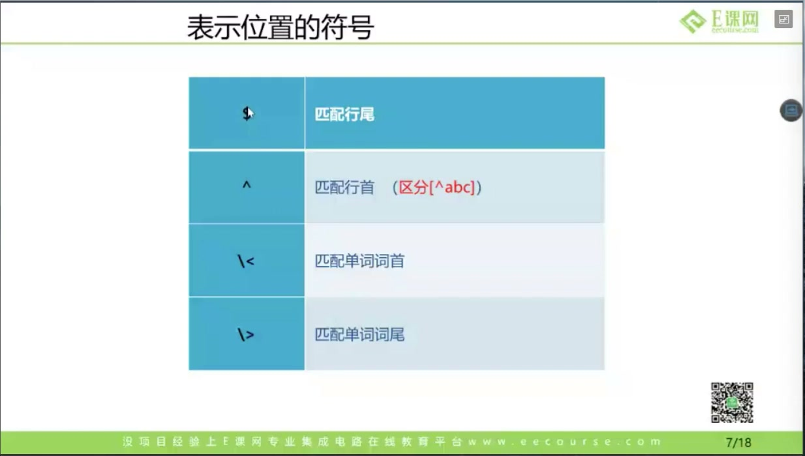
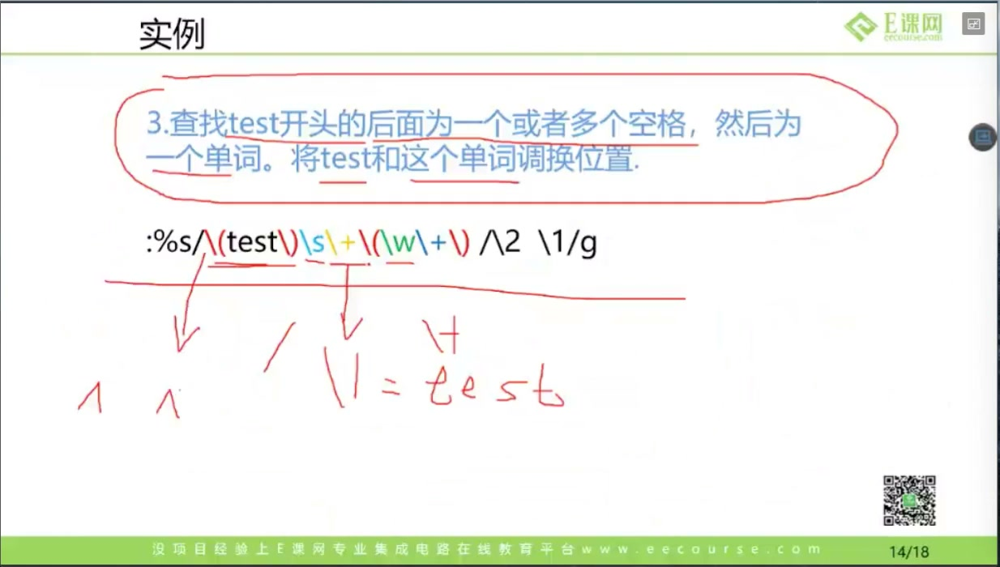
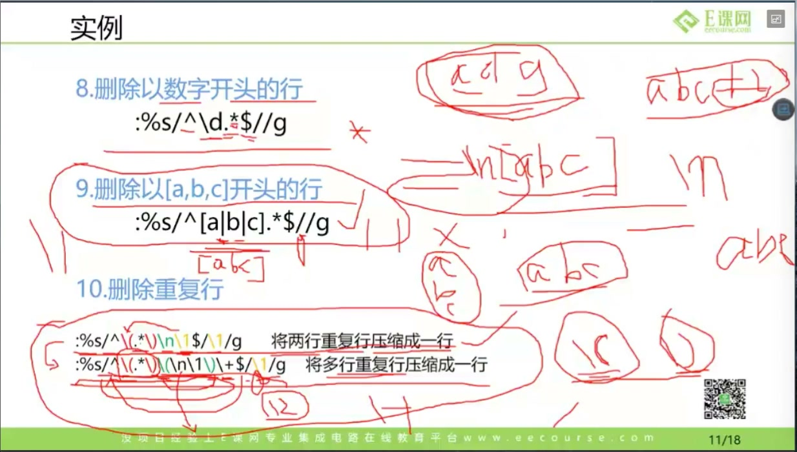
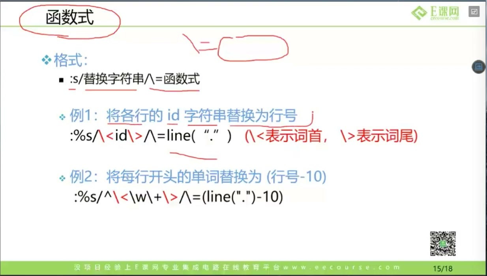

# 任务08：gvim 正则表达式

## 本章知识全景图

这一讲讲 gvim 底行命令里的正则表达式。它的核心价值不是“会写花哨表达式”，而是把查找、替换、删除、重排这些代码编辑动作变成可复用的批处理能力。对 RTL 工程来说，正则表达式常用于批量改信号名、清理空行、调整端口格式、重排文本列和生成重复结构。

最小主线：

- `:%s/查找模式/替换内容/g` 是最常见的全文件替换形式。
- 字符类用于匹配“一类字符”，例如数字、字母、空白、非空白。
- 数量词用于说明匹配多少个。
- `^`、`$`、单词边界用于描述位置。
- 分组和反向引用可以把匹配到的内容拿回来重排。
- 函数式替换可以把替换内容变成计算结果。

## 1. gvim 正则表达式主要服务查找和替换

gvim 的正则表达式主要出现在底行命令模式中，最常见的形式是：

```vim
:%s/pattern/replace/g
```

含义：

- `:` 进入底行命令模式。
- `%` 表示全文件范围。
- `s` 表示 substitute，也就是查找替换。
- `pattern` 是查找模式。
- `replace` 是替换内容。
- `g` 表示一行内所有匹配都替换，而不是只替换第一个。



> 图1 正则表达式元字符表：点号、字符类、数字类、空白类、数量词和位置符号是基础。

理解这条命令后，后面的所有例子都只是改变 `pattern` 和 `replace`。

## 2. 字符类：匹配“一个范围内的任意字符”

字符类的作用是把多个候选压成一个模式。例如 `[Hh]elp` 可以同时匹配 `Help` 和 `help`，然后统一替换成 `HELP`。

```vim
:%s/[Hh]elp/HELP/g
```



> 图2 大小写 help 替换：`[Hh]` 表示匹配大写 H 或小写 h。

常见字符类：

| 模式 | 含义 |
| --- | --- |
| `.` | 任意单个字符 |
| `[abc]` | `a`、`b`、`c` 任意一个 |
| `[a-z0-9]` | 小写字母或数字 |
| `[^abc]` | 不是 `a`、`b`、`c` 的任意字符 |
| `\d` | 数字 |
| `\D` | 非数字 |
| `\w` | 单词字符 |
| `\s` | 空白字符 |
| `\S` | 非空白字符 |



> 图3 字符类示例：字符类匹配的是“一组候选里的任意一个”，不是整段字符串。

## 3. 数量词：匹配多少个

只有“匹配什么”还不够，还要说明“匹配多少个”。这就是数量词的作用。

常见写法：

| 模式 | 含义 |
| --- | --- |
| `*` | 0 个或多个 |
| `\+` | 1 个或多个 |
| `\?` | 0 个或 1 个 |
| `\{n}` | 正好 n 个 |
| `\{m,n}` | m 到 n 个 |
| `\{n,}` | 至少 n 个 |

例如把多个空格压成一个空格：

```vim
:%s/ \+/ /g
```

这条命令的逻辑是：先匹配一个空格，再用 `\+` 表示“这个空格连续出现一次或多次”，最后替换成单个空格。

## 4. 位置符号：匹配行首、行尾和单词边界

正则表达式不仅能匹配字符，还能匹配位置。位置本身不消耗字符，但能限制模式出现在哪里。

| 模式 | 含义 |
| --- | --- |
| `^` | 行首 |
| `$` | 行尾 |
| `\<` | 单词开头 |
| `\>` | 单词结尾 |

删除所有空行：

```vim
:g/^$/d
```



> 图4 删除空行示例：`^$` 表示行首后立刻是行尾，也就是空行。

匹配完整单词 `id`：

```vim
:%s/\<id\>/ID/g
```

这和直接匹配 `id` 不一样。直接写 `id` 可能会匹配 `valid`、`id_next` 中的一部分；加单词边界后，只匹配独立单词。



> 图5 位置符号和单词边界：同一个符号在字符类和行首位置中含义不同，要看上下文。

## 5. 分组和反向引用：把匹配到的内容拿回来

正则表达式真正强大的地方是：你不仅能找到内容，还能把找到的内容保存下来，在替换时重新使用。gvim 中常用 `\(...\)` 做分组，用 `\1`、`\2` 取回第一个、第二个分组。

例如把两段内容调换位置，可以写成：

```vim
:%s/^\(\s\+\)\(\w\+\)/\2 \1/g
```

这类命令的思路是：

- 第一个分组保存前导空白。
- 第二个分组保存单词。
- 替换时用 `\2 \1` 交换顺序。



> 图6 行首模式与分组重排：用分组保存匹配到的片段，再在替换侧调整顺序。

分组最适合这些任务：

- 把 `input wire a` 重排成 `wire input a`。
- 给一组信号统一加后缀。
- 从端口声明里提取信号名。
- 把函数参数或模块端口格式统一改写。

## 6. 跨行和回车：`\r` 才是替换里的换行

课程中特别强调了一个容易误解的点：替换侧写 `\2` 不是“压成两行”，它只是取第二个分组。要在替换结果里产生换行，需要使用回车形式，例如 `\r`。



> 图7 捕获组与换行替换：`\1`、`\2` 表示分组内容；换行要显式写回车替换。

这个区别很关键。正则表达式里的数字引用是“拿回匹配内容”，不是“排版命令”。

## 7. 函数式替换：替换结果可以被计算出来

最后课程讲到函数式替换。它的形式通常带有 `\=`，表示替换侧不是普通文本，而是一个表达式。

例如把每行里的 `ID` 替换为行号，可以用类似思路：

```vim
:%s/\<ID\>/\=line(".")/g
```



> 图8 函数式正则替换：`\=` 后面可以接表达式，把替换结果变成计算值。

这类能力在大规模文本生成里很有用，例如给列表编号、批量生成唯一名称、根据行号生成标记等。

## 8. 本章速记

| 目标 | 示例 |
| --- | --- |
| 全文件替换 | `:%s/a/b/g` |
| 匹配大小写之一 | `[Hh]elp` |
| 匹配一个或多个空格 | ` \+` |
| 删除空行 | `:g/^$/d` |
| 匹配单词 | `\<word\>` |
| 保存分组 | `\(...\)` |
| 取回分组 | `\1`、`\2` |
| 替换中换行 | `\r` |
| 函数式替换 | `\=line(".")` |

## 9. 复习自测

- `:%s/pattern/replace/g` 中 `%` 和最后的 `g` 分别是什么意思？
- `[Hh]elp` 和 `Help\|help` 的思路有什么不同？
- 为什么删除空行可以用 `:g/^$/d`？
- `\1`、`\2` 保存的是什么？
- 替换侧想插入换行时，为什么不能只写 `\2`？
- 函数式替换适合哪些批量编辑场景？
