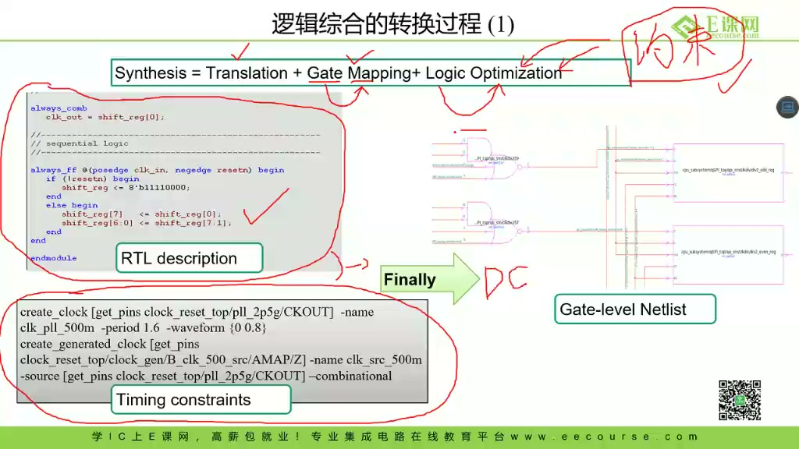
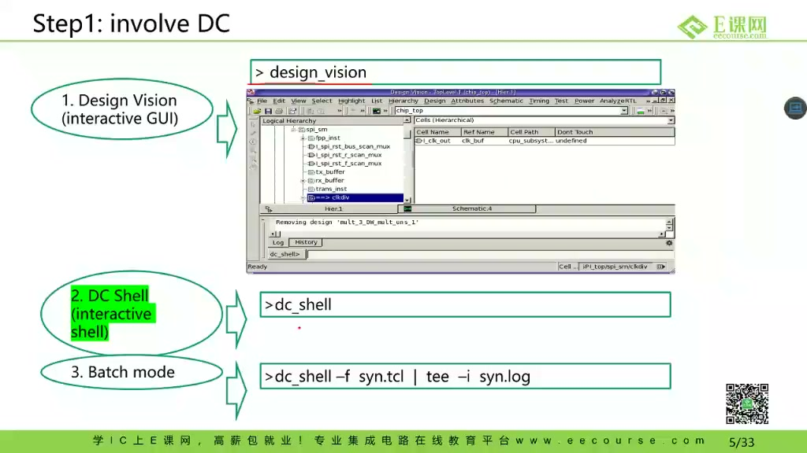
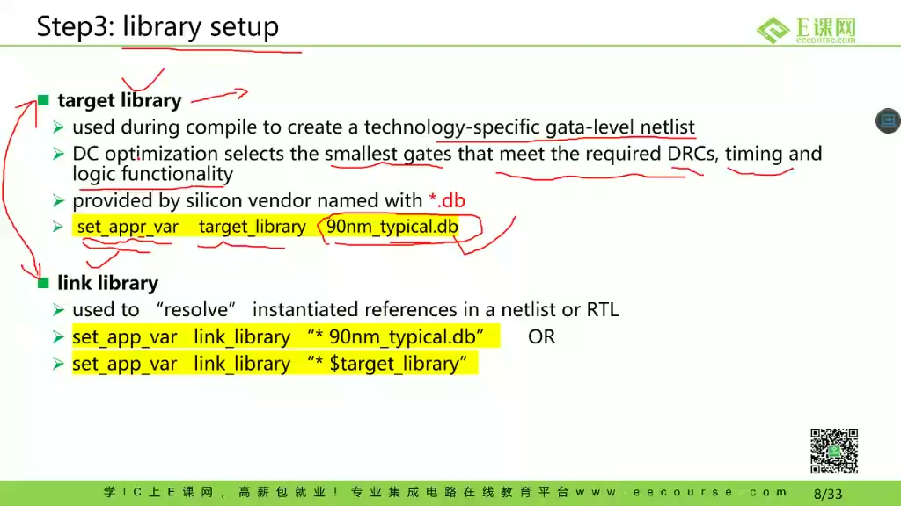
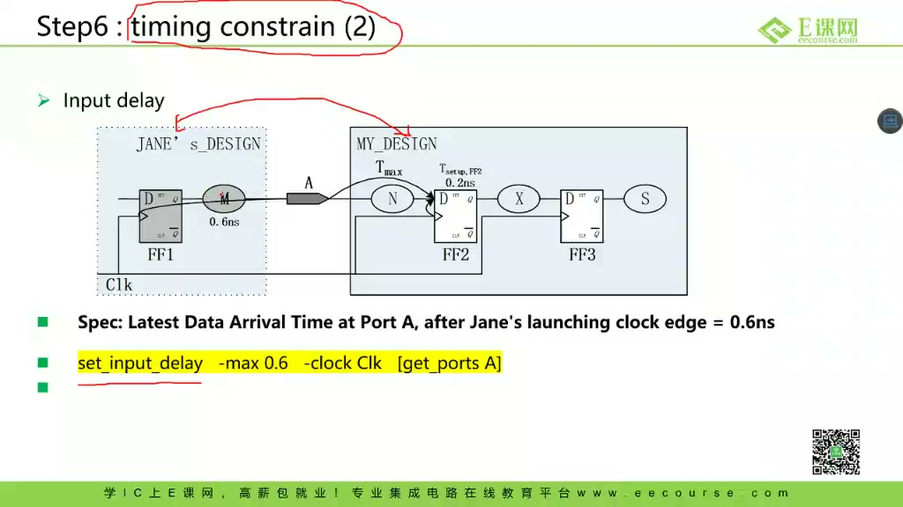
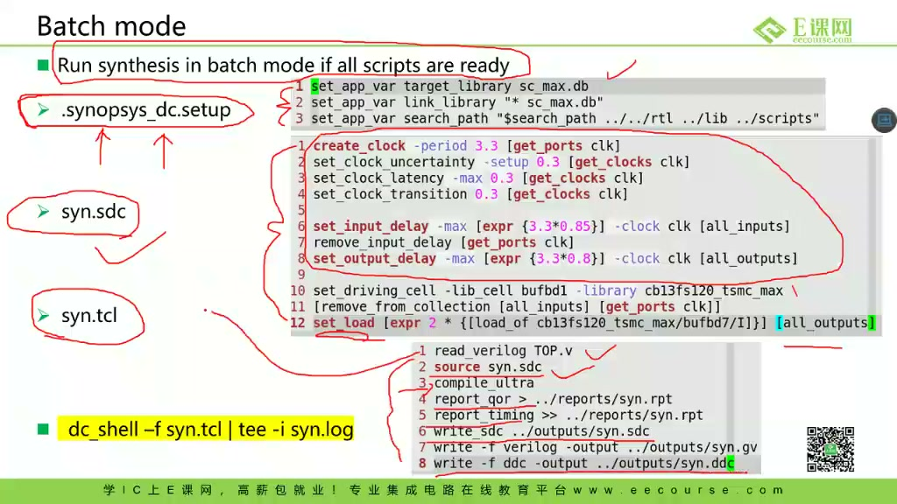
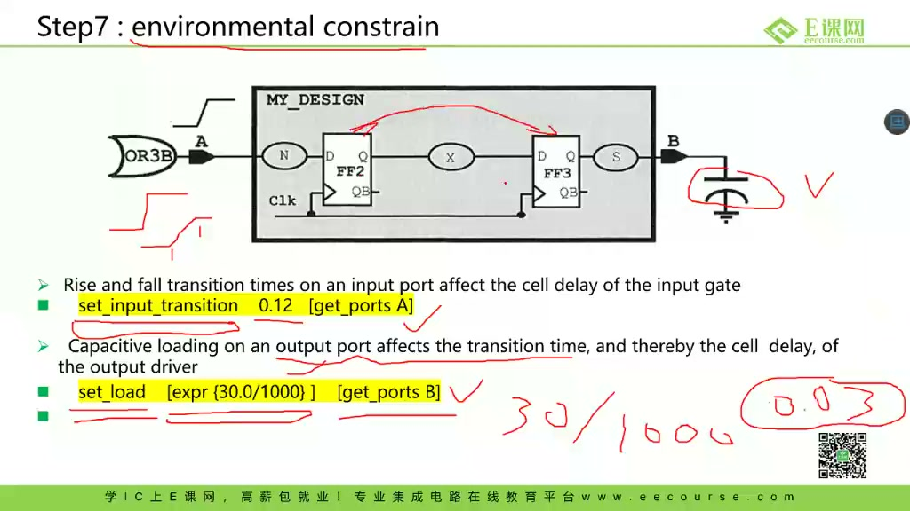
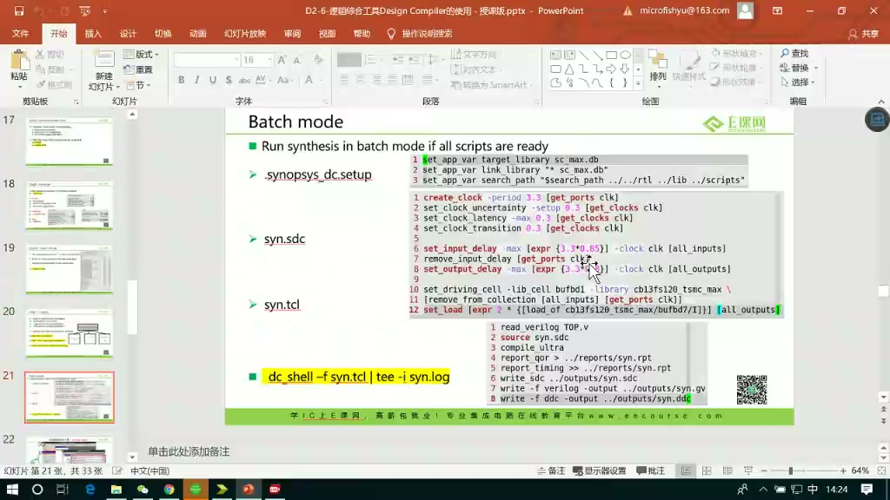

# 任务09：逻辑综合工具 Design Compiler 的使用

## 本章知识全景图

这一讲回答一个前端设计必须过关的问题：RTL 写完并通过功能仿真以后，怎样把“行为描述”变成“特定工艺库下的门级网表”。Design Compiler 不是普通编译器，它读入 RTL、工艺库和约束，在面积、时序、功耗等目标之间做优化，最后输出可交给后续流程的 gate-level netlist。

最小主线：

- 逻辑综合的输入不是 RTL 一项，而是 RTL、library、约束和脚本。
- 工艺库决定工具能选哪些真实单元，约束决定工具按什么目标优化。
- DC 的工作不是“翻译代码”，而是 translation、gate mapping、logic optimization。
- SDC 约束是综合质量的方向盘，尤其是时钟、输入延迟、输出延迟、负载和环境约束。
- 报告不是附属文件，`report_timing`、面积和功耗报告是判断综合是否可交付的证据。

## 1. 逻辑综合处在前端流程的哪一步

RTL 功能仿真通过以后，还不能直接交给后端。RTL 描述的是寄存器传输级行为，后端需要的是由标准单元组成的门级网表。逻辑综合就处在这个转换点：把 Verilog/VHDL/SystemVerilog 写成的设计映射到某个工艺库里的真实门、触发器、缓冲器和组合单元。


> 图1 Design Compiler 课程入口：这一讲聚焦逻辑综合工具 DC。

更精确地说，综合回答的是：

- 这个 RTL 能不能映射成给定工艺库里的门？
- 在目标时钟下，路径延迟能不能收敛？
- 面积、功耗和时序之间如何取舍？
- 输出的 netlist 是否能作为后端、形式验证和后仿真的输入？

这里的关键不是“工具会自动生成网表”，而是工具只会按你给它的库和约束去优化。库不对，目标就错；约束不对，结果就没有意义。

## 2. 综合输入：RTL 只是其中一部分

DC 的核心输入可以压成四类：设计描述、工艺库、约束文件和综合脚本。设计描述给出功能，工艺库给出可用硬件单元，约束给出优化目标，脚本把流程自动化。



> 图2 综合输入与转换过程：RTL、timing constraints 和 DC 共同生成 gate-level netlist。

| 输入 | 作用 |
| --- | --- |
| RTL | 描述寄存器、组合逻辑、状态机和接口行为 |
| Target library | 提供可映射的标准单元，例如触发器、与非门、缓冲器 |
| Link library | 帮助解析实例化模块、库单元和引用关系 |
| SDC 约束 | 指定时钟、输入输出延迟、负载、驱动、面积等目标 |
| Tcl 脚本 | 固化 read、elaborate、link、compile、report、write 流程 |

一个常见误区是：只要 RTL 写对，综合结果就自然正确。实际上，综合结果是 RTL 和约束共同决定的。没有时钟约束，工具不知道该把路径优化到多快；没有输入输出环境，工具不知道端口外面连接着什么。

## 3. DC 的交互模式与批处理模式

课程展示了 DC 的几种使用入口：图形界面的 Design Vision、命令行 `dc_shell`、以及批处理方式。学习阶段可以用 GUI 观察流程，但工程上更可靠的是脚本化批处理，因为脚本能复现、能比较、能纳入版本管理。



> 图3 打开 DC 工具：Design Vision、dc_shell 和 batch mode 都是 DC 的常见入口。

批处理脚本的价值在于把综合流程变成确定动作：

```tcl
read_verilog ./rtl/my_design.v
current_design my_design
link
source ./syn.sdc
compile_ultra
report_timing > reports/timing.rpt
report_area   > reports/area.rpt
write -format verilog -output outputs/my_design_netlist.v
```

这段脚本背后的工程原则是：综合不是一次手工点按钮，而是一个可重复的构建过程。每次改 RTL、改约束、换库或换目标频率，都应该能重新跑出同一套报告和输出。

## 4. 工艺库：综合不是抽象逻辑优化

DC 做优化时必须知道 target library 和 link library。target library 决定工具最终可以选哪些门；link library 用来解析设计里的引用和库单元。没有库，工具无法知道某个门的面积、延迟、驱动能力和功耗。



> 图4 工艺库设置：target library 和 link library 决定 DC 可用的标准单元和解析范围。

这就是为什么同一份 RTL 在不同工艺库下综合结果会不同。一个库里最快的触发器、最小的与非门、不同驱动强度的 buffer，都有自己的面积和延迟模型。综合工具所谓“优化”，本质是在这些真实候选单元里选择组合。

所以不要把综合理解成“把 Verilog 翻译成门”。更准确的说法是：DC 在给定库单元集合和约束条件下，寻找一组满足目标的门级实现。

## 5. SDC 约束是综合方向盘

SDC 文件告诉 DC 什么是好结果。最核心的是时钟约束，其次是输入延迟、输出延迟、输入 transition、输出 load、面积和功耗目标。



> 图5 输入延迟约束：`set_input_delay` 描述外部数据到达端口的时间，不能把整个时钟周期都留给内部逻辑。

以输入延迟为例，假设时钟周期是 4ns，外部数据到达输入端口已经花了 0.6ns，那么内部从输入端口到目标寄存器的数据路径就不能再占满 4ns。工具必须知道这个外部环境，否则会高估内部可用时间。

常见约束可以这样理解：

| 约束 | 回答的问题 |
| --- | --- |
| `create_clock` | 设计要跑多快 |
| `set_input_delay` | 外部数据相对时钟什么时候到达 |
| `set_output_delay` | 下游模块需要给它留多少时间 |
| `set_input_transition` | 输入信号边沿有多陡 |
| `set_load` | 输出端口带多大负载 |
| `set_max_area` | 面积目标或面积上限 |



> 图6 SDC 约束脚本：综合脚本会读入约束、执行 compile，并输出报告与 netlist。

SDC 写错比 RTL 写错更隐蔽。RTL 错了，仿真可能暴露；约束错了，工具可能给你一个“看起来成功”的错误结果。

## 6. 报告是综合是否完成的证据

综合跑完以后，不能只看工具有没有退出。真正要看报告：时序有没有 violation，面积是否合理，功耗是否异常，是否有 unresolved reference，是否有 latch 推断，是否有 unconstrained path。



> 图7 环境约束与报告判断：输入 transition 和输出 load 会影响单元延迟估算，进而影响 timing report。

最低限度要检查：

- `report_timing`：最差路径、slack、起点终点、时钟约束。
- `report_area`：组合逻辑面积、寄存器面积、层级面积。
- `report_power`：动态功耗和静态功耗是否在预期范围。
- warning / error：是否有未连接端口、未解析模块、锁存器推断、未约束路径。

综合完成的标志不是“DC 就通过了”，而是：输出 netlist、约束和报告三者能够互相解释。



> 图8 DC 批处理完成：脚本执行后生成报告、网表和日志，后续要检查这些输出是否可信。

## 7. 深挖：为什么综合结果会被约束“塑形”

逻辑综合不是在寻找唯一正确答案，而是在约束空间里做实现选择。例如同一段组合逻辑，如果时钟很宽松，工具可以选择面积更小但延迟更大的门；如果时钟很紧，工具可能插入更强驱动的单元、重构逻辑、牺牲面积来换速度。

这个过程可以从硬件底层这样理解：每个标准单元都有输入电容、输出驱动能力、传播延迟、面积和功耗。路径延迟不是抽象的“语句执行时间”，而是沿着一串单元传播的电气延迟。约束越紧，工具越倾向选择更快但更贵的实现；约束越松，工具越可能保留更小的实现。

因此，前端写约束时其实在告诉工具：哪些路径必须快，哪些路径可以慢，端口外部环境是什么，输出要驱动什么负载。不会写约束，就等于不会告诉综合工具“这个硬件应该在什么世界里工作”。

## 8. 工程判读表：综合报告先看“能不能交付”

| 报告 / 现象 | 先看什么 | 工程判断 |
|---|---|---|
| `report_timing` | 最差路径、slack、起点终点、clock group | 负 slack 不是单纯“工具没跑好”，要判断是约束过紧、路径过长还是结构不合理 |
| `report_area` | combinational / sequential 面积占比 | 面积突然变大，可能是位宽、展开循环、优先级逻辑或约束过紧导致 |
| `report_power` | dynamic / leakage 比例 | 时钟、切换率和大扇出网络会显著影响动态功耗估计 |
| warning / error | unresolved reference、latch、unconnected port、unconstrained path | 这些不是“以后再看”的噪声，可能直接让网表不可交付 |
| 输出 netlist | 顶层端口、寄存器数量、异常 buffer/latch | 网表要能被仿真、STA、后端继续消费 |

一个实用口径是：**综合交付不是“DC 没报 fatal”，而是 netlist、SDC、SDF/DDC 和报告之间互相说得通。** 如果 timing 报告显示没有约束路径，或者 warning 里还有 unresolved module，即使工具生成了网表，也不能认为这版结果可信。

## 9. 本章速记

- DC 的目标是把 RTL 映射成特定工艺库下的 gate-level netlist。
- 综合输入至少包括 RTL、target library、link library、SDC 约束和 Tcl 脚本。
- 约束决定优化方向；没有约束的综合结果不可交付。
- 报告比“工具跑完”更重要，尤其是 timing、area、power 和 warning。
- 综合不是一次性动作，而是 RTL、约束、报告之间反复收敛的工程闭环。

## 10. 自测题

- 为什么同一份 RTL 在不同工艺库下综合结果可能不同？
- `create_clock`、`set_input_delay`、`set_load` 分别告诉 DC 什么信息？
- 为什么脚本化 batch mode 比手工 GUI 更适合工程交付？
- `report_timing` 里 slack 为负说明什么？
- 什么情况下工具“综合成功”但结果仍然不可信？
- 为什么 unresolved reference 和 unconstrained path 不能简单当作普通 warning 忽略？

## 11. 参考资料

- 本视频与对应字幕。
- Synopsys Design Compiler / RTL synthesis 官方产品说明：<https://www.synopsys.com/implementation-and-signoff/rtl-synthesis-test/design-compiler.html>
- Synopsys Design Compiler NXT 官方说明，强调 RTL synthesis 的 timing、area、power、QoR 目标：<https://www.synopsys.com/implementation-and-signoff/rtl-synthesis-test/design-compiler-nxt.html>
