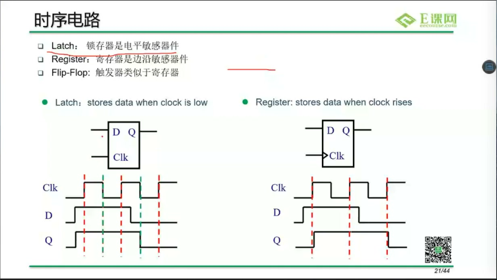
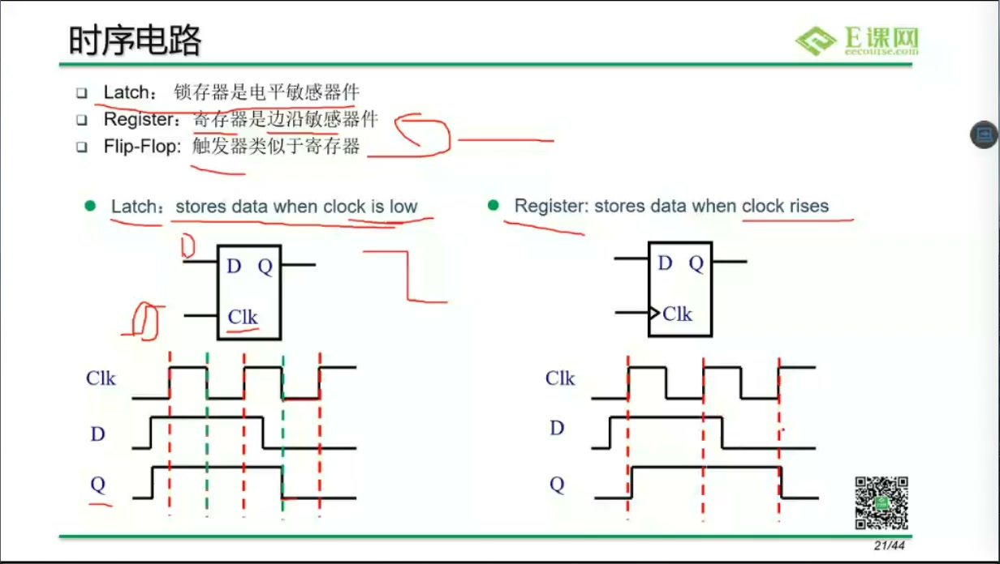
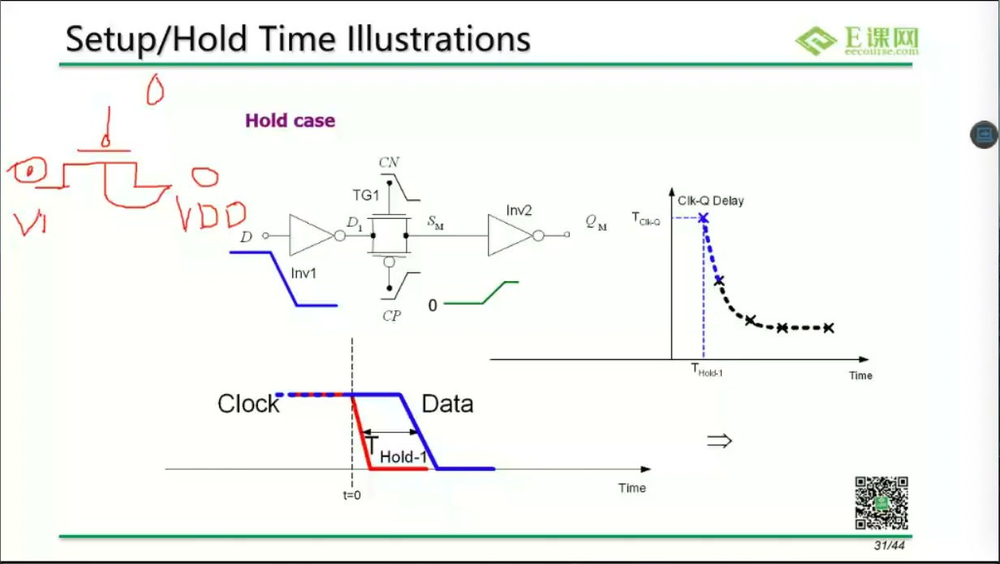
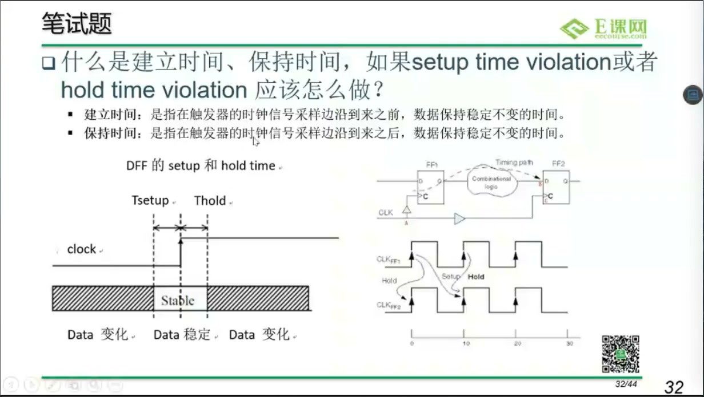
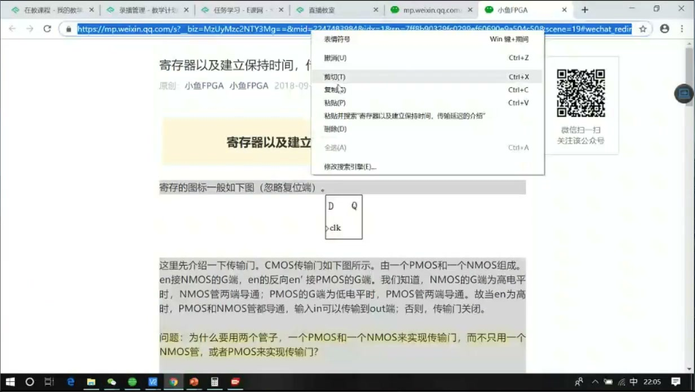
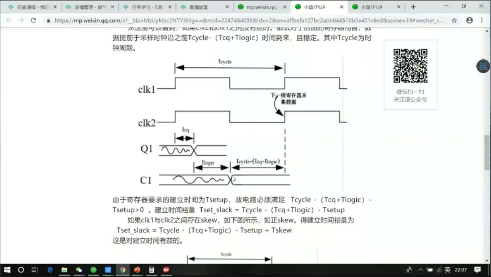
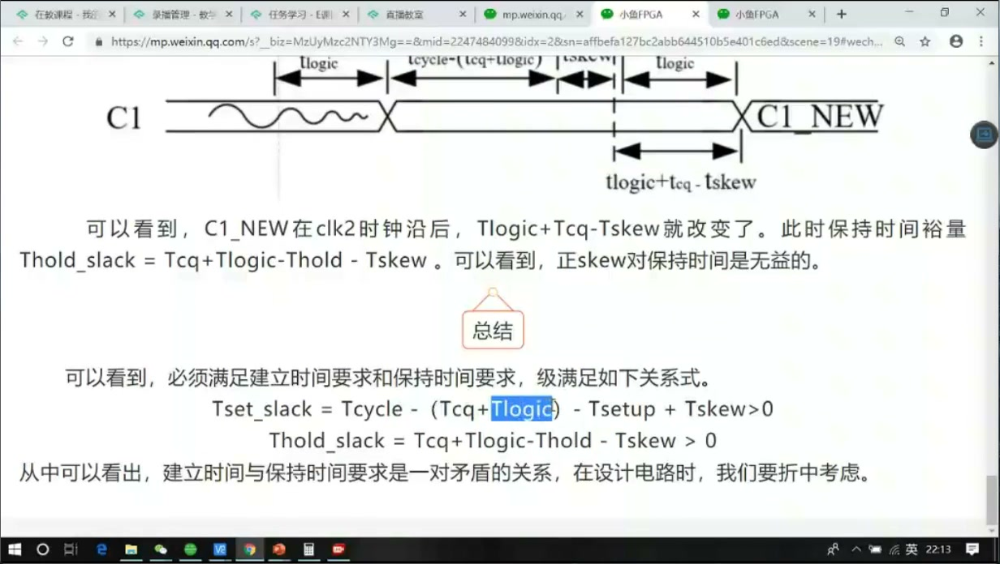
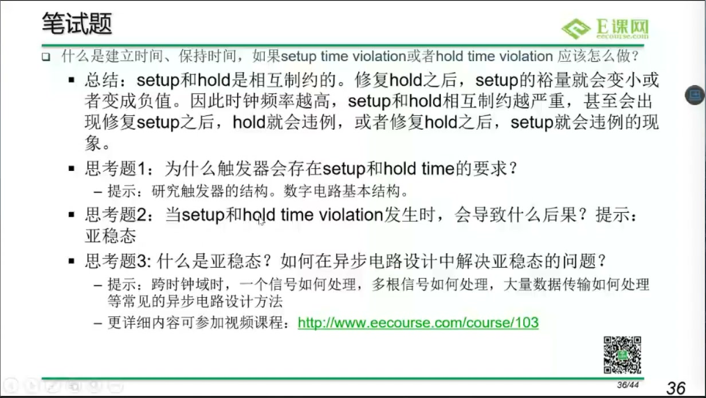
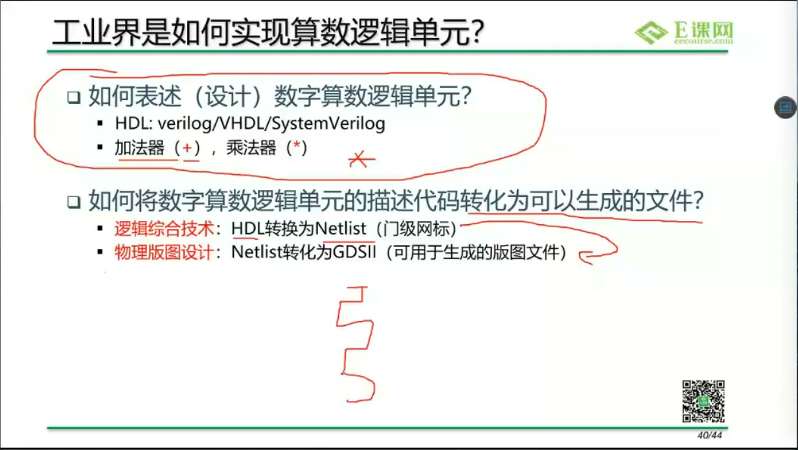
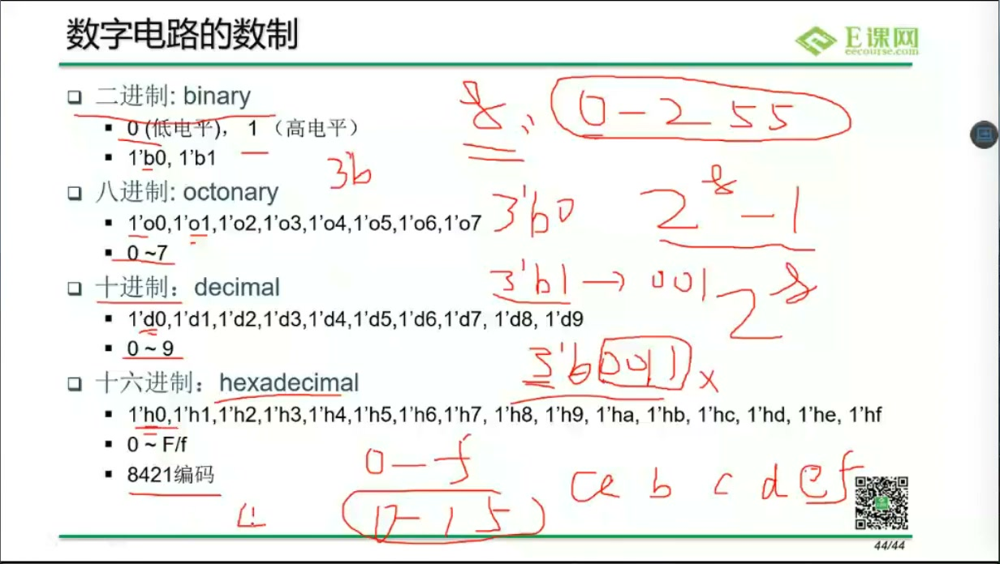

# 任务10：数字电路基础：时序逻辑基础

## 本章知识全景图

这一讲把组合逻辑推进到时序逻辑。组合逻辑只描述输入到输出的即时函数关系；时序逻辑在组合逻辑外加了存储单元和时钟，于是电路开始拥有“上一拍”和“下一拍”的概念。理解锁存器、触发器、setup/hold、时序路径和 CDC，是后面写 RTL、看波形、做 STA 的基础。

最小主线：

- 时序逻辑 = 组合逻辑 + 存储单元 + 时钟。
- latch 是电平敏感，flip-flop/register 是边沿敏感。
- DFF 在时钟沿采样 D，并在 `Tcq` 后更新 Q。
- setup/hold 约束的是采样边沿前后数据必须稳定的窗口。
- 一条同步路径的时序预算由 `Tclk`、`Tcq`、组合逻辑延迟、setup、skew 等共同决定。
- CDC 的危险来自不同 clock domain 之间没有固定相位关系，亚稳态不能靠普通组合逻辑消掉。
- HDL 最终要转成门级网表，所以代码风格必须服务硬件结构。

## 1. 时序逻辑为什么必须引入存储

组合逻辑没有记忆。只要输入变化，输出就沿着逻辑网络变化。时序逻辑不同，它需要在某个时刻把数据保存下来，让系统能按拍推进。这个“保存下来”的动作由 latch、register、flip-flop 等存储单元承担。



> 图1 锁存器与触发器对比：latch 在时钟低电平期间透明，register 在时钟边沿采样。

最基本的区分是：

| 器件 | 敏感方式 | 数据什么时候进入 |
| --- | --- | --- |
| Latch | 电平敏感 | 使能电平有效期间，D 可以透传到 Q |
| Register / DFF | 边沿敏感 | 时钟上升沿或下降沿瞬间采样 D |

这个区别不是术语问题，而是电路行为完全不同。latch 有透明窗口，数据在窗口内可能一路穿过去；DFF 只在边沿采样，更适合作为同步设计的基本存储单元。

## 2. DFF 的边沿采样：为什么时序逻辑按拍推进

D 触发器的核心动作是：在有效时钟沿到来时采样 D，经过 clock-to-Q 延迟后，在 Q 端输出新值。这个过程把连续变化的组合逻辑切成一拍一拍的状态更新。



> 图2 DFF 边沿敏感：register 在 clock edge 保存数据，而不是在整个高/低电平期间透明。

可以把同步时序路径压成一条链：

```text
Launch FF Q -> combinational logic -> Capture FF D
```

发射触发器在一个时钟沿推出数据，数据穿过组合逻辑，到达捕获触发器的 D 端，并在下一个相关时钟沿被采样。时序分析就是判断这条链在目标时钟周期内是否来得及。

## 3. Latch 为什么容易让初学者误判

Latch 是电平敏感器件。使能有效期间，D 的变化可以影响 Q；使能无效后，Q 保持之前的值。它不是绝对不能用，但对初学 RTL 和普通同步设计来说，意外推断 latch 通常是坏信号。



> 图3 门级锁存器示意：电平透明窗口会让数据在使能有效期间传播。

在 RTL 中，常见 latch 推断来自组合逻辑没有覆盖所有赋值分支：

```systemverilog
always_comb begin
  if (en)
    y = a;
  // en 为 0 时 y 没有赋值，工具可能推断 y 需要保持旧值
end
```

如果你想要组合逻辑，就必须给所有路径赋值：

```systemverilog
always_comb begin
  y = '0;
  if (en)
    y = a;
end
```

这就是“代码风格”和“硬件结构”之间的直接关系：少写一个默认赋值，综合出来的可能不再是组合逻辑，而是带存储行为的 latch。

## 4. Setup/Hold：触发器不是任意时刻都能安全采样

触发器采样不是魔法。时钟边沿附近，D 端数据必须保持稳定一段时间。边沿前需要稳定的时间叫 setup time，边沿后需要继续稳定的时间叫 hold time。



> 图4 Setup/Hold 定义：数据必须在采样边沿前后保持稳定，否则触发器可能采样失败。

可以这样理解：

- setup 违反：数据来得太晚，采样边沿到来时 D 还没稳定。
- hold 违反：数据变得太早，采样边沿刚过就被新数据冲掉。



> 图5 时序违反示意：setup 或 hold 不满足时，触发器可能采到错误值或进入不稳定状态。

这里最重要的底层直觉是：触发器内部也由晶体管和反馈结构组成，它需要有限时间完成采样和再生。setup/hold 不是工具编出来的规则，而是存储单元物理实现带来的窗口要求。

## 5. 同步时序路径的预算公式

一条典型同步路径包含发射触发器、组合逻辑和捕获触发器。setup 检查大致可以理解为：

```text
Tcq + Tlogic + Tsetup + Tskew <= Tclk
```

不同教材对 skew 符号处理可能略有差异，但核心思想不变：时钟周期必须容纳触发器推出数据、组合逻辑传播、捕获触发器建立时间和时钟偏斜影响。



> 图6 时序路径公式：从 launch clock edge 到 capture clock edge，中间的 Tcq、Tlogic、Tsetup、Tskew 都会消耗时序预算。

如果 setup 不满足，常见修复方向有：

- 增大时钟周期，也就是降频。
- 减小组合逻辑延迟，例如重构逻辑或拆分路径。
- 插入 pipeline，把一条长路径切成多拍。
- 优化物理实现，减小布线和单元延迟。
- 检查约束是否真实，避免错误约束造成假 violation。



> 图7 时序修复方法：增大周期、减小逻辑延迟、调整时钟偏斜或重构路径，都是 setup 修复方向。

## 6. CDC 为什么比普通同步路径危险

CDC，也就是 clock domain crossing，指信号从一个时钟域进入另一个时钟域。危险在于两个时钟之间没有稳定相位关系，接收端触发器可能刚好在数据变化附近采样，从而触发亚稳态。



> 图8 CDC 问题提示：跨时钟域时，setup/hold 关系不再像单一同步时钟下那样固定。

亚稳态不是“仿真里出现 X”这么简单，它是触发器内部再生过程无法在预期时间内稳定到 0 或 1 的物理状态。工程上不能保证亚稳态永不发生，只能降低它传播到系统可见逻辑的概率。

常见处理：

- 单 bit 控制信号：两级或多级同步器。
- 多 bit 数据：异步 FIFO、握手协议或 Gray code 指针。
- 脉冲信号：脉冲展宽、toggle 同步或握手确认。
- 复位信号：异步复位、同步释放通常更安全。

这个点值得扩展，是因为它直接连接底层触发器物理行为、RTL 写法和芯片可靠性。CDC 不是多写两拍寄存器的套路，而是一个“概率风险被工程结构隔离”的问题。

## 7. HDL 到门级网表：为什么代码写法会变成硬件

课程后半段把 HDL 和门级网表联系起来。Verilog 不是软件脚本，最终要被综合成门、触发器、MUX、加法器和连线。行为级描述越清晰，综合工具越容易推断出你想要的结构。



> 图9 HDL 到门级网表：行为级 HDL 经过综合转化为门级网表。

一个非常重要的写法原则是：时序逻辑和组合逻辑要分清。

```systemverilog
always_ff @(posedge clk or negedge rst_n) begin
  if (!rst_n)
    q <= '0;
  else
    q <= d;
end

always_comb begin
  y = a & b;
end
```

`always_ff + <=` 对应触发器采样，`always_comb + =` 对应组合逻辑计算。这个区分不是为了格式漂亮，而是为了让仿真调度、综合推断和硬件意图一致。

## 8. 数值表示：位宽是硬件资源，不是显示格式

课程还讲到数字电路中的数值写法。Verilog 里的数值一般带有位宽和进制，例如：

```verilog
8'b1010_0101
16'h00ff
4'd10
```



> 图10 数字电路数值表示：二进制、十进制、十六进制都需要和位宽一起理解。

位宽不是可有可无的显示信息。硬件里每一位都对应连线、寄存器位或逻辑资源。位宽写错会造成截断、扩展、符号解释错误，甚至让仿真和综合表现不一致。

## 9. 深挖：阻塞/非阻塞为什么要从触发器理解

这一讲虽然核心是时序基础，但它正好解释了后面 SystemVerilog 里阻塞/非阻塞赋值的底层原因。

在组合逻辑里，用阻塞赋值 `=` 描述一条即时计算链：

```systemverilog
always_comb begin
  t = a & b;
  y = t | c;
end
```

这里 `y` 使用的是本次过程块中刚算出来的 `t`，这符合组合逻辑网络的传播直觉。

在时序逻辑里，用非阻塞赋值 `<=` 描述一排触发器在同一个时钟沿同时采样：

```systemverilog
always_ff @(posedge clk) begin
  a <= b;
  b <= a;
end
```

如果时钟沿前 `a=0, b=1`，时钟沿后会变成 `a=1, b=0`。原因不是代码“并行执行”这么简单，而是两个触发器在同一个边沿采样旧的 D 端值，然后一起更新 Q 端。这个行为和 DFF 边沿采样完全一致。

所以规则背后的硬件解释是：

- `=` 适合组合逻辑内部的临时计算。
- `<=` 适合时钟边沿触发的寄存器更新。
- 同一个时序状态变量不要混用两种赋值方式。
- 不要把仿真调度写得和真实触发器行为相矛盾。

## 10. 工程判断表：setup 和 hold 不要用同一种药

| 违例类型 | 直观含义 | 常见修复方向 | 为什么 |
|---|---|---|---|
| setup violation | 数据到得太晚，捕获边沿前没稳定 | 缩短组合逻辑、加 pipeline、换快单元、放宽时钟 | 目标是让数据更早到达捕获触发器 |
| hold violation | 数据变得太早，捕获边沿后保持不够 | 插入 delay/buffer、调整时钟偏斜、修最短路径 | 目标是别让新数据太快冲到捕获端 |
| CDC 风险 | 两个时钟没有固定相位关系 | 同步器、握手、异步 FIFO、Gray code | 它不是普通一条同步 timing path，不能靠改组合延迟解决 |
| latch 风险 | 电平敏感窗口内输入可能穿透 | 改成 DFF 或确保 latch 协议严谨 | latch 的透明窗口会让时序推导更难 |

这里最容易误解的是 pipeline：它通常帮助 setup，因为它把一条长组合路径切成多拍；但它不自动修 hold，甚至可能引入新的短路径。hold 更关注最短路径和时钟偏斜，所以修法经常是加延迟、调 CTS 或约束，而不是盲目插寄存器。

从硬件底层看，setup/hold 都来自触发器内部采样窗口。时钟边沿附近，D 端必须有一段稳定时间，触发器内部主从锁存结构才能可靠决定 Q 端值。违反这个窗口，轻则仿真和 STA 报违例，重则真实硅片进入亚稳态或采样错误。

## 11. 本章速记

- 时序逻辑比组合逻辑多了存储和时钟。
- Latch 电平敏感，DFF 边沿敏感。
- setup/hold 是触发器采样窗口要求，不是工具随便规定。
- 同步路径预算由 `Tcq + Tlogic + Tsetup + Tskew` 与 `Tclk` 的关系决定。
- CDC 的本质风险是不同 clock domain 之间没有固定采样关系。
- HDL 写法最终会影响综合出的硬件结构。

## 12. 自测题

- latch 和 DFF 的本质区别是什么？
- setup 违反和 hold 违反分别说明数据变化太晚还是太早？
- 为什么插入 pipeline 可以帮助修 setup？
- CDC 为什么不能只靠普通组合逻辑解决？
- 为什么时序逻辑推荐使用非阻塞赋值？
- 为什么 pipeline 通常有助于修 setup，却不是修 hold 的通用办法？

## 13. 参考资料

- 本视频与对应字幕。
- Clifford E. Cummings, “Nonblocking Assignments in Verilog Synthesis, Coding Styles That Kill”：<https://csg.csail.mit.edu/6.375/6_375_2009_www/papers/cummings-nonblocking-snug99.pdf>
- SystemVerilog.dev 对过程块、`always_comb`、`always_ff` 和数据类型的工程解释：<https://systemverilog.dev/3.html>
