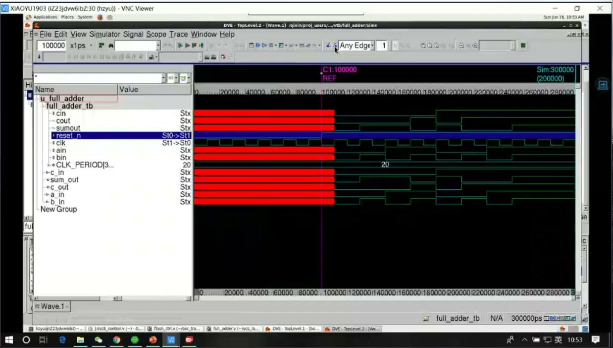
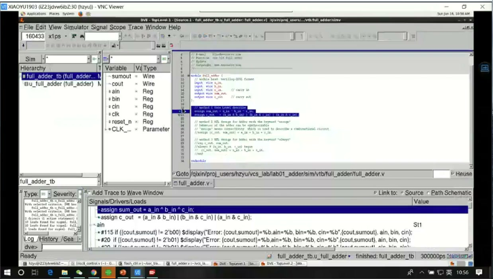
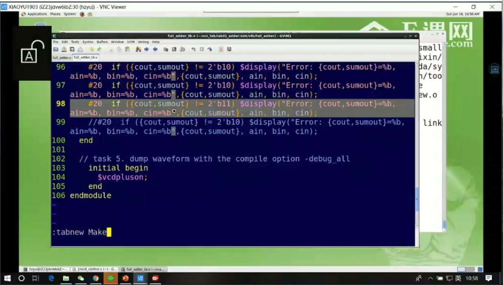
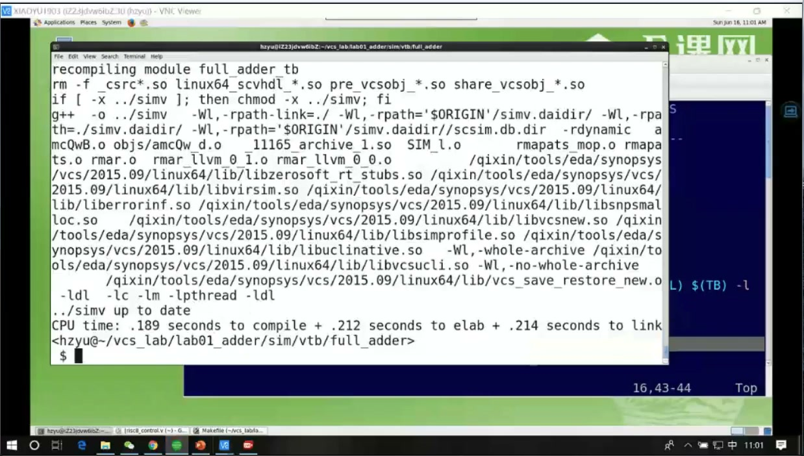
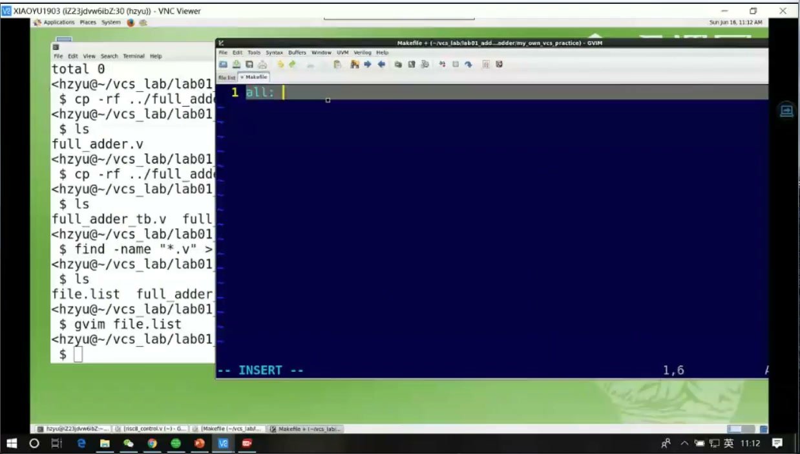
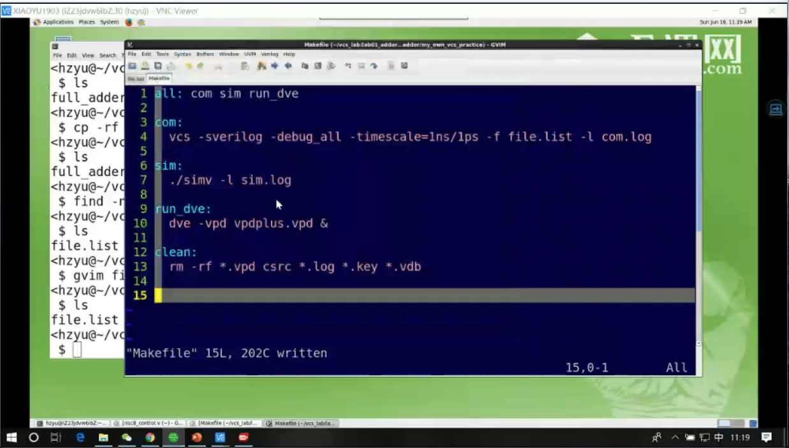
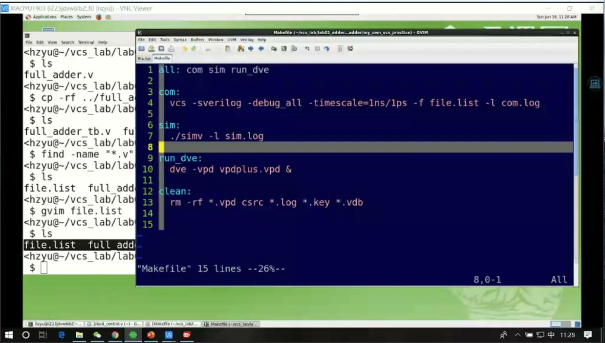
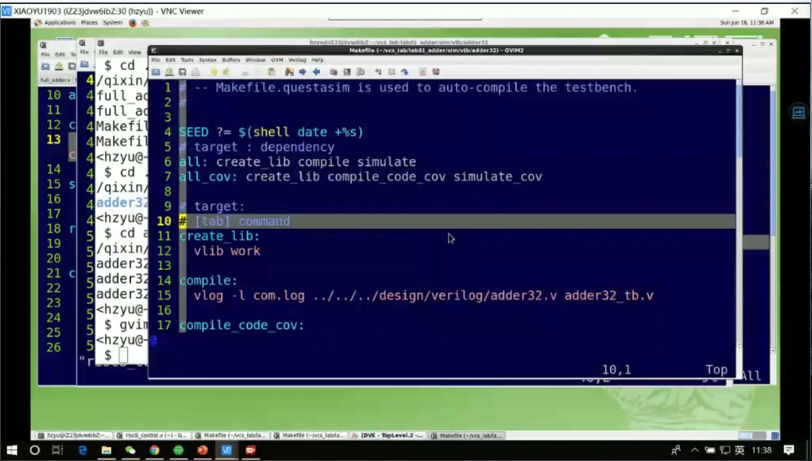

# 任务11：逻辑仿真工具 VCS 的使用：Makefile

## 本章知识全景图

这一讲从一个非常实际的问题进入：波形里为什么会出现红色未知态 X，然后转向如何用 Makefile 管理 VCS 仿真命令。它的核心不是“记住一条 VCS 命令”，而是把编译、仿真、波形生成、清理中间文件这些动作固化成可重复的工程流程。

最小主线：

- 波形里的 X 往往来自未初始化、未赋值、冲突驱动或复位不足。
- 看波形时要会找跳变沿、定位时间点、回到 testbench 查赋值。
- VCS 仿真通常分成 compile 和 run 两个阶段。
- Makefile 把长命令、文件列表、日志、波形选项和清理动作组织起来。
- 工程仿真不是手打一长串命令，而是执行 `make compile`、`make run`、`make clean` 这类可重复目标。

## 1. 波形里的 X 先从 testbench 赋值查起

课程开头解释红色未知态：某些输入信号在 110ns 之前没有被赋值，所以波形显示为 X；输出依赖这些输入，自然也可能变成 X。这个判断非常重要，因为初学者容易把 X 当成工具问题，实际上它常常是 testbench 没有初始化或激励还没开始。



> 图1 未知态波形：输入信号在赋值前保持 X，依赖它们的输出也会变成未知态。

排查 X 的基本顺序：

- 看 X 从哪个时间点开始出现。
- 查对应输入在 testbench 里有没有初始赋值。
- 查 reset 是否覆盖了所有寄存器。
- 查是否存在多驱动或未连接。
- 查条件分支是否漏赋值导致 latch 或 X 传播。

这里的关键思维是：波形不是结果截图，而是 debug 索引。看到 X，要沿着依赖关系往前追。

## 2. 波形工具要会找边沿和定位时间

课程演示了在波形工具里搜索上升沿、下降沿或任意跳变沿。这个能力比“能打开波形”更重要，因为真实仿真波形很长，不可能靠肉眼拖动找每一次事件。



> 图2 波形边沿搜索：可以按信号寻找上升沿、下降沿或跳变沿，快速定位事件。

常用观察动作：

- 找 reset 释放沿，确认系统从什么时候开始工作。
- 找 clock 边沿，观察寄存器是否按拍更新。
- 找输入激励变化点，确认 testbench 是否按预期驱动。
- 找输出第一次从 X 变成确定值的时间。
- 比较输入变化和输出变化之间的延迟关系。

波形 debug 的核心不是“看见信号”，而是能把时间点、激励、输出和代码行关联起来。

## 3. 为什么需要 Makefile

VCS 命令通常很长，包含文件列表、库路径、编译选项、波形选项、日志输出和运行参数。手打一遍可以，反复手打就会出错；团队协作时，每个人手里的命令不一致，也会导致结果不可复现。



> 图3 Makefile 入口：Makefile 用于把编译、运行、清理等动作组织成可重复目标。

Makefile 的价值：

- 固化编译命令。
- 固化仿真运行命令。
- 固化文件列表和日志路径。
- 用 target 表达任务，例如 `compile`、`run`、`clean`。
- 降低手工命令输入错误。

一个工程里真正有价值的不是“我知道 VCS 怎么敲”，而是“我能让别人用同一条入口复现我的仿真”。

## 4. VCS 编译：把源码和 testbench 编成仿真可执行体

VCS 的第一阶段是编译。它读取 RTL、testbench、文件列表和选项，生成仿真可执行程序。课程里可以看到长命令和编译日志，这说明 VCS 不是解释执行，而是先构建仿真模型。



> 图4 VCS 编译命令：VCS 读取文件列表、库和选项后生成仿真可执行体。

常见命令骨架：

```makefile
vcs:
	vcs -full64 -sverilog -debug_all -timescale=1ns/1ps \
	    -f file.list -l com.log
```

关键选项的含义：

| 选项 | 作用 |
| --- | --- |
| `-full64` | 使用 64 位模式 |
| `-sverilog` | 打开 SystemVerilog 支持 |
| `-debug_all` | 保留调试信息，便于波形和 debug |
| `-timescale=1ns/1ps` | 指定时间单位和精度 |
| `-f file.list` | 从文件列表读取源文件 |
| `-l com.log` | 输出编译日志 |

## 5. Makefile 生成和目标拆分

课程演示了在目录里创建 Makefile，并把 VCS 命令写进去。Makefile 不是普通文本说明，它的缩进和 target 有严格要求。命令行必须用 Tab 缩进，否则 `make` 可能无法识别。



> 图5 生成 Makefile：在仿真目录里创建 Makefile，用于管理 VCS 相关命令。



> 图6 Makefile 内容结果：把编译、运行、清理等动作写成 target。

一个更清晰的 Makefile 可以这样组织：

```makefile
TEST = full_adder
FILELIST = file.list
COM_LOG = com.log
RUN_LOG = sim.log

compile:
	vcs -full64 -sverilog -debug_all -timescale=1ns/1ps \
	    -f $(FILELIST) -l $(COM_LOG)

run:
	./simv -l $(RUN_LOG)

wave:
	verdi -ssf novas.fsdb &

clean:
	rm -rf simv csrc *.log *.fsdb ucli.key DVEfiles
```

这个结构比单条命令更可维护，因为每个 target 只负责一个阶段。

## 6. VCS 中间文件要纳入清理规则

VCS 编译和运行会产生很多中间文件和目录，例如 `simv`、`csrc`、日志文件、波形文件、key 文件等。它们对仿真运行有用，但不应该长期污染工程目录，更不应该随便进入 Git。



> 图7 VCS 中间文件：仿真会生成可执行体、日志、波形和临时目录，需要用 clean 目标统一清理。

推荐做法：

- Makefile 里明确写 `clean`。
- Git 仓库里用 `.gitignore` 排除仿真生成物。
- 只提交 RTL、testbench、filelist、Makefile 和必要文档。
- 每次遇到异常结果时，可以先 `make clean` 再重新编译，排除旧文件干扰。

## 7. Makefile 编辑重点：变量、target、命令

课程后面进入 Makefile 编辑。要读懂 Makefile，先抓三层结构：变量定义、target 名称、target 下的命令。



> 图8 Makefile 编辑：变量、target 和命令共同构成可重复仿真入口。

最常见结构：

```makefile
target: dependency
	command
```

注意：

- `target` 后面通常跟冒号。
- 命令行必须用 Tab 缩进。
- 变量用 `$(VAR)` 引用。
- 多个 target 可以共享同一组变量。

这样写的好处是你以后改文件列表、日志名、仿真选项时，只需要改变量或一处命令，不需要在多个地方重复修改。

## 8. 深挖：Makefile 是工程可复现性的入口

很多初学者把 Makefile 当成“省得敲命令”的工具，这个理解太浅。Makefile 真正的价值是把一次成功的仿真过程变成可复现的工程入口。

没有 Makefile 时，仿真成功常常依赖一串没人完整记录的历史命令。换一台机器、换一个同学、换一个目录，就可能跑不起来。有 Makefile 后，工程入口变成：

```bash
make clean
make compile
make run
make wave
```

这相当于把“口头经验”变成“可执行文档”。对芯片项目来说，可复现不是锦上添花，而是 debug、回归测试和团队协作的底线。

## 9. 工程排错表：VCS/Makefile 失败先看哪里

| 现象 | 优先检查 | 判断口径 |
|---|---|---|
| 编译阶段报找不到模块 | filelist、源码路径、模块名拼写 | VCS 编译期只认识被加入编译列表的文件 |
| 运行阶段没有波形 | 是否加了 dump 语句、Makefile 是否生成波形文件 | “仿真跑了”不等于“波形被记录了” |
| 波形里全是 X | reset、初始激励、testbench 是否驱动、是否多驱动 | 先看输入和复位，再看 DUT 内部 |
| 改了代码但结果没变 | 是否重新 compile，是否清掉旧中间文件 | `make clean` 是排除旧产物干扰的第一步 |
| Makefile 报 missing separator | 命令行缩进是否是 Tab | Makefile 的命令缩进不能用普通空格替代 |
| 换机器跑不起来 | 工具路径、环境变量、相对路径、license | 可复现工程要把入口写在 Makefile，而不是依赖个人 shell 历史 |

这一节的关键不是背 VCS 参数，而是建立“失败属于哪一层”的判断：编译失败多半是文件和语法层，运行失败多半是仿真流程层，波形异常多半是设计或 testbench 行为层。先分层，再排错，效率会高很多。

## 10. 本章速记

- 波形里的 X 先查初始化、reset、testbench 激励和多驱动。
- 波形工具要会按边沿和时间点定位，不要只靠拖动。
- VCS 通常先 compile，再 run。
- Makefile 把 VCS 命令、文件列表、日志、波形和清理动作固化。
- `clean` 是仿真工程的一等目标，不是可有可无的附属命令。
- 好的 Makefile 是工程复现入口。

## 11. 自测题

- 为什么输入信号未赋值会导致输出 X？
- 波形里查 reset 释放沿有什么意义？
- VCS 的 compile 和 run 分别做什么？
- Makefile 里命令行为什么必须注意 Tab 缩进？
- 哪些 VCS 生成物应该被 `clean` 清理？
- 如果波形里输出全是 X，为什么不应该第一反应就改 DUT 逻辑？

## 12. 参考资料

- 本视频与对应字幕。
- Synopsys VCS 官方产品说明：<https://www.synopsys.com/verification/simulation/vcs.html>
- GNU Make 官方手册：<https://www.gnu.org/software/make/manual/make.html>
