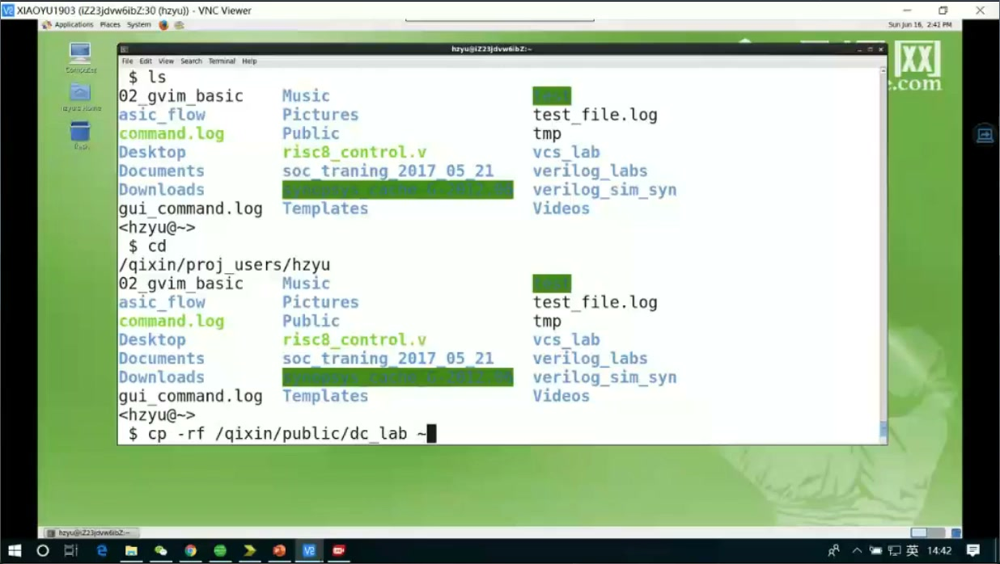
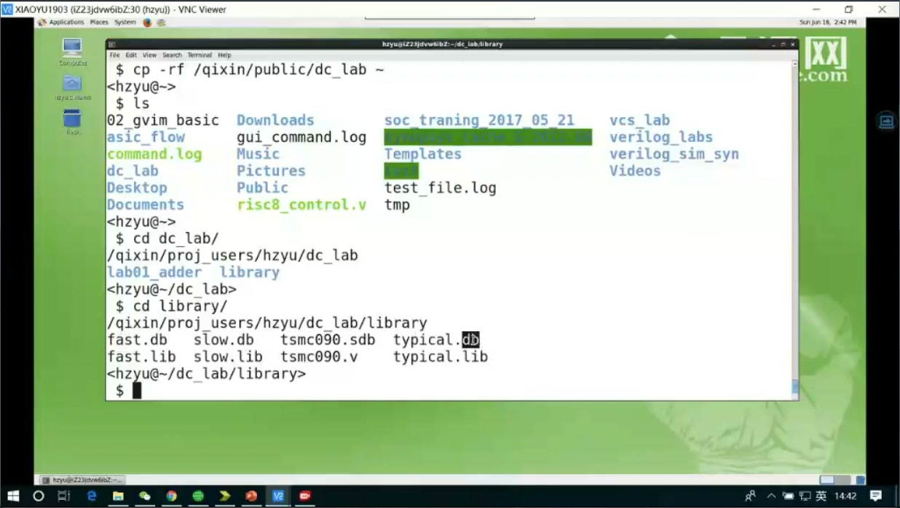
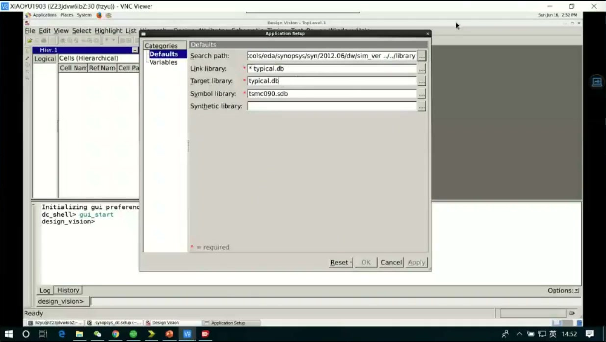
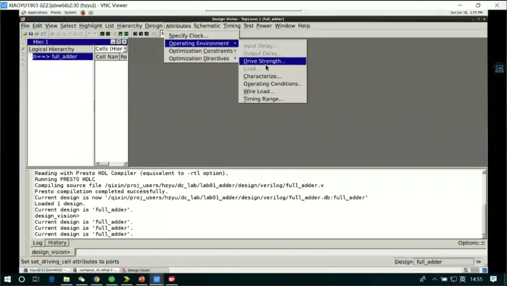
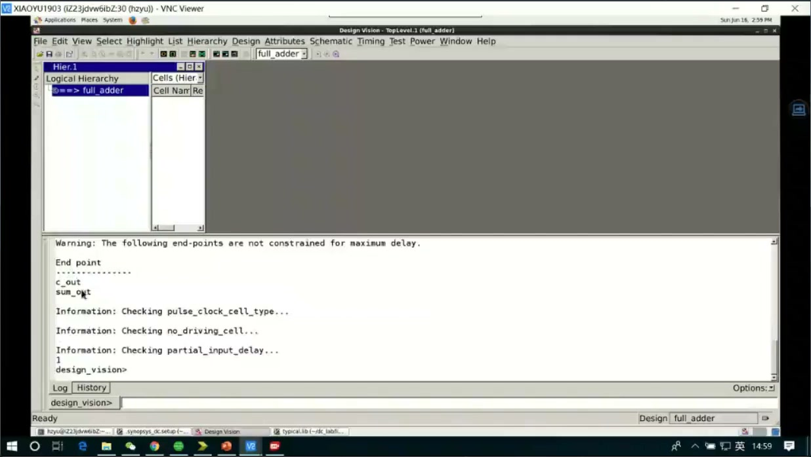
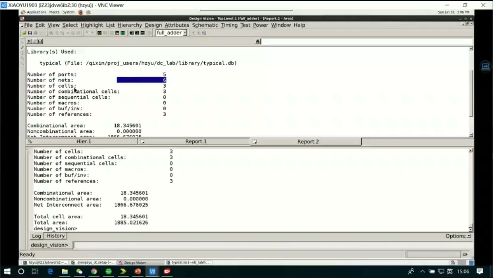
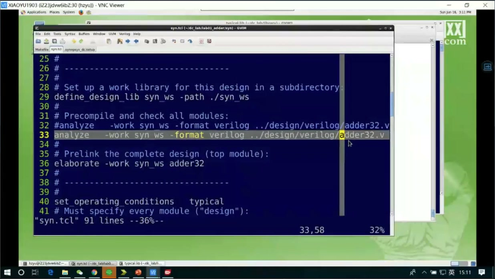
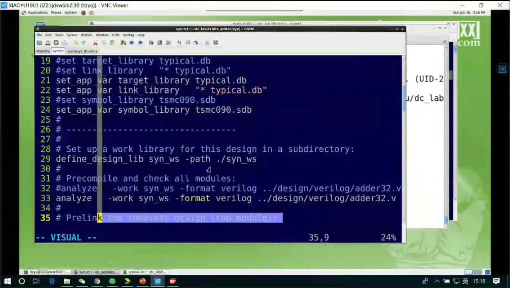
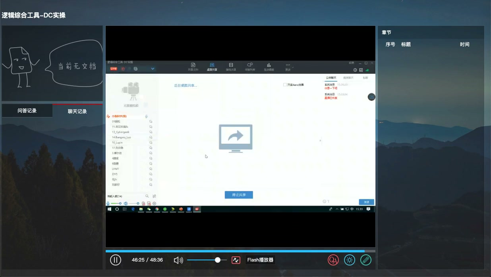

# 任务13：逻辑综合工具 DC 实操

> 本章目标：把任务09讲过的 Design Compiler 概念落到一次真实操作里：拷实验目录、认识库文件、启动 DC、读入 RTL、查看设计、生成报告，并理解 GUI 操作背后对应的脚本流程。

## 本章知识全景图


读这章时不要只记菜单在哪。真正要抓住的是：DC 的每一步都在回答一个工程问题。

| 步骤 | 表面动作 | 工程含义 |
|---|---|---|
| 拷贝 `dc_lab` | 准备实验目录 | 把 RTL、库、脚本、报告输出放到可复现工作区 |
| 查看 `library` | 找 `.db` / `.sdb` | 让综合器知道“有哪些标准单元可以用” |
| 启动 `dc_shell` / GUI | 打开工具 | 建立当前设计会话 |
| 读入 RTL | `read_verilog` 或 `analyze/elaborate` | 把文本 RTL 变成 DC 内部设计对象 |
| report | 面积/时序报告 | 检查综合结果是否满足面积、时序、结构预期 |
| 写脚本 | `syn.tcl` | 把手工流程变成可重复交付流程 |

## 1. 实验目录不是杂物堆，而是一次综合的“证据链”

课程从拷贝实验目录开始：



一个健康的 DC 实验目录通常至少包含：

- `design` 或 `rtl`：设计源码，例如加法器 RTL。
- `library`：综合用的工艺库，例如 `typical.db`、`fast.db`、`slow.db`。
- `script`：综合脚本，例如 `syn.tcl`。
- `report`：面积、时序、约束检查等输出。
- `out` 或 `netlist`：综合后的网表、约束、延时文件。

为什么要这样分？因为综合不是一次“点按钮”。以后你需要回答：

- 我当时用的是哪个库？
- 输入 RTL 是哪一版？
- 约束是否写错？
- 报告是否来自同一次 compile？
- 交给后仿/后端的网表和 SDC/SDF 是否匹配？

目录结构就是这些问题的最小证据链。

## 2. 工艺库：DC 能造什么硬件，由 library 决定

课程进入 `library` 目录查看库文件：



常见库文件含义：

| 文件 | 作用 | 在综合中的位置 |
|---|---|---|
| `.db` | Synopsys 编译后的 Liberty 工艺库 | 告诉 DC 标准单元面积、时序、功耗等模型 |
| `.sdb` | symbol library | GUI 中显示门级符号用 |
| `typical.db` | 典型 PVT 条件 | 常用于入门实验或默认综合 |
| `slow.db` | 慢角条件 | 更关注最坏时序 |
| `fast.db` | 快角条件 | 常用于 hold 或 min delay 分析 |

这节课里配置库的核心 Tcl 变量包括：

```tcl
set search_path     [list ./library ./design ./script]
set target_library  [list typical.db]
set link_library    [list * typical.db]
set symbol_library  [list tsmc090.sdb]
```

最重要的是 `target_library` 和 `link_library`：

- `target_library`：综合映射时允许使用哪些标准单元。
- `link_library`：链接设计时到哪里解析实例、库单元和引用模块。
- `search_path`：工具查找文件的路径集合。

## 3. GUI 操作背后仍然是 Tcl 命令

课程启动 DC 图形界面后，能看到 design browser、log、菜单等窗口：



GUI 适合初学者观察结构，但真正工程里不能依赖手点菜单。原因很简单：

- 手点菜单不可审查。
- 手点菜单不容易复现。
- 团队协作时别人无法准确知道你点了什么。
- CI 或服务器环境通常只跑脚本，不开 GUI。

所以学习 GUI 的正确姿势是：先借 GUI 看懂对象，再把操作沉淀成 Tcl 脚本。

## 4. 读入 RTL：`read_verilog` 与 `analyze/elaborate`

课程展示了读入设计的两类方式：



方式一：直接读 Verilog。

```tcl
read_verilog ./design/verilog/adder32.v
```

方式二：先 analyze，再 elaborate。

```tcl
analyze -format verilog ./design/verilog/adder32.v
elaborate adder32
```

两者都能把 RTL 带入 DC，但理解层次不同：

| 方式 | 更像什么 | 适合场景 |
|---|---|---|
| `read_verilog` | 一步读入 | 小实验、简单 RTL |
| `analyze` | 语法/语义分析 | 多文件、多语言、需要工作库管理 |
| `elaborate` | 展开顶层设计 | 参数化模块、层次化设计、正式脚本 |

**工程判断：**正式项目里更常见 `analyze + elaborate`，因为它更接近编译流程，能清晰地区分“源文件分析”和“顶层设计展开”。

## 5. 读入后要看什么：端口、层次、单元、面积

读入设计后，GUI 中可以看到设计对象：



初学者容易以为“读进来没报错就完了”。更稳的检查顺序是：

1. 顶层模块是否正确。
2. 输入输出端口数量是否符合 RTL。
3. 是否有 unresolved reference。
4. 当前设计是否设置到期望顶层。
5. compile 前后面积/单元数量是否有明显异常。

课程中通过 report 观察面积：



面积报告不是只看一个总数。它至少能帮助你判断：

- 是否真的综合出组合逻辑单元。
- 是否意外推断了 latch 或寄存器。
- 单元数量是否和设计规模大致匹配。
- hierarchical cell / combinational cell / sequential cell 的比例是否合理。

## 6. Tcl 脚本：把一次操作变成可复现流程

课程后半段打开综合脚本：



一个入门版 DC 脚本通常长这样：

```tcl
set search_path     [list ./library ./design ./script]
set target_library  [list typical.db]
set link_library    [list * typical.db]
set symbol_library  [list tsmc090.sdb]

define_design_lib work -path ./work

analyze -format verilog ./design/verilog/adder32.v
elaborate adder32
current_design adder32
link

check_design
compile

report_area   > ./report/adder32.area.rpt
report_timing > ./report/adder32.timing.rpt
```

这段脚本的核心不是命令本身，而是顺序：

```text
库配置 -> 工作库 -> 读 RTL -> 展开顶层 -> 链接 -> 检查 -> 综合 -> 报告
```

顺序错了，工具可能还能运行，但结果不可控。例如没有正确 `link`，后面可能带着 unresolved design 继续跑；没有 `check_design`，你可能直到后仿才发现端口或层次有问题。

## 7. 报告不是“跑完的纪念品”，而是下一轮修改的入口

课程展示了 timing / area 相关报告：



DC 实操中的最低质量门槛是：

- `check_design` 没有关键错误。
- `report_area` 能解释面积主要来自哪里。
- `report_timing` 能看到路径起点、终点、延迟和 slack。
- 如果 slack 为负，要知道是约束太紧、库太慢、路径太长，还是设计结构不合理。

**深挖：为什么 report_timing 是综合和 STA 的桥？**

综合工具 compile 时会根据约束尝试优化组合路径。`report_timing` 给你的不是抽象“速度”，而是一条具体路径：

```text
launch flop / input port
  -> combinational cells
  -> capture flop / output port
```

它把 RTL 里的表达式映射成门级单元延迟。比如一个 `sum = a + b`，在 RTL 中是一行加法，在综合后可能变成多级全加器、进位链或库里的加法结构。时序报告让你看到：这条硬件路径是否能在时钟周期内完成。

## 8. 本节与静态时序分析的衔接

课程最后让大家阅读静态时序分析基础资料：



原因是 DC 实操不能只会 `compile`。当你给出时钟约束后，DC 做的本质是：

- 在面积、时序之间做取舍。
- 选择更快或更小的标准单元。
- 调整组合逻辑结构。
- 生成可供 STA/后端继续分析的门级结果。

换句话说，DC 不是“把 Verilog 翻译成门”这么简单，而是在约束驱动下选择一种硬件实现。

## 9. 工程决策表：报告出来以后下一步做什么

| 发现 | 优先怀疑 | 下一步动作 |
|---|---|---|
| `check_design` 有 unresolved reference | 文件列表、模块名、link library | 先修读入和链接，不要继续优化 |
| latch 数量异常 | RTL 组合逻辑漏赋值、case 分支不全 | 回 RTL 查 `always_comb`、`case`、默认值 |
| 负 slack 集中在一条长组合路径 | 设计结构路径过深 | 考虑拆流水、改算法、改加法器/比较器结构 |
| 负 slack 出现在 I/O 路径 | input/output delay 或外部时序假设 | 回头确认 SDC，不要急着改 RTL |
| 面积异常增大 | 约束过紧、循环展开、位宽过宽 | 对比宽松约束下的面积，定位主要层次 |
| buffer/inverter 很多 | 扇出、负载、约束或库选择问题 | 看 high fanout net、load、驱动能力和约束 |

这张表把 DC 实操从“命令顺序”推进到“工程闭环”：每个报告异常都要对应一种假设，再用下一轮脚本或 RTL 修改验证。否则就会陷入反复 `compile`，但不知道自己在收敛什么。

## 10. 本节命令速查

```tcl
# 启动
dc_shell
design_vision

# 库配置
set search_path     [list ./library ./design ./script]
set target_library  [list typical.db]
set link_library    [list * typical.db]
set symbol_library  [list tsmc090.sdb]

# 读入和展开
define_design_lib work -path ./work
analyze -format verilog ./design/verilog/adder32.v
elaborate adder32
current_design adder32
link

# 检查与综合
check_design
compile

# 报告
report_area
report_timing
report_design
```

## 11. 自测题

1. `target_library` 和 `link_library` 的区别是什么？
2. 为什么正式项目更倾向于脚本化 DC 流程，而不是只用 GUI？
3. `analyze` 和 `elaborate` 分别对应什么阶段？
4. 如果 `report_timing` 中 slack 为负，你会先检查哪三件事？
5. 面积报告里 sequential cell 数量异常增加，可能暗示 RTL 中出现了什么问题？
6. 为什么 I/O 路径违例时不应该第一反应就拆 RTL 流水？

## 参考资料

- Synopsys Design Compiler 课程实操内容：本视频与对应字幕。
- AMD Vivado Tcl/SDC 文档中对 I/O delay 约束的解释可作为 SDC 语义参考：<https://docs.amd.com/r/2024.1-English/ug835-vivado-tcl-commands/set_output_delay>
