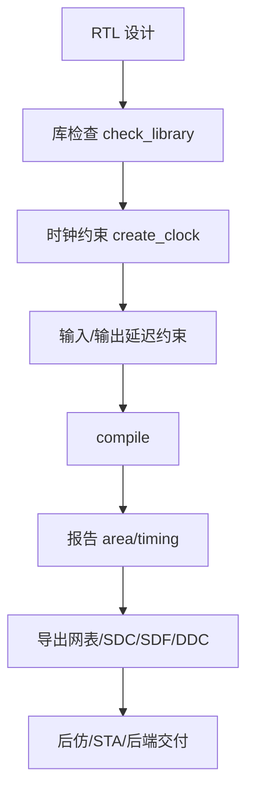
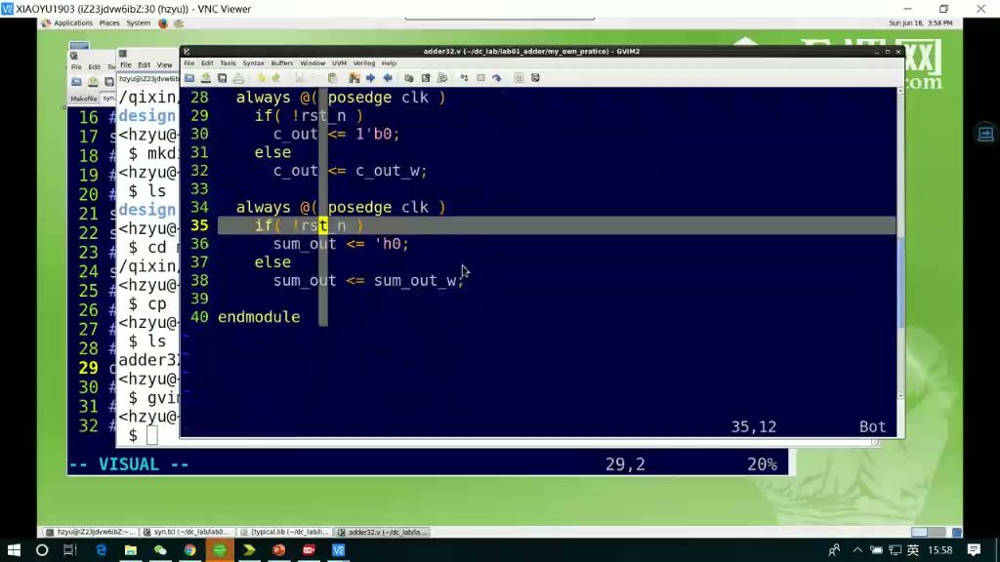
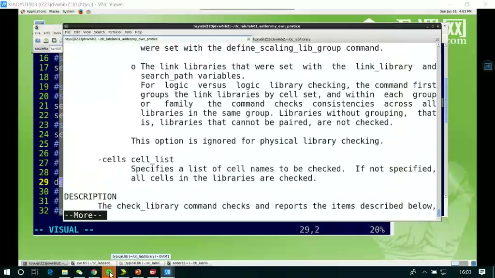
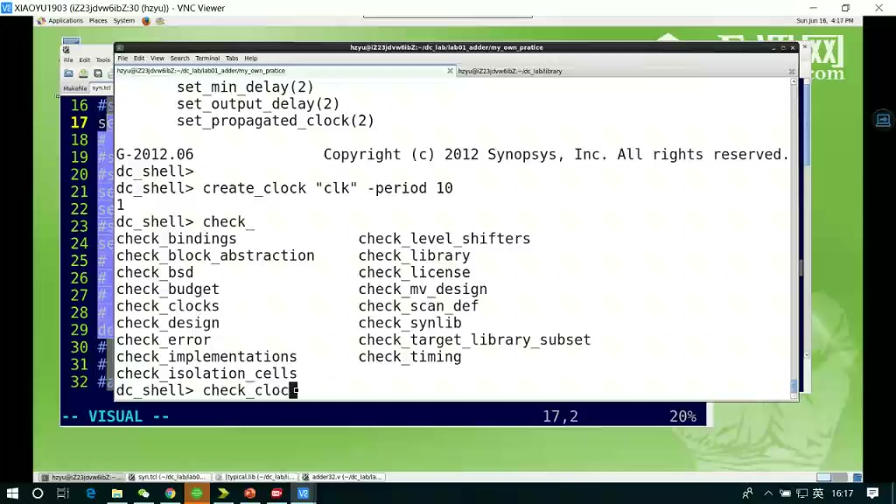
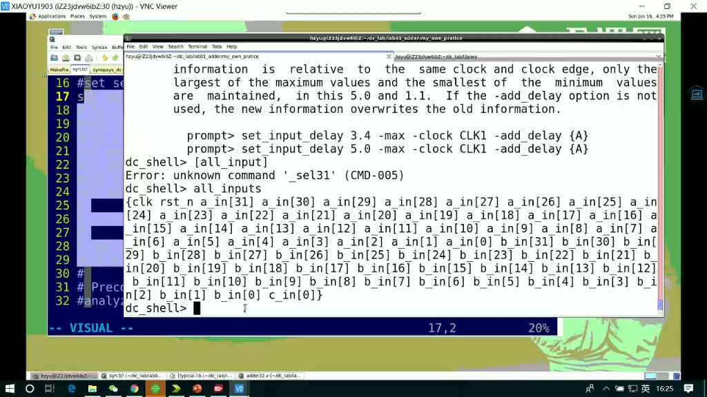
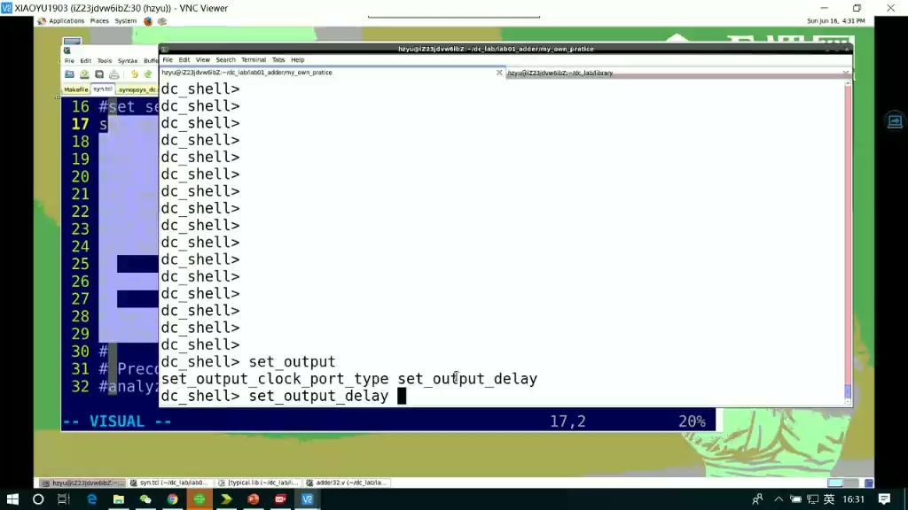
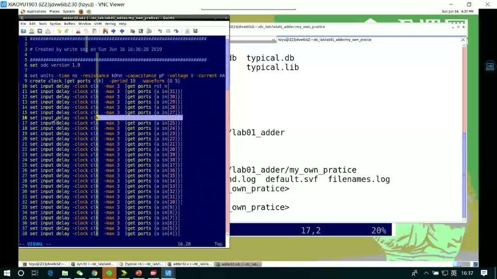
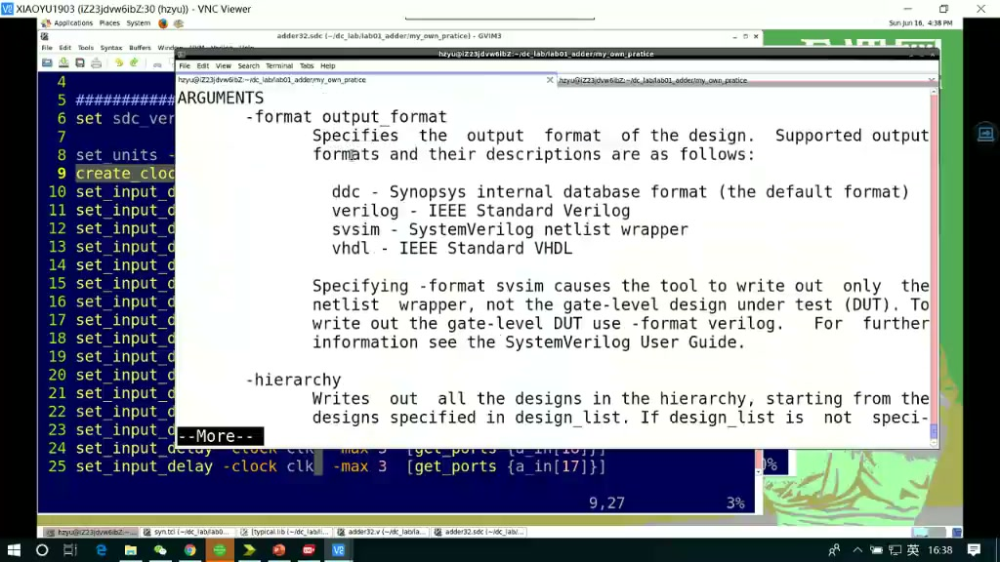
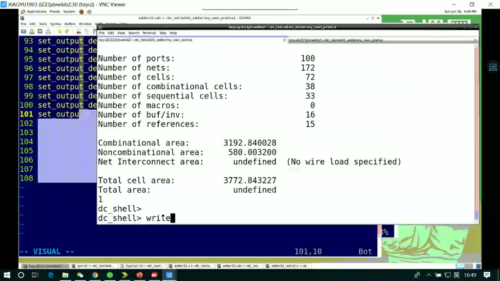
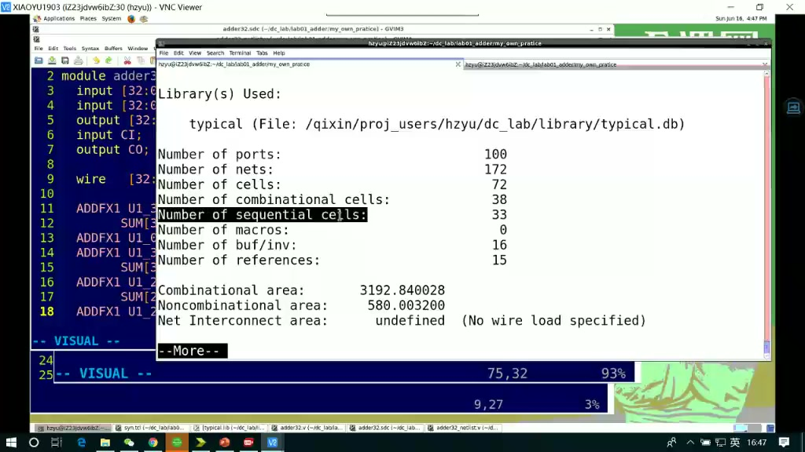

# 任务14：逻辑综合工具 DC 实操 02

> 本章目标：继续上一节 DC 实操，重点掌握时序约束怎么写、为什么要写，以及综合后应导出哪些文件交给仿真和后端流程。

## 本章知识全景图



这节课的主线可以压缩成一句话：**DC 不是只把 RTL 综合成网表，还要把“这份网表是在什么约束下生成的”一起交付出去。**

## 1. 为什么要先理解约束，再继续 DC 实操

课程一开始回到“为什么要加时序约束”：



没有约束时，DC 只能知道功能逻辑。例如一个加法器：

```verilog
always @(posedge clk) begin
    sum_out <= a + b;
end
```

但工具不知道：

- 时钟周期是多少？
- 输入数据相对时钟什么时候到？
- 输出数据要留多少时间给外部芯片采样？
- 面积和速度哪个更重要？

所以约束不是“附加说明”，而是综合优化的目标函数。

## 2. `check_library`：先确认工具真的认识你的工艺库

课程里查看 `check_library` 帮助和库检查：



库检查要解决的问题是：

- `target_library` 是否能找到。
- `link_library` 中的单元是否可解析。
- 逻辑库、符号库、物理库之间是否存在明显不一致。
- 是否存在缺失单元或不兼容库。

在真实项目里，库问题一旦没查清，后面所有结果都可能是假的：面积报告看起来有数，时序报告也能出，但映射到的单元可能不是你最终后端要用的库。

## 3. `create_clock`：给工具一个时间坐标系

课程使用 `man create_clock` 查看帮助，并演示创建时钟：



典型写法：

```tcl
create_clock -name clk -period 10 [get_ports clk]
```

它表达的是：

- 这个设计有一个名为 `clk` 的时钟。
- 周期是 10 ns。
- 这个时钟绑定到端口 `clk`。

如果没有 `create_clock`，工具就缺少分析寄存器到寄存器路径的基准。时序分析需要比较：

```text
数据路径延迟 + 建立时间 + 不确定性 <= 时钟周期
```

时钟周期来自 `create_clock`。

## 4. 输入延迟：外部世界已经消耗了多少时间

课程演示 `set_input_delay`：



典型写法：

```tcl
set_input_delay 5 -max -clock clk [all_inputs]
set_input_delay 1 -min -clock clk [all_inputs]
```

输入延迟不是说“芯片内部输入端口有 5ns 延迟”。它描述的是外部发射端到达本芯片输入端口之前，已经花掉了多少时间。

可以这样理解：

```text
外部寄存器 Q
  -> PCB/封装/外部组合逻辑
  -> 本芯片 input port
  -> 本芯片内部组合逻辑
  -> 本芯片寄存器 D
```

`set_input_delay` 约束的是外部那一段。工具据此知道留给本芯片内部路径的时间还剩多少。

AMD 的约束文档也用类似方式说明：输入延迟可以相对真实时钟或虚拟时钟定义，并可分别给 max/min 值。

## 5. 输出延迟：给外部接收端留下时间

课程演示 `set_output_delay`：



典型写法：

```tcl
set_output_delay 5 -max -clock clk [all_outputs]
set_output_delay 1 -min -clock clk [all_outputs]
```

输出延迟描述的是：数据离开本芯片后，外部接收端还需要多少时间关系来满足采样。可以画成：

```text
本芯片寄存器 Q
  -> 本芯片内部组合逻辑
  -> output port
  -> PCB/封装/外部接收端
  -> 外部寄存器 D
```

`set_output_delay` 会吃掉一部分时钟预算。AMD 文档中也明确把它描述为相对时钟边沿的外部系统级路径延迟，用来建模主输出端口外部的 timing。

## 6. 约束会改变综合结果，而不是只改变报告

这里是本节最重要的深挖点。

如果你不给时钟约束，工具可能选择面积小但慢的单元。如果你给了较紧的时钟，DC 可能会：

- 换用更快、面积更大的单元。
- 改写组合逻辑结构。
- 做逻辑复制以降低扇出。
- 调整门级实现，使关键路径变短。

所以同一份 RTL，在不同 SDC 下可能综合出不同网表。

这也是为什么交付时必须保留 SDC：网表本身只告诉别人“结果是什么”，SDC 才告诉别人“这个结果是在什么目标下得到的”。

## 7. 导出 SDC：把当前约束固化下来

课程演示 `write_sdc`：



典型写法：

```tcl
write_sdc ./out/adder32.sdc
```

导出的 SDC 通常包含：

- `create_clock`
- `set_input_delay`
- `set_output_delay`
- 可能还有 false path、multicycle path、clock uncertainty 等约束

入门阶段最关键的是理解：SDC 是 STA 和后端继续工作的共同语言。后端布局布线、PrimeTime 静态时序分析都需要知道这些约束。

## 8. 导出 SDF / DDC / 网表：它们分别给谁用

课程继续演示导出 SDF、DDC 等文件：



常见导出物：

| 文件 | 命令示例 | 给谁用 | 作用 |
|---|---|---|---|
| Verilog 网表 | `write -format verilog -hierarchy -output adder32.v` | 后仿、后端 | 门级连接关系 |
| SDC | `write_sdc adder32.sdc` | STA、后端 | 时序约束 |
| SDF | `write_sdf adder32.sdf` | 门级带延时仿真 | 单元/路径延时 |
| DDC | `write -format ddc -hierarchy -output adder32.ddc` | Synopsys 工具链 | 保存 DC 内部数据库 |



**工程判断：**

- 给 VCS 做门级后仿，通常需要网表 + SDF + 仿真库。
- 给 STA，需要网表 + SDC + 工艺库。
- 继续在 DC/ICC/PrimeTime 系列工具中读取，DDC 很方便。

## 9. 综合后的网表要看什么

课程打开 mapped netlist：



mapped netlist 不再是 RTL 里的 `+`、`if`、`case`，而是库单元实例。例如：

```verilog
ADDFX1 U1 (...);
INVX1  U2 (...);
DFFQX1 U3 (...);
```

看网表时重点不是逐行背库单元，而是确认：

- 顶层端口是否保持一致。
- 是否出现预期的寄存器。
- 组合逻辑是否映射成库单元。
- 是否有未解析模块。
- 是否有异常多的 buffer/inverter。

异常多的 buffer 可能说明扇出、约束或库选择有问题；异常的 latch 可能说明 RTL 条件分支没有赋全。

## 10. 工程检查表：约束和网表异常怎么定位

| 异常 | 可能原因 | 先做什么 |
|---|---|---|
| `check_library` 异常 | 工艺库路径、库版本、link/target 设置错误 | 先修库环境，库不可信时不要看 QoR |
| 没有 clock 或 clock 异常 | `create_clock` 对象没选中、端口名错、generated clock 漏约束 | 检查 clock report 和 SDC 对象匹配 |
| 输入/输出路径大量违例 | `set_input_delay` / `set_output_delay` 假设不合理 | 回系统接口时序确认外部预算 |
| 网表里 latch 出现 | RTL 漏赋值、状态机 default 不完整 | 回源代码查组合逻辑分支覆盖 |
| buffer/inverter 异常多 | 扇出过高、负载太大、约束太紧 | 查 fanout、load、驱动单元选择 |
| 导出的 SDC/SDF 不可用 | 输出路径、层次名、后续工具期望不一致 | 用后仿/STA 入口做一次读入检查 |

约束文件不是“给工具看的附属文件”，它定义了综合工具眼里的工作世界。`create_clock` 定义时间坐标，I/O delay 定义外部世界已经消耗或需要保留的时间，load/transition 定义电气环境。约束错了，工具可能非常努力地优化一个并不存在的问题。

## 11. 本节实操脚本骨架

```tcl
set search_path     [list ./library ./design ./script]
set target_library  [list typical.db]
set link_library    [list * typical.db]
set symbol_library  [list tsmc090.sdb]

analyze -format verilog ./design/verilog/adder32.v
elaborate adder32
current_design adder32
link
check_design
check_library

create_clock -name clk -period 10 [get_ports clk]
set_input_delay  5 -max -clock clk [remove_from_collection [all_inputs] [get_ports clk]]
set_input_delay  1 -min -clock clk [remove_from_collection [all_inputs] [get_ports clk]]
set_output_delay 5 -max -clock clk [all_outputs]
set_output_delay 1 -min -clock clk [all_outputs]

compile

report_area   > ./report/adder32.area.rpt
report_timing > ./report/adder32.timing.rpt

write -format verilog -hierarchy -output ./out/adder32.mapped.v
write_sdc ./out/adder32.sdc
write_sdf ./out/adder32.sdf
write -format ddc -hierarchy -output ./out/adder32.ddc
```

注意：上面脚本把 `clk` 从输入端口集合里移除，是因为时钟端口通常不应该被当作普通 data input 加 `set_input_delay`。

## 12. 自测题

1. 为什么 `create_clock` 是寄存器到寄存器时序分析的基准？
2. `set_input_delay` 表示芯片内部输入延迟，还是芯片外部已经消耗的时间？
3. 为什么同一份 RTL 在不同 SDC 下可能得到不同网表？
4. SDC、SDF、DDC、mapped Verilog 分别应该交给谁？
5. 如果综合后网表里出现 latch，你会回 RTL 里重点检查什么？
6. 为什么 `create_clock` 对象没选中时，后续 timing report 可能看起来“很干净”但其实不可用？

## 参考资料

- Synopsys Design Compiler 课程实操内容：本视频与对应字幕。
- AMD Vivado Tcl command 文档：`set_output_delay` 说明外部系统级路径延迟的语义：<https://docs.amd.com/r/2024.1-English/ug835-vivado-tcl-commands/set_output_delay>
- AMD Vivado 约束方法文档：`set_input_delay` 的真实时钟、虚拟时钟、max/min 示例：<https://docs.amd.com/r/2024.1-English/ug903-vivado-using-constraints/Use-of-set_input_delay-Command-Options>
