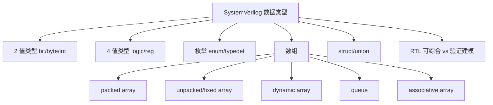
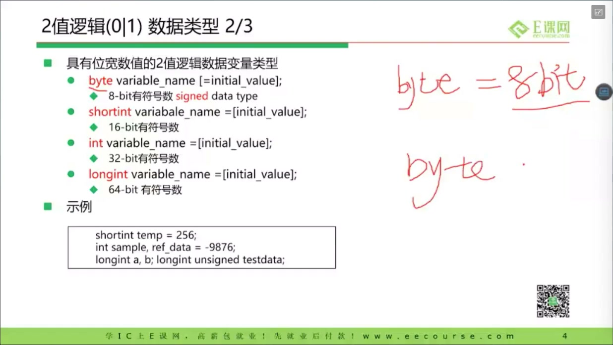
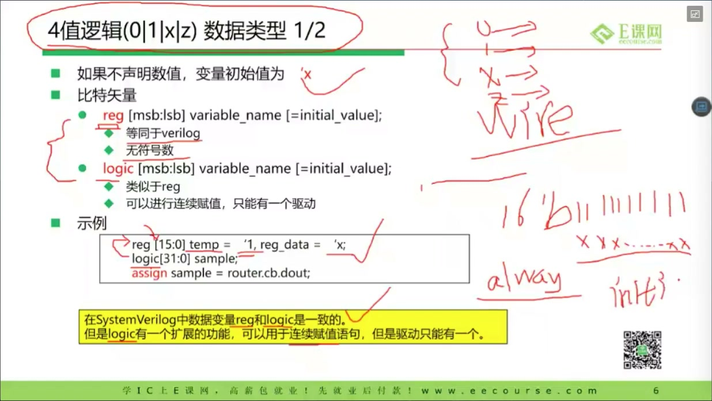
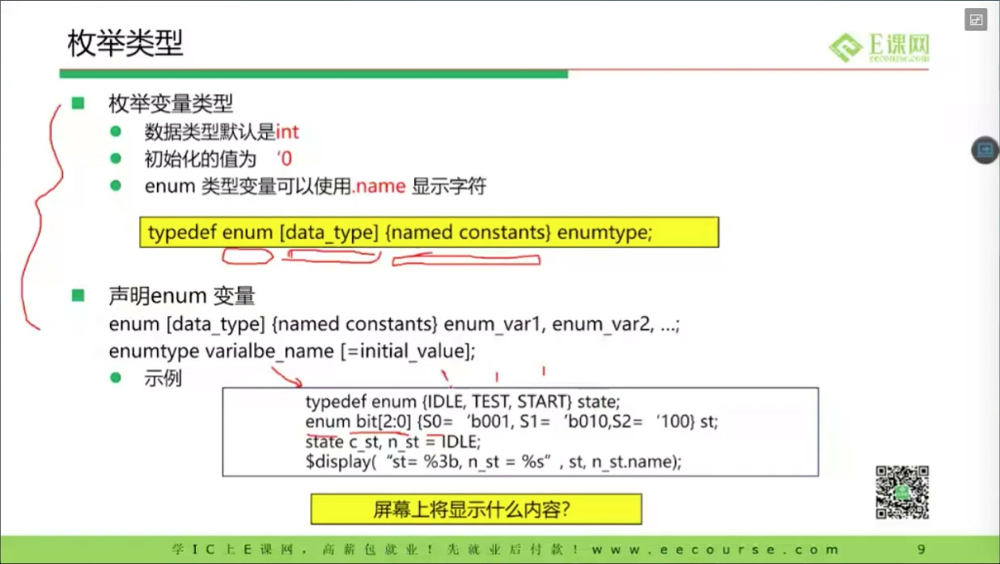
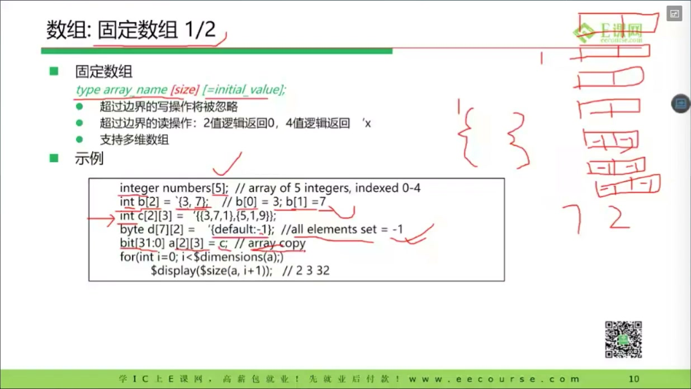
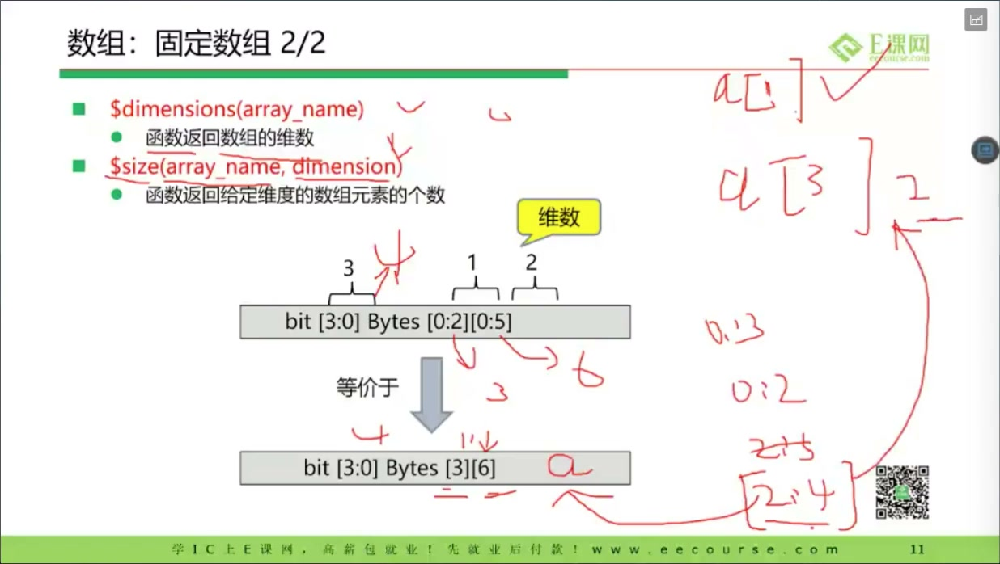
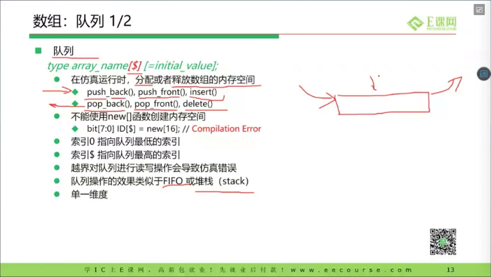
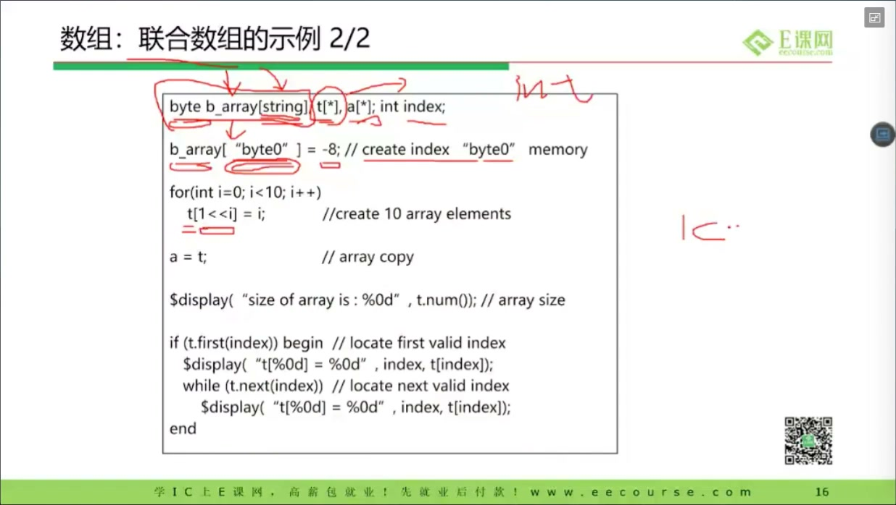
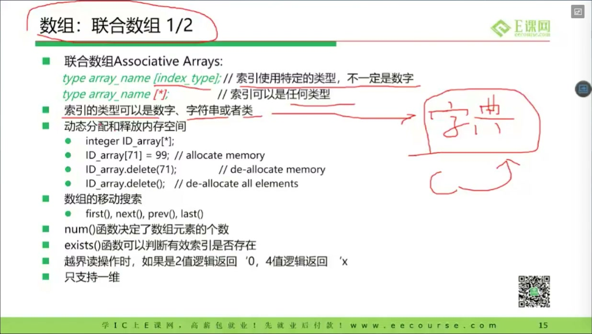
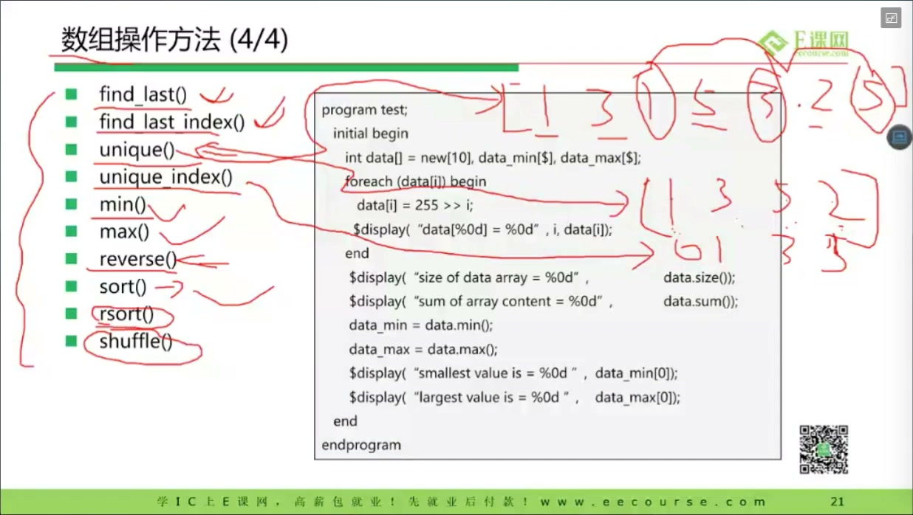

# 任务15：Verilog / SystemVerilog 数据类型

> 本章目标：理解 SystemVerilog 为什么引入更丰富的数据类型；区分 2 值/4 值、`wire/reg/logic`、packed/unpacked array、enum、struct/union、queue、dynamic array、associative array，并知道哪些适合 RTL，哪些主要适合 testbench。

## 本章知识全景图



这节课的关键不是“把类型名字背下来”，而是建立一个判断：

| 类型问题 | 应该问的工程问题 |
|---|---|
| 2 值还是 4 值？ | 是否需要在仿真中暴露 X/Z？ |
| `logic` 还是 `wire`？ | 这个信号由过程赋值还是连续赋值/多驱动网络产生？ |
| packed 还是 unpacked？ | 它是一个位向量，还是一组元素？ |
| enum/typedef 是否需要？ | 状态和协议字段是否需要可读、可维护？ |
| dynamic/queue/associative array 能否综合？ | 多数用于 testbench，不应随便写进可综合 RTL |

## 1. 为什么前端设计工程师也要学 SystemVerilog

课程开头说明：前端设计工程师不一定要写复杂验证平台，但需要能读懂验证工程师的代码，也需要写简单 testbench。

SystemVerilog 相比 Verilog 的价值主要有两类：

- **RTL 表达更清楚**：如 `logic`、`enum`、`typedef`、packed struct。
- **验证建模更方便**：如 `class`、queue、dynamic array、associative array、randomization。

本节集中在数据类型。学习时要始终区分：

```text
可综合 RTL 类型：最终要变成硬件
验证/仿真类型：主要帮助激励、检查、建模
```

## 2. 2 值类型：速度快，但会隐藏 X/Z 问题

课程讲到 `bit/byte/shortint/int/longint` 等 2 值类型：



SystemVerilog 常见 2 值类型：

| 类型 | 位宽 | 默认符号性 | 常见用途 |
|---|---:|---|---|
| `bit` | 1 | unsigned | 简单 0/1 标志，验证模型 |
| `byte` | 8 | signed | 字节数据、字符串字符 |
| `shortint` | 16 | signed | 仿真变量 |
| `int` | 32 | signed | 循环变量、计数、testbench |
| `longint` | 64 | signed | 大整数建模 |

2 值类型只能表示 `0/1`，不能表示 `X/Z`。这会带来一个工程风险：真实 RTL 中未复位、冲突驱动、高阻等问题，在 2 值仿真变量里可能被压成 0 或 1，从而掩盖 bug。

**建议：**

- testbench 的纯算法变量可以用 `int/bit`。
- 可综合 RTL 信号优先用 4 值 `logic`，让 X 传播帮你暴露问题。

## 3. 4 值类型：`logic` 是 RTL 默认首选

课程强调 `reg` 与 `logic`：



4 值类型可以表达：

```text
0：逻辑 0
1：逻辑 1
X：未知
Z：高阻
```

SystemVerilog 里 `logic` 常用于替代 Verilog 的 `reg`。重要的是不要被名字误导：

- `reg` 不一定是寄存器。
- `logic` 也不一定是组合逻辑。
- 是否综合成寄存器，取决于赋值所在的 always 块和时钟/敏感条件。

例如：

```systemverilog
logic [7:0] a, b, y;

always_comb begin
    y = a + b;      // 组合逻辑
end

always_ff @(posedge clk or negedge rst_n) begin
    if (!rst_n)
        q <= '0;
    else
        q <= y;     // 触发器
end
```

同样是 `logic`，第一个 `y` 是组合结果，第二个 `q` 是寄存器。工具看的是使用方式，不是类型名字。

SystemVerilog.dev 也给出类似建议：`logic` 是最常用的基础类型，4 值，可以表示组合或时序信号，具体是否实例化触发器由下游工具根据使用方式判断。

## 4. 深挖：为什么 `logic` 不是“万能 wire”

`logic` 很方便，但它不代表可以无脑替代所有 `wire`。

区别在于驱动模型：

```systemverilog
wire  a;
logic b;

assign a = x & y;      // 连续赋值网络
assign b = x & y;      // SystemVerilog 中单驱动也常被接受

always_comb begin
    b = x | y;         // 过程赋值
end
```

工程上应遵守：

- 模块之间纯连接、多个连续驱动、三态网络，保守用 `wire`。
- always 块中赋值的普通 RTL 信号，用 `logic`。
- 不要让同一个 `logic` 被多个 always 块同时赋值。

这与 Clifford Cummings 关于阻塞/非阻塞赋值的经典建议是一致的：顺序逻辑、组合逻辑、驱动归属要清楚，否则容易出现仿真竞争和综合不一致。

## 5. enum / typedef：让状态机更像状态机

课程讲到 `typedef enum`：



不推荐这样写状态：

```systemverilog
localparam IDLE = 2'b00;
localparam WORK = 2'b01;
localparam DONE = 2'b10;
logic [1:0] state;
```

更推荐：

```systemverilog
typedef enum logic [1:0] {
    IDLE,
    WORK,
    DONE
} state_e;

state_e state, state_n;
```

好处：

- 波形里能显示状态名，调试更直观。
- 状态变量类型更明确。
- 编译器/仿真器更容易检查非法赋值。
- 后续增加状态时，维护成本更低。

**硬件视角：**`enum logic [1:0]` 最终仍然是 2 位寄存器；名字只存在于源码、调试和类型系统里。不要以为 enum 会自动生成神秘硬件。

## 6. packed array：把多维写法仍然看成一个连续位向量

课程讲到 packed array：



写法：

```systemverilog
logic [3:0][7:0] data;
```

可以理解为：

```text
data 是一个 32-bit packed 向量
被组织成 4 组，每组 8 bit
```

packed 维度写在变量名左边。它的重要特点是：

- 物理上更接近连续 bit vector。
- 可以切片、拼接、整体赋值。
- 常适合表示总线字段、像素、SIMD lane、协议包字段。

例如：

```systemverilog
logic [3:0][7:0] byte_lane;

byte_lane[0]      = 8'h12;
byte_lane[1][3:0] = 4'hA;
logic [31:0] flat = byte_lane;
```

SystemVerilog.dev 也指出，packed array 可在左侧增加维度，并支持子数组切片。

## 7. unpacked / fixed array：更像“若干个元素”

课程讲到固定数组和内存形态：



写法：

```systemverilog
logic [7:0] mem [0:15];
```

它表示 16 个元素，每个元素是 8 位。unpacked 维度写在变量名右边，更像数组/存储器：

```text
mem[0] 是一个 8-bit 元素
mem[1] 是另一个 8-bit 元素
...
```

常见用途：

- 寄存器文件。
- 小 RAM 建模。
- testbench 中的固定长度数组。

packed 和 unpacked 的直觉差异：

| 写法 | 更像 | 典型用途 |
|---|---|---|
| `logic [3:0][7:0] a` | 32-bit 连续位向量，分成 4 个 byte | 总线字段、可切片数据 |
| `logic [7:0] a [0:3]` | 4 个 8-bit 元素 | memory、数组元素集合 |

## 8. dynamic array / queue / associative array：主要是验证工具箱

课程后半段讲动态数组、队列、关联数组：





三者对比如下：

| 类型 | 大小何时决定 | 索引 | 常见操作 | 主要用途 |
|---|---|---|---|---|
| dynamic array | 仿真时 `new[]` | 整数 | `new`、`delete` | 可变长度数据缓存 |
| queue | 仿真中动态变化 | 整数 | `push_back`、`pop_front`、`insert` | transaction 队列、scoreboard |
| associative array | 按需分配 | 任意 key 类型 | `exists`、`first`、`next`、`delete` | 稀疏表、按 ID 查找 |

例如验证中常见：

```systemverilog
packet_t exp_q[$];              // queue
packet_t by_id[int];            // associative array
byte     payload[];             // dynamic array
```

这些类型非常适合 testbench，但不要默认写进可综合 RTL。硬件没有“运行时随便 new 一块内存”这种抽象；真实硬件需要明确的寄存器、RAM、FIFO 或 SRAM 宏。

## 9. struct / union：把相关字段放在一起

课程讲到结构/联合：



结构体适合表达协议字段：

```systemverilog
typedef struct packed {
    logic        valid;
    logic [3:0]  opcode;
    logic [31:0] addr;
    logic [31:0] data;
} bus_req_t;

bus_req_t req;
```

`packed struct` 的好处是：既能按字段读写，也能整体当作 bit vector 传递或打拍。

union 则表示多个字段共享同一片存储解释。它在验证、协议解析中有价值，但 RTL 中要谨慎使用，避免可读性和工具支持问题。

## 10. 数组方法：仿真里好用，RTL 中要克制

课程展示了数组方法：



常见方法：

- `size()`
- `delete()`
- `find()`
- `find_index()`
- `sort()`
- `reverse()`
- `shuffle()`

这些方法看起来像软件语言，非常适合 testbench。例如 scoreboard 中检查期望包：

```systemverilog
int idx[$] = q.find_index with (item.id == target_id);
```

但对 RTL 设计要保持警惕：你必须能回答“这会综合成什么硬件”。如果回答不出来，就不要放进可综合设计。

## 11. 深挖：数据类型选择怎样影响硬件和仿真一致性

### 11.1 2 值类型可能隐藏复位问题

```systemverilog
bit   a;
logic b;
```

仿真开始时，`bit` 倾向于只有 0/1，`logic` 可以显示 `X`。如果一个寄存器没有复位，`logic` 更容易在波形里暴露未知值传播；`bit` 可能把问题压掉。

### 11.2 packed/unpacked 影响你能否整体切片

```systemverilog
logic [3:0][7:0] packed_bytes;
logic [7:0]      mem [0:3];
```

前者更像一个 32-bit 总线，后者更像 4 个元素。你写总线打包、协议字段、NPU 中的多 lane 数据时，packed 更自然；你写 RAM/FIFO 存储时，unpacked 更自然。

### 11.3 `enum logic` 让状态编码可控

不要只写：

```systemverilog
typedef enum {IDLE, BUSY, DONE} state_e;
```

更稳的是明确底层位宽：

```systemverilog
typedef enum logic [1:0] {IDLE, BUSY, DONE} state_e;
```

这样综合和仿真都知道状态寄存器宽度，避免默认 `int` 带来的不必要宽度。

## 12. 工程选择表：先问“这是硬件还是验证数据结构”

| 需求 | 推荐类型 | 不推荐的原因 / 边界 |
|---|---|---|
| RTL 普通信号 | `logic` / 明确位宽向量 | `bit` 可能隐藏 X，裸 `integer` 位宽过大且语义不清 |
| 状态机 | `typedef enum logic [N:0]` | 不写底层位宽可能引入不必要的默认宽度 |
| 总线字段打包 | `struct packed` / packed array | 便于整体切片、拼接、传接口 |
| RAM/FIFO 存储 | unpacked array | 更接近“多个元素”的存储结构 |
| testbench 队列/事务池 | queue / dynamic array / associative array | 这些主要是仿真数据结构，不应随手放进可综合 RTL |
| 参数化宽度 | `localparam` + 显式范围 | 不要让工具靠隐式扩展/截断猜你的意图 |

判断标准很朴素：如果这段代码要综合成硬件，就必须能回答“它会变成多少根线、多少个寄存器、什么组合逻辑”。如果只是 testbench 数据管理，则可以优先考虑表达力和仿真效率。

## 13. RTL 推荐用法清单

```systemverilog
// 普通信号
logic valid;
logic [31:0] data;

// 组合逻辑
always_comb begin
    y = a + b;
end

// 时序逻辑
always_ff @(posedge clk or negedge rst_n) begin
    if (!rst_n)
        q <= '0;
    else
        q <= d;
end

// 状态机
typedef enum logic [1:0] {
    S_IDLE,
    S_RUN,
    S_DONE
} state_e;

state_e state, state_n;

// 总线字段
typedef struct packed {
    logic        valid;
    logic [7:0]  opcode;
    logic [31:0] payload;
} req_t;
```

## 14. 自测题

1. `bit` 和 `logic` 最大区别是什么？为什么 RTL 更常用 `logic`？
2. `reg` 一定会综合成寄存器吗？为什么？
3. `logic [3:0][7:0] a` 和 `logic [7:0] a [0:3]` 的含义有什么不同？
4. 为什么状态机推荐 `typedef enum logic [N:0]`？
5. dynamic array、queue、associative array 为什么主要用于 testbench？
6. 为什么“能仿真”的数据结构不一定适合放进可综合 RTL？

## 参考资料

- 本视频与对应字幕。
- SystemVerilog.dev 第 2 章对 `logic`、2 值类型、enum、packed/unpacked array、typedef 的总结：<https://systemverilog.dev/2.html>
- Clifford E. Cummings, “Nonblocking Assignments in Verilog Synthesis, Coding Styles That Kill”，用于理解 RTL 驱动、阻塞/非阻塞与仿真竞争：<https://csg.csail.mit.edu/6.375/6_375_2009_www/papers/cummings-nonblocking-snug99.pdf>
