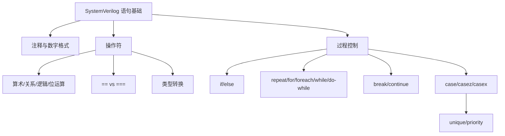
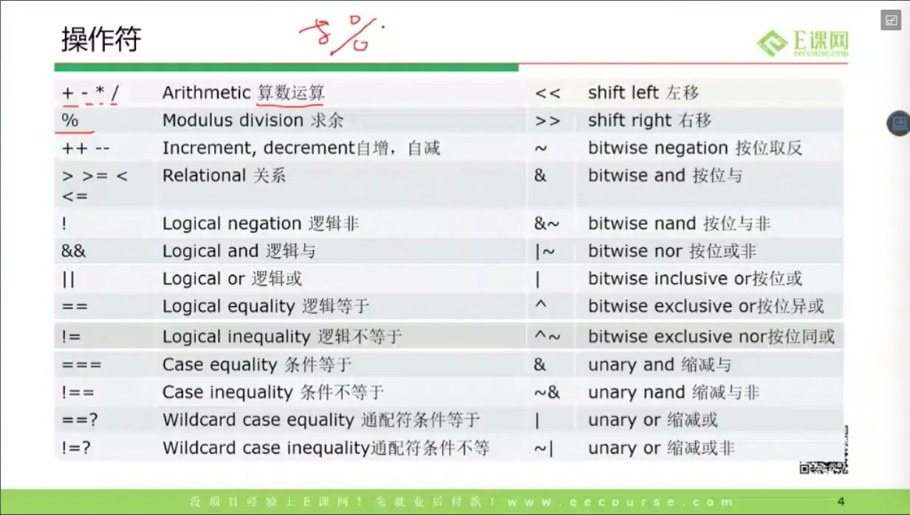
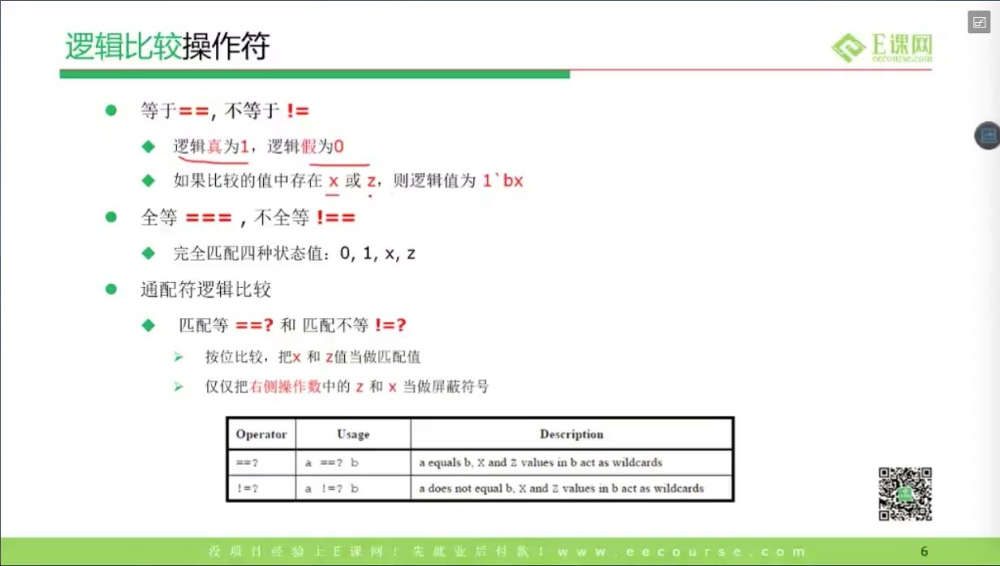
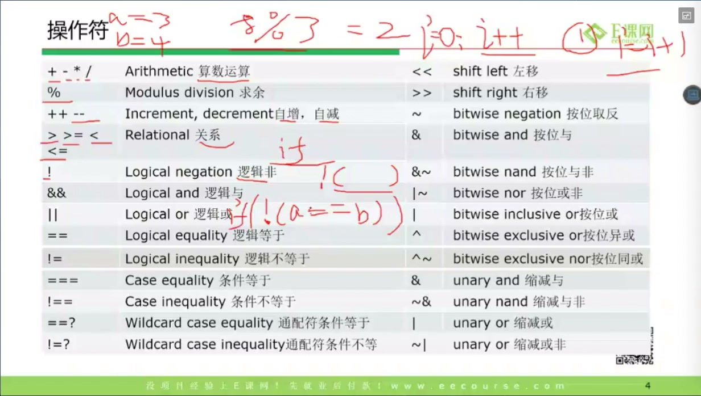
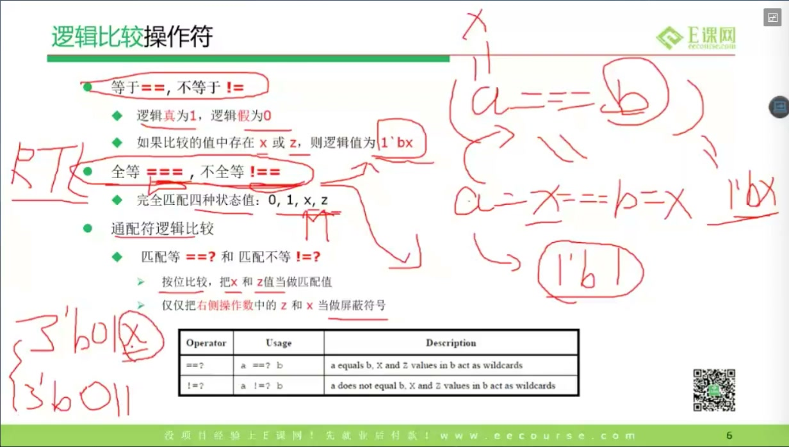
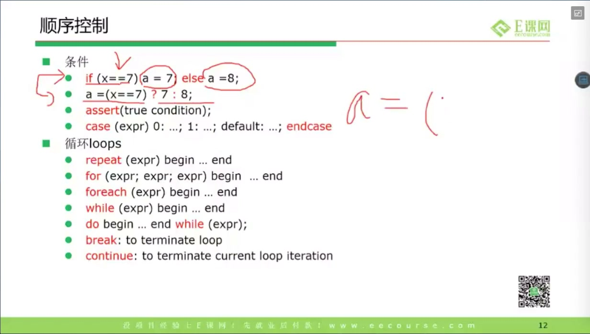
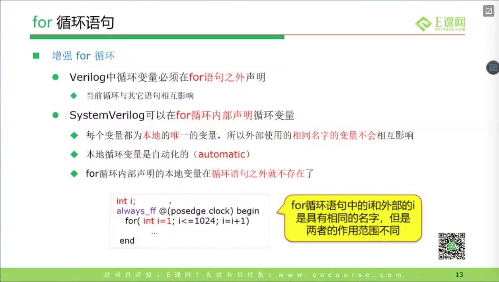
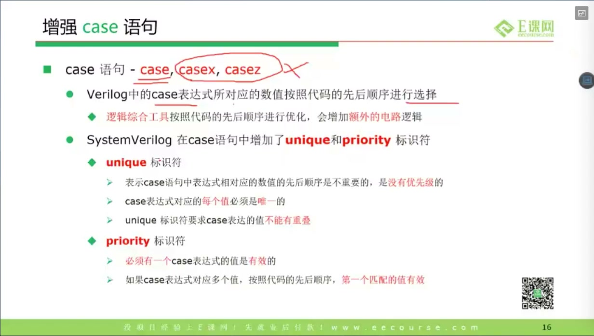
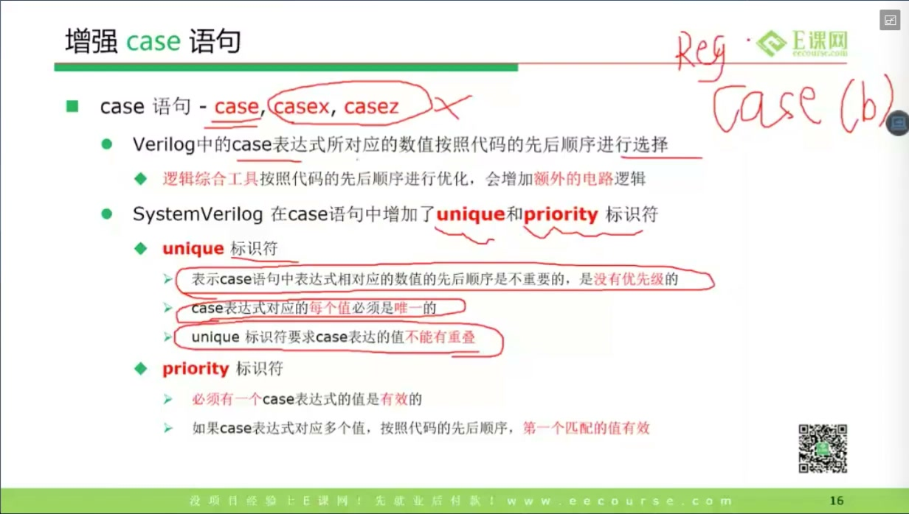
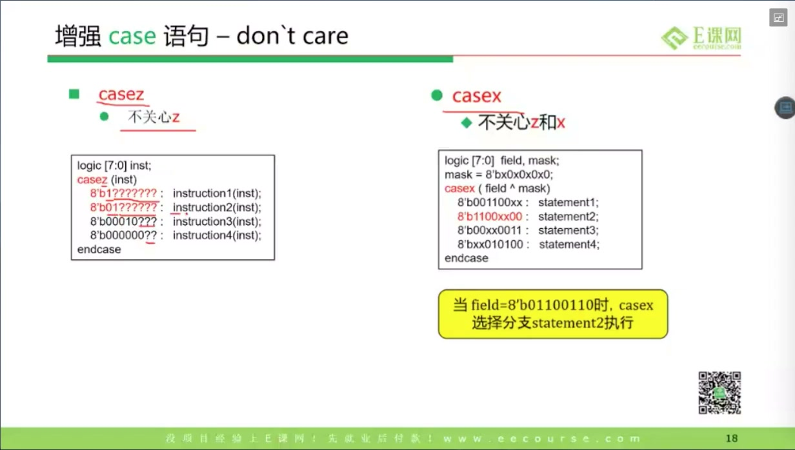

# 任务16：操作符和过程控制

> 本章目标：掌握 SystemVerilog 中常见数值写法、操作符、条件语句、循环语句和增强 `case` 语句。重点不是背语法表，而是理解 4 值逻辑里的 `X/Z` 如何影响判断，以及 `case/unique/priority/casez/casex` 在 RTL 和 testbench 中的风险。

## 本章知识全景图



## 1. 注释和数字格式：让代码先能被人读懂

课程从注释和数字写法开始：



注释有两种：

```systemverilog
// 单行注释

/*
  多行注释
*/
```

数字常见格式：

```systemverilog
4'b1010       // 4 位二进制
8'hA5         // 8 位十六进制
16'd1024      // 16 位十进制
32'hDEAD_BEEF // 下划线只增强可读性，不改变数值
```

SystemVerilog 数字字面量通常可以理解为：

```text
位宽 ' 符号性 基数 数值
```

例如：

```systemverilog
8'shFF   // 8-bit signed hex，值按有符号数解释
8'hFF    // 8-bit unsigned hex
```

数字格式看似简单，但它会直接影响位宽截断、符号扩展和比较结果。写 RTL 时尽量显式写位宽，尤其是寄存器、总线和参数比较。

## 2. 操作符：先分清逻辑运算和位运算

课程列出常见操作符：



常见分类如下：

| 类别 | 操作符 | 含义 |
|---|---|---|
| 算术 | `+ - * / %` | 加减乘除、取余 |
| 关系 | `< <= > >=` | 大小比较 |
| 逻辑 | `! && ||` | 把表达式整体当作真假 |
| 位运算 | `~ & | ^ ~^` | 对每一 bit 运算 |
| 移位 | `<< >> <<< >>>` | 逻辑/算术移位 |
| 条件 | `?:` | 三目选择 |
| 拼接 | `{}` | 拼接或重复拼接 |
| 比较 | `== != === !== ==? !=?` | 逻辑相等、全等、通配比较 |

最容易混的是：

```systemverilog
if (a && b)  // 逻辑与：判断 a、b 是否为真
if (a & b)   // 位与：逐 bit 相与
```

如果 `a` 和 `b` 是多 bit 总线，`&&` 和 `&` 的语义完全不同。前者更像“是否非 0”，后者会产生一个同宽度或推导宽度的位向量。

## 3. `if` 遇到 X/Z：不要把未知当成可控分支

课程强调：`if` 条件为 `X/Z` 时会被当作不满足：



例如：

```systemverilog
logic sel;
logic y;

always_comb begin
    if (sel)
        y = 1'b1;
    else
        y = 1'b0;
end
```

如果 `sel = 1'bx`，仿真通常走 `else` 分支。这在波形里可能让 `X` 被“吃掉”，导致真实问题被隐藏。

**硬件视角：**真实门电路里，如果选择信号未知，mux 输出可能也是未知；但 `if` 仿真语义可能选择一条分支，从而降低 X 传播。验证时要小心这种“仿真看起来确定，硬件意义不确定”的情况。

## 4. `==`、`===` 与 X 传播

课程讲逻辑比较操作符：



两类比较要分清：

```systemverilog
a == b     // 逻辑相等：遇到 X/Z 结果可能为 X
a === b    // case equality：X/Z 也作为普通值参与比较
a != b
a !== b
```

例子：

```systemverilog
logic [1:0] a = 2'b1x;
logic [1:0] b = 2'b1x;

// a == b   结果可能为 X
// a === b  结果为 1
```

经验规则：

- RTL 条件判断中谨慎使用 `===`，因为它可能把 X 当作合法匹配值。
- testbench 检查 X/Z 时可以使用 `===` / `!==`。
- 验证断言或 scoreboard 中，明确区分“值相等”和“连未知位也完全一致”。

## 5. 类型转换：位宽和符号性会改变结果

课程提到强制类型转换：


常见写法：

```systemverilog
int'(expr)
logic [7:0]'(expr)
signed'(expr)
unsigned'(expr)
```

例子：

```systemverilog
logic [7:0] u = 8'hFF;
int signed s;

s = signed'(u);  // 按 signed 解释
```

类型转换要问三件事：

1. 目标位宽是多少？
2. 是否有符号？
3. 超出位宽时是截断，扩展时是补 0 还是符号扩展？

在数字 IC 中，这不是语法细节，而是硬件位宽设计。NPU、DSP、累加器里常见 bug 就来自位宽和 signed/unsigned 混用。

## 6. 条件和循环：过程控制只在过程块里控制执行顺序

课程讲 `if/else` 与循环：





常见语句：

```systemverilog
if (cond) begin
    ...
end else begin
    ...
end

repeat (N) begin
    ...
end

for (int i = 0; i < N; i++) begin
    ...
end

foreach (array[i]) begin
    ...
end

while (cond) begin
    ...
end

do begin
    ...
end while (cond);
```

`break` 和 `continue`：

- `break`：跳出整个循环。
- `continue`：结束本轮，进入下一轮。

**RTL 判断：**循环不是天然等于“硬件反复运行”。在可综合 RTL 中，`for` 往往会被展开成并行硬件结构；在 testbench 中，循环才更像软件循环。写 RTL 时一定要能回答：这个循环最终会展开成多少比较器、加法器、mux 或寄存器？

## 7. `case`：它不是简单的 if/else 替代品

课程重点讲 `case`：



典型写法：

```systemverilog
always_comb begin
    unique case (opcode)
        2'b00: y = a + b;
        2'b01: y = a - b;
        2'b10: y = a & b;
        2'b11: y = a | b;
        default: y = '0;
    endcase
end
```

`case` 与 `if/else` 的区别：

| 结构 | 直觉硬件 | 特点 |
|---|---|---|
| `if/else if/else` | 优先级链 | 前面条件优先级更高 |
| `case` | 多路选择 | 分支表达更平铺 |
| `unique case` | 互斥选择 | 工具可检查重叠/遗漏 |
| `priority case` | 优先级选择 | 明确表达优先级需求 |

## 8. `unique` / `priority`：把设计意图告诉仿真器和综合器

课程讲 SystemVerilog 增强 `case`：



`unique case` 表达：

- 每个分支应该互斥。
- 最多只有一个分支匹配。
- 如果没有匹配或多重匹配，仿真器可以报警。

`priority case` 表达：

- 分支有优先级。
- 前面匹配时后面不再考虑。
- 如果没有匹配，仿真器可以报警。

**深挖：为什么这很重要？**

传统 Verilog 常用 `full_case/parallel_case` 注释给综合器提示，但它们容易造成仿真和综合不一致。SystemVerilog 的 `unique/priority` 是语言级语义，更能同时服务仿真检查和综合优化。

工程建议：

- 互斥译码、状态机输出：优先考虑 `unique case`。
- 真正有优先级的仲裁：用 `priority if` 或 `priority case`。
- 不要为了“让综合优化”随手加 `unique`，必须确认分支确实互斥且覆盖合理。

## 9. `casez/casex`：能省代码，也能藏 bug

课程讲 `casez/casex` 的 don't care：



区别：

| 语句 | 把什么当 don't care |
|---|---|
| `case` | 不把 X/Z 当通配 |
| `casez` | 把 `Z/?` 当通配 |
| `casex` | 把 `X/Z/?` 都当通配 |

风险最高的是 `casex`。如果输入里出现未知 `X`，`casex` 可能把它当作通配并匹配到某个分支，让 bug 被掩盖。

推荐：

- 可综合 RTL 中尽量避免 `casex`。
- 如果需要通配译码，优先用 `casez`，并清楚标注 `?` 的意义。
- 状态机和控制逻辑尽量用 `unique case` 加 `default` 或断言检查非法状态。

## 10. 本节代码模板

```systemverilog
always_comb begin
    y = '0; // 先给默认值，避免组合逻辑漏赋值

    unique case (opcode)
        3'b000: y = a + b;
        3'b001: y = a - b;
        3'b010: y = a & b;
        3'b011: y = a | b;
        default: y = '0;
    endcase
end
```

写控制语句时的检查清单：

1. 组合逻辑是否所有路径都有赋值？
2. 是否无意间让 `X` 被 `if` 或 `casex` 掩盖？
3. 分支是互斥还是有优先级？
4. 循环在 RTL 中会展开成多少硬件？
5. 位宽和 signed/unsigned 是否显式？

## 11. 深挖：if/case 在硬件里不是软件跳转

软件里的 `if` 更像“运行到这里时选一条路径执行”；RTL 里的 `if/case` 更像“用条件信号选择一组硬件连接”。综合器看到组合逻辑里的 `if/case`，通常会把它映射成 MUX、译码器、优先级选择网络，或者一组带默认值的组合门。

所以判断一段控制语句时，不要只问“仿真顺序是什么”，要问它会不会推断出下面这些硬件：

| 写法 | 可能的硬件含义 | 风险 |
|---|---|---|
| `if/else if/else` | 优先级选择网络 | 条件多时路径变长，优先级是否真需要要确认 |
| `unique case` | 互斥译码 / MUX | 分支不互斥或覆盖不全时，仿真器应报警 |
| 漏默认赋值的 `case` | latch | 输出需要保持旧值，综合器可能推断锁存器 |
| `casex` | 带 X/Z 通配的匹配逻辑 | 未知值可能被吞掉，bug 被掩盖 |
| RTL 里的固定次数 `for` | 展开的并行硬件 | 不是自动“运行很多拍” |

这也是为什么组合逻辑常见模板要先给默认值，再写 `case`。默认值不是为了代码好看，而是告诉综合器：没有任何分支命中时，输出也有明确驱动，不需要记住上一拍。

## 12. 工程判定表：X、位宽和优先级先问清楚

| 问题 | 正确口径 |
|---|---|
| 条件信号可能是 X 吗？ | 用 `===`、断言或波形检查暴露未知，不要让 `if` 静默吞掉 |
| 分支互斥吗？ | 互斥才用 `unique`；有真实优先级才用 `priority` |
| 默认分支写了吗？ | 组合逻辑必须有完整赋值，状态机要能回安全状态 |
| 位宽会被截断或扩展吗？ | 算术和拼接处显式写清位宽，避免工具按默认规则推断 |
| 循环次数是常量吗？ | 可综合 RTL 更适合固定展开；动态循环要谨慎判断综合语义 |

## 13. 自测题

1. `==` 和 `===` 在遇到 `X/Z` 时有什么区别？
2. 为什么 RTL 中要谨慎使用 `casex`？
3. `unique case` 和 `priority case` 分别适合什么场景？
4. `for` 循环在 RTL 中一定表示“运行多拍”吗？
5. `if (sel)` 中 `sel = 1'bx` 时，为什么可能隐藏硬件不确定性？
6. 为什么组合逻辑里漏掉默认赋值可能综合出 latch？

## 参考资料

- 本视频与对应字幕。
- Accellera SystemVerilog 3.1a 语言参考资料，包含 `unique/priority`、过程控制和增强语句语义：<https://www.accellera.org/images/eda/sv-bc/att-0630/01-SV-BC-8.4-LRM-changes.pdf>
- Clifford E. Cummings 关于 Verilog/SystemVerilog 编码风格与仿真/综合一致性的经典论文：<https://csg.csail.mit.edu/6.375/6_375_2009_www/papers/cummings-nonblocking-snug99.pdf>
