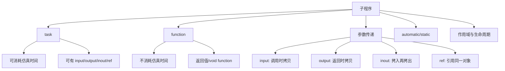
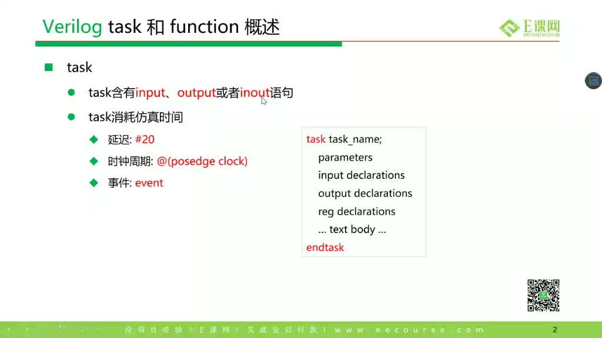
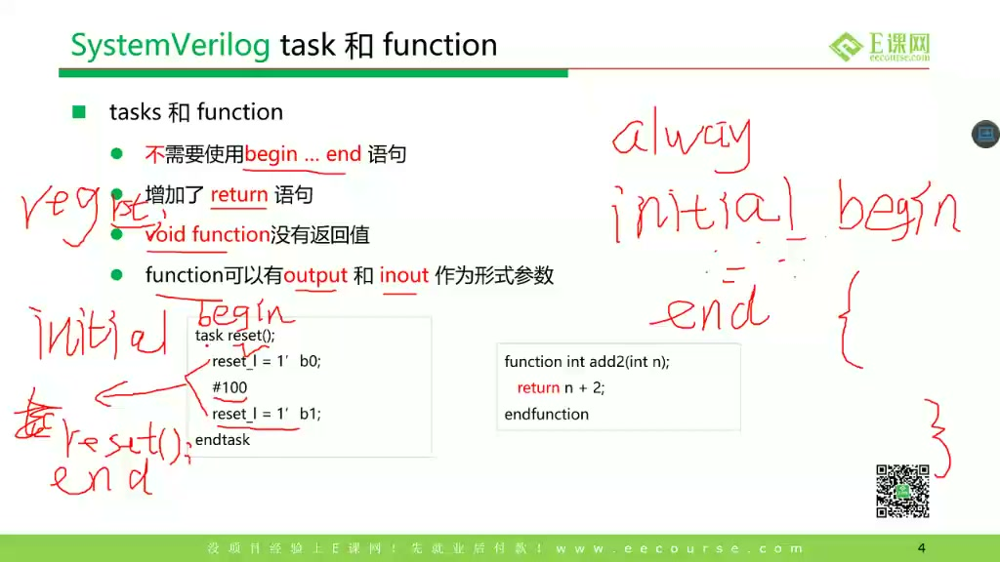
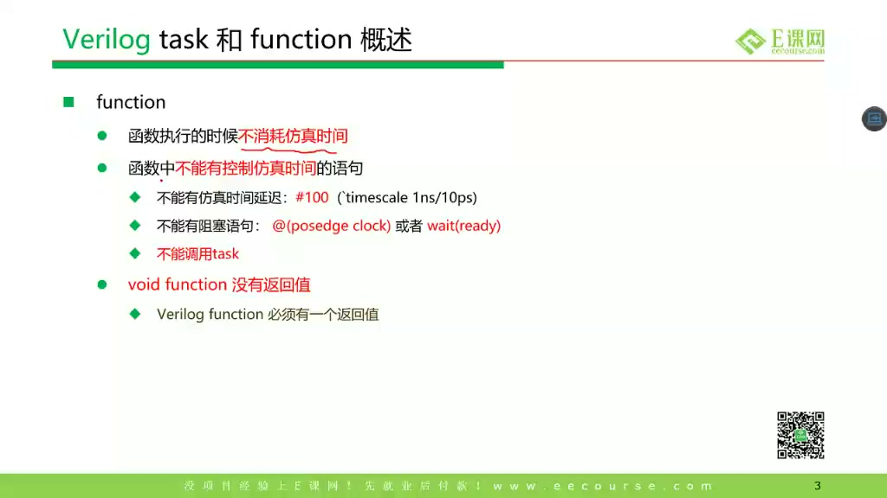
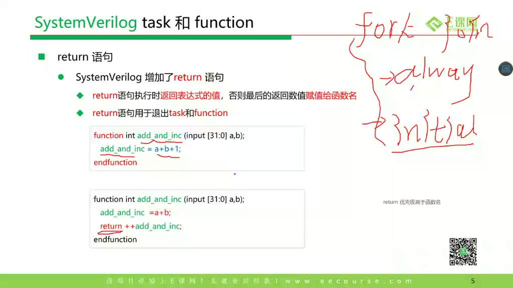
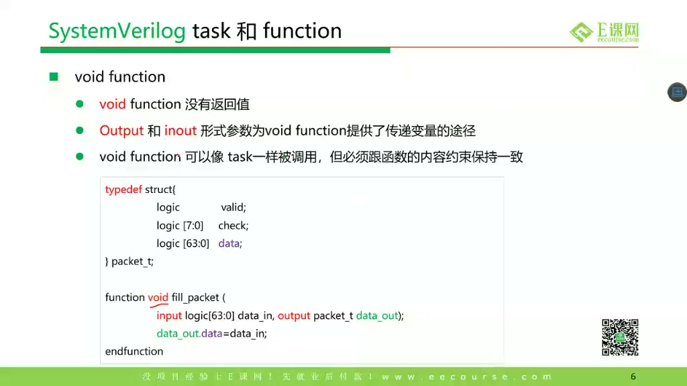
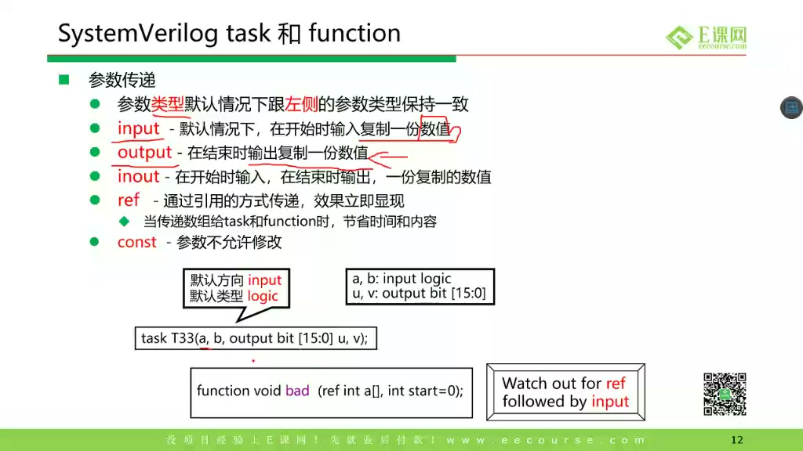
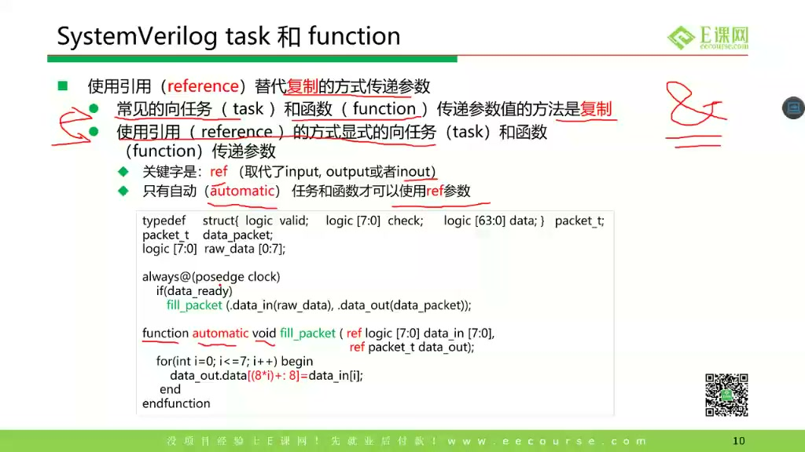
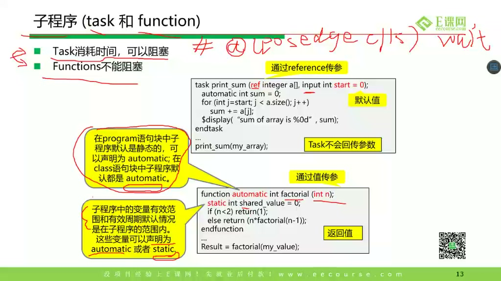
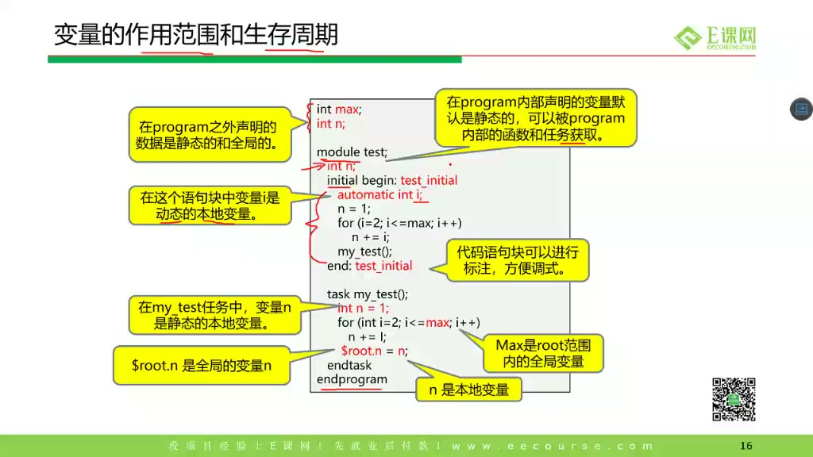

# 任务17：task / function

> 本章目标：理解 SystemVerilog 中 task 和 function 的区别、参数传递方式、`return`、`ref`、`automatic/static`、变量作用域与生命周期。重点是分清 testbench 子程序、RTL 可综合函数、仿真时间控制之间的边界。

## 本章知识全景图



## 1. 先分清：电路设计代码和 testbench 代码不是一回事

课程开头强调：上一节很多 SV 语法主要用于 testbench，不代表都适合写进 RTL。

一个简单判断：

| 代码位置 | 目标 | 典型语法 |
|---|---|---|
| RTL design | 综合成硬件 | `always_ff`、`always_comb`、`assign`、有限的 function |
| testbench | 产生激励、检查结果 | `initial`、`$display`、task、class、queue、delay |

task/function 两者都像“子程序”，但它们的时间语义不同。

## 2. task：可以消耗仿真时间

课程给出 task 的特点：



task 可以：

- 有 `input/output/inout/ref` 参数。
- 包含多条语句。
- 包含延时 `#10`。
- 包含事件控制 `@(posedge clk)`。
- 调用 function。
- 用 `return;` 提前退出，但 task 本身没有函数返回值。

基本模板：



```systemverilog
task send_one_byte(
    input  logic [7:0] data,
    output logic       done
);
    @(posedge clk);
    tx_data <= data;
    tx_valid <= 1'b1;

    @(posedge clk);
    tx_valid <= 1'b0;
    done = 1'b1;
endtask
```

这个 task 消耗了两个时钟边沿，所以它通常用于 testbench 或验证环境。

## 3. function：不消耗仿真时间

课程强调 function 的限制：



function 的核心规则：

- 不能包含 `#delay`。
- 不能包含 `@(event)`、`wait` 等时间控制。
- 不能调用 task。
- 可以调用其他 function。
- 可以有返回值，也可以是 `void function`。

典型 RTL function：

```systemverilog
function automatic logic [31:0] sat_add(
    input logic [31:0] a,
    input logic [31:0] b
);
    logic [32:0] sum;
    sum = {1'b0, a} + {1'b0, b};
    if (sum[32])
        return 32'hFFFF_FFFF;
    else
        return sum[31:0];
endfunction
```

**硬件视角：**可综合 function 更像“组合逻辑模板”。调用一次可能综合出一份组合逻辑；在多个地方调用，综合器可能复制或共享逻辑，取决于上下文和优化。

## 4. `return`：SV function 更接近软件函数，但仍有硬件含义

课程讲 `return`：



Verilog 里常见写法是给函数名赋值：

```systemverilog
function int add(input int a, b);
    add = a + b;
endfunction
```

SystemVerilog 可以写：

```systemverilog
function int add(input int a, b);
    return a + b;
endfunction
```

如果同时出现函数名赋值和 `return expr`，以执行到的 `return` 表达式为准。工程上建议统一风格：优先用 `return`，更清楚。

## 5. `void function`：没有返回值，但仍不能消耗时间

课程讲 `void function`：



`void function` 适合做纯计算、格式化、无时间消耗的辅助操作：

```systemverilog
function void pack_req(
    input  req_t req,
    output logic [63:0] bits
);
    bits = {req.valid, req.opcode, req.addr, req.data};
endfunction
```

注意：`void function` 没有返回值，但它仍然是 function，不能写延时和事件等待。只要需要等时钟、等事件、发 transaction，通常就应该用 task。

## 6. 参数传递：input/output/inout/ref 的本质差别

课程讲参数方向与传递方式：



可以这样记：

| 方向 | 传递时机 | 本质 |
|---|---|---|
| `input` | 调用时拷贝进入 | 子程序内部改它，不影响外部 |
| `output` | 子程序结束时拷贝出去 | 调用结束后更新外部 |
| `inout` | 先拷入，结束再拷出 | 像输入又像输出 |
| `ref` | 不拷贝，引用同一个对象 | 内外看到的是同一份变量 |

例子：

```systemverilog
task t_input(input int x);
    x = x + 1;
endtask

task t_ref(ref int x);
    x = x + 1;
endtask
```

调用后：

```systemverilog
int a = 1;
t_input(a); // a 仍然是 1
t_ref(a);   // a 变成 2
```

## 7. `ref` 和 `automatic`：引用传递要避免共享局部状态

课程展示 `ref` 与 `automatic`：



`ref` 的价值是避免拷贝大对象，并允许子程序直接修改外部对象。例如 packet、数组、scoreboard 数据结构。

```systemverilog
function automatic void swap(ref int a, ref int b);
    int tmp;
    tmp = a;
    a = b;
    b = tmp;
endfunction
```

为什么常配 `automatic`？

- `automatic` 子程序每次调用都有自己的局部变量副本。
- 并发调用时不会共享同一个局部变量。
- `ref` 参数引用外部对象，如果局部变量又是 static，容易出现并发污染。

**深挖：task/function 的并发安全**

testbench 里多个线程可能同时调用同一个 task。如果 task 默认静态，局部变量可能被多次调用共享，导致 A 线程写的临时变量被 B 线程改掉。`automatic` 让每次调用像有独立栈帧，和软件函数更接近。

## 8. static / automatic 与生命周期

课程讲变量作用域和生命周期：



区别：

| 类型 | 生命周期 | 并发调用风险 |
|---|---|---|
| `static` | 整个仿真期间存在 | 多次调用共享同一份 |
| `automatic` | 调用进入时创建，退出时销毁 | 每次调用独立 |

例子：

```systemverilog
task automatic count_auto();
    int i;
    i++;
    $display("auto i=%0d", i);
endtask

task count_static();
    static int i;
    i++;
    $display("static i=%0d", i);
endtask
```

`automatic` 的 `i` 每次调用重新创建；`static` 的 `i` 会记住上次值。

## 9. 作用域：变量在哪里声明，就在哪里可见

课程展示作用域示例：



基本规则：

- 模块级变量：模块内部可见。
- initial/always 块内部变量：只在该块内部可见。
- task/function 内部变量：只在子程序内部可见。
- 同名变量会发生遮蔽，内层优先。

写大型 testbench 时，作用域混乱会造成：

- 同名变量误用。
- 线程之间共享了不该共享的状态。
- ref 参数修改了调用者没预期被改的对象。

建议：

- task/function 参数名明确，不要叫 `data`、`tmp` 到处复用。
- 大数组、大 packet 用 `ref` 时在函数名里体现会修改，例如 `update_scoreboard(ref ...)`。
- testbench helper 默认写 `automatic`。

## 10. task/function 选择表

| 需求 | 用 task 还是 function |
|---|---|
| 等一个时钟边沿 | task |
| 延时 100ns 后检查 | task |
| 计算 CRC / parity | function |
| 打包/解包字段，不消耗时间 | function 或 void function |
| 发一个 AXI transaction | task |
| 修改 scoreboard 中的数组 | automatic task/function + ref |
| 写可综合组合辅助逻辑 | automatic function |

## 11. 深挖：function 在 RTL 里为什么更像“逻辑展开”

在可综合 RTL 中，`function` 通常不是运行时被 CPU 调用的一段程序，而是被综合器展开成组合逻辑。比如一个 parity function：

```systemverilog
function automatic logic parity8(input logic [7:0] data);
    parity8 = ^data;
endfunction
```

综合后它本质上是一棵 XOR 逻辑树。写成 function 的好处是复用和表达清楚，不是让硬件多了一个“函数调用单元”。因此，可综合 function 应该保持无时间控制、无隐藏状态、输入输出关系清楚。

`task` 则常用于 testbench，因为它可以等待时钟、延时、发 transaction、做并发流程控制。RTL 里看到 task 要格外谨慎：如果 task 内有 `#delay`、`@(posedge clk)`、文件 IO、`$display` 等仿真行为，它就不是可综合硬件逻辑。

## 12. 工程检查清单：task/function 使用边界

| 场景 | 推荐写法 | 原因 |
|---|---|---|
| 纯组合计算 | `automatic function` | 可复用，综合后展开成组合逻辑 |
| 等待时钟或延时 | `task`，通常只放 testbench | function 不能消耗仿真时间 |
| 修改大对象或 scoreboard | `ref` + 明确命名 | 避免复制开销，同时暴露副作用 |
| 并发 testbench helper | `automatic task` | 避免多个线程共享同一份局部变量 |
| 可综合 RTL helper | 避免隐藏状态和时间控制 | 让综合结果可预测 |
| 需要返回多个结果 | output 参数或 struct 返回 | 比到处改全局变量更清楚 |

一句话判断：**function 适合“算出一个结果”，task 适合“完成一段过程”；可综合 RTL 里要优先让 function 表达组合逻辑，testbench 里再让 task 表达带时间的动作。**

## 13. 自测题

1. 为什么 function 里不能写 `#10` 或 `@(posedge clk)`？
2. task 能调用 function，function 为什么不能调用 task？
3. `input` 参数和 `ref` 参数的根本差别是什么？
4. 并发 testbench 中为什么建议 helper task 写成 `automatic`？
5. 可综合 RTL 中的 function 最终大多会变成什么硬件？
6. 为什么可综合 function 里不应该隐藏静态状态或时间控制？

## 参考资料

- 本视频与对应字幕。
- Accellera SystemVerilog 语言参考资料中关于 task/function、参数方向、`automatic`、`ref` 的定义：<https://www.accellera.org/images/eda/sv-bc/att-0630/01-SV-BC-8.4-LRM-changes.pdf>
- Accellera SV-BC 关于 `ref`、`const ref`、自动生命周期的讨论资料：<https://www.accellera.org/images/eda/sv-bc/att-0118/01-ref-args.pdf>
