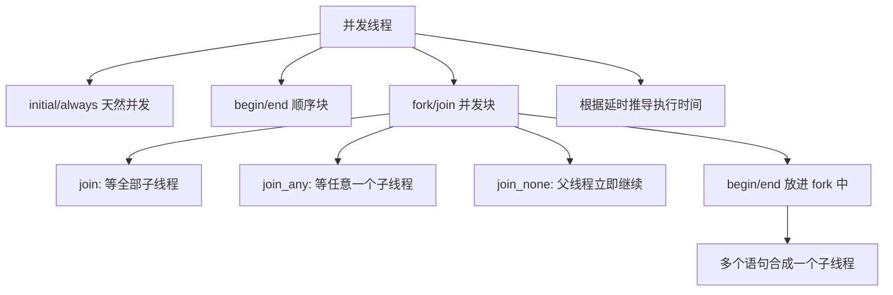
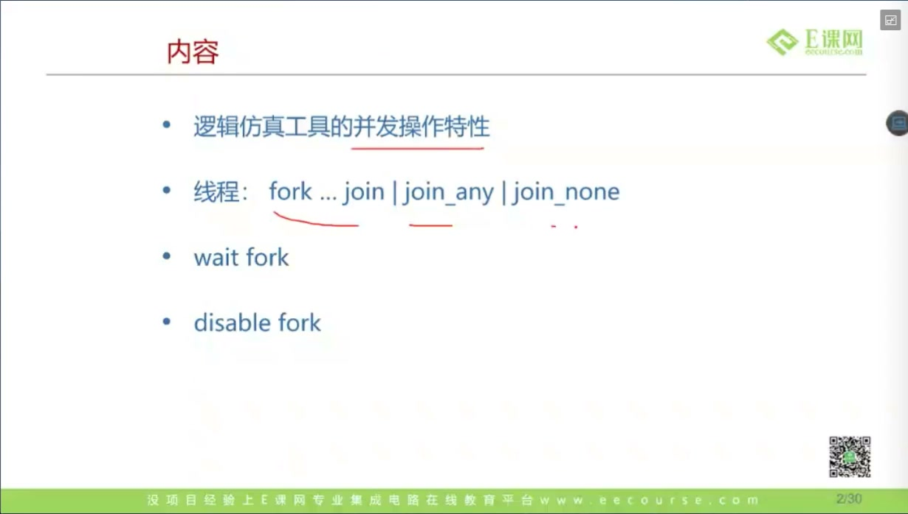
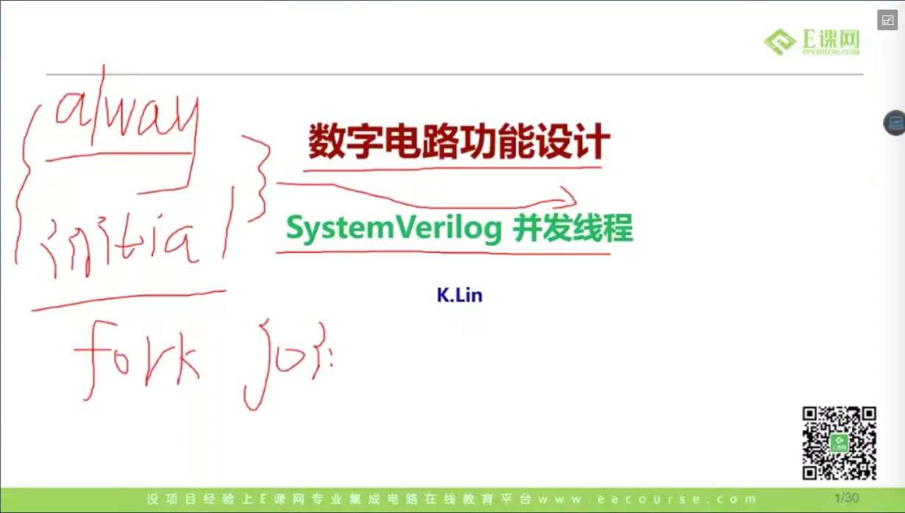
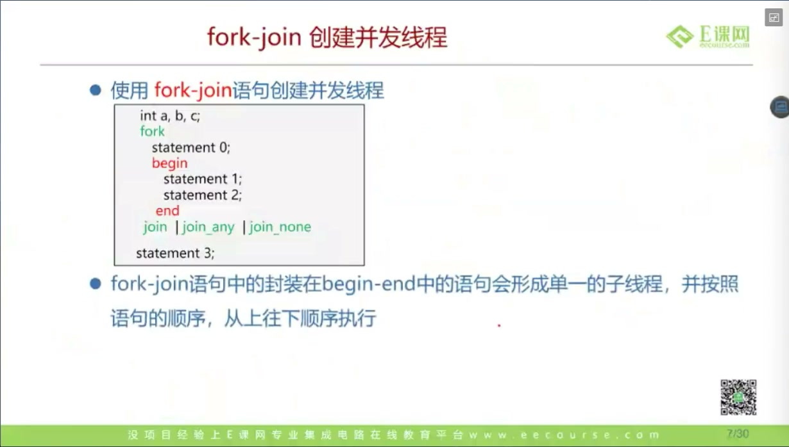
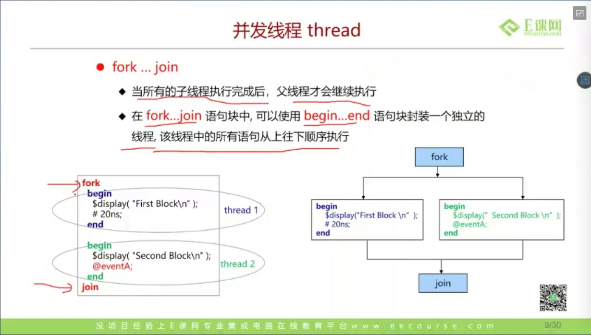
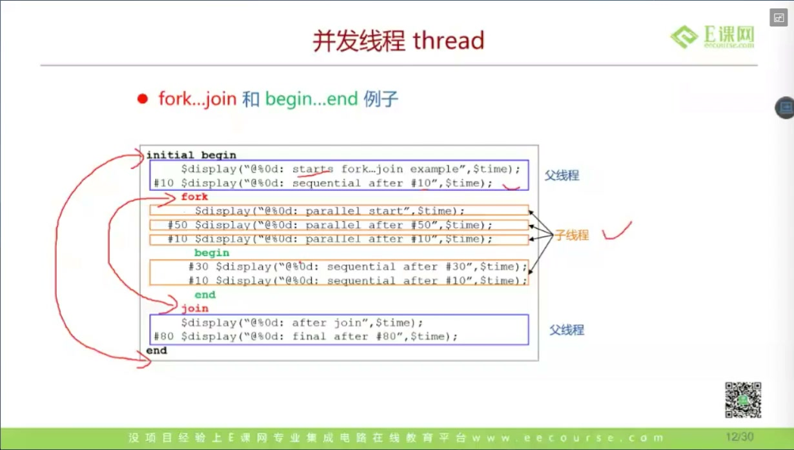
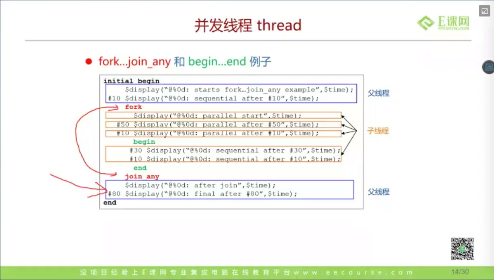
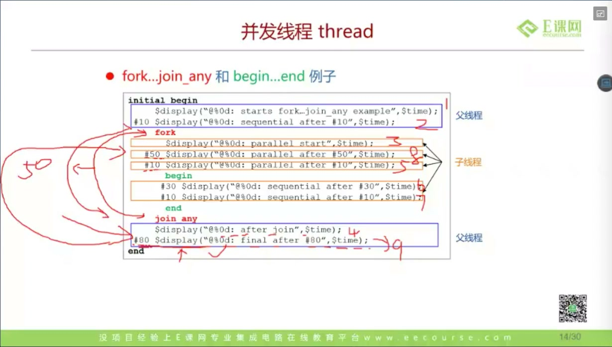
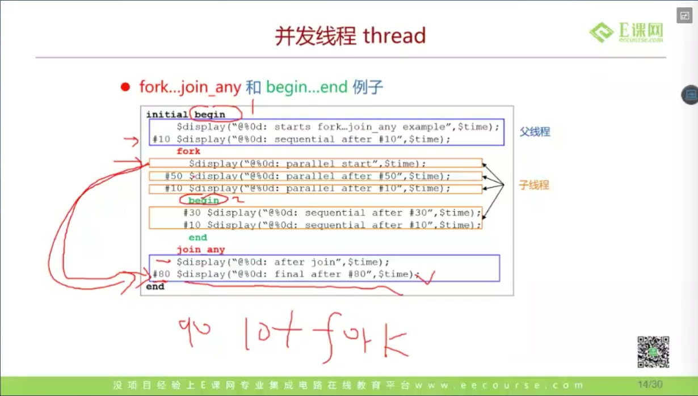

# 任务18：并发线程

> 本章目标：理解 SystemVerilog 中并发线程的执行模型，掌握 `fork...join`、`fork...join_any`、`fork...join_none`、`begin...end` 分组和延时推导。重点是能根据代码推导 `$display` 打印顺序和仿真时间。

## 本章知识全景图



## 1. 先从 initial / always 的并发性开始

课程先强调：多个 `initial` / `always` 块之间本来就是并发执行：



例如：

```systemverilog
initial begin
    #10 $display("A");
end

initial begin
    #5 $display("B");
end
```

这不是先执行第一个 initial 再执行第二个 initial，而是两个过程从仿真 0 时刻并发启动。因此输出顺序是：

```text
5ns:  B
10ns: A
```

**硬件视角：**RTL 中多个 always 块也不是“按源码顺序执行”。它们描述的是并行硬件块。仿真器用事件调度来模拟这种并发。

## 2. begin/end 是顺序块，fork/join 是并发块

课程给出并发线程内容：



对比：

```systemverilog
begin
    stmt1;
    stmt2;
end
```

`begin/end` 内部按顺序执行。

```systemverilog
fork
    stmt1;
    stmt2;
join
```

`fork/join` 内部每条顶层语句会成为并发子线程。

课程图示：



## 3. `fork...join`：等所有子线程结束

`join` 的规则：

```systemverilog
initial begin
    $display("%0t start", $time);

    fork
        #10 $display("%0t A", $time);
        #20 $display("%0t B", $time);
        #30 $display("%0t C", $time);
    join

    $display("%0t after join", $time);
end
```

执行结果：

```text
0  start
10 A
20 B
30 C
30 after join
```

父线程会阻塞在 `join`，直到所有子线程都结束。

## 4. fork 内的 begin/end：把多条语句封装成一个子线程

课程强调：在 fork 内用 `begin/end` 可以让多条语句形成一个独立子线程：



例如：

```systemverilog
fork
    begin
        #10 $display("A1");
        #10 $display("A2");
    end

    begin
        #5  $display("B1");
        #30 $display("B2");
    end
join
```

这里不是 4 个并发线程，而是 2 个并发线程：

- 线程 A：`A1` 后再 `A2`，总时间 20。
- 线程 B：`B1` 后再 `B2`，总时间 35。

所以 `join` 后父线程在 35 时刻继续。

## 5. 时间线推导：不要只看代码上下位置

课程用图推导执行顺序：



推导口诀：

1. 先找父线程当前时间。
2. 遇到 `fork`，为每个顶层语句创建子线程。
3. 子线程内部如果有 `begin/end`，按顺序累计延时。
4. `join` 看最大完成时间。
5. 父线程从那个时间点继续。

例子：

```systemverilog
#10;
fork
    #50 $display("A");
    begin
        #20 $display("B1");
        #30 $display("B2");
    end
join
#80 $display("after");
```

父线程进入 fork 时已经是 10。两个子线程分别在：

- A：10 + 50 = 60
- B2：10 + 20 + 30 = 60

`join` 后父线程在 60 继续，再延时 80，所以 `after` 在 140。

## 6. `fork...join_any`：任意一个子线程结束，父线程继续

课程讲 `join_any`：



规则：

```systemverilog
fork
    #50 task_a();
    #20 task_b();
    #80 task_c();
join_any

$display("after join_any");
```

父线程会在最早完成的子线程结束时继续。上例中父线程在 20 时刻继续。

但要注意：**其他子线程不会自动消失。** 如果没有额外控制，`task_a` 和 `task_c` 仍可能继续运行。下一节的 `disable fork` 就是为了处理这种情况。

## 7. `fork...join_none`：父线程先走，子线程稍后并发

课程讲 `join_none`：



`join_none` 表示父线程不等待子线程结束：

```systemverilog
initial begin
    fork
        #10 $display("A");
        #20 $display("B");
    join_none

    $display("parent continue");
    #100 $display("parent delay done");
end
```

SV 调度里有一个细节：`join_none` 创建的子线程通常要等父线程阻塞或终止后才开始推进。因此你推导时不能只说“所有东西立刻一起跑”，还要看父线程后面是否马上遇到 `#delay`、`wait`、事件控制等阻塞语句。

课程里反复让大家根据这个规则推打印顺序。

## 8. 深挖：为什么 fork/join 是 testbench 的核心能力

真实验证环境常常要同时做几件事：

- 一个线程发输入激励。
- 一个线程监控 DUT 输出。
- 一个线程检查超时。
- 一个线程收集覆盖率。

例如：

```systemverilog
fork
    drive_packets();
    monitor_outputs();
    timeout_watchdog();
join_any
disable fork;
```

这种并发不是硬件综合结构，而是仿真环境的控制能力。它让 testbench 能模拟“外部世界同时发生的事”。

## 9. 延时题的通用解法

课程中有大量“如果把 80 改成 60，顺序会不会变”的讨论：



解法固定：

1. 标出父线程进入 fork 的时间。
2. 每个子线程单独算结束时间。
3. `join` 取最大。
4. `join_any` 取最小，但其他线程还在。
5. `join_none` 父线程不等，但子线程启动受父线程阻塞点影响。
6. 后续 `#delay` 在父线程当前时间基础上继续加。

## 10. 三种 join 对比表

| 结构 | 父线程何时继续 | 子线程是否继续存在 | 常见用途 |
|---|---|---|---|
| `fork...join` | 所有子线程结束 | 不存在未完成子线程 | 等所有任务完成 |
| `fork...join_any` | 任意一个子线程结束 | 其他子线程继续，除非手动 kill | first responder、超时竞争 |
| `fork...join_none` | 立即继续 | 子线程后台继续 | 启动后台监控、异步任务 |

## 11. 工程检查清单：fork 不是“随便开线程”

| 检查点 | 应该怎么判断 | 容易出错的地方 |
|---|---|---|
| 父线程何时继续 | `join` 取最晚子线程，`join_any` 取最早子线程，`join_none` 不等待 | 把 `join_any` 误以为会自动杀掉其它线程 |
| 子线程是否还活着 | `join_any` / `join_none` 后要确认是否需要 `disable fork` | 后台线程继续驱动信号，污染后续测试 |
| fork 内部有几条线程 | 顶层语句才是并发子线程，`begin/end` 会把多条语句打包成一条 | 把 `begin/end` 里的每条语句都当成独立线程 |
| `join_none` 何时启动子线程 | 子线程通常在父线程阻塞或结束后才真正推进 | 只按源码上下顺序推导，忽略调度语义 |
| 是否可综合 | testbench 并发控制用于仿真，不等于综合硬件结构 | 把验证里的 fork 当成 RTL 并行电路 |

这张表的核心是：`fork` 描述的是仿真进程的并发关系，不是“把软件函数开到另一个 CPU 核上”。在验证环境里它很有用，因为激励、监控、超时和覆盖率本来就应该同时发生；在 RTL 可综合代码里则要回到寄存器、组合逻辑和时钟边沿这些硬件结构。

## 12. 深挖：SystemVerilog 并发为什么更像事件调度，而不是普通软件多线程

SV 仿真器里的并发本质是事件驱动：每条进程在某个仿真时间点运行，遇到 `#delay`、事件等待、时钟边沿等待等语句就挂起，调度器再把时间推进到下一个事件。它看起来像“多个线程同时跑”，但它服务的是硬件时间模型，而不是操作系统线程模型。

用这个视角看三种 `join` 会更稳：

- `join`：父进程必须等所有子进程都到达结束事件。
- `join_any`：父进程只等第一个子进程结束，但其它子进程的事件还在调度队列里。
- `join_none`：父进程先离开 fork 区域，子进程作为后台进程留在事件系统中等待启动/推进。

因此，验证代码里常见的模式是：

```systemverilog
fork
    drive_packets();
    monitor_outputs();
    timeout_watchdog();
join_any
disable fork;
```

它的工程含义是“谁先给出终止条件，父流程就继续；随后把剩余并发任务清掉”。如果少了 `disable fork`，超时线程、监控线程或激励线程可能继续驱动信号，导致下一个 case 莫名失败。这类 bug 很像 RTL 里的“旧状态没清干净”，但根因其实是 testbench 进程生命周期没有管理好。

## 13. 自测题

1. `begin/end` 和 `fork/join` 的本质区别是什么？
2. fork 内部两个 `begin/end` 块各有两条语句，一共会创建几个子线程？
3. `join_any` 后，未完成的子线程会自动停止吗？
4. `join_none` 后父线程马上执行一串无延时语句，子线程何时开始推进？
5. 给定三个子线程延时 10、30、50，`join` 和 `join_any` 后父线程分别在什么时间继续？
6. 为什么 `join_any` 后通常要考虑 `disable fork`？如果不加，可能在 testbench 里造成什么问题？

## 参考资料

- 本视频与对应字幕。
- Accellera SV-EC 关于 fork/join_none 自动启动语义和进程模型的讨论资料：<https://www.accellera.org/images/eda/sv-ec/att-3008/01-auto-fork-join.pdf>
- Accellera SystemVerilog 语言参考资料中的过程控制与并发语句说明：<https://www.accellera.org/images/eda/sv-bc/att-0630/01-SV-BC-8.4-LRM-changes.pdf>
