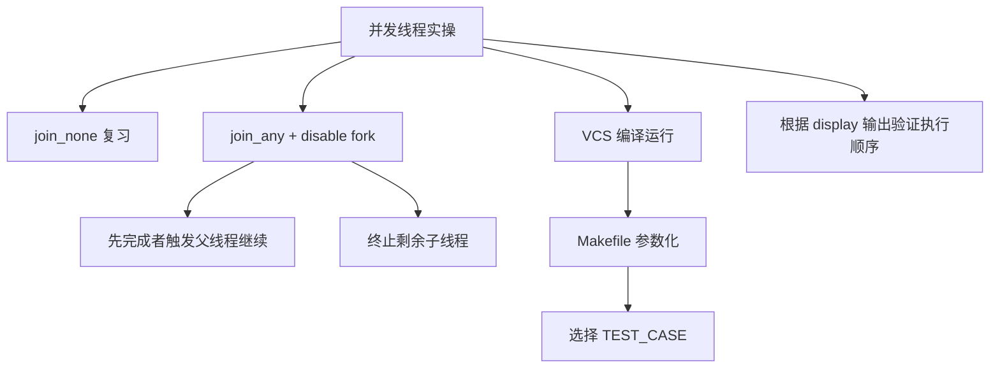
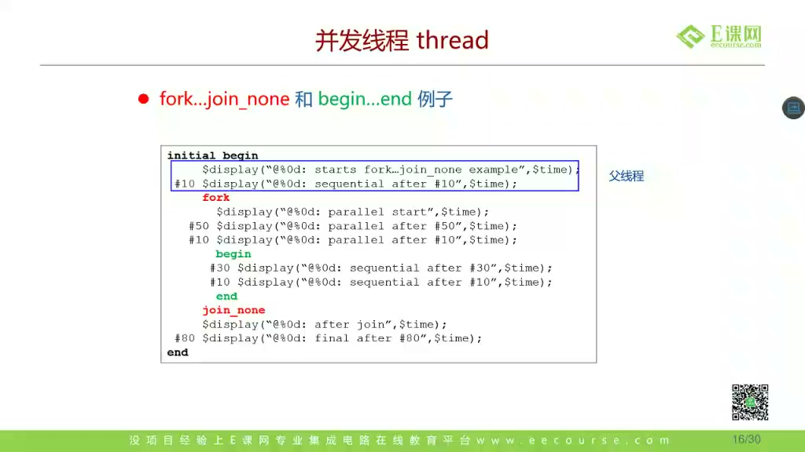
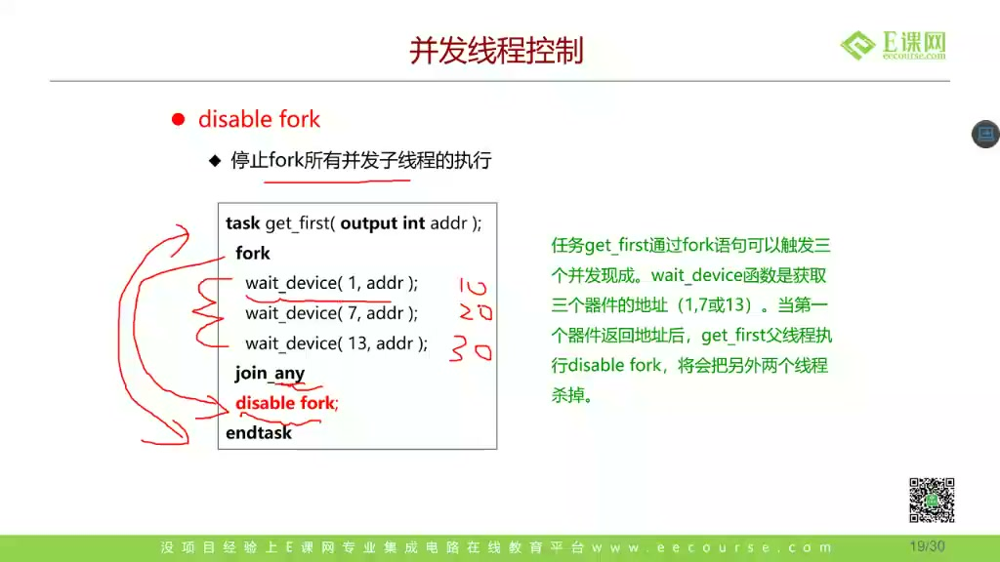
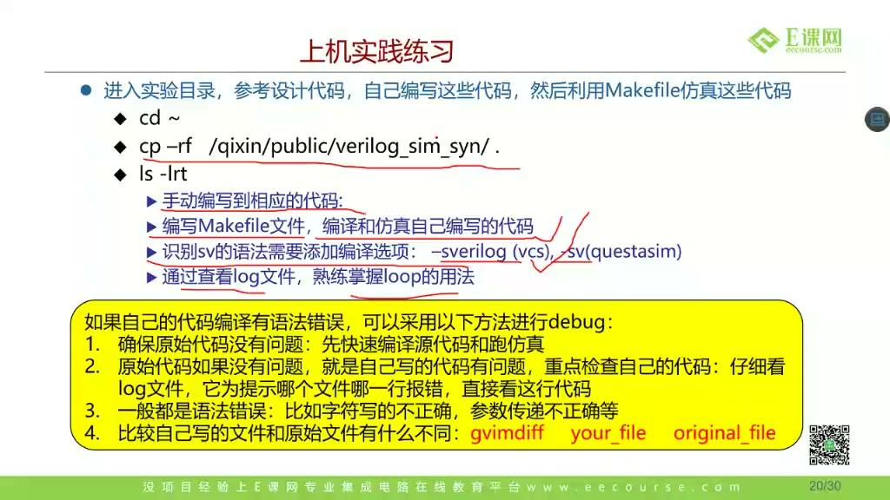
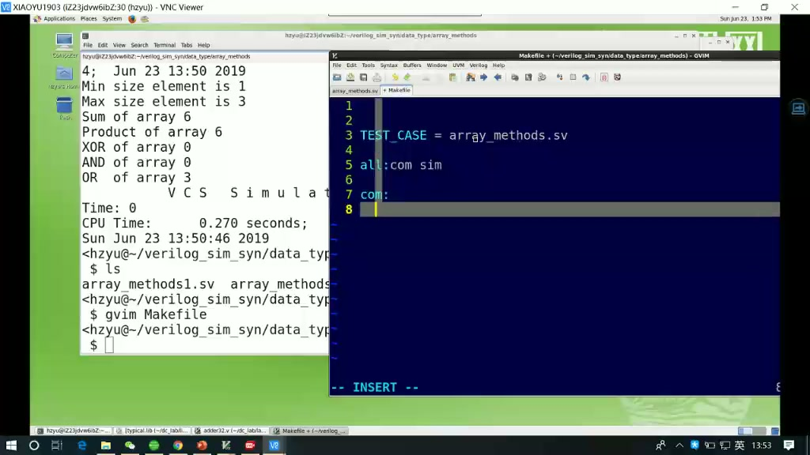
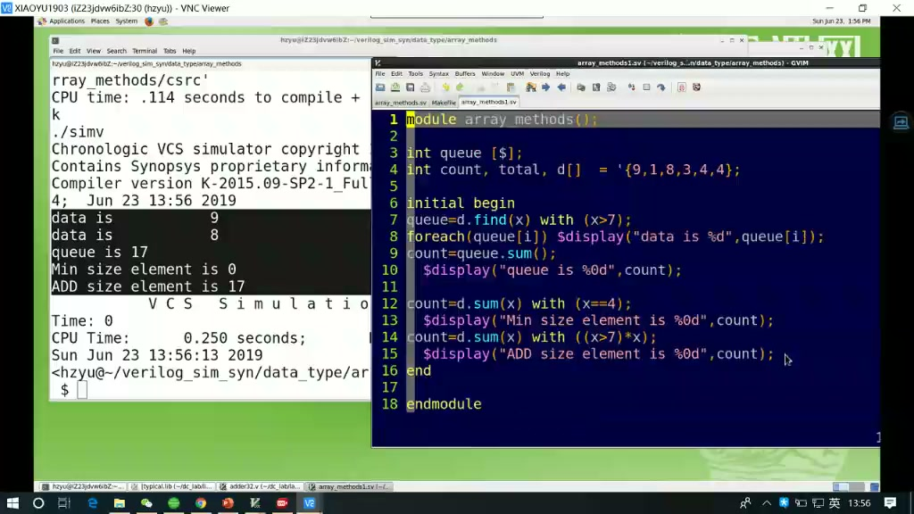
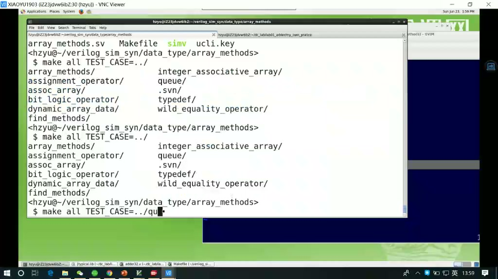
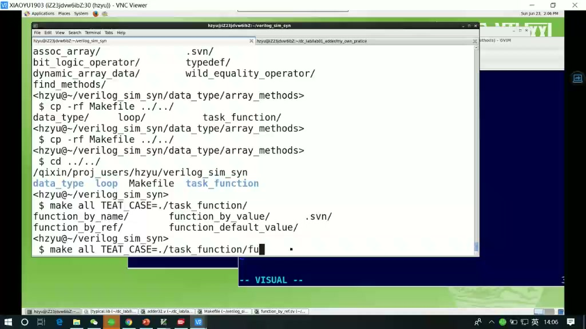
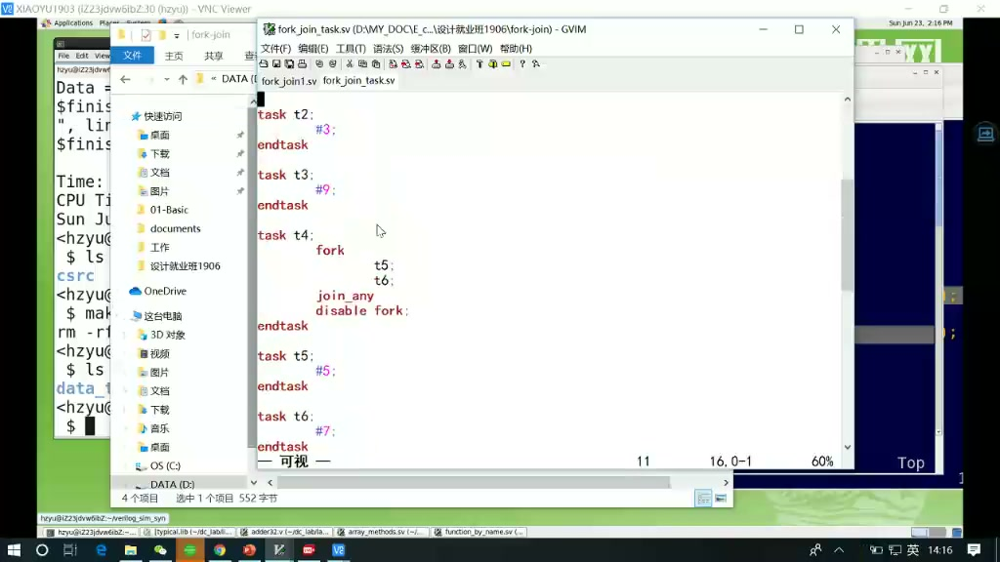
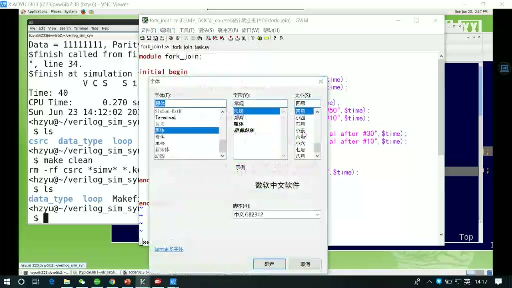

# 任务19：并发线程与 SV 实操

> 本章目标：在上一节 `fork/join` 的基础上，掌握 `disable fork` 的用途，并通过 VCS + Makefile 实操运行 SystemVerilog 示例。重点是能解释打印结果背后的线程执行顺序，而不是只把代码跑通。

## 本章知识全景图



## 1. 先复习 join_none：父线程不等待

课程开头继续讨论 `fork...join_none` 的例子：



核心判断：

- `join_none` 后父线程继续执行。
- 子线程不会因为父线程继续而自动结束。
- 子线程什么时候真正推进，要结合父线程是否遇到阻塞语句看。

这类题不要凭“代码在上面/下面”猜顺序，要画时间线。

## 2. `disable fork`：把还没结束的子线程停掉

课程讲 `disable fork`：



经典模式：

```systemverilog
fork
    begin
        wait_device_1();
        addr = 1;
    end
    begin
        wait_device_2();
        addr = 2;
    end
    begin
        wait_device_3();
        addr = 3;
    end
join_any

disable fork;
```

含义：

1. 三个子线程并发等待。
2. 任意一个先完成，`join_any` 让父线程继续。
3. 父线程执行 `disable fork`，停止剩余还没完成的子线程。

这常用于：

- 多个设备谁先响应就用谁。
- transaction 与 timeout 竞争。
- 多个监控线程中任一线程发现错误就结束本轮测试。

## 3. 深挖：为什么 `join_any` 后通常要配 `disable fork`

如果只写：

```systemverilog
fork
    long_task_a();
    short_task_b();
    long_task_c();
join_any

$display("one task done");
```

父线程确实会在 `short_task_b` 完成后继续，但 `long_task_a/c` 还在跑。后果可能是：

- 后台线程继续改变量，污染下一轮测试。
- monitor 继续打印旧 transaction。
- timeout 线程晚些时候触发，误报错误。

所以验证里常见写法是：

```systemverilog
fork
    run_transaction();
    timeout_watchdog();
join_any
disable fork;
```

**工程提醒：**`disable fork` 的作用范围要小心。复杂 testbench 中最好把竞争逻辑封装在一个 task 或命名 fork 块里，避免误杀同一父线程下不相关的后台线程。

## 4. 进入 VCS 实操：先看目录和 Makefile

课程切到 SV 实操目录和 VCS：



典型流程：

```bash
cd verilog_sim_syn/data_type
ls
vi Makefile
make
```

这里不是为了学习 Makefile 语法本身，而是为了把“编译哪个 SV 文件、运行哪个测试”参数化。

## 5. Makefile 变量：用 TEST_CASE 选择要跑的文件

课程展示 Makefile 变量：



一个简化写法：

```makefile
TEST_CASE ?= array_methods.sv
SIM      ?= simv

all:
	vcs -sverilog $(TEST_CASE) -o $(SIM)
	./$(SIM)

clean:
	rm -rf $(SIM) csrc simv.daidir ucli.key
```

运行时可以覆盖变量：

```bash
make TEST_CASE=task_function.sv
make TEST_CASE=fork_join.sv
```

课程里的重点是：你不需要每次手敲一大串 VCS 命令，只要把文件名作为变量传进去。

## 6. 编译运行：看 `$display`，不是只看“没报错”

课程运行示例：





对于并发线程练习，`$display` 输出就是验证你理解的证据。看输出时要问：

- 每一行是什么线程打印的？
- 打印时间 `$time` 是多少？
- 为什么这个线程先打印？
- `join/join_any/join_none/disable fork` 改变了哪一步？

不要只看 VCS 编译通过。编译通过只说明语法没错；打印顺序能说明你是否理解仿真调度。

## 7. Makefile 目标和文件名要对应

课程强调 Makefile 文件名、变量名和命令要对上：



常见错误：

- `TEST_CASE` 指向不存在的 `.sv` 文件。
- Makefile 中变量名写成 `TESTCASE`，命令里却用 `$(TEST_CASE)`。
- 源文件依赖多个 package/interface，却只编译一个文件。
- 改了 SV 文件但没有 clean，旧仿真产物干扰判断。

建议每个练习都保留一组最小命令：

```bash
make clean
make TEST_CASE=fork_join_any.sv
```

这样复现成本最低。

## 8. 根据文件选择练习点

课程展示不同 test case：



建议按这个顺序练：

1. `task_function.sv`：看 task/function 调用和参数。
2. `fork_join.sv`：看 `join` 等所有子线程。
3. `fork_join_any.sv`：看最先结束的子线程让父线程继续。
4. `fork_join_none.sv`：看父线程和后台子线程。
5. `disable_fork.sv`：看剩余线程是否被停止。

每跑一个文件，都把预期输出时间先写在纸上，再运行对比。

## 9. 上机练习：自己写代码，再用 Makefile 跑

课程最后布置练习：



练习目标不是“照着敲完”。更好的练法是：

1. 先手写一段 `fork...join_any` 代码。
2. 写出你预测的 `$display` 顺序和时间。
3. 用 Makefile 跑。
4. 如果不一致，回到代码找是哪个线程延时算错。
5. 再加入 `disable fork`，观察未完成线程是否消失。

## 10. 一个推荐练习模板

```systemverilog
module tb;
    initial begin
        $display("%0t start", $time);

        fork
            begin
                #20;
                $display("%0t task A done", $time);
            end

            begin
                #50;
                $display("%0t task B done", $time);
            end

            begin
                #100;
                $display("%0t timeout", $time);
            end
        join_any

        $display("%0t first branch finished", $time);
        disable fork;

        #200;
        $display("%0t end", $time);
    end
endmodule
```

预测：

```text
0   start
20  task A done
20  first branch finished
220 end
```

不会看到 `task B done` 和 `timeout`，因为它们被 `disable fork` 停掉。

## 11. 深挖：`disable fork` 的危险在于作用范围

`disable fork` 的含义不是“停止刚才最慢的那一个线程”，而是停止当前进程所创建的仍在运行的 fork 子进程。简单练习里这很直观；复杂 testbench 里，如果一个父流程下面同时启动了 driver、monitor、scoreboard、timeout，多写一个 `disable fork` 可能把不该停的后台监控也停掉。

更稳的做法是把需要控制生命周期的并发块包成清晰边界，例如使用命名块或让超时竞争只包住局部任务：

```systemverilog
fork : one_transaction
    begin
        drive_one_packet();
    end
    begin
        #1000;
        $error("transaction timeout");
    end
join_any
disable one_transaction;
```

这段代码表达的是“这一次 transaction 的并发竞争结束了”，而不是把整个 testbench 里所有后台线程都粗暴清掉。工程上要养成一个习惯：每个 fork 都要知道谁负责结束它、结束时会杀掉哪些子线程、杀掉后会不会影响下一条测试。

## 12. 实操排错清单

| 现象 | 可能原因 |
|---|---|
| VCS 提示找不到文件 | `TEST_CASE` 路径或文件名错误 |
| 输出顺序和预期不同 | `join_any/join_none` 规则理解错 |
| timeout 后还继续打印 | `join_any` 后没有 `disable fork` |
| 改代码后结果没变 | 没 clean，或跑的不是这个 test case |
| 某些线程没执行 | 父线程太早结束，或被 `disable fork` 停止 |

## 13. 自测题

1. `join_any` 后未完成的线程会发生什么？
2. 为什么常把 `join_any` 和 `disable fork` 配套使用？
3. `disable fork` 在复杂 testbench 中可能有什么误伤风险？
4. Makefile 中 `TEST_CASE ?= xxx.sv` 和命令行 `make TEST_CASE=yyy.sv` 的关系是什么？
5. 为什么并发线程练习必须看 `$display` 的时间，而不是只看编译是否通过？
6. 为什么给 fork 并发块加命名边界，能降低 `disable fork` 的误伤风险？

## 参考资料

- 本视频与对应字幕。
- Accellera SV-EC 关于 fork/join_none、进程创建和调度的讨论资料：<https://www.accellera.org/images/eda/sv-ec/att-3008/01-auto-fork-join.pdf>
- Accellera SV-EC 关于 `disable fork` 语义和使用风险的讨论资料：<https://www.accellera.org/images/eda/sv-ec/att-2264/disable_fork_plus_loop.doc>
