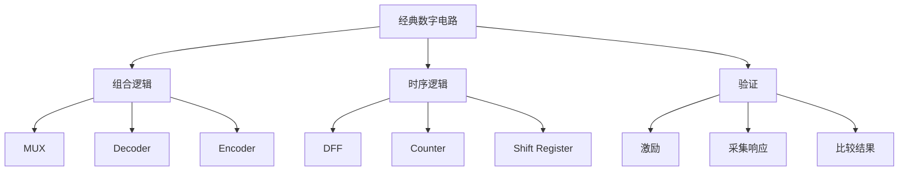
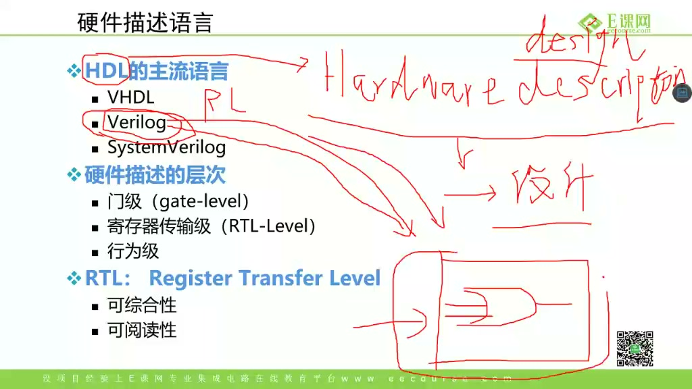
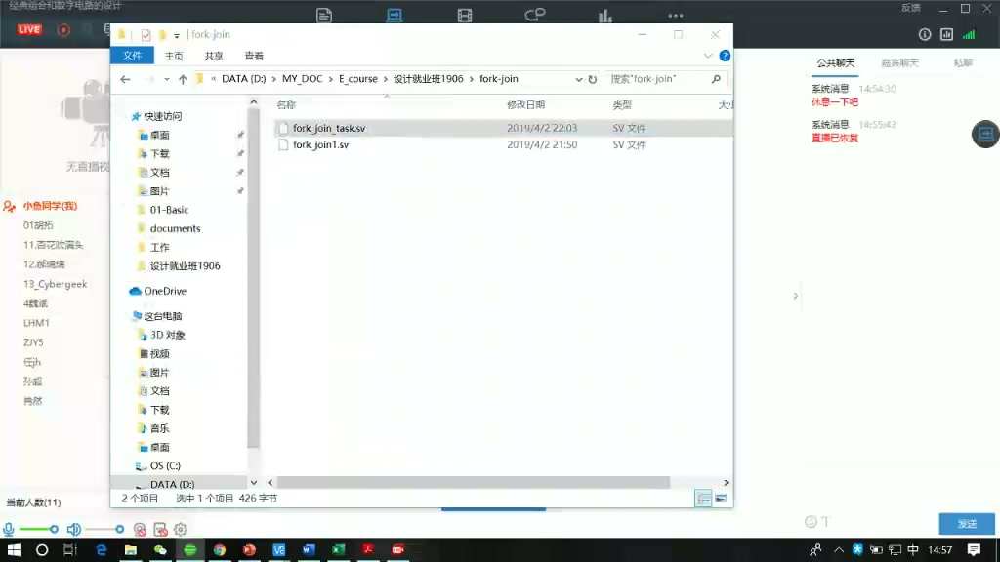
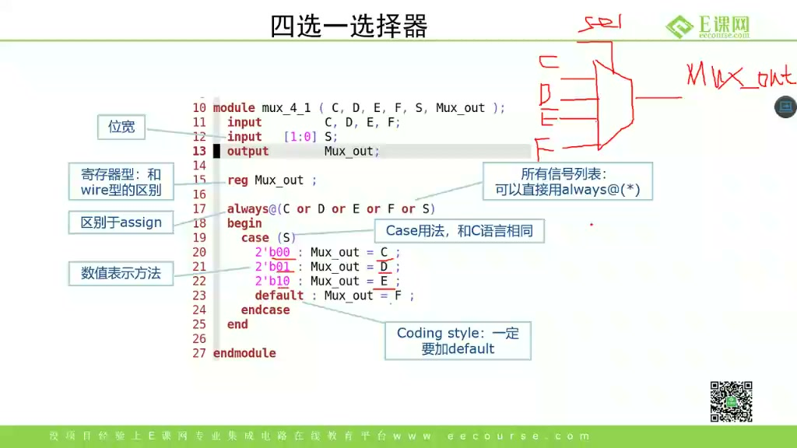
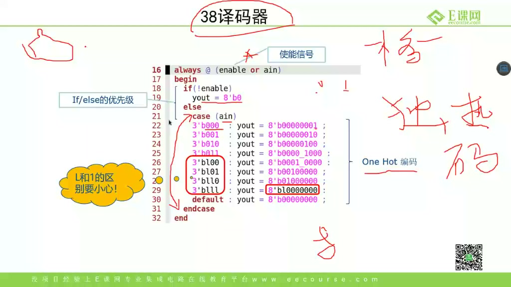
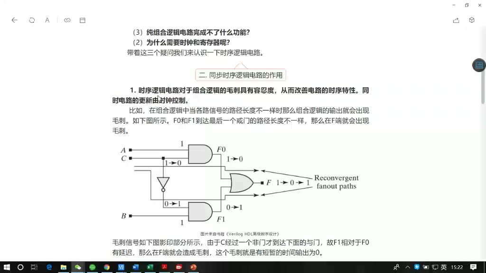
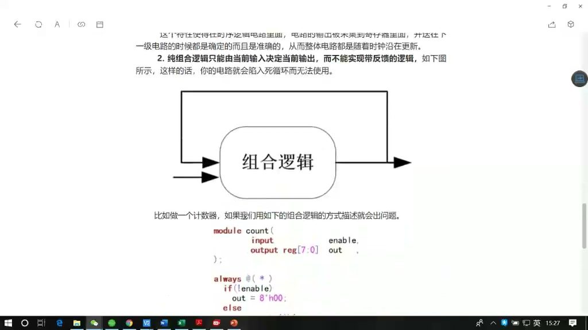
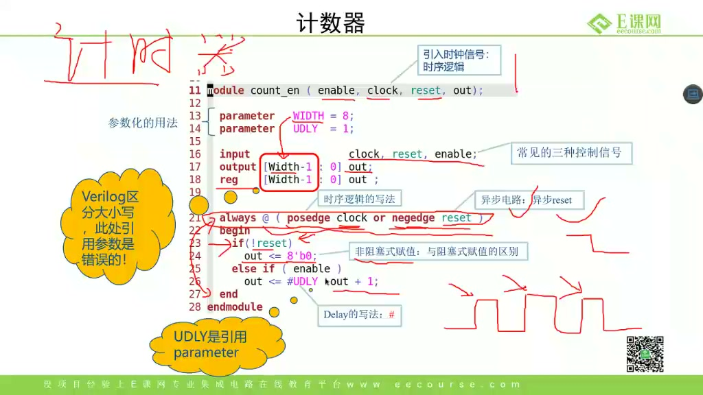
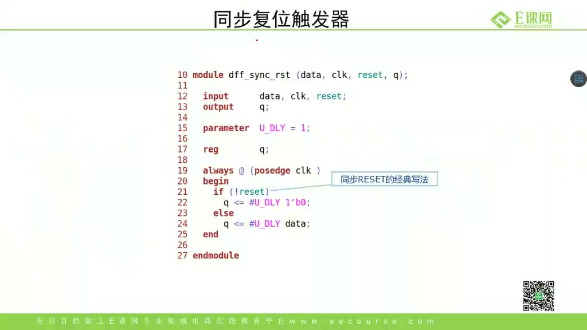
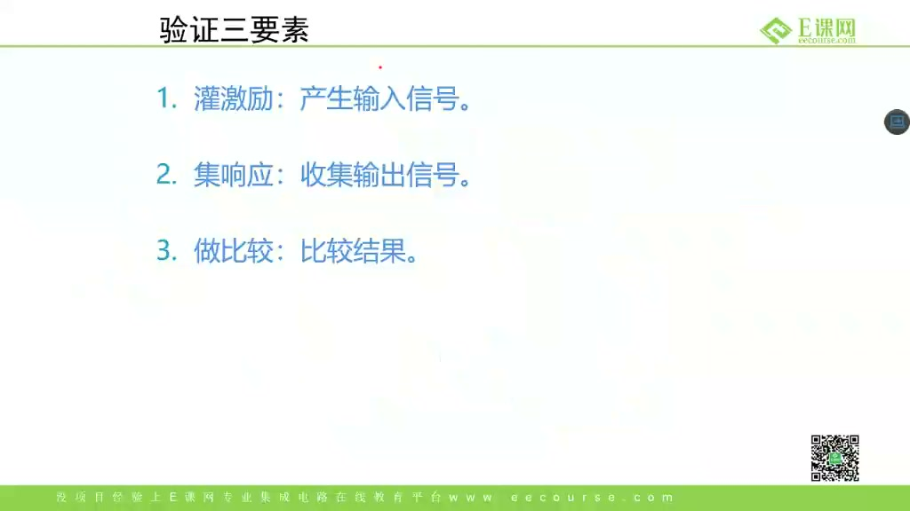

# 任务20：经典组合和数字电路的设计

> 本章目标：把前面学过的 Verilog/SystemVerilog 语法落到常见电路：多路选择器、译码器、编码器、触发器、计数器、移位寄存器和 testbench。重点是建立“代码写法 -> 硬件结构 -> 验证方法”的对应关系。

## 本章知识全景图



## 1. HDL 不是软件语言，而是硬件结构描述

课程先回到硬件描述语言：



Verilog/SystemVerilog 的核心不是“让仿真器执行一段程序”，而是描述硬件：

- 组合逻辑：输入变化后，经过门级延迟，输出随之变化。
- 时序逻辑：时钟边沿到来时，寄存器采样输入并更新输出。
- testbench：只用于仿真，不综合成硬件。

这也是为什么同一个 `for` 循环，在 RTL 里可能展开成一堆并行硬件，在 testbench 里却像软件循环。

## 2. `timescale`：影响仿真时间，不改变硬件

课程开头提到编译时可定义时间精度：



典型写法：

```systemverilog
`timescale 1ns/1ps
```

它表示：

- 时间单位是 1ns。
- 时间精度是 1ps。

例如 `#5` 表示 5ns。注意：`timescale` 只影响仿真中的延时解释，不会综合出“5ns 的硬件等待”。RTL 里如果要真实等待多个周期，应使用计数器和状态机。

## 3. 组合逻辑：输出只由当前输入决定

组合逻辑的基本写法：

```systemverilog
always_comb begin
    y = '0;
    case (sel)
        2'b00: y = a;
        2'b01: y = b;
        2'b10: y = c;
        2'b11: y = d;
    endcase
end
```

关键规则：

1. 所有路径都要给输出赋值。
2. 不要在组合逻辑里漏掉 `default` 或默认赋值。
3. 不要产生组合反馈，除非你真的在设计特殊电路。

## 4. 四选一 MUX：case 写法映射成多路选择器

课程讲四选一选择器：



典型代码：

```systemverilog
module mux4_1 (
    input  logic [7:0] a, b, c, d,
    input  logic [1:0] sel,
    output logic [7:0] y
);
    always_comb begin
        unique case (sel)
            2'b00: y = a;
            2'b01: y = b;
            2'b10: y = c;
            2'b11: y = d;
            default: y = '0;
        endcase
    end
endmodule
```

硬件上它就是一组选择网络。`case` 不是“软件跳转”，综合后会变成 mux 或等价门级结构。

## 5. 译码器：从编码输入生成 one-hot 输出

课程讲译码器：



3-8 译码器：

```systemverilog
module decoder3_8 (
    input  logic [2:0] in,
    input  logic       en,
    output logic [7:0] out
);
    always_comb begin
        out = 8'b0;
        if (en)
            out[in] = 1'b1;
    end
endmodule
```

这个写法比列出 8 个 case 更简洁。硬件含义是：`en` 有效时，只把一个输出位置拉高。

## 6. 编码器：从 one-hot 输入恢复编码

课程讲编码器：



编码器要先明确输入是否保证 one-hot。如果保证，可以写：

```systemverilog
always_comb begin
    y = '0;
    unique case (in)
        8'b0000_0001: y = 3'd0;
        8'b0000_0010: y = 3'd1;
        8'b0000_0100: y = 3'd2;
        8'b0000_1000: y = 3'd3;
        8'b0001_0000: y = 3'd4;
        8'b0010_0000: y = 3'd5;
        8'b0100_0000: y = 3'd6;
        8'b1000_0000: y = 3'd7;
        default:      y = '0;
    endcase
end
```

如果输入可能多个 bit 同时为 1，就要设计优先编码器，不能假装它是普通编码器。

## 7. DFF：时序逻辑的最小单位

课程讲同步复位触发器：



典型写法：

```systemverilog
always_ff @(posedge clk) begin
    if (rst)
        q <= '0;
    else
        q <= d;
end
```

硬件上这是 D 触发器。`<=` 非阻塞赋值用于时序逻辑，表达“所有寄存器在同一个时钟边沿同时更新”。

**深挖：为什么时序逻辑要用非阻塞赋值？**

如果两个寄存器级联：

```systemverilog
always_ff @(posedge clk) begin
    q1 <= d;
    q2 <= q1;
end
```

硬件里 `q2` 应采样旧的 `q1`，不是本周期刚更新后的 `q1`。非阻塞赋值把右值采样和左值更新分到不同仿真阶段，更贴近触发器并行更新。

## 8. 计数器：寄存器 + 加法器 + 反馈

课程讲计数器：



典型写法：

```systemverilog
always_ff @(posedge clk or negedge rst_n) begin
    if (!rst_n)
        cnt <= '0;
    else if (en)
        cnt <= cnt + 1'b1;
end
```

硬件结构：

```text
cnt 寄存器输出 -> 加法器 +1 -> mux(en) -> cnt 寄存器输入
```

计数器常用于：

- 延时 N 个周期。
- 地址递增。
- 状态机超时。
- FIFO occupancy 计数。

## 9. 移位寄存器：寄存器链

课程讲移位寄存器：



典型写法：

```systemverilog
always_ff @(posedge clk or negedge rst_n) begin
    if (!rst_n)
        shreg <= '0;
    else if (en)
        shreg <= {shreg[6:0], din};
end
```

硬件上它是若干触发器串联。常用于：

- 串并转换。
- 延迟线。
- 简单同步器。
- 序列检测前的数据窗口。

## 10. testbench 三要素：激励、响应、比较

课程最后讲验证三要素：



一个 testbench 至少要包含：

1. 激励：产生输入信号。
2. 响应采集：观察 DUT 输出。
3. 比较：判断输出是否符合预期。

只看波形不是完整验证。更好的做法是加自检：

```systemverilog
if (dut_y !== expected_y) begin
    $error("Mismatch: y=%0h expected=%0h", dut_y, expected_y);
end
```

## 11. 工程检查清单：从代码确认硬件结构

| 代码特征 | 对应硬件 | 交付前检查 |
|---|---|---|
| `always_comb` + 完整赋值 | 组合门级网络 / MUX / decoder | 每条路径都赋值，避免 latch |
| `case(sel)` 选择一路数据 | 多路选择器 | `sel` 宽度、默认分支、非法值处理是否清楚 |
| `out[in] = 1'b1` | decoder / one-hot 生成 | `in` 是否越界，`en` 无效时是否全 0 |
| `always_ff @(posedge clk)` | D 触发器 | 复位、使能和非阻塞赋值是否一致 |
| `cnt <= cnt + 1` | 寄存器 + 加法器 + 反馈 | 位宽溢出、清零、使能边界是否验证 |
| `{shreg[6:0], din}` | 寄存器链 | 移位方向和串并转换时序是否匹配需求 |
| testbench 只打波形 | 观察手段 | 必须增加自检比较，否则不能算完整验证 |

这张表的用途是把“语法写对”推进到“硬件想对”。同一段 RTL 交给综合器后，最终会变成寄存器、门、MUX、加法器和互连；写代码时就应该能提前说出它大概会变成什么。

## 12. 深挖：组合逻辑和时序逻辑的分界，本质是“有没有状态”

组合逻辑没有记忆，输出只由当前输入决定。MUX、decoder、encoder 都属于这一类：输入一变，经过传播延迟后输出也跟着变。它们像一张固定的逻辑网，网里没有能保存历史的节点。

时序逻辑有状态，关键元件是触发器。DFF 在时钟边沿采样 `d`，并把采样值保存到 `q`；计数器之所以能“记住加到多少”，是因为 `cnt` 寄存器把上一个周期的结果留了下来，再通过加法器反馈到下一个周期。移位寄存器也是同理，只是反馈路径变成了“上一拍各 bit 向旁边移动一格”。

这也是为什么 RTL 里常用两套写法：

```systemverilog
always_comb begin
    y = a & b;
end

always_ff @(posedge clk) begin
    q <= d;
end
```

第一段描述“此刻输入如何组合成输出”，第二段描述“下一个时钟边沿保存什么”。如果把二者混在一起，仿真可能还能给出某个结果，但综合出来的硬件结构会变得难以预测，最常见后果就是 latch、组合环路或时序路径过长。

## 13. 自测题

1. `timescale` 会不会改变综合出的硬件？
2. MUX 的 `case` 语句综合后大致是什么硬件？
3. 编码器和优先编码器有什么区别？
4. 为什么计数器本质是“寄存器 + 加法器 + 反馈”？
5. testbench 只产生激励、不比较结果，为什么不够？
6. 判断一段 RTL 是组合逻辑还是时序逻辑，最关键的问题是什么？

## 参考资料

- 本视频与对应字幕。
- Clifford E. Cummings 关于非阻塞赋值和仿真/综合一致性的经典论文：<https://csg.csail.mit.edu/6.375/6_375_2009_www/papers/cummings-nonblocking-snug99.pdf>
