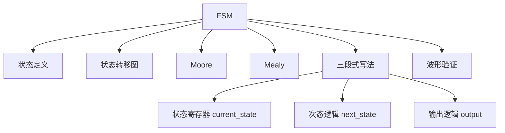
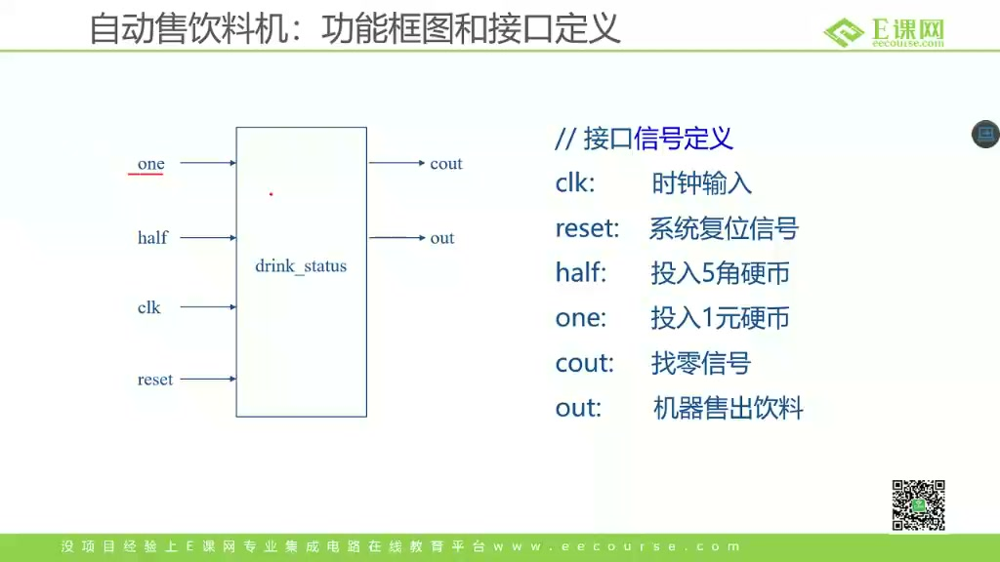
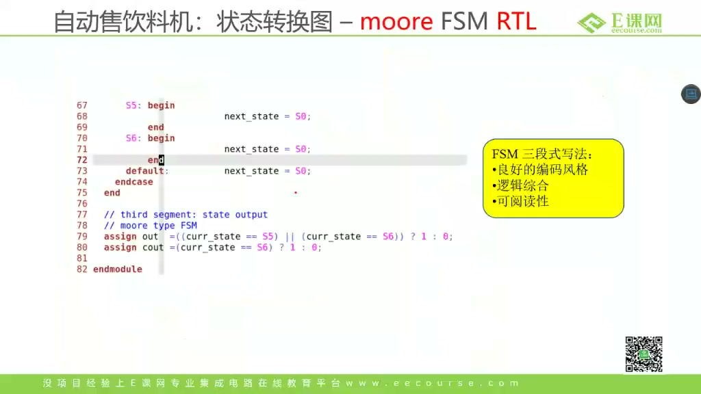
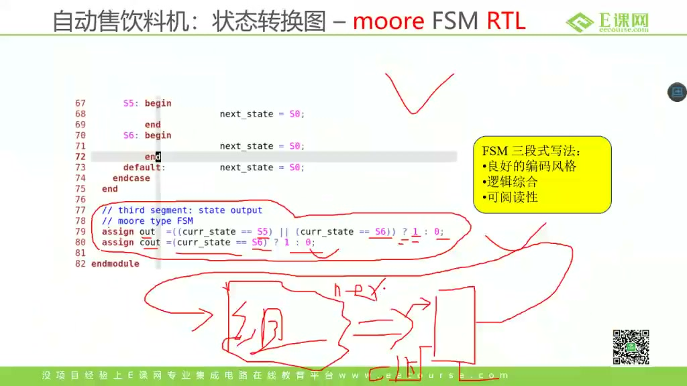
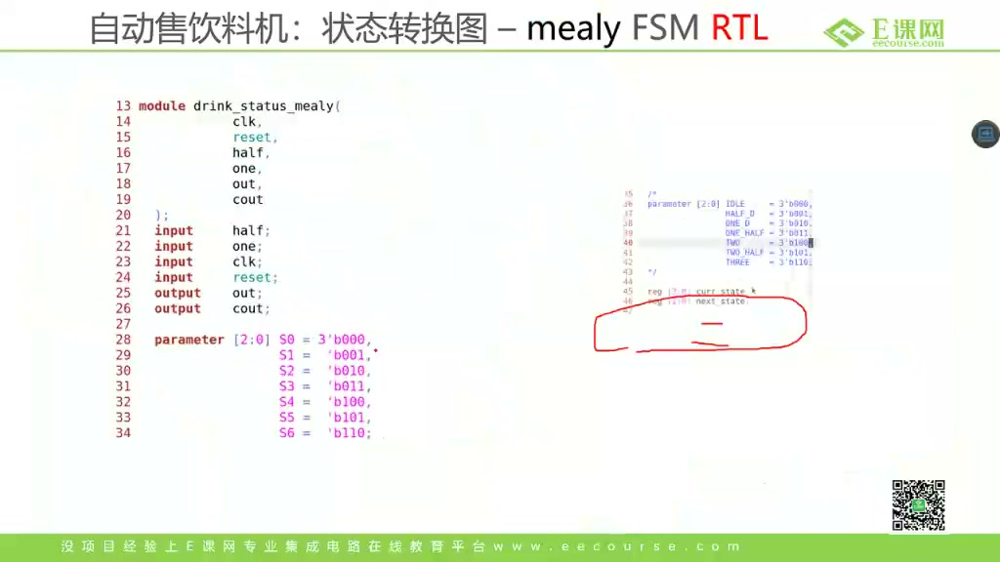
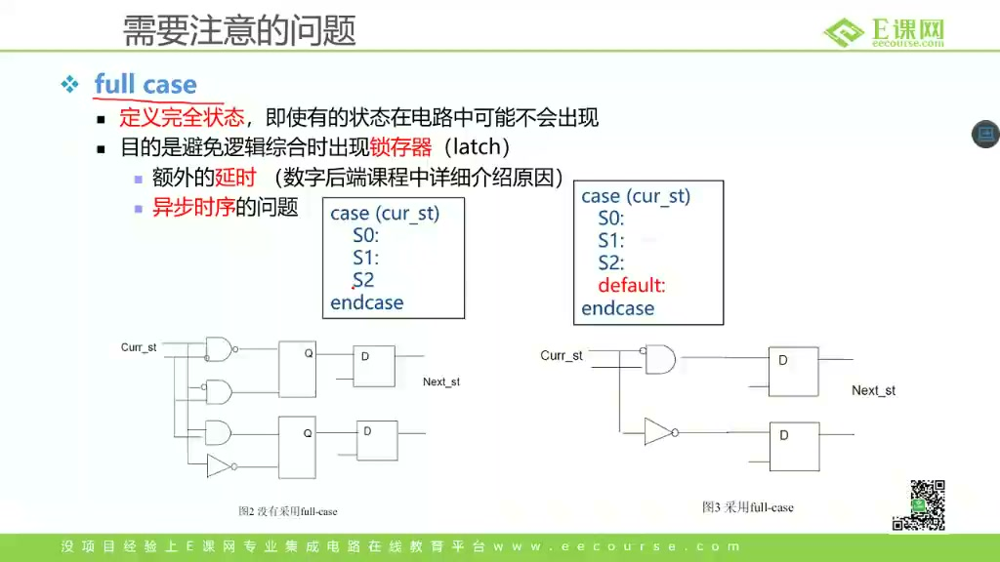
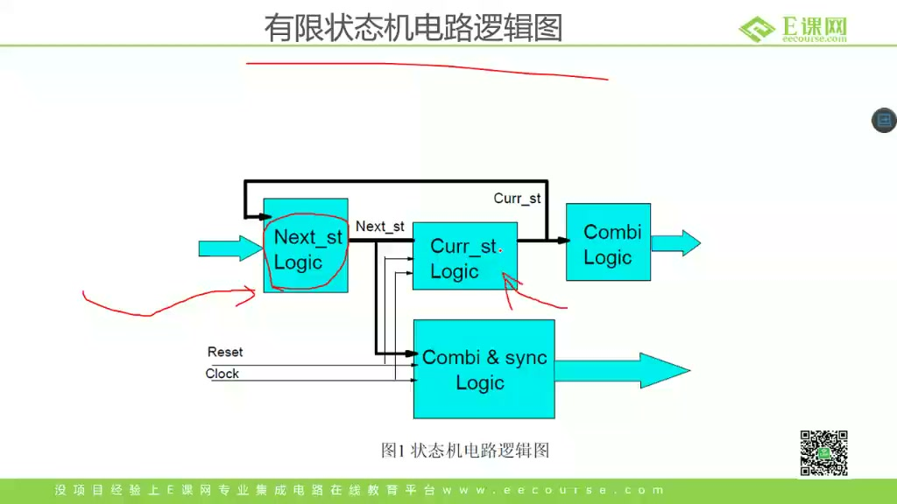
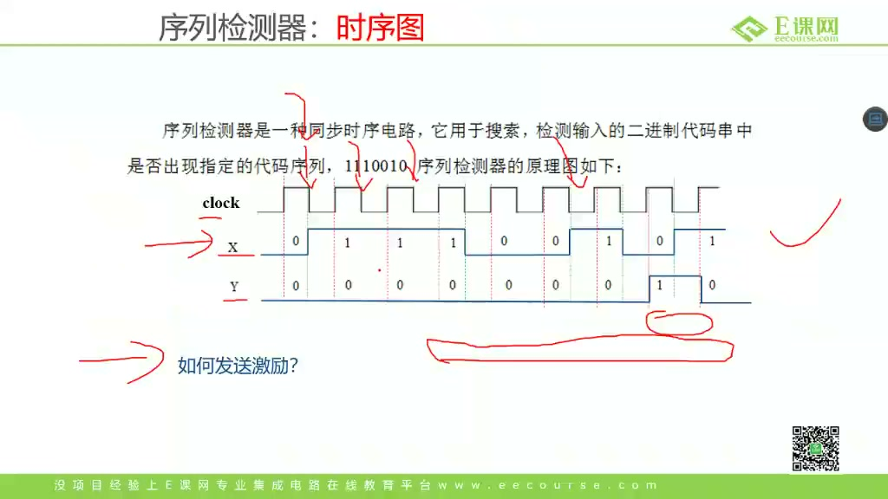

# 任务21：有限状态机的写法

> 本章目标：理解有限状态机 FSM 为什么适合做控制，掌握状态图、Moore/Mealy 区别、三段式 RTL 写法、状态寄存器/次态逻辑/输出逻辑的分工，以及如何通过波形 debug 状态机。

## 本章知识全景图



## 1. FSM 为什么适合做控制模块

课程用自动售饮料机引入 FSM：



售饮料机有几个典型特征：

- 有历史：已经投了多少钱。
- 有输入：投 5 毛、投 1 元、复位。
- 有输出：是否出饮料、是否找零。
- 有转移：当前金额 + 新投币 = 下一个状态。

这正是 FSM 的适用场景：**用有限个状态记录历史，用输入决定下一步，用输出驱动控制信号。**

## 2. 状态图：先画清楚，再写 RTL

课程展示状态转移图：



状态机设计顺序应该是：

1. 明确输入输出接口。
2. 定义状态含义。
3. 画状态转移图。
4. 决定 Moore 还是 Mealy。
5. 写 RTL。
6. 写 testbench 和波形检查。

不要直接上来写 `case`。没有状态图的 FSM，很容易漏转移、漏输出、漏复位。

## 3. Moore FSM：输出只和当前状态有关

课程讲 Moore 状态机：



Moore 机器的特点：

```text
output = f(current_state)
next_state = g(current_state, input)
```

优点：

- 输出通常更稳定。
- 输出只在状态寄存器更新后变化。
- 更容易做时序约束和波形分析。

缺点：

- 响应可能慢一拍。
- 有时需要多一个状态。

## 4. Mealy FSM：输出和当前状态、输入都有关

课程讲 Mealy 状态机：



Mealy 机器的特点：

```text
output = f(current_state, input)
next_state = g(current_state, input)
```

优点：

- 输入变化后可以更快影响输出。
- 状态数可能更少。

风险：

- 输出可能受输入毛刺影响。
- 输出组合路径更长。
- 调试时要同时看状态和输入。

## 5. Moore 和 Mealy 的关键区别

课程总结两类状态机：



| 类型 | 输出依赖 | 优点 | 风险 |
|---|---|---|---|
| Moore | 当前状态 | 输出稳定，容易约束 | 可能慢一拍 |
| Mealy | 当前状态 + 输入 | 响应快，状态少 | 输出可能有毛刺 |

工程建议：

- 控制寄存器、片外接口、跨模块控制信号优先用 Moore 或寄存器打一拍。
- 对响应速度要求高、且输入稳定可控时，可用 Mealy。

## 6. 三段式 FSM：把硬件结构写清楚

课程强调三段式写法：


三段式：

1. 状态寄存器：`current_state <= next_state`
2. 次态组合逻辑：根据 `current_state` 和输入算 `next_state`
3. 输出逻辑：根据状态或状态+输入产生输出

模板：

```systemverilog
typedef enum logic [2:0] {
    S_IDLE,
    S_05,
    S_10,
    S_15,
    S_20,
    S_DONE
} state_e;

state_e curr_state, next_state;

always_ff @(posedge clk or negedge rst_n) begin
    if (!rst_n)
        curr_state <= S_IDLE;
    else
        curr_state <= next_state;
end

always_comb begin
    next_state = curr_state;
    unique case (curr_state)
        S_IDLE: if (half) next_state = S_05;
                else if (one) next_state = S_10;
        default: next_state = S_IDLE;
    endcase
end

always_comb begin
    out  = 1'b0;
    cout = 1'b0;
    unique case (curr_state)
        S_DONE: out = 1'b1;
        default: ;
    endcase
end
```

## 7. 深挖：为什么要把 current_state 和 next_state 分开

课程反复强调 current / next：




硬件结构是：

```text
current_state 寄存器输出
    -> 组合逻辑计算 next_state
    -> 下一个时钟边沿写回 current_state
```

如果把 current 和 next 混在一起，容易写出仿真似乎能跑、综合后难理解的逻辑。分开后你能清楚回答：

- 当前状态保存在哪里？
- 下一个状态由谁算？
- 什么时候真正跳转？
- 输出和哪个状态相关？

这也是三段式 FSM 易维护的原因。

## 8. case 写法的常见坑

课程提醒要注意 `case`：

- `case` 分支要覆盖所有状态。
- 组合逻辑要先给默认值。
- 非法状态要能回到安全状态。
- 推荐用 `enum logic` 表达状态。

错误示例：

```systemverilog
always_comb begin
    case (curr_state)
        S_IDLE: if (go) next_state = S_RUN;
        S_RUN:  if (done) next_state = S_DONE;
    endcase
end
```

这里 `next_state` 可能漏赋值，推断 latch。更稳：

```systemverilog
always_comb begin
    next_state = curr_state;
    unique case (curr_state)
        S_IDLE: if (go) next_state = S_RUN;
        S_RUN:  if (done) next_state = S_DONE;
        S_DONE: next_state = S_IDLE;
        default: next_state = S_IDLE;
    endcase
end
```

## 9. 波形 debug：看状态、输入和输出的对应关系

课程最后强调要看波形：



调试 FSM 时至少观察：

- `clk`
- `rst_n`
- 输入信号
- `curr_state`
- `next_state`
- 输出信号

判断顺序：

1. 复位后是否进入初始状态。
2. 输入变化后 `next_state` 是否立即组合变化。
3. 下一个时钟边沿 `curr_state` 是否更新。
4. 输出是否符合 Moore/Mealy 预期。

## 10. 工程检查清单：FSM 交付前必须自问

| 检查点 | 为什么重要 | 建议做法 |
|---|---|---|
| 初始状态是否明确 | 复位后状态机必须落到可解释状态 | 复位进入 `S_IDLE` 或协议规定的安全状态 |
| 所有状态是否有去向 | 避免状态机卡死或漏转移 | `case` 覆盖所有 enum，`default` 回安全状态 |
| `next_state` 是否有默认值 | 避免组合逻辑推断 latch | 常用 `next_state = curr_state` |
| 输出属于 Moore 还是 Mealy | 决定输出是否受输入毛刺影响 | 跨模块/片外控制优先寄存器化 |
| 非法输入怎么处理 | 工程环境里输入不总是理想 one-hot 或单周期脉冲 | 明确忽略、报错、回退或保持 |
| 波形看哪些信号 | FSM debug 不能只看输出 | 同看 `curr_state`、`next_state`、输入、输出和复位 |

这张表比“代码能编译”更接近真实交付：FSM 是控制逻辑，控制逻辑一旦漏掉非法状态、复位或输出边界，后面常常表现为偶发死锁、偶发多打一拍、偶发少打一拍。

## 11. 深挖：Moore/Mealy 的真正取舍是“输出是否跨过寄存器边界”

Moore 输出只依赖 `curr_state`，因此输出变化通常跟随状态寄存器更新，天然多了一层寄存器边界。好处是稳定、容易约束、容易 debug；代价是响应可能慢一拍，状态数量可能更多。

Mealy 输出同时依赖 `curr_state` 和输入，所以输入变化可以在同一拍内通过组合逻辑影响输出。好处是快，状态可能更少；代价是输出可能带上输入毛刺，组合路径也更长。如果这个输出要去驱动跨模块控制、片外接口、写使能或握手信号，就必须特别谨慎，常见做法是把 Mealy 输出再打一拍，或者干脆改成 Moore 风格。

可以把选择口径压缩成一句话：**需要稳定交付的控制信号优先 Moore/寄存器化，需要同拍响应且输入已稳定时才考虑 Mealy。** 这不是语法偏好，而是在时序收敛、毛刺风险和响应速度之间做工程取舍。

## 12. 自测题

1. FSM 为什么适合做控制模块？
2. Moore 和 Mealy 最大区别是什么？
3. 三段式 FSM 三段分别描述什么硬件？
4. 为什么 `next_state = curr_state` 是常见默认赋值？
5. 状态机波形 debug 时为什么要同时看 `curr_state` 和 `next_state`？
6. 为什么跨模块控制信号通常不建议直接用未寄存器化的 Mealy 输出？

## 参考资料

- 本视频与对应字幕。
- Clifford E. Cummings, “The Fundamentals of Efficient Synthesizable Finite State Machine Design using NC-Verilog and BuildGates”：<http://www.sunburst-design.com/papers/CummingsSNUG2002SJ_FSM.pdf>
