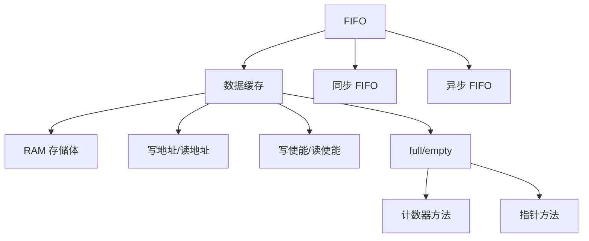
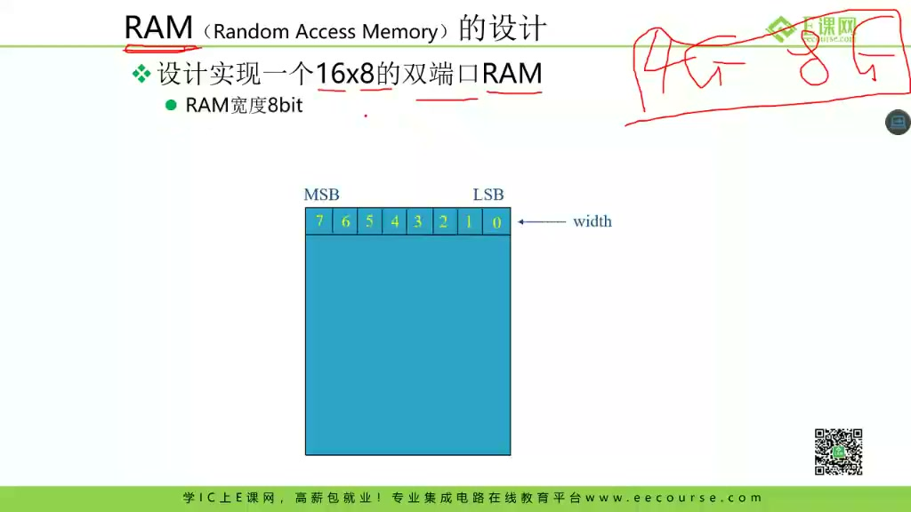
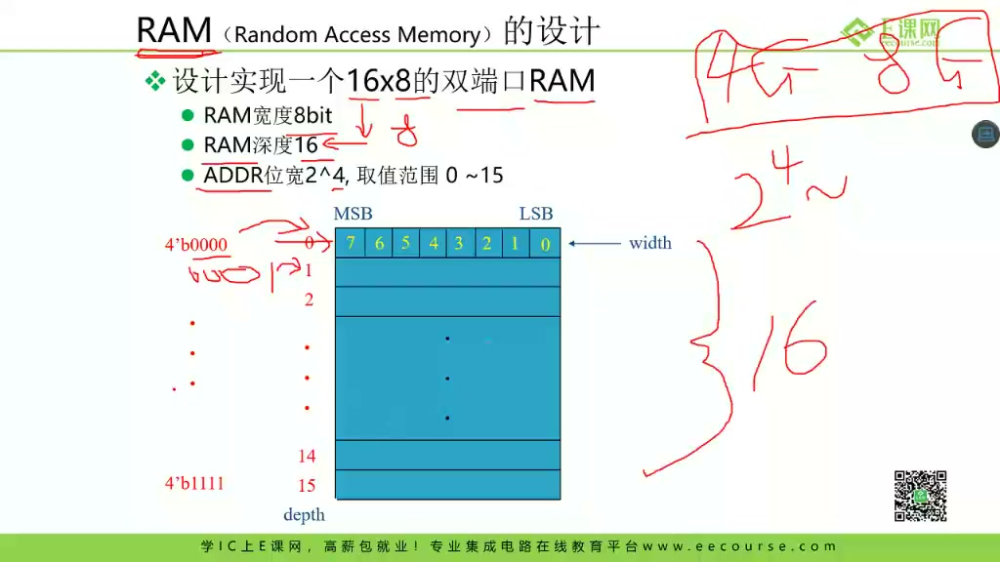
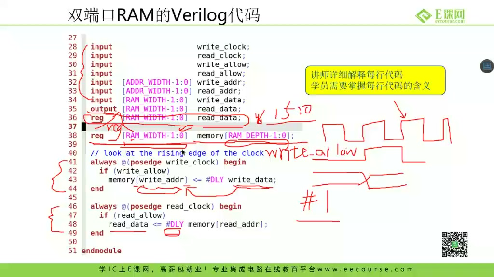
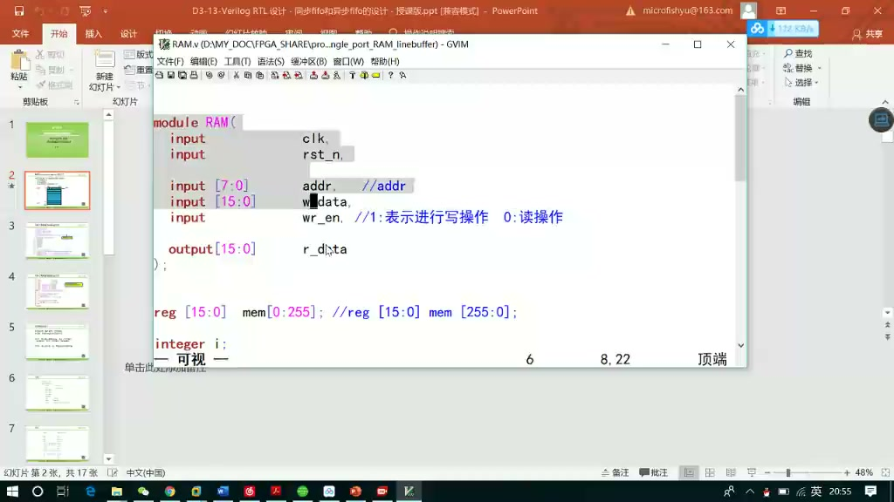
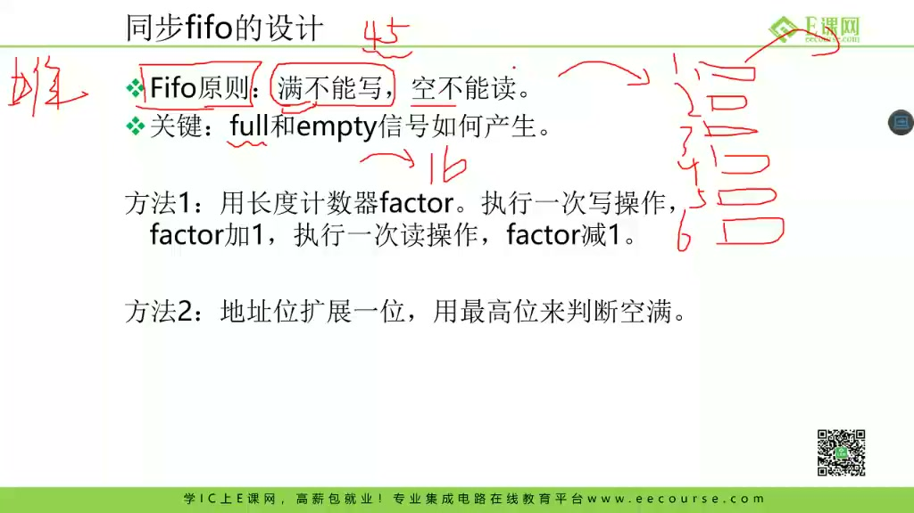
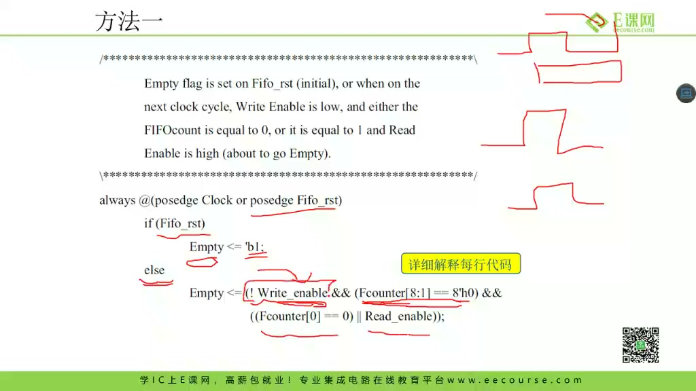
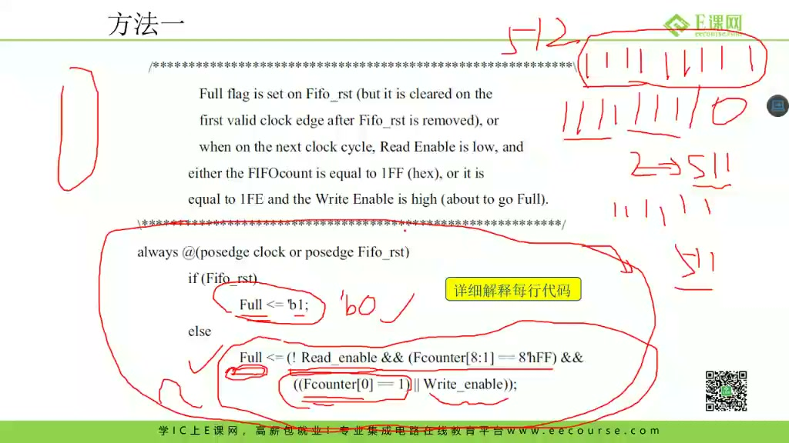
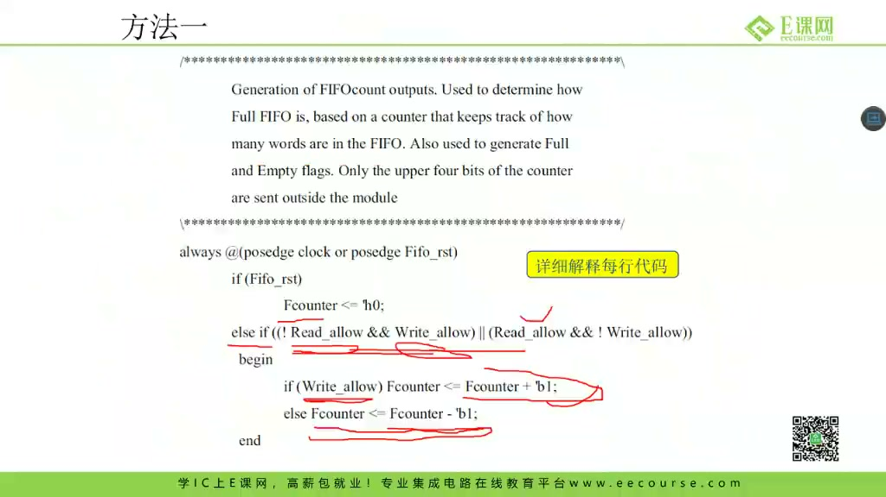
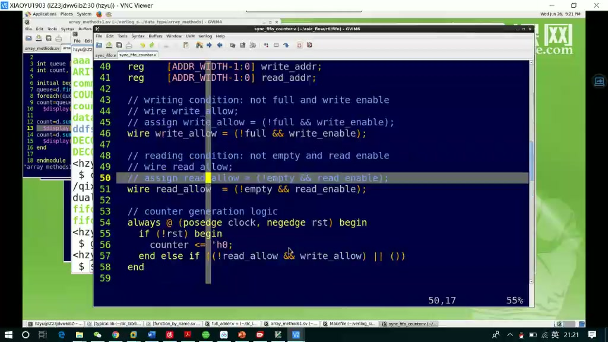

# 任务22：同步 FIFO / 异步 FIFO 的设计

> 本章目标：理解 FIFO 的先进先出语义，掌握同步 FIFO 的 RAM、读写指针、读写允许、满/空信号和计数器方法，并建立异步 FIFO 与 CDC 的关联。

## 本章知识全景图



## 1. FIFO 的本质：先进先出的缓存

课程从 FIFO 功能开始：



FIFO = First In First Out。它要保证：

```text
先写入的数据，先被读出
```

它常用于：

- 模块速率不完全匹配时的缓冲。
- pipeline 之间解耦。
- 总线/接口突发传输缓存。
- 异步时钟域之间的数据搬运。

## 2. RAM 是 FIFO 的数据存储体

课程讲 16x8 RAM：



一个 16x8 的 FIFO 可以理解为：

- 深度：16 个存储位置。
- 宽度：每个位置 8 bit。
- 地址宽度：4 bit，因为 `2^4 = 16`。

写入时：

```text
memory[write_addr] <= write_data
```

读出时：

```text
read_data <= memory[read_addr]
```

## 3. 读写端口：读允许和写允许要受 full/empty 约束

课程展示读写端口：



基本信号：

| 信号 | 方向 | 含义 |
|---|---|---|
| `write_enable` | input | 请求写入 |
| `write_data` | input | 写入数据 |
| `read_enable` | input | 请求读出 |
| `read_data` | output | 读出数据 |
| `full` | output | FIFO 满 |
| `empty` | output | FIFO 空 |

真正执行写入：

```systemverilog
write_allow = write_enable && !full;
```

真正执行读出：

```systemverilog
read_allow = read_enable && !empty;
```

## 4. 双端口 RAM：读写可以相对独立

课程讲双端口 RAM：



FIFO 中常见 RAM 形态：

- 同步 FIFO：读写使用同一个时钟。
- 异步 FIFO：写端和读端使用不同的时钟。

双端口 RAM 的意义是：写地址和读地址可以分别推进，避免读写互相阻塞。

## 5. 方法一：用计数器产生 full/empty

课程讲第一种同步 FIFO 方法：



维护一个 occupancy counter：

```systemverilog
always_ff @(posedge clk or negedge rst_n) begin
    if (!rst_n)
        count <= '0;
    else begin
        unique case ({write_allow, read_allow})
            2'b10: count <= count + 1'b1;
            2'b01: count <= count - 1'b1;
            default: count <= count;
        endcase
    end
end

assign empty = (count == 0);
assign full  = (count == DEPTH);
```

如果同一周期既读又写，FIFO 占用量不变。

## 6. 读写情况要分四类

课程讲读写同时发生的情况：



四种组合：

| 写 | 读 | count 变化 | 说明 |
|---|---|---|---|
| 0 | 0 | 不变 | 无操作 |
| 1 | 0 | +1 | 写入一个数据 |
| 0 | 1 | -1 | 读出一个数据 |
| 1 | 1 | 不变 | 一进一出 |

注意：写满时不能继续写，读空时不能继续读，所以要用 `write_allow/read_allow`，不能只看原始使能。

## 7. 同步 FIFO 架构

课程总结同步 FIFO：



同步 FIFO 的关键模块：

```text
RAM
write pointer
read pointer
occupancy counter
full/empty generation
```

写指针：

```systemverilog
if (write_allow)
    write_ptr <= write_ptr + 1'b1;
```

读指针：

```systemverilog
if (read_allow)
    read_ptr <= read_ptr + 1'b1;
```

地址自然回绕，构成环形缓冲区。

## 8. 异步 FIFO：真正难点是 CDC

课程引出异步 FIFO：



异步 FIFO 的读写时钟不同：

- 写端用 `write_clk`。
- 读端用 `read_clk`。
- 写指针属于写时钟域。
- 读指针属于读时钟域。

困难在于：满/空判断需要知道对方指针，但对方指针来自另一个时钟域，不能直接拿来用。后续课程会讲 Gray code 和同步器。

## 9. 深挖：为什么 full/empty 是 FIFO 的灵魂

FIFO 错误常常不是 RAM 写错，而是 full/empty 错了：

- full 错误为 0：继续写，覆盖未读数据。
- full 错误为 1：吞吐下降，写端被无故阻塞。
- empty 错误为 0：读出无效数据。
- empty 错误为 1：读端被无故阻塞。

因此 FIFO 验证的核心不是“能不能写进去一个数”，而是：

- 写满边界。
- 读空边界。
- 同周期读写。
- 指针回绕。
- reset 后初始状态。

## 10. 工程检查清单：同步 FIFO 最容易写错的边界

写同步 FIFO 时，建议逐项检查：

| 检查项 | 正确判断 | 常见错误 |
|---|---|---|
| reset 后状态 | `empty=1`、`full=0`、指针和计数器清零 | reset 后 full/empty 未初始化 |
| 写满后一拍 | `write_allow=0`，不能覆盖旧数据 | 只看 `write_enable`，满了还写 |
| 读空后一拍 | `read_allow=0`，不能读出新数据 | 空了还推进 read pointer |
| 同周期读写 | occupancy 不变，读写指针都可推进 | count 先加后减导致边界错 |
| 刚从空变非空 | 写入后下一拍 empty 应撤销 | empty 组合/时序更新时机混乱 |
| 刚从满变非满 | 读出后 full 应撤销 | full 多保持一拍，吞吐下降 |

一个实用原则：**所有会改变 FIFO 状态的逻辑，都尽量基于 `write_allow/read_allow`，而不是原始 `write_enable/read_enable`。** 原始请求只是“外部想做”，allow 才是“本周期真的做了”。

## 11. 深挖：同步 FIFO 与异步 FIFO 的本质分界

同步 FIFO 的满空判断可以直接比较同一个时钟域里的 count 或 pointer，因为所有状态都在同一个时钟边沿更新。异步 FIFO 不行，因为写指针和读指针分别属于两个时钟域。

如果在写时钟域直接使用读时钟域的 `read_ptr`，问题有两个：

- 它可能在写时钟采样窗口附近变化，引入亚稳态。
- 多 bit 指针可能各 bit 被采到不同版本，形成源域从未出现过的错误指针。

因此异步 FIFO 后续必须引入：

- Gray code 指针：一次只变化 1 bit，降低多 bit 采样错乱风险。
- 两级同步器：把对方指针同步到本时钟域。
- 本地判断 full/empty：写域判断 full，读域判断 empty。

## 12. 练习建议

课程最后强调要自己写：



建议练习顺序：

1. 只写 RAM。
2. 加写指针。
3. 加读指针。
4. 加 occupancy counter。
5. 加 full/empty。
6. 写 testbench 覆盖满、空、回绕、同读同写。

## 13. 自测题

1. FIFO 的“先进先出”在读写指针上如何体现？
2. 为什么写入条件应是 `write_enable && !full`？
3. 同周期读写时 occupancy counter 为什么不变？
4. 同步 FIFO 和异步 FIFO 最大区别是什么？
5. FIFO 验证为什么必须覆盖指针回绕？
6. 为什么异步 FIFO 不能直接拿对方时钟域的指针来判断满空？

## 参考资料

- 本视频与对应字幕。
- Clifford E. Cummings, “Simulation and Synthesis Techniques for Asynchronous FIFO Design”：<http://www.sunburst-design.com/papers/CummingsSNUG2002SJ_FIFO1.pdf>
