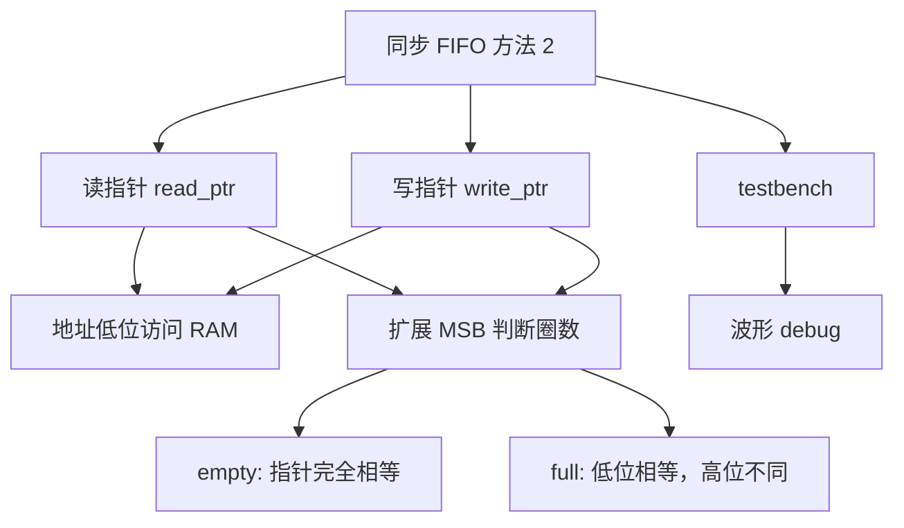
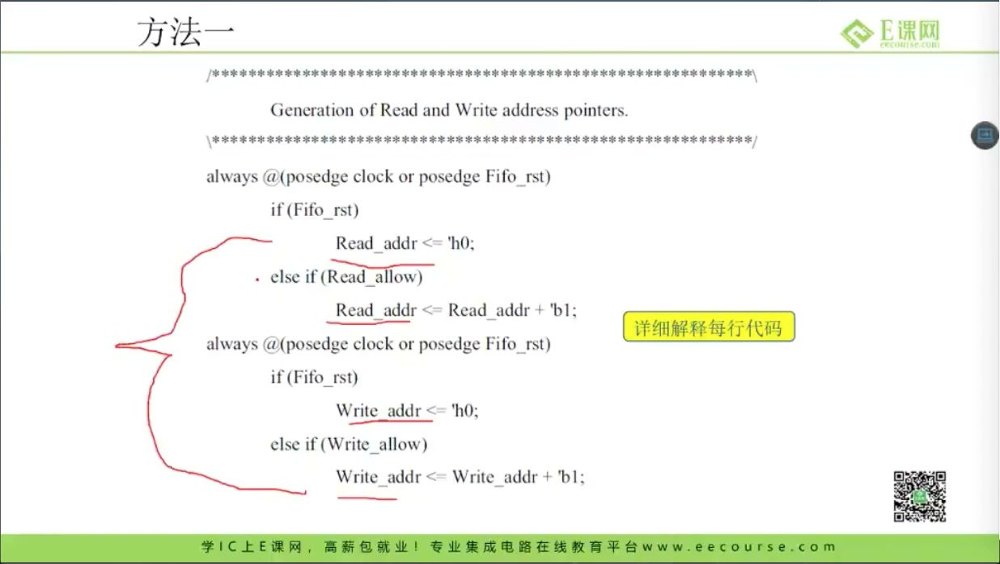
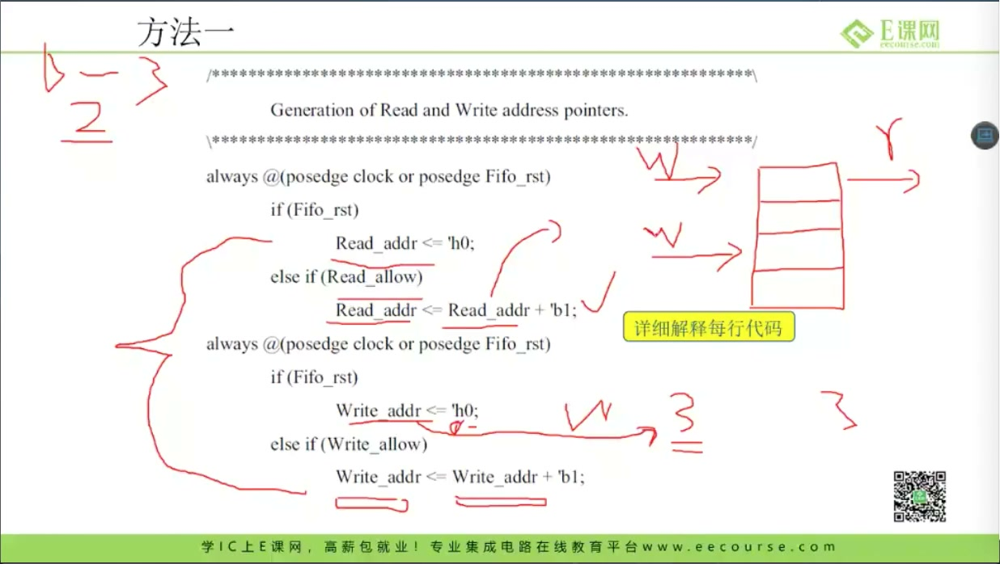
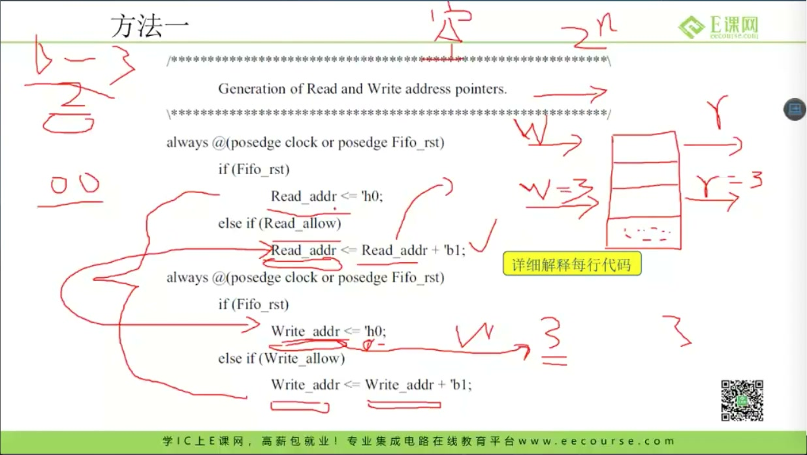
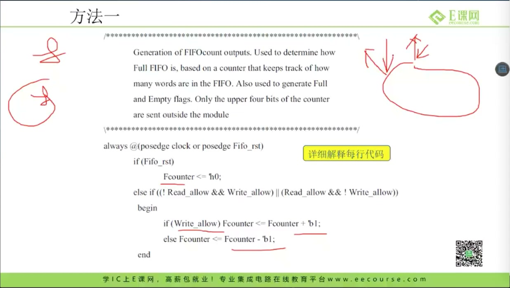
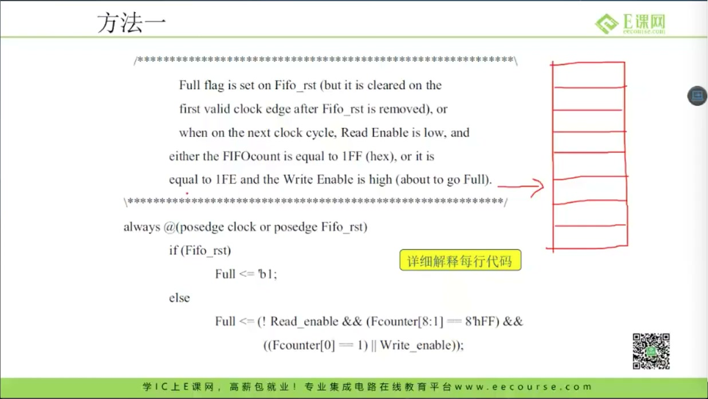
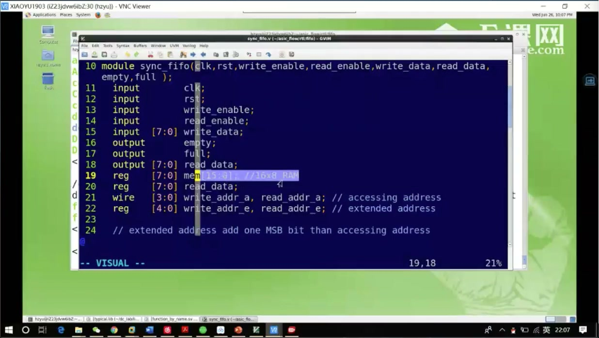
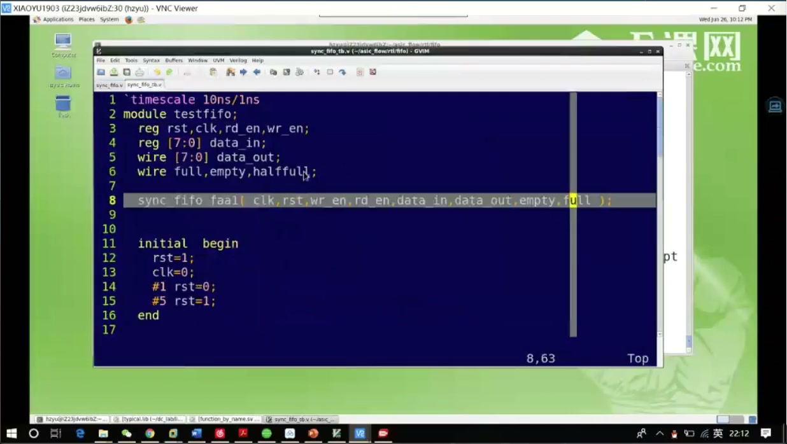
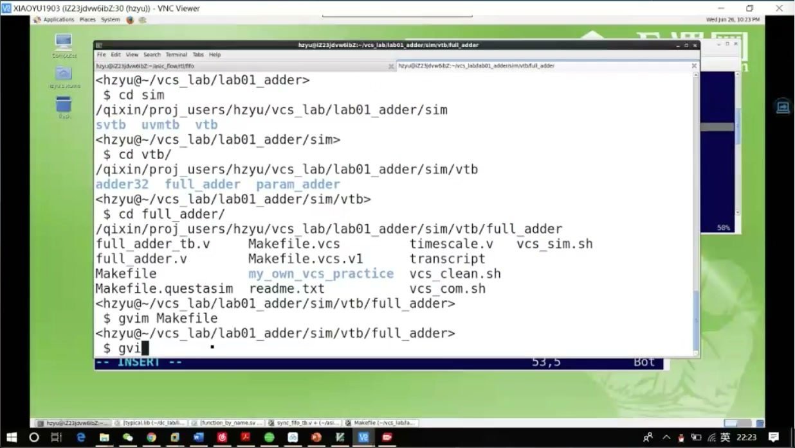
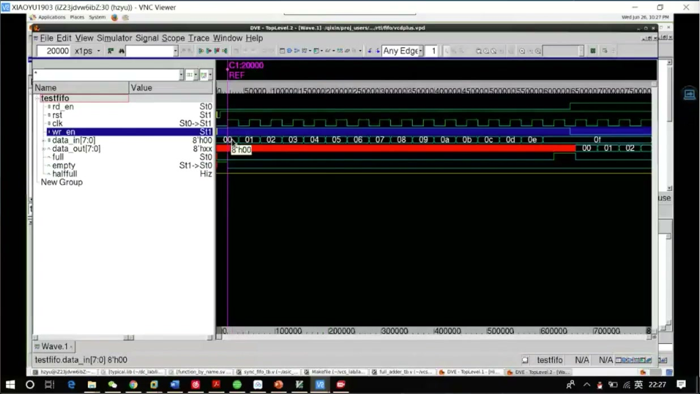

# 任务23：同步 FIFO 设计方法 2 介绍与仿真

> 本章目标：掌握同步 FIFO 的第二种满/空判断思路：不用 occupancy counter，而用读写指针及扩展位判断 full/empty；同时学习通过 testbench 和波形 debug FIFO。

## 本章知识全景图



## 1. 为什么要有方法 2

课程一开始提出：既然读写地址每读/写一次都会变化，能不能不单独维护 counter，直接用指针判断空满？



答案是可以，但必须解决一个问题：**读指针等于写指针时，到底是空，还是满？**

## 2. 读写指针各自推进

课程讲读写指针：



写指针：

```systemverilog
if (write_allow)
    write_ptr <= write_ptr + 1'b1;
```

读指针：

```systemverilog
if (read_allow)
    read_ptr <= read_ptr + 1'b1;
```

访问 RAM 时只用低位：

```systemverilog
memory[write_ptr[ADDR_WIDTH-1:0]] <= write_data;
read_data <= memory[read_ptr[ADDR_WIDTH-1:0]];
```

## 3. empty：读写指针完全相等

课程讲 empty 判断：



初始状态：

```text
write_ptr == read_ptr
```

FIFO 为空。读写同样推进后，如果所有数据都读完，也会回到：

```systemverilog
assign empty = (write_ptr == read_ptr);
```

## 4. full 的困难：地址相等不代表一定空

课程讲写指针绕一圈：



假设深度是 8：

- 刚复位：`write_addr == read_addr == 0`，FIFO 空。
- 写入 8 个数据后：低位地址又回到 0，但 FIFO 满。

所以只比较低位地址无法区分空和满。

## 5. 扩展一位 MSB：用圈数区分 full/empty

课程讲扩展地址位：



指针宽度比地址宽度多 1 位：

```systemverilog
logic [ADDR_WIDTH:0] write_ptr;
logic [ADDR_WIDTH:0] read_ptr;
```

低位访问 RAM：

```systemverilog
write_addr = write_ptr[ADDR_WIDTH-1:0];
read_addr  = read_ptr[ADDR_WIDTH-1:0];
```

空：

```systemverilog
assign empty = (write_ptr == read_ptr);
```

满：

```systemverilog
assign full =
    (write_ptr[ADDR_WIDTH]     != read_ptr[ADDR_WIDTH]) &&
    (write_ptr[ADDR_WIDTH-1:0] == read_ptr[ADDR_WIDTH-1:0]);
```

直觉：

- 低位相等：指向同一个 RAM 地址。
- 高位不同：写指针比读指针多绕了一圈。
- 所以是满，不是空。

## 6. 深挖：为什么“多一位”解决了空满二义性

FIFO 指针本质是环形计数器。只看低位地址时，状态空间被压缩：

```text
0,1,2,...,7,0,1,2...
```

你不知道这个 `0` 是第一圈的 0，还是第二圈的 0。扩展 MSB 后：

```text
0_000, 0_001, ..., 0_111, 1_000, 1_001...
```

它记录了“圈数奇偶”。因此：

- `0_000 == 0_000`：空。
- `1_000` 与 `0_000`：低位相同，高位不同，满。

这个思想也是异步 FIFO 中 Gray 指针满/空判断的基础。

## 7. RTL 代码结构

课程打开 FIFO 代码：



核心结构：

```systemverilog
localparam DEPTH = 1 << ADDR_WIDTH;

logic [ADDR_WIDTH:0] write_ptr;
logic [ADDR_WIDTH:0] read_ptr;

assign write_allow = write_enable && !full;
assign read_allow  = read_enable  && !empty;

always_ff @(posedge clk or negedge rst_n) begin
    if (!rst_n)
        write_ptr <= '0;
    else if (write_allow)
        write_ptr <= write_ptr + 1'b1;
end

always_ff @(posedge clk or negedge rst_n) begin
    if (!rst_n)
        read_ptr <= '0;
    else if (read_allow)
        read_ptr <= read_ptr + 1'b1;
end
```

## 8. testbench：要覆盖边界和回绕

课程展示 testbench：



建议测试点：

1. reset 后 `empty=1`、`full=0`。
2. 连续写到满。
3. 满时继续写不应覆盖数据。
4. 连续读到空。
5. 空时继续读不应输出新数据。
6. 指针回绕后继续读写。
7. 同周期读写。

## 9. 波形 debug：FIFO 要看一组信号

课程打开波形：



必须观察：

- `clk`
- `rst_n`
- `write_enable`
- `read_enable`
- `write_allow`
- `read_allow`
- `write_ptr`
- `read_ptr`
- `full`
- `empty`
- `write_data`
- `read_data`

debug 顺序：

1. 指针是否只在 allow 时推进。
2. full/empty 是否在边界正确变化。
3. 回绕时扩展 MSB 是否翻转。
4. 读出的数据顺序是否和写入一致。

## 10. debug 方法：先定位现象，再回代码

课程强调波形分析：



不要看到错误就乱改。按照这个顺序：

```text
波形现象 -> 错误信号 -> 产生该信号的 always/assign -> 修正条件 -> 重跑
```

例如读出顺序错了，不要先怀疑 RAM。先看：

- `write_ptr` 是否在写时推进。
- `read_ptr` 是否在读时推进。
- full/empty 是否误阻塞。
- 指针低位是否正确访问 memory。

## 11. 方法 1 和方法 2 怎么选

同步 FIFO 两种方法都能用，但工程取舍不同：

| 方案 | 核心状态 | 优点 | 风险/代价 |
|---|---|---|---|
| 方法 1：occupancy counter | `count` | full/empty 直观，容易写断言 | count 位宽和同读同写边界要小心 |
| 方法 2：扩展指针 | `write_ptr/read_ptr` 多 1 位 | 更接近异步 FIFO 思路，便于过渡到 Gray 指针 | 初学者容易把访问地址和扩展指针混用 |

小容量同步 FIFO，counter 方法很直观；准备学习异步 FIFO 时，扩展指针方法更有价值，因为它把“地址低位访问 RAM，高位判断圈数”的思想提前建立起来。

## 12. 波形验收表：看到这些变化才算对

| 场景 | 期望波形 |
|---|---|
| reset 后 | `write_ptr=0`、`read_ptr=0`、`empty=1`、`full=0` |
| 连续写到深度 N | `write_ptr` 推进 N 次，`full` 拉高 |
| 满时继续写 | `write_ptr` 不应继续推进，旧数据不被覆盖 |
| 连续读到空 | `read_ptr` 追上 `write_ptr`，`empty` 拉高 |
| 空时继续读 | `read_ptr` 不应继续推进，`read_data` 不应被当成新数据 |
| 指针回绕 | 低位回到 0，扩展 MSB 翻转 |
| 同周期读写 | 两个指针都可推进，占用量不变 |

这张表比“跑了一遍仿真没报错”更可靠。FIFO 是边界电路，越靠近空、满、回绕，越容易暴露 bug。

## 13. 自测题

1. 为什么只比较低位地址不能区分 FIFO 空和满？
2. 扩展 MSB 在 full 判断中起什么作用？
3. `empty = (write_ptr == read_ptr)` 为什么成立？
4. 波形里判断 FIFO 是否正确，最少要看哪些信号？
5. 方法 1 的 occupancy counter 和方法 2 的扩展指针各有什么优点？
6. 为什么访问 RAM 只能用指针低位，而 full/empty 判断要用扩展位？

## 参考资料

- 本视频与对应字幕。
- Clifford E. Cummings, “Simulation and Synthesis Techniques for Asynchronous FIFO Design”：<http://www.sunburst-design.com/papers/CummingsSNUG2002SJ_FIFO1.pdf>
