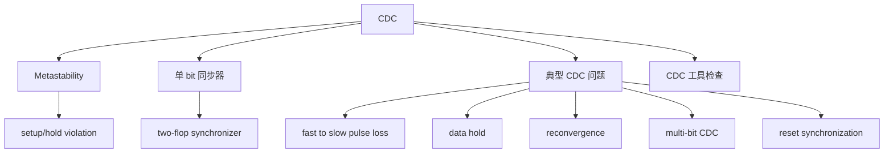
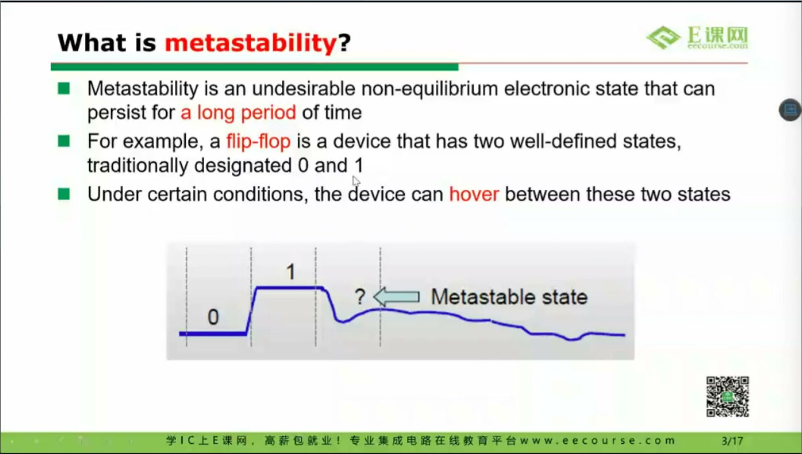
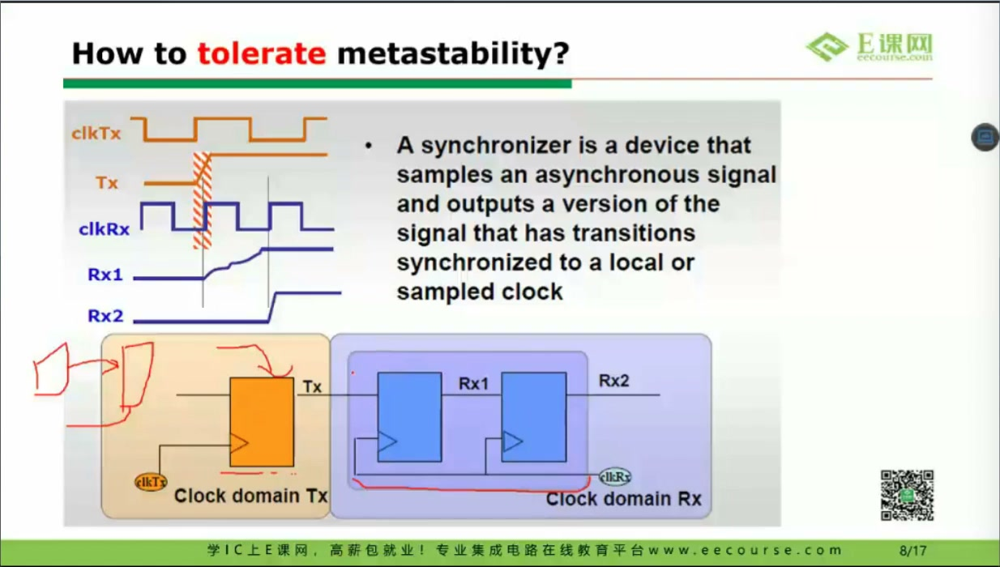
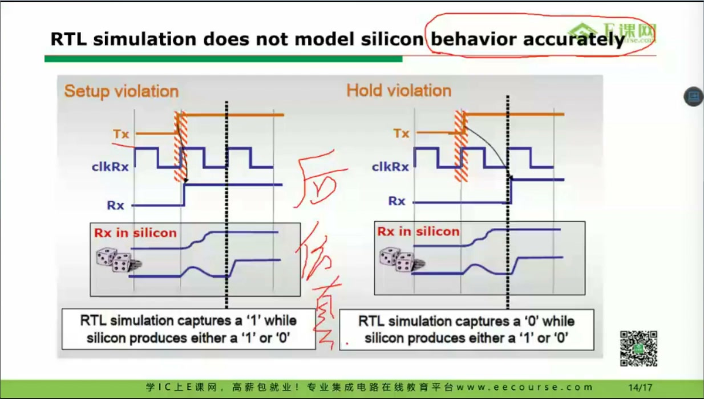
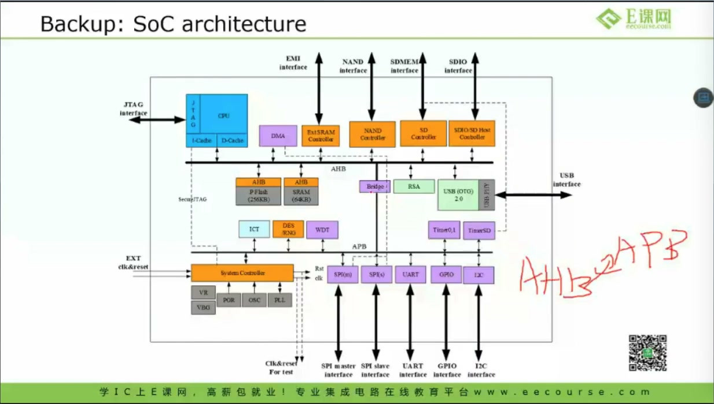
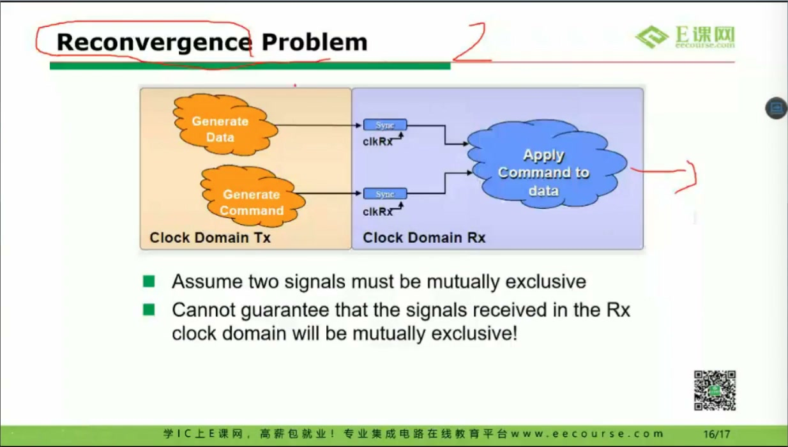
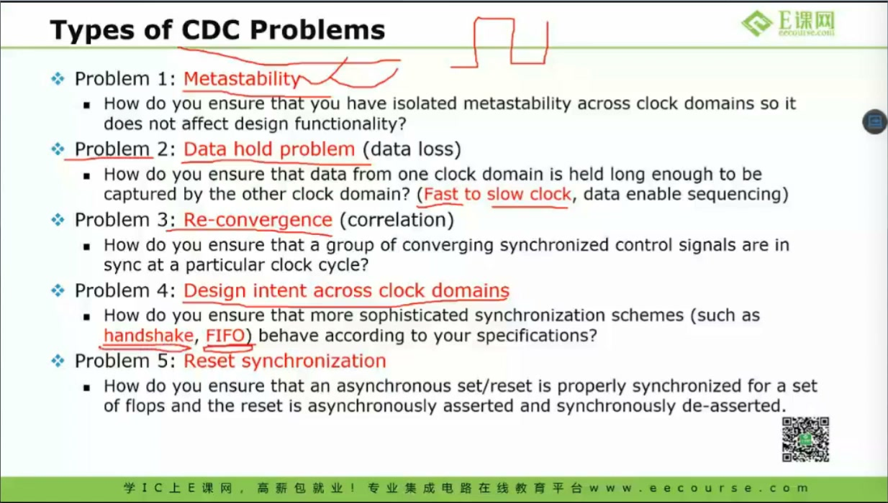
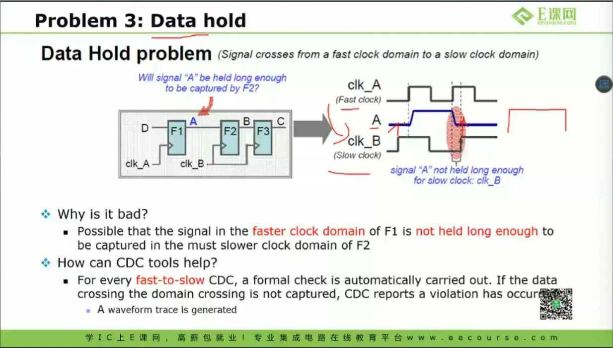
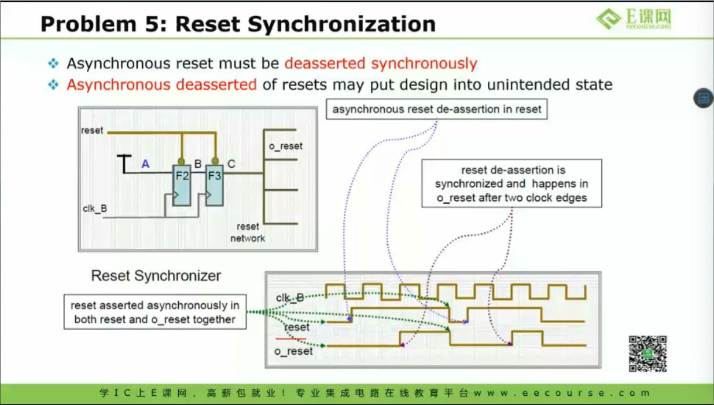
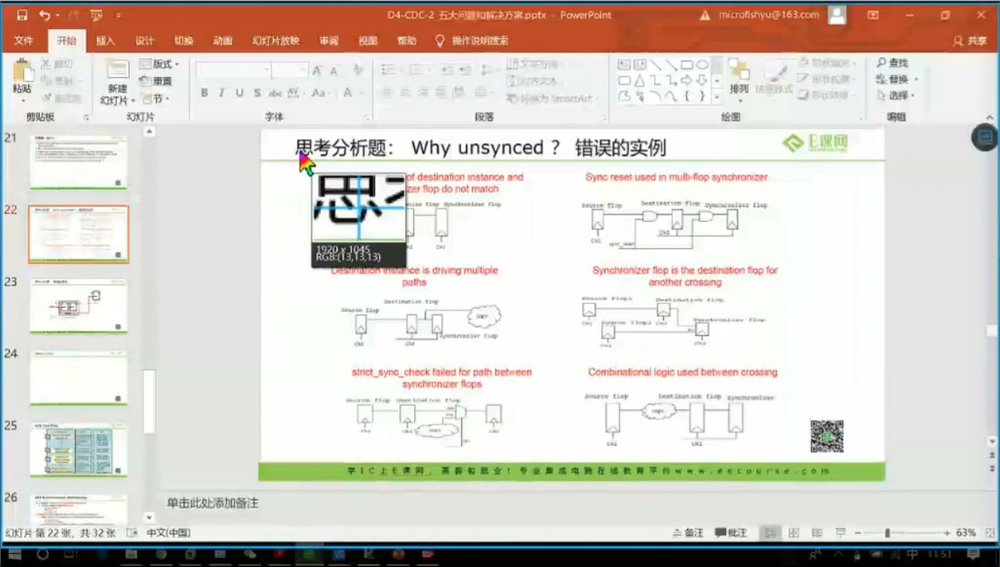

# 任务25：CDC / Metastability（亚稳态）

> 本章目标：理解跨时钟域 CDC 为什么会产生亚稳态，掌握 setup/hold 窗口、两级同步器、快到慢脉冲、data hold、reconvergence、多 bit CDC、reset synchronization 等典型问题。重点是知道哪些问题仿真看不出来，必须靠结构设计和 CDC 检查保证。

## 本章知识全景图



## 1. 什么是 CDC

课程开头定义 CDC：



CDC = Clock Domain Crossing，跨时钟域。只要一个信号从一个时钟域传到另一个时钟域，就要问：

- 两个时钟是否同源、同频、固定相位？
- 接收端是否可能在数据变化附近采样？
- 传的是单 bit 控制，还是多 bit 数据？
- 是否需要保证脉冲一定被看到？

CDC 问题不是“语法错”，而是硬件时序和概率问题。

## 2. 亚稳态：触发器卡在 0 和 1 之间

课程给出 metastability 图：


触发器理想上输出只有 0/1，但当输入在采样边沿附近变化，违反 setup/hold 要求时，触发器可能短时间停在不稳定状态，之后才随机恢复到 0 或 1。

这就是亚稳态。

重要结论：

- 亚稳态不能被“彻底消除”，只能降低传播概率。
- RTL 仿真通常看不到真实模拟波形中的亚稳态。
- gate-level 后仿也只能看到部分时序违例现象，不能代替 CDC 结构检查。

## 3. setup/hold 窗口：为什么接收边沿附近最危险

课程讲 setup/hold violation：



触发器要求：

- setup：采样边沿前数据稳定一段时间。
- hold：采样边沿后数据继续稳定一段时间。

如果源时钟域的数据变化恰好落在接收时钟采样窗口附近，接收触发器就可能进入亚稳态。

**深挖：为什么 RTL 仿真不能证明 CDC 安全？**

RTL 仿真中的触发器是理想模型：在边沿处直接采样 0/1/X。真实硅片中，触发器内部是模拟电路，可能出现缓慢恢复、振荡或不确定解析。CDC 安全靠结构设计、时序假设和统计概率，不靠一次 RTL 仿真波形。

## 4. 亚稳态会传播，所以需要同步器

课程展示亚稳态传播：



如果第一级触发器输出亚稳态，后级逻辑可能看到不确定电平，造成：

- 控制信号错误触发。
- 状态机跳错。
- 多个下游寄存器采到不同值。

解决单 bit 控制信号最常见方法是两级同步器：



```systemverilog
always_ff @(posedge dst_clk or negedge rst_n) begin
    if (!rst_n) begin
        sync1 <= 1'b0;
        sync2 <= 1'b0;
    end else begin
        sync1 <= async_sig;
        sync2 <= sync1;
    end
end
```

第一级可能亚稳，第二级给它多一个周期恢复，从而显著降低亚稳态传播概率。

## 5. 两级同步器降低概率，不保证功能语义

两级同步器适合：

- 单 bit level 信号。
- 慢变化控制。
- 不要求捕获每一个短脉冲的状态信号。

它不适合：

- 多 bit 数据总线。
- 快时钟域到慢时钟域的窄脉冲。
- 多个相关控制信号分别同步后再组合。

原因是：同步器只解决“采样亚稳态概率”，不自动解决“接收端是否一定看到事件”。

## 6. reconvergence：多个同步信号重新汇合的风险

课程讲 reconvergence：



如果两个互斥控制信号分别跨域同步：

```text
sig_a -> 2FF sync -> a_sync
sig_b -> 2FF sync -> b_sync
```

接收域不一定在同一个周期看到它们更新。即使源域保证互斥，接收域也可能短暂看到：

- 两个都为 0。
- 两个都为 1。
- 顺序错位。

这就是 reconvergence 风险。

解决思路：

- 不要把相关控制拆成多个 bit 独立同步。
- 用握手协议。
- 用异步 FIFO。
- 或把编码设计成接收端能容忍中间状态。

## 7. 快到慢脉冲：短脉冲可能被慢时钟漏采

课程讲快到慢问题：



如果源域脉冲只有一个快时钟周期，而目标域时钟更慢，目标域可能完全采不到。

常见解决：

- 把脉冲拉宽到至少覆盖目标域采样窗口。
- 使用 toggle synchronizer。
- 使用 request/ack handshake。
- 对数据流使用异步 FIFO。

不要以为加两级同步器就能保证短脉冲被看到。两级同步器可能同步的是“已经消失后的 0”。

## 8. Data hold：数据没保持到接收端采样

课程讲 data hold 问题：



快时钟域到慢时钟域传数据时，如果数据变化太快，慢时钟域可能还没采到，源域已经改成下一笔。

解决思路：

- 源域保持数据，直到目标域确认收到。
- 使用 valid/ready 或 req/ack 握手。
- 使用异步 FIFO 缓冲多笔数据。

## 9. 多 bit CDC：不能逐 bit 同步普通数据总线

课程讲多 bit CDC 与 SoC 场景：



如果把一个多 bit 总线每一位都接两级同步器：

```text
data[0] -> 2FF
data[1] -> 2FF
...
```

接收端可能在同一个周期采到不同“版本”的 bit，组合成源域从未出现过的错误值。

正确方法：

- 单 bit 控制用同步器。
- 多 bit 数据用握手保持。
- 连续数据流用异步 FIFO。
- 指针跨域用 Gray code，保证一次只变一 bit。

## 10. Reset synchronization：异步复位释放也会产生 CDC 风险

课程的 CDC 类型总结中包含 reset synchronization：



常见建议：

```text
异步 assert，同步 deassert
```

也就是说复位拉低可以异步生效，但复位释放最好同步到对应时钟域。否则不同寄存器可能在不同周期退出复位，状态机进入非法组合。

## 11. CDC 检查要看结构，不只看波形

课程提到 CDC 工具检查。CDC 工具通常会检查：

- 未同步的跨域路径。
- 单 bit 同步器结构是否规范。
- 多 bit 总线是否逐 bit 同步。
- reconvergence。
- fast-to-slow pulse。
- async reset deassert。
- FIFO 指针同步结构。

这类问题通常不能靠普通仿真覆盖完。仿真能帮你看功能，CDC 工具帮你查结构风险。

## 12. 工程判定表：看到跨域信号先问什么

遇到任何 CDC 信号，先按下面的问题分类：

| 问题 | 如果答案是“是” | 推荐结构 |
|---|---|---|
| 只是单 bit 慢变化 level 信号吗？ | 是 | 两级同步器 |
| 是快时钟到慢时钟的单周期脉冲吗？ | 是 | 脉冲拉宽、toggle synchronizer 或握手 |
| 是多 bit 数据总线吗？ | 是 | 握手保持、异步 FIFO、Gray 编码指针 |
| 多个同步后的控制信号会再组合吗？ | 是 | 小心 reconvergence，尽量合并协议 |
| reset 会异步释放吗？ | 是 | 异步 assert，同步 deassert |
| 数据流需要连续传输吗？ | 是 | 异步 FIFO 通常比零散同步更稳 |

这张表的意义是：不要看到跨域就机械加两个触发器。两级同步器只解决一类问题，不能解决所有 CDC 语义。

## 13. 深挖：CDC 的“正确”不是一个点，而是一套协议

CDC 设计真正要保证的是接收域看到的事件和数据语义正确。比如：

- 单 bit enable：接收域最终看到稳定电平即可。
- pulse event：接收域必须至少看到一次事件。
- data bus：接收域必须看到同一版本的所有 bit。
- FIFO stream：接收域必须按顺序取到每一笔数据。

这些目标不同，电路结构也不同。把所有跨域都写成“两级同步器”是初学者常见误区。CDC 设计要先定义协议，再选择结构，最后用 CDC 工具和仿真分别检查结构风险和功能行为。

## 14. 自测题

1. 为什么亚稳态不能被完全消除，只能降低传播概率？
2. 两级同步器适合什么信号？不适合什么信号？
3. 为什么快时钟域的单周期脉冲可能被慢时钟域漏采？
4. 多 bit 数据为什么不能逐 bit 加同步器后直接使用？
5. reset 为什么要“异步 assert，同步 deassert”？
6. 为什么 CDC 检查不能只看普通 RTL 仿真波形？

## 参考资料

- 本视频与对应字幕。
- Clifford E. Cummings, “Clock Domain Crossing (CDC) Design & Verification Techniques Using SystemVerilog”：<http://www.sunburst-design.com/papers/CummingsSNUG2008Boston_CDC.pdf>
- Xilinx XAPP094, “Metastable Recovery in Virtex-II Pro FPGAs”：<https://docs.amd.com/v/u/en-US/xapp094>
