# 任务29：SpyGlass 的基本使用 2

> 本章目标：在前面 CDC/亚稳态知识基础上，理解 SpyGlass/VC SpyGlass 做 CDC 静态检查的基本流程：看官方 CDC 文档、创建工程、准备 RTL 和约束、运行 CDC check、看报告，并处理常见环境问题。

## 本章知识全景图

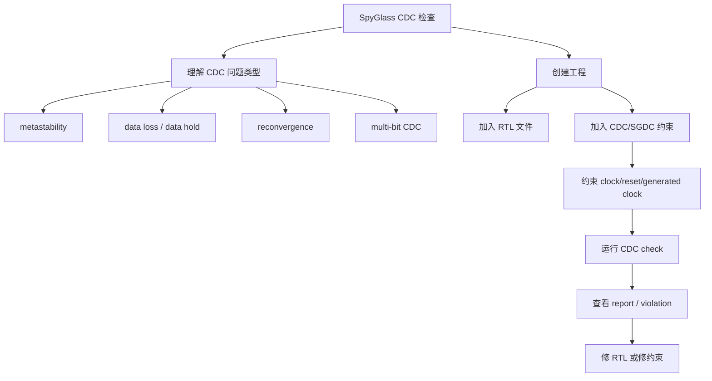

## 1. 先看官方文档：CDC 检查不是随便点 Run

课程从 SpyGlass 官方文档里的 CDC 章节开始：

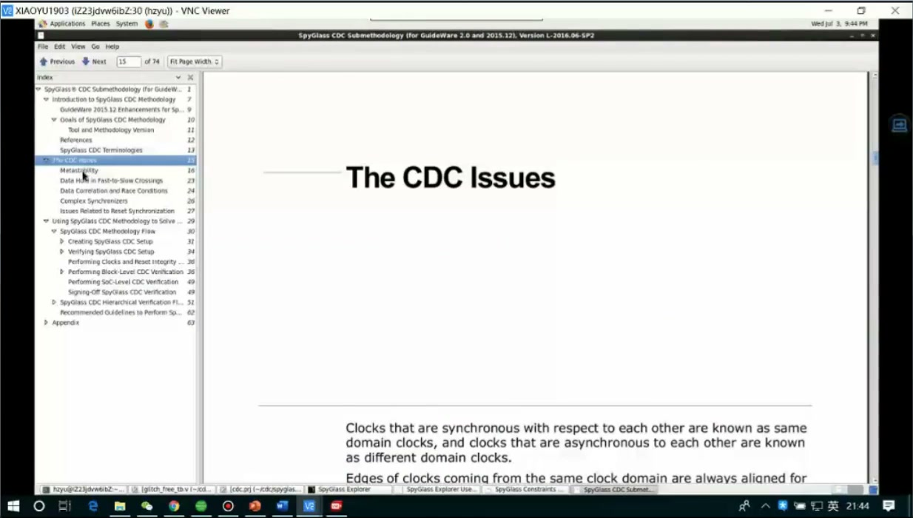

这里老师强调：官方文档已经把 CDC 的典型问题讲了一遍，包括亚稳态、多 bit 数据同步、mux 选择信号同步、生成时钟、reset 等问题。学习 SpyGlass 不应该只背按钮位置，而应该把它和上一章 CDC 知识连起来：

- 你要检查的结构是什么？
- 哪些跨域路径需要同步？
- 哪些路径是合法的，不应该误报？
- 哪些 clock/reset 关系需要告诉工具？

Synopsys 官方对 VC SpyGlass 的定位也是 RTL 阶段的静态 signoff，覆盖 RTL 构造、CDC、RDC 等问题，目标是在 RTL 早期发现结构风险。

## 2. CDC setup：告诉工具这个设计如何分析

课程翻到 `Creating SpyGlass CDC Setup`：

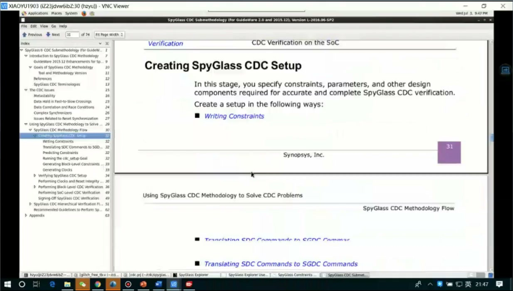

CDC 检查需要 setup，不是因为工具麻烦，而是因为工具必须知道：

- 顶层模块是谁。
- 哪些文件是 RTL。
- 哪些 clock 存在。
- 哪些 reset 存在。
- 哪些 generated clock 或 gated clock 需要特殊声明。
- 哪些路径是已知安全结构。

没有这些信息，工具只能用猜的，结果会出现两类问题：

- 漏报：真正有问题的 CDC 没被识别。
- 误报：合法结构被当成 CDC violation。

## 3. 创建工作目录和工程

课程中创建 CDC 检查工作目录：

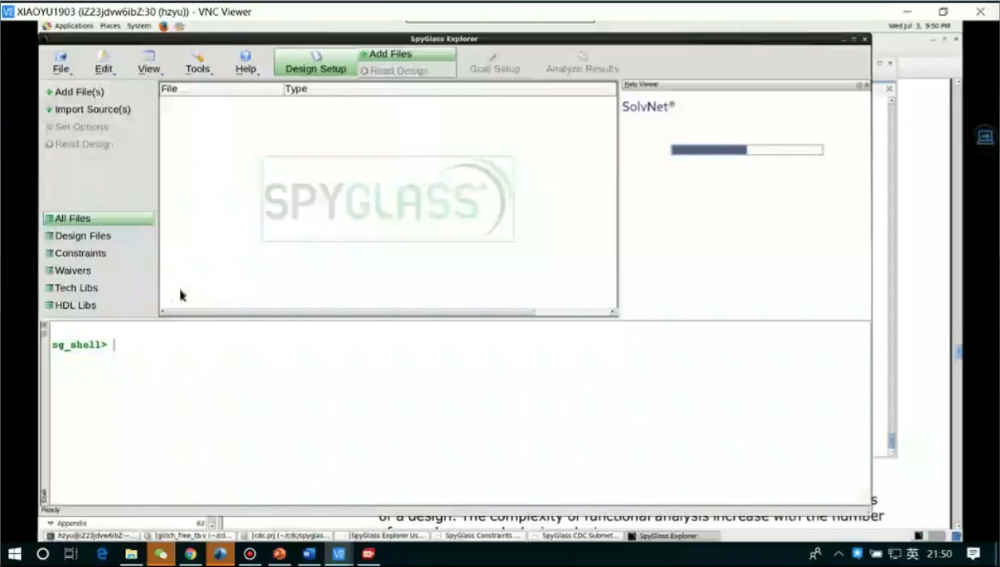

典型操作思路：

```bash
mkdir cdc_chk_myown
cd cdc_chk_myown
spyglass &
```

打开 GUI 后创建工程：

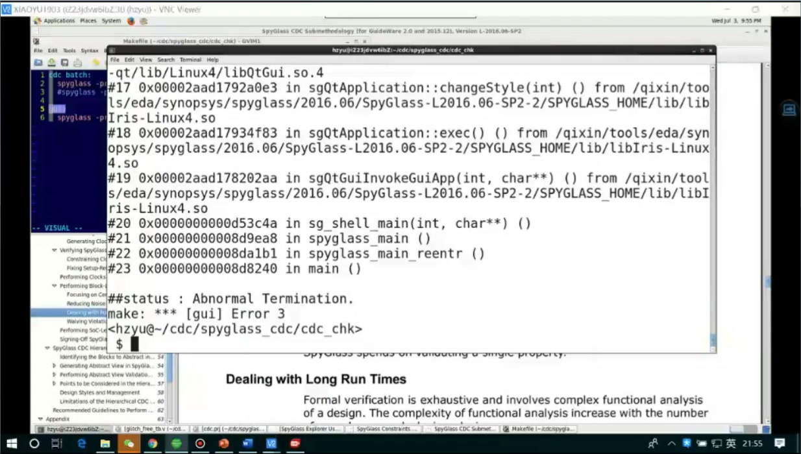

一个 SpyGlass 工程至少要组织：

| 内容 | 作用 |
|---|---|
| RTL 文件 | 被检查的设计源码 |
| top module | 检查入口 |
| goal | 选择 lint、cdc、rdc 等检查目标 |
| constraint | clock/reset/CDC 约束 |
| report | violations 和 summary |

## 4. RTL 文件列表：CDC 工具首先要能读懂设计

课程后半段拷贝 CDC 实验文件：

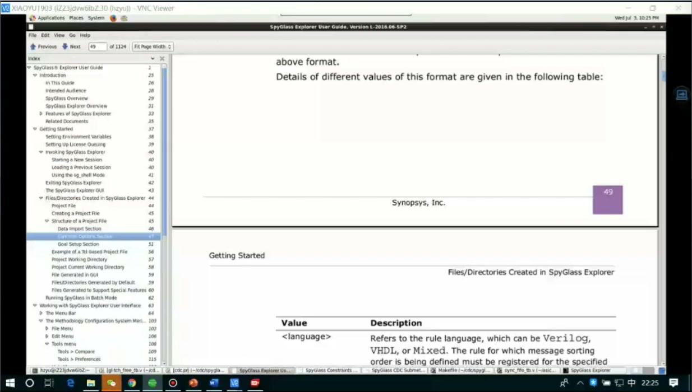

并查看 RTL 文件：

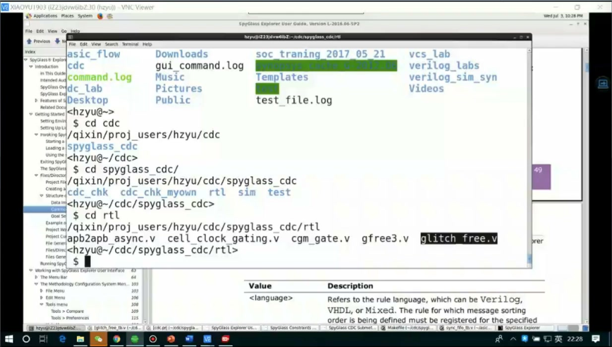

如果工具连 RTL 都没有正确读入，后续 CDC 检查没有意义。常见检查点：

- 文件路径是否正确。
- package/include 是否完整。
- 顶层模块名是否正确。
- Verilog/SystemVerilog 语言模式是否正确。
- 宏定义是否和仿真/综合一致。

**工程建议：**正式项目尽量用 filelist 管理输入文件，而不是在 GUI 里手动一个个点。这样 SpyGlass、VCS、DC 等工具更容易复用同一套文件清单。

## 5. CDC 约束：clock/reset/generated clock 是最低限度

课程翻到 CDC constraints 文档：

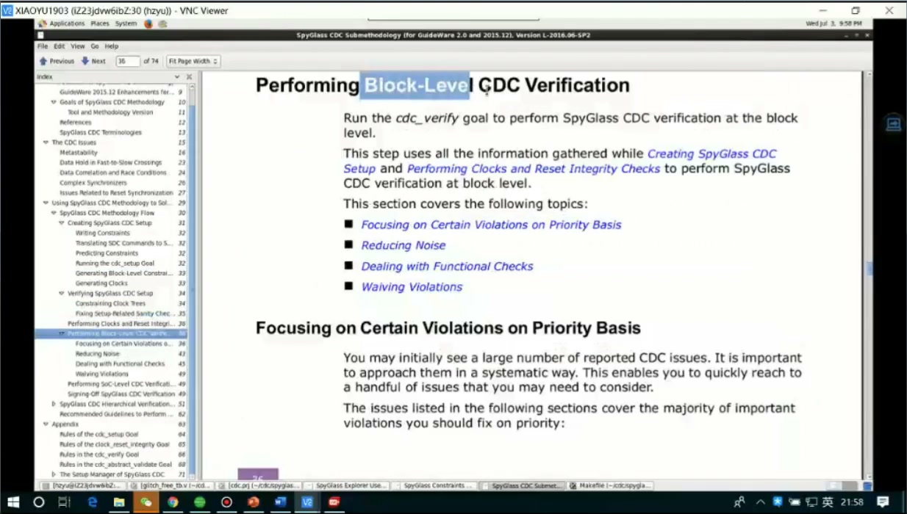

CDC 约束通常要表达：

```text
哪些是时钟
哪些是复位
哪些是生成时钟
哪些是 gated clock
哪些跨域结构是合法同步结构
哪些路径要排除或特殊处理
```

如果没有 clock 约束，工具不知道两个寄存器是否属于不同 clock domain。如果 reset 没声明，RDC/复位释放风险也可能被错误归类。

## 6. generated clock：不要让工具误判时钟关系

课程讲 generated clock：

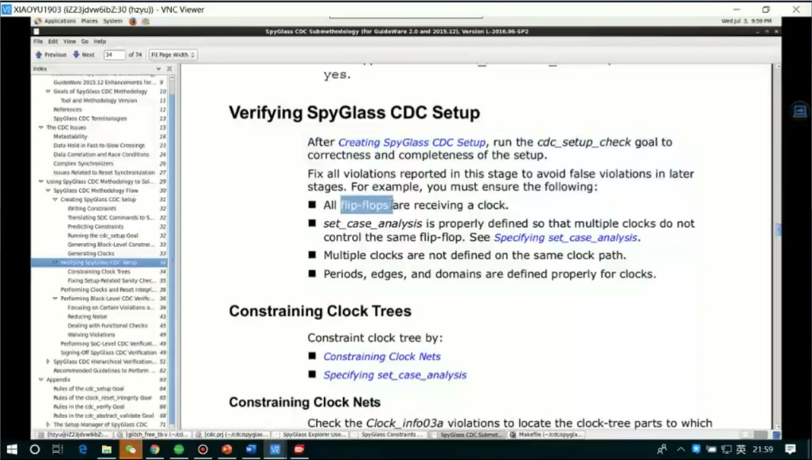

生成时钟来自分频、门控、PLL 或组合/时序逻辑生成。如果工具不知道它和源时钟的关系，就可能把本来相关的时钟当成异步，或者把真正异步的路径漏掉。

**深挖：为什么 generated clock 约束会影响 CDC 结果？**

CDC 的核心是 clock domain 的关系判断。工具要先判断：

```text
source flop clock domain -> destination flop clock domain
```

如果 clock tree 建错，后面的 CDC violation 分类全都会偏。也就是说，CDC 报告质量取决于 clock/reset 约束质量。

## 7. 运行检查后要验证 setup，而不是直接看 violation 数量

课程打开 `Verifying SpyGlass CDC Setup`：

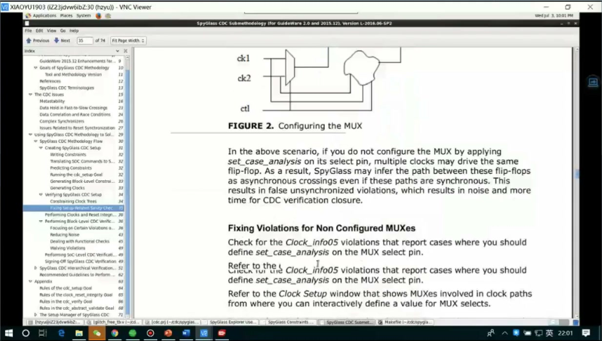

好的流程是：

1. 先确认设计能读入。
2. 确认 top 正确。
3. 确认 clock/reset 识别完整。
4. 确认 generated clock/gated clock 没漏。
5. 再看 CDC violation。

不要一上来只看 violation 个数。violation 很多不一定代表设计差，也可能是约束没写；violation 很少也不一定安全，可能是工具没识别到 clock。

## 8. CDC report：重点看结构类别和修复路径

课程文档里出现 CDC issues：


看 CDC 报告时，建议按问题类型分组：

| 类型 | 典型含义 | 修复方向 |
|---|---|---|
| unsynchronized crossing | 跨域未同步 | 加同步器/握手/FIFO |
| reconvergence | 多个同步信号重新汇合 | 合并控制、改协议、握手 |
| multi-bit crossing | 多 bit 数据直接跨域 | 异步 FIFO、握手保持、Gray code |
| reset crossing | 复位释放跨域 | 异步 assert、同步 deassert |
| generated/gated clock issue | 时钟关系不清 | 补充时钟约束 |

## 9. 深挖：CDC 工具不是替你“修电路”

SpyGlass/VC SpyGlass 能找结构风险，但它不会自动知道你的设计意图。一个 CDC violation 可能有三种处理：

1. RTL 真有问题，需要改同步结构。
2. 约束不完整，需要补 clock/reset/SGDC。
3. 结构合法但工具无法推断，需要 waiver 或建模说明。

真正的工程能力是区分这三种情况。不能看到 violation 就全部 waive，也不能看到很多 violation 就盲目改 RTL。

## 10. 工程分诊表：violation 不是越少越好，而是要分类闭环

| 类别 | 典型含义 | 处理原则 |
|---|---|---|
| setup violation | clock/reset/top/filelist 没建好 | 先修 setup，否则后面 CDC 结果不可信 |
| true CDC bug | 信号跨域没有同步协议 | 改 RTL，同步器/握手/FIFO/Gray code 选一种正确结构 |
| constraint missing | 工具不知道 generated clock、reset 或 false path 关系 | 补 SGDC/约束，再重跑 |
| reconvergence risk | 多个同步后的信号重新组合 | 检查协议是否保证一致性，必要时改成单控制或握手 |
| multi-bit crossing | 多 bit 数据直接跨域 | 用异步 FIFO、握手保持或 Gray 编码，不要只给每 bit 打两拍 |
| waived item | 结构合法但工具无法证明 | waiver 必须有设计意图、证据和责任人，不能为了清零报告 |

工程上最危险的不是 violation 很多，而是把三类东西混在一起：setup 没配好导致的假问题、RTL 真实 CDC bug、以及需要建模/waive 的合法结构。正确流程是先让 setup 干净，再分类看 violation，最后每条都有“改 RTL / 补约束 / 有证据 waiver”的结论。

## 11. 深挖：waiver 是工程承诺，不是删除红字

CDC waiver 的含义不是“这个 warning 我不想看了”，而是“我确认这条结构在设计协议下安全，并愿意留下证据”。最低限度应包含：

- 这条 crossing 属于哪种结构。
- 为什么现有 RTL/协议能保证安全。
- 依据是代码、波形、形式验证、架构说明还是上级约束。
- 如果以后信号宽度、时钟关系、协议改变，waiver 是否失效。

如果无法写清这些内容，就说明它不应该被 waive，而应该继续分析或修改 RTL。这个习惯非常重要，因为 CDC 问题往往不是每次仿真都能复现；把真实 bug 误 waive 掉，后面可能变成芯片级偶发问题。

## 12. 环境问题：`libQtCore` 这类问题属于工具依赖，不是设计错误

课程最后处理同学环境问题：

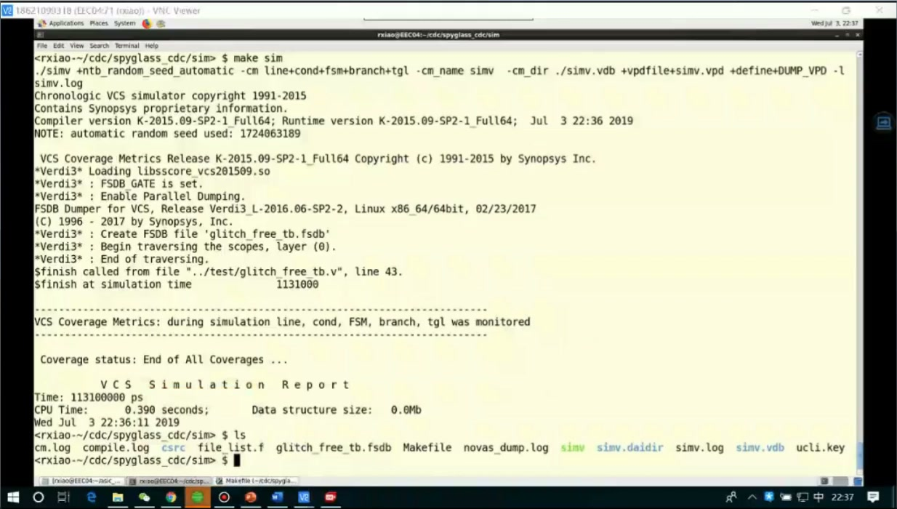

报错里出现类似：

```text
libQtCore.so...
Abnormal Termination
```

这通常是 GUI/Qt 运行库或环境变量问题，不是 RTL 或 CDC 约束错误。处理方向：

- 检查 SpyGlass 安装路径和 license。
- 检查依赖库是否安装。
- 检查 `LD_LIBRARY_PATH`。
- 能命令行跑就先命令行验证，GUI 问题单独处理。

## 13. 推荐实操流程

```text
准备 RTL/filelist
  -> 创建 SpyGlass 工程
  -> 设置 top
  -> 选择 CDC goal
  -> 添加 clock/reset/generated clock 约束
  -> 跑 setup 验证
  -> 跑 CDC check
  -> 按类型看 report
  -> 修 RTL / 补约束 / 合理 waiver
  -> 重跑确认
```

最小检查清单：

- [ ] RTL 文件全部读入。
- [ ] top module 正确。
- [ ] 所有 clock 被识别。
- [ ] reset 被识别。
- [ ] generated/gated clock 不漏。
- [ ] violation 有分类、有处理结论。
- [ ] waiver 有理由，不能只为清零报告。

## 14. 自测题

1. 为什么 CDC 检查前要先确认 clock/reset 识别完整？
2. generated clock 约束写错会怎样影响 CDC 报告？
3. CDC violation 的处理为什么不等于“一律改 RTL”？
4. filelist 相比 GUI 手动加文件有什么工程优势？
5. `libQtCore` 报错更像工具环境问题，还是设计 CDC 问题？
6. 一个 CDC waiver 最少应该说明哪三类证据？

## 参考资料

- 本视频与对应字幕。
- Synopsys VC SpyGlass 官方产品页：RTL 静态 signoff，覆盖 RTL 构造、CDC、RDC 等早期静态验证：<https://www.synopsys.com/verification/static-and-formal-verification/vc-spyglass.html>
- Clifford E. Cummings, “Clock Domain Crossing (CDC) Design & Verification Techniques Using SystemVerilog”：<http://www.sunburst-design.com/papers/CummingsSNUG2008Boston_CDC.pdf>
